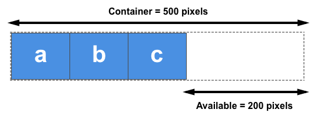

# 布局

布局的方式主要有流动布局（默认堆叠）、浮动布局、定位布局和弹性布局。`PC`端还有多列布局和网格布局（`CSS3`）。

<hr>

### 标准流

标准流是浏览器的默认布局方式，即：块级盒子从上到下依次堆叠，行级与行内块盒子从左到右依次排列。

 

<hr>

### 浮动布局

使用`float`定义浮动布局的模式。【浮动用于将多个块级盒子依次紧密地水平排列】

 

 

 

注释：

- 浮动是原始的布局方式，原先用于处理图片的文本的排列关系（使文本围绕图片流动）。
- 现在，浮动盒子周围的文本和行内元素都会围绕着它流动；块级元素则自动补其位置。
- 浮动的盒子不再占据空间，普通的盒子会自动补齐空位而被覆盖。因此，需要清除浮动。
- 浮动模式会清除每个盒子周围的所有空格，使它们紧紧地靠在一起，放不下的自动换行。
- 浮动解决了空格解析和父子元素上边距塌陷的问题，但`margin`只能使用具体的值（无法自动居中）。

属性值：

- `none`：关闭浮动，默认值。
- `left`：使元素在其父容器中左浮动
- `right`：使元素在其父容器中右浮动


##### 清除浮动

清除浮动一般是作用在对应的父元素上。

- 当父元素未指定高度，且其内所有子元素都浮动时，父元素会失去高度，此时需要清除浮动。
- 清除方法：为父元素指定高度、额外标签法、伪元素清除法或者`BFC`语法。
- `clear`用于清除浮动（哪一侧不允许出现浮动元素），取值：`left`清除左浮动、`right`清除右浮动、`both`清除两侧浮动。
- 额外标签法：在浮动元素的末尾添加一个块级空标签（通常是`<br>`），像一堵墙一样阻止元素继续浮动，被称为隔墙法。
- 伪元素清除法：额外标签法的变种，利用父元素的伪元素充当墙体，然后借助`clear`清除浮动。
- `BFC`语法：将父元素`BFC`化，只要父元素满足下列任一条件即可：
  - 根元素
  - 开启浮动
  - 非静态定位和相对定位
  - `overflow`不为`visible`
  - `display`为`inline-block / table-cell / table-caption / flex / inline-flex`之一

```html
<style>
    /* after伪元素清除法 */
    .clearfix:after {
        content: "";
        display: block;
        height: 0;
        clear: both;
        visibility: hidden;
    }
    .clearfix {
        *zoom: 1; /* IE6、7专有 */
    }
    
    /* 双伪元素清除法
    .clearfix:before,
    .clearfix:after {
        content: "";
        display: table;
    }
    .clearfix:after: {
        clear: both;
    }
    .clearfix {
        *zoom: 1;
    } */
</style>
<body>
    <ul class="clearfix">
        <li></li>
        <li></li>
        ...
    </ul>
</body>
```


##### 元素模式

开启浮动会改变元素的原`display`模式，大部分改为块级元素。

| 指定值               | 计算值      |
| :------------------- | :---------- |
| `inline`             | `block`     |
| `inline-block`       | `block`     |
| `inline-table`       | `table`     |
| `table-row`          | `block`     |
| `table-row-group`    | `block`     |
| `table-column`       | `block`     |
| `table-column-group` | `block`     |
| `table-cell`         | `block`     |
| `table-caption`      | `block`     |
| `table-header-group` | `block`     |
| `table-footer-group` | `block`     |
| `inline-flex`        | `flex`      |
| `inline-grid`        | `grid`      |
| *other*              | *unchanged* |

案例：将八个块级元素水平排列

```html
<head>
	<style>
        * {
            margin: 0;
            padding: 0;
        }
        ul {
            width: 430px;
            overflow: hidden;
            list-style: none;
        }

        li {
            float: left;
            width: 100px;
            height: 100px;
            background-color: antiquewhite;
        }

        li:nth-of-type(n-4) {
            margin-bottom: 10px;
        }

        li:not(:nth-of-type(4n)) {
            margin-right: 10px;
        }
    </style>
</head>

<body>
    <ul>
        <li></li>
        <li></li>
        <li></li>
        <li></li>
        <li></li>
        <li></li>
        <li></li>
        <li></li>
    </ul>
</body>
```

 

<hr>

### 定位布局

定位用于精确地控制一个元素在文档流中的位置，这是其他布局方式都做不到的。

使用`position`属性定义定位布局，定位分为：静态定位、相对定位、绝对定位、固定定位和粘性定位。


##### 定位类型

- 静态定位（`static`）：无定位，遵循流动布局，默认值。【无法使用方向关键字以及`z-index`属性】
- 相对定位（`relative`）：相对于元素的初始位置进行定位，保留元素在文档流中的占位空间。
- 绝对定位（`absolute`）：相对于第一个有定位的祖先元素进行定位，脱离文档流，漂浮在空中。
- 固定定位（`fixed`）：特殊的绝对定位，相对于浏览器窗口进行定位，固定在一个位置。
- 粘性定位（`sticky`）：相对定位与固定定位的结合，相对于浏览器窗口定位但不脱标。【配合滚动使用】


##### 叠放次序

使用`z-index`定义定位元素的叠放次序，定位元素会发生相互覆盖的情况（浮动则不会）。

​                 


##### 居中显示

- 脱标的元素都不能再使用`margin: 0 auto;`来实现水平居中，如：浮动和绝对定位。
- 但绝对定位可以使用如下代码实现该元素在其有定位的祖先元素中，水平居中和垂直居中。

```css
/* 第一种：使用margin来居中 */
position: absolute;
top: 0;
bottom: 0;
left: 0;
right: 0;
margin: auto;

/* 第二种：使用transform来居中 */
position: absolute;
top: 50%; /* %以父级元素的宽高为参考 */
left: 50%;
transform: translate(-50%,-50%); /* %以元素自身的宽高为参考 */

/* 拓展：当定位的四个方向均为0，且盒子未设置宽高时，默认占满一屏 */
position: absolute;
top: 0;
bottom: 0;
left: 0;
right: 0;
```

注释：相对定位和固定定位的元素会脱标，脱标的元素没有父子元素上边距塌陷的问题。【触发`BFC`语法】

<hr>

### 弹性布局

将`display`的值设为`flex`可以定义弹性布局，弹性布局已成为主流的布局方式，尤其是在移动端。

弹性布局具有两根轴线：主轴和副轴（交叉轴），副轴垂直于主轴。


##### 定义主轴

使用`flex-direction`定义主轴

- `row`：定义横轴（`x`轴）为主轴，默认从左往右正向延伸。
- `row-reverse`：与`row`相同，反向延伸（交换起止线）
- `column`：定义竖轴（`y`轴）为主轴，默认从上往下正向延伸。
- `column-reverse`：与`column`相同，反向延伸（交换起止线）


##### 起止线

书写模式从左往右，主轴起始线在左，终止线在右；书写模式从右往左，主轴起始线在右，终止线在左。

注释：

- 弹性布局模式下，只有子元素才具有弹性的效果。
- 弹性元素在主轴上，从起始线开始依次紧密排列，默认自适应宽度，强制一行内显示。
- 在副轴上，默认自适应高度，拉伸高度以填满副轴大小。


##### 换行显示

使用`flex-wrap`属性可以定义主轴元素换行显示。

- `no-wrap`：不允许换行，默认值
- `wrap`：在需要时换行显示
- `wrap-reverse`：在需要时换行显示，反向。

`direction`与`wrap`的组合属性：`flex-flow`属性，第一个参数是`direction`的值，第二个参数是`wrap`的值。


##### 初始尺寸

使用`flex-basis`可以定义元素在主轴上的初始尺寸。

  


##### 元素增长

使用`flex-grow`可以定义按指定比例将可用空间分配给各元素。【正整数：以总和为分母，以各值为分子】


##### 元素收缩

在元素总宽超出容器（可用空间为负）时，使用`flex-shrink`将超出宽度按比例收缩元素以刚好填满容器。

`flex`简写属性：`flex`属性是`grow、shrink、basis`三属性的简写属性（放大元素、缩小元素、初始尺寸）。

- `initial`：重置为`flexbox`的初始值，相当于`flex: 0 1 auto`
- `auto`：元素既可收缩也可拉伸，相当于`flex: 1 1 auto`
- `none`：元素不可伸缩，相当于`flex: 0 0 auto`


##### 主轴方向对齐

使用`justify-content`可以定义元素在主轴方向上的对齐方式。

- `flex-start`：元素从起始线开始对齐，默认值（左或顶部对齐）。
- `flex-end`：元素从终止线开始对齐（右或底部对齐）。
- `center`：居中对齐。
- `space-between`：元素等距离对齐（等比例分配可用空间），首尾元素紧贴容器壁。
- `space-around`：将可用空间等比例分配给每个元素的左右或上下两侧。
- `space-evenly`：元素等距离对齐，各元素之间的间隔相等，首尾元素有间隔。


##### 副轴方向对齐

使用`align-items`可以定义元素在副轴方向上的对齐方式。

- `stretch`：拉伸高度以适应容器，默认值。
- `flex-start`：起始线对齐
- `center`：居中对齐
- `flex-end`：终止线对齐
- `baseline`：容器的基线对齐
- `space-between`：元素等距离对齐（等比例分配可用空间），首尾无空间。
- `space-around`：将可用空间等比例分配给每个元素的左右或上下两侧。


##### 元素单独对齐

使用`align-self`可使该元素脱离`align-items`的对齐，单独定义自身的对齐方式。


##### 弹性线对齐

当具有多行元素时（`wrap`），可使用`align-content`定义多行元素（弹性线）的对齐方式。

- `stretch`：拉伸高度以适应容器，默认值。【元素分开】
- `flex-start`：起始线对齐【元素堆叠】
- `center`：居中对齐【元素堆叠】
- `flex-end`：终止线对齐【元素堆叠】
- `baseline`：容器的基线对齐【元素堆叠】
- `space-between`：元素等距离对齐（等比例分配可用空间），首尾无空间。
- `space-around`：将可用空间等比例分配给每个元素的左右或上下两侧。


##### 排列次序

使用`order`可以定义各元素的排列次序，为确保次序正常应给每个元素都设置`order`次序。

<hr>

### 多列布局

`CSS` 多列布局允许我们轻松定义多列文本，就像报纸那样：

 

**多列属性**：

- `column-count`：指定最佳列数，将容器划分为多少列，自动均分容器。
- `column-gap`：规定列之间的间隔，默认值`normal`（取`font-size`的值：`1em`）。
- `column-rule-style`：规定列之间的尺线样式。
- `column-rule-width`：规定列之间的尺线宽度。
- `column-rule-color`：规定列之间的尺线颜色。
- `column-rule`：简写属性，其值依次是尺线的宽度、样式与颜色。
- `column-span`：规定容器中的某元素应跨越多少列，关键字值包括`none`（不跨列）和`all`（横跨所有列）。
- `column-fill`：规定栏目的高度是否统一，值包括`auto`（自适应内容）和`balance`（统一为最高的列高）。
- `column-width`：规定列的最佳宽度，当`colum-count`值为`auto`时生效。
- `columns`：简写属性，依次代表`width`和`count`属性。

注释：一般地，当指定`count`时，`width`的值会为`auto`；指定`width`时，`count`的值会为`auto`。

```css
div {
    column-count: 3;
    column-gap: 3em;
    column-rule: 2px dotted gray;
    line-height: 2.5em;
}
div h1 {
    column-span: all;
}
```

<hr>

### 网格布局

网格布局是`CSS3`新增的布局系统，与`flex`相似。但`flex`是一维布局，`grid`是二维布局。

如需使 `HTML` 元素充当网格容器，必须把 `display` 属性值设置为 `grid` 或 `inline-grid`。

 


##### 网格列数

使用`grid-template-columns`属性，规定网格的列数及其宽度。

注释：值的数量决定列数，以空格分隔，一个值对应一列，值即为宽度。【列宽都相同时，值可设为`auto`】

| 值            | 描述                                       |
| :------------ | :----------------------------------------- |
| `none`        | 默认值，在需要时创建列。                   |
| `auto`        | 自适应尺寸，取决于容器以及项目内容的大小。 |
| `max-content` | 根据列中最大的项目设置每列的尺寸。         |
| `min-content` | 根据列中最小的项目设置每列的尺寸。         |
| *`length`*    | 设置列的尺寸，通过使用合法的长度值。       |

```css
div {
    display: grid;
    grid-template-columns: auto auto auto; /* 3列宽度相同的网格 */
}
```


##### 网格行数

使用 `grid-template-rows` 属性，规定网格的行数及其高度。【用法与`columns`相同】

```css
div {
    display: grid;
    grid-template-rows: auto auto auto; /* 3行高度相同的网格 */
}
```


##### 引用项目

使用 `grid-template-areas` 属性，可以引用指定名称的项目。

注释：

- 属性值为字符串，每个字符串代表一行，空格或换行分隔。
- 在每行的字符串内引用指定名称的项目，无名项目以英文的句号表示。
- 字符串数决定行数，项目数决定列数。多余项目以指定列数另行显示。
- 重复引用同一项目，表示该项目在指定的位置上可跨越该行或该列。

```css
.item1 {
	grid-area: myArea; /* 指定项目名称为：myArea */
}

.grid-container {
  	display: grid;
  	grid-template-areas:
    'myArea myArea . . .'
    'myArea myArea . . .'; /* 在网格容器中引用指定项目：该项目从所在位置开始跨越两行两列 */
}
```

**简写属性**：`grid-template` 属性是`grid-template-rows、grid-template-columns、grid-template-areas`三个属性的简写属性。

| 值                                           | 描述                         |
| :------------------------------------------- | :--------------------------- |
| `none`                                       | 默认值。不规定列或行的尺寸。 |
| `grid-template-rows / grid-template-columns` | 规定列和行的尺寸，组合值。   |
| `grid-template-areas`                        | 规定使用命名项目的网格布局。 |
| `initial`                                    | 将此属性设置为其默认值。     |
| `inherit`                                    | 从其父元素继承此属性。       |

```css
/* 行高与列宽的组合值，以/分隔的每一对值，分别对应所在行列的行高与列宽 */
.grid-container {
  	display: grid;
  	grid-template: 150px / auto auto auto; /* 第一行的行高为150px，而所有的列宽相等 */
}

/* 使用命名项目 */
.item1 {
  	grid-area: myArea;
}
.grid-container {
  	display: grid;
  	grid-template:
    	'myArea myArea . . .'
    	'myArea myArea . . .';
}
```


##### 行列间隙

使用 `grid-gap` 属性，定义网格中行间和列间的间隙尺寸，由`grid-row-wrap`和`grid-column-wrap`属性组成。

```css
.grid-container {
  	grid-gap: 20px 50px; /* 行间隙20px；列间隙50px */
}
```


##### 默认列宽

使用 `grid-auto-columns` 属性，规定列的默认宽度。

注释：当列宽被修改时，默认列宽将被新值覆盖。


##### 默认行高

使用 `grid-auto-rows` 属性，规定行的默认高度。


##### 自动放置

使用 `grid-auto-flow` 属性，控制如何将自动放置的项目插入到网格中。

```css
/* 逐列插入自动放置的项目 */
.grid-container {
  	display: grid;
  	grid-auto-flow: column;
}
```

| 值             | 描述                                                         |
| :------------- | :----------------------------------------------------------- |
| `row`          | 默认值，通过填充每一行来放置项目。【逐行插入】               |
| `column`       | 通过填充每一列来放置项目。【逐列插入】                       |
| `dense`        | 放置项目以填充网格中的任何孔。【逐孔插入】                   |
| `row dense`    | 通过填充每一行来放置项目，并填充网格中的任何孔。【逐行逐孔插入】 |
| `column dense` | 通过填充每一列来放置项目，并填充网格中的任何孔。【逐列逐孔插入】 |


##### 项目跨列

使用 `grid-column`属性，规定当前项目可跨越的列数。

注释：

- `grid-column` 属性是 `grid-column-start` 和 `grid-column-end` 属性的简写属性。
- 两数值以`/`分隔，分别表示起止位置。也可使用`span`关键字将第二数值指定为列数。

```css
/* 从第1列开始，到第5列前结束 */
.item1 {
	grid-column: 1 / 5;
}

/* 从第1列开始，横跨3列 */
.item1 {
	grid-column: 1 / span 3;
}

/* 从第2列开始，横跨3列 */
.item2 {
	grid-column: 2 / span 3;
}
```


##### 项目跨行

使用 `grid-row` 属性，规定当前项目可跨越的行数。

注释：`grid-row` 属性是 `grid-row-start` 和 `grid-row-end` 属性的简写属性。

简写属性：`grid-area`属性是`grid-row-start、grid-column-start、grid-row-end` 和 `grid-column-end` 的简写。

```css
/* 前两个值是行和列的开始位置，后两个值是行和列的结束位置 */
.item8 {
	grid-area: 1 / 2 / 5 / 6;
}
/* 使用关键字 */
.item8 {
  grid-area: 2 / 1 / span 2 / span 3; /* 从第2行第1列开始，跨越2行3列 */
}
```


##### 命名项目

使用`grid-area` 属性，还可以为网格项目定义一个名称。

注释：在网格容器可通过 `grid-template-areas` 属性来引用指定名称的网格项目。

```css
.item1 {
	grid-area: myArea;
}
.grid-container {
	grid-template-areas: 'myArea myArea myArea myArea myArea'; /* 跨越所在行的所有列 */
}
```

案例：设计如下的常用布局

 

```html
<style>
.item1 { grid-area: header; }
.item2 { grid-area: menu; }
.item3 { grid-area: main; }
.item4 { grid-area: right; }
.item5 { grid-area: footer; }

.grid-container {
    display: grid;
	grid-template-areas:
    	'header header header header header header'
    	'menu main main main right right'
    	'menu footer footer footer footer footer';
    grid-gap: 10px;
  	background-color: #2196F3;
  	padding: 10px;
}
    
.grid-container > div {
  	background-color: rgba(255, 255, 255, 0.8);
  	text-align: center;
  	padding: 20px 0;
  	font-size: 30px;
}
</style>

<div class="grid-container">
	<div class="item1">Header</div>
  	<div class="item2">Menu</div>
  	<div class="item3">Main</div>  
  	<div class="item4">Right</div>
  	<div class="item5">Footer</div>
</div>
```


##### 项目顺序

由于`grid-area`属性，是`grid-row-start、grid-column-start、grid-row-end` 和 `grid-column-end` 的简写。

因此，使用`grid-area`属性可以为每个项目指定它们在网格容器中的顺序。

注释：

- 前两个值表示行和列开始的位置，后两个值表示行和列结束的位置。
- 当开始位置与结束位置之间，只相差1格或省略结束位置时，表示项目自身，不跨行列。

```css
.grid-container {
  	display: grid;
 	grid-template-columns: auto auto auto;
  	grid-gap: 10px;
  	background-color: #2196F3;
  	padding: 10px;
}

.grid-container > div {
  	background-color: rgba(255, 255, 255, 0.8);
  	text-align: center;
  	padding: 20px 0;
  	font-size: 30px;
}

.item1 { grid-area: 1 / 3; }
.item2 { grid-area: 2 / 3 / 3/ 4; }
.item3 { grid-area: 1 / 1; }
.item4 { grid-area: 1 / 2 / 2 / 3; }
.item5 { grid-area: 2 / 1; }
.item6 { grid-area: 2 / 2; }
```

