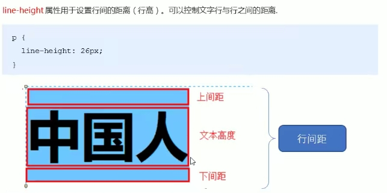

# 文本样式

文本样式包括：字体和文本格式。【属于继承属性】

<hr>

### 字体

字体的样式包括：字体类型、字体大小、颜色、加粗、修饰线、斜体、大小写格式等。


##### 字体类型

使用`font-family`定义字体类型，值为一个字体库列表，以逗号分隔。【字体库名称包含空格的，用引号包裹】

在 `CSS` 中，有五个通用字体族：

- 衬线字体（`Serif`）： 在每个字母的边缘都有一个小的笔触。它们营造出一种形式感和优雅感。
- 无衬线字体（`Sans-serif`）： 字体线条简洁（没有小笔画）。它们营造出现代而简约的外观。
- 等宽字体（`Monospace`）： 这里所有字母都有相同的固定宽度。它们创造出机械式的外观。
- 草书字体（`Cursive`）： 模仿了人类的笔迹。
- 幻想字体（`Fantasy`）： 是装饰性/俏皮的字体。

注释：所有不同的字体名称都属于这五个通用字体系列之一。

| 通用字体族   | 字体名称实例                               |
| :----------- | :----------------------------------------- |
| `Serif`      | `Times New Roman`、 `Georgia`、 `Garamond` |
| `Sans-serif` | `Arial、 Verdana、 Helvetica`              |
| `Monospace`  | `Courier New、 Lucida Console、 Monaco`    |
| `Cursive`    | `Brush Script MT、 Lucida Handwriting`     |
| `Fantasy`    | `Copperplate、 Papyrus`                    |

```css
font-family: "Times New Roman", Times, serif, Arial, Helvetica, sans-serif;
```


##### 字体大小

使用`font-size`定义字体大小。【可以是绝对尺寸或相对尺寸】

绝对尺寸：

- 将文本设置为指定大小【`px`】
- 不允许用户在所有浏览器中更改文本大小（可访问性不佳）
- 当输出的物理尺寸已知时，绝对尺寸很有用

相对尺寸：

- 设置相对于周围元素的大小【`%`、`em`、`vw`】
- 允许用户在浏览器中更改文本大小

**注释：**如果您没有指定字体大小，则普通文本（如段落）的默认大小为 `16px`（`16px = 1em`）。

使用`em`设置字号：

- 为了允许用户调整文本大小（在浏览器菜单中），许多开发人员使用 `em` 而不是`px`。

- `W3C` 建议使用 `em` 尺寸单位。

- `1em` 等于当前字体大小。浏览器中的默认文本大小为 `16px`。因此，默认大小 `1em` 为 `16px`【`1em = 16px`】
- 但要注意，子元素的字号以父元素的字号为`1em`作为参考计算。因此使用`em`时要考虑结构层次，不超过2层。

使用`%`设置字号：与`em`的效果一样，但`1em = 100%`。

使用`vw`设置字号：使用`vw`单位，文本大小将遵循浏览器窗口的大小（`viewport width`）【窗口大小 = `100vw`】


##### 斜体

使用`font-style`定义字体的倾斜效果。

此属性可设置三个值：

- `normal` - 文字正常显示
- `italic` - 文本以斜体显示
- `oblique` - 文本为“倾斜”（倾斜与斜体非常相似，但支持较少）


##### 粗体

使用`font-weight`定义字体的粗细效果。

属性值：

- `normal`为默认值，表示正常字体，相当于400
- `bold`表示粗体，相当于700
- `bolder`和`lighter`是相对于`normal`字体（继承值）的加粗加细
- 数字值：`100 - 900`，由细到粗。


##### 变体

使用`font-variant`定义字体的变体效果。

属性值：

- `normal`：默认值，表示正常字体。
- `small-caps`：表示小型的大写字母。【适用于拉丁字体】

提示：在 `small-caps` 字体中，全部转换为大写字母。但字号小于文本中的原始大写字母。


##### 简写属性

使用`font`属性可一次性设置字体的所有样式，称为简写属性。【各属性值以空格分开】

最常用的属性值：`font: style variant weight size/line-height family`

| 值                        | 描述                                                         |
| :------------------------ | :----------------------------------------------------------- |
| *`font-style`*            | 规定字体样式。参阅：`font-style` 中可能的值。                |
| *`font-variant`*          | 规定字体异体。参阅：`font-variant` 中可能的值。              |
| *`font-weight`*           | 规定字体粗细。参阅：`font-weight` 中可能的值。               |
| *`font-size/line-height`* | 规定字体尺寸和行高。参阅：`font-size` 和 `line-height` 中可能的值。 |
| *`font-family`*           | 规定字体系列。参阅：`font-family` 中可能的值。               |
| `caption`                 | 定义被标题控件（比如按钮、下拉列表等）使用的字体。           |
| `icon`                    | 定义被图标标记使用的字体。                                   |
| `menu`                    | 定义被下拉列表使用的字体。                                   |
| `message-box`             | 定义被对话框使用的字体。                                     |
| `small-caption`           | `caption` 字体的小型版本。                                   |
| `status-bar`              | 定义被窗口状态栏使用的字体。                                 |


##### 自定义字体

使用`@font-face`命令可以引用网络字体文件，如：字体图标、艺术字体等。

| 字体描述符      | 值                                                           | 描述                                                         |
| :-------------- | :----------------------------------------------------------- | :----------------------------------------------------------- |
| `font-family`   | 字体库名称                                                   | 必需。定义字体名称。                                         |
| `src`           | `URL`                                                        | 必需。引入字体文件的 `URL`。                                 |
| `font-stretch`  | `normal`、<br />`condensed`、<br />`ultra-condensed`、<br />`extra-condensed`、<br />`semi-condensed`、<br />`expanded`、<br />`semi-expanded`、<br />`extra-expanded`、<br />`ultra-expanded` | 可选。定义应如何拉伸字体。默认值是 "`normal`"。              |
| `font-style`    | `normal、italic、oblique`                                    | 可选。定义字体样式。默认值是 "`normal`"。                    |
| `font-weight`   | `normal、bold、100 - 900`                                    | 可选。定义字体的粗细。默认值是 "`normal`"。                  |
| `unicode-range` | `unicode-range`                                              | 可选。定义字体支持的 `Unicode` 字符范围。默认值是 "`U+0-10FFFF`"。 |


##### 字体图标

字体图标是一种文字，需要先下载，然后引用到`CSS`中才可使用。

推荐下载网站：

- 国外`iconmoon`字体库：http://www.iconmoon.io
- 阿里`iconfont`字体库：http://www.iconfont.cn

字体格式：

- `ttf`：`TrueType`，是`windows`和`mac`最常见的字体。
- `woff`：`Web Open Font Format`，网络开放字体。
- `eot`：`Embedded Open Type`，是`IE`的专用字体。
- `svg`：基于`SVG`渲染的一种字体。

引入和使用：

- 引入：将下载的`font`文件夹移入到项目根目录下，然后在`CSS`中引入字体文件。
- 使用：通过`font-family`调用指定的字体图标，将图标的编号或符号代码植入指定的结构。

三种使用方式：

`Unicode`引用：`unicode`是字体在网页端最原始的应用方式，特点是：兼容性最好，单色图标。

```html
<style>
    /* 引入字体文件，注意路径的问题 */
	@font-face {
        font-family: 'iconfont';
    	src: url('iconfont.eot');
    	src: url('iconfont.eot?#iefix') format('embedded-opentype'),
    	url('iconfont.woff') format('woff'),
    	url('iconfont.ttf') format('truetype'),
    	url('iconfont.svg#iconfont') format('svg');
	}
    /* 字体图标的基础样式 */ 
    .iconfont {
    	font-family:"iconfont" !important;
    	font-size:16px;
        font-style:normal;
    	-webkit-font-smoothing: antialiased;
    	-webkit-text-stroke-width: 0.2px;
    	-moz-osx-font-smoothing: grayscale;
    }
</style>
<body>
    <i class="iconfont">&#x33;</i>  <!-- 通过不同的图标编码使用不同的图标 -->
</body>
```

类引用：`font-class`是`unicode`使用方式的一种变种，主要是解决`unicode`书写不直观，语意不明确的问题，兼容性良好。

```html
<style>
	@font-face {
        font-family: 'iconfont';
    	src: url('iconfont.woff') format('woff'),
             url('iconfont.woff2') format('woff2'),
    		 url('iconfont.ttf') format('truetype');
    }
    
    .iconfont {
    	font-family:"iconfont" !important;
    	font-size:16px;
        font-style:normal;
    	-webkit-font-smoothing: antialiased;
    	-moz-osx-font-smoothing: grayscale;
    }
    /* 购物车图标 */
    .icon-shopcar:before {
        content: "\e600";
    }
</style>

<body>
    <span class="iconfont icon-shopcar"></span>
</body>
```

`symbol`引用：支持多色图标，未来主流。目前兼容性一般，通过`svg`渲染（浏览器渲染`svg`的性能也一般），需引入`JS`文件。

```html
<head>
    <script src="./iconfont/iconfont.js"></script>
    <style>
        .icon {
            width: 1em;
            height: 1em;
            vertical-align: -0.15em;
            fill: currentColor;
            overflow: hidden;
        }
        
        .icon-dajumao:before {
            content: "\e626";
        }
    </style>
</head>
<body>
    <svg class="icon" aria-hidden="true">
    	<use xlink:href="#icon-dajumao"></use> <!-- 通过指定href的值，应用不同的类样式 -->
    </svg>
</body>
```

<hr>

### 文本

文本格式包括：行高、对齐、间距、缩进、换行、书写模式、阴影等。


##### 行高

使用`line-height`定义文本的行高（行间距）。行高包括：字体大小以及上下间距三个部分。

​                

提示：行高主要控制所在行的行框高度（实际上两行文本基线之间的距离），它会影响页面的布局。


##### 对齐

文本对齐分为：水平对齐和垂直对齐。

**注释**：

- 字体的五条参考线：顶线（`text-top`）、上基线（`super`）、基线（`baseline`）、下基线（`sub`）、底线（`text-bottom`）。
- 没有基线的元素，使用外边距的下边缘替代，如：图片。

水平对齐：使用`text-align`定义文本的水平对齐。

- `left` - 左对齐；`right` - 右对齐；`center` - 居中对齐；`justify` - 两端对齐（不包括最后一行）。
- `start`：内容对齐开始边界；`end`：结束边界；`justify-all`：所有行两端对齐（包括最后一行）。
- `match-parent`：与`inherit`类似，区别在于`start`和`end`的值由父元素的`direction`确定，并被替换为恰当的`left`或`right`。

垂直对齐：使用`vertical-align`定义文本的垂直对齐。

- `auto`：自动对齐；
- `baseline`：使元素的基线与父元素的基线对齐（默认值）；【基线与基线】
- `sub`：使元素的基线与父元素的下标基线对齐；【基线与下基线】
- `super`：使元素的基线与父元素的上标基线对齐；【基线与上基线】
- `text-top`：使元素的顶部与父元素的字体顶部对齐；【顶线与顶线】
- `text-bottom`：使元素的底部与父元素的字体底部对齐；【底线与底线】
- `middle`：使元素的中部与父元素的基线加上父元素高度的一半对齐；【基线偏下】
- `top`：使元素及其后代元素的顶部与整行的顶部对齐；【顶线与顶线】
- `bottom`：使元素及其后代元素的底部与整行的底部对齐；【底线与底线】
- `length`：自定义元素的基线与父元素的基线的之间的偏移量，负上正下。【基线与基线】

**提示**：使用`vertical-align`，可解决图片基线（外边距的下边缘）与文本基线对齐的默认样式。


##### 间距

文本间距：包括字距和词距。

字距是两字母或汉字之间的距离，使用`letter-spacing`定义。

词距是两单词或中文词语之间的距离，使用`word-spacing`定义。


##### 首行缩进

使用`text-indent`定义文本的首行缩进，建议使用`em`单位，`em`表示一个字距。

**提示**：暂不支持`each-line`和`hanging`两个属性值。


##### `non-CJK`换行

使用`word-break`可以定义文本自动换行时的断字规则，仅适用于非中日韩（`non-CJK`）的文本。

属性值：

- `normal`：默认的换行规则，允许在任何位置换行。【换行时，可打断单词】
- `keep-all`：不允许在字或词内换行，只在半角空格或连字符处换行。【换行时，不可打断单词】
- `break-all`：与`normal`类似，可在任意处换行。比`normal`多了`overflow-wrap: anywhere`的效果。


##### `CJK`换行

使用`line-break`可以定义带有标点符号的中日韩文本的换行规则。

属性值：

- `auto`：默认的换行规则。
- `loose`：最松散的换行规则。
- `normal`：最一般的换行规则。
- `strict`：最严格的换行规则。
- `anywhere`：任何位置都具有相同的换行机会。


##### 断词换行

使用`overflow-wrap`可以定义长英文单词的换行规则，原名`word-wrap`。

属性值：

- `normal`：只可在正常的断词处换行，如空格、标点符号及连字符。
- `break-word`：强行打断长单词，来完成换行。


##### 空白空间

使用`white-space`可以定义对元素内空白区域的处理。

属性值：

- `normal`：默认，合并空白区域，仅转换为一个空格。
- `pre`：保留空白区域，类似`<pre>`元素
- `nowrap`：强制文本在一行内显示，直至遇到`<br>`元素被打断
- `pre-wrap`：保留源文本的空白和换行，与`pre`相同
- `pre-line`：合并源文本的空白为单空格，但保持换行效果


##### 装饰线

使用`text-decoration`可以定义文本的装饰线。

属性值：

- `none`：无装饰线，默认值。
- `overline`：上划线
- `line-through`：中划线（贯穿线）
- `underline`：下划线
- `blink`：定义闪烁的文本
- `inherit`：继承

该属性是一条复合属性：`text-decoration: line style color thickness;`


##### 大小写

使用`text-transform`可以定义文本的大小写效果，非`CJK`文字。

属性值：

- `none`：不允许转换
- `capitalize`：将每个单词的首字母大写
- `uppercase`：将所有字母转换为大写形式
- `lowercase`：将所有字母转换为小写形式
- `full-width`：强制将表意字符和拉丁文字书写在一个方形内，并允许它们按照东亚文字对齐。


##### 书写模式

使用`writing-mode`可以定义文本的书写方向。

属性值：

- `horizontal-tb`：对于左对齐文本，内容从左到右水平流动；右对齐文本则从右到左流动。
- `vertical-rl`：对于左对齐文本，内容从上到下垂直流动，下一行位于上一行的左侧；右对齐文本则从下到上且位于右侧。
- `vertical-lr`：对于左对齐文本，内容从上到下垂直流动，下一行位于上一行的右侧；右对齐文本则从下到上且位于左侧。
- `sideways-rl`：对于左对齐文本，内容从下到上垂直流动；右对齐文本则从上到下流动。所有字形朝向右侧。
- `sideways-lr`：对于左对齐文本，内容从上到下垂直流动；右对齐文本则从下到上流动。所有字形朝向左侧。


##### 文本方向

使用`direction`可以定义文本的对齐方向。

属性值：

- `ltr`：文本左对齐显示，默认值。
- `rtl`：文本右对齐显示且最后一个标点符号被颠倒至文首。


##### 制表符宽度

使用`tab-size`可以定义一个制表符的宽度，默认为8，表示8个空格的长度。

属性值：

- `number`：每个制表符包含的空格数（相当于多少个空格）
- `length`：指定一个长度
- `initial`：默认值
- `inherit`：从父元素继承


##### 引号

使用`quotes`可以定义引号的类型，包括外引号和内引号。

属性值：

- `none`：无引号
- `string string string string`：定义一对外引号与一对内引号。

```html
<style>
    q:lang(en) {
        quotes: '"' '"' "'" "'"; /* 外双内单 */
    }
</style>

<body>
    <p>
        <q>This is a <q>big</q> quote.</q> <!-- q元素嵌套使用 -->
    </p>
</body>
```


##### 溢出

使用`text-overflow`可以定义文本溢出时的处理。【超出父元素的范围】

属性值：

- `clip`：剪切，将超出部分直接剪切掉
- `ellipsis`：省略号，将超出部分以省略号代替

```css
/* 单行溢出 */
p {
    white-space: nowrap;
    overflow: hidden;
    text-overflow: ellipsis;
}
/* 多行溢出 */
p {
    display: -webkit-box; /* 开启webkit盒模型 */
    -webkit-line-clamp: 2; /* 指定允许的最大行数 */
    -webkit-box-orient: vertical; /* 最大行的溢出部分以省略号代替 */
    overflow: hidden; /* 溢出隐藏 */
}
```


##### 阴影

使用`text-shadow`可以定义文本的阴影效果，多层效果以逗号分隔。【按书写顺序：上覆盖下】

注释：阴影作为一种背景效果，不占据任何空间。

属性值：

- `none`：无阴影效果
- `length length length`：三个长度值分别表示水平偏移、垂直偏移以及模糊半径
- `color`：阴影颜色

```css
p {
	text-shadow: 0.5em 0.5em 0.1em #600,
		-1em 1em 0.1em #060,
		0.8em -0.8em 0.1em #006;
}
```

