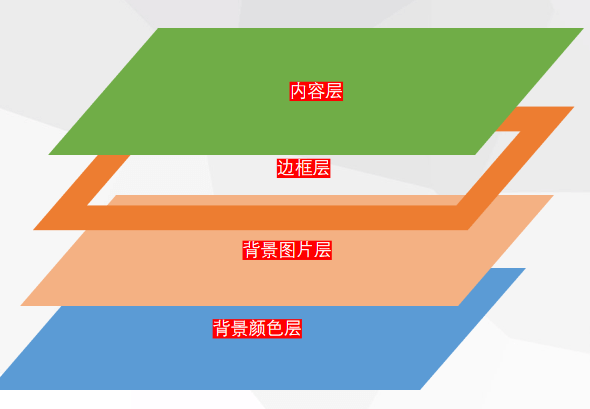

# 边框和背景

使用`border`定义边框，使用`background`定义背景。

<hr>

### 边框

使用`border`定义边框的样式，它包含了`width、style`和`color`三部分。

注释：

- `border`是一个简写属性，用于同时定义4条边框线的样式。
- 可使用`top、right、bottom`和`left`分别定义各边框。【顺时针：上右下左】


##### 边框宽度

使用`border-width`可以定义边框的宽度。

属性值：

- `thin`：细边框
- `medium`：中等边框，默认值
- `thick`：粗边框
- `length`：自定义宽度


##### 边框样式

使用`border-style`可以定义边框的样式。

属性值：

| 值        | 描述                                                      |
| :-------- | :-------------------------------------------------------- |
| `none`    | 无边框。                                                  |
| `hidden`  | 与 "`none`" 相同。但对于表格，`hidden` 用于解决边框冲突。 |
| `dotted`  | 圆点状边框。                                              |
| `dashed`  | 虚线边框（短横线）。                                      |
| `solid`   | 单实线边框。                                              |
| `double`  | 双实线边框。双线的宽度等于 `border-width` 的值。          |
| `groove`  | 定义 `3D` 凹槽边框。其效果取决于 `border-color` 的值。    |
| `ridge`   | 定义 `3D` 垄状边框。其效果取决于 `border-color` 的值。    |
| `inset`   | 定义 `3D inset` 边框。其效果取决于 `border-color` 的值。  |
| `outset`  | 定义 `3D outset` 边框。其效果取决于 `border-color` 的值。 |
| `inherit` | 规定应该从父元素继承边框样式。                            |


##### 边框颜色

使用`border-color`可以定义边框的颜色。


##### 圆角边框

使用`border-radius`可以定义边框的圆角。

属性值：按顺时针分别表示，上右下左的边框圆角，具有`px`和`%`两个单位。

值数量：

- 一个值：设置4个角。
- 两个值：设置左上与右上分别与其两个对角，即：左上 - 右下、右上 - 左下。
- 三个值：设置左上、右上与其对角、右下。
- 四个值：设置左上、右上、右下、左下四个角。


##### 图像边框

使用`border-image`可以定义图像边框。

`border-image`是一个复合属性，包括：`source、slice、width、outset、repeat`。

属性值：

- `border-image-source`：用于设置边框的图像路径，值`url()`
- `border-image-slice`：边框向内偏移量，值`number、%、fill`
- `border-image-width`：边框宽度，值`number、%、auto`【`number`表示`border-width`的倍数】
- `border-image-outset`：边框向外偏移量，值`number、length`【`number`表示`border-width`的倍数】
- `border-image-repeat`：图像是否平铺（`repeated`）、铺满（`rounded`）或拉伸（`stretched`）。

向内偏移：`slice`

- 该属性将图片分为九个区域：四个角、四条边和一个中心区域。
- `number`：数字值，代表光栅图像中的像素或矢量图形中的坐标。
- `%`：相对于图像尺寸的百分比值。
- `fill`：保留中心区域。【默认是舍弃中心区域】


##### 合并边框

使用`border-collapse`可以定义表格中的边框是否合并。

属性值：

- `separate`：不合并，默认值。保持`border-spacing`和`empty-cells`属性。
- `collapse`：合并为单线边框。忽略`border-spacing`和`empty-cells`属性。


##### 边框间隙

使用`border-spacing`可以定义表格中的边框间隙（单元格水平和垂直上的距离）。

属性值：

- `length`：定义水平和垂直间距
- `length length`：第一个设置水平间距，第一个设置垂直间距


##### 空单元格

使用`empty-cells`可以定义是否显示表格中的空单元格。

属性值：

- `hide`：隐藏，主要是隐藏空单元格的边框和背景
- `show`：显示，默认值

<hr>

### 背景

使用`background`定义背景，包括：`color、image、repeat、attachment、position、size、origin、clip`。

​                                       


##### 背景颜色

使用`background-color`定义背景的颜色。

将背景色设为单色，它会填充满整个容器，包括内边距和外边框。


##### 背景图片

使用`background-image`定义背景的图像，通过`url()`函数引入资源。


##### 背景平铺

使用`background-repeat`定义背景图像的平铺模式。

属性值：

- `repeat`：将背景图像在水平和垂直方向上重复平铺，默认值。
- `repeat-x`：将背景图像仅在水平方向上平铺。
- `repeat-y`：将背景图像仅在垂直方向上平铺。
- `no-repeat`：不允许背景图像平铺，仅在左上角显示一个。
- `space`：以相同的间距平铺且充满整个容器或某个方向。
- `round`：自适应缩放且充满整个容器。


##### 背景附着

使用`background-attachment`定义背景的附着模式。

属性值：

- `scroll`：背景相对于元素自身固定（边框），随页面的滚动而滚动，默认值。
- `local`：背景相对于元素内容固定（可滚动区），若该元素具有滚动机制，将随元素内容而滚动。
- `fixed`：背景相对于浏览器视口固定，不随任何滚动而滚动（包括元素自身的滚动机制）。


##### 背景定位

使用`background-position`定义背景图像的起始位置。

属性值：

- 默认值：`0% 0%`，即：左上角，相当于：`top left`
- 关键字：`top、bottom、left、right、center`的组合。如只用一个关键字，第二个关键字将默认为`center`（`50%`）。
- 自定义：第一个是水平位置，第二个是垂直位置。使用`px、%`等单位。


##### 背景原点

使用`background-origin`来定义背景定位（`background-position`）的原点。

属性值：

- `border-box`：相对于外边框盒的左上角来定位，背景从边框区域开始显示。
- `padding-box`：相对于内边距盒的左上角来定位，背景从内边距区域开始显示，默认值。
- `content-box`：相对于内容区的左上角来定位，背景从内容区域开始显示。


##### 背景裁剪

使用`background-clip`定义背景的绘制区域。

属性值：

- `border-box`：裁剪去外边框盒以外的部分，保留外边框盒以内的背景，默认值。
- `padding-box`：裁剪去内边距盒以外的部分，保留内边距盒以内的背景。
- `content-box`：裁剪去内容区域以外的部分，保留内容区域以内的背景。


##### 背景大小

使用`background-size`定义背景图像的大小。

属性值：

- `cover`：将图片缩放到正好铺满整个背景区域，保持宽高比（即使图像已经超出区域）
- `contain`：将图片缩放到铺满背景区域的宽度或高度，保持宽高比（图像不会超出区域）
- 自定义：第一个设置宽度，第二个设置高度，可使用`px`和`%`单位。第二个值默认为`auto`


##### 背景混合

使用`background-blend-mode`定义每个背景层中颜色与图像的混合模式。

属性值：

| 值            | 描述                                         |
| :------------ | :------------------------------------------- |
| `normal`      | 默认。把混合模式设置为普通。                 |
| `multiply`    | 把混合模式设置为 `multiply`（乘）。          |
| `screen`      | 把混合模式设置为 `screen`（屏幕）。          |
| `overlay`     | 把混合模式设置为 `overlay`（覆盖）。         |
| `darken`      | 把混合模式设置为 `overlay`（覆盖）。         |
| `lighten`     | 把混合模式设置为 `lighten`（变亮）。         |
| `color-dodge` | 把混合模式设置为 `color-dodge`（颜色减淡）。 |
| `saturation`  | 把混合模式设置为 `saturation`（饱和度）。    |
| `color`       | 把混合模式设置为 `color`（颜色）。           |
| `luminosity`  | 把混合模式设置为 `luminosity`（亮度）。      |


#### 渐变背景

渐变背景是图像的一种形式（用来替换加载图像资源），分为：线性渐变和径向渐变。

提示：`HTML5`现在可以通过`svg`元素来渲染渐变效果了。

```html
<svg width="120" height="240" version="1.1" xmlns="http://www.w3.org/2000/svg">
  <defs>
      <linearGradient id="Gradient1">
        <stop class="stop1" offset="0%"/>
        <stop class="stop2" offset="50%"/>
        <stop class="stop3" offset="100%"/>
      </linearGradient>
      <linearGradient id="Gradient2" x1="0" x2="0" y1="0" y2="1">
        <stop offset="0%" stop-color="red"/>
        <stop offset="50%" stop-color="black" stop-opacity="0"/>
        <stop offset="100%" stop-color="blue"/>
      </linearGradient>
      <style type="text/css"><![CDATA[
        #rect1 { fill: url(#Gradient1); }
        .stop1 { stop-color: red; }
        .stop2 { stop-color: black; stop-opacity: 0; }
        .stop3 { stop-color: blue; }
      ]]></style>
  </defs>

  <rect id="rect1" x="10" y="10" rx="15" ry="15" width="100" height="100"/>
  <rect x="10" y="120" rx="15" ry="15" width="100" height="100" fill="url(#Gradient2)"/>

</svg>
```

```html
<?xml version="1.0" standalone="no"?>
<svg width="120" height="240" version="1.1" xmlns="http://www.w3.org/2000/svg">
  <defs>
      <radialGradient id="RadialGradient1">
        <stop offset="0%" stop-color="red"/>
        <stop offset="100%" stop-color="blue"/>
      </radialGradient>
      <radialGradient id="RadialGradient2" cx="0.25" cy="0.25" r="0.25">
        <stop offset="0%" stop-color="red"/>
        <stop offset="100%" stop-color="blue"/>
      </radialGradient>
  </defs>

  <rect x="10" y="10" rx="15" ry="15" width="100" height="100" fill="url(#RadialGradient1)"/>
  <rect x="10" y="120" rx="15" ry="15" width="100" height="100" fill="url(#RadialGradient2)"/>

</svg>
```


##### 线性渐变

线性渐变：由一条渐变线定义，各着色线经过其色点垂直于渐变线。

使用`linear-gradient()`函数可以创建一个线性渐变，其结果属于`gradient`数据类型（`image`的子类型）

注释：至少需要两种颜色，可以设置一对起止点和一个方向。

值：

- 第一个：渐变方向，取值为`deg`角度或关键字。
- 第二个：颜色与起止位置的组合，以空格分隔。

渐变方向：

- `to top`：从下到上渐变，相当于`0deg`
- `to right`：从左到右渐变，相当于`90deg`
- `to bottom`：从上到下渐变，相当于`180deg`
- `to left`：从右到左渐变，相当于`270deg`
- 对角线：使用两个关键字，如：`to top left - 从右下到左上`
- 角度值：以下为`0deg`，顺时针依次为：左（`90deg`）、上（`180deg`）、右（`270deg`）

​         

颜色点：

- 当没有给颜色点设置起始位置时，默认均分绘制区域。
- 无终止位置时，颜色会一直延续到下一个色点的起点。

```css
/* 默认从上到下渐变 */
background-image: linear-gradient(red, blue, yellow);

/* 设置从左到右的渐变 */
background-image: linear-gradient(to right, red 10% 30%, blue 50%, yellow);

/* 设置从左上到右下的渐变 */
background-image: linear-gradient(to right bottom, red, blue 50%, yellow 50%);
```


##### 重复线性渐变

使用`repeating-linear-gradient()`可以定义重复的线性渐变，多色渐变的叠加。

提示：多色渐变由多种颜色组成，颜色具有起止位置且以逗号分隔形成一个色点列表。

色点列表：

- 在色点列表中，颜色的终止点是递增的。
- 两种颜色处于同一终止点，将生成一条生硬线。
- 若后面的颜色终止点小于前面的，则会被覆盖。

渐变线：每种线性渐变都具有一条渐变线，渐变线穿过容器的中心，根据角度调整，起止点由容器顶点垂直于渐变线的垂点确定。

​                                                                                 

```css
background-image: repeating-linear-gradient(to right bottom, red, yellow 10% 30%, purple);
```


##### 径向渐变

径向渐变：由中心向外渐变扩散。

使用`radial-gradient()`函数可以创建一个径向渐变，至少需要两种颜色可以指定渐变中心的位置、形状类型和半径大小。

语法格式：`radial-gradient(shape size at position, color-stop1, color-stop2, ...)`

参数：

- `shape`：指定渐变的类型，包括：`circle`（正圆）和`ellipse`（椭圆）两种。
- `size`：指定渐变的半径大小，若为`circle`指定一个值设置圆半径，为`ellipse`指定两个值设置`x`轴和`y`轴的半径。

- `position`：指定渐变中心的位置。第一个`x`轴坐标，第二个`y`轴坐标。第二个值默认为`50%`（`center`）。

半径大小：半径大小的取值包括`px、%`和关键字。

- `closest-side`：指定渐变半径为从中心点到最近的边
- `closest-corner`：指定渐变半径为从中心到最近的角
- `farthest-side`：指定渐变半径为从中心到最远的边
- `farthest-corner`：指定渐变半径为从中心到最远的角

```css
background-image: radial-gradient(circle closest-side at 50% 60%, red, yellow, black);
```


##### 重复径向渐变

使用`repeating-radial-gradient()`函数可以创建重复的径向渐变。

```css
background-image: repeating-radial-gradient(red, yellow 10%, green 15%);
```


