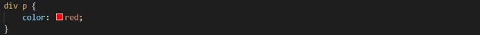
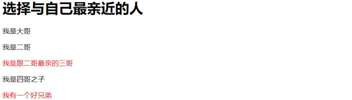
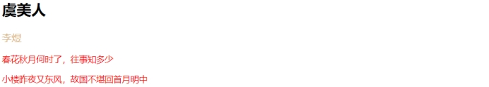

# 选择器

### 基础

##### 浏览器底层逻辑

匹配规则：浏览器在全局从右往左匹配元素，将所有满足条件的元素都选择出来。

逆思维：先找到元素的父元素，在父元素中按规则匹配。

- 为确保匹配的精准高效，需要给父结构用 class 或 id 来标识独特性。
- 可以将所有选择器理解为逻辑公式、只要符合逻辑都会被选出来（无论它们在哪个层级）
- 例如：p、div+p、div>p等

区别：

- 这个特性与继承不同，继承的样式一般都是关于文本的样式，其他样式不继承。
- 而这些是被选择的元素，将直接被作用样式。

#####  权重值

`CSS` 选择器具有相应的权重值，权重值越大，样式的优先级就越高。样式权重值从 0 开始，一般按照如下规则叠加：

- `!important`：+ 无穷大
- 行间样式：+ 1000
- `ID` 选择器：+ 100
- `class` 选择器、属性选择器、伪类选择器：+ 10
- 元素选择器、伪元素选择器：+ 1
- 通配符选择器、继承样式：+ 0

注释：为简写属性（如 `background`）应用 `!important` 会使其子属性（如 `background-color`）继承该权重。

样式的覆盖原则一般如下：

- 优先级相同：后面的覆盖前面的，写在越后面的样式覆盖越前面的样式（例如，内部样式和外部样式）。
- 优先级不同：优先级大的覆盖优先级低的，根据选择器的权重值进行叠加计算。


### 一、元素选择器

##### 标签选择器、类型选择器、元素选择器

范围：选择所有的 p 元素 

优点：为该标签统一样式

注意：伪元素不指定范围时，也可当作元素选择器使用，匹配所有同类型的伪元素

```css
p {
   	font-size: 12px;

  	color: blue;
}
::before {
    /* 选择所有的before伪元素 */
}
```

示例

 

 

结果

 

 

### 二、通配选择器

##### 通配选择器 

  范围：选择文档中出现的所有元素（标签、伪元素）

  优点：为全局（所有元素）统一样式

```css
* {
  		margin: 0;
  		padding: 0;
}
```

示例1

 

 

结果

 

示例2

 

 

结果

 

 

### 三、类选择器

 

示例1

 

 

结果

 

示例2

 

 

 

### 四、Id选择器

 

每个元素只能定义一个 `ID` 选择器，定义多个会导致都无效。`ID` 属性不要以数字开头，数字开头的 `ID` 也不起作用。

示例

 

 

结果

 

 

### **五、附加选择器**

 

示例

 

 

### **六、包含选择器**

 

示例

 

 

结果

 

示例2

 

结果

 

 

### **七、子选择器**

 

示例

 

 

结果

 

 

### **八、相邻选择器**

 

示例

 

 

结果

 


### 九、兄弟选择器

##### 兄弟选择器

-   以 ~ 连接两个选择器
-   前面的选择器匹配特定的元素、后面的选择器根据结构关系，指定其后同级所有匹配的元素。
-   范围：将前面选择器后面的所有被指定类型的兄弟元素都选择出来（无论多远）

```css
/*选择 div 后面所有同级的 p 元素 */  
div~p {

}
```

示例1

 

 

结果

 

示例2

```html
<body>
  <h1>这是body第一个子元素</h1>
  <p>这是body第一个段落。</p>
  <div>
        <p>这是div第一个段落。</p>
        <p>这是div第二个段落。</p>
  </div>
  <h2></h2>
  <p>body最后一个段落</p>
  <div></div>
</body>
```

 

 

### **十、并集选择器**

 

 

### **十一、属性选择器**

属性选择器的7种形式

 

 

 

##### 根据属性名匹配元素

示例1

 

 

 

 

##### 根据属性及值来匹配元素

 

 

 


##### 根据属性值列表中是否包含某值来匹配元素

 

 

 


##### 选择属性值以某字符串开头的标签

 

 


##### 选择属性值以某字符串结尾的标签

 

 


##### 属性值包含某字符串

 

 

 


##### 选择属性值以-分隔，且以某字符串开头的标签

示例1

 

 

 

示例2

 

 

 

### **十二、结构伪类选择器**

结构伪类选择器

-   逆思维：先找到指定元素的父元素，从父元素中匹配子对象。
-   根据文档的结构关系来匹配特定的元素（判断是否为该元素）
-   如果是指定的元素类型，则匹配成功；否则，匹配失败

主要包括以下11种形式：

##### 1、:nth-child(n) 

:nth-child(n)：匹配其父元素中的第 n 个子元素（判断是否为该元素）。

n 可以是一个数字，一个关键字，或者一个公式（n是从0开始的自然数）。

-  数字：选择第几个子元素
- 关键字：ood奇数、even偶数
- 公式：n+1、3n、3n+1、-5+n等
  - n+1表示选择大于等于1的
  - 3n表示按3的倍数选择
  - 3n+1表示隔3选1
  - -5+n表示选择前5个（小于等于5的）

匹配p元素父盒子中的第1个元素（如果是p元素，则匹配成功;否则，选择器无效）

```css
p:nth-child(1) {
    background-color: #f00;
}
```

##### 2、 :nth-last-child()

:nth-last-child()：匹配其父元素中的倒数第n个子元素（判断是否为该元素）。是`nth-child()`的倒序匹配方式

匹配p元素父盒子中的倒数第1个元素（如果是p元素，则匹配成功;否则，选择器无效）

```css
p:nth-last-child(1) {
	background-color: #f00;
}
```

#####   3、:first-child  

:first-child：匹配其父元素中的第一个子元素（判断是否为该元素）

匹配 p 元素父盒子中的第一个子元素（如果是p元素，则匹配成功，否则，选择器无效）

优点：

- 相当于`nth-child(1)`
- 匹配更精准，高效，减轻查询负担。

```css
p:first-child {
	background-color: yellow;
}
```

#####   4、:last-child  

:last-child：匹配其父元素中的最后一个子元素（判断是否为该元素）

匹配 p 元素父盒子中的最后一个元素（如果是p元素，则匹配成功，否则，选择器无效）

优点：相当于nth-last-child(1)、精准高效。

```css
p:last-child {

	background-color: #f00;

}
```

#####   5、:only-child 

:only-child：匹配父元素中的唯一子元素（是`:nth-child()` 的特例）。

 匹配所有唯一子元素，判断是否是 p 元素。

```css
p:only-child {
	background:#ff0000;
}
```

 :nth-of-type()与:nth-child()的区别：

- child指定的是其父元素中所有子元素，依次判断是否符合指定类型：符合的被选择出来，不符合的略过。
- type为child限定了类型，范围缩小到符合指定类型的所有子元素，从而可以快速匹配出结果。
- 当子元素都是相同类型时两者都可用；当子元素是不同类型时，使用type更方便。

#####   6、:nth-of-type(n) 

:nth-of-type(n)：匹配同类型中的第n个同级兄弟元素（类似于兄弟选择器）。

先到第一个指定类型的元素，再匹配它的同级兄弟元素（无论多远）。

找出所有的p元素，匹配与它们同级的第2个兄弟 p 元素（如果存在，匹配成功；不存在，忽略）

```css
p:nth-of-type(2) {
	background-color: #f00;
}
```

#####   7、:nth-last-of-type() 

:nth-last-of-type()：匹配同类型中的倒数第n个同级兄弟元素（5的倒序查找）

找到最后一个p元素，按倒序匹配第2个兄弟 p 元素（如果存在，匹配成功；不存在，忽略）

```css
p:nth-last-of-type(2) {
	background-color: #f00;
}
```

#####   8、:first-of-type 

:first-of-type：在其父元素中匹配第一个指定类型的子元素。

优点：相当于`:nth-of-type(1)`、高效

```css
p:first-of-type {
	background-color: #f00;
}
```

#####   9、:last-of-type 

:last-of-type：在其父元素中匹配最后一个指定类型的子元素。

相当于:nth-last-of-type(1)

```css
p:last-of-type {
	background-color: #f00;
}
```

#####   10、:only-of-type 

:only-of-type：匹配父元素中指定类型的唯一子元素（是`:nth-of-type()` 的特例）。

选择是 p 元素，且是其父元素的唯一子元素。

```css
p:only-of-type {
	background:#ff0000;
}
```

#####   11、:empty 

:empty：匹配指定类型是空元素的元素（没有任何内容的元素，包括文本节点）

选择没有任何内容的 p 元素。

```css
p:empty {
	width:100px;
	height:20px;
	background:#ff0000;
}
```


1、匹配第一个子元素

 

 

 

 

2、匹配最后一个子元素

 

 

 

 

3、匹配其父元素中的第n个子元素

```html
<style>
    
	p:nth-child(1) {
		background-color: #f00;
	}

</style>

<body>

  <h1>这是body第一个子元素</h1>

  <p>这是body第一个段落。</p>

  <div>
        <p>这是div第一个段落。</p>
        <p>这是div第二个段落。</p>
  </div>

  <p><b>注意:</b> Internet Explorer 8 以及更早版本的浏览器不支持 :nth-child()选择器.</p>

</body>
```

 

 

4、匹配其父元素中的倒数第n个子元素

```html
<style>

	p:nth-last-child(1) {
		background-color: #f00;
	}

 </style>

<body>

  <h1>这是body第一个子元素</h1>

  <p>这是body第一个段落。</p>

  <div>
        <p>这是div第一个段落。</p>
        <p>这是div第二个段落。</p>
  </div>

  <p>body最后一个段落</p>

  <div></div>

</body>
```

 

 

5、匹配同类型中的第n个兄弟元素

```html
<style>

	h1~p {
		color: blue;
	}

	p:nth-of-type(2) {
		background-color: #f00;
	}

 </style>

<body>

  <h1>这是body第一个子元素</h1>

  <p>这是body第一个段落。</p>

  <div>

        <p>这是div第一个段落。</p>

        <p>这是div第二个段落。</p>

  </div>

  <h2></h2>

  <p>body最后一个段落</p>

  <div></div>

</body>
```

 

 

6、匹配同类型中倒数第n个兄弟元素

```html
<style>

	h1~p {
		color: blue;
	}

	p:nth-last-of-type(2) {
		background-color: #f00;
	}

  </style>

<body>

  <h1>这是body第一个子元素</h1>

  <p>这是body第一个段落。</p>

  <div>

        <p>这是div第一个段落。</p>

        <p>这是div第二个段落。</p>

  </div>

  <h2></h2>

  <p>body最后一个段落</p>

  <div></div>

</body>
```

 

 

7、在其父元素中匹配第一个指定类型的子元素。

```html
<style>

	p:first-of-type {
		background-color: #f00;
	}

</style>

<body>

  <h1>这是body第一个子元素</h1>

  <p>这是body第一个段落。</p>

  <div>

        <p>这是div第一个段落。</p>

        <p>这是div第二个段落。</p>

  </div>

  <h2></h2>

  <p>body最后一个段落</p>

  <div></div>

</body>
```

 

 

8、在其父元素中匹配最后一个指定类型的子元素。

```html
<style>

	p:last-of-type {
		background-color: #f00;
	}

  </style>

<body>

  <h1>这是body第一个子元素</h1>

  <p>这是body第一个段落。</p>

  <div>

        <p>这是div第一个段落。</p>

        <p>这是div第二个段落。</p>

  </div>

  <h2></h2>

  <p>body最后一个段落</p>

  <div></div>

</body>
```

 

 

9、匹配唯一子元素

```html
<style>
	p:only-child {
		background-color: #f00;
	}

  </style>

<body>

  <h1>这是body第一个子元素</h1>

  <p>这是body第一个段落。</p>

  <div>

        <p>这是div第一个段落。</p>

        <p>这是div第二个段落。</p>

  </div>

  <h2></h2>

  <p>body最后一个段落</p>

  <div>
        <p>div中唯一p元素</p>
  </div>

</body>
```

 

 

10、匹配指定类型的唯一子元素

```css
p:only-of-type {
	background-color: #f00;
}
```

 

 

11、匹配空元素（不包括文本节点）

```html
<style>

	p:empty {
		width: 100px;
		height: 20px;
		background: #ff0000;
	}

  </style>

<body>

    <p></p>

    <p>A paragraph.</p>

    <p>Another paragraph.</p>

</body>
```

 

 

### **十三、否定伪类选择器**

否定伪类选择器 

:not() 表示否定伪类选择器，它先过滤掉not()函数匹配的元素，然后为除它之外的所有元素设置如下样式。

- 否定伪类选择器先将函数内指定的元素否定掉，然后为除它之外的所有内容指定样式。
- 前面的指定元素类型（计算范围）、也可以不指定；括号里的被否定掉（独立出来），然后选择其余的。
- 函数括号内可以放id和class选择器，不能放伪对象选择器。

  将被标识为 author 的 p 元素 独立出来，把除它之外的所有 p 元素重新设置如下样式。

```css
 p:not(.author) {

	font-size: 12px;

	color: #ccc;

}
```

示例

```html
<style>
	p {
		color: burlywood;
		font-size: 16px;
	}
	
    p:not(.author) {
		font-size: 14px;
		color: red;
	}

  </style>

<body>

  <h2>虞美人</h2>

    <p class="author">李煜</p>

    <p>春花秋月何时了，往事知多少</p>

    <p>小楼昨夜又东风，故国不堪回首月明中</p>

</body>
```

 

 

### **十四、状态伪类选器**

状态伪类选择器

  CSS3包括以下3个 UI（用户交互界面）状态伪类选择器：

  UI表示用户交互界面，一般指表单对象，如文本框、复选框、按钮等。

  前面的表示指定组件；后面的表示所处状态：启用、禁用、选中。

#####   1、:enabled 

:enabled：匹配指定范围内所有可用的UI元素。

```css
/* 将每个可用的 input[type="text"] 元素选择出来（组件处于启用状态）*/

input[type="text"]:enabled {
	background:#ffff00;
}
```

#####   2、:disabled 

:disabled：匹配指定范围内所有不可用的UI元素。

```css
/* 将每个不可用的 input[type="text"] 元素选择出来（组件处于禁用状态）*/

input[type="text"]:disabled {
	background: #dddddd;
}
```

#####   3、:checked 

:checked：匹配指定范围内所有选择的UI元素（仅适用于按钮）。

```css
/* 将每个被选中 input 元素选择出来（组件处于选中状态）*/

input:checked {
	height: 50px;
	width: 50px;
}
```

示例

```html
<style>
	input[type="text"]:enabled {
		background: #ffff00;
	}    

	input[type="text"]:disabled {
		background: #dddddd;
	}    

	input:checked {
		width: 100px;
		height: 100px;
	}

</style>

<body>

  <form action="">

	<!-- 输入框 -->

        <p>First name: <input type="text" /></p>

        <p>Last name: <input type="text" value="Mouse" /></p>

        <p>Country: <input type="text" disabled="disabled" value="Disneyland" /></p>

	<!-- 按钮 -->

        <p><input type="radio" checked="checked" value="male" name="gender" /> Male</p>

        <p><input type="radio" value="female" name="gender" /> Female</p>

        <p><input type="checkbox" checked="checked" value="Bike" name="b" /> I have a bike</p>

        <p><input type="checkbox" value="Car" name="b" /> I have a car</p>

  </form>

</body>
```

 

 

案例：

当用户勾选同意框后，显示提交按钮；否则隐藏按钮，并显示提示文本。

 

 

代码

```html
<style>

	input[type="checkbox"]~input[type="submit"] {
		display: none;
	}

	input[type="checkbox"]~span {
		display: inline;
	}

input[type="checkbox"]:checked~input[type="submit"] {
	display: inline;
}

input[type="checkbox"]:checked~span {
	display: none;
}

</style>

<body>

	<form action="">
		<p><input type="checkbox" value="同意">同意<br><br>
			<input type="submit" value="提交协议">
			<span>注意请认真阅读协议条款，若同意请勾选上面的复选框</span>
		</p>
 	</form>

</body>
```

经验总结：

1、结构上：将复选框、按钮、文本放在一个盒子里

2、样式上：将状态伪类选择器的状态作为前提条件

3、巧妙运用兄弟选择器将复选框的状态分别与按钮和文本联系起来

 

### **十五、目标伪类选择器**

目标伪类选择器

E:target：表示先将指定类型的元素E全部匹配出来后，进一步匹配被相关url指向的元素。

一般只有一个元素会被指向，多用与锚点链接，提醒用户当前跳转的位置。

  将被url指向的 p 元素，高亮显示出来。

```css
p:target {
	border: 2px solid #D4D4D4;
	background-color: #e5eecc;
}
```

示例

```html
<style>

	p:target {
		border: 2px solid #D4D4D4;
		background-color: #e5eecc;
	}

</style>

<body>

	<h1>This is a heading</h1>

 	<!-- 设置锚点链接，跳转到锚点 -->

    <p><a href="#news1">Jump to New content 1</a></p>

    <p><a href="#news2">Jump to New content 2</a></p>

    <p>Click on the links above and the :target selector highlight the current active HTML anchor.</p>

 	<!-- 设置锚点 -->

	<p id="news1"><b>New content 1...</b></p>

    <p id="news2"><b>New content 2...</b></p>

    <p><b>注意:</b> IE 8 以及更早版本的浏览器不支持 :target 选择器.</p>

</body>
```

 

 

### **十六、动态伪类选择器**

动态伪类选择器

动态伪类选择器是一类行为类样式，只有当用户与页面进行交互时才有效，包括两种形式。

- 锚点伪类：如:link、:visited
- 行为伪类：如:hover、:active、:focus

#####   1、:link 

:link：选择未访问过的链接

```css
a:link {
	background-color: #f40;
}
```

#####   2、:visited 

:visited：选择访问过的链接（访问成功）

```css
a:visited {
	background-color: blueviolet;
}
```

#####   3、:hover 

:hover：选择当有鼠标悬停在其上时的链接

```css
a:hover {
	color: chartreuse;
}
```

#####   4、:active 

:active：选择激活的链接（鼠标按下，但为未松开的链接处于激活状态）

​    为了产生预期的效果，在CSS定义中，:active必须位于:hover之后！！

```css
a:active {
	color: burlywood;
}
```

#####   5、:focus 

:focus：选择获得焦点的元素

  :focus选择器 接受键盘事件或其他用户输入的元素（多用与表单组件，如：输入框）

```css
input:focus {
	background-color: yellow;
}
```

示例1

```html
<style>

	a:link {
		background-color: #f40;
	}    

	a:visited {
		background-color: blueviolet;
	}    

	a:active {
		background-color: burlywood;
	}    

	a:hover {
		background-color: whitesmoke;
	}    

	input:focus {
		background-color: pink;
	}

</style>

<body>

  	<form action="">
		<a href="http://www.runoob.com/">runoob.com</a>
		<a href="http://www.baidu.com">baidu</a>
		<a href="http://www.wikipedia.org">Wikipedia</a>
		<p><b>注意:</b>:link选择样式链接到你还没有去过的链接。</p>
		用户：<input type="text" value="请输入姓名" name="user">
  	</form>

</body>
```

 

示例2

```html
<style>
	#login {
		width: 500px;
		height: 200px;
		margin: 0 auto;
		background-color: #ccc;
		text-align: center;
	}    

	input[type=submit] {
		width: 100px;
		height: 30px;
		background-color: gray;
		color: #444;
		border: 1px solid;
		border-color: #fff grey grey #fff;
	}

	input[type=submit]:hover {
		background-color: transparent;
		color: #800000;
		border-color: grey #fff #fff grey;
	}

</style>

<body>

  	<form id="login" action="#" method="post">
		<h2>用户登录</h2>
		<!-- 不建议将标题直接放在表单元素中 -->
		<label for="user">用户</label>
		<input type="text" value="请输入姓名" id="user" name="user"> <br><br>
		<label for="password">密码</label>
		<input type="password" value="" id="password" name="password"><br><br>
		<input type="submit" name="commit" value="登录">
  	</form>

</body>
```

 

 

 

### **十七、伪元素选择器**

伪对象选择器

-   伪对象选择器以双冒号作为语法标识符， 如::伪对象名称
-   冒号前面可以添加选择符，限定伪对象应用的范围；后面作为伪对象名称，冒号前后没有空格。
-   主要用于选择内容无法确定且可以随时更换内容的对象（容器）。
-   主要有::before、::after、::first-line、::first-letter等

#####   1、::before 

::before：在指定元素的前面插入内容

​    content 属性是必须的，要插入的内容放在''之间。

```css
p::before {
	content: '路';
	float: left;
	font-size: 24px;
	font-weight: bold;
	margin: 3px 6px;
}
```

#####   2、::after 

::after：在指定元素的后面插入内容

```css
::after {
	content: '';
}
```

#####   3、::first-line 

::first-line：选择指定元素的第一行。

::first-line选择器适用于块级元素中，可使用的主要属性如下：

- font properties
- color properties 
- background properties
- word-spacing
- letter-spacing
- text-decoration
- vertical-align
- text-transform
- line-height
- clear

```css
/* 选择 p 元素的第一行 */

p::first-line {
	color: red;
	font-size: 18px;
	text-shadow: 2px 2px 2px rgba(147, 251, 64, 1);
}
```

#####   4、::first-letter 

::first-letter：选择指定元素的第一个字母或汉字。

::first-letter 选择器【仅】适用于块级元素，可使用的主要属性如下：

- font properties
- color properties 
- background properties
- margin properties
- padding properties
- border properties
- text-decoration
- vertical-align (only if float is 'none')
- text-transform
- line-height
- float
- clear

```css
/* 选择 p 元素的第一个字母或汉字。*/

p::first-letter {
	float: left;
	font-size: 24px;
	font-weight: bold;
	margin: 3px 6px;
}
```

【注意】

​    1、::before 添加的内容会先被匹配到，作为第一个字母。

​    2、设置的第一行样式会为第一个字母增添多余的样式（无法使用否定伪类选择器）。

【解决】将多余部分的样式重新设置

#####   5、::selection 

::selection：选择指定元素中处于被选中或高亮状态的部分（适用于文本内容）

- ​    ::selection选择器 用于匹配元素中被用户选中或处于高亮状态的部分（包括内容及其背景）
- ​    ::selection只可以应用于少数的CSS属性：color, background, cursor,和outline。

```css
/* 将 p 元素中 被选中或处于高亮状态的部分（内容及背景）作用如下样式 */

p::selection {
	color: pink;
}
```

【注意】

- 注意与状态伪类选择器及动态伪类选择器的区别
  - ::selection 选择器匹配的选中部分指的是用鼠标扩选的部分，而不是被点击的元素。
  - 状态伪类选择器与动态伪类选择器匹配的对象指的都是可点击的元素。
- 处于高亮状态的部分不是指被<mark>元素标记为高亮显示的部分

案例

 

方案一

```html
<style>

	p {
		font-size: 14px;
	}    

	p::before {
		content: '路';
		float: left;
		font-size: 24px;
		font-weight: bold;
		margin: 3px 6px;
	}    

	p::first-line {
		color: red;
		font-size: 18px;
		text-shadow: 2px 2px 2px rgba(147, 251, 64, 1);
	}

</style>

<body>

    <p>希望本是无所谓有，无所谓无的。<br> 
		这正如地上的路，其实地上本没有路，走的人多了，也便成了路。
    </p>

</body>
```

方案二：使用::first-letter选择器

```css
p::before {
	content: '路';
}    

p::first-letter {
	float: left;
	font-size: 24px;
	font-weight: bold;
	margin: 3px 6px;
	color: black;
	text-shadow: none;
}
```

示例

```html
<style>

	::selection {
		color: pink;
	}

</style>

<body>

  	<h1>尝试选择本页的一些文本</h1>

    <p>这是<mark>一些</mark>文本.</p>

    <div>这是div元素中的一些文本<br>
		<a href="//www.w3cschool.cc/" target="_blank">链接W3Cschool!</a>
 	</div>

</body>
```

 

 

### **十八、其他选择器**

#####   1、:lang()

  :lang() 选择器 选择带有lang属性且以括号内指定值开始的指定类型元素。

  冒号前面可以添加选择符，限定应用的范围；括号里的指定一个值，必须以该值开始。

  注意: 值是整个单词，单独像lang="en"，或者使用连字符(-)如lang ="en-us"。

```css
/* 选择具有lang属性且其值是以 it 开头的 p 元素 */

p:lang(it) { 
	background:yellow;
}
```

相当于[lang|=""]属性选择器

```css
/* 选择lang属性值是以 it 开头的 p 元素 */

p[lang|="it"] {
	background: yellow;
}
```

#####   2、:root

​    :root 选择器用于匹配文档的根元素。

​    在HTML中根元素始终是HTML元素。


以下几个选择器 适用于表单元素，如：input、textarea、select     

#####   3、:out-of-range 

:out-of-range 选择器 用于当标签的值在指定区间之外时显示样式。

【注意】:out-of-range 选择器只作用于能指定区间之外值的元素，例如input元素中的 min 和 max 属性。

```css
/* 匹配其输入值在其指定区间之外的input元素 */

input:out-of-range {

}  
```

#####   4、:in-range

  :in-range  匹配值在指定区间之内的input元素

  :in-range 选择器用于标签的值在指定区间值时显示的样式。

 【注意】 :in-range 选择器只作用于能指定区间值的元素，例如 input 元素中的 min 和 max 属性。

```css
/* 匹配其值在其指定范围内的input元素 */

input:in-range {
	border:2px solid yellow;
}
```

#####   5、:read-write  

​    :read-write 用于匹配可读及可写的元素

​    :read-write 选择器用于匹配可读及可写的元素。

​    【注意】 目前, 在大多浏览器中, :read-write 选择器只使用于input 和 textarea 元素。

​    匹配可读可写的 input 元素（即没设置 readonly 属性的 input 元素）

```css
input:read-write {
	background-color: yellow;
}  
```

#####   6、:read-only   

​    :read-only  用于匹配设置 "readonly"（只读） 属性的元素

​    :read-only 选择器用于选取设置了 "readonly" 属性的元素。

​    表单元素可以设置 "readonly" 属性来定义元素只读。

​    【注意】 目前，大多数浏览器, :read-only 选择器适用于input和textarea元素，但是它也适用于设置了"readonly"属性的其他元素。

​    匹配设置了 readonly 的input 元素

```css
input:read-only {
	background-color: yellow;
}
```

#####   7、:optional

​    :optional  用于匹配可选的输入元素。

​    :optional 选择器用于在表单元素是可选项时设置指定样式。

​    没有设置 required 属性的表单元素

​    【注意】 :optional 选择器只适用于表单元素: input, select 和 textarea。

​    匹配是可选项的 input 元素（即没有设置 required 属性的 input 元素）

```css
input:optional {
	background-color: yellow;
}  
```

#####   8、:required 

​    :required  用于匹配设置了 "required" 属性的元素

​    :required 选择器用于在表单元素是必填项时设置指定样式。

​    表单元素可以使用 required 属性来设置必填项。

​    【注意】 :required 选择器只适用于表单元素: input, select 和 textarea。

​    匹配是必填项的 input 元素（即设置了 required 属性的 input 元素）   

```css
input:required {
	background-color: yellow;
}
```

#####   9、:valid   

​    :valid  用于匹配输入值为合法值的元素（在进行表单验证时，很适用）   

​    :valid 选择器用于在表单元素的值需要根据指定条件验证且合法时设置指定样式。

注意：:valid 选择器只作用于能指定区间值的元素，例如 input 元素中的 min 和 max 属性，及正确的 email 字段, 合法的数字字段等。

匹配输入值是合法值的 input 元素（根据指定条件验证）

```css
input:valid {
	background-color: yellow;
}
```

#####   10、:invalid 

​    :invalid   用于匹配输入值为非法值的元素

​    :invalid 选择器用于在表单元素中的值是非法时设置指定样式。

​    匹配输入值是非法值的input 元素

```css
input:invalid {
	border:2px solid red;
}
```

