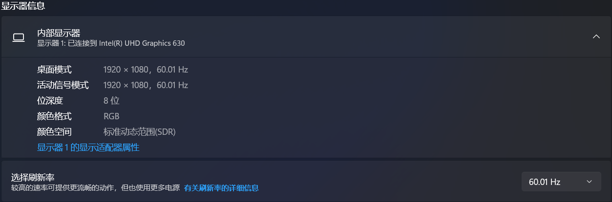

# Screen

​		`window` 的另一个属性 `screen` 对象，是为数不多的几个在编程中很少用的 `JavaScript` 对象。这个对象中保存的纯粹是客户端能力信息，也就是浏览器窗口外面的客户端显示器的信息，比如像素宽度和像素高度。每个浏览器都会在 `screen` 对象上暴露不同的属性。下表总结了这些属性。

|     属性      |                     说明                     |
| :-----------: | :------------------------------------------: |
| `availHeight` |     屏幕像素高度减去系统组件高度（只读）     |
|  `availLeft`  | 没有被系统组件占用的屏幕的最左侧像素（只读） |
|  `availTop`   | 没有被系统组件占用的屏幕的最顶端像素（只读） |
| `availWidth`  |     屏幕像素宽度减去系统组件宽度（只读）     |
| `colorDepth`  |  表示屏幕颜色的位数；多数系统是 32（只读）   |
|   `height`    |                 屏幕像素高度                 |
|    `left`     |            当前屏幕左边的像素距离            |
| `pixelDepth`  |              屏幕的位深（只读）              |
|     `top`     |            当前屏幕顶端的像素距离            |
|    `width`    |                 屏幕像素宽度                 |
| `orientation` |  返回 `Screen Orientation API` 中屏幕的朝向  |

 

```js
// 将实际的屏幕像素乘以0.8得到如下记录中的CSS数值。
screen; // 输出显示器的相关参数
/*
Screen {
	availHeight: 816, 	// 可利用高度：1020 * 0.8 = (屏幕总高度 - 任务栏高度) * 0.8
	availLeft: 0,
	availTop: 0,
	availWidth: 1536, 	// 可利用宽度
	colorDepth: 24, 	// 颜色深度（所有现代计算机都使用24位或32位硬件的色彩分辨率）
	height: 864, 		// 屏幕总高度：1080 * 0.8
	isExtended: false,
	onchange: null,
	orientation: ScreenOrientation {angle: 0, type: 'landscape-primary', onchange: null},
	pixelDepth: 24, 	// 像素深度（现代计算机的颜色深度和像素深度的值是一样的）
	width: 1536, 		// 屏幕总宽度：1920 * 0.8
	[[Prototype]]: Screen
}
*/
```

注释：`colorDepth` 值，根据 `CSSOM`（`CSS` 对象模型）视图，为兼容起见，该值总为 24。

