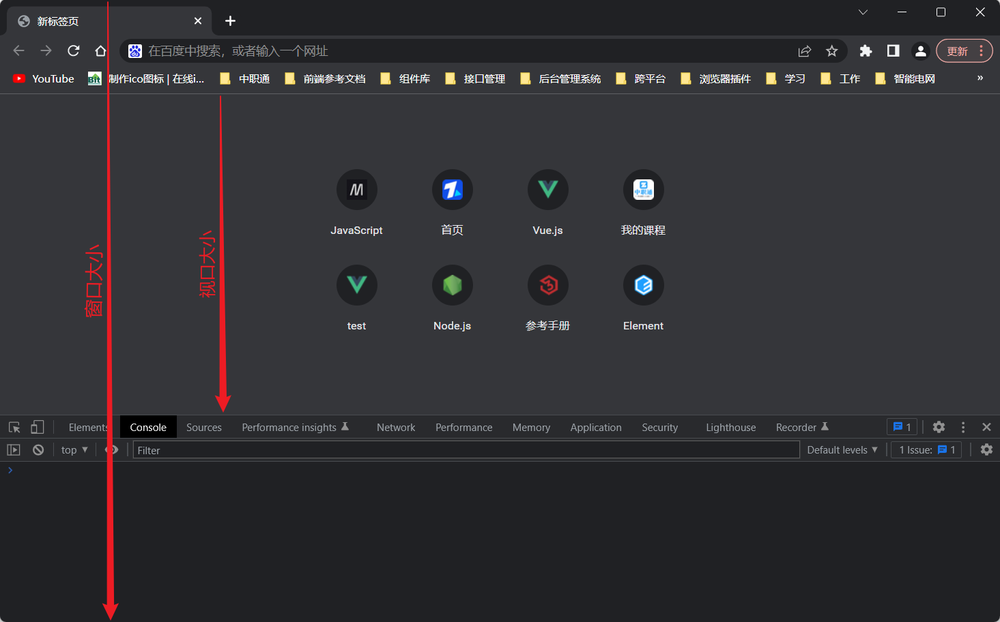
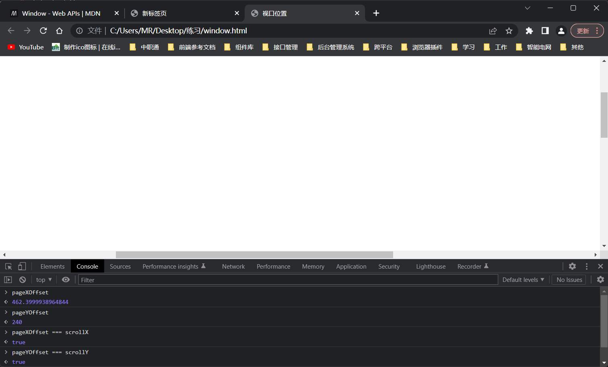
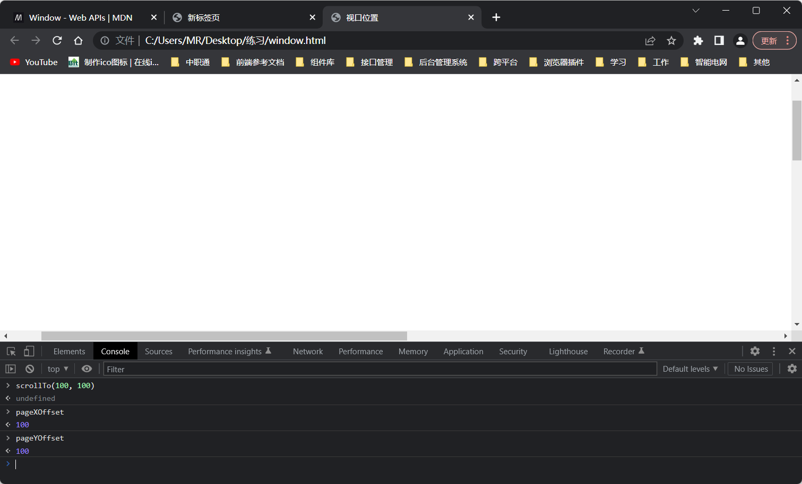
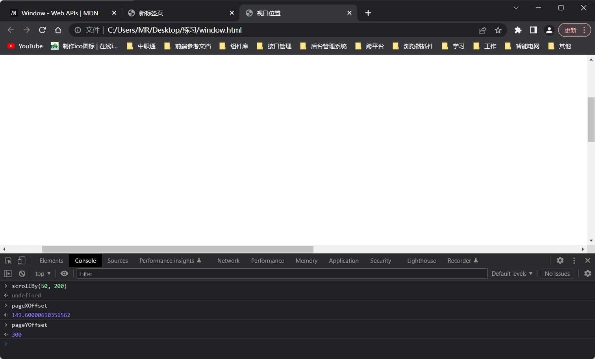
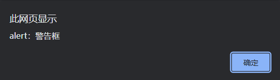
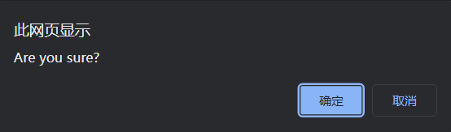
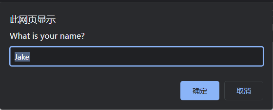
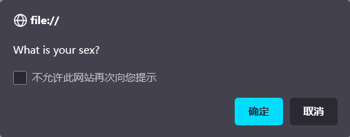
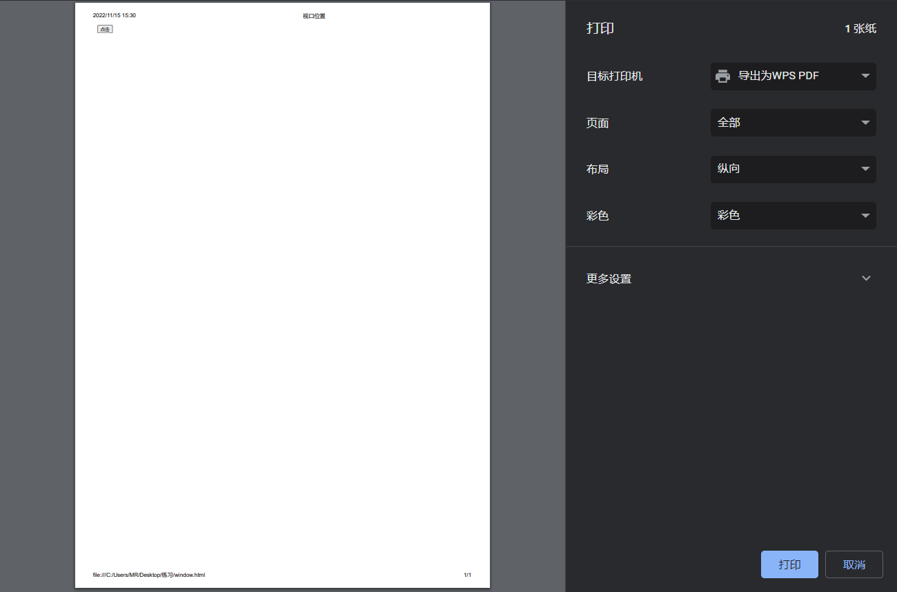

# Window

​		`BOM` 的核心是 `window` 对象，表示浏览器的实例。`window` 对象在浏览器中有两重身份，一个是 `ECMAScript` 中的 `Global` 对象，另一个就是浏览器窗口的 `JavaScript` 接口。这意味着网页中定义的所有对象、变量和函数都以 `window` 作为其 `Global` 对象，都可以访问其上定义的 `parseInt()` 等全局方法。

注意：因为 `window` 对象的属性在全局作用域中有效，所以很多浏览器 `API` 及相关构造函数都以 `window` 对象属性的形式暴露出来。这些 `API` 将在全书各章中介绍，特别是第 20 章《`JavaScript API`》。另外，由于实现不同，某些 `window` 对象的属性在不同浏览器间可能差异很大。本章不会介绍已经废弃的、非标准化或特定于浏览器的 `window` 属性。

更多细节参考：[`window MDN`](https://developer.mozilla.org/en-US/docs/Web/API/Window) 


### `Global` 作用域

​		因为 `window` 对象被复用为 `ECMAScript` 的 `Global` 对象，所以通过 `var` 声明的所有全局变量和以及使用 `function` 声明的所有全局函数（非函数表达式）都会变成 `window` 对象的属性和方法。比如：

```js
// 被定义在全局作用域中的变量和函数，会自动成为window对象的成员。
var age = 29; 
var sayAge = () => console.log(this.age); // 箭头函数在全局定义，this绑定为window
function fn() {
    console.log(age); // 默认指向window
}

age; // 29
window.age; // 29

sayAge(); // 29 
window.sayAge(); // 29

fn(); // 29
window.fn(); // 29
```

​		如果使用 `let` 或 `const` 替代 `var`，则不会把变量添加给全局对象：

```js
let age = 18;
const sayAge = () => console.log(this.age);

age; // 18
window.age; // undefined

sayAge(); // undefined
window.sayAge; // undefined
```

​		另外，未使用关键字声明的变量会像 `var` 声明的变量一样被添加到 `window` 对象上；

```js
// 未使用关键字声明的变量
name = "xc";
window.name; // 'xc'
```

​		访问未声明的变量会抛出错误，但我们可以在 `window` 对象上查询一个全局变量是否已有效初始化（已声明且值非 `undefined`）。

```js
// 使用未声明的变量a
var b = a; // Uncaught ReferenceError: a is not defined

// 使用typeof可以检测一个变量是否未有效初始化：未声明或值为undefined。
typeof a; // 'undefined'

var b; // 默认值为：undefined
typeof b; // 'undefined'

var c = null;
typeof c; // 'object'

// 通过在window上访问指定的全局变量也可以检测它是否已有效初始化
window.a; // undefined
window.b; // undefined
window.c; // null
```

注释：`typeof` 可检测任何位置的变量，无论全局或局部；而在 `window` 上只能检测全局变量。

​		其实，`JavaScript` 中有很多对象都暴露在全局作用域中，比如 `location` 和 `navigator`，因而它们也是 `window` 对象的属性。


### 窗口关系

​		`top` 对象始终指向最上层（最外层）窗口，即浏览器窗口本身。而 `parent` 对象则始终指向当前窗口的父窗口。如果当前窗口是最上层窗口，则 `parent` 等于 `top`（都等于 `window`）。最上层的 `window` 如果不是通过 `window.open()` 打开的，那么其 `name` 属性就不会包含值。

​		还有一个 `self` 对象，它是终极 `window` 属性，始终会指向 `window`。实际上，`self` 和 `window` 就是同一个对象。之所以还要暴露 `self`，就是为了和 `top`、`parent` 保持一致。

​		这些属性都是 `window` 对象的属性，因此访问 `window.parent`、`window.top` 和 `window.self` 都可以。这意味着可以把访问多个窗口的 `window` 对象串联起来，比如 `window.parent.parent`。

```js
// 当前窗口为window浏览器窗口
top === window; 	// true
parent === window;  // true
self === window; 	// true
```


### 窗口位置

​		`window` 对象的位置可以通过不同的属性和方法来确定。现代浏览器提供了 `screenLeft` 和 `screenTop` 属性，用于表示窗口相对于屏幕左侧和顶部的位置 ，返回纯数值以 `CSS` 像素为单位。

```js
// 全屏状态下：数值均为0
screenLeft; // 0
screenTop;  // 0

// 缩小窗口，并拖动到任意位置
screenLeft; // 367
screenTop; 	// 49

screenX; // 367
screenY; // 49

// 还有一个screen对象
screen;
/*
Screen {
	availHeight: 816,
	availLeft: 0,
	availTop: 0,
	availWidth: 1536,
	colorDepth: 24,
	height: 64,
	isExtended: fasle,
	onchange: null,
	orientation: ScreenOrientation {angle: 0, type: 'landscape-primary', onchange: null},
	pixelDepth: 24,
	width: 1536
}
*/
```

​		可以使用 `moveTo()` 和 `moveBy()` 方法移动窗口。这两个方法都接收两个参数，其中 `moveTo()` 接收要移动到的新位置的绝对坐标 *`x`* 和 *`y`*；而 `moveBy()` 则接收相对当前位置在两个方向上移动的像素数。比如：

```js
// to：相当于屏幕位置，by：相对于当前位置
// 把窗口移动到左上角
window.moveTo(0,0); 

// 把窗口向下移动 100 像素
window.moveBy(0, 100);

// 把窗口移动到坐标位置(200, 300) 
window.moveTo(200, 300); 

// 把窗口向左移动 50 像素
window.moveBy(-50, 0);
```

​		依浏览器而定，以上方法可能会被部分或全部禁用。


### 像素比

​		`CSS` 像素是 `Web` 开发中使用的统一像素单位。这个单位的背后其实是一个角度：0.0213°。如果屏幕距离人眼是一臂长，则以这个角度计算的 `CSS` 像素大小约为 1/96 英寸。这样定义像素大小是为了在不同设备上统一标准。比如，低分辨率平板设备上 12 像素（`CSS` 像素）的文字应该与高清 `4K` 屏幕下12 像素（`CSS` 像素）的文字具有相同大小。这就带来了一个问题，不同像素密度的屏幕下就会有不同的缩放系数，以便把物理像素（屏幕实际的分辨率）转换为 `CSS` 像素（浏览器报告的虚拟分辨率）。

​		举个例子，手机屏幕的物理分辨率可能是 1920×1080，但因为其像素可能非常小，所以浏览器就需要将其分辨率降为较低的逻辑分辨率，比如 640×320。这个物理像素与 `CSS` 像素之间的转换比率由 `window.devicePixelRatio` 属性提供。对于分辨率从 1920×1080 转换为 640×320 的设备，`window.devicePixelRatio` 的值就是 3。这样一来，12 像素（`CSS` 像素）的文字实际上就会用 36 像素的物理像素来显示。

​		`window.devicePixelRatio` 实际上与每英寸像素数（`DPI`，`dots per inch`）是对应的。`DPI` 表示单位像素密度，而  `window.devicePixelRatio` （`DPR`）表示物理像素与逻辑像素之间的缩放系数。

注释：`DPR` 实际上是为了将像素统一换算成逻辑像素而将物理像素缩小的倍数，相当于：在一个逻辑像素中压缩了 `DPR` 个物理像素。这样做主要是因为如果要保持图片的清晰度，就不能改变逻辑像素的大小，所以只能通过调整物理像素来适配逻辑像素。

```
物理像素：每个设备都具有特定数量的像素点，这个数量是该设备在生产时就已经确定了的，因此又被称为设备像素/实际像素。
逻辑像素：为了统一视觉上和设计上的像素大小的计算。比如：一张图片上的一个像素其实是一个逻辑像素/虚拟像素/计算像素。
缩放系数：一张图片上一个的逻辑像素，在分辨率不同的设备上需要以不同数量的物理像素来展示。缩放系数就是换算比/像素比。
DPR（缩放系数） = 物理像素（设备像素） / 逻辑像素（计算像素）；即：1个逻辑像素 = DPR个物理像素。
```

```
DPI（像素密度） = 物理像素 / 屏幕尺寸；即：1单位屏幕尺寸 = DPI个物理像素 ==> 如：1英寸屏幕上有DPI个物理像素点。
```

```js
window.devicePixelRatio = DPR; // 单位：物理像素/逻辑像素
```


### 窗口大小

​		在不同浏览器中确定浏览器窗口大小没有想象中那么容易。所有现代浏览器都支持 4 个属性：`innerWidth`、`innerHeight`、`outerWidth` 和 `outerHeight`。`outerWidth` 和 `outerHeight` 返回浏览器窗口自身的大小（不管是在最外层 `window` 上使用，还是在窗格 `<frame>` 中使用）。`innerWidth` 和 `innerHeight` 返回浏览器窗口中页面视口的大小（不包含浏览器边框和工具栏）。

 

​		`document.documentElement.clientWidth` 和 `document.documentElement.clientHeight` 返回页面视口的宽度和高度。浏览器窗口自身的精确尺寸不好确定，但可以确定页面视口的大小，如下所示：

```js
let pageWidth = window.innerWidth, 
 	pageHeight = window.innerHeight; 

if (typeof pageWidth != "number") { 
    // 检查页面是否处于标准模式（CSS1兼容模式）
 	if (document.compatMode == "CSS1Compat"){
		pageWidth = document.documentElement.clientWidth; 
 		pageHeight = document.documentElement.clientHeight; 
 	} else { 
 		pageWidth = document.body.clientWidth; 
 		pageHeight = document.body.clientHeight; 
 	} 
}
```

​		在移动设备上，`window.innerWidth` 和 `window.innerHeight` 返回视口的大小，也就是屏幕上页面可视区域的大小。`Mobile` `Internet Explorer` 支持这些属性，但在 `document.documentElement.clientWidth` 和 `document.documentElement.`

`clientHeight` 中也提供了相同的信息。在放大或缩小页面时，这些值也会相应变化。

​		因为桌面浏览器的差异，所以需要先确定用户是不是在使用的移动设备，然后再决定使用哪个属性。

注意：手机视口的概念比较复杂，有各种各样的问题。如果读者在做移动开发，推荐阅读 `Peter-Paul Koch` 发表在 `QuirksMode` 网站上的文章 `"A Tale of Two Viewports — Part Two"`。

​		可以使用 `resizeTo()` 和 `resizeBy()` 方法调整窗口大小。这两个方法都接收两个参数，`resizeTo()` 接收新的宽度和高度值，而  `resizeBy()` 接收宽度和高度在已有的基础上各要缩放多少。下面看个例子：

```js
// resizeTo：缩放到新的宽高度，resizeBy：缩放指定的宽高度。
// 缩放到 100×100 
window.resizeTo(100, 100); 	// 宽度缩放到100，高度缩放到100
// 缩放到 200×150 
window.resizeBy(100, 50); 	// 宽度缩放100，高度缩放50
// 缩放到 300×300 
window.resizeTo(300, 300); 	// 宽度缩放到300，高度缩放到300
```

​		与移动窗口的方法一样，缩放窗口的方法可能会被浏览器禁用，而且在某些浏览器中默认是禁用的。同样，缩放窗口的方法只能应用到最上层的 `window` 对象。


### 视口位置

​		浏览器窗口尺寸通常无法完整地显示整个页面，为此用户可以通过滚动的方式在有限的视口中翻阅文档。度量文档相对于视口滚动距离的属性有两对，它们返回相等的值：`window.pageXOffset / window.scrollX` 和 `window.pageYOffset / window.scrollY`。

```js
// pageXOffset：页面在X方向上的偏移量 <==> scrollX：页面在X轴上的滚动量
window.pageXOffset === window.scrollX; // true

// pageYOffset：页面在Y方向上的偏移量 <==> scrollY：页面在Y轴上的滚动量
window.pageYOffset === window.scrollY; // true
```

  

​		可以使用 `scroll()`、`scrollTo()` 和 `scrollBy()` 方法滚动页面。这 3 个方法都接收表示相对视口距离的 *`x`* 和 *`y`* 坐标，这两个参数在前两个方法中表示要滚动到的坐标，在最后一个方法中表示在已有基础上要滚动的距离。

```js
// scroll和scrollTo：页面滚动到指定位置，scrollBy：页面滚动指定的距离
// 相对于当前视口向下滚动 100 像素
window.scrollBy(0, 100); 
// 相对于当前视口向右滚动 40 像素
window.scrollBy(40, 0); 

// 滚动到页面左上角
window.scrollTo(0, 0);
// 滚动到页面(100, 100)的位置
window.scrollTo(100, 100);
```

 

 

注意：`pageXOffset` 出现了数值不准的问题。

​		这几个方法也都接收一个 `ScrollToOptions` 字典，除了可以提供偏移值，还可以通过 `behavior` 属性告诉浏览器是否平滑滚动。

```js
// 正常滚动 
window.scrollTo({ 
 	left: 100, 
 	top: 100, 
 	behavior: 'auto' 
}); 

// 平滑滚动
window.scrollTo({ 
 	left: 100, 
 	top: 100, 
 	behavior: 'smooth' 
});
```


### 导航与打开新窗口

​		`window.open()` 方法可以用于导航到指定 `URL`，也可以用于打开新浏览器窗口。这个方法接收 4 个参数：要加载的 `URL`、目标窗口、特性字符串和表示新窗口在浏览器历史记录中是否替代当前加载页面的布尔值。通常，调用这个方法时只传前 3 个参数，最后一个参数只有在不打开新窗口时才会使用。

`open` 参数：

- 一：指定页面的 `URL` 地址
- 二：在指定的窗口中打开页面
  - 特定名称的窗口或窗格：如果存在该窗口，则在该窗口中打开；不存在则打开一个新的窗口并将其命名为指定的名称。
  - 特殊的窗口名：`_self`：当前窗口、`_parent`：父级窗口、`_top`：顶层窗口、`_blank`：新的窗口。
- 三：用于指定新窗口配置的特性字符串
- 四：在浏览器历史记录中，是否允许新窗口的记录代替当前页面的记录。

```js
// chrome默认在一个新窗口中打开URL所指向的页面
open('https://developer.mozilla.org/en-US/docs/Web/API/Window/open');
```

​		如果 `window.open()` 的第二个参数是一个已经存在的窗口或窗格（`frame`）的名字，则会在对应的窗口或窗格中打开 `URL`。下面是一个例子：

```js
// 与<a href="http://www.wrox.com" target="topFrame"/>相同
window.open("http://www.wrox.com/", "topFrame");
```

​		执行这行代码的结果就如同用户点击了一个 `href` 属性为 `"http://www.wrox.com"`，`target` 属性为 `"topFrame"` 的链接。如果有一个窗口名叫 `"topFrame"`，则这个窗口就会打开这个 `URL`；否则就会打开一个新窗口并将其命名为 `"topFrame"`。第二个参数也可以是一个特殊的窗口名，比如 `_self`、`_parent`、`_top` 或 `_blank`。


#### 弹出窗口

​		如果 `window.open()` 的第二个参数不是已有窗口，则会打开一个新窗口或标签页。第三个参数，即特性字符串，用于指定新窗口的配置。如果没有传第三个参数，则新窗口（或标签页）会带有所有默认的浏览器特性（工具栏、地址栏、状态栏等都是默认配置）。如果打开的不是新窗口，则忽略第三个参数。

​		特性字符串是一个逗号分隔的设置字符串，用于指定新窗口包含的特性。下表列出了一些选项。

|     设置     |        值         |                             说明                             |
| :----------: | :---------------: | :----------------------------------------------------------: |
| `fullscreen` | `"yes"` 或 `"no"` |             表示新窗口是否最大化，仅限 `IE` 支持             |
|   `height`   |       数值        |                新窗口高度，该高度不能小于 100                |
|    `left`    |       数值        |         新窗口在屏幕 *`x`* 轴上的坐标，该值不能为负          |
|  `location`  | `"yes"` 或 `"no"` | 表示是否显示地址栏。不同浏览器的默认值可能不同，<br />在设置为 `"no"` 时，地址栏可能隐藏或禁用（取决于浏览器） |
|  `menubar`   | `"yes"` 或 `"no"` |              表示是否显示菜单栏。默认为 `"no"`               |
| `resizable`  | `"yes"` 或 `"no"` |        表示是否可以拖动改变新窗口大小。默认为 `"yes"`        |
| `scrollbars` | `"yes"` 或 `"no"` |         表示是否可以在内容过长时滚动。默认为 `"yes"`         |
|   `status`   | `"yes"` 或 `"no"` |        表示是否显示状态栏。不同浏览器的默认值也不一样        |
|  `toolbar`   | `"yes"` 或 `"no"` |              表示是否显示工具栏。默认为 `"no"`               |
|    `top`     |       数值        |         新窗口在屏幕 *`x`* 轴上的坐标，该值不能为负          |
|   `width`    |       数值        |               新窗口的宽度。该宽度不能小于 100               |

​		这些设置需要以逗号分隔的名值对形式出现，其中名值对以等号连接（特性字符串中不能包含空格）。来看下面的例子：

```js
window.open("http://www.wrox.com/", 
 			"wroxWindow", 
 			"height=400,width=400,top=10,left=10,resizable=yes");
```

​		这行代码会打开一个可缩放的新窗口，大小为 400 像素 × 400 像素，位于离屏幕左边及顶边各 10 像素的位置。

​		`window.open()` 方法返回一个对新建窗口的引用。这个对象与普通 `window` 对象没有区别，只是为控制新窗口提供了方便。例如，某些浏览器默认不允许缩放或移动主窗口，但可能允许缩放或移动通过 `window.open()` 创建的窗口。跟使用任何 `window` 对象一样，可以使用这个对象操纵新打开的窗口。

```js
let wroxWin = window.open("http://www.wrox.com/", 
 						  "wroxWindow", 
						  "height=400,width=400,top=10,left=10,resizable=yes"); 

// 缩放
wroxWin.resizeTo(500, 500);
// 移动
wroxWin.moveTo(100, 100); 

// 只能在同一执行线程中操作新窗口，如果在其他（异步或另起）的线程中通过以上方法操作，则会报出以下关于跨域的错误。
// Uncaught DOMException: Blocked a frame with origin "null" from accessing a cross-origin frame.
// 大意为：阻止（block）一个origin为'null'的frame去访问一个跨域的frame。
console.log(origin); // 'null'，origin属性保存的是指向该页面的URL源地址。
```

​		可以使用 `close()` 方法关闭新打开的窗口，关闭可以是异步调用的：

```js
wroxWin.close();
```

​		这个方法只能用于 `window.open()` 创建的弹出窗口。虽然不可能不经用户确认就关闭主窗口，但弹出窗口可以调用 `top.close()` 来关闭自己。关闭窗口以后，窗口的引用虽然还在，但只能用于检查其 `closed` 属性了：

```js
wroxWin.close(); 

console.log(wroxWin.closed); // true
```

​		新创建窗口的 `window` 对象有一个属性 `opener`，指向打开它的窗口。这个属性只在弹出窗口的最上层 `window` 对象（`top`）有定义，是指向调用 `window.open()` 打开它的窗口或窗格的指针。例如：

```js
let wroxWin = window.open("http://www.wrox.com/", 
 						  "wroxWindow", 
 						  "height=400,width=400,top=10,left=10,resizable=yes"); 

console.log(wroxWin.opener === window); // true
```

​		虽然新建窗口中有指向打开它的窗口的指针，但反之则不然。窗口不会跟踪记录自己打开的新窗口，因此开发者需要自己记录。

​		在某些浏览器中，每个标签页会运行在独立的进程中。如果一个标签页打开了另一个，而 `window` 对象需要跟另一个标签页通信，那么标签便不能运行在独立的进程中。在这些浏览器中，可以将新打开的标签页的 `opener` 属性设置为 `null`，表示新打开的标签页可以运行在独立的进程中。比如：

```js
let wroxWin = window.open("http://www.wrox.com/", 
 						  "wroxWindow", 
 						  "height=400,width=400,top=10,left=10,resizable=yes"); 

wroxWin.opener = null;

// 阻断窗口与其打开者之间的通信，打开者就无法异步关闭该窗口了。打开者尝试关闭该窗口时，会抛出如下错误：
setTimeout(() => {wroxWin.close();}, 1000); // Unsafe attempt to initiate navigation for frame with origin 'null' from frame with URL 'file:///C:/Users/MR/Desktop/%E7%BB%83%E4%B9%A0/window.html'. The frame attempting navigation is neither same-origin with the target, nor is it the target's parent or opener.

// 但同步关闭是可以的
wroxWin.close(); // 注意：wroxWin.close无法直接作为定时器的回调
```

​		把 `opener` 设置为 `null` 表示新打开的标签页不需要与打开它的标签页通信，因此可以在独立进程中运行。这个连接一旦切断，就无法恢复了（失去了对打开者的引用）。


#### 安全限制

​		弹出窗口有段时间被在线广告用滥了。很多在线广告会把弹出窗口伪装成系统对话框，诱导用户点击。因为长得像系统对话框，所以用户很难分清这些弹窗的来源。为了让用户能够区分清楚，浏览器开始对弹窗施加限制。

​		`IE` 的早期版本实现针对弹窗的多重安全限制，包括不允许创建弹窗或把弹窗移出屏幕之外，以及不允许隐藏状态栏等。从 `IE7` 开始，地址栏也不能隐藏了，而且弹窗默认是不能移动或缩放的。`Firefox 1` 禁用了隐藏状态栏的功能，因此无论 `window.open()` 的特性字符串是什么，都不会隐藏弹窗的状态栏。`Firefox 3` 强制弹窗始终显示地址栏。`Opera` 只会在主窗口中打开新窗口，但不允许它们出现在系统对话框的位置。

​		此外，浏览器会在用户操作下才允许创建弹窗。在网页加载过程中调用 `window.open()` 没有效果，而且还可能导致向用户显示错误。弹窗通常可能在鼠标点击或按下键盘中某个键的情况下才能打开。

注意：`IE` 对打开本地网页的窗口再弹窗解除了某些限制。同样的代码如果来自服务器，则会施加弹窗限制。


#### 屏蔽弹窗

​		所有现代浏览器都内置了屏蔽弹窗的程序，因此大多数意料之外的弹窗都会被屏蔽。在浏览器屏蔽弹窗时，可能会发生一些事。如果浏览器内置的弹窗屏蔽程序阻止了弹窗，那么 `window.open()` 很可能会返回 `null`。此时，只要检查这个方法的返回值就可以知道弹窗是否被屏蔽了，比如：

```js
let wroxWin = window.open("http://www.wrox.com", "_blank"); 

if (wroxWin == null){ 
	alert("The popup was blocked!"); // 弹窗被阻止了
}
```

​		在浏览器扩展或其他程序屏蔽弹窗时，`window.open()` 通常会抛出错误。因此要准确检测弹窗是否被屏蔽，除了检测 `window.open()` 的返回值，还要把它用 `try/catch` 包装起来，像这样：

```js
let blocked = false;

try { 
 	let wroxWin = window.open("http://www.wrox.com", "_blank"); 
 	if (wroxWin == null){
      	blocked = true; 
 	} 
} catch (e){ 
 	blocked = true; 
} 

if (blocked){ 
 	alert("The popup was blocked!"); 
}
```

​		无论弹窗是用什么方法屏蔽的，以上代码都可以准确判断通过调用 `window.open()` 打开的弹窗是否被屏蔽了。

注意：检查弹窗是否被屏蔽，不影响浏览器显示关于弹窗被屏蔽的消息。


### 定时器

​		`JavaScript` 在浏览器中是单线程执行的，但允许使用定时器指定在某个时间之后或每隔一段时间就执行相应的代码。`setTimeout`用于指定在一定时间后执行某些代码，而 `setInterval` 用于指定每隔一段时间执行某些代码。

注释：

- 定时器只是在到达指定时间时，将一个异步执行的任务添加到任务队列中而已。至于什么时候执行这个任务，定时器并不关心。
- 执行异步任务：主线程执行完所有同步任务之后，才会开始启动异步的任务队列，且队列中的任务按照被添加的顺序依次执行。


#### 超时任务器

​		`setTimeout()` （超时执行）方法通常接收两个参数：要回调执行的代码和在执行回调前等待的时间（毫秒）。第一个参数可以是包含 `JavaScript` 代码的字符串（类似于传给 `eval()` 的字符串）或者一个函数，比如：

```js
// 提供JavaScript字符串
setTimeout('console.log(1);'); // 1

// 提供JavaScript回调函数
setTimeout(() => console.log("Hello world!")); // 1
```

​		第二个参数是要等待的毫秒数，而不是要执行代码的确切时间。`JavaScript` 是单线程的，所以每次只能执行一段代码。为了调度不同代码的执行，**`JavaScript` 维护了一个任务队列。其中的任务会按照添加到队列的先后顺序执行**。`setTimeout()` 的第二个参数只是告诉 `JavaScript` 引擎**在指定的毫秒数过后把任务添加到这个队列**。如果队列是空的，则会立即执行该代码。如果队列不是空的，则代码必须等待前面的任务执行完才能执行。

​		`setTimeout` 还接受第三个参数以及更多参数，这些参数会作为回调的实参被传递。这在调用一些已封装的方法时将会很有用。

```js
setTimeout(console.log, 0, 1, 2); // 1 2
```

​		调用 `setTimeout()` 时，会返回一个表示该超时排期的数值 `ID`。这个超时 `ID` 是被排期执行代码的唯一标识符，可用于取消该任务。要取消等待中的排期任务，可以调用 `clearTimeout()` 方法并传入超时 `ID`，如下面的例子所示：

```js
// 设置超时任务
let timeoutId = setTimeout(() => alert("Hello world!"), 1000); 
// 取消超时任务
clearTimeout(timeoutId);
```

​		只要是在指定时间到达之前调用 `clearTimeout()`，就可以取消超时任务。在任务执行后再调用 `clearTimeout()` 不会有效果。

​		定时器后面的执行小括号也是一个词汇作用域，因此为回调函数命名，会使其具有像具名函数表达式那样的行为。

```js
// fn成为内部私有的变量，对外部不可见。
setTimeout(function fn() {
    console.log(fn); // ƒ fn() { console.log(fn);}
});

fn; // Uncaught ReferenceError: fn is not defined
```

​		在过去，所有超时执行的代码（函数）都会在全局作用域中的一个匿名函数中运行，因此函数中的 `this` 值在非严格模式下始终指向 `window`，而在严格模式下是 `undefined`。而现在，`setTimeout()` 的回调无论是否在严格模式下，其 `this` 都默认指向 `window`。

```js
let fn = function () {
    'use strict';
    console.log(this);
}

// 普通的函数在严格模式下，this默认指向undefined。
fn(); // undefined

// 而setTimeout改变了这一点，使其仍然指向window。
setTimeout(fn); // window
```

​		如果给 `setTimeout()` 提供了一个箭头函数，那么 `this` 会保留为定义它的词汇环境，通常箭头函数才是定时回调的最佳选择。

```js
function getAnArrow() {
    return () => {
        console.log(this); // 始终绑定为定义该箭头函数时的词汇作用域。
    }
}

setTimeout(getAnArrow.call(1)); // Number {1}

setTimeout(() => console.log(this)); // window
```


#### 间隔任务器

​		`setInterval()` 与 `setTimeout()` 的使用方法类似，只不过任务会每隔一段时间就执行一次，直到取消循环定时或者页面卸载。`setInterval()` 同样可以接收两个参数：要回调执行的代码（字符串代码或函数），以及把下一次执行定时代码的任务添加到任务队列中之前所要等待的时间（毫秒）。下面是一个例子：

```js
setInterval(() => alert("Hello world!"), 10000);
```

注意：这里的关键点是，第二个参数，也就是间隔时间，指的是向队列添加新任务之前等待的时间。比如，调用 `setInterval()` 的时间为 `00:00:00`，间隔时间为 `3000` 毫秒。这意味着 `00:00:03` 时，浏览器会把任务添加到执行队列。浏览器不关心这个任务的状态，比如：什么时候执行、什么时候执行完，或者执行要花多长时间。因此，到了 `00:00:06`，它会再向队列中添加一个任务。由此可看出，执行时间短、非阻塞的回调函数比较适合 `setInterval()`。

​		`setInterval()` 方法也会返回一个循环定时 `ID`，可以用于在未来某个时间点上取消循环定时。要取消循环定时，可以调用 `clearInterval()` 并传入定时 `ID`。相对于 `setTimeout()` 而言，取消定时的能力对 `setInterval()` 更加重要。毕竟，如果一直不管它，那么它就会一直向队列中间歇地添加任务，定时任务也会一直执行到页面卸载。下面是一个常见的例子：

```js
let num = 0, intervalId = null; 
let max = 10; 

let incrementNumber = function() { 
 	num++; 
 	// 如果达到最大值，则停止向队列添加新任务（且取消所有未执行的任务？）
 	if (num == max) { 
 		clearInterval(intervalId); 
 		console.log("Done"); 
 	} 
}

intervalId = setInterval(incrementNumber, 500);
```

​		在这个例子中，变量 `num` 会每半秒递增一次，直至达到最大限制值。此时循环定时会被取消。这个模式也可以使用 `setTimeout()` 来实现，比如：

```js
let num = 0; 
let max = 10; 

let incrementNumber = function() { 
 	num++; 
 	// 如果还没有达到最大值，再设置一个超时任务
 	if (num < max) { 
 		setTimeout(incrementNumber, 500); 
 	} else { 
 		console.log("Done"); 
 	} 
} 

setTimeout(incrementNumber, 500);
```

注意：本例中，在使用 `setTimeout()` 时，不一定要记录超时 `ID`，因为它会在条件满足时自动停止，否则会自动设置另一个超时任务。这种模式是设置循环任务的**推荐做法**。`setIntervale()` 在实践中很少会在生产环境下使用，因为一个任务结束和下一个任务开始之间的时间间隔是无法保证的，有些循环定时任务可能会因此而被跳过，可能会造成定时器紊乱。而像上面这个例子中一样使用 `setTimeout()` （将下一个超时器嵌套在当前超时器的任务中）则能确保不会出现这种情况。一般来说，**最好不要使用 `setInterval()`**。

注释：

- 间隔器：间歇地添加任务，上一个任务可能刚开始执行（甚至还没开始执行），下一个任务就又被添加进队列了。虽然任务之间的执行顺序是基本确定的，但执行间隔却是无法保证的。多个定时任务在这个 “漫长的” 等待执行的过程中也可能会被意外地跳过或中断。
- 超时器：达到时间，添加任务，且只添加一个。不用担心多个定时任务之间的问题，下一个一定是在当前任务执行之后才会开启的。


### 系统对话框

​		使用 `alert()`、`confirm()` 和 `prompt()` 方法，可以让浏览器调用系统对话框向用户显示消息。这些对话框与浏览器中显示的网页无关，而且也不包含 `HTML`。它们的外观由操作系统或者浏览器决定，无法使用 `CSS` 设置。此外，这些对话框都是同步的模态对话框，即在它们显示的时候，代码会停止执行（等待它们的消失），在它们消失以后，代码才会恢复执行。

​		`alert()` 方法在演示示例中经常用到。它接收一个要显示给用户的字符串。与 `console.log` 可以接收任意数量的参数且能一次性打印这些参数不同，`alert()` 只接收一个参数。调用 `alert()` 时，传入的字符串会显示在一个系统对话框中。对话框只有一个 确定按钮。如果传给 `alert()` 的参数不是一个原始字符串，则会调用这个值的 `toString()` 方法将其转换为字符串。

​		警告框（`alert`）通常用于向用户显示一些他们无法控制的消息，比如报错。用户唯一的选择就是在看到警告框之后把它关闭。下图展示了一个警告框。

​                                                           

​		第二种对话框叫确认框，通过调用 `confirm()` 来显示。确认框跟警告框类似，都会向用户显示消息。但不同之处在于，确认框有两个按钮：`"Cancel"`（取消）和 `"OK"`（确定）。用户通过单击不同的按钮表明希望接下来执行什么操作。比如，`confirm("Are you sure?")` 会显示下图所示的确认框。

​                                                           

​		要知道用户单击了 `OK` 按钮还是 `Cancel` 按钮，可以判断 `confirm()` 方法的返回值：`true` 表示单击了 `OK` 按钮，`false` 表示单击了 `Cancel` 按钮或者通过单击某一角上的 `X` 关闭图标关闭了确认框。确认框的典型用法如下所示：

```js
if (confirm("Are you sure?")) { 
 	alert("I'm so glad you're sure!"); 
} else { 
 	alert("I'm sorry to hear you're not sure."); 
}
```

​		在这个例子中，第一行代码向用户显示了确认框，也就是 `if` 语句的条件。如果用户单击了确定按钮，则会弹出警告框显示 `"I'm so glad you're sure!"`。如果单击了取消，则会显示 `"I'm sorry to hear you're not sure."`。确认框通常用于让用户确认执行某个操作，比如删除邮件等。因为这种对话框会完全打断正在浏览网页的用户，所以应该在必要时再使用。

​		最后一种对话框是提示框，通过调用 `prompt()` 方法来显示。提示框的用途是提示用户输入消息。除了确认和取消按钮，提示框还会显示一个文本框，让用户输入内容。`prompt()` 方法接收两个参数：要显示给用户的文本，以及文本框的默认值（可以是空字符串）。调用 `prompt("What is your name?", "Jake")` 会显示下图所示的提示框。

​                                                            

​		如果用户单击了确定按钮，则 `prompt()` 会返回文本框中的值。如果用户单击了取消按钮，或者对话框被关闭，则 `prompt()` 会返回 `null`。下面是一个例子：

```js
let result = prompt("What is your name? ", "");

// 排除取消值：null，以及输入无效值：空串
if (result) {
    (result = result.trim()) && alert("Welcome, " + result); // 去除首尾空格
}
```

​		这些系统对话框可以向用户显示消息、确认操作和获取输入。由于不需要 `HTML` 和 `CSS`，所以系统对话框是 `Web` 应用程序最简单快捷的沟通手段。

​		一些浏览器（如：`FireFox`）针对这些系统对话框添加了特殊功能（`Chrome` 没有）。如果网页中的脚本生成了两个或更多系统对话框，则除第一个之外所有后续的对话框上都会显示一个复选框，如果用户选中则会禁用后续的弹框，即使刷新页面，除非重新打开页面。

​                   

​		如果用户选中了复选框并关闭了对话框，在页面刷新或重新打开之前，所有系统对话框（警告框、确认框、提示框）都会被屏蔽。开发者无法获悉这些对话框是否显示了。对话框计数器会在浏览器空闲时重置，因此如果两次独立的用户操作分别产生了两个警告框，则两个警告框上都不会显示屏蔽复选框。如果一次独立的用户操作连续产生了两个警告框，则第二个警告框会显示复选框。

​		`JavaScript` 还可以显示另外两种对话框：`find()` 和 `print()`。这两种对话框都是异步显示的，即控制权会立即返回给脚本。用户在浏览器菜单上选择 “查找”（`find`）和 “打印”（`print`）时显示的就是这两种对话框。通过在 `window` 对象上调用 `find()` 和 `print()` 可以显示它们，比如：

```js
// 显示打印对话框
window.print();

// 显示查找对话框（部分浏览器默认禁用，如：Chrome、FireFox）
window.find(); // false
```

 

​		这两个方法不会返回任何有关用户在对话框中执行了什么操作的信息，因此很难加以利用。此外，因为这两种对话框是异步的，所以浏览器的对话框计数器不会涉及它们，而且用户选择禁用对话框对它们也没有影响。

