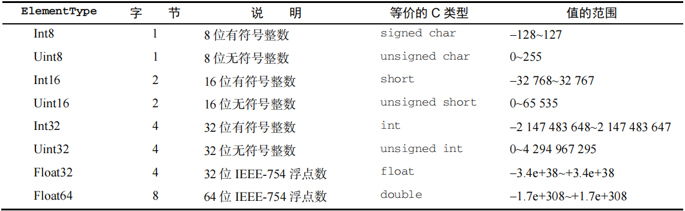

# 数组

`ECMAScript` 数组是一组有序的数据，但跟其他语言不同的是：

- 数组中每个槽位可以存储任意类型的数据。
- 数组是动态大小的，会随着数据添加而自动增长。

<hr>

## 普通数组

### 创建数组

创建数组的传统方式：构造器、字面量、转型函数。

```js
// 构造器创建
new Array(); 	// 长度为0的空数组，[]
new Array(10); 	// 具有指定长度的空数组，[]
new Array(1, 2); // 创建数组并填充元素，[1, 2]

// 转型函数
Array(); 			// 空数组，[]
Array(1, 2, 3); 	// [1, 2, 3]

// 字面量：与对象一样，在使用数组字面量表示法创建数组不会调用 Array 构造函数。
let arr = [];
let arr1 = [0, ,2];
```

新增方法：

- `Array` 构造器上有两个 `ES6` 新增的用于创建数组的静态方法：`from()` 和 `of()`。
- `from()`用于将类数组结构转换为数组实例，而 `of()` 用于将一组参数转换为数组实例。


##### `Array.from`方法

`Array.from`方法，用于将任何可迭代的对象（字符串、数组、类数组、迭代器、集合和映射等）转换为数组。

参数：

- 一：字符串、数组或类数组对象（即任何可迭代的结构，包括迭代对象、`Set`集合和`Map`映射等）
- 二：映射函数，用于增强新数组的每一项元素（相当于调用了数组的 `map` 方法），可选的。
- 三：指定映射函数的`this`对象【这个重写的`this`在箭头函数中不适用】

```js
// 首参为字符串：按照码点拆分为单字符数组
Array.from("wanzi"); 	// ['w', 'a', 'n', 'z', 'i']
Array.from("ab😊de"); 	// ['a', 'b', '😊', 'd', 'e']

// 首参为数组：进行浅克隆
Array.from([1, 2, 3, 4]); // [1, 2, 3, 4]，浅克隆，两者相互独立。

// 首参为类数组：转为数组
Array.from({
    0: 1,
    1: 2,
    length: 2
}); // [1, 2]

// 传入一个映射函数以及修改其this指向
Array.from("wanzi", function(x) {
    return x + this.power;
}, {power: 1}); 	// ['w1', 'a1', 'n1', 'z1', 'i1']

// 实现map的功能
Array.from([1, 2, 3, 4], x => x ** 2); // [1, 4, 9, 16]，相当于：[1, 2, 3, 4].map(x => x ** 2)
```

注意：`from` 方法可用于替代在 `ES6` 之前常用的 `Array.prototype.slice.call(arguments)` 将 `arguments` 对象转换为数组的写法。

```js
// 将函数的arguments转为数组
function test() {
    return Array.prototype.slice.call(arguments);
}
test(1, 2, 3, 4); // [1, 2, 3, 4]

function test() {
    return Array.from(arguments);
}
test(1, 2, 3, 4); // [1, 2, 3, 4]
```


##### `Array.of`方法

`Array.of()`可以把一组参数转换为数组。

```js
// 将一组参数转换为数组
Array.of(1, 2, 3, 4); // [1, 2, 3, 4]

// 不能将函数的arguments转为数组，仅仅是包装了一个数组的外套。
function test() {
    return Array.of(arguments);
}
test(1, 2, 3, 4); // [Arguments(4)]
```

<hr>

### 数组空位

使用数组字面量初始化数组时，可以使用一串逗号来创建空位（`hole`）。

`ECMAScript` 会将逗号之间相应索引位置的值当成空位，`ES6` 规范重新定义了该如何处理这些空位。

```js
// 创建空位：有几个逗号，就有几个空位
let arr = [,,,]; // [empty × 3]
```

`ES6` 新增的方法和迭代器与早期 `ECMAScript` 版本中存在的方法行为不同。

`ES6` 新增方法普遍将这些空位当成存在的元素，只不过值为 `undefined` 。

```js
for (const value of [,,,]) {
    console.log(value); // undefined × 3
}

// map方法视空位为empty，无法修改空位的值
[,,,].map(() => 1); // [empty × 3]
```

注意：由于行为不一致和存在性能隐患，因此实践中要避免使用数组空位。如果确实需要空位，则可以显式地用 `undefined` 值代替。

<hr>

### 数组索引

要取得或设置数组的值，需要使用中括号并提供相应值的数字索引（槽位）。

数组长度：

- 数组 `length` 属性的独特之处在于，它不是只读的，并且是自动更新的。字符串的 `length` 是只读的。
- 通过修改 `length` 属性，可以从数组末尾删除或添加元素。
- 数组中最后一个元素的索引始终是 `length - 1`，因此下一个新增槽位的索引就是 `length`。

注意：

- 数组最多可以包含 4 294 967 295 个元素，这对于大多数编程任务应该足够了。
- 如果尝试添加更多项，则会导致抛出错误。
- 以这个最大值作为初始值创建数组，可能导致脚本运行时间过长的错误。

<hr>

### 检测数组

一个经典的 `ECMAScript` 问题是判断一个对象是不是数组。

在只有一个网页（即在同一个全局作用域中）的情况下，使用 `instanceof` 操作符就足矣：

```js
// instanceof判断是否为数组的前提是，该数组必须是在该全局作用域中创建的。
[] instanceof Array; // true
```

如果网页里有多个框架，则可能涉及两个不同的全局执行上下文，因此就会有两个不同版本的 `Array` 构造函数。

如果要把数组从一个框架传给另一个框架，则这个数组的构造函数将有别于在第二个框架内本地创建的数组。

为解决这个问题，`ECMAScript` 提供了 `Array.isArray()` 方法。

这个方法的目的就是确定一个值是否为数组，而不用管它是在哪个全局执行上下文中创建的。

```js
// 判断一个值是否为数组，而不必在意它是在哪个全局作用域中创建的。
Array.isArray([]); // true
// 一个鲜为人知的事实：其实 Array.prototype 也是一个数组。
Array.isArray(Array.prototype); // true

// 浏览器兼容：如果不存在则创建该方法。
if (!Array.isArray) {
	Array.isArray = function(arg) {
    	return Object.prototype.toString.call(arg) === '[object Array]';
  	};
}
```

<hr>

### 查看元素

`at`方法，与中括号语法一样，通过指定的下标访问对应的元素。

注释：接收负值，负值索引会被反向取整。

<hr>

### 迭代器方法

在 `ES6` 中，`Array` 的原型上暴露了 3 个用于检索数组内容的方法：`keys()`、`values()` 和 `entries()`。

- `keys()`：返回数组索引的迭代器
- `values()`：返回数组元素的迭代器
- `entries()`：返回索引/值对的迭代器

```js
let arr =  ["foo", "bar", "baz", "qux"];

// 获取三个迭代器
arr.keys(); 	// Array Iterator {}，数组索引的迭代器
arr.values(); 	// Array Iterator {}，数组元素的迭代器
arr.entries(); 	// Array Iterator {}，索引/值对的迭代器

// 通过 Array.from() 直接转换为数组实例，因为 from 接收任何可迭代对象。
Array.from(arr.keys()); 	// [0, 1, 2, 3]
Array.from(arr.values()); 	// ['foo', 'bar', 'baz', 'qux']
Array.from(arr.entries()); 	// [[0, 'foo'], [1, 'bar'], [2, 'baz'], [3, 'qux']]

// 扩展：使用ES6的数组解构，可以很轻松地在循环中拆分键值对。
// ES6的迭代方法，都可以直接执行迭代器。
for (const [index, value] of arr.entries()) {
    console.log(index); // 0, 1, 2, 3
    console.log(value); // 'foo', 'bar', 'baz', 'qux'
}
```

<hr>

### 复制与填充

`ES6` 新增了两个方法：批量复制方法 `copyWithin()`，以及填充数组方法 `fill()`。

注释：这两个方法既不会改变数组的大小，也不会改变数组的引用，它们只是替换了其中的指定元素。

##### 填充元素

`fill` 方法，使用一个填充物去替换数组中指定范围内的内容，仅置换数组的内容。

参数：

- 一：填充内容
- 二：开始位置（默认为0）
- 三：结束位置（如果不提供，则默认是数组的末尾）

注释：

- 开始位置和结束位置都是可选的，默认从开头到结尾。即：重置所有元素。
- 负索引值，会被反向换算为正的索引值（加`length`），即：反向检索。
- 当索引超出数组边界，以及开始位置大于结束位置时，该执行会被忽略。

返回值：内容被置换后的数组。只是内容被置换了，数组的引用并没有改变。

```js
const zeros = [0, 0, 0, 0, 0];

// 未指定范围，默认填充整个数组，替换所有元素。
zeros.fill(5); 	// [5, 5, 5, 5, 5]
zeros; 			// [5, 5, 5, 5, 5]
zeros.fill(0); 	// [0, 0, 0, 0, 0]，重置

// 填充指定范围内的元素，范围：[start, end)
zeros.fill(6, 3); 		// [0, 0, 0, 6, 6]，从索引为3的元素开始，直到末尾
zeros.fill(7, 1, 3); 	// [0, 7, 7, 0, 0]，从索引为1的元素开始，直到索引为3的元素之前。
zeros.fill(8, -4, -1); 	// [0, 8, 8, 8, 0]，范围：[1, 4)

// 范围完全超出数组边界时，该操作会被忽略
zeros.fill(1, -7, -6); 	// [0, 0, 0, 0, 0]
zeros.fill(2, 7, 10); 	// [0, 0, 0, 0, 0]
// 范围未完全超出数组边界，使用默认值替换
zeros.fill(3, 3, 9); 	// [0, 0, 0, 3, 3]，范围：[3, length)

// 索引反向：开始位置 > 结束位置，忽略操作
zeros.fill(4, 4, 2); 	// [0, 0, 0, 0, 0]
```


##### 复制元素

`copyWithin` 方法，按照指定范围浅复制数组中的部分内容，然后将它像`fill`一样填充到数组。

参数：

- 一：插入的开始位置（截断式插入，直到结尾）
- 二：复制的开始位置（默认0）
- 三：复制的结束位置（默认`length`）

注释：当索引为负、超出数组边界或者反向检索时，与 `fill` 的处理方式一样。

```js
const ints = [0, 1, 2, 3, 4, 5, 6, 7, 8, 9];

// 从索引5的位置开始插入，复制范围从头到尾。
ints.copyWithin(5); 	// [0, 1, 2, 3, 4, 0, 1, 2, 3, 4]

// 从索引为0的位置开始插入，复制范围：[5, length)
ints.copyWithin(0, 5); 	// [5, 6, 7, 8, 9, 5, 6, 7, 8, 9]

// 从索引为3的位置开始插入，复制范围：[0, 3)
ints.copyWithin(3, 0, 3); // [0, 1, 2, 0, 1, 2, 6, 7, 8, 9]
```

<hr>

### 重写的方法

`Array` 重写了 `toLocaleString()`、`toString()` 和 `valueOf()` 方法。

- `valueOf`：返回数组自身。
- `toString`：将数组元素的等效字符串以逗号分隔拼接成串，各元素优先调用其`toString`方法。
- `toLocaleString`：与`toString`一样返回字符串，但各元素优先调用其`toLocaleString`方法。

```js
// valueOf
['red', 'green', 'blue'].valueOf(); // ['red', 'green', 'blue']

// toString：将数组的每个值都转为等效的字符串，然后以逗号分隔拼接成串。
[1, null, [], {}, true].toString(); // '1,,,[object Object],true'

// toLocaleString：获取一个逗号分隔的数组元素的字符串。

```

注释：`alert()` 期待最终显示为字符串，所以会在后台调用其 `toString()` 方法。

<hr>

### 转换方法

`toString` 和 `toLocaleString` 都是采用默认的逗号来分隔元素。

如果想要自定义分隔符，可使用 `join` 方法，它接收一个字符串参数，然后将数组元素按照指定的分隔符拼接成串。

```js
let arr = [1, 2, 3];

// 默认使用逗号分隔符。
arr.join(); 	// "1,2,3"
arr.join(","); 	// "1,2,3"

// 使用点分隔符
arr.join("."); 	// "1.2.3"
```

<hr>

### 栈方法

`ECMAScript` 给数组提供几个方法，让它看起来像是栈数据结构一样。

栈是一种后进先出（`LIFO，Last-In-First-Out`）的结构，也就是最近添加的项先被删除。

数据项的插入（称为推入，`push`）和删除（称为弹出，`pop`）只在栈的一个地方发生，即栈顶。

**模拟栈**：配合使用 `push` 和 `pop` 就可以模拟栈的存取。


##### 栈顶插入

使用 `push` 方法，可以在数组尾部（栈顶）插入任意多个元素。

参数：接收多个参数，以逗号分隔。

返回值：数组的新长度。

```js
// 在栈顶（即：数组尾部）插入
let arr = [];
arr.push(1, 2, 3); 	// 3
arr; 				// [1, 2, 3]
arr.push(4); 		// 4
arr; 				// [1, 2, 3, 4]
```


##### 栈顶删除

使用 `pop` 方法，可以从数组尾部（栈顶）删除一个元素。

返回值：被删除项。

注释：`pop` 没有参数，一次只删除一项。

```js
// 在栈顶（即：数组尾部）删除
let arr = [1, 2, 3, 4];
arr.pop(); 	// 4
arr; 		// [1, 2, 3]
arr.pop(); 	// 3
arr; 		// [1, 2]
```

<hr>

### 队列方法

栈是以 `LIFO` 形式限制访问的数据结构的，而队列以先进先出（`FIFO，First-In-First-Out`）形式限制访问。

先进先出：在数组末尾添加数据，但从数组首部获取数据。


##### 栈底插入

使用 `unshift` 方法，可以在数组首部（栈底）插入任意多个元素。

参数：接收多个参数，逗号分隔。

返回值：数组的新长度

```js
// 在栈底（即：数组首部）插入
let arr = [1, 2];
arr.unshift(-1, 0); // 4
arr; 				// [-1, 0, 1, 2]
```


##### 栈底删除

使用 `shift` 方法，可以从数组首部（栈底）删除一个元素。

注释：`shift` 与 `pop` 的一样，不接收参数，返回被删除项。

```js
// 在栈底（即：数组首部）删除
let arr = [1, 2, 3];
arr.shift(); 	// 1
arr; 			// [2, 3]
```

**模拟队列**：配合使用 `push` 和 `shift` 可以模拟后入式队列的存取，配合使用 `unshift` 和 `pop` 可以模拟前入式队列的存取。

```js
// 后入式队列（正向队列）的存取方式
let arr1 = [];
arr1.push(1, 2, 3); // 3
arr1; 				// [1, 2, 3]
arr1.shift(); 		// 1

// 前入式队列（反向队列）的存取方式
let arr2 = [];
arr2.unshift(1, 2, 3); 	// 3
arr2; 					// [1, 2, 3]
arr2.pop(); 			// 3
```

<hr>

### 排序方法

数组有两个方法可以用来对元素进行重新排序：`reverse()` 和 `sort()`。


##### 翻转数组

使用 `reverse` 方法，可以将数组翻转，使数组元素反向排序。

```js
// 翻转数组
let arr = [1, 2, 3, 4, 5];
arr.reverse(); 	// [5, 4, 3, 2, 1]
arr; 			// [5, 4, 3, 2, 1]

// reverse方法，只是将数组元素的位置进行了交换，并没有关注元素的内容。
let arr = [1, 3, 2];
arr.reverse(); 	// [2, 3, 1]
```


##### 数组排序

使用 `sort` 方法，可以将数组的元素进行升序或降序排序。

默认情况下，`sort` 会按照升序重新排列数组的所有元素。

**注意**：`sort()` 会在每一项上调用 `String()` 转型函数，然后比较字符串来决定顺序。

```js
// 比较字符串大小
[1, 2, 3, 10, 23].sort(); // [1, 10, 2, 23, 3]
```

为此，`sort()` 方法可以接收一个比较函数，根据比较函数**每一次的返回值**决定是否交换两个参数的位置。

比较函数接收两个参数：以升序排列为标准制定了如下规则，即【只有返回正值，才会交换位置】

- 返回负值：不交换位置
- 返回0：两个参数相等，不交换位置
- 返回正值：交换位置

高级用法：

- 正向排序：比较函数始终返回正值或0。【数组保持原顺序】
- 反向排序：比较函数始终返回负值。【翻转数组】
- 随机排序：比较函数随机返回正值、负值或0。

```js
// 升序：小的放在前面，大的放在后面
arr.sort((a, b) => {
    return a < b ? -1 : a > b : 1 : 0;
})

// 降序：大的放在前面，小的放在后面
arr.sort((a, b) => {
    return a < b ? 1 : a > b : -1 : 0;
})

// 反向排序：推荐使用reverse，因为它更简单也更快。
arr.sort(() => {
    return -1;
})

// 随机排序：随机返回正值、负值或0
arr.sort(() => {
    return Math.round(Math.random()) - 0.5; // 随机数范围：[-0.5, 0.5]
})
------------------------------------------------------------------------------------------------------------
// 纯数字排序
let arr = [1, 3, 2, 10, 23];

// 升序排列
arr.sort((a, b) => {
    return a - b;
}); // [1, 2, 3, 10, 23]

// 降序排列
arr.sort((a, b) => {
    return b - a;
}); // [23, 10, 3, 2, 1]
```

<hr>

### 操作方法

对于数组中的元素，很多操作方法。

##### 数组打平

使用 `concat` 方法，可以将参数数组的元素打平到调用数组中，即：按序连接两个数组。

规则：它首先会创建一个当前数组的副本，然后再把它的参数添加到副本末尾，最后返回这个新构建的数组。

参数：【接收任意多个参数】

- 数组或类数组：默认将该数组的元素打平至调用数组中，可以通过`Symbol.isConcatSpreadable`属性的布尔值阻止该行为。
- 非数组：直接将参数添加至调用数组的末尾。

```js
let arr = [0],
    newArr = [1, 2, 3];

// 参数是非数组
arr.concat(1, 2, 3); // [0, 1, 2, 3]

// 参数是数组或类数组
// 1、默认打平参数数组（连接前后数组）
arr.concat(newArr); // [0, 1, 2, 3]

// 2、阻止打平（将数组作为元素添加）
newArr[Symbol.isConcatSpreadable] = false;
arr.concat(newArr); // [0, [1, 2, 3]]
```


##### 数组切片

使用 `slice` 方法，可以从数组中切出一小片，组成一个新的数组。类似于，从字符串中切取出一个子串。

参数：(开始索引，结束索引)

注释：

- 负值索引会被反向取正。
- 不合规范的范围，均返回空数组。

```js
// 默认从头切到尾：可以将类数组转为数组。
[1, 2, 3].slice(); // [1, 2, 3]

// 从指定索引，切到末尾
[1, 2, 3].slice(1); // [2, 3]

// 切取指定范围：[s, e)
[1, 2, 3, 4, 5].slice(2, 4); // [3, 4]
```


##### 数组移接

使用 `splice` 方法，可以在数组的任意位置插入、删除或替换一定数量的元素。

**移花接木**：在指定位置上，先删除指定数量的旧元素，再接入任意多个新元素。

参数：

- 一：删除的开始位置
- 二：删除的元素数量
- 三：待接入的新元素

返回值：包含被删除元素的数组。如果没有删除元素，则为空数组。

```js
let arr = [1, 2, 3, 4, 5, 6, 7, 8, 9];

// 删除
arr.splice(); 		// []，空删
arr.splice(0, 3); 	// [1, 2, 3]，删除前3个
arr; 				// [4, 5, 6, 7, 8, 9]
// 在5的位置上，删除一个元素
arr.splice(5, 1); 	// [6]
arr; 				//  [1, 2, 3, 4, 5, 7, 8, 9]

// 插入：在指定位置上空删（生成一个切口），然后插入新元素
arr.splice(5, 0, 6); 	// []，空删
arr; 					// [1, 2, 3, 4, 5, 6, 6, 7, 8, 9]

// 移接：在指定位置上，删除一定数量的元素，然后插入新元素
arr.splice(5, 2, 1, 2); // [6, 7]
arr; 					// [1, 2, 3, 4, 5, 1, 2, 8, 9]
```

<hr>

### 搜索方法

`ECMAScript` 提供两类搜索数组的方法：按严格相等搜索和按断言函数搜索。

##### 严格相等

`ECMAScript` 提供了 3 个严格相等的搜索方法：`indexOf()`、`lastIndexOf()` 和 `includes()`。

注释：

- `indexOf()` 和 `lastIndexOf()` 方法，在任何版本都可用，而 `includes` 是`ES7`新增的。
- 三个方法都接收两个参数：要查找的元素，起始搜索位置。
- 在比较第一个参数跟数组每一项时，会使用全等（===）比较，也就是说两项必须严格相等。
- `indexOf()` 和 `includes()` 方法从前往后搜，而 `lastIndexOf()` 从后往前搜。
- `indexOf()` 和 `lastIndexOf()` 都返回要查找的元素在数组中的首位置，如果没找到则返回-1。
- `includes()` 返回布尔值，表示在该数组的指定位置及后是否包含目标元素。

```js
let arr = [1, 2, 3, 4, 5, 4, 3, 2, 1];

// 搜索默认从头开始，一直到结尾。
// 正向搜索：返回目标元素在数组正方向上的首位置。
arr.indexOf(4); 	// 3
// 反向搜索：返回目标元素在数组反方向上的首位置。
arr.lastIndexOf(4); // 5
// 是否包含：在指定的位置及后，是否包含目标元素
arr.includes(4); 	// true

// 从指定位置开始搜索
arr.indexOf(4, 4); 		// 5
arr.lastIndexOf(4, 4); 	// 3
arr.includes(4, 4); 	// true
arr.includes(4, 6); 	// false
```


##### 断言函数

`ECMAScript` 也允许按照自定义的断言函数来搜索数组，每个索引都会调用这个函数。

**断言**：断言函数会根据其返回值来断言索引对应的元素是否是符合搜索要求的匹配项，如果为`true`，则认为该项符合要求。

断言函数会像`forEach`一样遍历整个数组，因此，它也接收 3 个参数：元素、索引和数组本身。

`find()` 、 `findIndex()` 、`findLast` 和 `findLastIndex` 方法都使用了断言函数：

- `find`：返回第一个匹配的元素。
- `findLast`：返回最后一个匹配的元素。
- `findIndex`：返回第一个匹配元素的索引。
- `findLastIndex`：返回最后一个匹配元素的索引。
- 它们都接收第二个可选的参数，用于修改断言函数内部 `this` 的值【箭头函数除外】。

```js
const people = [
    {
        name: "wanzi",
        age: 16
    },
    {
        name: "cherry",
        age: 19
    }
]

// find：返回第一个匹配的元素
people.find((v, i, arr) => v.age < 18); // {name: "wanzi", age: 16}

// findIndex：返回第一个匹配元素的索引
people.findIndex((v, i, arr) => v.age < 18); // 0
```

<hr>

### 迭代方法

`ECMAScript` 为数组定义了 5 个迭代方法，每个方法都会遍历数组，也都接收2个参数【参数与`find`完全相同】

- 一：迭代函数，接收3个参数（元素，索引，数组）
- 二：修改迭代函数的`this`值


##### 遍历数组

使用 `forEach` 方法，可以遍历数组的每个元素，以便对他们进行操作。【该方法没有返回值，也无法设置返回值】

本质上，`forEach()` 方法相当于使用 `for` 循环遍历数组。

```js
// forEach：遍历数组
[1, 2, 3, 4, 5].forEach((item) => {
    console.log(item); // 1, 2, 3, 4, 5
})
```


##### 正合数组

判断数组中的每一项，是否符合要求。如果全符合要求，则为正合数组。

`every` 方法，如果每一项的返回值都为`true`，则`every`方法返回`true`。

```js
// every：判断元素是否都符合要求。
let numbers = [2, 3, 4, 5];

numbers.every((item, index, arr) => item > 1); // true
```

相应的，`some`方法，判断数组中是否具有符合要求的元素，有则`true`。

```js
// some：判断是否有符合要求的元素。为true的条件是至少有一个，为false表示正好一个都没有（正合数组的相反面）。
let numbers = [1, 2, 3, 4, 5];

numbers.every((item, index, arr) => item > 5); // false
```


##### 过滤数组

使用 `filter` 方法，可以从数组中筛选出符合要求的元素，并重新组成一个数组。

```js
// filter：保留返回值为true的元素
[1, 2, 3, 4, 5].filter((item) => item > 3); // [4, 5]
```


##### 映射数组

使用 `map` 方法，可以对元素进行统一的操作，返回由每次`return`值构成的数组。

```js
// map：统一修改每个元素，返回修改后的新数组。
[1, 2, 3, 4, 5].map((item) => item * 2); // [2, 4, 6, 8, 10]

// 模拟和封装map
Array.prototype.myMap = function (callback) {
    let arr = Array.from(this);
    arr.forEach((item, index, array) => {
        array[index] = callback(item, index, array);
    });
    return arr;
}
[1, 2, 3, 4, 5].myMap((item) => item * 2); // [2, 4, 6, 8, 10]

// 实际上，from方法就可以实现map的功能
Array.from([1, 2, 3], item => item * 2); // [2, 4, 6]
// 区别：from方法的第二个参数（回调），只有元素和索引这两个参数。
Array.from([1, 2, 3], (item, index, arr) => {
    // 只有item和index参数，没有arr（因为根本就不需要）
    console.log(item); 	// 1, 2, 3
    console.log(index); // 0, 1, 2
    console.log(arr); 	// undefined, undefined, undefined
})
```

<hr>

### 归并方法

`ECMAScript` 为数组提供了两个归并方法：`reduce()` 和 `reduceRight()`。

这两个方法会迭代数组的所有项，并返回通过指定式子依次运算所有元素后的最终结果。

区别：`reduce` 从前往后遍历，`reduceRight` 从后往前遍历。

参数：

- 回调（归并函数）
- 归并起点，可选。【归并起点：归并的初始值】

归并函数：用于将前一项与当前项进行指定式子的运算，将该结果继续与下一项进行同样的运算，直至算完最后一项。

- 一：上一个归并值 / 上一项
- 二：当前项
- 三：当前项的索引
- 四：数组自身

```js
// 元素累加：将元素依次相加
[1, 2, 3, 4, 5].reduce((pre, cur, index, array) => pre + cur); // 15

// 元素累乘：将元素依次相乘
[1, 2, 3, 4, 5].reduce((pre, cur) => pre * cur); // 20

// 归并起点：设置归并的初值（最终结果 = 归并初值 + 数组归并的结果）
[1, 2, 3, 4, 5].reduce((pre, cur) => pre + cur, 1); // 16（初值1 + 数组归并结果15）

// reduce和reduceRight只是计算的方向不同。在涉及加和乘的运算时，结果完全相同；但涉及减和除等要求顺序的运算时，结果将天差地别。
[1, 2, 3, 4, 5].reduce((pre, cur) => pre - cur);	 	// -13 = 1 - (2 + 3 + 4 + 5)
[1, 2, 3, 4, 5].reduceRight((pre, cur) => pre - cur); 	// -5 = 5 - (1 + 2 + 3 + 4)
```

<hr>

### 数组扁平化

数组扁平化：用于将数组内部的子数组解套，并且可以指定解套的层数。

`Array`原型上具有两个扁平化方法：`flat` 和 `flatMap` 。


##### 扁平化【`flat`】

`flat`方法创建一个新数组，将所有子数组元素递归地连接到指定的深度。

参数：一个整数，表示要解套的层数，默认值：1。【参数大于实际层数也是准许的】

注释：`flat`方法，会删除数组中的空槽。

```js
// 解套数组内部嵌套的数组
const arr = [1, 2, [3, 4]];
arr.flat(); // [1, 2, 3, 4]，默认解套一层。

const arr = [1, 2, [3, 4, [5, 6]]];
arr.flat(2); // [1, 2, 3, 4, 5, 6]

// 清除空槽
[1, 2, , 4, 5].flat(); // [1, 2, 4, 5]
------------------------------------------------------------------------------------------------------------

// 模拟flat方法：当然，flat方法的性能总是最好的。

// 子数组只有一层时
[1, 2, [3, 4]].flat(); // [1, 2, 3, 4]
// 等效于：reduce(() => concat(), [])
[1, 2, [3, 4]].reduce((acc, val) => acc.concat(val), []); // [1, 2, 3, 4]
// 也等效于：[].concat(...)
[].concat(...[1, 2, [3, 4]]); // [1, 2, 3, 4]

// 子数组具有多层时：递归解套
// 使用reduce + concat
function flatDeep(arr, d = 1) {
  	if (!Array.isArray(arr)) {return arr;}
    // 判断各元素是否是数组，如果是继续递归判断，不是则直接返回。
  	return d > 0 ? arr.reduce((acc, val) => acc.concat(flatDeep(val, d - 1)), []) : arr.slice();
}
// 使用扩展运算符：自动解套所有层级。
function flatten(input) {
  	const stack = [...input];
  	const res = [];
  	while (stack.length) {
    	// pop value from stack
    	const next = stack.pop();
    	if (Array.isArray(next)) {
      		// 如果是数组，将它推回stack中，继续遍历判断。
      		stack.push(...next);
    	} else {
            // 如果不是数组，将它推入res中保存。
      		res.push(next);
    	}
  	}
  	// reverse to restore input order
  	return res.reverse();
}
```


##### 扁平映射【`flatMap`】

`flatMap`方法，是`flat`与`map`的结合且解套层级为1。相当于`arr.map(...args).flat()`，但它比分别调用这两者更有效率。

```js
// 扁平映射：只能解套一层
const arr = [1, 2, [3], [4, 5], 6, []];
arr.flatMap(v => v); // [1, 2, 3, 4, 5, 6]
// 相当于：在调用了map之后，接着调用flat
arr.map(v => v).flat(); // [1, 2, 3, 4, 5, 6]

// 有时，使用for循环比flatMap的效率更高
const arr = [1, 2, 3, 4];
arr.flatMap((x) => [x, x * 2]);
// is equivalent to
const n = arr.length;
const acc = new Array(n * 2);
for (let i = 0; i < n; i++){
  	const x = arr[i];
  	acc[i * 2] = x;
  	acc[i * 2 + 1] = x * 2;
}
// [1, 2, 2, 4, 3, 6, 4, 8]
/* 因为flatMap必须对临时数组进行垃圾收集，以及需要频繁调整返回数组的大小。
然而，在需要它的灵活性和可读性的情况下，flatMap可能仍然是正确的解决方案。*/

// 从一个句子中分隔出单词列表（以空格为分隔符）
const arr1 = ["it's Sunny in", "", "California"];
arr1.map((x) => x.split(" "));
// [["it's","Sunny","in"],[""],["California"]]
arr1.flatMap((x) => x.split(" "));
// ["it's","Sunny","in", "", "California"]
```

<hr>

## 定型数组

定型数组（`typed array`）是 `ECMAScript` 新增的结构，目的是提升向原生库传输数据的效率。

实际上，`JavaScript` 并没有`TypedArray`类型，它所指的其实是一种特殊的包含数值类型的数组。

### 历史

​		随着浏览器的流行，人们开始期待使用它来运行复杂的 `3D` 应用程序。早在 2006 年，`Mozilla`、`Opera` 等浏览器提供商就实验性地在浏览器中增加了用于渲染复杂图形应用程序的编程平台，并且无须安装任何插件。其目标是开发一套 `JavaScript API`，从而充分利用 `3D` 图形 `API` 和 `GPU` 加速，以便能够在`<canvas>`元素上渲染出复杂的图形。


##### `WebGL`

​		最后的 `JavaScript API` 是基于 `OpenGL ES`（`OpenGL for Embedded Systems`）2.0 规范的。`OpenGL ES` 是 `OpenGL` 专注于 `2D` 和 `3D` 计算机图形的子集。这个新 `API` 被命名为 `WebGL`（`Web Graphics Library`），于 2011 年发布 1.0 版。有了它，开发者就能够编写涉及复杂图形的应用程序，它会被兼容 `WebGL` 的浏览器原生解释执行。

​		由于`JavaScript` 默认采用双精度浮点格式存储数值，导致操作 `JavaScript` 数组不仅浪费内存而且效率低下。因此， 在 `WebGL` 的早期版本中，当 `WebGL` 每次用到`JS`数组时，都需要将其转换为符合自身的高要求的数组。而这也导致了性能的白白浪费。


##### 定型数组

​		这当然是难以接受的，`Mozilla` 为解决这个问题实现了 `CanvasFloatArray`。这是一个提供 `JavaScript` 接口的、C 语言风格的浮点值数组。`JavaScript` 运行时使用这个类型可以分配、读取和写入数组。这个数组符合`WebGL`的要求，可以直接传给底层的图形驱动程序 `API`，也可以直接从底层获取到。最终，`CanvasFloatArray` 变成了今天的 `Float32Array`。

<hr>

### 缓冲和视图

​		为了达到最大的灵活性和效率，`JavaScript` 类型数组将实现拆分为**缓冲**和**视图**两部分。一个缓冲区描述的是一个数据块。缓冲区没有格式可言，并且不提供机制访问其内容。而为了访问在缓冲区中的数据，还需要使用视图。视图提供了上下文，即数据类型、起始偏移量和元素数，它将数据转换为实际的有类型的数组。

#### 缓冲区

`ArrayBuffer` 是一种数据类型，用来创建一个通用的、长度固定的二进制数据的缓冲区。

`ArrayBuffer` 就是一个普通的 `JavaScript`  构造函数，用于在内存中分配一个固定字节长度的空间。

参数：`length`，指定缓冲区的长度，单位（字节/`byte`）【`1byte(B)` = `8bit(b)`】

返回值：一个指定大小、长度固定的缓冲区，其中的数据被初始化为0。

注意：

- 你不能直接操作 `ArrayBuffer` 的内容，而是要通过类型数组对象或 `DataView` 对象来操作，它们会将缓冲区中的数据表示为特定的格式，并通过这些格式来读写缓冲区的内容。【即数组缓冲区中的数据必须通过视图来操作】

- `SharedArrayBuffer` 是 `ArrayBuffer` 的一个变体，可以无须复制就在执行上下文间传递它。

```js
// 创建一个固定长度为16字节的缓冲区（内存空间）
const buffer = new ArrayBuffer(16); // ArrayBuffer(16)
buffer.byteLength; 					// 16

// 缓冲区一经创建就不能再调整大小了。不过，可以使用slice()从中切出一小片来生成一个新的缓冲区。范围：[s, e)
const subBuffer = buffer.slice(4, 12); 	// ArrayBuffer(8)
subBuffer.byteLength; 					// 8

/* 计算机内部以十六进制数的形式进行存储。十六进制中最大的字符为F，刚好可以使用4位二进制数1111来表示，刚好占用半个字节（4b）。
那么，每个十六进制的字符最多只占半个字节（4b），因此每个字节（8b）需要使用两位十六进制的字符来表示。
计算机以字节为存储单元，1B = 8b，最大数为255。使用2位十六进制的字符刚好可以表示这1个字节，且0xff = 255。*/
// 例如：以十六进制格式存储数据0x1234时，首先它使用两个字节来存储，被会分为0x12和0x34两部分。第一字节存0x12，第二字节存0x34。
// 再如：以十六进制格式存储数据0x1，它被分为0x00和0x01两部分，需要两个字节。结果：[0x00, 0x01]
```

`ArrayBuffer` 某种程度上类似于 `C++` 的 `malloc()`，但也有几个明显的区别：

- `malloc()` 在分配失败时会返回一个 `null` 指针。`ArrayBuffer` 在分配失败时会抛出错误。

- `malloc()` 可以利用虚拟内存，因此最大可分配尺寸只受可寻址系统内存限制。`ArrayBuffer` 分配的内存不能超过 `Number.MAX_SAFE_INTEGER`（`2^52 - 1`）个字节，否则将抛出`RangeError`。

- `malloc()` 调用成功不会初始化实际的地址。声明 `ArrayBuffer` 则会将所有二进制位初始化为 0。 

- 通过 `malloc()` 分配的堆内存除非调用 `free()` 或程序退出，否则系统不能再使用。而通过声明 `ArrayBuffer` 分配的堆内存可以被当成垃圾回收，不用手动释放。

##### 属性

1. `ArrayBuffer` 构造器上具有一个`length`属性，它指示缓冲区中的字符长度。
2. `ArrayBuffer` 原型上具有一个 `byteLength` 属性，它是只读属性，指示缓冲区中的字节大小。在 `ArrayBuffer` 构造完成时生成。
3. `ArrayBuffer` 构造器上有一个 `Symbol.species` 符号属性，它返回 `ArrayBuffer` 构造器。

##### 方法

- `ArrayBuffer` 构造器上具有一个`isView`方法，用于判断参数是否是引用该缓冲区的视图实例（`DataView`或类型数组）。
- `ArrayBuffer` 原型上具有一个`slice`方法，与`Array.prototype.slice`方法作用一样。


#### 视图

视图可以有不同的类型，会根据`ElementType`转换为相应的数组，但它们引用的都是同一个 `ArrayBuffer` 中存储的二进制数据。

##### `DataView`

​		第一种允许你读写 `ArrayBuffer` 的视图是 `DataView`。这个视图专为文件 `I/O` 和网络 `I/O` 设计，其 `API` 支持对缓冲数据的高度控制，但相比于其他类型的视图性能也差一些。`DataView` 对缓冲内容没有任何预设，也不能迭代。

​		`DataView`的实例只能读取或写入已有的缓冲区，它可以使用这个缓冲区的全部或部分，且保存着对其关联缓冲区的引用，以及视图在缓冲中开始的位置。

参数：`buffer [, byteOffset [, byteLength]]`

- 一：一个已存在的`ArrayBuffer` 或 `SharedArrayBuffer` 对象，它是 `DataView` 对象的数据源。
- 二：该 `DataView` 对象的首个字节在 `buffer` 中的字节偏移，即：视图头在缓冲区中的索引位置。
- 三：该 `DataView` 对象的字节长度，默认长度是 `buffer` 中从 `byteLength`后的剩余长度。

注意：如果 `byteOffset` 或者 `byteLength` 参数的值，导致视图超出了 `buffer` 的边界就会抛出`RangeError`异常。

返回值：

- 一个可引用指定缓冲区的 `DataView` 实例。
- 它相当于缓冲区的“解释器”，它知道如何在读取或写入时正确地转换字节码。
- 也能够在二进制层面处理整数与浮点转化、字节顺序等其他有关的细节问题。

原型属性：【就是创建时的三个参数】

- `buffer`：指示该 `DataView` 实例被构造时所引用的 `ArrayBuffer` 实例。【只读】
- `byteLength`：指示该 `DataView` 实例的字节长度。【只读】
- `byteOffset`：指示该 `DataView` 实例的字节偏移。【只读】

```js
// 创建一个固定长度为16字节的缓冲区
const buffer = new ArrayBuffer(16);

// 创建一个可以引用该缓冲区的视图
const view1 = new DataView(buffer); 		// 没有指定该视图的字节偏移和字节长度，默认引用整个缓冲区。
const view2 = new DataView(buffer, 4); 		// 该视图从索引4的位置开始，其总长度为剩余的全部12字节
const view3 = new DataView(buffer, 4, 4); 	// 该视图从索引4的位置开始，选取自身及其后的总共4个字节。

// 注释：三个视图都指向同一个缓冲区
view1.buffer <===> view2.buffer <===> view3.buffer; // true

// 字节偏移
view1.byteOffset; // 0
view2.byteOffset; // 4
view3.byteOffset; // 4

// 字节长度
view1.byteLength; // 16
view2.byteLength; // 12
view3.byteLength; // 4
```

原型方法：

- 读取：`get-ElementType`，如：`getInt8()`、`getUint8()` 等等。参数：`（索引，字节序）`
- 写入：`set-ElementType`，如：`getInt8()`、`setUint8()` 等等。参数：`（索引，修改值，字节序）`

`ElementType`：

​		`DataView` 对存储在缓冲内的数据类型没有预设。因此，它暴露的 `API` 强制开发者在读写时要指定一个`ElementType`。当为`DataView`指定了一个`ElementType`时，它就可以根据`ElementType`的格式在进行读写时完成相应的转换。

​		`ECMAScript` 6 支持 8 种不同的 `ElementType`（见下表）【**其中英文前缀表示数值类型，数字后缀表示一个字符所占据的位**】

 

视图读取和写入：视图 <==> 缓冲

- 读取：缓冲数组 ==> 视图数组 ==> 数据
- 写入：数据 ==> 视图数组 ==> 缓冲数组

  

```js
// 创建一个长度为2字节的缓冲区
const buffer = new ArrayBuffer(2);
// 创建一个可引用该缓冲区的视图
const view = new DataView(buffer);

// 当视图调用ElementType的对应方法时，视图会被转换为相应类型的数组，该数组的每个槽位也都是ElementType的类型。
// 例如：view.getInt8()，view会被转为一个Int8类型的数组，其槽位也是Int8类型。每个槽位被分配8位，即一个字节。

// 整个缓冲的初始位均为0
// Int8类型的每个字符占据8位，刚好是一个字节（1B = 8b）。那么，使用getInt8来读取该缓冲区，刚好可以读到两个Int8的字符。
view.getInt8(0); 	// 0，第一个字符
view.getInt8(1); 	// 0，第二个字符
// 而使用getInt16来读取，则刚好可以读取到一个Int16的字符，因为该字符占用了整个缓冲区（2B = 16b）。
view.getInt16(0); 	// 0，第一个字符
view.getInt16(1); 	// RangeError: Offset is outside the bounds of the DataView

// 给缓冲区写入数据：无论读写，DataView都会首先自动地将数据转换为特定的ElementType格式。
// 写入两个Int8类型的数据：该视图被转换为一个Int8类型的数组，经过视图对缓冲区的分配之后，该数组获得了两个完整的槽位。
// 将整个缓冲区中的所有位填充为1
view.setInt8(0, 255);	// 将第一个槽位填充为255，在缓冲区表示为：1111 1111，缓冲区状态：[0xff, 0x00]
view.setInt8(1, 0xFF);	// 将第二个槽位填充为255，在缓冲区表示为：1111 1111，缓冲区状态：[0xff, 0xff]
// 现在整个缓冲的位都是1了，如果以Int16的数据类型来查看缓冲区中的数据，结果应是：-1。
view.getInt16(0); 		// -1，计算机将1111 1111 1111 1111当作二补数存储，读取时由于发生进制转换，要先将其转为原码。
// 二补数：1111 1111 1111 1111 的原码为：1000 0000 0000 0001，转换十进制：-1
```

**字节序**：

​		字节序，指的是计算系统维护的一种字节顺序的约定。`DataView` 只支持两种约定：大端字节序和小端字节序。

​		高位字节：在一条数据中靠左的字节，与数学中的***“千，百，十，个”***类似，将处于高位的数放在左边。低位字节则与此相反。

​		内存高位：在一个内存条中靠右的地址，与数组的索引顺序**`[0, 1, 2, 3]`**类似，将高位地址放右边。内存低位则与此相反。

​		大端字节序也称为“网络字节序”，它将一条数据中的高位字节存储在内存的低位，而将低位字节存储在内存的高位。例如：对于`0x1234`来说，高位字节为`0x12`，低位字节为`0x34`，将该数据以大端字节序来存储的结果为：`[0x12, 0x34]`。

​		小端字节序，与大端字节序的存储顺序相反，它将一条数据中的高位字节存储在内存的高位，将低位字节存储在内存的低位。例如：对于`0x1234`来说，高位字节为`0x12`，低位字节为`0x34`，将该数据以小端字节序来存储的结果为：`[0x34, 0x12]`。

​		`JavaScript` 运行时所在系统的**原生字节序**（通常为小端字节序）决定了如何读取或写入字节，但 `DataView` 并不遵守这个约定。对一段内存而言，`DataView` 是一个中立接口，它会遵循你指定的字节序。`DataView` 的**所有 `API` 方法都以大端字节序作为默认值**，但接收一个可选的布尔值参数，设置为 `true` 即可**启用小端字节序**。

```js
// 创建一个长度为2字节的缓冲区
const buffer = new ArrayBuffer(2);
// 创建一个可引用该缓冲区的视图
const view = new DataView(buffer);

// 按字节序读取
// 填充缓冲与视图
// Uint8，一个元素占一个字节，使用8位二进制数来表示。
view.setUint8(0, 0x80); // 第一个元素：0x80 <==> 1000 0000
view.setUint8(1, 0x01); // 第二个元素：0x01 <==> 0000 0001
// 默认以大端字节序来存储，缓冲区数据为：1000 0000 0000 0001，缓冲数组：[0x80, 0x01]

// 按大端字节序读取为Uint16类型的数据（0x8001），0x80是高字节（居内存低位），0x01是低字节（居内存高位）。
view.getUint16(0); // 32769 <==> 0x8001 <==> 1000 0000 0000 0001 <==> 2^15 + 2^0;

// 按小端字节序读取为Uint16类型的数据（0x0180），0x80是高字节（居内存高位），0x01是低字节（居内存低位）。
view.getUint16(0, true); // 384 <==> 0x0180 <==> 0000 0001 1000 0000 <==> 2^8 + 2^7;
------------------------------------------------------------------------------------------------------------

// 按字节序写入
// 按大端字节序写入Uint16
view.setUint16(0, 0x0004); // 高字节0x00（居内存低位），低字节0x04（居内存高位）
// 在缓冲区的数据为：0000 0000 0000 0100，缓冲数组：[0x00, 0x04]
view.getUint8(0); // 0，内存低位 ==> 高位字节0x00
view.getUint8(1); // 4，内存高位 ==> 低位字节0x04

// 按小端字节序写入Uint16
view.setUint16(0, 0x0004, true); // 高字节0x00（居内存高位），低字节0x04（居内存低位）
// 在缓冲区的数据为：0000 0100 0000 0000，缓冲数组：[0x04, 0x00]
view.getUint8(0); // 4，内存低位 ==> 低位字节0x04
view.getUint8(1); // 0，内存高位 ==> 高位字节0x00
------------------------------------------------------------------------------------------------------------

// 边界情况
// DataView 完成读、写操作的前提是必须有充足的缓冲区，读写范围超出缓冲区的长度就会抛出RangeError
const buf = new ArrayBuffer(6); // 创建一个长度为6B的缓冲区
const view = new DataView(buf);

// 该view数组最大索引为2，3超出视图数组的边界，抛出RangeError异常。
view.getInt32(3); // view总槽位（6 - 32 ÷ 8 + 1）即：视图数组[0, 0, 0]
------------------------------------------------------------------------------------------------------------

const buf = new ArrayBuffer(6); // 创建一个长度为6B的缓冲区
const view = new DataView(buf);

// 视图数组的长度
// 在视图数组中，每相邻的n个字节就可以组成一个相应的ElementType的类型字符，然后产生一个该ElementType类型的槽位。
// 对一个视图而言，其数组长度为（n - m + 1）。其中，n为缓冲区长度，m为每个ElementType类型的字符所占据的字节。
// 例如：view.getInt16()的数组的长度为：6 - 16 ÷ 8 + 1 = 5。视图数组：[0, 0, 0, 0, 0]
// 缓冲数组：[0, 0, 0, 0, 0, 0]（一个字节占一个槽位），Int16的视图数组：[0, 0, 0, 0, 0]（一个符号占一个槽位）
// Int16的视图数组由缓冲数组的每相邻2个字节组合而成：0-1 => 0, 1-2 => 1, ..., 4-5 => 4
view.getInt16(0); // 0
view.getInt16(1); // 0
view.getInt16(2); // 0
view.getInt16(3); // 0
view.getInt16(4); // 0
view.getInt16(5); // RangeError: Offset is outside the bounds of the DataView

// 写入数据
// 在写入数据时，建议按照每一位来写（如：setInt8），或者隔一个字符来写。
view.setInt8()
```

更多参见：[`MDN`字节序](https://developer.mozilla.org/zh-CN/docs/Glossary/Endianness)

内存优化：

- 同一个缓冲区可以对应多个视图，每个视图在缓冲中都有一个起始位置。
- 视图必须相互独立，不应有重合，否则低位的数据会被高位的数据覆盖。
- 同一个缓冲可以对应多个视图，这正是使得缓冲区被最大化利用的关键。

```js
// 创建一个6字节的缓冲区：[0, 0, 0, 0, 0, 0]
const buffer = new ArrayBuffer(6);
// 引用该缓冲区
const view = new DataView(buffer);

// 写入不同的ElementType类型的数据
// 前两个字节，写入一条Int16的数据【大端字节序：高字节低位置，低字节高位置】
view.setInt16(0, 0x12); // 缓冲区：[0x00, 0x12, 0, 0, 0, 0]
// 第3字节及其后的总共4个字节，写入一条Int32格式的数据。
view.setInt32(2, 0x34); // 缓冲区：[0x00, 0x12, 0x00, 0x00, 0x00, 0x34]

// 或者将缓冲分为多个独立的视图，分开读写。
const view1 = new DataView(buffer, 0, 2); // 引用缓冲中的前两个字节，引用范围：[0, 2)
const view2 = new DataView(buffer, 2, 4); // 引用缓冲中从2及后总共4个字节，引用范围：[2, 6)

view1.setInt16(0, 0x12); // [0, 0x12, 0, 0, 0, 0]
view2.setInt32(0, 0x34); // [0, 0x12, 0, 0, 0, 0x34]
------------------------------------------------------------------------------------------------------------
    
// 读取数据
view.getInt16(0); // 18 === 0x0012
view.getInt32(2); // 52 === 0x00000034

// 从不同的视图读取
view1.getInt16(0); // 18 === 0x0012
view2.getInt32(0); // 52 === 0x00000034
```


##### 定型数组

​		定型数组是另一种形式的 `ArrayBuffer` 视图。

​		虽然概念上与 `DataView` 接近，但定型数组的区别在于，它特定于一种 `ElementType` 且遵循系统**原生的字节序**（通常为小端）。

​		相应地，定型数组提供了适用面更广的 `API` 和更高的性能。设计定型数组的目的就是提高与 `WebGL` 等原生库交换二进制数据的效率。由于定型数组的二进制表示对操作系统而言是一种容易使用的格式，`JavaScript` 引擎可以重度优化算术运算、按位运算和其他对定型数组的常见操作，因此使用它们速度极快。

注释：

- 没有名为 `TypedArray` 的全局属性，也没有直接可见的 `TypedArray` 构造函数。它是一个隐藏类，作为公共的原型来使用。
- `TypedArray`的子类是特定元素类型的类型化数组的构造器，它们是全局属性。如：`Int8Array`，`Int16Array` 等等。
- `TypedArray` 是全局的但它不可直接访问，它的作用就是为其子类提供通用的属性和方法。

```js
// TypedArray是所有定型数组构造器的原型。
// 查看Int8Array的原型
Object.getPrototypeOf(Int8Array); // ƒ TypedArray() { [native code] }
```

更多参考：[`TypedArray MDN`](https://developer.mozilla.org/en-US/docs/Web/JavaScript/Reference/Global_Objects/TypedArray#description) 

**创建定型数组的方式**：

- 读取已有的缓冲：从已有的缓冲区中读取数据来生成自己的定型数组，且维护该缓冲区。如：`new Int32Array(buffer)` 。
- 使用自有缓冲：每个定型数组都会自己创建缓冲区（使用已有缓冲的除外）。如：`new Int32Array(6)` 会创建一个24字节的缓冲。
- 填充可迭代结构：给`TypedArray`传递任何可迭代结构，它都会从中读取数据然后生成自己的定型数组以及缓冲区。
- 填充基于任意类型的定型数组：填充其他任意类型的定型数组，从中读取数据，并生成自己的定型数组以及缓冲区。
- 另外，通过`TypedArray.from()`和`TypedArray.of()`也可以创建定型数组及其缓冲。如：`Int16Array.from([3, 5, 7,])`

`TypedArray`的子类如下表所示：【`TypedArray`上的所有属性和方法，只能通过其子类以及其子类构造的实例来调用】

| 构造函数       | 位数 | 字节 | 类型描述           | C语言等价类型 |
| -------------- | ---- | ---- | ------------------ | ------------- |
| `Int8Array`    | 8    | 1    | 有符号8位整型      | `int8_t`      |
| `Uint8Array`   | 8    | 1    | 无符号8位整型      | `uint8_t`     |
| `Int16Array`   | 16   | 2    | 有符号16位整型     | `int16_t`     |
| `Uint16Array`  | 16   | 2    | 无符号16位整型     | `int16_t`     |
| `Int32Array`   | 32   | 4    | 有符号32位整型     | `int32_t`     |
| `Uint32Array`  | 32   | 4    | 无符号32位整型     | `uint32_t`    |
| `Float32Array` | 32   | 4    | 单精度(32位)浮点数 | `float`       |
| `Float64Array` | 64   | 8    | 双精度(64位)浮点数 | `double`      |

参数：

- 单个参数：可以是 `length`（确切的数字）、`typedArray`（具体的定型数组）、`object`（任何对象）三者的其中之一。
  - `length`：创建一个指定长度的定型数组及其缓冲，缓冲区的字节长度为：`length` × 定型数组每个元素占用的字节。
  - `typedArray`：对于非`bigint`型的定型数组，只能传入非`bigint`型定型数组。而`bigint`型定型数组也只接受`bigint`型的。
  - `object`：将该`object`转换为定型数组，犹如调用了 `TypedArray.from()` 方法一样。
- 多个参数：`(buffer, byteLength, length)`【`byteLength`和`length`用于指定该定型数组对其缓冲区的引用范围，默认全部】
  - 一：所引用的缓冲
  - 二：该定型数组在其缓冲区中的字节偏移，默认值0。【字节偏移必须是其`BYTES_PER_ELEMENT`的整数倍】
  - 三：该定型数组的长度。【定型数组的总字节不能超过其缓冲的总字节】

```js
// 与DataView不同的是，TypedArray（定型数组）的数组类型固定，其元素也是相应的固定类型且相互独立。
// 例如：Int32Array创建的数组和元素都是Int32类型的，各元素均占4字节，在内存上紧密相连且相互独立。
// DataView的数组槽位以1字节为偏移量依次编号，造成了相邻元素之间，右边的元素经常会覆写左边的元素。
// 而TypedArray的数组槽位以单个元素所占的字节为偏移量来完成编号，实现了各元素之间紧密相连且相互独立。

// 读取已有缓冲
const buffer = new ArrayBuffer(12);
const view = new DataView(buffer); // 以Int32为例，该视图数组每个元素占4字节，相邻元素在内存上只偏移1字节，数组长度为9
const int32s = new Int32Array(buffer); // 数组和元素都是Int32类型的，每个元素占4字节，相邻元素字节偏移为3，该数组长度为3
// 引用部分缓冲：虽然它们只引用了其缓冲的一部分，但它们维护的缓冲都是同一个。
const int32c = new Int32Array(buffer, 8); 		// 引用最后一个元素对应的缓冲。
const int32b = new Int32Array(buffer, 4, 1); 	// 引用第二个元素对应的缓冲。 
// int32b.buffer <===> int32c.buffer <===> buffer

// 使用自有缓冲
const int32s = new Int32Array(6); // 创建一个长度为6的Int32类型数组，每个元素占4字节，因此其缓冲总共24字节。

// 填充可迭代结构
const int8s = new Int8Array([1, 2, 3]); // 缓冲区：[0x01, 0x02, 0x03]，总共3字节

// 使用其他定型数组【原生字节序：通常为小端字节序】
const int16s = new Int16Array(int8s); // 缓冲区：[0x01, 0x00, 0x02, 0x00, 0x03, 0x00]，总共6字节

// 通过from或of方法：实际上与填充可迭代结构一样。
Int16Array.from([1, 2, 3]); // 缓冲区：[0x01, 0x00, 0x02, 0x00, 0x03, 0x00]，总共6字节
Int16Array.of(1, 2, 3, 4); 	// 缓冲区：[0x01, 0x00, 0x02, 0x00, 0x03, 0x00, 0x04, 0x00]，总共8字节
```

原型通用属性：【`TypedArray.prototype`上的共享属性，都是只读属性】

- `buffer`：该定型数组所维护的缓冲区。
- `length`：指示该定型数组的长度。`(n ÷ m)`，其中，`n` 是其缓冲区的字节长度，`m` 是每个元素所占据的字节长度。
- `byteLength`：指示该定型数组对其缓冲所引用的字节长度，它等于`length属性值 * BYTES_PER_ELEMENT属性值`。
- `byteOffset`：指示该定型数组在其缓冲中的字节偏移，它实际上就是构造该定型数组时传入的`byteOffset`参数。

```js
const buffer = new ArrayBuffer(12);

const int16s = new Int16Array(buffer); // 默认引用整个缓冲区
int16s.buffer; 		// ArrayBuffer(12)，且 int16s.buffer === buffer。
int16s.length; 		// 6
int16s.byteLength; 	// 12
int16s.byteOffset; 	// 0

const int16a = new Int16Array(buffer, 2, 4); // 引用部分缓冲
int16a.buffer;		// ArrayBuffer(12)，且 int16s.buffer === buffer。
int16a.length;		// 4
int16a.byteLength;	// 8
int16a.byteOffset;	// 2
```

构造器属性：【`TypedArray`上的属性】

- `BYTES_PER_ELEMENT`：指示在其构造的定型数组中每个元素所占用的固定字节。如：`Int8`元素是1字节，`Int16`元素是2字节。
- `name`：构造器的名称。如：` Int16Array.name === "Int16Array"` 。
- `@@species`：符号属性，返回构造器自身。可以通过它来重写`new`执行构造器时的返回值。

```js
// 查看每个构造器上的属性，以Int16Array为例：
Int16Array.BYTES_PER_ELEMENT; 	// 2
Int16Array.name; 				// "Int16Array"
Int16Array[Symbol.species]; 	// function int16Array()
```

构造器方法：【`TypedArray`上的方法】

- `from`：与`Array.from`方法的功能和使用基本一样，但还是有几点细微的区别：
  - 当第一个参数是迭代器时，`TypedArray.from`会从迭代器中搜集数据并创建其实例，然后在该实例上设置值。而`Array.from`是直接设置从迭代器中接收到的每个值，然后在最后设置数组的长度。
  - 在`Array.from`使用`[[DefineOwnProperty]]`的地方，`TypedArray.from`都会使用`[[Set]]`来处理。因此，当传入`proxy`对象时，`TypedArray.from()`会使用`handler.set()`来创建新元素，而`Array.from`使用`handler.defineProperty()`。
  - 当 `Array.from` 接收到一个没有迭代器的类数组时，它会尊重并保留空槽，最终生成一个空数组。而`TypedArray.from`要确保结果是密集的，最终生成一个0字节的定型数组。
  - 另外，`TypedArray.from(obj, mapFn, thisArg)` 和 `TypedArray.from(Array.prototype.map.call(obj, mapFn, thisArg))`是等效的。
- `of`：与`Array.of`方法的功能和使用基本一样，但与`from`一样还是有一些细微的区别：同上第2条。

```js
// 我们把具有length属性的对象，称为类数组。而不具有length属性的对象，称为非类数组，如：只有数字属性的对象。
// 把具有迭代器属性的对象，称为迭代器对象。具有迭代器属性的类数组称为迭代器类数组，没有迭代器的类数组是非迭代器类数组。

// 从非迭代器类数组中读取数据，生成自己的视图与缓冲
Int16Array.from({length: 5}, (v, k) => k); // Int16Array(5) [0, 1, 2, 3, 4]

// 从非迭代器非类数组中读取数据
Array.from({0: 1, 1: 2}); // []
Int16Array.from({0: 1, 1: 2}); // Int16Array(0)
```

更多参考：[`MDN`类型化数组](https://developer.mozilla.org/zh-CN/docs/Web/JavaScript/Typed_arrays) 、[`three.js`类型化数组](http://www.yanhuangxueyuan.com/Javascript/typeArray.html) 、[`TypedArray MDN`](https://developer.mozilla.org/en-US/docs/Web/JavaScript/Reference/Global_Objects/TypedArray) 、[`three.js`缓冲区](http://www.webgl3d.cn/threejs/docs/#api/en/core/BufferAttribute) 

<hr>

### 定型数组方法

定型数组上的方法，基本上都是原型上通用的方法【`TypedArray.prototype`上的共享方法】，它们与`Array`原型上的方法基本相同。

更多参考：[定型数组实例方法 `MDN`](https://developer.mozilla.org/en-US/docs/Web/JavaScript/Reference/Global_Objects/TypedArray#instance_methods)


#### 独有方法

虽然`TypedArray.prototype`上的大多数方法与`Array.prototype`上的无异，但`TypedArray.prototype`上仍具有几个独有的方法。

这是因为定型数组也是使用数组缓冲来存储数据，而数组缓冲无法调整大小。因此，下列方法经常修改数组大小而不适用于定型数组：

- `concat`
- `splice`
- `shift`
- `unshift`
- `push`
- `pop`

##### 设置元素【`set`】

使用`set`方法，可以将源数组中的各个元素依次插入到类型数组的指定位置上。【浅复制】

参数：（源数组，偏移量）

- `source`：可以是`array` 或 `typedArray` 。当是`typedArray`时，它也会创建自己的`Arraybuffer`。
- `offset`：源数组元素在目标数组中的位置偏移量，即：源数据在目标数组中的起始索引。

注释：

- 如果在填充目标数组的过程中源数组的长度加上偏移量超出目标数组的长度，或者偏移量为负值时，都会抛出`RangeError`异常。
- 按照元素在源数组中的排列顺序依次复制到目标数组中，`JavaScript`引擎会智能地将缓冲区的源范围复制到目标范围。

```js
// 创建一个12字节的缓冲
const buffer = new ArrayBuffer(12);
const int16s = new Int16Array(buffer);

// set(source, start)
int16s.set([1, 2, 3], 2); 	// Int16Array(6) [0, 0, 1, 2, 3, 0]

// 使用已有的视图和缓冲，必须保证目标数组具有足够的长度，否则会抛出错误。
const int32s = new Int32Array(int16s.length); // 即：int32s.length ≥ int16s.length;
int32s.set(int16s); 		// Int32Array(6) [0, 0, 1, 2, 3, 0]

// 虽然它们的视图看起来一样，但它们的缓冲各自独立。
int16s.buffer !== int32.buffer;
```

##### 子视图【`subarray`】

使用`subarray`方法，可以从已有的定型数组中提取出一个子定型数组，以形成一个新的子视图。

参数：`(start, end)`，提取范围：`[start, end)`

注释：

- 使用`subarray`只是在现有的缓冲上创建一个新的子视图，它仍然维护这个的缓冲区，且与原定型数组保持相同的类型。
- 如果提取范围为负，则将其钳制为零；如果参数为负，则将其反向取正。

```js
// 创建一个长度为3的Int16定型数组
const int16s = new Int16Array(3);

// 提取子数组
const int16a = int16s.subarray(1); 	// 提取[1, length)范围内的元素及其对应的缓冲区，形成新的子视图。
int16a.buffer === int16s.buffer; 	// 该视图仍维护原缓冲区，并没有创建自己的独立缓冲。

// 修改其中任何一个视图，都会影响到另外的视图，因为它们共同维护一个缓冲。
int16a[0] = 1; // ArrayBuffer(6) [0x00, 0x00, 0x01, 0x00, 0x00, 0x00]，int16s [0, 1, 0]，int16a [1, 0]
```


#### 查看元素【`at`】

使用 `at` 方法，可以查看指定位置上的元素。接收负值索引，它会被反向取正。

注释：当然可以使用中括号语法来访问指定位置上的元素，使用`at`只不过为了提供某些方便。

```js
const int8 = new Int8Array([0, 10, -10, 20, -30, 40, -50]);

// 查看最后一位
int8[int8.length - 1];
int8.at(-1); // 本质上与上式是一样的
```


#### 填充与复制

##### 填充元素【`fill`】

该方法与 `Array.prototype.fill` 方法功能和使用基本一样，并且使用相同的算法。

参数：`(value, start, end)`

##### 复制元素【`copyWithin`】

该方法与 `Array.prototype.copyWithin` 方法功能和使用基本一样，并且使用相同的算法。

参数：`(target, start, end)`

- `target`：插入位置的开始
- `start`：复制范围的开始
- `end`：复制范围的结束


#### 迭代器方法

与`Array`原型上的`keys`、`values`、`entries`三个方法的功能和使用基本一样。

##### 索引迭代器【`keys`】

该方法与 `Array.prototype.keys` 方法功能和使用基本一样，返回索引迭代器。

##### 元素迭代器【`values`】

该方法与 `Array.prototype.values` 方法功能和使用基本一样，返回元素迭代器。

##### 条目迭代器【`entries`】

该方法与 `Array.prototype.entries` 方法功能和使用基本一样，返回`[index, item]`的条目迭代器。


#### 迭代方法

`TypedArray`原型上的迭代方法，与`Array`原型上的迭代方法在功能和使用上基本一样，并且使用相同的算法。

迭代方法：用于对数组中的每个元素按照升序执行一次传入的回调函数，每次执行回调都会返回一个值，它们共同影响最终的结果。

##### 遍历数组【`forEach`】

`forEach`方法对每个元素执行回调之后，始终返回`undefined`。这与`every`和`some`等其他迭代方法不同。

注意：在回调执行到某个元素之前，如果它已经被更改，那么将会执行它的最新值。如果已经被删除，将会跳过执行它。

```js
// 数组归一化：使数组元素统一为第一个元素的值。
let arr = [1, 2, 3];
arr.forEach((v, k, array) => {k+1 < array.length ? array[k+1] = v : 0});
arr; 	// [1, 1, 1]
```

##### 正合数组【`every/some`】

`every`方法，用于测试数组中的所有元素是否都通过了回调函数的测试。【要求全部符合】

`some`方法，用于测试数组中的某些元素是否能够通过回调函数的测试。【只要一个符合】

注释：

- `every`方法，致力于寻找一个使得回调函数返回`false`的元素，一旦找到立即停止并返回`false`。
- `some`方法，致力于寻找一个使得回调函数返回`true`值的元素，一旦找到立即停止并返回`true`。

##### 过滤数组【`filter`】

`filter`方法，生成一个新的数组，用于所有收集通过回调函数测试的元素。

##### 映射数组【`map`】

`map`方法，生成一个新的数组，用于收集回调函数对每个元素的执行结果。

```js
// 可以直接传入一个Math的方法，不过要注意有些方法均返回0
new Int8Array([1, 4, 9]).map(Math.sqrt); // Int8Array(3) [1, 2, 3]
```


#### 重写的方法【`toString/toLocaleString`】

`TypedArray.prototype`重写了`toString`和`toLocaleString`方法，与`Array.prototype`上的功能和用法基本相同。

注意：由于类型化的数组元素是数字，因此对于每个元素都适用与`Number.prototype.toLocaleString()`相同的算法。

更多参考：[`NumberFormat` 中 `locales` 和 `options` 参数的使用 `MDN`](https://developer.mozilla.org/en-US/docs/Web/JavaScript/Reference/Global_Objects/Intl/NumberFormat/NumberFormat)


#### 转换方法【`join`】

`join`方法，用于将数组的所有元素按照指定的字符连接成一个字符串，默认为逗号。

```js
// 默认使用逗号来分隔元素
new Uint8Array([10, 20, 30, 40, 50]).join(); 	// '10,20,30,40,50'

// 当传入空字符时，会将元素紧密地连接在一起（没有任何分隔）。
new Uint8Array([10, 20, 30, 40, 50]).join(""); 	// '1020304050'
```


#### 搜索方法

与`Array`原型上的搜索方法，在功能和使用上基本一样。

##### 首个元素【`find`】

`find`方法与`some`方法原理一样，但它返回找到的那个元素，而不是一个`true`值。

```js
// 判断一个数是不是素数：该方法能够识别JS的最大数
function isPrime(element) {
    if(element === 2) return true;
  	if (!Number.isInteger(element) || element % 2 === 0 || element < 2) {
    	return false;
  	}
    // 判断√￣element之内的数是不是素数即可【大道至简】
  	for (let factor = 3, termination = Math.sqrt(element); factor <= termination; factor += 2) {
    	if (element % factor === 0) {
      		return false;
    	}
  	}
  	return true;
}

const uint8 = new Uint8Array([4, 5, 8, 12]);
// 从uint8数组中寻找素数
uint8.find(isPrime); // 5
------------------------------------------------------------------------------------------------------------

// 封装埃拉托斯特尼筛法（由于JavaScript对内存的限制，该方法能找到的最大素数为：1497689981）
// 能够完全检测1497689999及之前的所有素数，达到了2^30级别。
function isPrime(num) {
    if (!Number.isInteger(num) || num < 2) return false; // 大于1的自然数
    let arr = [2, 3, 5, 7], // 初始的质数数组
        testLast = 0,   // 用于测试是否是质数的样本。
        last = Math.sqrt(num); // num的平方根
    // 排除数组中已存在的质数、它们的被倍数以及平方数。
    if (arr.some(v => v === num)) return true;
    if (arr.some(v => last === v) || arr.some(v => num % v === 0)) return false;
    last = Math.floor(last); // 将平方根向下取整。
    // 将数组中大于last的质数剔除。
    while(arr.at(-1) > last) {arr.pop();}
    // 寻找last及之前的质数，将他们依次填充到数组中。
    function test(lastItem, add) {
        testLast = add || last; // 更新样本
        // 排除数组中已存在的质数
        if (arr.every(v => testLast === v ? false : testLast % v !== 0)) {
            // 确认样本是数组中不存在的质数
            // 保存小于num的平方根，且离这个平方根最近的一个质数
            !add && (last = testLast); 
            // 添加进数组，且更新数组中的最后一个质数
            add && (lastItem = arr[arr.length] = testLast); 
            // 寻找last及之前的质数
            if (lastItem < last) {
                // 是last及之前的质数，继续往后寻找
                test(lastItem, lastItem + 2);
            } else if (lastItem > last) {
                // 剔除超过last的质数
                return arr.pop();
            } else {
                return; // 到达last时，结束递归。
            }
        } else {
            // 确认样本不是质数
            // 由于相邻质数之差是2的倍数，因此将样本累加2
            testLast = add ? add + 2 : lastItem + 2;
            // 继续检测样本
            test(arr.at(-1), testLast);
        }
    }
    test(arr.at(-1), 0); // 开始检测样本
    // 判断是否数组中已存在的质数，若不是，则继续判断是否是质数。
    // 判断是质数的依据：该数不是在它之前的任何一个质数的倍数。
    // console.log(arr); // 查看素数数组
    return arr.some(v => v === num) || arr.every(v => num % v !== 0);
}
------------------------------------------------------------------------------------------------------------

// 封装埃拉托斯特尼筛法：寻找一个数之前的所有素数
function findPrimes(num) {
    if (num === 2) return [2]; // 2是最小的素数
    if (!Number.isInteger(num) || num < 2) return false; // 大于1的自然数
    let arr = [2, 3, 5, 7], // 初始的质数数组
        testLast = 0;   // 用于测试是否是质数的样本。
    // 将数组中大于num的质数剔除。
    while(arr.at(-1) > num) {arr.pop();}
    // 寻找num及之前的质数，将他们依次填充到数组中。
    function test(lastItem, add) {
        testLast = add || num; // 更新样本
        // 排除数组中已存在的质数
        if (arr.every(v => testLast === v ? false : testLast % v !== 0)) {
            // 确认样本是数组中不存在的质数
            // 保存小于num且离它最近的一个质数
            !add && (num = testLast); 
            // 添加进数组，且更新数组中的最后一个质数
            add && (lastItem = arr[arr.length] = testLast); 
            // 寻找num及之前的质数
            if (lastItem < num) {
                // 是num及之前的质数，继续往后寻找
                test(lastItem, lastItem + 2);
            } else if (lastItem > num) {
                // 剔除超过num的质数
                return arr.pop();
            } else {
                return; // 到达num时，结束递归。
            }
        } else {
            // 确认样本不是质数
            // 由于相邻质数之差是2的倍数，因此将样本累加2
            testLast = add ? add + 2 : lastItem + 2;
            // 继续检测样本
            test(arr.at(-1), testLast);
        }
    }
    test(arr.at(-1), 0); // 开始检测样本
    // 判断是否数组中已存在的质数，若不是，则继续判断是否是质数。
    // 判断是质数的依据：该数不是在它之前的任何一个质数的倍数。
    return arr;
}

// 封装一个配套的方法，判断一个数是否是质数。【该方法需要一个强大的质数库，否则会受到极的大限制，效率也并不理想】
function isPrime(element) {
    if (!Number.isInteger(element) || element < 2) return false; // 大于1的自然数
    let sqrt = Math.sqrt(element),
        primes = findPrimes(Math.floor(sqrt)) || [2];
    // 判断√￣element之内的数是不是素数即可
    return primes.some(v => v === element) || primes.every(v => element % v !== 0);
}
```

##### 首个索引【`findIndex`】

与`Array`原型上的`findIndex`方法一样

##### 末位元素【`findLast`】

与`Array`原型上的`findLast`方法一样

##### 末位索引【`findLastIndex`】

与`Array`原型上的`findLastIndex`方法一样

##### 元素正向索引【`indexOf`】

##### 元素反向索引【`lastIndexOf`】

##### 是否包含元素【`includes`】


#### 归并方法

与`Array`原型上的归并方法基本一样，都用于将所有元素经过运算归并为一个结果。

##### 正向归并【`reduce`】

##### 反向归并【`reduceRight`】


#### 排序方法

##### 数组排序【`sort`】

##### 数组翻转【`reverse`】


#### 操作方法

##### 数组打平【`concat`】

`concat`方法只是简单地将参数数组的元素依次复制到目标数组中，而定型数组类型多样且内部复杂，因此它不适用于定型数组。

```js
// 封装适用于定型数组的concat方法。

// 首个参数是期望返回数组类型的构造器 
// 其余参数是应该拼接在一起的定型数组
function typedArrayConcat(typedArrayConstructor, ...typedArrays) { 
 	// 计算所有数组中包含的元素总数
 	const numElements = typedArrays.reduce((x, y) => (x.length || x) + y.length); 
 	// 按照提供的类型创建一个数组，为所有元素留出空间
 	const resultArray = new typedArrayConstructor(numElements); 
 	// 依次转移数组
 	let currentOffset = 0; 
 	typedArrays.map(x => { 
		resultArray.set(x, currentOffset); // 将各个子数组的元素添加到结果数组中
 		currentOffset += x.length; // 适量增大偏移量
 	}); 
 	return resultArray; 
}

// 调用时，首先传入一个的定型数组构造器，以期待返回指定类型的定型数组。
const concatArray = typedArrayConcat(Int32Array, 				// 将结果以Int32的类型返回
                                     Int8Array.of(1, 2, 3), 	// 第一个参与拼接的定型数组
                                     Int16Array.of(4, 5, 6),  	// 第二个参与拼接的定型数组
                                     Float32Array.of(7, 8, 9)); // 第三个参与拼接的定型数组

concatArray; // Int32Array(9) [1, 2, 3, 4, 5, 6, 7, 8, 9]
concatArray instanceof Int32Array; // true
```

##### 数组切片【`slice`】

##### 数组移接【`splice`】


#### 栈与队列

与操作一个数组的首部和尾部的方法基本一样

##### 首部插入【`unshift`】

##### 首部删除【`shift`】

##### 尾部插入【`push`】

##### 尾部删除【`pop`】

<hr>

### 元素溢出

定型数组中的每个元素都具有固定的类型，占据的字节是由其构造器决定的（保存在`BYTES_PER_ELEMENT`属性中），而不是定型数组。


##### 上溢和下溢

然而，由于元素占据的字节已固定，可能出现元素值溢出的情况（上溢或下溢），即：元素的实际数值超出了固定的字节数（位数）。

注释：元素溢出并不会影响相邻的元素，而是自身保存的值会被强制截断（分配给每个元素的位数是由构造器决定的，固定不可更改）。

```js
// 每个定型数组的元素占据的字节固定，因此，它们能保存的值范围也是固定的。
// 以Int8Array构造的Int8型定型数组为例，每个元素的范围：[-128, 127]
// 无论是上溢还是下溢的元素，它们都会在内存上直接被截断，仅保留固定的位数

// 对元素的二补数直接进行截断（计算机将所有数都以其二补数的形式存储）【正数：原码；负数：补码】【补码的补码就是原码】
const int8s = new Int8Array(2); 	// 创建一个长度为2的Int8型数组，元素范围：[-128, 127]
const uint8s = new Uint8Array(2); 	// 创建一个长度为2的Uint8型数组，元素范围：[0, 255]

// 元素上溢：超出元素范围的最大值
// 无符号元素
uint8s[1] = 256; 	// 256 ==> 0x100，根据内存将0x100分为：0x01和0x00。对于上溢的部分（0x01）直接舍弃。
uint8s; 			// 视图数组：[0, 0]，缓冲数组：[0x00, 0x00]
uint8s[1] = 511; 	// 511 ==> 0x1FF，根据内存将0x1FF分为：0x01和0xFF。对于上溢的部分（0x01）直接舍弃。
uint8s; 			// 视图数组：[0, 255]，缓冲数组：[0x00, 0xFF]
// 有符号元素
int8s[1] = 128; 	// 128 ==> 0x80，内存直接将128以二补数的形式存储：1000 0000 原码：(1) 1000 0000
int8s; 				// 视图数组：[0, -128]，缓冲数组：[0x00, 0x80]

// 元素下溢：低于元素范围的最小值
// 无符号元素
uint8s[1] = -1; 	// -1 ==> 0xFF，内存直接将-1以其二补数的形式存储：1111 1111 原码：(1) 0000 0001
uint8s; 			// 视图数组：[0, 255]，缓冲数组：[0x00, 0xFF]
// 有符号元素
int8s[1] = -129; 	// -129 ==> 0x7F，内存直接将-129以其二补数的形式存储：0111 1111 原码：(1) 1000 0001
int8s;		 		// 视图数组：[0, 127]，缓冲数组：[0x00, 0x7F]
```

总结：

- 对于溢出的元素，内存会将其二补数直接截断，仅保留固定的位数 / 字节。
- 元素上溢：将元素减去最大边界后的差，再次作为范围内的索引去匹配值。如：`int(128) ==> int(128 - 127) ==> -128`
- 元素下溢：将元素减去最小边界后的差，再次作为范围内的索引去匹配值。如：`uint(-1) ==> uint(-1 - 0) ==> 255`【反向】


##### 箝位数组

钳位数组，又称“夹板数组”。构造器：`Uint8ClampedArray`，不允许任何方向溢出。

超出最大值 255 的值会被向下舍入为 255，而小于最小值 0 的值会被向上舍入为 0。

```js
const clampedInts = new Uint8ClampedArray([-1, 0, 255, 256]); 
console.log(clampedInts); // [0, 0, 255, 255]
```

注释：`Uint8ClampedArray` 完全是 `HTML5canvas` 元素的历史留存。除非真的做跟 `canvas` 相关的开发，否则不要使用它。

<hr>

## 映射`Map`

​		`ECMAScript6` 以前，在 `JavaScript` 中实现**“键 - 值”**式存储可以使用 `Object` 来方便高效地完成，也就是使用对象属性作为键，再使用属性来引用值。但这种实现并非没有问题，为此 `TC39` 委员会专门为“键 - 值”存储定义了一个规范。

​		作为 `ECMAScript6` 的新增特性，`Map` 是一种新的集合类型，为这门语言带来了真正的**键 - 值**存储机制。`Map` 的大多数特性都可以通过 `Object` 类型实现，但二者之间还是存在一些细微的差异。具体实践中使用哪一个，还是值得细细甄别。

<hr>

### `Map`描述

定义：`Map` 对象是键值对的集合，因此被称为**“映射”**。

键：`Map` 中的每个键都独一无二的，只能出现一次。

遍历：

- `Map` 对象通过键值对来进行遍历。
- 每次遍历，`for-of` 循环都会返回一个包含两个成员的`[key, value]`数组。【将条目从对象转为数组】

规范要求：

- 规范要求`Map`实现：平均而言，提供的访问时间与映射中的元素数量呈次线性关系。
- 因此，它可以在内部表示为一个哈希表（使用`O(1)`查找），一个搜索树（使用`O(log(N))`查找），或任何其他数据结构，只要复杂度比`O(N)`好。

键相等性：

- `Map` 基于 `SameValueZero` 算法判断两个键是否相等（它曾经认为`-0`和`+0`是不相同）。
- 这意味着，`NaN` 与 `NaN` 被认为是相同的（尽管，`NaN !== NaN`）。
- 其他的值，则通过全等（===）比较符来判断它们的相等性。

`Map` 与 `Object` ：

- `Object` 与 `Map` 是相似的，它们都使用键去设置和访问值，可以删除键，以及检测某个值存在于指定的键中。
- 出于这个原因（也因为没有内置的替代方案），在过去，`Object` 一直被当作 `Map` 来使用。
- 然而，它们之间仍有一些细微的重要差别，这使得 `Map` 有时候将是更佳的选择。


##### 重要差别

|              | `Map`                                                        | `Object`                                                     |
| :----------- | :----------------------------------------------------------- | :----------------------------------------------------------- |
| 意外的键     | 默认情况下，`Map` 中不包含任何键。它只包含显式放入其中的内容。 | `Object` 具有原型，因此它包含默认的键，如果你不小心，它可能会与你自己的键发生冲突。<br />注意：这可以通过使用 `Object.create(null)` 来避免，但很少这样做。 |
| 键的类型     | `Map`的键可以是任何值（包括函数、对象或任何原始值、`NaN`等）。 | `Object`的键必须是字符串（数字会被转为字符串）或符号。       |
| 键的顺序     | `Map` 中的键以一种简单、直接的方式排序：`Map`对象按照条目插入的顺序迭代条目、键和值。 | 虽然普通`Object`的键现在是有序的，但情况并非总是如此，而且顺序很复杂。因此，最好不要依赖属性的秩序。<br />         这个秩序是在`ES6`中为自有属性定义的，`ES11`还定义了继承属性的顺序。但是请注意，没有一种机制可以迭代对象的所有属性；各种机制都包含不同的属性子集。<br />1、`for-in`只包括可枚举的字符串键属性<br />2、`Object.keys`只包含自有的、可枚举的、字符串键的属性<br />3、`Object.getOwnPropertyNames`包含自有的字符串键属性（即使不可枚举）<br />4、`Object.getOwnPropertySymbols`包含自有的符号键属性（即使不可枚举） |
| 尺寸属性     | 可以很容易地从`Map`的`size`属性中检索到条目的数量。          | `Object`中的项数必须手动确定。                               |
| 可迭代性     | `Map`是一个可迭代对象，因此可以直接对其进行迭代。            | `Object`没有实现迭代协议，因此，默认情况下，对象不能直接使用`for-of`迭代。<br />注意：`Object`可以实现迭代协议，可以使用`Object.keys` 或者 `Object.entries` 为`Object`获取一个可迭代对象。<br />`for-in` 循环也可以迭代`Object`的可枚举属性。 |
| 性能方面     | 在频繁添加和删除键值对的场景中性能更好。                     | 没有针对频繁添加和删除键值对进行优化。                       |
| 序列化和解析 | 没有对序列化或解析的原生支持。<br />但是你可以通过使用`JSON.stringify()`及其`replace`参数，以及使用`JSON.parse()`及其`reviver`参数来构建自己的`Map`序列化和解析支持。 | 原生支持：<br />1、通过`JSON.stringify()`，从`Object`序列化到`JSON`<br />2、通过`JSON.parse()`，从`JSON`解析到`Object`。 |

注释：

- 在映射中可以使用`NaN`、`null`、`undefined`等原始值作为条目的键，也可以使用`[]`、`{}`等引用值作为键。
- 映射与数组的相互转换：数组 ==> 映射：`new Map(array)`；映射 ==> 数组：`Array.from(map)`或`[...map]`
- 映射合并：映射可以与映射合并，也可以与数组合并。为了保证`Map`中键的唯一性，后者会覆盖前者。
- 内存占用：不同浏览器的情况不同，但给定固定大小的内存，`Map` 大约可以比 `Object` 多存储 50% 的键值对。
- 性能方面：如果代码涉及大量的对键值对的添加或删除操作，那么显然 `Map` 的性能更佳。
- 查找速度：从大型 `Object` 和 `Map` 中查找键值对的性能差异极小。如果只包含少量键值对，则 `Object` 有时候速度更快。
- 另外，当把 `Object` 的属性设置为**连续的整数**时，`JS`引擎可以进行优化，在内存中使用更高效的布局。这对 `Map` 来说是不可能的。

```js
// 初始化一个map
const obj = {};
const map = new Map([
    ['0', 'foo'],
    ['1', 'bar'],
    [obj, 'baz']
]);

// 访问元素：必须以键在栈中的数据来访问
map.get('0'); 	// 'foo'
map.get(obj); 	// 'baz'
map.get({}); 	// undefined
------------------------------------------------------------------------------------------------------------
// 合并映射
// 与映射合并
const first = new Map([
  	[1, 'one'],
  	[2, 'two'],
  	[3, 'three'],
]);

const second = new Map([
  	[1, 'uno'],
  	[2, 'dos'],
]);

const merged = new Map([...first, ...second]);
merged; // Map(3) {1 => 'uno', 2 => 'dos', 3 => 'three'}

// 与数组合并
new Map([...first, [1, 'eins']]); // Map(3) {1 => 'eins', 2 => 'two', 3 => 'three'}
```


##### 设置属性

设置`Object`属性的方式同样适用于`Map`对象，但这么做可能会造成相当大的混乱。

这种方式设置的属性不能与`Map`数据结构交互。它仅作为通用对象的属性来使用，并且使用`Map`的方法对其操作都将会失败。

在`Map`中存储数据的正确用法是通过`set(key, value)`方法。


#### 常见属性

##### 静态属性

构造器上具有一个 `Map[@@species]` 静态属性，它保存着用于创建派生对象的构造函数【`Map`】。

原型属性具有两个：`size` 和 `[@@toStringTag]` 


##### 标识字符【`[@@toStringTag]`】

`Map.prototype[@@toStringTag]` 属性保存着`Map`构造器的标识字段：`"Map"`。

它通常被 `toString` 方法调用，以返回`Map`实例的标识字符：`"[object Map]"`


##### 条目数量【`size`】

`Map` 原型上的 `size` 属性，用于指示实例中的条目数量。【只读属性】

<hr>

### 基本`API`

`Map` 的基础 `API` 都是定义在原型上的，共有10个。

##### 创建映射

使用 `new Map()` 可以创建一个空映射。

参数：二维数组（内部数组以`[key, value]`的形式定义），迭代器。

注释：

- 任何类型的值，无论原始值还是引用值，都可以作为键或值来使用。

```js
// 创建一个映射，并填充实例。
// 二维数组
const m1 = new Map([ 
 	["key1", "val1"], 
 	["key2", "val2"], 
 	["key3", "val3"] 
]);

// 自定义的迭代器
const m2 = new Map({ 
 	[Symbol.iterator]: function*() { // * 号是必须的，否则不能使用yield字段
 		yield ["key1", "val1"]; 
 		yield ["key2", "val2"]; 
 		yield ["key3", "val3"]; 
 	} 
});


// 显式结果：Map(3) {'key1' => 'val1', 'key2' => 'val2', 'key3' => 'val3'}
// 展开
Map(3) {
	[[Entries]]
		0: {"key1" => "val1"},
		1: {"key2" => "val2"},
		2: {"key3" => "val3"}
	size: 3,
	[[Prototype]]: Map
}
// 完全展开
Map(3) {
	[[Entries]]
		0: {
            key: "key1",
            value: "val1"
        },
		1: {
            key: "key2",
            value: "val2"
        },
		2: {
            key: "key3",
            value: "val3"
        }
	size: 3,
	[[Prototype]]: Map
}
```

注释：

- `Map`实例将每个键值对以对象的形式存储在实例的`[[Entries]]`属性上【`entries`：条目，记录】
- 该`[[Entries]]`属性与数组一样，将每个条目以数字依次编号。但它没有`length`属性且不可访问。
- 不过，`Map`实例上具有一个`size`属性，以反映条目的数量，与数组的`length`属性功能和作用相似。


#### 操作方法

##### 添加条目【`set`】

使用`set`方法，通过指定的键和值在`Map`中添加或更新一个条目。

参数：`(key, value)`

返回值：更新后的`Map`对象【这意味着，你可以链式地调用`set`方法】

```js
// 添加一条
new Map().set("bar", "foo"); // Map(1) {'bar' => 'foo'}

// 链式调用
new Map().set("bar", "foo").set("baz", "boo"); // Map(2) {'bar' => 'foo', 'baz' => 'boo'}
```


##### 查看条目【`get`】

使用`get`方法，通过指定的键查看其储存在`Map`中的值。如果键不存在，则返回`undefined`。

参数：`(key)`

注意：

- 持有源对象引用的映射实际上意味着其引用的对象不会被垃圾回收，这可能会导致意外的内存问题。
- 如果希望存储在映射中的对象具有与源对象相同的生命周期，可以考虑使用`WeakMap`。

```js
// 查看条目
const m = new Map();
m.set("bar", "foo");

m.get("bar"); // "foo"
```


##### 包含条目【`has`】

`has`方法，用于判断指定的键是否存在于该`Map`实例中。

参数：`(key)`

```js
// 判断在指定的Map实例中，是否包含该键
const m = new Map();
m.set("bar", "foo");

m.has("bar"); // true
m.has("baz"); // false
```


##### 删除条目【`delete`】

使用`delete`方法，通过指定的键从`Map`中删除对应的条目。

返回值：布尔值

- 如果该条目存在且已被删除，则返回`true`。
- 如果该条目不存在，则返回`false`。

```js
// 初始化一个map
const map = new Map([
    ['0', 'foo'],
    ['1', 'bar'],
    [{}, 'baz']
]);

// 删除一条
map.delete('0'); // true
map.delete('0'); // false
```


##### 清空映射【`clear`】

使用`clear`方法，可以清空指定的映射（删除所有条目）。

参数和返回值：没有参数和返回值。


##### 遍历映射【`forEach`】

`forEach` 方法对 `Map` 对象中的每个条目按插入顺序执行一次所提供的函数，与`Array`原型的`forEach`一样。

参数：`(callbackFn(value, key, map), thisArg)`

注释：在迭代的过程中，可以修改 `Map` 的键和值，但这些修改只在遍历过程中“有效”，并不会反映到`Map`内部【引用值键会保留变化】

```js
function logMapElements(value, key, map) {
    console.log(`map.get('${key}') = ${value}`);
}

// 打印Map中的每个条目
new Map([['foo', 3], ['bar', {}], ['baz', undefined]]).forEach(logMapElements);

// 遍历过程中修改条目
const map = new Map([
    ['0', 'foo'],
    ['1', 'bar'],
    [{}, 'baz']
]);

map.forEach((v, k, map) => {
    k = 'newKey';
    console.log(map.get(k)); // undefined × 3
})
map; // {'0' => 'foo', '1' => 'bar', {key: 'newKey'} => 'baz'}
```


#### 迭代器方法

与`Array`原型一样，Map原型上也具有三个迭代器方法：`entries`、`keys` 和 `values`。

##### 键迭代器【`keys`】

`keys` 方法返回一个新的迭代器对象，该对象按插入顺序包含`Map`对象中每个条目的键。

返回值：`MapIterator` 【`Map`迭代器对象】

```js
// 初始化一个map
const map = new Map([
    ['0', 'foo'],
    ['1', 'bar'],
    [{}, 'baz']
]);

for(const key of map.keys()) {
    console.log(key); // '0', '1', {}
}
```


##### 值迭代器【`values`】

`values` 方法返回一个新的迭代器对象，该对象按插入顺序包含`Map`对象中每个条目的值。

返回值：`MapIterator` 

```js
// 初始化一个map
const map = new Map([
    ['0', 'foo'],
    ['1', 'bar'],
    [{}, 'baz']
]);

for(const value of map.values()) {
    console.log(value); // 'foo', 'bar', 'baz'
}
```


##### 条目迭代器【`entries`】

`entries` 方法，返回一个新的`Map`迭代器对象，其中包含`Map`对象中按插入顺序排列的每个条目：`[key, value]`。

返回值：`MapIterator` 

注释：`Map` 的 `[@@iterator]` 属性默认保存的是 `entries` 的引用，它也是 `Map` 默认的迭代器。

```js
// 初始化一个map
const map = new Map([
    ['0', 'foo'],
    ['1', 'bar'],
    [{}, 'baz']
]);

// [@@iterator]属性保存的是entries的引用
map.entries === map[Symbol.iterator]; // true

// 获取该map的一个迭代器对象
const mapIter = map.entries();

// 可以调用迭代器对象next方法来遍历
// 每次next都要从[[Entries]]中shift一个元素
mapIter.next().value; // ['0', 'foo']
mapIter.next().value; // ['1', 'bar']
mapIter.next().value; // [{}, 'baz']

// 也可以将它传给for-of循环自动遍历
for(const entrie of mapIter) {
    console.log(entrie); // ['0', 'foo'], ['1', 'bar'], [{}, 'baz']
}
// 实际上，entries()是map默认的迭代器。换句话说，直接迭代map就是调用entries()来完成的。
for(const entrie of map) {
    console.log(entrie); // ['0', 'foo'], ['1', 'bar'], [{}, 'baz']
}
```

<hr>

### 弱映射【`WeakMap`】

弱映射是相对于强映射而言的，强映射对引用值键进行强引用，弱映射对引用值进行弱引用。

- 强映射意味着其键引用的对象不会被垃圾回收，这可能会导致意外的内存问题。
- 如果希望存储在映射中的对象具有与源对象相同的生命周期，可以考虑使用`WeakMap`。

#### 描述

​		`WeakMap` 是键值对的集合，其键必须是对象，值可以是任意类型，并且不会创建对其键的强引用。也就是说，对象作为键出现在`WeakMap` 中并不会阻止这些对象被垃圾收集。一旦一个用作键的对象被收集，它在任何 `WeakMap` 中的对应值也成为垃圾收集的候选者——只要它们在其他地方没有被强引用。【一旦作为键的对象被回收，它在任何`WeakMap`中作为键的条目都会被回收】

​		`WeakMap` 允许以一种不妨碍收集键对象的方式将数据与对象关联起来，即使值又引用了键对象。然而，`WeakMap` 不允许观察其键的活动状态，这就是它**不允许枚举**的原因；如果`WeakMap`公开任何方法来获取其键的列表，那么该列表将依赖于垃圾收集的状态，从而引入非确定性。如果您希望拥有一个键列表，那么应该使用`Map`而不是`WeakMap`。


##### 弱键

键的类型：`weakmap` 的键只接受 `Object` 类型。不允许将原始数据类型作为键（例如，`Symbol` 不能是 `WeakMap` 键）。

不可迭代：`WeakMap` 不允许观察其键的活动状态，这导致了它的键**不允许被枚举**。


##### 为什么需要`WeakMap`？

​		在`JavaScript`中，一个`Map`的`API`可以使用两个数组（一个管理键，一个管理值）并配套四个`API`方法来实现。在这中映射上添加条目需要同时将键和值推入到各自管理数组的末尾，从而使得键和值的索引在两个数组中相对应。当从该映射中取值时，需要遍历所有的键以查找索引，然后使用匹配到的索引从值数组中检索出相应的值。

而这样的实现会有两大不便：

- 首先，`set`和`search`操作都是`O(n)`的时间复杂度（`n`是`map`中的键数），因为这两个操作都必须遍历键列表以找到匹配的值。
- 其次，是内存泄漏，因为这两个管理数组确保了对每个键和每个值的引用被无限期地维护。这些引用阻止了对象键被垃圾收集，即使已不存在对该对象的其他任何引用，而这同样也阻止了相应的值被垃圾收集。

相比之下，在`WeakMap`中，虽然键依旧强引用其值，但实例对键的引用是脆弱的。因此，一个`WeakMap`对象：

- 不会阻止垃圾收集，最终会删除对键对象的引用。
- 如果键对象没有在`WeakMap`之外的其他地方被引用，其值将会被回收。

只有在键没有被垃圾收集，才将键映射成有价值的信息键时，`WeakMap`可能会是一个非常有用的结构。


#### 常见用途

##### 私有成员

开发者可以使用 `WeakMap` 将私有数据关联到对象，其好处如下：

- 与`Map`相比，`WeakMap`没有强引用对用作键的对象，因此元数据与对象本身共享相同的生存期，从而避免了内存泄漏。
- 与使用不可枚举或`Symbol`属性相比，`WeakMap`是`Object`外部的，用户代码无法通过`Object.getOwnPropertySymbols`等反射方法检索元数据。
- 与闭包（`closure`）相比，可以对从构造函数创建的所有实例重用同一个`WeakMap`，从而提高了内存效率，并允许同一个类的不同实例读取彼此的私有成员。

```js
// 使用闭包将私有域与外界完全隔开
const User = (() => {
    const privateScope_WeakMap = new WeakMap(); // 将私有域设置为弱映射。
    
    class User {
        // 实例键的基本内容
        constructor(id) {
            this.idProperty = Symbol('id'); // 定义标识属性，并设置为Symbol型。
            this.setId(id); // 将传入的id值存入标识属性中
        }
        // 在私有域中，添加或更新当前实例键所对应的值
        setPrivateMember(property, value) {
            const privateMember = privateScope_WeakMap.get(this) || {}; // 从私有域中获取该实例键的值，默认为{}
			privateMember[property] = value; // 在实例键的值上添加或设置指定的属性及其值。
 			privateScope_WeakMap.set(this, privateMember); // 将该实例作为键，与其值以条目的形式存入私有域中。
        }
        // 在私有域中，从当前实例键所对应的值上获取指定属性的值。
        getPrivateMember(property) { 
 			return privateScope_WeakMap.get(this)[property]; 
 		} 
 		setId(id) { 
 			this.setPrivateMember(this.idProperty, id); 	// 调用setPrivateMember，更新id值
	 	} 
 		getId(id) { 
 			return this.getPrivateMember(this.idProperty); 	// 调用getPrivateMember，获取id值
 		}
    }
    return User;
})();

const user = new User(123); // User {idProperty: Symbol(id)}
user.getId(); 				// 123
user.setId(456);
user.getId(); 				// 456

// 向该对象键所对应的值上添加新的私有属性
user.setPrivateMember('name', 'wanzi');
user.getPrivateMember('name'); // 'wanzi'

user = null; 				// 在不需要时清除引用，同时私有域中该实例键也会被清除。
```


##### `DOM`节点元数据

因为 `WeakMap` 实例不会妨碍垃圾回收，所以非常适合保存关联元数据。

当需要给某个`DOM`节点关联了一些元数据时（以节点为键，元数据为值）

- 如果使用`Map`来进行映射，当节点从`DOM`树中删除后，由于`map`对它的强引用，这个节点仍然存在于内存中。
- 如果使用`WeakMap`来进行映射，当节点从`DOM`树中删除后，它在弱映射中的键和值也会被清除。

```js
const loginButton = document.getElementById("#login");

// 使用强映射
const map = new Map();
map.set(loginBUtton, {disabled: true});

// 使用弱映射
const wm = new WeakMap();
wm.set(loginBUtton, {disabled: true});
```


#### 基本`API`

##### 创建实例【`WeakMap`】

通过 `new WeakMap()` 创建一个空的弱映射。

参数：二维数组、可迭代对象。【内部必须包含键值对数组】

```js
// 创建一个空映射
new WeakMap();

// 键必须是对象，否则会抛出TypeError
// 下面的这种方式，由于键对象在WeakMap之外无法被再引用，它们会被认为是待回收的对象。
const weakmap = new WeakMap([
    [{id: 1}, 'val1'],
    [{id: 2}, 'val2'],
    [{id: 3}, 'val3']
]);
weakmap; // WeakMap {}，因此它的键会被清空，最终成为一个空的弱映射。

// 必须在外面保存对键的引用，否则无法通过对象键访问对应的条目【引用丢失的键（无法再被引用的键）会被当作垃圾清除】
let key1 = {id: 1}, key2 = {id: 2}, key3 = {id: 3};
let weakmap = new WeakMap([
    [key1, 'val1'],
    [key2, 'val2'],
    [key3, 'val3']
]);
weakmap; // WeakMap {{id: 1} => 'val1', {id: 2} => 'val2', {id: 3} => 'val3'}

// 原始值可以先包装类
let key1 = new String('1'), key2 = new String('2'), key3 = new String('3');
const weakmap = new WeakMap([
    [key1, 'val1'],
    [key2, 'val2'],
    [key3, 'val3']
]);
weakmap; // WeakMap {String => 'val1', String => 'val2', String => 'val3'}
```


`WeakMap`原型上只有4个方法：`get`、`set`、`delete` 和 `has` 。

##### 获取条目【`get`】

`get` 方法从`WeakMap`对象中返回指定条目的值。

##### 设置条目【`set`】

`set`方法向`WeakMap`对象中添加一个具有指定键和值的新条目或者更新指定条目的值。

##### 删除条目【`delete`】

`delete` 方法从`WeakMap`对象中删除指定的条目。

##### 条目存在【`has`】

`has`方法返回一个布尔值，指示`WeakMap`对象中是否存在具有指定键的条目。

```js
// 实现一个拥有clear方法的WeakMap类。
class ClearableWeakMap {
  	constructor(init) {
    	this._wm = new WeakMap(init);
  	}
  	clear() {
    	this._wm = new WeakMap();
  	}
  	delete(k) {
    	return this._wm.delete(k);
  	}
  	get(k) {
    	return this._wm.get(k);
  	}
 	has(k) {
    	return this._wm.has(k);
 	 }
	 set(k, v) {
  	 	this._wm.set(k, v);
  	 	return this;
 	 }
}
```

<hr>

## 集合`Set`

`ES6` 新增的 `Set` 是一种新集合类型，为这门语言带来集合数据结构。

`Set` 在很多方面都像是加强的 `Map`，这是因为它们的大多数 `API` 和行为都是共有的。

