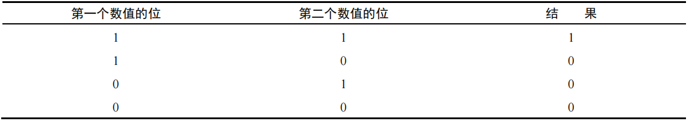
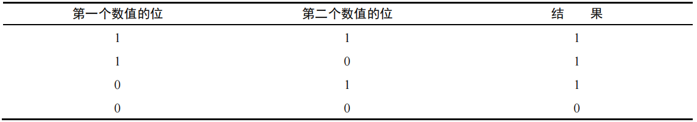
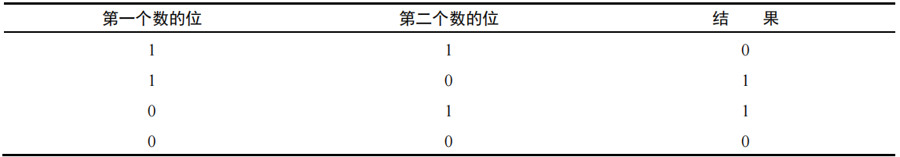
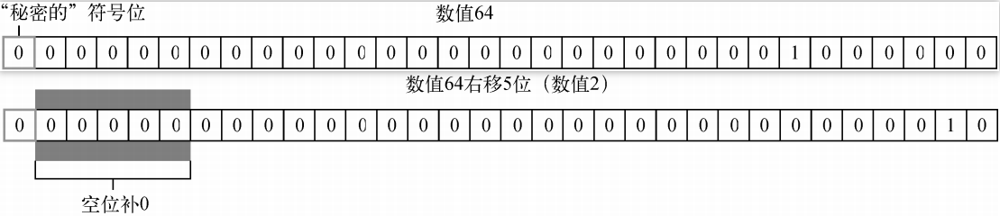

# 表达式与运算符

`ECMAScript` 中的操作符是独特的，因为它们可用于各种值，包括字符串、数值、布尔值，甚至还有对象。

在应用给对象时，操作符通常会调用 `valueOf()` 或 `toString()` 方法来取得可以计算的值。

更多参考：[表达式与运算符 `MDN`](https://developer.mozilla.org/zh-CN/docs/Web/JavaScript/Reference/Operators)

<hr>


## 运算符

### 一元运算符

只操作一个值的操作符叫一元操作符（`unary operator`）。一元操作符是 `ECMAScript` 中最简单的操作符。

一元运算符：包括自增减操作符、加减操作符，逻辑非运算符和按位非运算符。


##### 自增减

递增和递减操作符直接照搬自 C 语言，但有两个版本：前缀版和后缀版。

前置与后置：

- 相同：两者都会**立即改变变量的值**，但时机各有不同，即所谓：**发生在该自增减语句被求值前后**。
- 区别：两种式子的计算结果不同，即：**参与运算的值不同**。【前置使用运算值，后置使用原先值】

原理：自增减语句自身的计算结果为变量的值，前置会在求值前先改变变量的值，后置在求值后改变。

副作用：自增减语句在被求值的过程中，引发了变量的变化。

```js
// 等效写法【相对于变量而言】
let a = 0;
++a; 或 a++; // 均等效于：a = a + 1; <==> a += 1;

// 注意：++a; 与 a++; 的区别【两者的计算结果不同】
let a = 0;
++a; // a = 1, 1;【表达式++a的结果为：1】【使用计算值1参与运算】
a++; // 0, a = 1;【表达式a++的结果为：0】【使用原先值0参与运算】

// 前置：++num被求值前，先改变变量的值。
let num = 10;
num = ++num + 1; // 12 ==> ++num; num = 11 + 1;

// 后置：num++被求值后，再改变变量的值。
let num = 10;
num = num++ + 1; // 11 ==> num++; num = 10 + 1;

// 混合
let num = 10;
num++ + 1 + ++num; // 23, num = 12; ==> num++; 10 + 1; ++num; 10 + 1 + 12;
// num++ <==> 10, num = 11; ++num <==> 12, num = 12;
```

注意：自增减操作符**可以作用于任何值**，不限于整数 —— 字符串、布尔值、浮点值，甚至对象都可以。遵守如下规则：

- 字符串：【纯数值型字符串、其他字符串】
  - 有效的数值形式：转为对应数值后再参与运算。
  - 无效的数值形式：转为`NaN`，结果也为`NaN`【`NaN`与任何数相运算，结果都为`NaN`】
- 布尔值：`true`转为1；`false`转为0
- 对象：先调用`valueOf`方法取得可以操作的值，应用如上规则；若为`NaN`，再调用`toString`方法取值并应用如上规则。

```js
// 对象自增减
let o = {
    // 重写valueOf方法，默认返回对象自身
    valueOf() {
        return 0;
    }
}

o++; // 0, o = 1;
```


##### 一元加减

一元加减由一个加号（+）或减号（-）表示，放在变量前头，对数值没有任何影响。

如果将它们应用到非数值，则会执行与使用 `Number()` 转型函数一样的类型转换：

```js
+ "12"; // 12
+ "a"; // NaN
+ true; // 1
+ { valueOf () { return false; } } // 0
```

<hr>

### 位运算符

位符操作符用于数值的底层操作，就是操作内存中表示数据的比特（位）。

**互转方法**：`parseInt(num | str, 2)`可将二进制转为十进制；`(num).toString(2)`可将十进制转为二进制。

注释：

- `ECMAScript` 中的所有数值都以 `IEEE 754` 64 位格式存储。

- 但位操作并不直接应用到 64 位表示，而是先把值转换为32 位整数，再进行位操作，之后再把结果转换为 64 位。

符号位：【有符号整数的第32位】

- 有符号整数使用 32 位的前 31 位表示整数值。第 32 位表示数值的符号，如：0 表示正，1 表示负。
- 符号位决定了数值的真实部分以什么格式存储：正值以二进制格式存储；负值以其二补数（补码）的格式存储。

注意：

- 默认情况下，`ECMAScript` 中的所有整数都表示为有符号数。【无符号整数只有正值，没有符号位，范围更广】
- 在处理有符号整数时，我们无法访问第 31 位。
- 在把负值输出为一个二进制字符串时，会先获取其绝对值的二进制表示，然后添加负号前缀。

```js
let num = 18;
num.toString(2); // "10010"

num = -18;
num.toString(2); // "-10010" 转换过程会求得二补数，然后再以更符合逻辑的形式表示出来。
```

副作用：

- 前面提到，在对 `ECMAScript` 中的数值应用位操作符时，后台会发生如下转换：

- 64 位数值会先转换为 32 位数值，然后执行位操作，最后再把结果从 32 位转换为 64 位存储起来。

- 而这个转换导致了一个奇特的副作用，即特殊值 `NaN` 和 `Infinity` 在位操作中都会被当成 0 处理。

类型转换：将位操作符应用到非数值，首先会使用 `Number()` 函数将该值转换为数值，然后再应用位操作。


##### 按位非

按位非操作符用波浪符（~）表示，只有一个操作数，它的作用是返回数值的**一补数**（反码）【按位取反】

反码与补码：

- 反码：又称“一补数”，通过对每一位取反获得。
- 补码：又称“二补数”，通过对其反码加一获得。
- 正数的补码是原码，负数的补码是原码取反+1。【计算机中存储的任何数字都是补码】【补码的补码就是原码】

```js
~25 === -26; // ==> -(25 + 1);

 25 = 0000 0000 0000 0000 0000 0000 0001 1001 
--------------------------------------------- 
NOT = 1111 1111 1111 1111 1111 1111 1110 0110

~-25 === 24; // ==> -(-25 + 1);
```

注意：

- 按位非的效果是：将该数值加一，然后取相反数。
- 尽管效果相同，但位操作的速度快得多，这是因为位操作是在数值的底层表示上完成的。


##### 按位与

按位与操作符用和号（&）表示，有两个操作数。

本质上，按位与就是将两个数的每一个位对齐，然后基于真值表中的规则，对每一位执行相应的与操作。【遇0则0：一假全假】

 

```js
25 & 3 === 1;

 25 = 0000 0000 0000 0000 0000 0000 0001 1001 
  3 = 0000 0000 0000 0000 0000 0000 0000 0011 
--------------------------------------------- 
AND = 0000 0000 0000 0000 0000 0000 0000 0001
```


##### 按位或

按位或操作符用管道符（|）表示，有两个操作数。按位或遵循如下真值表：【遇1则1：一真全真】

 

```js
25 | 3 === 27;

 25 = 0000 0000 0000 0000 0000 0000 0001 1001 
  3 = 0000 0000 0000 0000 0000 0000 0000 0011 
--------------------------------------------- 
 OR = 0000 0000 0000 0000 0000 0000 0001 1011
```

按位或跟按位与的区别在于：两者对操作位不相同的情况的处理【与：视为0；或：视为1】


##### 按位异或

按位异或用脱字符（^）表示，有两个操作数。下面是按位异或的真值表：【相同为0，不同为1：同0异1】

 

```js
25 ^ 3 === 26;

 25 = 0000 0000 0000 0000 0000 0000 0001 1001 
  3 = 0000 0000 0000 0000 0000 0000 0000 0011 
--------------------------------------------- 
XOR = 0000 0000 0000 0000 0000 0000 0001 1010
```

按位或跟按位异或的区别在于：两者对操作位同时为1的情况的处理【或：视为1；异或：视为0】

与、或、异或之间的联系：设`x = a & b, y = a | b, z = a ^ b`，若`0 < a < b`，则有`(x <= a < b <= y)`，且满足：

- `y = x + z; `【与 + 异或 = 或】
- `x & y = x; x | y = y; x ^ y = z; `
- 在`[x, y]`内，还存在其他的`(a, b)`组合也满足上述两式【每次将`x`与`y`中某个不同的位取反即可得到一对新的组合值】

原码范围：`[x, y]`

```js
// 只有一位同时为1，差值是2的n次方，n为两数同时为1的所在位
15 | 8 === 15; 15 ^ 8 === 7; 15 - 7 === 8 === 2的3次方

 15 = 1111
  8 = 1000
----------
 OR = 1111
----------
XOR = 0111

// 多位同时为1，差值是多位2的n次方之和
15 | 12 === 15; 15 ^ 12 === 3; 15 - 3 = 12 === 2的3次方 + 2的2次方

 15 = 1111
 12 = 1100
----------
 OR = 1111
----------
XOR = 0011

// 根据差值反推原码范围
// 根据：x = a | b; y = a ^ b; z = x - y; 证明：z = a & b;
// 已知：z = 2的n1次方 + 2的n2次方 + ... + 2的nm次方，求解：n1, n2, ..., nm

/* 证明如下：
	1、z.toString(2)，1的位置就是n的位置，有多少个1就有多少个n
	2、y.toString(2)，a设为y，将a中的1取反后结果设为b
	3、x.toString(2)，x中为0的位置，在a和b中均置零，为1的位置在y中若为0则置为1。a中其余的0置为*，b中其余的1置为#
	4、将z中为1的位置，在a和b中均置1。*表示0或1，#则是对*的取反。
	5、若将a中的*均置为0，那么b中的#将全被置为1。这样就得到了一个原码范围。
*/
```

```js
let a = parseInt(10100101, 2),
	b = parseInt(11101011, 2),
    x = a & b,
    y = a | b,
    z = a ^ b;

// 首先满足恒等式
y === x + z; x === x & y; y === x | y; z === x ^ y;

// 获取任意式：保留相同部分，不同的部分*代替。每个*表示0或1，将a中的*取反，即可得到对应的b。
1010 0101
1110 1011
---------
1*10 ***1

// 将*全置为0得到x，全置为1便得到y。原码范围：[x, y]
10100001 == x.toString(2); 11101111 == y.toString(2);
x === parseInt(10100001, 2); y === parseInt(11101111, 2);

// 获取组合值：确定a中*的值后，将b中的对应*取反即可。
a = parseInt(10100011, 2); b = parseInt(11101101, 2);
```


##### 左移

左移操作符用两个小于号（<<）表示，会按照指定的位数将数值的所有位向左移动【保留符号位】

```js
2 << 5 === 64;

   2 = 0000 0000 0000 0000 0000 0000 0000 0010
----------------------------------------------
<< 5 = 0000 0000 0000 0000 0000 0000 0100 0000

// 保留符号位
-2 << 5 === -64;
```


##### 有符号右移

有符号右移由两个大于号（>>）表示，会将数值的所有 32 位都向右移，同时保留符号位。

注释：

- 有符号右移实际上是左移的逆运算。
- 右移后空位会出现在左侧，且在**符号位之后**。
- `ECMAScript` 会用**符号位的值**来填充这些空位，以得到完整的数值。



```js
// 逆运算
64 >> 5 === 2; 2 << 5 === 64; 64 >> 5 << 5 === 64; 2 << 5 >> 5 === 2;

// 保留符号位
-64 >> 5 === -2;
```


##### 无符号右移

无符号右移用 3 个大于号表示（>>>），会将数值的所有 32 位都向右移，不保留符号位。

注释：因无符号数表示非负数，所以无符号右移将任何数都当作正数来处理，而这对负数的影响很大。

```js
// 正数的右移结果都一样
64 >>> 5 === 2; 64 >> 5 === 64 >>> 5;

// 负数
-64 >>> 5 === 134217726;

  -64 = 1111 1111 1111 1111 1111 1111 1100 0000
-----------------------------------------------
>>> 5 = 0000 0111 1111 1111 1111 1111 1111 1110
```

<hr>

### 布尔运算符

##### 逻辑非

逻辑非操作符由一个叹号（!）表示，可应用给 `ECMAScript` 中的任何值。这个操作符始终返回布尔值。

注释：逻辑非操作符首先将操作数转换为布尔值，然后再对其取反。遵循如下规则：

- 对象：返回`false`【任何对象，包括空数组和函数等】
- 字符串：空字符串返回`true`，非空字符串返回`false`【包括空格字符串】
- 数值：0和`NaN`返回`true`，其余返回`false`【包括`Infinity`】
- `null`和`undefined`：均返回`true`

双非：同时使用两个叹号（!!），相当于调用了转型函数 `Boolean()` 【第一个转型，第二个取反】

```js
!!{}    // true
!!""    // false
!!" "   // true
!!0     // false
!!NaN   // false
```


##### 逻辑与

逻辑与操作符由两个和号（&&）表示，应用到两个值。

注释：

- 逻辑与操作符可用于任何类型的操作数，不限于布尔值。
- 但它会先将左边的结果转为布尔值：为`true`返回右边的结果，为`false`返回自身的结果。
- 使用未声明的变量，只有在`typeof`操作符下才返回`undefined`，其余任何情况都会报错。

因为，逻辑与操作符是一种短路操作符，意思就是如果第一个操作数决定了结果，那么永远不会对第二个操作数求值。

```js
// 左边的结果转换后为false时，直接返回左边的结果，右边的不会被计算。
"" && null;  					// ""
(1, 0) && 2; 					// 0
1 && "" && {} && false && []; 	// ""
false && a; 					// false

// 左边的结果转换后为true时，直接返回右边的结果或者报错。
1 && null; 				// null
Infinity && NaN 		// NaN
true && a; 				// ReferenceError: a is not defined.

// 短路特性
a && b; // 如果a的结果判断为true，则执行语句b；否则跳过不执行。相当于：if (a) {b}
```


##### 逻辑或

逻辑或操作符由两个管道符（||）表示，应用到两个值。

规则：它会先将左边的结果转为布尔值：为`true`返回自身的结果，为`false`返回右边的结果【短路特性】

```js
// 左边的结果被判断为true时，直接返回左边的结果，右边的不会被执行。
1 || null; 				// 1
Infinity || NaN; 		// Infinity
true || a; 				// true

// 左边的结果被判断为false时，返回右边的结果或报错。
false || true; 				// true
NaN || 0; 					// 0
"" || NaN || " " || true; 	// " "

// 短路特性
let a = b || 0; // 如果b的结果判断为true，则使用b的结果；否则使用默认值0
```

<hr>

### 乘性运算符

`ECMAScript` 定义了 3 个乘性操作符：乘法、除法和取模。

对于非数值的操作数，会在后台被使用 `Number()` 转为数值。


##### 乘法

乘法操作符由一个星号（*）表示，可以用于计算两个数值的乘积。

注释：乘法操作符在处理特殊值时也有一些特殊的行为：

- 0 乘以任何有限数都为 0；而 0 乘以 `Infinity` 为 `NaN`。
- `Infinity`乘以非 0 数，仍为 `Infinity`【符号由非 0 数决定】
- `ECMAScript` 对不能表示的乘积，返回 `Infinity` 或 `-Infinity`。

```js
0 * NaN;  		// NaN，任何数与NaN相运算结果都为NaN
0 * Infinity;   // NaN

Infinity * 1; 			// Infinity
Infinity * -1; 			// -Infinity
Infinity * Infinity; 	// Infinity

// 非数值
1 * true;   		// 1
1 * false;  		// 0
false * Infinity;   // NaN
" " * 1; 			// 0
[] * 1;				// 0
+{} * 1; 			// NaN
null * 1;			// 0
undefined * 1;		// NaN
```


##### 除法

除法操作符由一个斜杠（/）表示，用于计算第一个操作数除以第二个操作数的商【被除数 ÷ 除数 = 商】

注释：除法操作符针对特殊值的行为：【除法是乘法的逆运算】

- `ECMAScript` 对不能表示的商，返回 `Infinity` 或 `-Infinity`。
- 0 除以 0 返回 `NaN`；非 0 有限数除以 0 返回 `Infinity` 或 `-Infinity`。
- `Infinity` 除以 `Infinity` 返回 `NaN`；除以任何有限数返回 `Infinity` 或 `-Infinity`。

```js
Infinity / Infinity; 	// NaN
Infinity / 0; 			// Infinity
Infinity / -0; 			// -Infinity

0 / 0; 				// NaN
1 / 0; 				// Infinity
-1 / 0; 			// -Infinity
0 / Infinity; 		// 0
```


##### 取模

取模（余数）操作符由一个百分比符号（%）表示，用于计算第一个操作数除以第二个操作数的余数【余数永远不会超过除数】

注释：取模操作符对特殊值的特殊行为：【被除数 ÷ 除数 = 商……余数】

- 有限数余上 `Infinity` 返回该有限数自身，但 `Infinity` 余上任何数都返回 `NaN`。
- 0 余上任何非 0 数都返回 0，但任何数余上 0 都返回 `NaN`。
- 任何有限数余上 1 都返回 0 或 -0。

```js
1 % Infinity; 			// 1
-1 % Infinity; 			// -1
Infinity % Infinity; 	// NaN
Infinity % 1; 			// NaN
Infinity % -1; 			// NaN

0 % Infinity; 	// 0
0 % 1; 			// 0
0 % -1;			// 0
0 % NaN; 		// NaN
0 % 0; 			// NaN
1 % 0;			// NaN
-1 % 0;			// NaN
Infinity % 0;   // NaN

123 % 1;   // 0
-123 % 1;  // -0
```

<hr>

### 指数运算符

`ECMAScript 7` 新增了指数操作符，`Math.pow()` 现在有了自己的操作符——双星号（**）。

```js
// 求3的2次方
Math.pow(3, 2); 	// 9
3 ** 2;			 	// 9
Math.pow(m, n) === m ** n;

// 指数赋值操作符：**=
let num = 3;
num **= 2; 		// 9
num = 3;
num **= 2 + 1; 	// 27，赋值操作符的权重值最低

// 开平方根
let sqrt = 16;
sqrt **= 0.5;  // 4
```

<hr>

### 加性运算符

加性操作符，即加法和减法操作符，一般都是编程语言中最简单的操作符。


##### 加法

加法操作符（+）用于求两个数的和，或者将两个字符串按先后顺序拼接成串。

注释：根据操作数应用不同的运算模式

- 两个数值：应用数学加法
- 一个数值：当另一个是【`null`、`undefined`、`true` 或 `fasle`】，它们将被 `Number()` 转换。
- 两个字符串：应用字符拼接法。
- 一个字符串：将另一操作数转为字符串后，再应用字符拼接法。
- 一个引用值：将两者都转为字符串后，再应用字符拼接法。

数学加法：

- `Infinity` 加 `Infinity` 返回 `Infinity`，`-Infinity` 加 `-Infinity` 返回 `-Infinity`，`Infinity` 加 `-Infinity` 返回 `NaN`。
- `Infinity` 加任何有限数都会返回 `Infinity`
- 可转换的原始值：`null` 转为 0，`undefined` 转为 `NaN`，`true` 转为 1，`false` 转为 0。

字符拼接：

- 引用值将调用`toString`方法：`1 + [] === "1"; 1 + {} === '1[object Object]';`
- 数值与布尔值调用其 `toString` 方法转换，`null` 和 `undefined` 则被 `String()` 转换。

```js
// 数学加法：两个都是数值，或者一个是数值另一个是【null、undefined、true、false】之一。
Infinity + (-Infinity); 	// NaN
Infinity + 1; 				// Infinity
1 + null; 					// 0
1 + undefined; 				// NaN
1 + true;					// 2
1 + false; 					// 1

// 字符拼接：只要有一个是字符串或者引用值即可
1 + []; 				// "1"
1 + {}; 				// "1[object Object]"
1 + function () {}; 	// "1function () {}"
1 + ""; 				// "1"
1 + "1"; 				// "11"
[] + null; 				// "null"
[] + undefined; 		// "undefined"
[] + true; 				// "true"
[] + false; 			// "false"

// 常犯错误
"1" + 2 + 3; 	// "123"
1 + 2 + "3"; 	// "33"
```


##### 减法

减法操作符（-）也是使用很频繁的一种操作符【减法是加法的逆运算】

注释：

- `Infinity` 减 `Infinity` 返回 `NaN`【与加法相同】
- 如果操作数是【字符串、布尔值、`null` 或 `undefined`】之一，则会先被 `Number()` 转换。
- 如果操作数是引用值，则调用其`valueOf`方法。没有该方法，则调用其 `toString()` 方法。

```js
Infinity - Infinity; 	// NaN
1 - " "; 				// 1
1 - []; 				// 1
1 - {}; 				// NaN
1 - function () {}; 	// NaN
1 - "1"; 				// 0
1 - "a"; 				// NaN
```

<hr>

### 关系运算符

关系操作符用于比较两个值，包括小于（<）、大于（>）、小于等于（<=）和大于等于（>=）【始终返回布尔值】

注释：关系运算符也具有两种运算模式

- 两个字符串：按照字典查询法依次比较每个字符对应的编码，直至比出大小。
- 如果操作数是【布尔值、`null` 或 `undefined`】之一，则会先被 `Number` 转换。
- 对象和函数通常被转为 `NaN`【先调用`valueOf`方法，若没有，再调用`toString`方法】
- 空数组、`[" "]`、[][]`[null]`、`[undefined]`、`[0]` 和 `["0"]` 被转为 0，`[1]` 和 `["1"]` 转为 1，其余数组均转为 `NaN`。
- 任何关系操作符在涉及比较 `NaN` 时都返回 `false`。
- `null` 转为 0，`undefined` 转为 `NaN`，`true` 转为 1，`false` 转为 0。

```js
// 比较数值大小：非字符串与其他任意类型
1 > null; 						// true
1 > undefined; 					// false
null > undefined; 				// false
null < undefined; 				// false
true > null; 					// true
1 > []; 						// true
1 > {}; 						// false，valueOf默认返回自身。
1 > {valueOf () {return 0;}}; 	// true
1 > "0"; 						// true
1 > "false"; 					// false

// 字典查询法：两个字符串【比较ASCII码】
"a" > "b"; 		// false
"a" > "A";		// true，A-65，a-97
"0" > "A"; 		// false，0-9在A-z的前面
"2" > "3"; 		// false
"23" > "3"; 	// false
```

<hr>

### 相等运算符

判断两个变量是否相等是编程中最重要的操作之一。

`ECMAScript` 提供了两组操作符：

- 第一组是等于和不等于，它们在比较之前执行转换【不判断类型】

- 第二组是全等和不全等，它们在比较之前不执行转换【判断类型】


##### 等于和不等于

`ECMAScript` 中的等于操作符用两个等于号（==）表示，如果操作数相等，则会返回 `true`。【类型可以不同】

不等于操作符用叹号和等于号（!=）表示，如果两个操作数不相等，则会返回 `true`。

这两个操作符都会先进行类型转换（通常称为强制类型转换）再确定操作数是否相等。【重点关注内容上是否相等】

转换规则：【优先转为数值，其次是字符串】

- 布尔值始终转为数值
- 数值与其他：将其他值转为数值
- 字符串与其他：将其他值转为字符串（数值和布尔值除外）
- 对象与其他：调用对象的`valueOf`方法取得其原始值【对象在左边不会主动转型，放在右边才会被转型】

比较规则：

- `null` 和 `undefined` 相等【但规定 `null` 和 `undefined` 不能被转型】
- `NaN` 不等于 `NaN`，`NaN` 不等于任何操作数。
- 两引用值比较其栈地址，看是不是指向同一个引用【不发生转型】

```js
// null 和 undefined 不能被转型，因此，它们不等于任何其他值。
null == 0; 				// false
null == undefined; 		// true

// 布尔值转为数值
true == "1"; 		// true
false == []; 		// true

// 数值
"1" == 1; 						// true
NaN != NaN; 					// true
NaN != {}; 						// true
1 == "a"; 						// false
1 == {}; 						// false 
1 == {valueOf () {return 1;}} 	// true

// 字符串比较内容是否相等
"a" == "ab"; 				// false
"null" == "null"; 			// true 
null == "null";     		// fasle
typeof a == "undefined"; 	// true

// 对象：放在前面不会主动转型，放在后面才能被转型。
{} != NaN; 							// SyntaxError: Unexpected token '!='【不转型还会引发错误】
+{} != NaN; 						// true【手动转型后，可正常比较】
NaN != {}; 							// true【放在后面，自动转型】
+{valueOf () {return 1;}} == [1]; 	// true
[1] == {valueOf () {return 1;}}; 	// false，两个都没有被转型
{} == {}; 							// false，两个都没有被转型
[] == []; 							// false，两个都没有被转型
[] == 0; 							// true
[] == "0" 							// false
```


##### 全等和不全等

全等和不全等操作符与相等和不相等操作符类似，只不过它们在比较相等时不转换操作数。

全等操作符由 3 个等于号（===）表示，只有两个操作数在不转换的前提下相等才返回 `true`。【类型必须相同】

注意：`NaN` 不等于也不全等于任何操作数。【要判断是否为 `NaN`，可使用 `isNaN()` 方法】

```js
55 == "55"; 	// true
55 === "55"; 	// false

null == undefined; 	// true
null === undefined; // false

typeof a == "undefined"; 	// true
typeof a === "undefined"; 	// true

NaN !== NaN; 		// true
NaN != {}; 			// true
NaN !== {}; 		// true
```

建议：由于相等和不相等操作符存在类型转换问题，因此推荐使用全等和不全等操作符。这样有助于在代码中保持数据类型的完整性。

<hr>

### 条件运算符

条件操作符是 `ECMAScript` 中用途最为广泛的操作符之一。

条件运算符，又称为三目运算符：`v = x ? t : f;` 

```js
let max = (num1 > num2) ? num1 : num2;
// 相当于：
let max = function () {
    if (num1 > num2) {
    	return num1;
	} else {
    	return num2;
	}
}

// 连续的条件判断：多重分支结构
v = a ? t1 : f1 ? t2 : f2; 
/* 
	a为 true 返回 t1，为 false 继续判断 f1
	f1为 true 返回 t2，为 false 返回f2。
*/
// 相当于：if...else if...else
if (a) {
    return t1;
} else if (f1) {
    return t2;
} else {
    return f2;
}
0 ? 1 : 2 ? 3 : 4; // 3
```

<hr>

### 赋值运算符

赋值运算符的计算顺序为从右到左，并且赋值总是在最后一步。

简单赋值用等于号（=）表示，将右手边的值赋给左手边的变量。

复合赋值使用加性、乘性、指数或位操作符后跟等于号（=）表示。

```js
// 加后赋值
num += 10; 		// ==> num = num + 10;
num += 10 + 1; 	// ==> num = num + (10 + 1);

// 乘后赋值
num *= 10; 		// num = num * 10;
num *= 10 + 1; 	// num = num * (10 + 1);

// 还有：-=, /=, %=, **=, <<=, >>=, >>>=
```

但要注意，这些操作符仅仅是简写语法，使用它们不会提升性能。

<hr>

### 逗号运算符

逗号操作符可以用来在一条语句中执行多个操作。

规则：逗号分隔的每个式子都会被求值，但始终返回最后一个式子的结果。

在一条语句中同时声明多个变量是逗号操作符最常用的场景。

```js
1, 0, 2, false, 5;  // 5

a + b, a - b, a * b, a / b, a % b, 1; // 1
```

<hr>

### 其他操作符

##### `typeof`


##### `instanceof`


