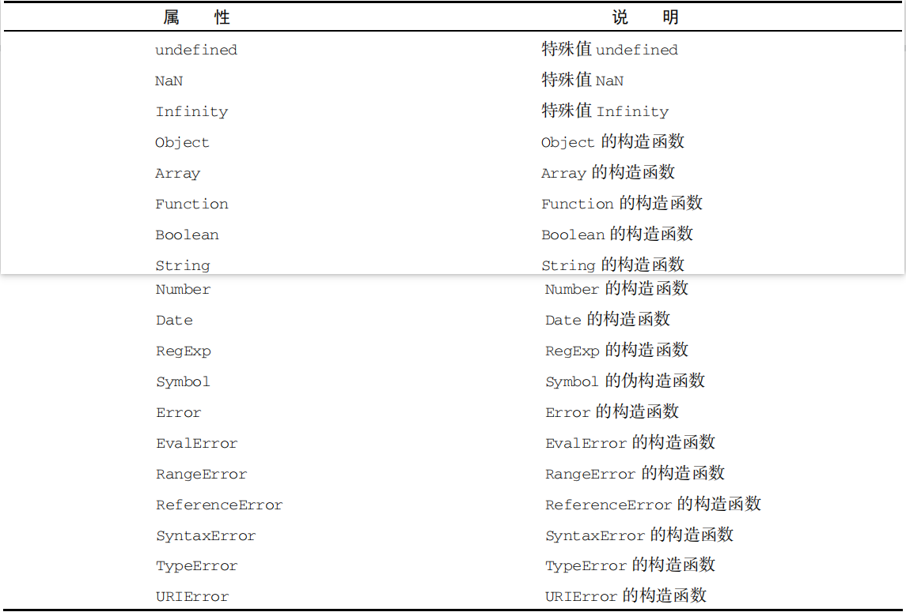
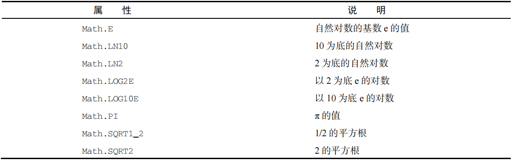
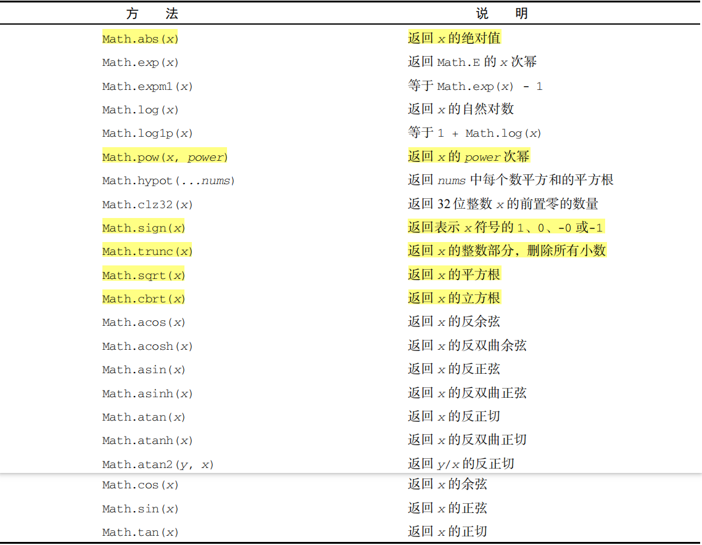

# 对象

引用类型与类：

- 引用类型虽然有点像类，但跟类并不是一个概念。
- 引用值（或者对象）是某个特定引用类型的实例。

- 在 `ECMAScript` 中，引用类型是把数据和功能组织到一起的结构，经常被人错误地称作“类”。

- 虽然从技术上讲 `JS` 是一门面向对象语言，但 `ES` 缺少传统的面向对象编程语言所具备的某些基本结构，包括类和接口。
- 引用类型有时候也被称为对象定义，因为它们描述了自己的对象应有的属性和方法。

构造函数与对象：

- 对象被认为是某个特定引用类型的实例。
- 新对象通过使用 `new` 操作符后跟一个构造函数（`constructor`）来创建。
- 构造函数就是用来创建新对象的函数。

<hr>

## 基本引用类型

`ECMAScript` 提供了很多像 `Date` 这样的原生引用类型，以帮助开发者实现常见的任务。


### `Date`日期

##### 计算机日期

- `ECMAScript` 的 `Date` 类型参考了 `Java` 早期版本中的 `java.util.Date`。

- 为此，`Date` 类型将日期保存为自协调世界时（`UTC`）时间 1970 年 1 月 1 日午夜（零时）至今所经过的毫秒数。

- 使用这种存储格式，`Date` 类型可以精确表示 1970 年 1 月 1 日之前及之后 285 616 年的日期。

`UNIX` 纪元：1970 年 1 月 1 日午夜，即：1970 年 1 月 1 日 00 : 00 : 00


##### 创建日期实例

通过 `new` 操作符来调用 `Date` 构造函数，即可创建一个日期对象。

参数：一个自`UNIX`纪元开始的毫秒；默认使用直至当前的毫秒数。

```js
// 不传参：创建基于当前的日期和时间的日期对象【保存它被创建的时刻】
let now = new Date(); // Sun Aug 14 2022 12:25:41 GMT+0800 (中国标准时间)

// 传参：传入一个毫秒
let time = new Date(1000); // Thu Jan 01 1970 08:00:01 GMT+0800 (中国标准时间)【比世界标准时快8个小时】
```

辅助方法：

- 由于使用毫秒不好把握，`ECMAScript` 为此提供了两个辅助方法：`Date.parse()` 和 `Date.UTC()`。
- 这两个方法都用于：返回一个日期自`UNIX`纪元以来所对应的毫秒数。但它们的参数格式有所不同。
- `parse` 方法的参数是字符串；`UTC` 的参数是数字。【这两个方法主要用于被 `Date` 隐式地调用】
- 虽然 `Date` 只接收毫秒，但它会根据参数的情况，来从这两个方法中选择合适的方法进行隐式转换。
- 虽然`Date`会隐式调用`UTC`来处理，但与显式调用的结果却并不相同【`Date`本地时间，`UTC`世界时】

`parse` 格式：`ES5` 规定了 `parse` 方法所支持的格式，弥补了 `ES3` 的空白。【传入非日期字符串，将返回`NaN`】

- **“月/日/年”**：如，`"5/23/2019"`； 
- **“月名 日, 年”**：如，`"May 23, 2019"`； 
- **“周几 月名 日 年 时:分:秒 时区”**：如，`"Tue May 23 2019 00:00:00 GMT-0700"`； 
- **`"YYYY-MM-DDTHH:mm:ss.sssZ"`**【`ISO 8601` 扩展格式】：如，`2019-05-23T00:00:00`（只适用于兼容 `ES5` 的实现）。

`UTC` 格式：**`年, 月(0-11), 日, 时(24h), 分, 秒, 毫秒`** 【只有年和月是必需的】

```js
// 传入字符串：在后台调用parse方法转换为对应的毫秒
let date1 = new Date("8/14/2022"); // 等同于：new Date(Date.parse("8/14/2022"));

// 传入逗号分隔的多个数字：在后台调用UTC方法转换为对应的毫秒【本地时间】
let date2 = new Date(2022, 7, 14); // 相当于：new Date(Date.UTC(2022, 7, 14)); 但结果为：00:00:00

// 如果显式地调用UTC，会得到不同的结果【世界时间】
new Date(Date.UTC(2022, 7, 14)); // 结果为：08:00:00【与隐式调用相差了一个时差】

// 只传入一个数字：将被Date当作毫秒来处理
let date3 = new Date(2000); // 不借助任何方法，自身即可处理。
```

越界日期：指像13月、32日这样超越了范围的日期。

- 多数浏览器会选择将越界日期换算为对应的日期，如：`"1/32/2022" ==> "2/1/2022"`。
- 而 `Opera` 则会使用当前的日期替代已越界的部分，如：当前为 21 号 ==> `"1/21/2022"`。

获取毫秒：`ECMAScript` 还提供了 `Date.now()` 方法，返回该方法执行时刻所对应的毫秒数。

```js
// 当Date无参数时，它与调用getTime和valueOf的返回值相同。
new Date().getTime() <===> Date.now() <===> new Date().valueOf();

// 不过，该方法通常用于测试程序的运行时长
let start = Date.now(); 	// 开始时间

// 调用函数

let end = Date.now(), 		// 结束时间
    result = end - start; 	// 运行时长
```


##### 重写的方法

与其他类型一样，`Date` 类型重写了 `toLocaleString()`、`toString()` 和 `valueOf()` 方法。

- `toLocaleString()` 方法返回与浏览器运行的本地环境一致的日期和时间【不包含时区信息】
- `toString()` 方法返回带时区信息的日期和时间【带时区信息】
- `valueOf()` 方法返回日期所对应的毫秒【数值型】

```js
// toLocaleString和toString方法
new Date().toLocaleString(); 	// '2022/8/15 21:12:30'
new Date().toString(); 			// 'Mon Aug 15 2022 21:12:38 GMT+0800 (中国标准时间)'

// valueOf方法
new Date(2022, 0, 1) < new Date(2022, 1, 1); // true
```


##### 日期格式化

`Date` 类型有几个专门用于格式化日期的方法，它们都会返回字符串：

- `toDateString()` 显示日期中的周几、月、日、年（格式特定于实现）；
- `toTimeString()` 显示日期中的时、分、秒和时区（格式特定于实现）；
- `toLocaleDateString()` 显示日期中的周几、月、日、年（格式特定于实现和地区）；
- `toLocaleTimeString()` 显示日期中的时、分、秒（格式特定于实现和地区）；
- `toUTCString()` 显示完整的 `UTC` 日期（格式特定于实现）。
- `toGMTString()` 方法跟 `toUTCString()` 是一样的，目的是为了向后兼容。不过，规范建议新代码使用 `toUTCString()`。

```js
new Date().toDateString(); // 'Mon Aug 15 2022'
new Date().toTimeString(); // '21:40:59 GMT+0800 (中国标准时间)'
new Date().toLocaleDateString(); // '2022/8/15'
new Date().toLocaleTimeString(); // '21:41:30'
new Date().toUTCString(); // 'Mon, 15 Aug 2022 13:41:46 GMT'【格林时间】
```

注意：这些方法的输出与 `toLocaleString()` 和 `toString()` 一样，会因浏览器而异。因此不能用于在用户界面上一致地显示日期。


##### 日期组件方法

日期组件方法，用于直接取得或设置日期对象中的特定部分。【基础的方法都具有对应的 `UTC` 方法】

获取方法：

- `getFullYear()`：获取年份，4位数。【`getUTCFullYear`：获取 `UTC` 日期中的年份】

- `getMonth()`：获取月份，从 0 开始。【`getUTCMonth`：获取 `UTC` 日期中的月份】
- `getDate()`：获取日【`getUTCDate`：获取 `UTC` 日期中的日】
- `getDay()`：获取周几【`getUTCDay`：获取 `UTC` 日期中的周几】
- `getHours()`：获取时【`getUTCHours`：获取 `UTC` 日期中的时】
- `getMinutes()`：获取分【`getUTCMinutes`：获取 `UTC` 日期中的分】
- `getSeconds()`：获取秒【`getUTCSeconds`：获取 `UTC` 日期中的秒】
- `getMilliseconds()`：获取毫秒【`getUTCMilliseconds`：获取 `UTC` 日期中的毫秒】
- `getTime()`：获取该日期所对应的毫秒，与 `valueOf()` 的值相同。
- `getTimezoneOffset()`：获取以分钟计的与 `UTC` 之间的时区差。【早于 `UTC` 为负，晚于 `UTC` 为正】

设置方法：

- `setFullYear()`：设置年份，4位数。【`setUTCFullYear()`：设置 `UTC` 日期中的年份】
- `setMonth()`：设置月份【`setUTCMonth()`：设置 `UTC` 日期中的月份】
- `setDate()`：设置日【`setUTCDate()`：设置 `UTC` 日期中的日】
- `setDay()`：设置周几【`setUTCDay()`：设置 `UTC` 日期中的周几】
- `setHours()`：设置时【`setUTCHours()`：设置 `UTC` 日期中的时】
- `setMinutes()`：设置分【`setUTCMinutes()`：设置 `UTC` 日期中的分】
- `setSeconds()`：设置秒【`setUTCSeconds()`：设置 `UTC` 日期中的秒】
- `setMilliseconds()`：设置毫秒【`setUTCMilliseconds()`：设置 `UTC` 日期中的毫秒】
- `setTime()`：设置日期的毫秒表示，从而修改整个日期。

```js
let date = new Date();

// 获取日期的毫秒表示和日期中的毫秒
date.getTime(); 			// 1660607715084
date.getMilliseconds(); 	// 084【后三位】

// 获取以分钟计的时区偏移量【本地时区与UTC时区】
date.getTimezoneOffset(); 	// -480
```


### `RegExp`正则

`ECMAScript` 通过 `RegExp` 类型支持正则表达式。正则表达式使用类似 Perl 的简洁语法来创建：`/pattern/flags`

模式与标记：

- `pattern`（模式）：可以是任何简单或复杂的正则表达式，包括字符类、限定符、分组、向前查找和反向引用。
- `flags`（标记）：每个正则表达式可以带零个或多个 `flags`（标记），用于改变正则表达式的默认行为。

默认行为：匹配到第一个符合规则的、区分大小写、单行模式、只有开始索引。

常用标记：

- g：全局模式，全局匹配符合规则的片段，而不仅仅是找到第一个。
- i：忽略大小写模式，在查找匹配时不区分 `pattern` 和字符串的大小写。
- m：多行模式，查找到一行文本末尾时还会继续查找。
- y：粘附模式，从 `lastIndex` 开始查找，`lastIndex` 的字符必须是要匹配片段的开头，否则返回`null`。【覆盖全局标记】
- u：`Unicode` 模式，启用 `Unicode` 匹配。
- s：`dotAll` 模式，使 `"."` 可以匹配任意单个字符，包括元字符。
- d：匹配的结果数组中应该包含每个捕获组的子字符串的开始和结束索引。【最明显的是，结果数组中多了 **`indices`** 属性】

捕获组：在正则中，小括号具有特殊的含义，它表示一个捕获组。其匹配的结果可以被特定的符号引用。

元字符：元字符在正则中具有特殊的功能和意义，包括：`( [ { \ ^ $ | ) ] } ? * + .` ，要匹配这些字符本身，就必须要转义。

```js
// 匹配元字符
let reg = /\./,
    str = ".";
reg.exec(str); // ['.', index: 0, input: '.', groups: undefined]

// 开启dotAll模式，使"."可匹配任何字符，并且无需转义
let reg = /./s,
    str = ".";
reg.exec(str); // ['.', index: 0, input: '.', groups: undefined]

reg = /.*/s;
reg.exec(str); // ['( [ {  ^ $ | ) ] } ? * + .', index: 0, input: '( [ {  ^ $ | ) ] } ? * + .']
```


##### 创建正则实例

正则表达式可以使用 `RegExp` 构造函数来创建，它接收两个参数：

- 一：模式字符串或正则表达式，模式字符串中的特殊字符需要转义。
- 二：标记字符串（可选的），覆盖原有的标记。

任何使用字面量定义的正则表达式都可以通过构造函数来创建。

```js
let reg1 = /[bc]at/g;

let reg2 = new RegExp("[bc]at", "g"); // 结果与reg1一样：/[bc]at/g

let reg3 = new RegExp(reg1, "i"); // 修改了标记：/[bc]at/i

// 转义特殊字符
let reg1 = /\.at/g; // 等效实例：new RegExp("\\.at", "g");
```


##### 正则实例属性

每个 `RegExp` 实例都有下列属性，提供有关模式的各方面信息：

- `global`：布尔值，检查是否设置了 g 标记。

- `ignoreCase`：布尔值，检查是否设置了 i 标记。

- `unicode`：布尔值，检查是否设置了 u 标记。
- `sticky`：布尔值，检查是否设置了 y 标记。
- `lastIndex`：整数，表示在源字符串中下一次搜索的开始位置【即上次搜索的结束位置】，默认值：0。
- `multiline`：布尔值，检查是否设置了 m 标记。
- `dotAll`：布尔值，检查是否设置了 s 标记。
- `source`：正则表达式的模式字符串。
- `flags`：正则表达式的标记字符串。

通过这些属性可以全面了解正则表达式的信息，不过实际开发中用得并不多，因为模式声明中直接包含了这些信息。

```js
// source 返回的是模式字符串。
let reg1 = /\[bc\]at/i;
reg1.source; // "\\[bc\\]at"

let reg2 = new RegExp("\\[bc\\]at", "i");
reg2.source; // "\[bc\]at"
```


##### 正则实例方法

每一个正则实例都具有两个检测方法，主要的方法是`exec()`，另一个是`test()`。

- `exec`：返回包含第一个匹配项信息的数组，用于获取实质的信息。
- `test`：返回一个布尔值，用于判断输入的文本是否与模式相匹配。

`exec`方法：

- 只接受一个字符串参数，返回包含第一个匹配项信息的数组，没匹配到则返回`null`。
- 数组中包含两个额外的属性：`index` 【匹配片段的起始位置】和 `input` 【被传入的字符串】
- 第一个元素是被匹配到的片段，其他元素是各捕获组的匹配结果。没有捕获组则只有第一个元素。

```js
let str = "abcabc",
    reg = /b(ca)/gi;

let matches = reg.exec(str);
// 结果：
[
    0: "bca", 			// 匹配片段
    1: "ca",			// 第一个捕获组
    groups: undefined,
    index: 1, 			// 匹配片段的起始位置
    input: "abcabc",	// 传入的字符串参数，【原始字符串、输入字符串】
    length: 2, 			// 元素个数
]
```

全局模式：

- 如果设置为全局匹配模式，则每次调用 `exec()` 都会在字符串中向右搜索下一个匹配项【以 `lastIndex` 为起始的搜索位置】
- 在该模式下，每次调用 `exec()` 都会更新 `lastIndex` 值，以反映上次匹配的最后一个字符的索引。

```js
// 全局匹配
let str = "cat, bat, sat, fat",
    reg = /.at/g;

// 初次调用：lastIndex：0，index：0，lastIndex：3
reg.laseIndex; // 0，调用前lastIndex为默认值：0
reg.exec(str); // ['cat', index: 0, input: 'cat, bat, sat, fat', groups: undefined]
reg.lastIndex; // 3，调用后修改为本次匹配片段的结束索引，它将是下次搜索的起始位置。

// 第二次调用：lastIndex：3，index：5，lastIndex：8
reg.exec(str); // ['bat', index: 5, input: 'cat, bat, sat, fat', groups: undefined]
reg.lastIndex; // 8

// 第三次调用：lastIndex：8，index：10，lastIndex：13
reg.exec(str); // ['sat', index: 10, input: 'cat, bat, sat, fat', groups: undefined]
reg.lastIndex; // 13

// 第四次调用：lastIndex：13，index：15，lastIndex：18
reg.exec(str); // ['fat', index: 15, input: 'cat, bat, sat, fat', groups: undefined]
reg.lastIndex; // 18
```

粘附模式：每次调用 `exec()` 就只会在 `lastIndex` 的位置上寻找匹配项。粘附标记覆盖全局标记。

```js
// 粘附模式：在lastIndex的位置上寻找匹配项，lastIndex字符必须是匹配项的首字符，否则返回null。
let str = "cat, bat, sat, fat",
    reg = /.at/y;

// 首次调用：lastIndex：0，index：0，lastIndex：3
reg.lastIndex; // 0，调用前。如果lastIndex的字符不是匹配项的首字符，则返回null。
reg.exec(str); // ['cat', index: 0, input: 'cat, bat, sat, fat', groups: undefined]
reg.lastIndex; // 3

// 第二次调用：lastIndex: 3，index：5，lastIndex：0
reg.exec(str); // null，因为lastIndex字符不是匹配项的首字符，所以返回null
reg.lastIndex; // 0，匹配失败后，lastIndex将被重置为默认值

// 如果手动将lastIndex修改为下一项首字符的index，那么就可以匹配成功了。
reg.lastIndex = 5;
reg.exec(str); // ['bat', index: 5, input: 'cat, bat, sat, fat', groups: undefined]
reg.lastIndex; // 8
```

`test` 方法：接收一个字符串参数。如果输入的文本与模式匹配，则返回 `true`，否则返回 `false`。

```js
// test方法：用于检查字符串中是否包含指定的片段，常被用于验证用户输入、文件后缀名等业务中。
let reg = /\d{3}-\d{2}-\d{4}/,
    str = "000-00-0000";

reg.test(str); // true，说明str中包含reg的片段。
```

重写的方法：`toLocaleString()` 、`toString()` 和 `valueOf()` 方法都返回正则表达式的字面量表示。

```js
let reg1 = /abc/g,
    reg2 = new RegExp("bar", "i");

// 获取字面量表示
reg1.toString(); // "/abc/g"
reg2.toString(); // "/bar/i"
```

几个符号方法：这几个方法的参数都是字符串，主要是在后台被字符串调用的。但可以重写它们以获得想要的返回值。

- `[@@match]`：获取 `match` 匹配的结果，在 `String.prototype.match()` 的内部调用。
- `[@@matchAll]`：获取 `matchAll` 匹配的结果，在 `String.prototype.matchAll()` 的内部调用。
- `[@@replace]`：获取 `replace` 替换的结果，在 `String.prototype.replace()` 的内部调用。
- `[@@search]`：获取 `search` 搜索的结果，在 `String.prototype.search()` 的内部调用。
- `[@@split]`：获取 split 切隔的结果，在 `String.prototype.split()` 的内部调用。

```js
// 获取match匹配结果
reg[@@match](str); // 等效于：str.match(reg);

// 这个方法为自定义 RegExp 子类中的匹配行为而存在。
class MyRegExp extends RegExp {
    // 重写[@@match]方法，自定义返回值
    [Symbol.match](str) {
        // 获取匹配的结果数组
        let result = RegExp.prototype[Symbol.match].call(this, str);
        // 根据结果返回不同值
        if (!result) return null;
        // 返回一个对象
        return {
            // 定义group方法，返回各元素
            group(n) {
                return result[n];
            }
        }
    }
}
// 调用自定义的子类
let myReg = new MyRegExp("([0-9]+)-([0-9]+)-([0-9]+)"),
    str = "2022-8-16";
let result = str.match(myReg); // 或者：myReg[@@match](str);
result.group(1); // "2022"
result.group(2); // "8"
result.group(3); // "16"
// 解除result引用
result = null;
------------------------------------------------------------------------------------------------------------

// 重写[@@matchAll]方法
class MyRegExp extends RegExp {
	[Symbol.matchAll](str) {
        let result = RegExp.prototype[Symbol.matchAll].call(this, str);
        if (!result) {
            return null;
        } else {
            return Array.from(result);
        }
 	}
}

let re = new MyRegExp('([0-9]+)-([0-9]+)-([0-9]+)', 'g');
let str = '2016-01-02|2019-03-07';
let result = str.matchAll(re);
console.log(result[0]); // [ "2016-01-02", "2016", "01", "02" ]
console.log(result[1]); // [ "2019-03-07", "2019", "03", "07" ]
------------------------------------------------------------------------------------------------------------

// 重写[@@replace]方法
class MyRegExp extends RegExp {
	constructor(pattern, flags, count) {
        super(pattern, flags);
        this.count = count;
	}
	[Symbol.replace](str, replacement) {
        // Perform @@replace |count| times.
        let result = str;
        for (let i = 0; i < this.count; i++) {
            result = RegExp.prototype[Symbol.replace].call(this, result, replacement);
        }
        return result;
	}
}

let re = new MyRegExp('\\d', '', 3);
let str = '01234567';
let newstr = str.replace(re, '#'); // String.prototype.replace calls re[@@replace].
console.log(newstr); // ###34567
------------------------------------------------------------------------------------------------------------

// 重写[@@search]方法
class MyRegExp extends RegExp {
	constructor(str) {
        super(str)
        this.pattern = str;
	}
  	[Symbol.search](str) {
        return str.indexOf(this.pattern);
  	}
}

let re = new MyRegExp('a+b');
let str = 'ab a+b';
let result = str.search(re); // String.prototype.search calls re[@@search].
console.log(result); // 3
------------------------------------------------------------------------------------------------------------

// 重写[@@split]方法
class MyRegExp extends RegExp {
  	[Symbol.split](str, limit) {
        let result = RegExp.prototype[Symbol.split].call(this, str, limit);
        return result.map(x => "(" + x + ")");
  	}
}

let re = new MyRegExp('-');
let str = '2016-01-02';
let result = str.split(re); // String.prototype.split calls re[@@split].
console.log(result); // ["(2016)", "(01)", "(02)"]
```


##### 构造函数属性

`RegExp` 构造函数本身也有几个属性【静态属性】。

这些属性适用于所有的正则表达式，且每一次执行匹配后它们的值都会发生变化。

并且，每个属性都有一个全名和一个简写。【简写形式要通过中括号语法来访问】

- `input`：最后一次使用的原始字符串（非标准特性），简写：`$_`；访问：`RegExp.$_`
- `lastMatch`：最后一次匹配的片段，简写：`$&`；访问：`RegExp["$&"]`
- `lastParen`：最后一次匹配的最后一个捕获组，简写：`$+`；访问：`RegExp["$+"]`
- `leftContext`：`input` 字符串中位于 `lastMatch` 左边的文本，简写：$`；
- `rightContext`：`input` 字符串中位于 `lastMatch` 右边的文本，简写：`$'`；访问：`RegExp["$&"]`
- `$1~$9`：分别包含第 1~9 个捕获组的匹配项。

```js
let str = "cat, bat, sat, fat",
    reg = /([bs])at(.)/g;

// 首次匹配
reg.exec(str); 			//  ['bat,', 'b', ',', index: 5, input: 'cat, bat, sat, fat']
RegExp.input; 			// "cat, bat, sat, fat"
RegExp.lastMatch; 		// "bat,"
RegExp.lastParen; 		// ","
RegExp.leftContext; 	// "cat, "
RegExp.rightContext; 	// " sat, fat"
RegExp.$1; 				// "b"
RegExp.$2; 				// ","

// 第二次匹配
reg.exec(str); 			// ['sat,', 's', ',', index: 10, input: 'cat, bat, sat, fat']
RegExp.input; 			// "cat, bat, sat, fat"
RegExp.lastMatch; 		// "sat,"
RegExp.lastParen; 		// ","
RegExp.leftContext; 	// "cat, bat, "
RegExp.rightContext; 	// " fat"
RegExp.$1; 				// "s"
RegExp.$2; 				// ","
```

注意：`RegExp` 构造函数的所有属性都没有任何 `Web` 标准出处，因此不建议在生产环境中使用它们。


##### 模式局限

虽然 `ECMAScript` 对正则表达式的支持有了长足的进步，但仍然缺少 `Perl` 语言中的一些高级特性。

- \A 和\Z 锚（分别匹配字符串的开始和末尾）
- 联合及交叉类
- 原子组
- x（忽略空格）匹配模式
- 条件式匹配
- 正则表达式注释

虽然还有这些局限，但 `ECMAScript` 的正则表达式已经非常强大，可以用于大多数模式匹配任务。

更多参考：[正则表达式](Regular-Expressions.info)


### 原始值包装类型

为了方便操作原始值，`ECMAScript` 提供了 3 种特殊的引用类型：`Boolean`、`Number` 和 `String`。

这些类型具有与其他引用类型一样的特点，但同时又具有与各自原始类型对应的特殊行为。

**隐式包装类**：每当用到某个原始值的方法或属性时，后台都会创建一个相应原始包装类型的对象，从而暴露出操作原始值的各种方法。

```js
// 隐式包装类
let s1 = "hello world",
    s2 = s1.substring(2); // 实际上，在执行s1.substring(2);时，是以读模式访问s1的。
```

在以**读模式**访问字符串、数值和布尔值这三类原始值的任何时候，后台都会执行以下 3 步：

1. 创建一个相应原始包装类型的实例
2. 调用实例上的特定方法
3. 销毁该实例

```js
s1.substring(2);

// 相当于执行了如下三句：
oS1 = new String(s1);
s2 = oS1.substring(2);
oS1 = null;
```

注释：

- 这种包装行为可以让原始值拥有对象的行为。
- 引用类型与原始值包装类型的主要区别在于对象的生命周期。
- 隐式包装的原始值对象只存在于访问它的那行代码的执行期间。这意味着不能在运行时给原始值添加属性和方法。

```js
// 给原始值添加属性或方法
let str = "hello world";
str.a = "a";
str.a; // undefined

// str.a = "a"; 相当于执行了
oStr = new String(str);
oStr.a = "a";
oStr = null;

// str.a; 相当于执行了
oStr = new String(str);
oStr.a; 				// undefined
oStr = null;
```

**显式包装类**：

- 可以显式地使用 `Boolean`、`Number` 和 `String` 构造函数创建原始值包装对象。不过应该在确实必要时再这么做。
- 另外，`Object` 构造函数作为一个构造对象的工厂方法，也能够根据传入值的类型返回相应原始值包装类型的实例。

注释：

- 虽然不推荐显式创建原始值包装类型的实例，但它们对于操作原始值的功能是很重要的。

- 每个原始值包装类型都有相应的一套方法来方便数据操作。


### 单例内置对象

`ECMA-262` 对内置对象的定义是：“任何由 `ES` 实现提供、与宿主环境无关，并在 `ECMAScript` 程序开始执行时就存在的对象”。

`Object`、`Array` 和 `String` 等都是内置对象，而 `ECMA-262` 还另外定义了两个单例内置对象：`Global` 和 `Math`。


#### `Global` 全局对象

`Global` 对象是 `ECMAScript` 中最特别的对象，因为代码不会显式地访问它。

`ECMA-262` 规定 `Global` 对象为一种兜底对象，它所针对的是不属于任何对象的属性和方法。

事实上，不存在全局变量或全局函数这种东西。在全局作用域中定义的变量和函数都会变成 `Global` 对象的属性 。

事实上，也并不一定存在`Global`对象，但是每个具体的宿主环境都需要有一个`Global`对象。

在浏览器中，`window` 对象就是 `global` 对象的具体表现。`window` 依赖于浏览器，而 `global` 与宿主环境无关。

##### `URL` 编码方法

`encodeURI()` 和 `encodeURIComponent()` 方法用于编码统一资源标识符（`URI`），以便传给浏览器。

作用：

- 有效的 `URI` 不能包含某些字符，比如空格。
- 使用 `URI` 编码方法来编码 `URI` 可以让浏览器能够理解它们，同时又以特殊的 `UTF-8` 编码替换掉所有无效字符。

区别：

- `ecnodeURI()` 方法用于对整个 `URI` 进行编码，比如`"www.wrox.com/illegal value.js"`。
- `encodeURIComponent()` 方法用于编码 `URI` 中单独的组件，比如前面 `URL` 中的`"illegal value.js"`。
- 主要区别是：
  - `encodeURI()` 不会编码属于 `URL` 组件的特殊字符，比如冒号、斜杠、问号、井号。
  - 而 `encodeURIComponent()` 会编码它发现的所有非标准字符。

```js
let uri = "http://www.wrox.com/illegal value.js#start";

// 使用encodeURI方法：仅替换无效字符，如空格等
encodeURI(uri); // 'http://www.wrox.com/illegal%20value.js#start'

// 使用encodeURIComponent方法：替换所有非标准字符
encodeURIComponent(uri); // 'http%3A%2F%2Fwww.wrox.com%2Fillegal%20value.js%23start'

// 因此，建议使用 encodeURI() 编码整个URI，但只使用 encodeURIComponent() 编码那些会追加到已有 URI 后面的字符串。
// 一般来说，使用 encodeURIComponent 应该比使用 encodeURI 的频率更高，因为编码查询字符串参数比编码基准 URI 的次数会更多。
```

解码`URL`：与 `encodeURI()` 和 `encodeURIComponent()` 相对的是 `decodeURI()` 和 `decodeURIComponent()`。

- `decodeURI()` 只解码 `encodeURI()` 编码过的字符。
- `decodeURIComponent()` 解码所有被 `encodeURIComponent()` 编码的字符，基本上就是解码所有特殊字符。

```js
// 定义一个非有效的 URL 字符串
let uri = "http://www.wrox.com/illegal value.js#start";

// decodeURI 解码被 encodeURI 编码的字符
decodeURI(encodeURI(uri)) === uri; 	// true
decodeURI(encodeURIComponent(uri)); // 'http%3A%2F%2Fwww.wrox.com%2Fillegal value.js%23start'

// decodeURIComponent 解码被 encodeURIComponent 编码的字符
decodeURIComponent(encodeURIComponent(uri)) === uri; 	// true
decodeURIComponent(encodeURI(uri)) === uri; 			// true
```

注意：

- `URI`方法 `encodeURI、encodeURIComponent、decodeURI`和 `decodeURIComponent` 取代了 `escape()`和 `unescape()`方法，
- 后者在 `ECMA-262` 第 3 版中就已经废弃了，虽然目前还能使用。
- 但`URI` 方法始终是首选方法，因为它们对所有 `Unicode` 字符进行编码，而原来的方法只能正确编码 `ASCII` 字符。
- 因此，不要在生产环境中使用 `escape()` 和 `unescape()`。

##### `eval` 方法

`eval` 方法可能是整个 `ECMAScript` 语言中最强大的了。

这个方法就是一个完整的 `ECMAScript` 解释器，它接收一个参数，即一个要执行的 `ECMAScript`（`JavaScript`）字符串代码。

当解释器发现 `eval()` 调用时，会将参数解释为实际的 `ECMAScript` 语句，然后将其插入到该位置，基本上与普通的代码无异。

唯一的区别是：通过 `eval()` 定义的任何变量和函数都不会被提升，它们只是在 `eval()` 执行的时候才会被创建。

严格模式：在严格模式下，在 `eval()` 内部创建的变量和函数对外部不可见，并且给 `eval` 赋值也会导致错误。

```js
// 非严格模式下
// 可以使用 eval 声明一个函数
eval("function sayHi() { console.log('hi'); }"); 
sayHi(); // "hi"

// 可以使用 eval 声明一个变量，但要注意：eval() 的内部被 let和const 视为一个块级作用域。
eval("var msg = 'hi';");
console.log(msg); // "hi"

// 使用let或const声明的变量将被限制在eval内部。
eval("let msg = 'hi';");
console.log(msg); //  msg is not defined
```

注意：

- 解释代码字符串的能力是非常强大的，但也非常危险。
- 在使用 `eval()` 的时候必须极为慎重，特别是在解释用户输入的内容时。
- 因为这个方法会对 `XSS` 利用暴露出很大的攻击面。恶意用户可能插入会导致你网站或应用崩溃的代码。

##### `Global` 对象属性

`Global` 对象有很多属性，像 `undefined`、`NaN` 和 `Infinity` 等特殊值都是 `Global` 对象的属性。

此外，所有原生引用类型构造函数，比如 `Object` 和 `Function`，也都是`Global` 对象的属性。

下表列出了所有这些属性：

 

##### `window` 对象

虽然 `ECMA-262` 没有规定直接访问 `Global` 对象的方式，但浏览器将 `window` 对象实现为 `Global` 对象的代理。

因此，所有全局作用域中声明的变量和函数都变成了 `window` 的属性。

当然，`window` 对象在 `JavaScript` 中远不止实现了 `ECMAScript` 的 `Global` 对象那么简单。

```js
// 获取 Global 对象的方式
let global = function() { 
 	return this; // this默认指向Global对象，在浏览器中window是Global的代理。
}();

global === window; // true
```


#### `Math` 数学对象

`ECMAScript` 提供了 `Math` 对象作为保存数学公式、信息和计算的地方。`Math` 对象提供了一些辅助计算的属性和方法。

注意：

- `Math` 对象上提供的计算要比直接在 `JavaScript` 实现的快得多。
- 因为 `Math` 对象上的计算使用了 `JavaScript` 引擎中更高效的实现和处理器指令。

- 但使用 `Math` 计算的问题是：其精度会因浏览器、操作系统、指令集和硬件而异。

##### `Math` 属性

`Math` 对象有一些属性，主要用于保存数学中的一些特殊值。下表列出了这些属性。

对数：如果`a^x=N(a>0,且a≠1)`，则`x`叫做以`a`为底`N`的对数，记做`x=log(a)(N)`【`a`在右下】

 

```js
Math.E; 		// 数学中e的值，约为：2.718281828459045
Math.LN10;  	// ln(10)的值，约为：2.302585092994046
Math.LN2;   	// ln(2)的值，约为：0.6931471805599453
Math.LOG2E; 	// e log base 2，约为：1.4426950408889634
Math.LOG10E; 	// e log base 10，约为：0.4342944819032518
// 科学计算器：计算以a为底数，N为真数的对数 ==> N log base a
```

##### `min` 和 `max` 方法

`min()` 和 `max()` 方法用于确定一组数值中的最小值和最大值，这两个方法都接收任意多个参数。

注意：`min` 可用来设置最大边界【高于边界时取边界】，`max` 可用来设置最小边界【低于边界时取边界】。

```js
// 设置最大边界：当值大于边界时，取边界值（较小数）。
Math.min(1, 11, 10); 	// 设置10为最大边界，小于10取自身，大于10取10

// 设置最小边界：当值小于边界时，取边界值（较大数）。
Math.max(0, -1, 1); 	// 设置0为最小边界，小于0取0，大于0取自身

// 设置区间：[1, 9]
Math.max(1, Math.min(num, 9)); // 先取≤9的数，再取≥1的数。

// 获取数组中的最小值和最大值
Math.min(...[1, 4, 8, 3]); // 获取最小值
Math.max(...[1, 4, 8, 3]); // 获取最大值
```

##### 舍入方法

`ES` 提供了用于把小数值舍入为整数的 4 个方法：`Math.ceil()、Math.floor()、Math.round()` 和 `Math.fround()`。

区别：

- `ceil`：向上取整
- `floor`：向下取整
- `round`：四舍五入【只看十分位的数值】
- `fround`：返回数值最接近的单精度（32 位）浮点值表示

```js
// 向上取整：整数部分 + 1
Math.ceil(20.001); 		// 21

// 向下取整：整数部分 - 1
Math.floor(20.999); 	// 20

// 四舍五入：十分位是否大于等于5
Math.round(20.499); 	// 20
Math.round(20.500); 	// 21

// 获取最接近的单精度浮点数
Math.fround(0.4); 		// 0.4000000059604645
Math.fround(0.5); 		// 0.5
Math.fround(9.99); 		// 9.989999771118164
```

##### 随机数

`Math.random()` 方法返回一个 0~1 范围内的随机数，其中包含 0 但不包含 1，即：`[0, 1)`。

```js
// 获取[0, 1)之间的随机小数
Math.random(); // 0 <= Math.random() < 1;

// 获取[0, 1]之间的随机整数
Math.round(Math.random());

// 获取[0, 10)之间的随机整数
Math.floor(Math.random() * 10); 	// [0, 10)

// 获取[1, 10]之间的随机整数
Math.floor(Math.random() * 10 + 1); // [1, 10]
Math.round(Math.random()) * 9 + 1; 	// [1, 10]
------------------------------------------------------------------------------------------------------------
// 封装一个获取[m, n]之间的随机整数的方法
function range (min, max) {
    let difference = max - min + 1;
    return Math.floor(Math.random() * difference + min); // [0, m-n] + n <==> [n, m]
}
range(2, 10); 	// 获取一个[2, 10]之间的随机整数

// 另一种方法
function range (min, max) {
    return Math.round(Math.random()) * (max - min) + min;
}
```

注意：

- `Math.random()` 方法在这里出于演示目的是没有问题的，但它重复出现同一数字的几率还是蛮高的。
- 如果是为了加密而需要生成随机数（传给生成器的输入需要较高的不确定性），建议使用 `window.crypto.getRandomValues()`。

- 为了保证足够的性能，`getRandomValues` 的实现并不使用真正的随机数生成器，而是使用带有足够熵值的伪随机数生成器。
- 伪随机数生成器算法（`PRNG`）可能因用户代理而异，但适用于加密目的。
- 该实现还需要使用具有足够熵的种子，如系统级熵源。

参数：`typedArray`【提供熵源】

- 是一个基于整数的 `TypedArray`，它可以是 `Int8Array`、`Uint8Array`、`Int16Array`、 `Uint16Array`、 `Int32Array` 或者 `Uint32Array`。
- 在数组中的所有的元素会被随机数重写。（注释：生成的随机数储存在 `typedArray` 数组上。）

```js
// random：一个非密码学安全的随机数来源
Math.random();

// Crypto.getRandomValues：获取符合密码学要求的安全的随机值。
// 创建一个TypeArray数组
let typeArray = new Uint32Array(10); 		// 指定长度
window.crypto.getRandomValues(typeArray); 	// 获取随机数并重写数组的每一个元素
```

##### 其他方法

`Math` 对象还有很多涉及各种简单或高阶数运算的方法，如下表：

 

虽然这些方法都是由 `ECMA-262` 定义的，但是对正弦、余弦、正切等计算的实现仍然取决于浏览器。

因为计算这些值的方式有很多种，从而使得这些方法的精度可能因实现而异。

```js
// 计算绝对值
Math.abs(-1); 	// 1

// 计算e^n的值
Math.exp(2); 	// 7.38905609893065，e的平方

// 计算e^n -1的值
Math.expm1(2); 	// 6.38905609893065

// 计算ln(x)的值
Math.log(2); 	// 0.6931471805599453，ln(2)

// 计算ln(x) + 1的值
Math.log1p(2); 	// 1.0986122886681096

// 计算x^n的值
Math.pow(2, 3); // 8

// 计算√￣(a² + b² + ...)的值
Math.hypot(...[1, 2]); // √￣5

// 计算x的32位二进制数中有多少个前置0
Math.clz32(10); // 28，0000 0000 0000 0000 0000 0000 0000 1010

// 计算x的符号数：正数 = 1，负数 = -1，0 = 0，-0 = -0
Math.sign(-0); 	// -0

// 计算x的整数部分：若整数部分不为0，则不能以0开头，如：01
Math.trunc(1.111); // 1
Math.trunc(01.11); // Uncaught SyntaxError: missing ) after argument list

// 计算√￣x的值
Math.sqrt(2); // 1.4142135623730951

// 计算³√￣x的值
Math.cbrt(8); // 2
```

小结：

- 当代码开始执行时，全局上下文中会存在两个内置对象：`Global` 和 `Math`。

- 其中，`Global` 对象在大多数 `ECMAScript` 实现中无法直接访问。
- 不过，浏览器将其实现为 `window` 对象。
- 所有全局变量和函数都是 `Global` 对象的属性。
- `Math` 对象包含辅助完成复杂计算的属性和方法。


## 集合引用类型

集合引用类型包括对象、数组和定型数组、`Map`、`WeakMap`、`Set`以及`WeakSet`类型。

### `Object`

`Object` 是 `ECMAScript` 中最常用的类型之一。虽然 `Object` 的实例没有多少功能，但很适合**存储**和**在应用程序间交换数据**。

显式地创建 `Object` 的实例有两种方式：

- 使用 `new` 操作符执行构造器`Object`
- 使用字面量。对象字面量是对象定义的简写形式，目的是为了简化包含大量属性的对象的创建。

上下文：

- 表达式上下文：在 `ECMAScript` 中，表达式上下文指的是期待返回值的上下文。
- 语句上下文：在语句中使用的语句块。

最后一个属性：在最后一个属性后面加上逗号在非常老的浏览器中会导致报错，但所有现代浏览器都支持这种写法。

属性名：

- 在对象字面量表示法中，属性名可以是字符串或数值。
- 注意，数值属性会自动转换为字符串。

对象字面量：

- 对象字面量表示法通常只在为了让属性一目了然时才使用，它是给函数传递大量可选参数的主要方式。
- 在使用对象字面量表示法定义对象时，并不会实际调用 `Object` 构造函数。

函数传参：

- 一般来说，命名参数更直观，但在可选参数过多的时候就显得有些笨拙了。
- 最好的方式是对必选参数使用命名参数，再通过一个对象字面量来封装多个可选参数。

```js
function person(name, age, obj) {
    // name 和 age 是必选参数，其余的可选参数放置到一个对象中传递。
}
person("wanzi", 18, {
    sex: "女",
    hobby: "movie"
})
```

访问属性：

- 点语法：对象属性一般是通过点语法来存取的，这是面向对象语言的惯例。
- 中括号语法：也可以使用中括号来存取属性，但括号内使用属性名的字符串形式。

从功能上讲，这两种存取属性的方式没有区别。使用中括号的主要优势就是可以通过变量访问属性，使对象的属性更加灵活宽广。

```js
let person = {
    name: "wanzi",
    age: 18
}

// 通常，点语法是首选的属性存取方式，除非访问属性时必须使用变量。
person.name; 	// "wanzi"

// 中括号由于使用字符串，使其用途更加广阔，可以包含非法标识符等。
person["name"]; // "wanzi"
person["first name"] = "wan"; // 存取都使用中括号+字符串，点语法不支持这种方式。
```


### `Array`

`ECMAScript` 数组是一组有序的数据，但跟其他语言不同的是：

- 数组中每个槽位可以存储任意类型的数据。
- 数组是动态大小的，会随着数据添加而自动增长。


### 映射`Map`

​		`ECMAScript6` 以前，在 `JavaScript` 中实现**“键 - 值”**式存储可以使用 `Object` 来方便高效地完成，也就是使用对象属性作为键，再使用属性来引用值。但这种实现并非没有问题，为此 `TC39` 委员会专门为“键 - 值”存储定义了一个规范。

​		作为 `ECMAScript6` 的新增特性，`Map` 是一种新的集合类型，为这门语言带来了真正的**键 - 值**存储机制。`Map` 的大多数特性都可以通过 `Object` 类型实现，但二者之间还是存在一些细微的差异。具体实践中使用哪一个，还是值得细细甄别。

<hr>


#### `Map`描述

定义：`Map` 对象是键值对的集合，因此被称为**“映射”**。

键：`Map` 中的每个键都独一无二的，只能出现一次。

遍历：

- `Map` 对象通过键值对来进行遍历。
- 每次遍历，`for-of` 循环都会返回一个包含两个成员的`[key, value]`数组。【将条目从对象转为数组】

规范要求：

- 规范要求`Map`实现：平均而言，提供的访问时间与映射中的元素数量呈次线性关系。
- 因此，它可以在内部表示为一个哈希表（使用`O(1)`查找），一个搜索树（使用`O(log(N))`查找），或任何其他数据结构，只要复杂度比`O(N)`好。

键相等性：

- `Map` 基于 `SameValueZero` 算法判断两个键是否相等（它曾经认为`-0`和`+0`是不相同）。
- 这意味着，`NaN` 与 `NaN` 被认为是相同的（尽管，`NaN !== NaN`）。
- 其他的值，则通过全等（===）比较符来判断它们的相等性。

`Map` 与 `Object` ：

- `Object` 与 `Map` 是相似的，它们都使用键去设置和访问值，可以删除键，以及检测某个值存在于指定的键中。
- 出于这个原因（也因为没有内置的替代方案），在过去，`Object` 一直被当作 `Map` 来使用。
- 然而，它们之间仍有一些细微的重要差别，这使得 `Map` 有时候将是更佳的选择。


##### 重要差别

|              | `Map`                                                        | `Object`                                                     |
| :----------- | :----------------------------------------------------------- | :----------------------------------------------------------- |
| 意外的键     | 默认情况下，`Map` 中不包含任何键。它只包含显式放入其中的内容。 | `Object` 具有原型，因此它包含默认的键，如果你不小心，它可能会与你自己的键发生冲突。<br />注意：这可以通过使用 `Object.create(null)` 来避免，但很少这样做。 |
| 键的类型     | `Map`的键可以是任何值（包括函数、对象或任何原始值、`NaN`等）。 | `Object`的键必须是字符串（数字会被转为字符串）或符号。       |
| 键的顺序     | `Map` 中的键以一种简单、直接的方式排序：`Map`对象按照条目插入的顺序迭代条目、键和值。 | 虽然普通`Object`的键现在是有序的，但情况并非总是如此，而且顺序很复杂。因此，最好不要依赖属性的秩序。<br />         这个秩序是在`ES6`中为自有属性定义的，`ES11`还定义了继承属性的顺序。但是请注意，没有一种机制可以迭代对象的所有属性；各种机制都包含不同的属性子集。<br />1、`for-in`只包括可枚举的字符串键属性<br />2、`Object.keys`只包含自有的、可枚举的、字符串键的属性<br />3、`Object.getOwnPropertyNames`包含自有的字符串键属性（即使不可枚举）<br />4、`Object.getOwnPropertySymbols`包含自有的符号键属性（即使不可枚举） |
| 尺寸属性     | 可以很容易地从`Map`的`size`属性中检索到条目的数量。          | `Object`中的项数必须手动确定。                               |
| 可迭代性     | `Map`是一个可迭代对象，因此可以直接对其进行迭代。            | `Object`没有实现迭代协议，因此，默认情况下，对象不能直接使用`for-of`迭代。<br />注意：`Object`可以实现迭代协议，可以使用`Object.keys` 或者 `Object.entries` 为`Object`获取一个可迭代对象。<br />`for-in` 循环也可以迭代`Object`的可枚举属性。 |
| 性能方面     | 在频繁添加和删除键值对的场景中性能更好。                     | 没有针对频繁添加和删除键值对进行优化。                       |
| 序列化和解析 | 没有对序列化或解析的原生支持。<br />但是你可以通过使用`JSON.stringify()`及其`replace`参数，以及使用`JSON.parse()`及其`reviver`参数来构建自己的`Map`序列化和解析支持。 | 原生支持：<br />1、通过`JSON.stringify()`，从`Object`序列化到`JSON`<br />2、通过`JSON.parse()`，从`JSON`解析到`Object`。 |

注释：

- 在映射中可以使用`NaN`、`null`、`undefined`等原始值作为条目的键，也可以使用`[]`、`{}`等引用值作为键。
- 映射与数组的相互转换：数组 ==> 映射：`new Map(array)`；映射 ==> 数组：`Array.from(map)`或`[...map]`
- 映射合并：映射可以与映射合并，也可以与数组合并。为了保证`Map`中键的唯一性，后者会覆盖前者。
- 内存占用：不同浏览器的情况不同，但给定固定大小的内存，`Map` 大约可以比 `Object` 多存储 50% 的键值对。
- 性能方面：如果代码涉及大量的对键值对的添加或删除操作，那么显然 `Map` 的性能更佳。
- 查找速度：从大型 `Object` 和 `Map` 中查找键值对的性能差异极小。如果只包含少量键值对，则 `Object` 有时候速度更快。
- 另外，当把 `Object` 的属性设置为**连续的整数**时，`JS`引擎可以进行优化，在内存中使用更高效的布局。这对 `Map` 来说是不可能的。

```js
// 初始化一个map
const obj = {};
const map = new Map([
    ['0', 'foo'],
    ['1', 'bar'],
    [obj, 'baz']
]);

// 访问元素：必须以键在栈中的数据来访问
map.get('0'); 	// 'foo'
map.get(obj); 	// 'baz'
map.get({}); 	// undefined
------------------------------------------------------------------------------------------------------------
// 合并映射
// 与映射合并
const first = new Map([
  	[1, 'one'],
  	[2, 'two'],
  	[3, 'three'],
]);

const second = new Map([
  	[1, 'uno'],
  	[2, 'dos'],
]);

const merged = new Map([...first, ...second]);
merged; // Map(3) {1 => 'uno', 2 => 'dos', 3 => 'three'}

// 与数组合并
new Map([...first, [1, 'eins']]); // Map(3) {1 => 'eins', 2 => 'two', 3 => 'three'}
```


##### 设置属性

设置`Object`属性的方式同样适用于`Map`对象，但这么做可能会造成相当大的混乱。

这种方式设置的属性不能与`Map`数据结构交互。它仅作为通用对象的属性来使用，并且使用`Map`的方法对其操作都将会失败。

在`Map`中存储数据的正确用法是通过`set(key, value)`方法。


#### 常见属性

##### 静态属性

构造器上具有一个 `Map[@@species]` 静态属性，它保存着用于创建派生对象的构造函数【`Map`】。

原型属性具有两个：`size` 和 `[@@toStringTag]` 


##### 标识字符【`[@@toStringTag]`】

`Map.prototype[@@toStringTag]` 属性保存着`Map`构造器的标识字段：`"Map"`。

它通常被 `toString` 方法调用，以返回`Map`实例的标识字符：`"[object Map]"`


##### 条目数量【`size`】

`Map` 原型上的 `size` 属性，用于指示实例中的条目数量。【只读属性】

<hr>


#### 基本`API`

`Map` 的基础 `API` 都是定义在原型上的，共有10个。

##### 创建映射

使用 `new Map()` 可以创建一个空映射。

参数：二维数组（内部数组以`[key, value]`的形式定义），迭代器。

注释：

- 任何类型的值，无论原始值还是引用值，都可以作为键或值来使用。

```js
// 创建一个映射，并填充实例。
// 二维数组
const m1 = new Map([ 
 	["key1", "val1"], 
 	["key2", "val2"], 
 	["key3", "val3"] 
]);

// 自定义的迭代器
const m2 = new Map({ 
 	[Symbol.iterator]: function*() { // * 号是必须的，否则不能使用yield字段
 		yield ["key1", "val1"]; 
 		yield ["key2", "val2"]; 
 		yield ["key3", "val3"]; 
 	} 
});


// 显式结果：Map(3) {'key1' => 'val1', 'key2' => 'val2', 'key3' => 'val3'}
// 展开
Map(3) {
	[[Entries]]
		0: {"key1" => "val1"},
		1: {"key2" => "val2"},
		2: {"key3" => "val3"}
	size: 3,
	[[Prototype]]: Map
}
// 完全展开
Map(3) {
	[[Entries]]
		0: {
            key: "key1",
            value: "val1"
        },
		1: {
            key: "key2",
            value: "val2"
        },
		2: {
            key: "key3",
            value: "val3"
        }
	size: 3,
	[[Prototype]]: Map
}
```

注释：

- `Map`实例将每个键值对以对象的形式存储在实例的`[[Entries]]`属性上【`entries`：条目，记录】
- 该`[[Entries]]`属性与数组一样，将每个条目以数字依次编号。但它没有`length`属性且不可访问。
- 不过，`Map`实例上具有一个`size`属性，以反映条目的数量，与数组的`length`属性功能和作用相似。


#### 操作方法

##### 添加条目【`set`】

使用`set`方法，通过指定的键和值在`Map`中添加或更新一个条目。

参数：`(key, value)`

返回值：更新后的`Map`对象【这意味着，你可以链式地调用`set`方法】

```js
// 添加一条
new Map().set("bar", "foo"); // Map(1) {'bar' => 'foo'}

// 链式调用
new Map().set("bar", "foo").set("baz", "boo"); // Map(2) {'bar' => 'foo', 'baz' => 'boo'}
```


##### 查看条目【`get`】

使用`get`方法，通过指定的键查看其储存在`Map`中的值。如果键不存在，则返回`undefined`。

参数：`(key)`

注意：

- 持有源对象引用的映射实际上意味着其引用的对象不会被垃圾回收，这可能会导致意外的内存问题。
- 如果希望存储在映射中的对象具有与源对象相同的生命周期，可以考虑使用`WeakMap`。

```js
// 查看条目
const m = new Map();
m.set("bar", "foo");

m.get("bar"); // "foo"
```


##### 包含条目【`has`】

`has`方法，用于判断指定的键是否存在于该`Map`实例中。

参数：`(key)`

```js
// 判断在指定的Map实例中，是否包含该键
const m = new Map();
m.set("bar", "foo");

m.has("bar"); // true
m.has("baz"); // false
```


##### 删除条目【`delete`】

使用`delete`方法，通过指定的键从`Map`中删除对应的条目。

返回值：布尔值

- 如果该条目存在且已被删除，则返回`true`。
- 如果该条目不存在，则返回`false`。

```js
// 初始化一个map
const map = new Map([
    ['0', 'foo'],
    ['1', 'bar'],
    [{}, 'baz']
]);

// 删除一条
map.delete('0'); // true
map.delete('0'); // false
```


##### 清空映射【`clear`】

使用`clear`方法，可以清空指定的映射（删除所有条目）。

参数和返回值：没有参数和返回值。


##### 遍历映射【`forEach`】

`forEach` 方法对 `Map` 对象中的每个条目按插入顺序执行一次所提供的函数，与`Array`原型的`forEach`一样。

参数：`(callbackFn(value, key, map), thisArg)`

注释：在迭代的过程中，可以修改 `Map` 的键和值，但这些修改只在遍历过程中“有效”，并不会反映到`Map`内部【引用值键会保留变化】

```js
function logMapElements(value, key, map) {
    console.log(`map.get('${key}') = ${value}`);
}

// 打印Map中的每个条目
new Map([['foo', 3], ['bar', {}], ['baz', undefined]]).forEach(logMapElements);

// 遍历过程中修改条目
const map = new Map([
    ['0', 'foo'],
    ['1', 'bar'],
    [{}, 'baz']
]);

map.forEach((v, k, map) => {
    k = 'newKey';
    console.log(map.get(k)); // undefined × 3
})
map; // {'0' => 'foo', '1' => 'bar', {key: 'newKey'} => 'baz'}
```


#### 迭代器方法

与`Array`原型一样，`Map`原型上也具有三个迭代器方法：`entries`、`keys` 和 `values`。

##### 键迭代器【`keys`】

`keys` 方法返回一个新的迭代器对象，该对象按插入顺序包含`Map`对象中每个条目的键。

返回值：`MapIterator` 【`Map`迭代器对象】

```js
// 初始化一个map
const map = new Map([
    ['0', 'foo'],
    ['1', 'bar'],
    [{}, 'baz']
]);

for(const key of map.keys()) {
    console.log(key); // '0', '1', {}
}
```


##### 值迭代器【`values`】

`values` 方法返回一个新的迭代器对象，该对象按插入顺序包含`Map`对象中每个条目的值。

返回值：`MapIterator` 

```js
// 初始化一个map
const map = new Map([
    ['0', 'foo'],
    ['1', 'bar'],
    [{}, 'baz']
]);

for(const value of map.values()) {
    console.log(value); // 'foo', 'bar', 'baz'
}
```


##### 条目迭代器【`entries`】

`entries` 方法，返回一个新的`Map`迭代器对象，其中包含`Map`对象中按插入顺序排列的每个条目：`[key, value]`。

返回值：`MapIterator` 

注释：`Map` 的 `[@@iterator]` 属性默认保存的是 `entries` 的引用，它也是 `Map` 默认的迭代器。

```js
// 初始化一个map
const map = new Map([
    ['0', 'foo'],
    ['1', 'bar'],
    [{}, 'baz']
]);

// [@@iterator]属性保存的是entries的引用
map.entries === map[Symbol.iterator]; // true

// 获取该map的一个迭代器对象
const mapIter = map.entries();

// 可以调用迭代器对象next方法来遍历
// 每次next都要从[[Entries]]中shift一个元素
mapIter.next().value; // ['0', 'foo']
mapIter.next().value; // ['1', 'bar']
mapIter.next().value; // [{}, 'baz']

// 也可以将它传给for-of循环自动遍历
for(const entrie of mapIter) {
    console.log(entrie); // ['0', 'foo'], ['1', 'bar'], [{}, 'baz']
}
// 实际上，entries()是map默认的迭代器。换句话说，直接迭代map就是调用entries()来完成的。
for(const entrie of map) {
    console.log(entrie); // ['0', 'foo'], ['1', 'bar'], [{}, 'baz']
}
```

<hr>


### 弱映射【`WeakMap`】

弱映射是相对于强映射而言的，强映射对引用值键进行强引用，弱映射对引用值进行弱引用。

- 强映射意味着其键引用的对象不会被垃圾回收，这可能会导致意外的内存问题。
- 如果希望存储在映射中的对象具有与源对象相同的生命周期，可以考虑使用`WeakMap`。

#### 描述

​		`WeakMap` 是键值对的集合，其键必须是对象，值可以是任意类型，并且不会创建对其键的强引用。也就是说，对象作为键出现在`WeakMap` 中并不会阻止这些对象被垃圾收集。一旦一个用作键的对象被收集，它在任何 `WeakMap` 中的对应值也成为垃圾收集的候选者——只要它们在其他地方没有被强引用。【一旦作为键的对象被回收，它在任何`WeakMap`中作为键的条目都会被回收】

​		`WeakMap` 允许以一种不妨碍收集键对象的方式将数据与对象关联起来，即使值又引用了键对象。然而，`WeakMap` 不允许观察其键的活动状态，这就是它**不允许枚举**的原因；如果`WeakMap`公开任何方法来获取其键的列表，那么该列表将依赖于垃圾收集的状态，从而引入非确定性。如果您希望拥有一个键列表，那么应该使用`Map`而不是`WeakMap`。


##### 弱键

键的类型：`weakmap` 的键只接受 `Object` 类型。不允许将原始数据类型作为键（例如，`Symbol` 不能是 `WeakMap` 键）。

不可迭代：`WeakMap` 不允许观察其键的活动状态，这导致了它的键**不允许被枚举**。


##### 为什么需要`WeakMap`？

​		在`JavaScript`中，一个`Map`的`API`可以使用两个数组（一个管理键，一个管理值）并配套四个`API`方法来实现。在这中映射上添加条目需要同时将键和值推入到各自管理数组的末尾，从而使得键和值的索引在两个数组中相对应。当从该映射中取值时，需要遍历所有的键以查找索引，然后使用匹配到的索引从值数组中检索出相应的值。

而这样的实现会有两大不便：

- 首先，`set`和`search`操作都是`O(n)`的时间复杂度（`n`是`map`中的键数），因为这两个操作都必须遍历键列表以找到匹配的值。
- 其次，是内存泄漏，因为这两个管理数组确保了对每个键和每个值的引用被无限期地维护。这些引用阻止了对象键被垃圾收集，即使已不存在对该对象的其他任何引用，而这同样也阻止了相应的值被垃圾收集。

相比之下，在`WeakMap`中，虽然键依旧强引用其值，但实例对键的引用是脆弱的。因此，一个`WeakMap`对象：

- 不会阻止垃圾收集，最终会删除对键对象的引用。
- 如果键对象没有在`WeakMap`之外的其他地方被引用，其值将会被回收。

只有在键没有被垃圾收集，才将键映射成有价值的信息键时，`WeakMap`可能会是一个非常有用的结构。


#### 常见用途

##### 私有成员

开发者可以使用 `WeakMap` 将私有数据关联到对象，其好处如下：

- 与`Map`相比，`WeakMap`没有强引用对用作键的对象，因此元数据与对象本身共享相同的生存期，从而避免了内存泄漏。
- 与使用不可枚举或`Symbol`属性相比，`WeakMap`是`Object`外部的，用户代码无法通过`Object.getOwnPropertySymbols`等反射方法检索元数据。
- 与闭包（`closure`）相比，可以对从构造函数创建的所有实例重用同一个`WeakMap`，从而提高了内存效率，并允许同一个类的不同实例读取彼此的私有成员。

```js
// 使用闭包将私有域与外界完全隔开
const User = (() => {
    const privateScope_WeakMap = new WeakMap(); // 将私有域设置为弱映射。
    
    class User {
        // 实例键的基本内容
        constructor(id) {
            this.idProperty = Symbol('id'); // 定义标识属性，并设置为Symbol型。
            this.setId(id); // 将传入的id值存入标识属性中
        }
        // 在私有域中，添加或更新当前实例键所对应的值
        setPrivateMember(property, value) {
            const privateMember = privateScope_WeakMap.get(this) || {}; // 从私有域中获取该实例键的值，默认为{}
			privateMember[property] = value; // 在实例键的值上添加或设置指定的属性及其值。
 			privateScope_WeakMap.set(this, privateMember); // 将该实例作为键，与其值以条目的形式存入私有域中。
        }
        // 在私有域中，从当前实例键所对应的值上获取指定属性的值。
        getPrivateMember(property) { 
 			return privateScope_WeakMap.get(this)[property]; 
 		} 
 		setId(id) { 
 			this.setPrivateMember(this.idProperty, id); 	// 调用setPrivateMember，更新id值
	 	} 
 		getId(id) { 
 			return this.getPrivateMember(this.idProperty); 	// 调用getPrivateMember，获取id值
 		}
    }
    return User;
})();

const user = new User(123); // User {idProperty: Symbol(id)}
user.getId(); 				// 123
user.setId(456);
user.getId(); 				// 456

// 向该对象键所对应的值上添加新的私有属性
user.setPrivateMember('name', 'wanzi');
user.getPrivateMember('name'); // 'wanzi'

user = null; 				// 在不需要时清除引用，同时私有域中该实例键也会被清除。
```


##### `DOM`节点元数据

因为 `WeakMap` 实例不会妨碍垃圾回收，所以非常适合保存关联元数据。

当需要给某个`DOM`节点关联了一些元数据时（以节点为键，元数据为值）

- 如果使用`Map`来进行映射，当节点从`DOM`树中删除后，由于`map`对它的强引用，这个节点仍然存在于内存中。
- 如果使用`WeakMap`来进行映射，当节点从`DOM`树中删除后，它在弱映射中的键和值也会被清除。

```js
const loginButton = document.getElementById("#login");

// 使用强映射
const map = new Map();
map.set(loginBUtton, {disabled: true});

// 使用弱映射
const wm = new WeakMap();
wm.set(loginBUtton, {disabled: true});
```


#### 基本`API`

##### 创建实例【`WeakMap`】

通过 `new WeakMap()` 创建一个空的弱映射。

参数：二维数组、可迭代对象。【内部必须包含键值对数组】

```js
// 创建一个空映射
new WeakMap();

// 键必须是对象，否则会抛出TypeError
// 下面的这种方式，由于键对象在WeakMap之外无法被再引用，它们会被认为是待回收的对象。
const weakmap = new WeakMap([
    [{id: 1}, 'val1'],
    [{id: 2}, 'val2'],
    [{id: 3}, 'val3']
]);
weakmap; // WeakMap {}，因此它的键会被清空，最终成为一个空的弱映射。

// 必须在外面保存对键的引用，否则无法通过对象键访问对应的条目【引用丢失的键（无法再被引用的键）会被当作垃圾清除】
let key1 = {id: 1}, key2 = {id: 2}, key3 = {id: 3};
let weakmap = new WeakMap([
    [key1, 'val1'],
    [key2, 'val2'],
    [key3, 'val3']
]);
weakmap; // WeakMap {{id: 1} => 'val1', {id: 2} => 'val2', {id: 3} => 'val3'}

// 原始值可以先包装类
let key1 = new String('1'), key2 = new String('2'), key3 = new String('3');
const weakmap = new WeakMap([
    [key1, 'val1'],
    [key2, 'val2'],
    [key3, 'val3']
]);
weakmap; // WeakMap {String => 'val1', String => 'val2', String => 'val3'}
```


`WeakMap`原型上只有4个方法：`get`、`set`、`delete` 和 `has` 。

##### 获取条目【`get`】

`get` 方法从`WeakMap`对象中返回指定条目的值。

##### 设置条目【`set`】

`set`方法向`WeakMap`对象中添加一个具有指定键和值的新条目或者更新指定条目的值。

##### 删除条目【`delete`】

`delete` 方法从`WeakMap`对象中删除指定的条目。

##### 条目存在【`has`】

`has`方法返回一个布尔值，指示`WeakMap`对象中是否存在具有指定键的条目。

```js
// 实现一个拥有clear方法的WeakMap类。
class ClearableWeakMap {
  	constructor(init) {
    	this._wm = new WeakMap(init);
  	}
  	clear() {
    	this._wm = new WeakMap();
  	}
  	delete(k) {
    	return this._wm.delete(k);
  	}
  	get(k) {
    	return this._wm.get(k);
  	}
 	has(k) {
    	return this._wm.has(k);
 	 }
	 set(k, v) {
  	 	this._wm.set(k, v);
  	 	return this;
 	 }
}
```

<hr>


### 集合`Set`

`ES6` 新增的 `Set` 是一种新集合类型，为这门语言带来集合数据结构。

`Set` 在很多方面都像是加强的 `Map`，这是因为它们的大多数 `API` 和行为都是共有的。


#### 描述

​		`Set` 是值的集合，每个值在`Set`中只能出现一次，它在`Set`集合中是独一无二的，可以按插入顺序遍历集合中的元素。插入顺序对应于`add()`方法将每个元素成功插入集合的顺序，也就是说，调用`add()`时，集合中已经没有相同的元素。

​		规范要求`Set`实现：平均而言，提供的访问时间与集合中的元素数量呈次线性关系。因此，它可以在内部表示为一个哈希表（使用`O(1)`查找），一个搜索树（使用`O(log(N))`查找），或任何其他数据结构，只要复杂度比`O(N)`好。

​		另外，值相等性的判断方面，`Set` 与 `Map` 一样使用了`SameValueZero`算法。

​		在性能上，`Set` 的`has`方法用于检查一个值是否在`Set`对象中，使用的方法平均来说比检查之前添加到`Set`对象中的大多数元素要快。特别是，当`Array`对象的长度等于`Set`对象的大小时，它的平均速度要比`Array.prototype.include`方法快。


#### 属性

`Set` 集合具有一个构造器属性 `[@@species]` 和一个原型属性 `size` 。

##### 类【`[@@species]`】

构造器上的 `[Symbol.species]` 属性，保存着`Set`构造器。

物种访问器属性（`species`）返回`Set`对象的默认构造函数。子类的构造函数可以重写它来更改构造函数的返回值。

```js
class MySet extends Set {
  	// Overwrite MySet species to the parent Set constructor
  	static get [Symbol.species]() { return Set; }
}
```

##### 尺寸【`size`】

`size`属性的值是一个整数，表示`Set`对象有多少个条目。`size`属性的`set`访问函数未定义，因此不能更改此属性。


#### 创建集合

使用 `new Set()` 可以创建一个空集合。

参数：数组、字符串、可迭代对象（其中需要包含插入到新集合实例中的元素）【`Map`不接受字符串参数】

注释：`Set` 与 `Map` 一样，都将条目依次数字编号，并存入`[[Entries]]`属性中（该属性不可访问）。

```js
// 初始化集合
const s1 = new Set(['val1', 'val2', 'val3']);
s1; // Set(3) {'val1', 'val2', 'val3'}
// 展开如下：
Set {
	[[Entries]]
		0: "val1",
		1: "val2",
		2: "val3"
	size: 3
}

// 可以传入字符串，Set会将每个字符作为一个值存储
new Set('abc'); // Set(3) {'a', 'b', 'c'}

// 给集合传入一个集合，会对源集合进行浅复制（这也意味着，引用值会共享同一个堆空间）
new Set(s1); // Set(3) {'val1', 'val2', 'val3'}
```


#### 原型方法

`Set`原型上共有9个方法：`[@@iterator], add, delete, clear, has, forEach, keys, values, entries` 。

##### 添加元素【`add`】

`add`方法，用于将指定的元素添加到集合中。

参数：集合中不存在的新元素（重复添加一个值的操作会被忽略）

返回值：添加新值后的`Set`集合。

```js
// 添加一个元素
const set = new Set();
set.add(1); // Set(1) {1}
set.add(1); // Set(1) {1}，重复添加是无效的
```


##### 删除元素【`delete`】

`delete`方法，用于从集合中删除指定的元素。

参数：集合中存在的元素

返回值：如果元素存在集合中，返回`true`；不存在，则返回`false`。

```js
// 删除一个元素
const set = new Set([1, 2, 3]);
set.delete(1); // true
set.delete(1); // false

// 删除对象型元素
// 因为对象是通过引用进行比较的，所以如果没有对原始对象的引用，就必须通过检查各个属性来删除它们。
const setObj = new Set(); 		// Create a new set.
setObj.add({ x: 10, y: 20 }); 	// Add object in the set.
setObj.add({ x: 20, y: 30 }); 	// Add object in the set.
// Delete any point with `x > 10`.
setObj.forEach((point) => {
  	if (point.x > 10) {
    	setObj.delete(point);
  	}
});
```


##### 清空集合【`clear`】

`clear`方法，用于从`Set`对象中删除所有元素，它没有参数和返回值。


##### 元素存在【`has`】

`has`方法，返回一个布尔值，指示`Set`对象中是否存在指定值的元素。


##### 遍历集合【`forEach`】

`forEach`方法，按照插入顺序，为`Set`对象中的每个值执行一次所提供的函数。

注意：与`Map`一样，在遍历的过程中可以修改值，但这些修改只在遍历过程中“有效”，并不会反映到`Set`内部【引用值键会保留变化】

注释：

- `forEach`方法对`Set`对象中实际存在的每个值执行一次所提供的回调。它不会对已删除的值调用，但它执行存在却未定义的值。
- `Set`对象中没有键，因此前两个参数都是包含在`Set`中的值。这是为了使它与其他用于`Map`和`Array`的`forEach`方法保持一致。
- 每个值只访问一次，除非在`forEach`完成之前删除并重新添加它。在访问之前删除的值不会调用回调，在`forEach`完成之前添加的新值将被访问。
- `forEach`对`Set`对象中的每个元素执行一次回调函数，它从不返回值。

```js
// 遍历集合
const set = new Set(['a', 'b', 'c']);
set.forEach((value, key, set) => {
    console.log(value); // 'a', 'b', 'c'
    console.log(key); 	// 'a', 'b', 'c'
    console.log(set); 	// Set(3) {'a', 'b', 'c'} × 3
})

// 在遍历过程中，修改集合中的值（当遍历结束后：原始值保持原样，引用值内部变化）
set.forEach((value, key, set) => {
    value = '1';
})
set; // Set(3) {'a', 'b', 'c'}

// 虽然不能修改值，但仍然可以添加或删除值
set.forEach((value, key, set) => {
    set.delete(value);
})
set; // Set(0) {size: 0}
```


##### 迭代器方法

`Set` 原型上的迭代器方法，与 `Array` 原型上的基本相似：

- `keys`：键迭代器【由于`Set`没有键，因此`keys`中实际保存的是`values`的值】
- `values`：值迭代器【由于`Set` 是值的集合，因此 `values` 是其默认的迭代器（`[@@iterator]`默认存储着对`values`的引用）】
- `entries`：条目迭代器【`Set`没有键，因此返回`[value, value]`形式的条目】

```js
const set = new Set(['a', 'b', 'c']);

set.keys === set.values; // true

// 无论是遍历keys、values，还是Set自身，结果都是一样的。
for(const key of set.keys()) {
    console.log(key); // 'a', 'b', 'c'
}
```


#### 常见应用

##### 数组转换

```js
// 集合与数组的转换
const set1 = new Set([1, 2, 3, 4]);
Array.from(set1); 	// [1, 2, 3, 4]
[...set1]; 			// [1, 2, 3, 4]

const set2 = new Set([1, 2, 3]);
// 取交集：没有交集时，返回空集
new Set([...set1].filter(x => set2.has(x))); // Set(3) {1, 2, 3}

// 取差集：没有差集时，返回空集
new Set([...set1].filter(x => !set2.has(x)));// Set(1) {4}
```


##### 集合运算

```js
// 判断A是否是B的父集（B ?∈ A）
function isSuperset(set, subset) {
    // 遍历subset集合，检查set集合是否完全包含subset集合的元素
  	for (const elem of subset) {
        // 只要有一个不包含，就说明set不是subset的父集。
    	if (!set.has(elem)) {
      		return false;
    	}
  	}
  return true; // 如果完全包含，说明set是subset的父集。
}

// 取补集（∁UA）【补集一般指绝对补集】
function complement(set, subset) {
    // 补集 = 全集（父集） - 子集
    const complement = new Set(set);
    for (const elem of subset) {
        if (complement.has(elem)) {
            complement.delete(elem);
        }
    }
    return complement;
}

// 取和集（A + B）
function union(setA, setB) {
    // Set只支持一个参数，先将A放入和集中
  	const _union = new Set(setA);
    // 再遍历B集合，将元素放入和集中
  	for (const elem of setB) {
    	_union.add(elem);
  	}
  	return _union;
}

// 取差集（A - B）【差集也叫相对补集】
// 差集和补集都是补集，两者方法相同，但对象不同。
function difference(setA, setB) {
    // 将A中元素放入差集
  	const _difference = new Set(setA);
    // 从差集中删去B的元素
  	for (const elem of setB) {
    	_difference.delete(elem);
  	}
  	return _difference;
}

// 取交集（A ∩ B）
function intersection(setA, setB) {
  	const _intersection = new Set();
    // 遍历B的元素，将A中也存在的元素放入交集中
  	for (const elem of setB) {
    	if (setA.has(elem)) {
    		_intersection.add(elem);
    	}
  	}
  	return _intersection;
}

// 取斥集（A ∪ B = A + B - A ∩ B）
function symmetricDifference(setA, setB) {
    // 将A中元素放入互斥集
  	const _difference = new Set(setA);
  	for (const elem of setB) {
    	if (_difference.has(elem)) {
            // 删除A与B的交集
      		_difference.delete(elem);
    	} else {
            // 保留A与B不同的部分
      		_difference.add(elem);
    	}
  	}
  	return _difference;
}

// 例子
const setA = new Set([1, 2, 3, 4])
const setB = new Set([2, 3])
const setC = new Set([3, 4, 5, 6])

isSuperset(setA, setB);          // true
union(setA, setC);               // Set {1, 2, 3, 4, 5, 6}
intersection(setA, setC);        // Set {3, 4}
symmetricDifference(setA, setC); // Set {1, 2, 5, 6}
difference(setA, setC);          // Set {1, 2}
```


##### 数组去重

```js
// 由于Set集合中的每个元素只能出现一次，用来对数组去重是最好的选择。
const numbers = [2,3,4,4,2,3,3,4,4,5,5,6,6,7,5,32,3,4,5];

// 先将数组包装，然后使用扩展运算符将元素展开到数组中即可
[...new Set(numbers)]; // [2, 3, 4, 5, 6, 7, 32]

// 这个技巧可以用到列表中，去除列表中重复的数据
const array = Array.from(document.querySelectorAll('[id]')).map((e) => e.id);

const set = new Set(array);
console.assert(set.size === array.length);
```


##### 字符去重

```js
// 由于字符串会被Set拆分为每个字符，并分别存储。因此，重复的字符也会被去重处理。
const set_str = new Set('firefox'); // ['f', 'i', 'r', 'e', 'o', 'x']

// 不过，区分大小写。
const set_str = new Set('Firefox'); // ['F', 'i', 'r', 'e', 'f', 'o', 'x']
```


#### 个人集合

从很多方面来看，`Set` 和 `Map` 都非常相似，但 `Set` 的操作更加简单。因此，可以封装自己的集合。

实现：若要将子类化`Set`和自定义的实用函数库结合起来，可以先在子类上实现静态方法，然后在实例方法中使用这些静态方法即可。

```js
// 封装个人的集合类
class XSet extends Set {
    // 为实例定义原型方法
    // 和集
	union(...sets) { 
 		return XSet.union(this, ...sets) 
 	}
    // 交集
 	intersection(...sets) { 
 		return XSet.intersection(this, ...sets); 
 	}
    // 差集（相对补集）
 	difference(set) { 
 		return XSet.difference(this, set); 
 	}
    // 补集（绝对补集）
 	symmetricDifference(set) { 
 		return XSet.symmetricDifference(this, set); 
 	}
    // 笛卡尔积
 	cartesianProduct(set) { 
 		return XSet.cartesianProduct(this, set); 
 	}
    // 幂集
 	powerSet() { 
 		return XSet.powerSet(this); 
 	}
    // 定义静态方法
    // 返回两个或更多集合的并集
 	static union(a, ...bSets) { 
 		const unionSet = new XSet(a); 
 		for (const b of bSets) { 
 			for (const bValue of b) { 
 				unionSet.add(bValue); 
 			} 
 		} 
 		return unionSet; 
 	} 
 	// 返回两个或更多集合的交集
 	static intersection(a, ...bSets) { 
 		const intersectionSet = new XSet(a); 
 		for (const aValue of intersectionSet) { 
 			for (const b of bSets) { 
 				if (!b.has(aValue)) { 
 					intersectionSet.delete(aValue); 
 				} 
 			} 
 		} 
 		return intersectionSet; 
 	} 
 	// 返回两个集合的差集
 	static difference(a, b) { 
 		const differenceSet = new XSet(a); 
 		for (const bValue of b) { 
 			if (a.has(bValue)) { 
 				differenceSet.delete(bValue); 
 			} 
 		} 
 		return differenceSet; 
 	} 
 	// 返回两个集合的对称差集（补集）
 	static symmetricDifference(a, b) { 
 		// 按照定义，对称差集可以表达为（A + B - A ∩ B）
 		return a.union(b).difference(a.intersection(b)); 
 	} 
 	// 返回两个集合（数组对形式）的笛卡儿积
 	// 必须返回数组集合，因为笛卡儿积可能包含相同值的对
 	static cartesianProduct(a, b) { 
 		const cartesianProductSet = new XSet(); 
 		for (const aValue of a) { 
 			for (const bValue of b) { 
 				cartesianProductSet.add([aValue, bValue]); 
 			} 
 		} 
 		return cartesianProductSet; 
 	} 
 	// 返回一个集合的幂集（由A的所有子集组成的集合，称为A的幂集）
 	static powerSet(a) {
        // 在幂集中添加一个空集（空集有两个作用：一、空集也是子集。二、作为源集元素的容器）
 		const powerSet = new XSet().add(new XSet()); 
        // 遍历源集，并合成各种子集
		for (const aValue of a) {
            // 浅拷贝最新的幂集，并依次获取已合成的子集，以合成更大的子集
            for (const set of new XSet(powerSet)) {
                // 将每次新合成的子集加入幂集（在已有子集上添加源集的值）
 				powerSet.add(new XSet(set).add(aValue)); 
 			} 
 		} 
 		return powerSet; 
 	} 
}

// 演示使用
const myXset1 = new XSet([1, 2, 3]),
	  myXset2 = new XSet([4, 5, 6]);

myXset1.union(myXset2); 		// XSet(6) {1, 2, 3, 4, 5, 6}
myXset1.intersection(myXset2); 	// XSet(0) {}
```

<hr>

### 弱集合【`WeakSet`】

#### 描述

​		`WeakSet`对象是引用值的集合。就像使用`set`一样，`WeakSet`中的每个引用值只能出现一次，因为`WeakSet`集合中的所有引用值都是惟一的。

与`Set`的主要区别：

- `weakset`仅仅是引用值的集合，它不能像`set`那样可以包含任何类型的任意值。
- 与`WeakMap`相似，`WeakSet`对值的引用是脆弱的。如果不存在对存储在`WeakSet`中的对象的其他引用，这些对象将会被垃圾收集。
- 这也意味着 `WeakSet` 中没有存储当前对象的列表。因此，弱集也是不可枚举的。


##### 创建实例

使用 `new WeakSet()` 可以创建一个空的弱集合。

参数：包含任何引用值的数组、迭代器对象【传入原始值会抛出 `TypeError` 的异常】

```js
// 初始化弱集
const val1 = {id: 1},
      val2 = {id: 2},
      val3 = {id: 3};

const ws = new WeakSet([val1, val2, val3]);
```


#### 原型方法

`WeakSet` 上只有三个原型方法：`add`、`delete` 和 `has`。

##### 添加元素【`add`】

`add` 方法，用于将一个新对象追加到 `WeakSet` 对象的末尾。

返回值：更新后的`WeakSet`对象

##### 删除元素【`delete`】

`delete` 方法，用于从 `WeakSet` 对象中删除指定的元素。

返回值：如果`WeakSet`对象中的指定元素已成功移除，则为`true`。如果该值没有在`WeakSet`中找到，或者该值不是对象，则为`false`。

##### 查询元素【`has`】

`has` 方法返回一个布尔值，指示`WeakSet`中是否存在指定的引用值。


#### 常见应用

##### 检测循环引用

检测循环引用是弱集的常见应用之一。

循环引用：通常是指一个对象通过自身属性引用了自身，造成无限引用的情景，导致该对象被无限扩大，陷入一种引用地狱。

```js
// 使用递归实现一个可以深度检测循环引用的方法
function isCircularReferences(subject, _refs = new WeakSet()) {
  	// 避免无限递归（当弱集中存在该引用值时退出，这意味着当遇到相等的引用值时，说明存在循环引用并立即退出检测）
  	if (_refs.has(subject)) {
    	return true; // 递归的返回值是返回给上一层使用的，并不是给最顶层的。因此，只在此设置返回值是无效的。
  	}
    
	// 若参数为引用值，将其添加到弱集中。并且递归地遍历参数，判断其内部是否还具有引用值。
  	if (typeof subject === "object") {
    	_refs.add(subject);
    	for (const key in subject) {
      		if (isCircularReferences(subject[key], _refs)) return true; // 向上返回递归结果，直到最顶层。
    	}
  	}
}

const foo = {
  	foo: "Foo",
  	bar: {
    	bar: "Bar",
  	},
};

foo.bar.baz = foo; // 自身属性引用自身
// 检查foo对象是否存在循环引用（存在则为true，否则为undefined）
isCircularReferences(foo); // true

// 对象的数量或它们的遍历顺序是无关紧要的，因此WeakSet比Set更适合(且性能更好)跟踪对象引用，特别是当涉及到非常多的对象时。
------------------------------------------------------------------------------------------------------------

// 封装一个可以深度清除循环引用的方法
// 在递归中，当想要重复利用某个对象，而不希望它被覆盖时，可以将其设置为形参并初始化，并且在下一次递归中传入该对象即可。
function clearCircularReferences(subject, _fn = keys => {keys[1][keys[0]] = null}, _refs = new WeakSet()) {
    // 避免无限递归（当弱集中存在该引用值时退出，这意味着当遇到相等的引用值时，说明存在循环引用并需要及时解除）
    if (_refs.has(subject)) {
        return _fn(_fn.keyEntries); // 调用清除程序，逐层清除所有造成循环引用的属性。
    }
    // 若参数为引用值，将其添加到弱集中。并且递归地遍历参数，判断其内部是否还具有引用值。
    if (typeof subject === "object") {
        _refs.add(subject);
        for (const key in subject) {
            _fn.keyEntries = [key, subject]; // 将造成循环引用的属性及其父对象以条目形式存入清除程序的一个属性中。
            clearCircularReferences(subject[key], _fn, _refs); // 在递归中，继续使用fn和_refs。
        }
    }
}

const foo = {
    foo: "Foo",
    bar: {
        bar: "Bar",
        bas: {}
    },
};

// 自身属性引用自身
foo.bar.baz = foo; 
foo.bar.bas.baf = foo;
foo.bar.bas.baa = foo.bar.baz;

// 检查指定对象是否存在循环引用，若存在则调用清除程序清除所有引用属性。
clearCircularReferences(foo);
foo; // {bar: {bar: 'Bar', bas: {baa: null, baf: null}, baz: null}, foo: 'Foo'}
```


##### 检测相互引用

相互引用与循环引用极其相似，只不过循环引用是自身引用自身，而相互引用是两者引用彼此。

相互引用：

- 通常是指一个对象通过属性引用了另一个对象，而被引用对象又通过属性引用了对方，形成一种相互引用的情景。
- 相互引用的问题在于：两个对象通过各自属性相互引用，会给垃圾回收带来困难，除非手动清除相互引用的属性。

```js
// 基本思路：使用两个弱集，分别管理两个对象的所有引用值（以条目的形式，保存各个引用值的键值对），最后清除两个弱集的交集即可。
```


##### 标记对象集合

`WeakMap` 可以给对象关联元数据，而 `WeakSet` 则可以给对象打上标记。

基本思想：将一类对象放入弱集中（彷佛被打上了标记），之后只要检测对象是否在该弱集中，就可以知道它是否需要相关的处理了。

```js
// 创建一个表示禁用的弱集。
const disabledElements = new WeakSet(), 
	  loginButton = document.querySelector('#login'); // 选取节点

// 通过加入禁用集合，给这个节点打上“禁用”标签
disabledElements.add(loginButton);
// 这样做的好处是，当该节点从DOM树中删除后，垃圾回收就可以到该弱集中来及时清理它。

// 显示地添加禁用属性
if (disabledElements.has(loginButton)) loginButton.disabled = true;
```

<hr>

### 迭代与扩展操作

`ES6` 新增的迭代器和扩展操作符对集合引用类型特别有用。这些新特性让集合类型之间相互操作、复制和修改变得十分方便。

定义了默认迭代器的原生集合类型：

- `Array`
- `TypedArray`
- `Map`
- `Set`

这意味着，上述的任一的类型都支持顺序迭代，都可以被`for-of`循环执行，也接受扩展运算符的浅拷贝操作。

```js
// 支持for-of循环
let iterableThings = [ 
 	Array.of(1, 2), 
 	typedArr = Int16Array.of(3, 4), 
 	new Map([[5, 6], [7, 8]]), 
 	new Set([9, 10]) 
];

for (const iterableThing of iterableThings) { 
 	for (const x of iterableThing) { 
 		console.log(x); // 1, 2, 3, 4, [5, 6], [7, 8], 9, 10
 	} 
}
```


##### 浅拷贝

​		浅拷贝有一个值得重视的问题，对于原始值来说没有任何影响，因为拷贝的原始值与源值是相互独立，互不影响的。但对于引用值而言，拷贝的引用值仍然指向源值的堆空间，两者其实是同一个对象，而大脑情不自禁地认为它们是两个对象，这可能在无意中引发混乱。

注释：扩展运算符、可迭代结构的构造器以及它们的`from`和`of`方法等等，都是采用浅拷贝的原则来完成的。

```js
// 扩展运算符
let arr1 = [1, 2, 3];
let arr2 = [...arr1]; 		// [1, 2, 3]
arr2 = [0, ...arr1, 4, 5]; 	// [0, 1, 2, 3, 4, 5]

// 可迭代结构的构造器
let set1 = new Set(arr1); // Set(3) {1, 2, 3}
let set2 = new Set(set1); // Set(2) {1, 2, 3}
```

