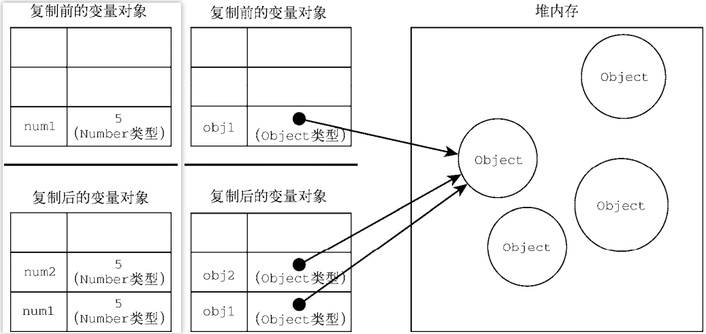

# 基础语法

`ECMAScript` 的语法很大程度上借鉴了 `C` 语言和其他类 `C` 语言，如 `Java` 和 `Perl`。

<hr>

### 标识符

标识符，就是变量、函数、属性或函数参数的名称。

命名规则：标识符可以由一个或多个下列字符组成

- 第一个字符不能是数字，其余字符可以是：字母、数字、下划线和美元符号。
- 标识符还可以是如上合法字符的`Unicode`转义序列，因不直观而不被推荐使用。
- 关键字、保留字、`true`、`false` 、`undefined` 和 `null` 不能作为标识符。
- 采用小驼峰式命名。

```js
// 使用Unicode码
let \u0065 = 1;
console.log(\u0065); // 1
```

<hr>

### 严格模式

`ECMAScript 5` 增加了严格模式（`strict mode`）的概念。

严格模式是一种不同的 `JavaScript` 解析和执行模型，`ES3` 的一些不规范写法在这种模式下会被处理，对于不安全的活动将抛出错误。

使用 `"use strict";` 语句开启，它是一个预处理指令，只能位于其作用域的开头位置，且不适用于块级作用域。

任何支持的 `JavaScript` 引擎看到它都会切换到严格模式。选择字符串形式的目的是不破坏 `ECMAScript 3` 语法。

```html
<script>
// 在该脚本中开启严格模式
"use strict";
    
// 在该函数中开启严格模式
function test () {
    "use strict";
}
</script>

<script>
// 后面的脚本元素不受影响，并未开启严格模式。
</script>
```

<hr>

### `JS` 运行三部曲

`JS` 运行三部曲。

1、语法分析

2、预编译

3、解释执行

在真正开始解释执行代码之前还有两个步骤，即语法分析和预编译。

在预编译之前，系统会对整个代码全部扫描一遍，看看有没有低级的语法错误，比如少了括号或引号等等。解释执行就是从上到下依次解释和执行代码。


#### 预编译

`JavaScript` 使用了一种被称为预编译的概念来处理变量的声明和函数的定义。预编译是在代码执行之前进行的一个步骤，它会创建一个执行上下文，收集代码中的变量和函数，并将它们添加到作用域中。

预编译的过程分为两个主要阶段：变量提升和函数提升。

在变量提升阶段，`JavaScript`会扫描代码并提升（将其移到作用域顶部）所有变量的声明，但不会提升变量的赋值操作。这意味着你可以在变量声明之前使用变量，而不会引发错误。变量被提升后，会被赋予一个默认值`undefined`。

例如，以下代码中，变量`x`在声明之前就被使用了：

```js
console.log(x);  // 输出：undefined
var x = 10;
```

在函数提升阶段，`JavaScript`会扫描代码并提升所有的函数声明。这意味着你可以在函数声明之前调用函数，而不会引发错误。函数声明会被整个提升，包括函数体内的代码。

例如，以下代码中，函数`foo`在声明之前就被调用了：

```js
foo();  // 输出：'Hello'
function foo() {
    console.log('Hello');
}
```

需要注意的是，只有函数声明会被提升，而函数表达式不会被提升。函数表达式是将函数赋值给变量或作为参数传递给其他函数的方式。

总结起来，`JS`的预编译阶段会在代码执行之前，提升变量和函数的声明，使得它们可以在声明之前被访问和使用。这样做的目的是为了解决作用域和闭包等问题，确保代码能够正常执行。

预编译分为全局预编译和函数预编译。

##### 预编译前奏

解析变量和函数声明：在进行实际的预编译之前，`JavaScript` 会先解析整个代码文件，扫描并识别出所有的变量和函数声明。

- 暗示全局变量：任何变量，如果变量未经声明就赋值，则这些变量都就归全局对象所有。
- 一切 `var` 声明的全局变量，都归 `window` 所有。

##### 全局预编译

全局预编译是指在 `JavaScript` 代码执行之前，进行全局作用域中的变量和函数声明的提升。

全局预编译，发生在整个 `script` 代码块执行前，过程有如下四步。

1. 创建全局对象：在预编译阶段，`JavaScript` 创建一个全局对象（`GO，Global Object`，在浏览器环境中为 `window` 对象），它作为全局作用域的顶层对象。
2. 提升变量声明：`JavaScript` 会扫描全局作用域中的代码，并提升所有变量的声明（但不包括赋值操作）。这意味着你可以在变量声明之前使用变量，而不会引发错误。变量被提升后，会被赋予默认值 `undefined`。
3. 提升函数声明：`JavaScript` 会提升全局作用域中的函数声明，包括函数体内的代码。这意味着你可以在函数声明之前调用函数，而不会引发错误。
4. 全局作用域链的创建：`JavaScript` 创建一个全局作用域链，用于在代码执行过程中解析变量和函数。作用域链是由当前作用域（全局作用域）和其外部环境（外部作用域或全局对象）组成的链式结构。

变量赋值和代码执行：在预编译完成后，`JavaScript` 开始解释和执行代码，进行变量赋值和其他操作。

需要注意的是，预编译只发生一次，而代码的执行会多次发生（比如在函数调用时）。全局预编译的目的是为了提前识别和收集全局作用域中的变量和函数，以确保代码能够正常执行，并创建全局作用域链。

##### 函数预编译

函数预编译是指在 `JavaScript` 函数执行之前，进行函数作用域内的变量和函数声明的提升。

函数预编译的过程如下：

1. 创建函数作用域：在函数定义时，`JavaScript` 会为该函数创建一个新的函数作用域（`Activation object` —— `AO` 对象，执行期上下文）。函数作用域是独立的，函数内的变量和函数在该作用域内被定义和使用。
2. 提升变量声明：`JavaScript` 扫描函数作用域中的代码，并提升所有局部变量（包括形参）的声明（但不包括赋值操作）。
3. 实参赋予形参：将实参和形参相统一，即：将实参赋值给形参。
4. 提升函数声明：`JavaScript` 会提升函数作用域中的函数声明，包括函数体内的代码。
5. 函数作用域链的创建：`JavaScript` 创建一个函数作用域链，用于在代码执行过程中解析变量和函数。作用域链是由当前作用域（函数作用域）和其外部环境（外部作用域或全局对象）组成的链式结构。

需要注意的是，函数预编译仅发生在函数执行之前（如果函数没有被执行，函数预编译阶段就不会发生。预编译是在代码执行之前的一个步骤，它在函数被调用时进行，而不是函数定义时。只有当函数实际被执行时，才会触发函数的预编译和执行过程），每次函数调用都会创建一个新的函数作用域。每个函数作用域都具有自己的作用域链，用于解析变量和函数。函数预编译的目的是为了提前识别和收集函数作用域内的变量和函数，以确保函数内的代码能够正常执行，并创建函数作用域链。

##### 函数调用

> 以下结论无法证实，至于“函数预编译是只在首次调用发生还是每次调用都发生”的问题有待考证。

无论是全局预编译还是函数预编译，都只会发生一次。

在 `JavaScript` 中，函数在第一次调用之前会经历预编译阶段，也称为函数的初始化阶段。在预编译阶段，`JavaScript` 会创建函数作用域、提升函数内的变量和函数声明，并创建函数作用域链。

一旦函数完成了预编译，它就可以被多次调用而无需再次进行预编译。函数的作用域和作用域链在预编译阶段已经确定，不会在每次函数调用时重新创建。预编译阶段只发生一次，确保函数内的代码能够正常执行，以及函数作用域内的变量和函数能够被访问。

在每次函数调用时，`JavaScript` 会直接执行函数内的代码，而无需再次进行预编译。这可以提高代码的执行效率，因为预编译只需要在函数第一次调用时进行一次，后续调用会重复使用已经存在的函数作用域链（链结构不会发生改变，其顶端始终指向当前函数作用域）。

当函数后续被调用时，会创建一个新的函数作用域。在创建新的函数作用域时，`JavaScript` 执行以下步骤：

1. 创建一个新的函数执行上下文，该上下文存储函数执行期间的状态信息。

2. 将新的函数执行上下文添加到执行上下文栈中，成为当前活动的执行上下文。

3. 复用作用域链，并更新作用域链的顶端，以便查找变量和函数。

4. 进入函数执行阶段：执行函数内的代码。

   - 在函数内部，可以通过作用域链访问外层作用域中的变量和函数。

   - 如果在函数内部有新的变量赋值，会在函数作用域对象中更新对应的变量值。

   - 如果在函数内部有新的变量声明（使用 `let` 或 `const`），会将变量名添加到函数作用域对象，并初始化为对应的值。

5. 函数执行完毕后，函数作用域会被销毁。函数作用域对象及其中的变量和函数也会被释放。

创建新的函数作用域的过程主要包括创建函数作用域对象、添加到作用域链、预处理变量和函数声明，以及执行函数代码。这样可以确保函数内的变量和函数在作用域中具有适当的可见性和封装性，并且不会与其他函数调用的作用域发生冲突。

需要注意的是，如果在函数内部嵌套定义了新的函数，那么嵌套函数在每次父函数调用时都会经历一次预编译过程，因为每次函数调用都会创建新的函数作用域。但是，已经预编译过的父函数作用域和作用域链仍然会被重复使用。

<hr>

### 变量

`ECMAScript` 变量是松散类型的，其变量可以用于保存任何类型的数据。

每个变量只不过是一个用于保存任意值的命名占位符，变量类型由其值决定。


#### 声明变量

有 3 个关键字可以声明变量：`var`、`const` 和 `let`。

其中，`var` 是最原始的声明方式，而 `const` 和 `let` 只能在 `ES6` 及更高的版本中使用。

##### `var`声明

变量未初始化的情况下，会默认保存一个特殊值 `undefined`。

变量初始化：声明变量并赋值（`undefined`除外）。

全局变量：

- 在全局作用域下，使用`var`声明的变量，就是全局变量。
- 未使用任何关键字声明的变量，默认会使用`var`隐式声明，且作为全局变量使用。【严格模式下，会报错】
- 所有的全局变量（除了 `let` 和 `const` 声明的），都会被挂载到`window`对象上作为全局属性使用。

```js
// 使用var声明、不使用关键字声明、直接在window上定义属性，三者的底层逻辑都是一样的。
var a = 1;
b = 2;
window.c = 3;
// 可在全局任何地方访问，访问时直接使用变量即可。
console.log(a, b, c); // 1, 2, 3
```

函数作用域：使用`var`关键字声明的变量，只有两种作用域：全局作用域和函数（局部）作用域。

块级作用域：块级作用域用一对大花括号`{}`定义，也包括前面的小括号，它是函数作用域的子集。

```js
{
    // 简单的块级作用域
}

() {
    // 组合式块级作用域，前面的小括号也同属于该块级作用域。
}
```

因此，在`if、for`等块级作用域中，使用`var`声明的变量仍是全局变量，只有使用`let`或`const`声明的才是块级变量。

```js
for(var i = 0; i < 10; i++) {
    var a = i;
}
console.log(i, a); // 10, 9

for(let i = 0; i < 10; i++) {
    let a = i;
}
console.log(i, a); // not defined
```


##### 变量提升

使用`var`关键字声明的变量，在预编译时会首先被提升到其作用域的顶部，以供后续使用，这一过程被称为**“变量提升”**。

副作用：不仅如此，同一作用域下使用`var`重复声明同一变量，也不会报错，仅仅是简单的相互覆盖。

注意：

- 变量提升会打破变量的声明时机，阻碍程序按照书写的逻辑顺序执行，极易导致出错。
- 但严格模式，并不阻止变量提升。


##### `let`声明

`let` 与 `var` 的作用差不多，声明的变量是同一类型变量，但所属的作用域不同。

最明显的区别是：

- `let` 声明的变量会受限于块级作用域，而 `var` 声明的受限于函数作用域。
- 在循环语句中，`let`受限于块级作用域，计数器迭代会产生独立副本；而`var`不受限制会始终迭代同一个变量。
- `let`声明的变量不允许被提升，且不允许在同一作用域下重复声明同一变量。【暂时性死区】
- 使用`let`声明的全局变量不会成为`window`的属性（在页面的生命周期内存续），而`var`的全局变量会。

暂时性死区：在未声明之前不能以任何方式来引用变量，否则会报错，并抛出`ReferenceError`。

```js
// 同一作用域下，重复声明同一变量
var a = 1;
let a = 2;
console.log(a); // Identifier 'a' has already been declared

// 使用同一个变量，进行迭代。
for (var i = 0; i < 5; i++) {
	setTimeout(() => console.log(i), 0); // 5, 5, 5, 5, 5
}
// 每次迭代，产出一个独立的副本，存于缓存中
for (let i = 0; i < 5; i++) {
    // 因为块级作用域允许生成闭包
    setTimeout(() => console.log(i), 0); // 0, 1, 2, 3, 4
}
```


##### `const`声明

`const` 的行为与 `let` 完全相同，直接的区别在于：`const` 必须初始化。

`const` 用于声明常量，尝试修改 `const` 声明的常量会导致运行时错误。

**常量初始化**：使用 `const` 声明变量时必须初始化变量，否则会报错。

注意：`const` 关键字只是将变量的栈内容设为不可更改，而堆内容的更新并不属于`const`的辖制范围。【`const`限定在栈内存层面】

```js
// 原始值类型：栈内的值不可更改
const a = 1;
a = 2; // TypeError: Assignment to constant variable. “不允许修改常量”

// 引用值类型：栈引用地址不可更改
const o = {};
o.a = 1; // 允许修改
o = {}; // TypeError: Assignment to constant variable.
```

迭代变量

- `for`循环中的计数器变量，仅会被声明一次，属于自增减型的迭代变量，可使用`let`而不能使用`const`声明。
- 而`for-of`和`for-in`循环的迭代变量，每次执行完循环体都会被销毁并重新声明，可使用`const`来声明以防内部篡改。
- `const` 与 `let` 一样，也会产生迭代变量的副本。

```js
// 计数器变量，仅在初始时声明一次，后续通过i++迭代。
for (let i = 0; i < 10; i++) {}

// 每次执行完循环体，销毁后重新声明，可防止计数器在内部被篡改。
for (const key in {a: 1, b: 2}) {
    console.log(key); // a, b
}
for (const value of [1, 2, 3]) {
    console.log(value); // 1, 2, 3
}

// 异步回调，产生迭代变量的副本。
for (const index in [1,2,3,4]) {
    setTimeout(() => console.log(index), 0); // 0, 1, 2, 3
}
```


#### 深入变量

没有规则定义变量必须包含什么数据类型，变量的值和数据类型在脚本生命期内可以改变。


##### 作用域

作用域（`Scope`）是指在程序中定义变量的可访问范围（可用性范围），它决定了变量在何处和何时可以被访问和使用。

作用域规定了变量的可见性和生命周期，可以理解为变量的有效范围。在不同的作用域中，同名的变量可以存在不同的值或状态。

在`JavaScript`中，主要有以下几种作用域：

1. 全局作用域（`Global Scope`）：全局作用域定义在整个程序的顶层，可以被程序中的所有部分访问。在浏览器环境中，全局作用域通常指的是全局对象（`window`对象）下的属性和方法的可用范围，可以用`var`关键字在全局作用域中定义变量。
2. 函数作用域（`Function Scope`）：函数作用域是指在函数内部声明的变量的可用范围（只能在函数内部被访问到）。函数作用域在函数被调用时创建，在函数执行完毕后被销毁。函数内的变量在函数外不可访问，但函数外的变量在函数内部是可访问的。
3. 块级作用域（`Block Scope`）：块级作用域是指在代码块（一对花括号 `{}`）内部声明的变量的可用范围。块级作用域存在于控制语句（如`if`语句、`for`循环、`while`循环等）中，以及`ES6`中引入的`let`和`const`关键字。在块级作用域中声明的变量只能在块内访问，块外的代码无法访问这些变量。

作用域的嵌套关系是由代码的结构决定的，内部作用域可以访问外部作用域的变量，但外部作用域不能访问内部作用域的变量。这种嵌套关系形成了作用域链（`Scope Chain`），当访问一个变量时，引擎会在作用域链中按照顺序查找变量的定义。

作用域的概念对于理解变量的可见性、生命周期和变量名冲突等问题非常重要，合理使用作用域可以提高代码的可读性、可维护性和安全性。


##### 作用域嵌套

有人说块级作用域是函数作用域的子集，但实际上块级作用域可以嵌套函数作用域。在块级作用域中可以定义函数，并且在其内部形成函数作用域。

具体来说，在一个代码块（由一对花括号`{}`包裹）中可以声明函数，函数只在该块中可用，函数内部的变量在函数作用域中有效。

以下是一个示例：

```js
{
  	let x = 10; // 块级作用域中的变量

  	function foo() {
    	let y = 5; // 函数作用域中的变量
    	console.log(x + y);
  	}

  	foo(); // 输出 15
}

console.log(x); // 报错，x 在这里不可访问
console.log(y); // 报错，y 在这里不可访问
```

在上面的例子中，变量`x`被定义在块级作用域中，作为整个块的局部变量，在函数`foo`中可以访问它。而变量`y`则被定义在函数作用域中，只能在函数`foo`内部访问。

这种嵌套作用域的使用可以提供更灵活的变量封装和作用域管理，有助于避免变量名冲突和提高代码的可读性。

在非严格模式下，一些浏览器可能会允许在 `if` 语句中声明函数，但函数并不会被限制在 `if` 块中（除非在严格模式下）。

根据 `ECMAScript` 规范，函数声明语句（`FunctionDeclaration`）应该出现在可执行代码的顶层或函数体内，而不是出现在语句块（如`if`语句块）中。

```js
'use strict';

if (true) {
  	function myFunction() {
    	console.log('Hello');
  	}
}
```

如果想在`if`语句中定义函数，最好将函数表达式（`Function Expression`）用于替代函数声明。函数表达式是将函数作为值来赋给变量的形式。

例如：

```js
'use strict';

if (true) {
  	let myFunction = function() {
    	console.log('Hello');
  	};

  	myFunction(); // 输出 Hello
}
```

在这个示例中，将函数赋值给变量`myFunction`，然后通过调用`myFunction()`来执行函数。

需要注意的是，这种方式声明的函数只在作用域内部可见，并且只在运行到函数表达式所在的代码行时被创建。所以在`if`语句块之外是无法访问到这个函数的。

虽然允许在`if`语句中声明函数，但出于代码可读性和可维护性的考虑，建议将函数声明放在合适的位置，而不是在`if`语句中。


##### 顶层作用域

顶层作用域（`Top-level Scope`）是指在代码的最高层级定义的变量和函数所在的作用域。在`JavaScript`中，顶层作用域通常是指全局作用域。

全局作用域是在代码的最外层定义的变量和函数所在的作用域。在浏览器环境中，全局作用域是运行在顶层的全局对象（`window`对象）中定义的变量和函数和可用性范围。在`Node.js`环境中，全局作用域是运行在全局上下文中的变量和函数和可用性范围。

在全局作用域中定义的变量和函数可以在任何位置被访问和使用，它们拥有最长的生命周期，在整个程序的执行过程中一直存在。

例如，以下代码中的变量`x`和函数`myFunction`都是在全局作用域中定义的：

```js
var x = 10; // 全局变量

function myFunction() {
  	console.log('Hello');
}

console.log(x); // 输出 10
myFunction(); // 输出 Hello
```

这里的变量`x`和函数`myFunction`都是在全局作用域中定义的，可以在任何地方访问和使用。

需要注意的是，虽然全局作用域可以访问局部作用域中的变量和函数，但反之则不成立。也就是说，在函数内部定义的变量和函数只能在函数内部访问，无法在全局作用域中直接访问。这种作用域的嵌套关系形成了作用域链，决定了变量和函数的可见性。


##### 作用域链

作用域链（`Scope Chain`）是 `JavaScript` 中用于查找变量和函数的机制。它是由多个作用域（包括全局作用域、函数作用域、块级作用域）组成的链式结构。

在 `JavaScript` 中，当访问一个变量时，解释器会首先在当前作用域内查找该变量，如果找不到，则会沿着作用域链向上逐层查找，直到找到该变量或达到全局作用域为止。

作用域链的形成遵循词法作用域（`Lexical Scope`）规则，即变量在函数声明时的作用域就被确定。当一个函数被定义时，它会创建一个作用域，并将其父级作用域（它被定义的位置）链接到这个作用域中。当函数被调用时，它会创建一个新的作用域，并将其链接到该函数的父级作用域。

下面看一个简单的例子来理解作用域链的形成过程：

```js
var x = 10; // 全局变量

function outerFunction() {
  	var y = 20; // 外部函数的变量

  	function innerFunction() {
    	var z = 30; // 内部函数的变量
    	console.log(x + y + z);
  	}

  	innerFunction(); // 输出 60
}

outerFunction();
```

在这个例子中，有一个全局作用域和两个函数作用域（外部函数和内部函数）。当内部函数中的 `console.log(x + y + z)` 执行时，先在内部函数的作用域中查找变量 `z`，找到后再在外部函数的作用域中查找变量 `y`，最后在全局作用域中查找变量 `x`。

作用域链的顺序是由函数定义的位置决定的，而不是函数被调用的位置。这意味着函数可以在定义之后的任何地方被调用，但其作用域链仍然与定义时的位置相关。

通过作用域链机制，`JavaScript`实现了变量的作用域和可见性管理，确保了函数内部可以访问到外部作用域中的变量，并且保护了变量的私有性。它是 `JavaScript` 中重要的一部分，对于理解和编写高质量的 `JavaScript` 代码非常重要。

`JavaScript` 形成作用域链的原理和关键在于词法作用域（`Lexical Scope`）和词法环境（`Lexical Environment`）。

1. 词法作用域：`JavaScript` 使用词法作用域规则来确定变量和函数的可见性。在代码编写时，变量和函数的作用域是通过它们在源代码中定义的位置决定的，而不是在运行时决定的。这意味着变量和函数的作用域是静态的，与它们被调用的位置无关。这使得 `JavaScript` 的作用域链能够按照上层嵌套的函数声明时的作用域关系进行链接。
2. 词法环境：词法环境是 `JavaScript` 引擎内部用于存储和查找变量和函数的数据结构。每个作用域在 `JavaScript` 中都有一个关联的词法环境，用于存储该作用域中声明的变量和函数的标识符和值。词法环境是按照层级结构组织的，形成了作用域链。

通过词法环境的组织和链接，形成了作用域链，确保在查找变量和函数时能够顺着作用域链逐级向上查找，直到找到对应的标识符或到达全局作用域。

在 `JavaScript` 中，每个函数都会在创建时生成一个词法环境，并且与其父级词法环境建立关联。这样就形成了函数的作用域和变量的词法环境之间的联系。

关键点：

- 变量和函数的作用域是在定义时确定的，而不是运行时。
- 函数在创建时会生成一个词法环境，其中包含定义时的变量和函数。
- 词法环境与作用域链一起组成了变量和函数查找的机制。
- 作用域链是按照函数定义的位置进行链接的，最终链接到全局作用域。
- 当访问一个变量或执行一个函数时，`JavaScript` 引擎会按照作用域链的顺序查找对应的标识符。

这些原理和关键点确保了 `JavaScript` 中变量和函数的作用域和可见性管理，同时也提供了闭包等特性。对于理解 `JavaScript` 中作用域链的形成和变量查找机制非常重要。


##### 作用域指针

在 `JavaScript` 中，作用域指针（`Scope Pointer`）是指一个指针或引用，用于连接当前执行环境（`Execution Context`）与其父级执行环境的作用域。

作用域指针在执行环境中起着关键的作用，它指示了在变量查找时应该在哪个作用域中查找。当 `JavaScript` 执行代码时，会以当前执行环境为基准，通过作用域指针向上链式查找变量所在的作用域。

具体来说，每个执行环境都有一个内部属性 `[[Scope]]`，指向了一个作用域链对象（`Scope Chain object`）。作用域链对象是一个包含了变量对象（`Variable Object`）的列表，其中每个变量对象代表一个作用域。作用域链对象按照嵌套关系依次连接起来，形成了作用域链。

当引擎需要查找一个变量时，会先从当前执行环境的作用域指针所指向的作用域开始查找，如果找不到，就通过作用域链向上逐级查找，直到找到该变量或到达全局作用域（通常是全局对象）为止。

作用域指针和作用域链共同实现了变量的作用域和可见性管理。通过作用域链的链接，`JavaScript` 可以在嵌套的函数中正确地查找变量，并确保函数内部可以访问到外部作用域中的变量。

需要注意的是，由于 `JavaScript` 引擎的内部实现细节，我们通常无法直接访问和操作作用域指针。作用域指针的存在是为了内部的变量查找机制，我们在编写 `JavaScript` 代码时无需显式操作作用域指针，而是通过词法作用域规则来确定变量的可见性和作用域。


##### 存储与访问

`ECMAScript` 变量可以包含两种不同类型的数据：原始值和引用值。

在把一个值赋给变量时，`JavaScript` 引擎必须确定这个值是原始值还是引用值。

存储：

- 原始值：将真实数据存入【`stack`】栈内存中。
- 引用值：将真实数据存入【`heap`】堆内存中，将其引用【堆地址】存入栈中。

访问：

- 原始值按值（`by value`）访问，引用值按引用（`by reference`）访问。
- 原始值：访问栈中的真实数据，直接操作该数据。
- 引用值：访问栈中的引用地址，通过该地址操作堆中的真实数据。

操作：`JavaScript` 不允许直接访问堆内存，因此，对变量的所有操作都只停留在栈层面。


##### 复制变量

由于 `JavaScript` 引擎对变量的所有操作都只停留在栈层面，因此复制变量的实质是：复制其栈内容。

注意：需要特别注意的是，函数传参实际上也是复制变量的过程。【将实参拷贝一份给形参】

```js
// 原始值：拷贝真实数据。
let num1 = 5,
    num2 = num1; // 将num1在栈中的内容拷贝给num2

// 两者相互独立，互不干扰
num2 += 1; 		// num2 === 6; num1 === 5;
num1 === num2; 	// false
------------------------------------------------------------------------------------------------------------

// 引用值：拷贝引用地址。
let obj1 = {},
    obj2 = obj1;

// 两者指向同一个堆，操作同一对象。
obj2.age = 18; 	// obj2.age === 18; obj1.age === 18;
obj1 === obj2; 	// true
```

​             


##### 添加属性

只有对象才能添加属性和方法，在原始值上添加属性虽然不会报错，但操作无效。

包装类：

- 如果将原始值包装为对象，那么就可以添加属性了。
- 要注意的是，该对象会使用其原始值参与任何运算。
- 包装类将原始值存于`[[PrimitiveValue]]`属性上。
- 包装类不会再转为原始值，它将永远保持对象形式。
- 数字型：包装为普通对象；字符串：包装为类数组。

对原始值添加属性不会报错的原因：

- 首先，后台会将原始值包装为对象；
- 然后，在该对象上添加指定的属性；
- 添加完之后，立即被 `delete` 删除。

访问原始值属性为 `undefined` 的原因：

- 首先，后台会将原始值包装为对象；
- 然后，去访问该对象上的指定属性；
- 由于属性不存在，返回 `undefined`。

```js
let str1 = "aaa",				// "aaa"
    str2 = new String("bbb"); 	// {0: "b", 1: "b", 2: "b", length: 3}

str1.age = 18; // new String(str1).age = 18; ==> delete age;
str2.age = 19;

str1.age; // undefined, new String(str1).age === undefined;
str2.age; // 19

typeof str1; // "string"
typeof str2; // "object"

// 使用原始值参与运算，但运算后保持对象形式。
str2 + ""; // "bbb"
typeof str2; // "object"
```


##### 确定类型

`typeof` 是判断一个变量是否为字符串、数值、布尔值、符号或 `undefined` 的最好方式。

如果想要知道变量是什么类型的对象，可使用 `ECMAScript` 提供的 `instanceof` 操作符。

规定：

- 所有引用值都是 `Object` 的实例，而原始值一定不是。【用 `instanceof` 检测原始值，始终会返回 `false`】
- 任何实现内部`[[Call]]`方法的对象都应该在被 `typeof` 检测时返回`"function"`。【函数与正则】

注意： 

- 在 `Chrome` 和 `Safari` 中，`typeof` 对正则表达式返回 `"function"`。【内部实现了 `[[Call]]` 方法】
- 在 `IE` 和 `Firefox` 中，`typeof` 对正则表达式返回 `"object"`。【内部未实现 `[[Call]]` 方法】
- 现在，`typeof` 普遍认为正则表达式为 `"object"`，只有函数为 `"function"`。

```js
// 语法：variable instanceof constructor; 返回一个布尔值，判断变量是否是给定constructor的实例。

// 判断原始值：首先排除null和undefined的干扰
function typeOf (a) {
    if (String(a) === "null") {
        return "null";
    } else if (String(a) === "undefined") {
        return "undefined";
    } else {
        return typeof a;
    }
}
// 等同写法：
String(a) === "null" ? "null" : String(a) === "undefined" ? "undefined" : typeof a;
------------------------------------------------------------------------------------------------------------

// 上述方法，可区分出所有原始值以及function，但仍然将数组和对象混为一谈，而且对正则偶尔含糊其词。
function instanceOf (a) {
    if (a instanceof Array) {
        return "array";
    } else if (a instanceof RegExp) {
        return "regexp";
    } else {
        return "object";
    }
}
// 等同写法：
a instanceof Array ? "array" : a instanceof RegExp ? "regexp" : "object";
------------------------------------------------------------------------------------------------------------

// 最终结合
function type (a) {
    if (String(a) === "null") {
        return "null";
    } else if (String(a) === "undefined") {
        return "undefined";
    } else if (typeof a !== "object") {
        return typeof a;
    } else if (a instanceof Array) {
        return "array";
    } else if (a instanceof RegExp) {
        return "regexp";
    } else {
        return "object";
    }
}
// 等同写法：
String(a) === "null" ? "null" : String(a) === "undefined" ? "undefined" : typeof a !== "object" ? typeof a :
a instanceof Array ? "array" : a instanceof RegExp ? "regexp" : "object";
------------------------------------------------------------------------------------------------------------

// 上述方法，已足够区分所有原始值和引用值，但对包装类却“得过且过”。
function type (a) {
    if (String(a) === "null") {
        return "null";
    } else if (String(a) === "undefined") {
        return "undefined";
    } else if (typeof a !== "object") {
        return typeof a;
    } else if (a instanceof Array) {
        return "array";
    } else if (a instanceof RegExp) {
        return "regexp";
    } else if (a instanceof Number) {
        return "object Number";
    } else if (a instanceof String) {
        return "object String"
    } else if (a instanceof Boolean) {
        return "object Boolean";
    } else {
        return "object Object";
    }
}
------------------------------------------------------------------------------------------------------------

// 还有最后一种情况：Object.create(null) 并不是 Object 的实例，但 typeof 也返回"object"。
/* 
	要区别 Object.create(null) 和 null 使用全等运算符判断是否为 null 即可。
	另外，Object.create(null) 还有一个明显的特点：它无法被转型，被转型会引发报错。【TypeError】
*/
```


#### 垃圾回收

`JavaScript` 是使用垃圾回收的语言，也就是说执行环境负责在代码执行时管理内存。

实际上，每个变量都具有一个生命周期。当变量的**”生命结束“**时，将被程序的回收机制当作垃圾回收。

 生命周期：

- 全局变量：一直存在，除非程序被关闭。【全局变量必须在程序被关闭后才开始销毁】
- 局部变量：一般地，在函数执行完之后立即销毁；若形成闭包可以延长它的生命周期。
- 块级变量：在该块中的代码都执行完之后，立即销毁。

背景：在 C 和 C++ 等语言中，跟踪内存使用对开发者来说是个很大的负担，也是很多问题的来源。

优点：

- `JavaScript` 为开发者卸下了这个负担，通过自动内存管理实现内存分配和闲置资源回收。

- 基本思路很简单：确定哪个变量不会再使用，然后释放它所占用的内存。

- 这个过程是**周期性**的，即垃圾回收程序每隔一定时间（或者说在代码执行过程中某个预定的收集时间）就会自动运行。

缺陷：

- 垃圾回收过程是一个近似且不完美的方案，因为某块内存是否还有用，属于“不可判定的”问题，意味着靠算法是解决不了的。

注释：

- 垃圾回收程序必须跟踪记录哪个变量还会使用，以及哪个变量不会再使用，以便回收内存。

- 如何标记和跟踪各变量的使用情况，也许有不同的实现方式。

- 不过，在浏览器的发展史上，用到过两种主要的标记策略：标记清理和引用计数。


##### 标记清理

`JavaScript` **最常用**的垃圾回收策略是标记清理（`mark-and-sweep`）。

基本思路：

- 回收程序运行时，先标记内存中的所有变量【标记的方法不止一种】
- 然后，将在上下文中的变量及其相关变量的标记取消【取消要用的】
- 那么，剩下的有标记的变量就是待删除的了【清除被标为“无用的”】
- 随后垃圾回收程序做一次内存清理，销毁带标记的所有变量并收回它们的内存。

标记方式：

- 当变量进入上下文时，被添加存在于上下文中的标记；离开时，被加上离开上下文的标记。
- 标记方式可以是反转某一位，也可以是使用“在上下文中”和“不在上下文中”两个变量表来记录。

到了 2008 年，`IE、Firefox、Opera、Chrome` 和 `Safari` 都在自己的 `JavaScript` 实现中采用标记清理（或其变体），只是在回收的频率上有所差异。


##### 引用计数

另一种没那么常用的垃圾回收策略是引用计数（`reference counting`）。

基本思路：记录每个引用值被引用的次数，当引用次数为 0 时，将被回收。

计数规则：

- 声明变量并给它赋一个引用值时，这个值的引用数为 1【初次引用】
- 当它的引用地址被赋值给其他变量时，它的引用数加 1【二次引用】
- 如果保存引用的变量被其他值覆盖了，它的引用数减 1【引用丢失】

引用计数最早由 `Netscape Navigator 3.0` 采用，但很快就遇到了严重的问题：循环引用。

引用循环：

- 对象 A 保存了对象 B 的引用，对象 B 也保存了对象 A 的引用【相互引用】

- 更严重的，对象利用属性保存了自身的引用【引用自身】

引用循环实际上是打破了引用数可自动归零的计数机制，想要恢复如初，必须手动减少额外增加的次数。

```js
// 相互引用：引用数无法自动归零，函数结束仍然存在。函数被多次调用，还会占用更多的内存。
function fn () {
    let obj1 = {},
        obj2 = {};
    
    obj1.obj2 = obj2;
    obj2.obj1 = obj1;
}

// 引用自身：陷入引用地狱，无限增加引用数，内存也越占越大。
let obj = {};
obj.obj = obj;
```

在 `IE8` 及更早版本的 `IE` 中，并非所有对象都是原生 `JavaScript` 对象。

例如：`BOM` 和 `DOM` 中的对象是 C++ 实现的 `COM` 组件对象模型（`Component Object Model`）对象。

而 `COM` 对象使用引用计数实现垃圾回收，导致只要涉及 `COM` 对象，就无法避开循环引用问题。

```js
let element = document.getElementById("some_element"),
	myObject = {}; 

myObject.element = element; 
element.someObject = myObject;
```

为了补救这一点，`IE9` 把 `BOM` 和 `DOM` 对象都改成了 `JavaScript` 对象，这避免了由于存在两套垃圾回收算法而导致的问题，同时还消除了常见的内存泄漏现象。

**清除循环引用**：使用 `null` 来切断相互引用的关系【使引用数减 1】，是推荐且常用的做法。

```js
// 建议在同一作用域下清除，因为obj1和obj2会在执行后自动销毁，但引用关系却仍然存在，此时更难清理。
function fn () {
    let obj1 = {},
        obj2 = {};
    
    // 相互引用
    obj1.obj2 = obj2;
    obj2.obj1 = obj1;
    
    // 在合适的时机，清除循环引用
    obj1.obj2 = null; // obj2的引用数减1
    obj2.obj1 = null; // obj1的引用数减1
}
```


##### 回收性能

背景：

- 垃圾回收程序会周期性运行，如果内存中分配了很多变量，则可能造成性能损失，因此垃圾回收的时间调度很重要。

- 尤其是在内存有限的移动设备上，垃圾回收有可能会明显拖慢渲染的速度和帧速率。

开发者不知道什么时候会开始收集垃圾，因此最好的办法是在写代码时就要做到：无论什么时候开始收集垃圾，都能让它尽快结束工作。

现代回收机制：

- 现代垃圾回收程序会基于对 `JavaScript` 运行时环境的探测来决定何时运行。

- 探测机制因引擎而异，但基本上都是根据已分配对象的大小和数量来判断的。

`V8` 引擎：在一次完整的垃圾回收之后，`V8` 的堆增长策略会根据活跃对象的数量外加一些余量来确定何时再次垃圾回收。

`IE`：由于调度垃圾回收程序方面的问题会导致性能下降，`IE` 曾饱受诟病。

- `IE6`：根据分配数，比如：分配了 256 个变量、4096 个对象 / 数组字面量和数组槽位（`slot`）或者 `64KB` 字符串。只要达到了其中任何一个条件，垃圾回收程序就会运行。这种实现的问题在于：如果始终需要这么多的变量或者需要更多的变量时，会导致回收程序频繁地执行，严重影响性能。对此，`IE7` 更新了回收程序。
- `IE7`：动态改变阈值，`JavaScript` 引擎的垃圾回收程序被调优为动态改变分配变量、字面量或数组槽位等会触发垃圾回收的阈值。`IE7` 的起始阈值都与 `IE6` 的相同。如果程序回收的内存不到已分配的 15%，这些变量、字面量或数组槽位的阈值就会翻倍。如果有一次回收的内存达到已分配的 85%，则阈值会被重置为默认值。这么一个简单的修改，极大地提升了重度依赖 `JavaScript` 的网页在浏览器中的性能。

主动回收：

- 在某些浏览器中可以通过调用方法去主动地触发垃圾回收。【不推荐】
- 在 `IE` 中，调用 `window.CollectGarbage()` 方法会立即触发垃圾回收。
- 在 `Opera 7` 及更高版本中，调用 `window.opera.collect()` 也会启动垃圾回收程序。


##### 内存管理

在使用垃圾回收的编程环境中，开发者通常无须关心内存管理。

不过，`JavaScript` 运行在一个内存管理与垃圾回收都很特殊的环境。

内存限制：

- 分配给浏览器的内存通常比分配给桌面软件的要少很多，分配给移动浏览器的就更少了。

- 这更多出于安全考虑而不是别的，就是为了避免运行大量 `JavaScript` 的网页耗尽系统内存而导致操作系统崩溃。

- 然而，这个内存限制不仅影响变量分配，也影响调用栈以及能够同时在一个线程中执行的语句数量。

一、内存优化

- 由于运行的内存限制，将内存占用量保持在一个较小的值才能让页面性能更好。【占用量大只会徒增系统负担】
- 因此，优化内存占用的最佳手段：就是保证在执行代码时只保存必要的数据。
- **解除引用**：就是将不再必要的数据设置为 `null`，从而下次回收时释放其内存。
- 解除引用最适合解除全局变量和全局对象的属性，因为局部变量在超出其作用域后会被自动解除。

```js
function fn (name, age) {
    let localPerson = {name, age};
    return localPerson; // 函数执行完后，localPerson被自动销毁，但将对其值的引用传递了出去
}

let globalPerson = fn("丸子", 18); // 将值的引用保存到一个globalPerson全局变量中。

// 当不再需要时，解除globalPerson对其值的引用，下次回收时将被释放。
globalPerson = null;
```

二、隐藏类和删除操作【不要直接增加或删除实例上的属性】

- 隐藏类：【使用同一个构造器创建出来的实例可共享同一个隐藏类】

  - `V8` 在将解释后的 `JavaScript` 代码翻译为实际的机器码时会利用**“隐藏类”**。

  - 如果你的代码非常注重性能，那么这一点可能对你很重要。

  - 运行期间，`V8` 会将创建的对象与隐藏类关联起来，以跟踪它们的属性特征。

  - 能够共享相同隐藏类的对象性能会更好，`V8` 会针对这种情况进行优化，但不一定总能够做到。
  - 然而，如果对实例添加了私有属性，将会打破该实例与其他实例共享隐藏类。
  - 根据这种破坏操作的频率和隐藏类的大小，这可能会对性能产生明显的影响。
  - 解决方案：在构造函数中一次性声明所有属性，一定避免直接在实例上添加。

- 删除操作：【将不需要的属性设为 `null` 仍能保持继续共享隐藏类】

  - 使用 `delete` 关键字删除实例上的属性，也会导致该实例无法再共享隐藏类。
  - 因此，不要直接删除实例上的属性，而是将其设为 `null` 。既能保持共享还能促进回收。

总而言之，要尽量让实例继承属性，而不是私自增加或删除属性。否则，实例将无法共享隐藏类。

```js
function Person (name) {
    this.name = name;
}

// 此时，person1和person2共享隐藏类
let person1 = new Person("wanzi"),
    person2 = new Person("cherry");

// 如果在person1上添加了私有属性，将会导致它不能再共享隐藏类。
person1.age = 18;
------------------------------------------------------------------------------------------------------------

// 最好的办法是：在构造器或原型上一次性声明完所有需要的属性。
function Person (name, age) {
    this.name = name;
    this.age = age;
}

// person1和person2保持共享隐藏类
let person1 = new Person("wanzi", 18),
    person2 = new Person("cherry", 19);
------------------------------------------------------------------------------------------------------------

// 回收不再需要的属性
function Person (name, age) {
    this.name = name;
    this.age = age;
}

let person1 = new Person("wanzi", 18),
    person2 = new Person("cherry", 19);

delete person1.age; // 删除属性，将脱离共享【极不推荐】
person1.age = null; // 保持共享，且可被回收【推荐做法】
```

三、内存泄漏

在内存有限的设备上，或者在函数会被调用很多次的情况下，内存泄漏可能是个大问题。

`JavaScript` 中的内存泄漏主要是：由隐式声明的全局变量或意外形成的闭包所引起的。

隐式声明的全局变量：是指未使用任何关键字声明就直接赋值的变量，形成条件：变量必须被赋值，否则会报错。

闭包：

- 是指在其作用域链中引用了其他函数的作用域的函数，形成条件：作用域链中必须有其他函数的上下文对象。

- 从现象上来看，指本应在函数执行完之后被立即销毁的活动对象因被其他函数引用而逃过了回收宿命的现象。

泄漏原因：

- 隐式的全局变量：该变量会被“好心的” `window` 对象收录。因此，只要 `window` 对象自身不被销毁它将一直存在。
- 闭包：闭包函数一直牵着别人的活动对象，除非对保存了闭包函数引用的变量**解除引用**，否则它将迟迟不被释放。

```js
// 隐式声明的全局变量：
// 最常见的错误就是在函数中意外地声明了全局变量。
function setName () {
    name = "cherry";
}

// 另外，不规范的声明方式，会导致泄漏更难以觉察。
function fn () {
    // 看似声明了4个局部变量，实则意外的声明了3个全局变量。
    let a = b = c = d = 0; // 相当于：d = 0, c = d, b = c, let a = b;
}
------------------------------------------------------------------------------------------------------------

// 闭包：
// 最常见的就是将子函数引用了父函数的变量，而子函数的引用又被保存到了父函数的外部。
function father (lastname) {
    // 1、通过return将子函数的引用返回出去，虽然子函数被销毁了，但它的引用被保存了出去。
    return function (firstname, age) {
        let name = lastname + firstname;
        return {name, age};
    }
}
let son = father("姬"); 	// 获取并保存了对闭包函数的引用
let fa = son("发", 20);	// 执行闭包函数虽然销毁了作用域，但对闭包的引用仍然存在。
// 解决闭包的唯一办法就是解除对闭包的引用【抹掉指针】
son = null; // 解除变量son对闭包的引用
// 最后建议在合适的时机，解除对局部变量不必要的引用。
fa = null; // 解除对局部对象值{name, age}的引用。
// 若函数不再需要，也建议解除对函数的引用
father = null;

// 另外，还可以通过引用值将其引用保存出去
function father (lastname) {
    // 2、通过对象或数组将子函数的引用返回出去，虽然子函数被销毁了，但它的引用被保存了出去。
    function son (firstname, age) {
        let name = lastname + firstname;
        return {name, age};
    }
    return {son}; // 通常存在对象中，当然数组也可以。
}
let {son} = father("姬"); 	// 获取并保存了对闭包函数的引用。
let fa = son("发", 20);		// 执行闭包函数虽然销毁了作用域链，但对闭包的引用仍然存在。
// 解除引用
father = son = fa = null;
-------------------------------------------------

// 容易被人疏忽的是，定时器等的回调函数也极容易悄悄地形成闭包
function fn () {
    let name = 'Jake'; 
    setInterval(() => { 
        console.log(name); // 回调函数嵌套在函数内部，它自然而然地继承了父级函数的活动对象。
    }, 100);
}
// 解决闭包的唯一办法是解除对闭包的引用：对于定时器来说，清除定时器的主要工作就是解绑其回调，而这恰巧提供了天然的解决办法。
// 内部清除
function fn () {
    let name = 'Jake';
    let timer = setInterval(() => { 
        console.log(name);
        // 1.在合适的时机，关闭并清除定时器【内部清除】
        clearInterval(timer);
        // 局部的timer会被自动回收，但如果是全局的timer，还需添加：timer = null; 手动回收。
    }, 100);
}
// 外部清除
function fn () {
    let name = 'Jake';
    let timer = setInterval(() => { 
        console.log(name);
    }, 100);
    return timer;
}
let timer = fn();
// 2.在合适的时机，关闭并清除定时器【外部清除】
clearInterval(timer), timer = null;
```

四、静态分配与对象池

背景

​		为了提升 `JavaScript` 性能，最后要考虑的一点往往就是压榨浏览器了。此时，一个关键问题就是如何减少浏览器执行垃圾回收的次数。开发者虽然无法直接控制什么时候开始收集垃圾，但可以间接控制触发垃圾回收的条件。

理论上，如果能够合理使用分配的内存，同时避免多余的垃圾回收，就可以省下浪费在回收上的性能。

对象更替速度：【更替：从创建到再创建被视为一次更替】

- `V8` 引擎会根据活跃对象的数量外加一些余量来决定何时下次回收。

- 浏览器决定何时运行垃圾回收程序的一个标准就是对象更替的速度。
- 对象更替的速度过快，会被浏览器捕捉到，并频繁地安排垃圾回收。

因此，要避免对象在短时间内被多次地创建和销毁，或者说避免大量对象在短时间内被创建和销毁【内存抖动】

**内存抖动**：指短时间内有大量的对象被创建或者被回收的现象。影响：频繁内存抖动会导致垃圾回收频繁运行，造成系统卡顿。

通常的解决方法就是：通过静态分配和使用对象池。

- 静态分配：尽量使用已有的对象，解决动态创建的问题
- 对象池：利用单例模式，避免重复更替同一类型的对象

静态分配和对象池是优化的一种极端形式，对于轻中量级的对象来说，分配和释放对象的开销可以忽略不计；如果你的应用程序被垃圾回收严重地拖了后腿，可以利用它提升性能。但这种情况并不多见，大多数情况下，这都属于过早优化，可能反而浪费性能。

```js
// 静态分配：尽量使用已有的对象，避免动态地创建对象，尤其是在函数中创建对象。
// 动态创建
function addVector(a, b) {
    // 如果该函数被频繁地调用，将会加快该对象的更替速度。
    let resultant = new Vector(); // 创建一个矢量对象
	// 如果只执行一两次，影响倒是不大。但如果这样的函数很多，效果还是一样的，因此建议使用静态分配。
    
    resultant.x = a.x + b.x; 
    resultant.y = a.y + b.y; 
    return resultant; 
}
// 静态分配
let resultant = new Vector(); // 分配一个已有的对象。
function addVector(a, b, resultant) {
    // 避免在函数内部创建对象，即使多次调用，也不会加快对象更替的速度。
    resultant.x = a.x + b.x; 
    resultant.y = a.y + b.y; 
    return resultant; 
}
------------------------------------------------------------------------------------------------------------

// 对象池：如果池中有该对象，则直接返回该对象；如果没有则在创建后返回。【单调增长但静态分配】
// 简单的对象池：复用单一对象。为了保证始终复用同一对象，创建后必须要回收，否则不能再次创建。
let personPool = (function () {
    const pool = [];
    let isRecycled = true;
    return {
        create() {
            if(isRecycled) {
                isRecycled && (isRecycled = false);
                return pool.length ? pool.pop() : {name: "", age: 0, sex: "", others: null};
            }
        },
        recycle(item) {
            if(!pool.length) {
                pool.push(item);
                !isRecycled && (isRecycled = true);
            };
        }
    }
})();
let person1 = personPool.create(); 	// 从池中获取一个对象，因避免了对象更替，所以有效地减少了回收次数。
personPool.recycle(person1); 		// 获取之后将其回收到池中，因为共享同一引用，在哪里回收都是一样的。

// 当然，也可以先调用recycle收录想要复用的对象，然后调用create将其获取出来，但用完后也要记得回收。
personPool.recycle(new Person()); 	// 传入一个想要复用的对象
let person1 = personPool.create(); 	// 获取该对象
personPool.recycle(person1); 		// 收回该对象

// 对该对象进行操作
person1.name = "wanzi";
person1.age = 18;
person1.sex = "女"
person1.others = {
    height: 168,
    weight: 90
}

// 当该对象极其属性不再被需要时，应将其解除引用。
person1 = person1.others = null; // 解除或删除不必要的属性，避免污染池水。
--------------------------------------------------------

// 构建一个通用的对象池，内部可以有许多小池，每个池应是一类功能相关的对象的集合。
const objectPoolFactory = function (createPool, max) {
    max = +max || 5; // 默认最多放5个对象。
    let createdCount = 0, // 获取次数
        isGrowed = false; // 是否扩容
    const pool = [];
    return {
        create() { // 获取对象
            if (createdCount++ < max) {
                return isGrowed ? (pool.pop(), createPool.apply(this, arguments)) : pool.length ? pool.pop() : createPool.apply(this, arguments);
            } else {
                (createdCount !== max) && (createdCount = max);
                isGrowed && (isGrowed = false);
                console.log("容量不足，请先回收或者按需扩容");
                return null;
            }
        },
        recycle(item) { // 回收对象
            if (item instanceof Object) {
                if (pool.length < max) {
                    pool.push(item);
                    createdCount--; // 每回收一次，就可再获取一次。
                    console.log("回收成功");
                } else {
                    console.log("容量已满或已空，可按照需求扩容");
                    return null;
                }
            } else {
                console.log("非对象值，回收失败");
            }
        },
        grow(addend) { // 扩展或压缩容量
            if (max >= -addend) {
                !isGrowed && (isGrowed = true);
                return addend ? max += addend : max *= 2;
            } else {
                console.log(`当前最大可压缩容量为：${max}`);
            }
        },
        use() { // 查看池中对象的数量
            return pool.length;
        }
    }
}

// 初始化一个div对象池，第二参数用于设置初始最大数量
let divPool = objectPoolFactory(function () {
    return document.createElement("div");
});
// 从池中获取3个div
let div1 = divPool.create(),
    div2 = divPool.create(),
    div3 = divPool.create();
// 回收div，默认最多回收5个。如果想要扩容，可调用grow传入一个正数，负数为缩小容量。
divPool.recycle(div1);
divPool.recycle(div2);
divPool.recycle(div3);
// 使用完div，应及时解除其引用包括不必要的属性。
div1 = div2 = div3 = null;
// 当该对象池不再需要时，设为null即可。也可以通过objectPoolFactory创建更多的对象池。
---------------------------------------------

// 为了使池中对象共享隐藏类，也可以设计一个构造器。
function Div () {
    // 提前在构造器中设置好所有需要的属性，如：innerHTML等。
    this.name = "";
    this.innerHTML = "";
}
// 初始化一个div对象池
let divPool = objectPoolFactory(function () {
    return new Div();
});

--------------------

// 设计一个可自动回收的对象池
let divPool = objectPoolFactory(function () {
    let div = new Div();
    document.body.appendChild(div); // 插入到页面中
    
    // 当节点加载完成之后，执行回收
    div.onload = function () {
        div.onload = null; // 防止重复加载的bug
        divPool.recycle(div);
    }
    
    return div;
});
// 获取并使用对象即可。
let div1 = divPool.create();
div1.name = "A";
// 使用完毕后，移除节点，解除引用，重置属性
ducument.body.removeChild(div1);
div1 = null;
div1.name = "";
```

更多参考： [高效的 JavaScript 对象池](https://www.pudn.com/detail/4742907?utm_medium=distribute.pc_aggpage_pudn_relevant_right_sidebar.none-task-pudn-2~pudn~first_rank_ecpm_v1~rank_v31_ecpm-2-4742907-null-null.nonecase&utm_term=js%E5%AF%B9%E8%B1%A1%E6%B1%A0&spm=1000.2123.3001.8073) 、[Cocos 对象池](http://docs.cocos.com/creator/1.10/manual/zh/scripting/pooling.html) 、[对象池模式](https://zhuanlan.zhihu.com/p/498408247) 

```js
// NodePool源码
/****************************************************************************
 Copyright (c) 2016 Chukong Technologies Inc.
 Copyright (c) 2017-2018 Xiamen Yaji Software Co., Ltd.
 http://www.cocos2d-x.org
 Permission is hereby granted, free of charge, to any person obtaining a copy
 of this software and associated documentation files (the "Software"), to deal
 in the Software without restriction, including without limitation the rights
 to use, copy, modify, merge, publish, distribute, sublicense, and/or sell
 copies of the Software, and to permit persons to whom the Software is
 furnished to do so, subject to the following conditions:
 The above copyright notice and this permission notice shall be included in
 all copies or substantial portions of the Software.
 THE SOFTWARE IS PROVIDED "AS IS", WITHOUT WARRANTY OF ANY KIND, EXPRESS OR
 IMPLIED, INCLUDING BUT NOT LIMITED TO THE WARRANTIES OF MERCHANTABILITY,
 FITNESS FOR A PARTICULAR PURPOSE AND NONINFRINGEMENT. IN NO EVENT SHALL THE
 AUTHORS OR COPYRIGHT HOLDERS BE LIABLE FOR ANY CLAIM, DAMAGES OR OTHER
 LIABILITY, WHETHER IN AN ACTION OF CONTRACT, TORT OR OTHERWISE, ARISING FROM,
 OUT OF OR IN CONNECTION WITH THE SOFTWARE OR THE USE OR OTHER DEALINGS IN
 THE SOFTWARE.
 ****************************************************************************/

/**
 * !#en
 *  cc.NodePool is the cache pool designed for node type.<br/>
 *  It can helps you to improve your game performance for objects which need frequent release and recreate operations<br/>
 *
 * It's recommended to create cc.NodePool instances by node type, the type corresponds to node type in game design, not the class, 
 * for example, a prefab is a specific node type. <br/>
 * When you create a node pool, you can pass a Component which contains `unuse`, `reuse` functions to control the content of node.<br/>
 *
 * Some common use case is :<br/>
 *      1. Bullets in game (die very soon, massive creation and recreation, no side effect on other objects)<br/>
 *      2. Blocks in candy crash (massive creation and recreation)<br/>
 *      etc...
 * !#zh
 * cc.NodePool 是用于管理节点对象的对象缓存池。<br/>
 * 它可以帮助您提高游戏性能，适用于优化对象的反复创建和销毁<br/>
 * 以前 cocos2d-x 中的 cc.pool 和新的节点事件注册系统不兼容，因此请使用 cc.NodePool 来代替。
 *
 * 新的 NodePool 需要实例化之后才能使用，每种不同的节点对象池需要一个不同的对象池实例，这里的种类对应于游戏中的节点设计，一个 prefab 相当于一个种类的节点。<br/>
 * 在创建缓冲池时，可以传入一个包含 unuse, reuse 函数的组件类型用于节点的回收和复用逻辑。<br/>
 *
 * 一些常见的用例是：<br/>
 *      1.在游戏中的子弹（死亡很快，频繁创建，对其他对象无副作用）<br/>
 *      2.糖果粉碎传奇中的木块（频繁创建）。
 *      等等....
 * @class NodePool
 */

/**
 * !#en
 * Constructor for creating a pool for a specific node template (usually a prefab). You can pass a component (type or name) argument for handling event for reusing and recycling node.
 * !#zh
 * 使用构造函数来创建一个节点专用的对象池，您可以传递一个组件类型或名称，用于处理节点回收和复用时的事件逻辑。
 * @method constructor
 * @param {Function|String} [poolHandlerComp] !#en The constructor or the class name of the component to control the unuse/reuse logic. !#zh 处理节点回收和复用事件逻辑的组件类型或名称。
 * @example
 *  properties: {
 *    template: cc.Prefab
 *  },
 *  onLoad () {
      // MyTemplateHandler is a component with 'unuse' and 'reuse' to handle events when node is reused or recycled.
 *    this.myPool = new cc.NodePool('MyTemplateHandler');
 *  }
 * @typescript
 * constructor(poolHandlerComp?: {prototype: Component}|string)
 */
cc.NodePool = function (poolHandlerComp) {
    /**
     * !#en The pool handler component, it could be the class name or the constructor.
     * !#zh 缓冲池处理组件，用于节点的回收和复用逻辑，这个属性可以是组件类名或组件的构造函数。
     * @property poolHandlerComp
     * @type {Function|String}
     */
    this.poolHandlerComp = poolHandlerComp;
    this._pool = [];
};
cc.NodePool.prototype = {
    constructor: cc.NodePool,

    /**
     * !#en The current available size in the pool
     * !#zh 获取当前缓冲池的可用对象数量
     * @method size
     * @return {Number}
     */
    size: function () {
        return this._pool.length;
    },

    /**
     * !#en Destroy all cached nodes in the pool
     * !#zh 销毁对象池中缓存的所有节点
     * @method clear
     */
    clear: function () {
        var count = this._pool.length;
        for (var i = 0; i < count; ++i) {
            this._pool[i].destroy();
        }
        this._pool.length = 0;
    },

    /**
     * !#en Put a new Node into the pool.
     * It will automatically remove the node from its parent without cleanup.
     * It will also invoke unuse method of the poolHandlerComp if exist.
     * !#zh 向缓冲池中存入一个不再需要的节点对象。
     * 这个函数会自动将目标节点从父节点上移除，但是不会进行 cleanup 操作。
     * 这个函数会调用 poolHandlerComp 的 unuse 函数，如果组件和函数都存在的话。
     * @method put
     * @param {Node} obj
     * @example
     *   let myNode = cc.instantiate(this.template);
     *   this.myPool.put(myNode);
     */
    put: function (obj) {
        if (obj && this._pool.indexOf(obj) === -1) {
            // Remove from parent, but don't cleanup
            obj.removeFromParent(false);

            // Invoke pool handler
            var handler = this.poolHandlerComp ? obj.getComponent(this.poolHandlerComp) : null;
            if (handler && handler.unuse) {
                handler.unuse();
            }

            this._pool.push(obj);
        }
    },

    /**
     * !#en Get a obj from pool, if no available object in pool, null will be returned.
     * This function will invoke the reuse function of poolHandlerComp if exist.
     * !#zh 获取对象池中的对象，如果对象池没有可用对象，则返回空。
     * 这个函数会调用 poolHandlerComp 的 reuse 函数，如果组件和函数都存在的话。
     * @method get
     * @param {any} ...params - !#en Params to pass to 'reuse' method in poolHandlerComp !#zh 向 poolHandlerComp 中的 'reuse' 函数传递的参数
     * @return {Node|null}
     * @example
     *   let newNode = this.myPool.get();
     */
    get: function () {
        var last = this._pool.length-1;
        if (last < 0) {
            return null;
        }
        else {
            // Pop the last object in pool
            var obj = this._pool[last];
            this._pool.length = last;

            // Invoke pool handler
            var handler = this.poolHandlerComp ? obj.getComponent(this.poolHandlerComp) : null;
            if (handler && handler.reuse) {
                handler.reuse.apply(handler, arguments);
            }
            return obj;
        }
    }
};

module.exports = cc.NodePool;
```

<hr>

### 数据类型

`ECMAScript` 有 6 种简单数据类型（也称为原始类型）：`Undefined、Null、Boolean、Number、String` 和 `Symbol`。

提示：`Symbol`（符号类型）是 `ECMAScript 6` 新增的；`ES6`之前，只有五大原始类型。

还有一种复杂数据类型叫 `Object`（对象）。`Object` 是一种无序名值对的集合。

引用类型：指`Object`类型及其子类型（`Array`和`Function`）。

注意：

- 在 `ECMAScript` 中不能定义自己的数据类型，所有值都可以用上述 7 种数据类型（简单类型和复杂类型）之一来表示。
- 只有 7 种数据类型似乎不足以表示全部数据。但 `ECMAScript` 的数据类型很灵活，一种数据类型可以当作多种数据类型来使用。


#### 类型检查

因为 `ECMAScript` 的类型系统是松散的，所以需要一种手段来确定变量的数据类型，`typeof`操作符为此而生。

不过，`typeof`操作符检查结果并不准确，只可用来检查如下的 7 种数据类型。

- 字符串型（`"string"`）：`String`
- 数字型（`"number"`）：`Number`
- 布尔型（`"boolean"`）：`Boolean`
- 未定义型（`"undefined"`）：`undefined`（变量未初始化或未声明）
- 符号型（`"symbol"`）：`Symbol`
- 对象型（`"object"`）：`Object`、`"Array"`以及`null`
- 函数型（`"function"`）：`Function`

返回值：

- `typeof`方法的返回值是对应类型的字符串形式，如：`"string", "number", "boolean", "undefined", "symbol"`
- `typeof`将函数从对象型中单独分离出来（为了区分函数与其他对象），而将`null`视为对象类型。
- 因为函数不同于其他对象，而特殊值 `null` 一直被认为是一个对空对象的引用。
- 在`JS`中使用未声明的变量一定会报错。但在使用`typeof`检查时，不会报错而是返回`"undefined"`。

提示：对未声明的变量调用 `delete` 也不会报错，但这个操作没什么用，实际上在严格模式下会抛出错误。


#### 未定义型

未定义型（`Undefined` 类型）只有一个值，就是特殊值 `undefined`。

当使用 `var` 或 `let` 声明变量但未初始化时，变量会被自动赋予 `undefined` 特殊值。

注释：

- 字面值 `undefined`主要用于比较，它在 `ES3` 之前是不存在的，派生自`null`值。
- 增加这个特殊值的目的：就是为了正式明确空对象指针（`null`）和未初始化变量的区别。
- 在`typeof`中，当变量未初始化或未声明时，都会返回`"undefined"`。因此，它主要用来判断变量是否有意义。

```js
// 变量未初始化
let a;
a === undefined; // true
typeof a; // "undefined"

// 变量未声明
typeof b; // "undefined"
```

建议：在声明变量的同时进行初始化。这样，当 `typeof` 返回`"undefined"`时，就能确定变量是未声明。


#### 空类型

`Null` 类型同样只有一个值，即特殊值 `null`。

逻辑上讲，`null` 值表示一个空对象指针，这就是 `typeof` 要将 `null` 视为`"object"`的原因。

建议：当声明对象型变量时，使用`null`来初始化，方便后续的类型检查。

```js
// 由于undefined派生自null，ES将它们定义为表面相等。
undefined == null; // true

// 但它们不是同一类型，并各有用途。
undefined === null; // false
```


#### 布尔型

`Boolean`（布尔值）类型常用于流程控制体中，有两个字面值：`true` 和 `false`。

类型转换：

- 虽然布尔值只有两个，但所有其他类型的值都有相应布尔值的等价形式。
- 要将一个其他类型的值转换为布尔值，可以调用特定的 `Boolean()`转型函数
- 被转换为 `true` 或 `false` 的规则，取决于其数据类型以及实际的值。

转换规则：

- `String`型：空字符串转换为`false`；非空字符串转换为`true`（包括空格字符串，空格也是字符）
- `Number`型：`0`和`NaN`转为`false`；非零数值转换为`true`（包括`Infinity`，最大和最小数值）
- `Object`型：任何对象都转换为`true`（包括空对象、空数组、函数）
- `Undefined`型：转为`false`
- `Null`型：转为`false`
- `Symbol`型：转为`true`

```js
// 字符串型
let str = "";
Boolean(str); // false
str = " ";
Boolean(str); // true
// 数字型
let num = 0;
Boolean(num); // false
num = NaN; // false
num = Infinity; // true
// 未定义型
let un;
Boolean(un); // false
// 空类型
let nu = null;
Boolean(nu); // false
// 复杂类型
let obj = {};
Boolean(obj); // true
obj = []; // true
obj = function () {} // true
```

包装类：使用 `new Boolean()` 可以将布尔值包装为布尔型对象，其他类型的值首先会调用 `Boolean()` 来转换。

布尔型对象重写了`valueOf` 和 `toString` 方法：`valueOf` 返回其原始值形式，`toString` 返回其原始值的字符串形式。

```js
let oBool = new Boolean(1);
oBool.valueOf(); 	// true
oBool.toString(); 	// "true"

// 原型判断
oBool instanceof Boolean; // true
```


#### 数字型

`Number` 类型使用 `IEEE 754` 格式表示整数和浮点值（在某些语言中也叫双精度值），数值默认采用双精度保存。


##### 进制

- 八进制：八进制字面量以0开头，数值0~7。若超出范围将被视为十进制数。【严格模式下，八进制数无效】
- `ES6` 中的八进制值通过前缀 `0o` 来表示；严格模式下，前缀 0 会被视为语法错误，如果要表示八进制值，应该使用前缀 `0o`。
- 十六进制：十六进制字面量以`0x`开头，数值0~9，A~F。
- 无论是哪种进制数，最终都会被转换为对应的十进制数后，再参与数学运算。

在 `JavaScript` 中，可以使用一些内置的函数和方法来实现进制间的转换。下面是一些常用的方法：

十进制转其他进制：

- `Number.prototype.toString()`：将十进制数转换为其他进制的字符串表示。

```js
let decimalNumber = 42;

let binaryString = decimalNumber.toString(2); 		// 转换为二进制的字符串 "101010"
let hexadecimalString = decimalNumber.toString(16); // 转换为十六进制的字符串 "2a"
```

其他进制转十进制：

- `parseInt()`：将其他进制的字符串转换为十进制数。

```js
let binaryString = "101010";
let decimalNumber = parseInt(binaryString, 2); 			// 转换为十进制的数值 42

let hexadecimalString = "2a";
let decimalNumber = parseInt(hexadecimalString, 16); 	// 转换为十进制的数值 42
```

其他进制之间的转换：

- 首先将其他进制数转换为十进制，然后将十进制数转换为目标进制。

```js
let binaryString = "101010";
let decimalNumber = parseInt(binaryString, 2);
let hexadecimalString = decimalNumber.toString(16); // 转换为十六进制的字符串 "2a"

let decimalNumber = 42;
let binaryString = decimalNumber.toString(2); // 转换为二进制的字符串 "101010"
```

这些方法可以帮助你在 `JavaScript` 中进行进制间的转换。需要注意的是，其他进制转换为十进制时，字符串前缀可以指定进制类型（例如，前缀 `0b` 表示二进制，前缀 `0x` 表示十六进制）。转换后的结果是一个十进制的数值，可以使用 `.toString()` 方法将其转换为其他进制的字符串表示。


##### 浮点值

- 浮点值中必须且只能有一个小数点，小数点前后至少要有一位数字。
- 因为存储浮点值使用的内存空间是存储整数值的两倍，所以 `ECMAScript` 总是想方设法把浮点值转换为整数值。
- 例如：在小数点后面没有数字或只有0的情况下，浮点值就会变成整数值。
- 对于非常大或非常小的数值，`ES` 会采用科学计数法来表示。默认情况下，将小数点后至少包含 6 个零的浮点值转为科学记数法。

精度不准：浮点值的精确度最高可达 17 位小数，但因为使用 `IEEE 754` 格式，浮点值在算术计算中远不如整数精确。

```js
let a = 0.1, b = 0.2, c = 0;
c = a + b; // 结果是0.300 000 000 000 000 04，而不是0.3

// 减法是加法的逆运算，因此部分浮点数的减法也是不准的。
0.3 - 0.1; // 0.19999999999999998
```

在进行浮点数计算时，特别是涉及到小数的计算，可能会遇到精度不准确的问题。这是因为在使用二进制来表示十进制小数时，有些小数无法精确表示为有限长度的二进制小数位数。

如果需要进行精确的数值计算，可以考虑使用专门处理高精度数值的库，如 `Decimal.js` 或 `BigNumber.js`。这些库提供了更精确的数值计算方法，避免了 `JavaScript` 内置的双精度浮点数的精度丢失问题。


##### 精度丢失

在进行进制转换时，由于 `JavaScript` 使用的是双精度浮点数来存储数值，可能会导致精度丢失的问题。这是因为某些小数无法精确表示为有限的二进制小数。存储的时候会进行截取，因而造成精度丢失。

例如，将 0.1 转换为二进制时，会产生无限循环的二进制小数。由于 `JavaScript` 使用双精度浮点数，并且只有有限的位数用于表示小数部分，因此进行二进制转换时会丢失一些精度。

示例：

```js
let decimalNumber = 0.1;
let binaryString = decimalNumber.toString(2);
console.log(binaryString);  // 输出: "0.0001100110011001100110011001100110011001100110011001101"
```

在这种情况下，你可能会遇到精度丢失的问题。如果需要执行高精度的数学运算或避免精度丢失问题，可以使用适当的库或技术，如 `Decimal.js` 或使用整数运算的库。

示例使用 `Decimal.js` 进行精确计算：

```js
const Decimal = require('decimal.js');

let decimalNumber = new Decimal(0.1);
let result = decimalNumber.times(2);
console.log(result.toString());  // 输出: "0.2"
```

通过使用此类库，你可以在 `JavaScript` 中进行更精确的数值计算，从而避免精度丢失的问题。


##### 数值范围

- 由于内存的限制，`ECMAScript` 并不能表示这个世界上的所有数值。
- `ES` 将可以表示的最小数值保存在 `Number.MIN_VALUE` 属性中，这个值在多数浏览器中是 `5e-324`；
- 将可以表示的最大数值保存在`Number.MAX_VALUE` 属性中，这个值在多数浏览器中是 `1.797 693 134 862 315 7e+308`。
- 如果数值超出了`MIN`到`MAX`的范围，会被转换为一个可以表示无穷大的值：`Infinity`（不能参与任何数学计算）。
- 任何无法表示的负数以`-Infinity`表示，任何无法表示的正数以`Infinity`表示。

判断有限值：使用`isFinite`方法，可以判断参数是否是有限数值（介于`MIN`和`MAX`之间）。

```js
let num = Infinity;
isFinite(num); // false

num = 5 / 0; // Infinity
num = -5 / 0; // -Infinity
```

无限值属性：`Number.NEGATIVE_INFINITY` 和 `Number.POSITIVE_INFINITY` 分别表示`-Infinity` 和 `Infinity`。


##### 非数值

-  `NaN` 是一个特殊的数值 ，意思是“非数值”（`Not a Number`），用于表示`Number`转换失败时的返回值。
- 任何涉及 `NaN` 的数学操作都始终返回 `NaN`，其次，`NaN` 不等于任何数值（包括自身）。
- 若要判断数值是否为`NaN`非数值，可使用`isNaN`方法。传入其他类型会首先被`Number`转为数值型。
- `isNaN`用于测试对象时。首先会调用对象的 `valueOf`方法，确定返回值是否可以转换为数值。如果不能，再调用 `toString`方法，继续测试其返回值是否能转换为数值。这通常是 `ECMAScript` 内置函数和操作符的工作方式。

```js
// NaN表示在转为数值型失败时，返回的特殊数值。
let num = "red";
Number(num); // NaN

// 当0相互除时，返回NaN，数值结果无法表示
num = 0 / 0; // NaN

typeof NaN; // "number"
NaN == NaN; // false
```


##### 类型转换

使用`Number`转型函数，可以将任何类型的值转换为对应的数值型。

转换规则：【表示空的值可转为0；无法表示的值转为`NaN`】

- 布尔型：`true`转为1；`false`转为0
- 空值型：`null`转为0【`null`表示空，可转为0】
- 未定义型：`undefined`转为`NaN`【`undefined`意为未定义，`Number`无法表示】
- 字符串型：
  - 空字符串以及空格字符串均转为0；【空字符串以及空格字符串均表示空，可转为0】
  - 纯数字形式的字符串转为对应的数值型，包括八进制(`0o`)、十六进制(`0x`)以及浮点值
  - 非纯数字形式的字符串一律转为`NaN`
- 数组型：空数组转为0；非空数组转为1
- 对象和函数：任何函数和对象都会转为`NaN`（包括空函数和空对象）
- 符号型：符号型禁止被转换为数字类型，否则会报错。


##### 获取整数

使用`parseInt`方法，可以将字符串中的整数部分提取出来并转为数值型。

提取规则：自动忽略开头的空格字符，空的字符串返回`NaN`。

- 字符串必须以数学形式的值开头（包括加减号），否则直接返回`NaN`。

- 从第一个数值字符开始，一直提取到末尾或非数值字符（包括小数点和`e`）。【不识别科学计数法】
- 第二个参数：指定截取的整数是哪种进制，将数值按指定进制转为十进制。

```js
// 空的字符串
parseInt(""); // NaN

// 浮点值，只取整数部分
parseInt("1.123456"); // 1

// 科学计数法：由于不识别小数点，parseInt也不识别科学计数法
parseInt("1.1e1"); // 1
parseInt("1e2"); // 1

// 八进制：必须指定为八进制，且不识别0o前缀。
parseInt("010"); // 10
parseInt("0o10"); // 0
parseInt("0o10", 8); // 0
parseInt("10", 8); // 8

// 十六进制：识别0x前缀，指定为十六进制后，可省略前缀
parseInt("0x10"); // 16
parseInt("a", 16); // 10
parseInt("aBCdeF", 16); // 11259375
```


##### 获取浮点数

使用`parseFloat`方法，可以将字符串中的浮点值部分提取出来并转为数值型。

提取规则：

- 字符串必须以数值开头（包括加减号），否则直接返回`NaN`。
- 解析到字符串末尾或者解析到一个无效的浮点数值字符为止。【第一个小数点有效，其余的无效】
- `parseFloat`只解析十进制，不能指定底数。因此，十六进制的数始终被转为0。
- `parseFloat`方法既可以将值转为浮点数，也可以转为整数（小数点后只有0时），并且识别科学计数法。

```js
// 提取到非数值字符
parseFloat("10.213a"); // 10.213

// 多个小数点：仅识别第一个
parseFloat("0.2.1.1"); // 0.2

// 十六进制：仅提取前缀0
parseFloat("0x10"); // 0

// 转为整数
parseFloat("001.0000"); // 1

// 科学计数法
parseFloat("1.1e1"); // 11
```


##### 包装类

使用`new Number`的方式，可以将数值包装为数值型对象。非数值型先调用`Number`转换类型。

在`ES`中，数值不可以直接调用任何方法，必须将其包装为数值型对象，才可调用`Number`原型上的各种方法。

注释：使用小括号将数值包裹起来，可以将其隐式地转为数值型对象（不是真对象），以方便调用原型方法。

```js
// 获取数值的字符串表示
123.toString(); // SyntaxError: Invalid or unexpected token【不能直接使用数字字面量来调用任何方法】
new Number(123).toString(); // "123"
(123).toString(); // "123"

// 使用变量调用
let num = 123;
num.toString(); // "123"
```

扩展：`Number`在继承`toString`方法时进行了改写，使其可以接受一个参数，它将数值输出为指定进制的字符串形式。

```js
let num = 10;
num.toString(8); // "12"，将数值10转为其八进制格式的字符串。
```


##### 重写的方法

`Number` 重写了 `valueOf()` 、`toLocaleString()` 和 `toString()` 方法。

- `valueOf`：返回原始数值。
- `toString`：返回指定进制的字符串。


##### 格式化方法

除了继承的方法，`Number` 类型还提供了几个用于将数值格式化为字符串的方法。

- `toFixed`：保留几位小数【通常最多为 20 位】，四舍五入。
- `toExponential`：保留几位小数，科学计数法（也称指数计数法）形式。
- `toPrecision`：根据情况返回数值最合理的输出结果，可能是固定长度，也可能是科学记数法形式。

注释：

- `toPrecision` 方法接收一个参数，表示结果中**数字的总位数**（不包含指数）【通常最多 21 个小数】
- 本质上，`toPrecision()` 方法会根据数值和精度来决定调用 `toFixed()` 还是 `toExponential()`。
- 而为了以正确的小数位精确表示数值，这 3 个方法都会向上或向下舍入。

```js
// 四舍五入，保留几位小数
let num = 10.007;
num.toFixed(2); // "10.01"

// 科学计数法，保留几位小数
let num = 10;
num.toExponential(2); // "1.00e+1"

// 最适合的形式，指定数字总位数
let num = 99;
num.toPrecision(1); // "1e+2"
num.toPrecision(2); // "99"
num.toPrecision(3); // "99.0"
```


##### 整数与安全整数

`ES6` 新增了 `Number.isInteger()` 方法，用于辨别一个数值是否保存为整数。

为了节约内存， `ECMAScript` 总会想方设法地把浮点值转换为整数值。例如：当小数点后只有 0 的情况下，浮点数会被转为整数。

```js
Number.isInteger(1); 	// true
Number.isInteger(1.00); // true
Number.isInteger(1.01); // false
```

安全整数：

- `IEEE 754` 数值格式有一个特殊的数值范围，在这个范围内二进制值可以表示为一个整数值。
- 这个数值范围从 `Number.MIN_SAFE_INTEGER(-2^53 + 1)` 到 `Number.MAX_SAFE_INTEGER(2^53 - 1)`。
- 对于超出这个范围的数值，即使尝试保存为整数，`IEEE 754` 编码格式也意味着二进制值可能会表示为一个完全不同的数值。
- 为了鉴别整数是否在这个安全范围之内，可以使用 `Number.isSafeInteger()` 方法。

```js
// 最小安全整数
Number.isSafeInteger(-(2 ** 53)); // false
Number.isSafeInteger(-(2 ** 53) + 1); // true

// 最大安全整数
Number.isSafeInteger(2 ** 53); // false
Number.isSafeInteger(2 ** 53 - 1); // true
```


#### 字符串型

`String`（字符串）数据类型由零或多个 16 的位 `Unicode` 字符序列组成。

字符串以一对引号包裹，必须成双成对，不能分开，否则容易出错。


##### 转义字符

在某些字符前面加上反斜杠（`\`），可将该字符转义，来获得其隐藏特殊的含义和用途。

而通常，在普通字符前面加上反斜杠，仅表示使用字符自身，并不带有任何特殊的语义。

常见的特殊字符：`n、t、b、r、f、'、"、x、u、\`还有反引号`。

注意：转义字符可以出现在字符串中的任意位置，但它们始终只表示一个字符。

```js
\n -- \\ 换行
\t -- \\ 垂直制表
\b -- \\ 退格
\r -- \\ 回车
\f -- \\ 换页
\\ -- \\ 反斜杠
\' -- \\ 单引号
\" -- \\ 双引号
\` -- \\ 反引号
\xnn -- \\ 以两位十六进制码表示的字符，n是十六进制的数字。如：以 "\xa1" 表示字符 '¡'
\unnnn -- \\ 以四位十六进制码表示的字符，如：以 "\u000f" 表示字符 '\x0F'
```


##### 不可更改

原始值类型具有不可更改性，尤其是字符串和数字。对原始型变量重新赋值，并不是更改源值，而是重新申请内存空间。

新值存于新空间中，旧值依然存在旧空间里，不会被立即销毁，只是被抹去了指针，而指针也会重新指向新的内存空间。


##### 类型转换

使用`String`类型函数，可以将任何类型的值转换为字符串型。

转换规则：

- 如果值的原型上有`toString`方法，则直接调用该方法。没有则尝试调用 `valueOf` 方法。
- 如果值是`undefined`或`null`类型，则转为其字符串形式（`"undefined"`或`"null"`）。

原型方法：除了`undefined`和`null`这两种类型，其他类型的原型上都具有且重写了`toString`方法。

字符串表示：

- `toString`方法唯一的用途，就是获取当前值的字符串表示。
- 只有`undefined`和`null`的原型上没有任何属性和方法。


##### 模板字符串

`ES 6` 新增使用模板字面量定义字符串。与使用单引号或双引号不同，模板字面量保留换行字符，可以跨行定义字符串。

使用单引号或双引号定义字符串时，字符串不可以被回车打断换行显示，只能通过在换行处插入换行转义字符(`\n`)来实现。

```js
let str = "ab\ncd"; // 插入转义字符，使ab和cd最终换行显示。

// 在字符串内插入反斜杠，可以在编辑器中换行显示，但最终不会换行显示字符串，只是在换行出插入一个tab的距离。
str = "ab\
	cd";	// "ab	cd" ab和cd之间的换行被转换为一个tab的距离。

// 使用模板字符串
str = `ab
	cd`; // 允许字符串在编辑器中换行显示，并最终保留所有空格。
```

注释：

- 普通字符串不允许在编辑器中换行显示，但模板字符串允许这么做。
- 模板字符串，还可以配套插值表达式使用，用于在字符串中插入变量。

技术上讲，模板字面量不是字符串，而是一种特殊的 `JavaScript` 句法表达式，只不过求值后得到的是字符串。

模板字面量在定义时立即求值并转换为字符串实例，任何插入的变量也会从它们最接近的作用域中取值。

```js
// 在插值中可以使用任何 JavaScript 表达式，因此在模板字符串中，可以使用插值来嵌套一个字符串。
`Hello, ${ `World` }!` // 字符串嵌套的唯一特例

// 嵌套的模板字符串，无需转义
console.log(`Hello, ${ `World` }!`); // Hello, World!
```


##### 标签函数

模板字面量支持标签函数（`tag function`），而通过标签函数可以自定义插值行为。

标签函数会接收模板字符串中的原始字符串数组以及对各插值表达式求值后的结果。

标签函数本身是一个常规函数，通过在调用时省略执行符，并且紧跟一个模板字符串来启动功能。

参数：

- 第一个参数：使用一个数组保存模板字符串中被插值表达式分隔的所有字符串片段（包括首尾的空串）。
- 其余参数：依次对应着各个插值表达式求值后的计算结果，可使用剩余运算符将它们保存到一个数组中。

```js
// 定义一个普通的函数
function test(oldStringArr, ...newStringArr) {
    // oldStringArr，保存被各插值式分隔的片段；newStringArr，保存各插值式的计算结果。
    console.log(oldStringArr); // ["0", " + ", " = ", " ", ""]
    console.log(newStringArr); // ["1", "2", "3", "4"]
}

// 通过使用一个模板字符串替代函数执行符的方式，来开启标签函数的功能。
test`0${1} + ${2} = ${3} ${4}`

// 模拟实现使用模板返回新字符串的功能：被分割出来的原始字符串总是比插值表达式多一个。
`${1} + ${2} = ${3}`; // "1 + 2 = 3"

function newStr(raw, ...expressions) {
    return raw[0] + expressions.map((e, i) => `${e}${raw[i+1]}`).join("");
}

newStr`${1} + ${2} = 3`; // "1 + 2 = 3"
newStr`0${1} + ${2} = ${3}`; // "01 + 2 = 3"
```


##### 原始串

使用`String.raw`标签函数，可以获取模板字符串中的原生内容（主要是转义字符），而不是被转义后的字符串。

字符串中的转义字符和`Unicode`码等，最终都会被转换为对应的效果或一个字符，而不是将原内容直接显示出来。

```js
// \t被转换为一个tab距离的效果
let str = `a\tb`; // "a    b"

// 获取字符串的原生内容
String.raw`a\tb`; // "a\tb"
```

当然，也可以通过标签函数的第一个参数（原始字符串片段数组）的`raw`属性获取模板字符串中的原生字符串片段。

```js
function printRaw(strings) {
    // 转换之后的原始字符串片段：\u00A9转换为版权符；\n转换为换行效果
    console.log(strings); // ["©", "\n"]
    // 转换之前的原生字符串片段：保留原生的字符，不转换含义。
    console.log(strings.raw); // ["\\u00A9", "\\n"];
}

printRaw`\u00A9${ 'and' }\n`;
```


##### 继承方法

`String` 对象的方法可以在所有字符串原始值上调用，这意味着字符串字面量可以直接调用方法。

3 个继承的方法 `valueOf()`、`toLocaleString()` 和 `toString()` 都返回对象的原始字符串值。

字符串长度：每个 `String` 对象都有一个 `length` 属性，表示字符串中字符的数量。


##### 码元

`JavaScript` 字符串由 16 位码元（`code unit`）组成。对多数字符来说，每 16 位码元对应一个字符。

换句话说，字符串的 `length` 属性表示字符串中包含了多少个 16 位码元。

`charAt` 方法：

- 返回给定索引位置的字符。
- 具体来说，这个方法查找指定索引位置的 16 位码元，并返回该码元对应的字符。

```js
"abcde".charAt(2); // "c"
```


##### 字符编码

`JavaScript` 字符串使用了两种 `Unicode` 编码混合的策略：`UCS-2` 和 `UTF-16`。

对于可以采用 16 位编码的字符（`U+0000~U+FFFF`）来说，这两种编码实际上是一样的。

更多参考：[深入字符编码](https://www.joelonsoftware.com/2003/10/08/the-absolute-minimum-every-software-developer-absolutely-positively-must-know-about-unicode-and-character-sets-no-excuses/) 、 [编码策略：`UCS-2` or `UTF-16`？](http://www.javashuo.com/article/p-hzykvfwv-hx.html) 、[编码策略原文](https://mathiasbynens.be/notes/javascript-encoding)

`charCodeAt` 方法：返回指定下标字符对应的码元值。

`fromCharCode` 方法：返回给定的 `UTF-16` 码元对应的字符。传入多个码元参数将被拼接成串。

```js
// 查看指定位置字符对应的字符编码
"abcde".charCodeAt(2); // 99

// 查看指定字符编码对应的字符。
String.fromCharCode(97); // "a"

// 传入多个码元，使它们拼接成串。
String.fromCharCode(97, 98, 99, 100, 101); // "abcde"
```

注释：

- 对于 `U+0000~U+FFFF` 范围内的字符，`length`、`charAt()`、`charCodeAt()` 和 `fromCharCode()` 返回的结果都跟预期是一样的。

- 这是因为在这个范围内，每个字符都是用 16 位表示的，而这几个方法也都基于 16 位码元完成操作。

- 只要字符编码大小与码元大小一一对应，这些方法就能如期工作。

- 这个对应关系在扩展到 `Unicode` 增补字符平面时就不成立了。问题很简单，即 16 位只能唯一表示65 536 个字符。

- 这对于大多数语言字符集是足够了，在 `Unicode` 中称为基本多语言平面（`BMP`）。

- 为了表示更多的字符，`Unicode` 采用了一个策略，即每个字符使用另外 16 位去选择一个增补平面。

- 这种每个字符使用两个 16 位码元的策略称为代理对。


##### 代理对

代理对：就是指每个字符使用两个 16 位码元来表示的编码策略。这显然是为了表示更多的字符。

注意：一个代理对虽然由两个码元构成，但它应该被视为一个字符。因为代理对字符是**增补字符**。

```js
// 比如，笑脸表情符号就是一个使用代理对编码的字符。
// 笑脸表情符号的编码是：U+1F60A，而0x1F60A === 128522
let str = "ab😊de";

// 查看字符串长度：笑脸被当作2个字符。
str.length; // 6

// 查看字符：笑脸被解析为两个码元
str.charAt(1); // "b"
str.charAt(2); // '\uD83D'
str.charAt(3); // '\uDE0A'
str.charAt(4); // "d"

// 查看字符对应的码元：笑脸被解析为两个码元
str.charCodeAt(1); // 98
str.charCodeAt(2); // 55357
str.charCodeAt(3); // 56842
str.charCodeAt(4); // 100

// 码元转为字符：可构成代理对
String.fromCodePoint(0x1F60A); // "😊"
String.fromCharCode(97, 98, 55357, 56842, 100, 101); // "ab😊de"
```

注释：

- 因为 `fromCharCode` 方法实际上是基于提供的二进制表示直接组合成字符的，所以它能返回正确的结果。
- 而其他属性和方法（`length`，`charAt` 和 `charCodeAt`），仍然将一个码元视为一个字符。因此，其结果出现了偏差。

为了正确解析既包含单码元字符又包含代理对字符的字符串，可以使用以下方法来替代：

- `codePointAt`：代替 `charCodeAt` 方法，返回指定索引位置上的码点。
- `fromCodePoint`：代替 `fromCharCode` 方法，能够接收任意数量的码点，返回对应字符拼接起来的字符串。

码点：码点（`code point`）是 `Unicode` 中一个字符的完整标识。码点可能是 16 位【单码元字符】，也可能是 32 位【代理对】。

```js
// codePointAt()方法可以从指定码元位置识别完整的码点
// "😊"的码点是：0x1F60A，0x1F60A === 128522
let str = "ab😊de";

// 查看字符对应的码点
str.codePointAt(1); // 98
str.codePointAt(2); // 128522
str.codePointAt(3); // 56842，出现错误：因为如果传入的码元索引并非代理对的开头，就会返回错误的码点。
str.codePointAt(4); // 100

// 这种错误只有检测单个字符的时候才会出现，可以通过从左到右按正确的码元数遍历字符串来规避。
// 迭代字符串可以智能地识别代理对的码点：
let arr = [..."ab😊de"];
arr.forEach(v => {
    console.log(v.codePointAt()); // 97, 98, 128522, 100, 101
});

// fromCodePoint()方法，将码点组合成串
String.fromCodePoint(97, 98, 128522, 100, 101); // "ab😊de"

// fromCharCode()方法，将码元组合成串
String.fromCharCode(97, 98, 55357, 56842, 100, 101); // "ab😊de"
// 而如果直接传入码点，会导致识别失败。
String.fromCharCode(97, 98, 128522, 100, 101); // 'abde'，识别失败
```


##### 规范化方法

某些 `Unicode` 字符可以有多种编码方式。有的字符既可以通过一个 `BMP` 字符表示，也可以通过一个代理对表示。

```js
// U+00C5：上面带圆圈的大写拉丁字母 A
String.fromCharCode(0x00C5); // 'Å'

// U+212B：长度单位 “埃”
String.fromCharCode(0x212B); // 'Å'

// U+004：大写拉丁字母 A ；U+030A：上面加个圆圈
String.fromCharCode(0x0041, 0x030A); // 'Å'

// 这三者看起来一样，但底层的字符代码各不相同
String.fromCharCode(0x00C5) === String.fromCharCode(0x212B); 			// false
String.fromCharCode(0x00C5) === String.fromCharCode(0x0041, 0x030A); 	// false
String.fromCharCode(0x212B) === String.fromCharCode(0x0041, 0x030A); 	// false
```

为解决这个问题，`Unicode`提供了 `normalize` 方法以及 4 种规范化形式，可以将类似上面的字符规范化为一致的格式，无论底层字符的代码是什么。

这 4 种规范化形式是：

- `NFD`（`Normalization Form D`）
- `NFC`（`Normalization Form C`）

- `NFKD`（`Normalization Form KD`）
- `NFKC`（`Normalization Form KC`）

可以使用 `normalize()` 方法对字符串应用上述规范化形式，使用时需要传入使用哪种规范：`"NFD"`、`"NFC"`、`"NFKD"` 或 `"NFKC"`。

```js
// 获取三个外表相同的字符串，来比较出它们之间的关系
let a1 = String.fromCharCode(0x00C5), 			// 上面带圆圈的大写拉丁字母 A
 	a2 = String.fromCharCode(0x212B), 			// 长度单位 “埃”
 	a3 = String.fromCharCode(0x0041, 0x030A); 	// U+004：大写拉丁字母 A ；U+030A：上面加个圆圈

// a1 是对 a1/a2/a3 进行 NFC/NFKC 规范化之后的结果
a1 === a1.normalize("NFD"); 	// false 
a1 === a1.normalize("NFC"); 	// true 
a1 === a1.normalize("NFKD"); 	// false 
a1 === a1.normalize("NFKC"); 	// true 

// a2 是未规范化的
a2 === a2.normalize("NFD"); 	// false 
a2 === a2.normalize("NFC"); 	// false 
a2 === a2.normalize("NFKD"); 	// false 
a2 === a2.normalize("NFKC"); 	// false 

// a3 是对 a1/a2/a3 进行 NFD/NFKD 规范化之后的结果
a3 === a3.normalize("NFD"); 	// true 
a3 === a3.normalize("NFC"); 	// false 
a3 === a3.normalize("NFKD"); 	// true 
a3 === a3.normalize("NFKC"); 	// false

// 选择同一种规范化形式可以让比较操作符返回正确的结果
a1.normalize("NFD") === a2.normalize("NFD"); 	// true
a2.normalize("NFKC") === a3.normalize("NFKC"); 	// true
a1.normalize("NFC") === a3.normalize("NFC"); 	// true
```


#### 符号型

`Symbol`（符号）是 `ES 6` 新增的数据类型，符号是原始值，它们是唯一的、不可更改的。

符号的用途是确保对象的属性使用的是唯一的标识符，对象内部不会发生属性冲突的危险。

符号就是用来创建唯一记号，进而用作非字符串形式的对象属性。

`Object` 原型上也提供了一些方法，可以更方便地发现符号属性。


##### 基本用法

符号没有字面量语法，只能使用`Symbol`函数，创建一个唯一性的符号。

符号描述：

- 创建符号时，可以传入一个字符串参数，来对符号进行描述。【非字符串型的参数会被转换为字符串型】
- 将来可以通过这个描述来调试代码。但是，这个参数与符号定义或标识完全无关，它仅仅是一种描述信息。
- 符号描述只支持字符串型，可通过符号实例的`description`属性查看，属于只读属性。

```js
// 符号没有字面量语法，打印的结果与创建时一样。
let s = Symbol(); // Symbol()
s = Symbol(1); // Symbol(1)
s = Symbol("s"); // Symbol("s");

// 唯一性
let s = Symbol("s"),
    os = Symbol("s");
s === os; // false

// 原始值拷贝
os = s;
s === os; // true

// 符号描述：description只读属性
let s = Symbol(); // s.description === undefined

s = Symbol(1); // s.description === "1"
```

最重要的是，`Symbol`不能与`new`一起使用。因此符号永远都是原始值，它们不允许被`new`包装为符号型对象。

这是因为`Symbol`并不是`constructor`，如果要将符号包装为对象，可借助`Object`函数。

```js
// Symbol不是constructor，不能被new调用执行。
let mySymbol = new Symbol(); // TypeError: Symbol is not a constructor

// 借助Object函数，可以将任何类型包装为对象。
typeof Object(Symbol()); // "object"
```


##### 全局注册表

当需要共享和重用符号实例时，可以调用`Symbol.for`方法，在全局的符号注册表中创建一个可重用的符号。

全局注册表：以符号的描述为键。对键执行幂等操作：调用时检查是否存在该键，不存在创建，存在则返回。

注意：符号具有唯一性，在全局注册表中定义的符号与使用`Symbol`定义的符号相互独立，各自唯一。

```js
// 注册或重用全局符号
let s = Symbol.for("s"); // 初次使用该描述调用时，在表中注册一个键并创建符号。
let os = Symbol.for("s"); // 该键已存在于表中，直接返回该键对应的符号。
s === os; // true，重用同一个符号。

// 全局注册表中定义的符号与Symbol定义的符号。
let s = Symbol("s"),
    os = Symbol.for("s");
s === os; // false
```

查询全局注册表：使用`Symbol.keyFor`方法来查询注册表，传入符号来查询该符号在表中对应的键。

```js
// 全局符号：返回对应的键
let s = Symbol.for("s");
Symbol.keyFor(s); // "s"

// 普通符号：返回undefined
let os = Symbol("s");
Symbol.keyFor(os); // undefined
```


##### 符号属性

凡是可以使用字符串或数值作为属性的地方，都可以使用符号来代替。

场景：包括对象字面量属性、`defineProperty`和`defineProperties`定义的属性。

注释：因为符号属性是对内存中符号的一个引用，所以直接创建并用作属性的符号不会丢失。

```js
// 对象字面量只能在计算属性语法中使用符号作为属性，通常用[]包裹。
let s1 = Symbol("s1"),
    s2 = Symbol("s2"),
    s3 = Symbol("s3"),
    s4 = Symbol("s4");

let o = {
    a: "a",
    [s1]: "s1"
}

o[s1]; // "s1"，调用时，也要用[]的方式访问。


// 使用Object.defineProperty定义对象的属性。
Object.defineProperty(o, s2, {
    value: "s2"
})

// 使用Object.defineProperties定义对象的属性。
Object.defineProperties(o, {
    [s3]: {
        value: "s3"
    },
    [s4]: {
        value: "s4"
    }
})
```

**查看对象属性**：【符号属性对于循环来说是不可见的】

- 常规属性：使用`Object.getOwnPropertyNames()`方法，返回对象上的常规属性【数组】。
- 符号属性：使用`Object.getOwnPropertySymbols()`方法，返回对象上的符号属性【数组】。
- 所有属性：使用`Reflect.ownKeys()`方法，返回对象上的常规属性和符号属性【数组】。
- 描述符对象：使用`Object.getOwnPropertyDescriptors()`方法，返回对象上常规属性和符号属性的描述符【对象】。

```js
let s1 = Symbol("s1"),
    s2 = Symbol("s2");

let o = {
    a: "a",
    b: "b",
    [s1]: "s1",
    [s2]: "s2"
}

// 获取常规属性
Object.getOwnPropertyNames(o); // ["a", "b"]

// 获取符号属性
Object.getOwnPropertySymbols(o); // [Symbol(s1), Symbol(s2)]

// 获取所有属性
Reflect.ownKeys(o); // ['a', 'b', Symbol(s1), Symbol(s2)]

// 获取描述符对象
Object.getOwnPropertyDescriptors(o); // {a: {…}, b: {…}, Symbol(s1): {…}, Symbol(s2): {…}}

// 遍历属性：符号属性对循环不可见
let o = {
    [Symbol('foo')]: 'foo val', 
 	[Symbol('bar')]: 'bar val',
    a: 1
}

for (const key in o) {
    console.log(key); // "a"
}
```


##### 内置符号

`ES 6` 引入了一批常用内置符号，以 `Symbol` 工厂函数字符串属性的形式存在。

这些内置符号最重要的用途之一就是重新定义它们，从而改变原生结构的行为。

比如，`for-of` 循环会在相关对象上使用 `Symbol.iterator` 属性。

那么就可以通过在自定义对象上重新定义 `Symbol.iterator` 的值，来改变 `for-of` 在迭代该对象时的行为。

注意：所有内置符号属性都是不可写、不可枚举、不可配置的。但可以修改它们的值来改变原生的行为。

引用简写：在 `ECMAScript` 规范中，经常会引用符号，前缀为`@@`。比如，`@@iterator` 指的就是 `Symbol.iterator`。


##### 异步迭代器

**`Symbol.asyncIterator`** 符号表示实现异步迭代器 `API` 的函数。

注释：

- 该方法返回对象默认的 `AsyncIterator`（异步迭代器），由 `for-await-of` 语句使用。

- `for-await-of` 循环会利用这个函数执行异步迭代操作。
- 循环时，它们会调用 `Symbol.asyncIterator`属性中的函数，并期望返回一个实现迭代器 `API` 的对象。
- 很多时候，返回的对象是实现该异步迭代器 `API`的 `AsyncGenerator`。【`AsyncGenerator`：异步生成器】

```js
class Foo { 
 	async *[Symbol.asyncIterator]() {} 
} 

let f = new Foo(); 
console.log(f[Symbol.asyncIterator]()); 
// AsyncGenerator {<suspended>}
```

技术上，这个由 `Symbol.asyncIterator` 函数生成的对象应该通过其 `next()`方法陆续返回`Promise` 实例。

可以通过显式地调用 `next()` 方法返回，也可以隐式地通过异步生成器函数返回。


##### 对象实例认可

**`Symbol.hasInstance`** 符号，用于判断一个对象是否是由指定的构造器构造出来的（决定构造器是否认可该对象是它的实例）。

该方法由`instanceof`操作符使用，`instanceof` 操作符可以用来确定一个对象实例的原型链上是否具有指定的原型。

注释：

- 在 `ES6` 中，`instanceof` 操作符会使用 `Symbol.hasInstance` 函数来确定关系。
- 直接通过构造器执行 `Symbol.hasInstance` 方法，也可以得到同样的效果，只是对调了一下操作数。
- 这个符号属性定义在 `Function` 的原型上，因此默认在所有函数和类上都可以调用。

```js
function Foo() {} 
let f = new Foo(); 
console.log(Foo[Symbol.hasInstance](f)); // true 

class Bar {} 
let b = new Bar(); 
console.log(Bar[Symbol.hasInstance](b)); // true
```

由于`instanceof`操作符会自动在原型链上寻找对这个属性的定义，就跟在原型链上寻找其他属性一样。

因此，可以在继承的类上通过静态方法重新定义这个函数：

```js
class Bar {} 
class Baz extends Bar { 
	// 重写静态方法：当通过该符号属性的方法判断Baz与Bar的关系时，返回false
	static [Symbol.hasInstance]() { 
		return false; 
	} 
} 

let b = new Baz(); 
// 判断Baz的实例时，正常返回
console.log(Bar[Symbol.hasInstance](b)); // true 
console.log(b instanceof Bar); // true 
// 判断Baz构造器时，返回false
console.log(Baz[Symbol.hasInstance](b)); // false 
console.log(b instanceof Baz); // false
```


##### 是否展开数组

**`Symbol.isConcatSpreadable`** 符号是一个布尔值属性，用于决定在执行`concat`方法时是否展开参数数组或类数组中的元素。

数组对象默认情况下会被打平到已有的数组，类数组对象默认情况下会整个被追加到数组末尾。

- `false` 或假值会将整个数组或类数组直接被追加到数组的末尾。

- `true` 或真值会导致数组或类数组中的所有元素被打平到数组中。

- 非数组或非类数组对象不允许被 展开 / 打平。

注意：类数组中的元素指的是以数字下标为属性的值且具有数组的严格顺序，非数字属性不是类数组的元素。

另外，**`Symbol.isConcatSpreadable`** 符号属性的初始值是`undefined`。【`spread`：展开】

```js
let init = [0],
    arr = [1, 2, 3],
    obj = {
        0: 1,
        1: 2,
        3: 4, // 类数组中的元素具有严格的下标顺序，没定义的元素默认为empty。
        a: "a", // 非数字属性，不是类数组元素，作为内置属性来使用。
        length: 4 // 必须存在类数组的关键性属性：length。length一般应只反映元素的个数（包括空缺的元素）。
    };

// 默认情况下，展开参数数组中的元素。
init.concat(arr); // [0, 1, 2, 3]

// 默认情况下，不展开类数组中的元素。
init.concat(obj); // [0, {0: 1, length: 1}]

// 允许在该类数组被concat连接时，展开其中的所有元素（只包括数字属性）。
obj[Symbol.isConcatSpreadable] = true;
init.concat(obj); // [0, 1, 2, empty, 4]

// 将整个数组连接到末尾，并添加该符号属性。
arr[Symbol.isConcatSpreadable] = false;
init.concat(arr); // [0, [1, 2, 3]]
```


##### 迭代器

**`Symbol.iterator`** 符号是一个方法，表示实现迭代器 `API` 的函数。

注释：

- 该方法返回对象默认的迭代器。由 `for-of` 语句使用。
- `for-of` 循环这样的语言结构会利用这个函数执行迭代操作。
- 循环时，它们会调用以 `Symbol.iterator` 为键的函数，并默认这个函数会返回一个实现迭代器 `API` 的对象。
- 很多时候，返回的对象是实现该 `API` 的 `Generator`。

```js
class Foo { 
 	*[Symbol.iterator]() {} 
} 

let f = new Foo(); 
console.log(f[Symbol.iterator]()); 
// Generator {<suspended>}
```


##### 匹配字符串

**`Symbol.match`** 符号是一个正则表达式方法，该方法用正则表达式去匹配字符串。由 `String.prototype.match()`方法使用。

注释：

- `String.prototype.match()`方法会使用 `Symbol.match` 属性中的函数来对正则表达式求值。
- 正则表达式的原型上默认有这个符号函数的定义，因此所有正则表达式实例默认是这个 `String` 方法的有效参数。
- 给这个方法传入非正则表达式值会导致该值被转换为 `RegExp` 对象。
- `Symbol.match` 函数接收一个参数，就是调用 `match()` 方法的字符串实例。

```js
// 正则表达式原型上定义了该方法
console.log(RegExp.prototype[Symbol.match]); 
// ƒ [Symbol.match]() { [native code] }

// 使用includes重写Symbol.match方法，让其使用字符串实例。
class FooMatcher { 
	static [Symbol.match](target) { 
     	return target.includes('foo'); 
	} 
} 
console.log('foobar'.match(FooMatcher)); // true 
console.log('barbaz'.match(FooMatcher)); // false 

class StringMatcher { 
	constructor(str) { 
		this.str = str; 
	} 
    
	[Symbol.match](target) { 
		return target.includes(this.str); 
	} 
} 
console.log('foobar'.match(new StringMatcher('foo'))); // true 
console.log('barbaz'.match(new StringMatcher('qux'))); // false
```


##### 替换字符串

**`Symbol.replace`** 符号是一个正则表达式方法，用于替换一个字符串中匹配到的子串。由 `String.prototype.replace()`方法使用。

注释：

- `String.prototype.replace()` 方法会使用以 `Symbol.replace` 为键的函数来对正则表达式求值。
- 正则表达式的原型上默认有这个函数的定义，给这个方法传入非正则表达式值会导致该值被转换为 `RegExp` 对象。
- `Symbol.replace` 函数接收两个参数，即调用 `replace()` 方法的字符串实例和替换字符串。

```js
// 使用split和join重写Symbol.replace方法
class FooReplacer { 
	static [Symbol.replace](target, replacement) { 
		return target.split('foo').join(replacement); 
	} 
} 
console.log('barfoobaz'.replace(FooReplacer, 'qux')); 
// "barquxbaz" 

class StringReplacer { 
	constructor(str) { 
		this.str = str; 
	} 
    
	[Symbol.replace](target, replacement) { 
		return target.split(this.str).join(replacement); 
	} 
} 
console.log('barfoobaz'.replace(new StringReplacer('foo'), 'qux')); 
// "barquxbaz"
```


##### 搜索子串下标

 **`Symbol.search`** 符号是一个正则表达式方法，用于在字符串中匹配指定子串的索引。由 `String.prototype.search()`方法使用。

注释：

- `String.prototype.search()` 方法会使用以 `Symbol.search` 为键的函数来对正则表达式求值。
- 正则表达式的原型上默认有这个函数的定义，给这个方法传入非正则表达式值会导致该值被转换为 `RegExp` 对象。
- `Symbol.search` 函数接收一个参数，就是调用 `search()` 方法的字符串实例。

```js
// 使用indexOf重写Symbol.search方法
class FooSearcher { 
	static [Symbol.search](target) { 
		return target.indexOf('foo'); 
	} 
} 
console.log('foobar'.search(FooSearcher)); // 0 
console.log('barfoo'.search(FooSearcher)); // 3 
console.log('barbaz'.search(FooSearcher)); // -1 

class StringSearcher { 
	constructor(str) { 
		this.str = str; 
	} 
    
	[Symbol.search](target) { 
		return target.indexOf(this.str); 
	} 
} 
console.log('foobar'.search(new StringSearcher('foo'))); // 0 
console.log('barfoo'.search(new StringSearcher('foo'))); // 3 
console.log('barbaz'.search(new StringSearcher('qux'))); // -1
```


##### 构造派生对象

**`Symbol.species`** 符号是一个函数值，表示创建派生对象的构造函数。【`species`：种类，物种】

这个符号属性在内置的数据类型中最常用，用于对内置类型实例方法的返回值暴露实例化派生对象的方法。

用 `Symbol.species` 定义静态的获取器（`getter`）方法，可以覆盖新创建实例的原型定义：

```js
class Bar extends Array {} 
class Baz extends Array { 
    // 重写get方法，当其创建的实例被修改时触发。
	static get [Symbol.species]() { 
		return Array; // 将原型修改为Array，主要针对instanceof操作符的检测。
	} 
} 

let bar = new Bar(); 
console.log(bar instanceof Array); // true 
console.log(bar instanceof Bar); // true 
bar = bar.concat('bar'); 
console.log(bar); // Bar ['bar']
console.log(bar instanceof Array); // true 
console.log(bar instanceof Bar); // true 

let baz = new Baz(); 
console.log(baz instanceof Array); // true 
console.log(baz instanceof Baz); // true 
baz = baz.concat('baz'); // 添加元素之后，将原型修改为指定值。
console.log(baz); // ['baz'] <==> Array ['baz']
console.log(baz instanceof Array); // true 
console.log(baz instanceof Baz); // false
```


##### 拆分字符串

**`Symbol.split`** 符号是一个正则表达式方法，用于在匹配子串的索引位置拆分字符串。由 `String.prototype.split()` 方法使用。

注释：

- `String.prototype.split()`方法会使用以 `Symbol.split` 为键的函数来对正则表达式求值。
- 正则表达式的原型上默认有这个函数的定义，给这个方法传入非正则表达式值会导致该值被转换为 `RegExp` 对象。
- `Symbol.split` 函数接收一个参数，就是调用 `split()` 方法的字符串实例。

```js
// 使用split重写Symbol.split方法
class FooSplitter { 
	static [Symbol.split](target) { 
		return target.split('foo'); // 按指定的字符片段将字符串切割为数组。
	} 
} 
console.log('barfoobaz'.split(FooSplitter)); // ["bar", "baz"]
 
class StringSplitter { 
	constructor(str) { 
		this.str = str; 
	} 
    
	[Symbol.split](target) { 
		return target.split(this.str); 
	} 
} 
console.log('barfoobaz'.split(new StringSplitter('foo'))); // ["bar", "baz"]
```


##### 转为原始值

 **`Symbol.toPrimitive`** 符号是一个方法，用于将对象转换为相应的原始值。由 `ToPrimitive`  抽象操作使用。

注释：

- 很多内置操作符都会尝试强制将对象转换为原始值，包括字符串、数值和未指定的原始类型。【隐式转换】
- 对于一个自定义的对象实例，通过在这个实例的 `Symbol.toPrimitive` 属性上定义一个函数可以改变默认行为。
- 根据提供给这个函数的参数（`string`、`number` 或 `default`），可以控制返回的原始值：

```js
class Foo {} 
let foo = new Foo(); 
console.log(3 + foo); // "3[object Object]" 
console.log(3 - foo); // NaN 
console.log(String(foo)); // "[object Object]" 

class Bar { 
	constructor() { 
        // 在对象实例上添加Symbol.toPrimitive方法，控制返回的原始值。
		this[Symbol.toPrimitive] = function(hint) { 
            // 参数为要被转换的类型，支持string和number，其余类型均为default。
			switch (hint) { 
				case 'number': 
					return 3; 
				case 'string': 
					return 'string bar'; 
				case 'default': 
				default: 
				return 'default bar'; 
			} 
		} 
	} 
}

let bar = new Bar(); 
console.log(3 + bar); // "3default bar"【加号有两种运算模式，不好区分，所以选择默认类型】 
console.log(3 - bar); // 0 
console.log(String(bar)); // "string bar"
```


##### 字符串表示

**`Symbol.toStringTag`** 符号用于创建对象的默认字符串描述。由内置方法 `Object.prototype.toString()` 使用。

注释：

- 通过 `toString()` 方法获取对象标识时，会检索由 `Symbol.toStringTag` 指定的实例标识符，默认为 `"Object"`。
- 内置类型已经指定了这个值，但自定义的类实例还需要明确定义：

```js
// 内置类型实例
let s = new Set(); 
console.log(s); // Set(0) {} 
console.log(s.toString()); // [object Set] 
console.log(s[Symbol.toStringTag]); // Set 

// 自定义类实例，未指定时为默认的字符串描述
class Foo {} 
let foo = new Foo(); 
console.log(foo); // Foo {} 
console.log(foo.toString()); // [object Object] 
console.log(foo[Symbol.toStringTag]); // undefined 

// 自定义类实例，指定字符串描述
class Bar { 
	constructor() { 
		this[Symbol.toStringTag] = 'Bar'; 
	} 
} 
let bar = new Bar(); 
console.log(bar); // Bar {} 
console.log(bar.toString()); // [object Bar] 
console.log(bar[Symbol.toStringTag]); // Bar
```


##### 禁止`with`访问

**`Symbol.unscopables`** 符号是一个对象，该对象所有的以及继承的属性，都会从关联对象的 `with` 环境绑定中排除。

注释：为关联对象设置该符号属性并将其属性的值设为 `true`时，就可以阻止这些属性出现在 `with` 环境绑定中。

```js
let o = { foo: 'bar' }; 

// 未阻止访问时，在with环境中可访问关联对象的所有属性。
with (o) { 
	console.log(foo); // bar 
} 

// 配置Symbol.unscopables属性，使对象中的属性在with中不可见。
o[Symbol.unscopables] = { 
	foo: true // true值不是必须的，因为该对象中的所有属性（包括继承的属性）都会被阻止。
}; 

with (o) { 
	console.log(foo); // ReferenceError：foo is not defined
}
```

注意：由于根本不推荐使用 `with`，因此也不推荐使用 `Symbol.unscopables`。


#### 对象型

`ECMAScript` 中的对象其实就是一组数据和功能的集合。对象通过 `new` 操作符后跟对象类型的名称来创建。

`ECMAScript` 中的 `Object` 是派生其他对象的基类。`Object` 类型的所有属性和方法在派生的对象上同样存在。

创建对象：

- 对象在底层实际上是通过 `Object.create()` 方法创建的。【`Object.create(null)` 是 `Object` 的原型】
- `new Object` 实际上是调用该方法并附加了一系列额外的操作，如：修改 `this` 指向、添加属性等。

对象包装：

- 使用 `Object()` 可以将任何类型的数据包装为其对象型，被称为包装类。
- 有趣的是，当它包装 `null` 或 `undefined` 时，会将其包装为一个普通的空对象。

对象继承：

- 宿主对象不受 `ECMA-262` 约束，比如浏览器环境中的 `BOM` 和 `DOM` 对象，都是由宿主环境定义和提供的宿主对象。
- 宿主对象由宿主环境提供和定义，它们虽然也是由 `Object` 派生出来的对象，但可能根据需要不会继承 `Object` 。

 `Object` 原型上的七大基本方法：

- `constructor`：创建对象实例的构造器函数，基类上的值为 `Object()` 函数。
- `hasOwnProperty`：判断参数是否是该对象的私有属性，即：非原型上的属性。【参数必须为字符串或符号】
- `isPrototypeOf`：判断当期对象是否是另一对象的原型。如：`Object.prototype.isPrototypeOf(obj)`
- `propertyIsEnumerable`：判断该对象上的指定属性是否可枚举，即：能被`for-in`遍历出来。【参数必须为字符串】
- `toLocaleString`：返回对象的字符串表示，该字符串反映对象所在的本地化执行环境（可根据语言返回不同的值）。
- `toString`：返回对象的字符串表示。
- `valueOf`：返回对象对应的字符串、数值或布尔值表示。通常与 `toString()` 的返回值相同。

```js
// hasOwnProperty：检测属性是否为该对象的私有属性，包括常规属性和符号属性。
let obj = {
    a: "aaa"
},
    s = Symbol();
obj[s] = "s";
obj.hasOwnProperty("a"); // true，常规属性使用字符串形式。
obj.hasOwnProperty(s); // true，符号属性。

// isPrototypeOf：检测当前对象是否是指定对象的原型。
Object.prototype.isPrototypeOf(obj); // true

// propertyIsEnumerable：检测该对象上的指定属性是否可枚举（对循环语句可见）。
obj.propertyIsEnumerable("a"); // true
obj.propertyIsEnumerable(s); // true，但符号属性对for-in不可见。
for(const key in obj) {
    console.log(key); // "a"
}

/*	toLocaleString：返回对象的字符串表示，根据不同的语言返回不同的值。
	具有两个可选的参数：locales - 指定语言，options - 配置对象
	
	locales 参数必须是一个 BCP 47 语言标记的字符串，或者是一个包括多个语言标记的数组。
	如果 locales 参数未提供或者是 undefined，便会使用运行时默认的 locale。
	
	options 参数必须是一个对象，其属性值在不同的构造函数和方法中会有所变化。
	如果 options 参数未提供或者为 undefined，所有的属性值则使用默认的。
	所有语言敏感的构造函数和方法都支持的一个属性是：localeMatcher 属性，它的值必须是字符串 “lookup” 或者 “best fit”，用于选择判定语言区域的匹配算法（查找算法或最佳命中）。
	参考：https://developer.mozilla.org/zh-CN/docs/Web/JavaScript/Reference/Global_Objects/Intl
*/
```


##### `toLocaleString`方法

主要用于在不同国家和地区的语言中进行精确的字符串对比、数字格式化，和日期时间格式化。

**数字格式化**：【`Number.prototype.toLocaleString()`】

- 返回这个数字在特定语言环境下的字符串表示。
- `locales` 和 `options` 参数让应用程序可以指定要进行格式转换的语言，并且定制函数的行为。

`locales`参数：【`BCP 47` 语言标记】

- 一个 `BCP 47` 语言标记代表了一种语言或者区域（两者没有很大的区别）。

- 常用格式：语言代码，脚本代码，国家代码和变体代码，全部由连字符分隔开。
- `BCP 47` 扩展：
  - `"u"（Unicode）`扩展。用于请求一个自定义区域特定行为的 `Collator`，`NumberFormat`或者 `DateTimeFormat` 对象。
  - 扩展编码的使用方式是 `language[-scripts][-region]-u-nu-*`，例如：`zh-u-nu-hanidec`(表示中文十进制数字)。

`options`参数：配置对象，属性如下：

- `decimal`：用于纯数字格式；
- `currency`：用于货币格式；【`ISO`的货币代码："`USD`" 表示美元，`"EUR"` 表示欧元， "`CNY`"表示人民币】
- `percent`：用于百分比格式;
- `unit`：用于单位格式。

- `localeMatcher`：使用的 `local` 的匹配算法。可能的值有 `"lookup` 和 `"best fit"`；默认值是 `"best fit"`。

- `style`：要使用的格式样式，默认为 “`decimal`”。 当值是 `“currency”`或`unit`时，必须有`currency`或`unit`属性。

- `currencyDisplay`：如何在格式化货币时显示货币。可能的值有：`"symbol"` 表示使用本地化的货币符号，例如 `€`； `"code"` 表示使用国际标准组织货币代码；`"name"` 表示使用本地化的货币名称，如 `"dollar"`；默认值是 `"symbol"`。【选择对应的货币符号】
- `useGrouping`：是否使用分组分隔符，如千位分隔符或千/万/亿分隔符。可能的值是 `true` 和 `false`，默认值是 `true`。
- `minimumIntegerDigits`：使用的整数数字的最小数目。可能的值是从 1 到 21，默认值是 1。
- `minimumFractionDigits`：使用的小数位数的最小数目。可能的值是从 0 到 20；默认为普通的数字和百分比格式为 0；默认为货币格式是由 `ISO 4217 currency code list` 提供 (如果列表中没有提供则值为 2）。
- `maximumFractionDigits`：使用的小数位数的最大数目。可能的值是从 0 到 20；纯数字格式的默认值是`minimumfractiondigits` 和 3 中大的那一个；货币格式默认值是`minimumfractiondigits` 和 [ISO 4217 currency code list](https://www.currency-iso.org/en/home/tables/table-a1.html) 中大的那一个 (如果列表中没有提供则值为 2)；百分比格式默认值是 `minimumfractiondigits` 和 0 中大的那一个。
- `minimumSignificantDigits`：使用的有效数字的最小数目。可能的值是从 1 到 21；默认值是 1。
- `maximumSignificantDigits`：使用的有效数字的最大数量。可能的值是从 1 到 21；默认是 21。

参考：https://developer.mozilla.org/zh-CN/docs/Web/JavaScript/Reference/Global_Objects/Number/toLocaleString

检查浏览器对参数的支持：`locales` 和 `options` 参数目前还不是所有浏览器都支持的。

```js
// 检查对locales的支持
// 在 ES5.1 和更新的实现中检查支持情况，可以依靠使用非法参数时规定抛出的 [RangeError] 异常：
function toLocaleStringSupportsLocales() {
  var number = 0;
  try {
    number.toLocaleString('i');
  } catch (e) {
    return e.name === 'RangeError';
  }
  return false;
}

// 检查对options的支持
// 在所有宿主环境下，包括那些支持比 ed 5.1 还早的 ECMA-262 的环境，都能有效检测的方法是直接检测 ECMA-402 中的其它特性，它指定 Number.prototype.toLocaleString 需要支持地区选项：
function toLocaleStringSupportsOptions() {
    // 测试全局的 Intl 对象，检测它不是 null 并且有 NumberFormat 的方法。
	return !!(typeof Intl == 'object' && Intl && typeof Intl.NumberFormat == 'function');
}
```

```js
// 在没有指定区域的基本使用时，返回使用默认的语言环境和默认选项格式化的字符串。
let num = 123456;
console.log(num.toLocaleString()); // "123,456"，默认使用分隔符进行分组。

// nu 扩展字段要求编号系统，如：中文十进制
var number = 123456.789;
console.log(number.toLocaleString('zh-Hans-CN-u-nu-hanidec')); // 一二三,四五六.七八九

// 当请求可能不支持的语言时，可加入一个或多个备用语言。
console.log(number.toLocaleString(['ban', 'id'])); // 123.456,789

// 要求货币格式
// 德元
console.log(number.toLocaleString('de-DE', { style: 'currency', currency: 'EUR' })); // 123.456,79 €
// 日元不使用小数位
console.log(number.toLocaleString('ja-JP', { style: 'currency', currency: 'JPY' })); // ￥123,457
// currencyDisplay属性：默认为symbol，自动选择对应的货币符号。
number.toLocaleString('zh', {style: 'currency', currency: 'cny'}); // '¥123,456.00'
number.toLocaleString('zh', {style: 'currency', currency: 'cny', currencyDisplay: 'code'}); 
// 'CNY 123,456.00'，使用国际标准组织货币代码。
number.toLocaleString('zh', {style: 'currency', currency: 'cny', currencyDisplay: 'name'}); 
// '123,456.00人民币'，使用本地化的货币名称。

// 限制三位有效数字
console.log(number.toLocaleString('en-IN', { maximumSignificantDigits: 3 })); // 1,23,000
```

性能：当需要格式化大量数字时，最好建立一个 [`NumberFormat`](https://developer.mozilla.org/zh-CN/docs/Web/JavaScript/Reference/Global_Objects/Intl/NumberFormat) 对象并且使用它提供的 [`NumberFormat.format`](https://developer.mozilla.org/zh-CN/docs/Web/JavaScript/Reference/Global_Objects/Intl/NumberFormat/format) 方法。


**时间格式化**：【`Date.prototype.toLocaleString()`】

- 返回该日期对象的字符串，该字符串格式因不同语言而不同。

注释：

- 每个日期时间组件的默认值都是 `undefined`，但是如果 `weekday`, `year`, `month`, `day`, `hour`, `minute`, `second` 属性都是 `undefined`, 那么 `year`, `month`, `day`, `hour`, `minute` 和 `second` 的值都被认为是 "`numeric`"。

- 没有指定语言环境（`locale`）时，返回一个使用默认语言环境和格式设置（`options`）的格式化字符串。

`options`属性：

- `weekday`：星期几，取值包括：`narrow`（精简写法）、`short`（简短写法）、`long`（完整写法）。
- `era`：公元，取值与`weekday`相同。【`narrow`：压缩、严格的、精确的（通常是首字母）】
- `year`：年份，取值包括：`numeric`（完整的数值）和`2-digit`（2个数字）
- `month`：月份，取值包括：`numeric`、`2-digit`、`narrow`、`short`、`long`。
- `day`：日，取值包括：`numeric`（完整的数值）和`2-digit`（2个数字）
- `hour`：小时，取值包括：`numeric`（完整的数值）和`2-digit`（2个数字）
- `hour12`：12小时制，取值包括：`true`（12小时制）和`false`（24小时制）
- `minute`：分钟，取值包括：`numeric`（完整的数值）和`2-digit`（2个数字）
- `second`：秒数，取值包括：`numeric`（完整的数值）和`2-digit`（2个数字）
- `timeZone`：时区，取值包括：`UTC`（0时区：世界标准时间），默认取本地的时区。
- `timeZoneName`：时区名称，取值包括：`short`（`GMT` + 时区）和`long`（完整的时区信息）。

```js
const date = new Date();

// 12小时制
date.toLocaleString('zh', {hour12: true}); // '2022/7/21 下午4:36:23'
date.toLocaleString('zh', {hour12: false}); // '2022/7/21 16:36:23'

// 星期和公元
date.toLocaleString('zh', {weekday: 'narrow', era: 'narrow'}); // '公元 四'
date.toLocaleString('zh', {weekday: 'short', era: 'short'}); // '公元 周四'
date.toLocaleString('zh', {weekday: 'long', era: 'long'}); // '公元 星期四'
date.toLocaleString('en', {weekday: 'narrow', era: 'narrow'}); // 'A T'
date.toLocaleString('en', {weekday: 'short', era: 'short'}); // 'AD Thu'
date.toLocaleString('en', {weekday: 'long', era: 'long'}); // 'Anno Domini Thursday'

// 时区和时区名称，UTC是0时区（标准时间），忽略时使用本地时区（中国时区8）。
date.toLocaleString('zh', {timeZone: 'UTC', timeZoneName: 'short'}); // '2022/7/21 UTC 8:36:23'
date.toLocaleString('zh', {timeZone: 'UTC', timeZoneName: 'long'}); // '2022/7/21 协调世界时 8:36:23'
date.toLocaleString('en', {timeZone: 'UTC', timeZoneName: 'short'}); // '7/21/2022, 8:36:23 AM UTC'
date.toLocaleString('en', {timeZone: 'UTC', timeZoneName: 'long'}); 
// '7/21/2022, 8:36:23 AM Coordinated Universal Time'
date.toLocaleString('zh', {timeZoneName: 'short'}); // '2022/7/21 GMT+8 16:36:23'
date.toLocaleString('zh', {timeZoneName: 'long'}); // '2022/7/21 中国标准时间 16:36:23'

// 年月日和时分秒
date.toLocaleString('zh', {
    year: 'numeric', month: 'numeric', day: 'numeric', 
    hour: 'numeric', minute: 'numeric', second: 'numeric'
}); // '2022/7/21 16:36:23'
date.toLocaleString('zh', {
    year: '2-digit', month: '2-digit', day: '2-digit', 
    hour: '2-digit', minute: '2-digit', second: '2-digit'
}); // '22/07/21 16:36:23'

// 月份简写
date.toLocaleString('en', {month: 'narrow'}); // 'J'
date.toLocaleString('en', {month: 'short'}); // 'Jul'
date.toLocaleString('en', {month: 'long'}); // 'July'
```

检测 `locales` 和 `options` 参数支持情况：

`locales` 和 `options` 参数不是所有的浏览器都支持。为了检测一种实现环境（`implementation`）是否支持它们，可以使用不合法的语言标签，如果实现环境支持该参数，则会抛出一个 `RangeError` 异常，反之会忽略参数。

```js
function toLocaleStringSupportsLocales() {
    try {
        new Date().toLocaleString("i");
    } catch (e) {
        return e.name === "RangeError";
    }
    return false;
}
```

```js
var date = new Date(Date.UTC(2012, 11, 12, 3, 0, 0));

// toLocaleString 不包含参数的返回值取决于实现，
// 默认的区域 (locale),和默认的时区 (time zone)
date.toLocaleString();
// → 如果是在 en-US 区域和 America/Los_Angeles 时区运行返回值为"12/11/2012, 7:00:00 PM"

// 各时区
//en-US(美利坚英语) 使用 month-day-year 的顺序展示月日年
alert(date.toLocaleString("en-US")); // → "12/19/2012, 7:00:00 PM"
// en-GB(不列颠英语) 使用 day-month-year 顺序展示日月年
alert(date.toLocaleString("en-GB")); // → "20/12/2012 03:00:00"
// 韩语使用 year-month-day 顺序展示年月日
alert(date.toLocaleString("ko-KR")); // → "2012. 12. 20. 오후 12:00:00"
// 大多数阿拉伯语国家的阿拉伯语使用阿拉伯数字
alert(date.toLocaleString("ar-EG")); // → "٢٠‏/١٢‏/٢٠١٢ ٥:٠٠:٠٠ ص"
//在日本，应用可能想要使用日本日历，
//2012 是平成 24 年（平成是是日本天皇明仁的年号，由 1989 年 1 月 8 日起开始计算直至现在）
alert(date.toLocaleString("ja-JP-u-ca-japanese")); // → "24/12/20 12:00:00"
//当请求一个语言可能不支持，如巴厘 (ban)，若有备用的语言印尼语 (id)，//那么将使用印尼语 (id)
alert(date.toLocaleString(["ban", "id"])); // → "20/12/2012 11.00.00"


var date = new Date(Date.UTC(2012, 11, 20, 3, 0, 0));
//请求参数 (options) 中包含参数星期 (weekday)，并且该参数的值为长类型 (long)
var options = {weekday: "long", year: "numeric", month: "long", day: "numeric"};
alert(date.toLocaleString("de-DE", options)); // → "Donnerstag, 20. Dezember 2012"

//一个应用使用 世界标准时间 (UTC),并且 UTC 使用短名字 (short) 展示
options.timeZone = "UTC";
options.timeZoneName = "short"; //若不写这一行那么仍然显示的是世界标准时间；但是 GMT 三个字母不会显示
alert(date.toLocaleString("en-US", options)); // → "Thursday, December 20, 2012, GMT"

// 使用 24 小时制，配置hour12的值：true为12小时制，默认；false为24小时制。
alert(date.toLocaleString("en-US", {hour12: false})); // → "12/19/2012, 19:00:00"
```


**格式化对象字符串表示**：【`Object.prototype.toLocaleString()`】

`toLocaleString()` 方法返回该对象的字符串表示。

此方法被用于派生对象为了特定语言环境的目的（`locale-specific purposes`）而重载使用。

`Object` `toLocaleString` 返回调用 `toString()` 的结果。

重写了`toLocaleString`的对象：`Array、Number、Date`。


**格式化数组元素**：【`Array.prototype.toLocaleString()`】

`toLocaleString()` 返回一个字符串表示数组中的元素。

数组中的元素将使用各自的 `toLocaleString` 方法转成字符串，这些字符串将使用一个特定语言环境的分隔字符串（如逗号）隔开。

数组中的元素将会使用各自的 `toLocaleString` 方法：主要是数字和日期对象。

- `Object`： [`Object.prototype.toLocaleString()`](https://developer.mozilla.org/zh-CN/docs/Web/JavaScript/Reference/Global_Objects/Object/toLocaleString)
- `Number`： [`Number.prototype.toLocaleString()`](https://developer.mozilla.org/zh-CN/docs/Web/JavaScript/Reference/Global_Objects/Number/toLocaleString)
- `Date`： [`Date.prototype.toLocaleString()`](https://developer.mozilla.org/zh-CN/docs/Web/JavaScript/Reference/Global_Objects/Date/toLocaleString)

```js
// 将数组中的每个数字元素，转为字符串，并添加指定语言中的货币符号。
var prices = ['￥7', 500, 8123, 12]; // 添加日元符。
prices.toLocaleString('ja-JP', { style: 'currency', currency: 'JPY' }); // "￥7,￥500,￥8,123,￥12"
```

