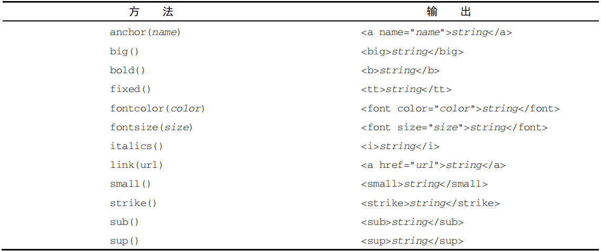

# 字符串

字符串与数组类似，具有长度以及下标。其方法也部分类似。

### 定义字符串

定义字符串有三种方式：字面量声明、`String`类型转换、`new String`包装类。

注释：使用`String()`和`new String()`时，允许传递多个参数，但只转换第一个参数。

##### 字面量

字符串字面量有三种形式：单引号、双引号、反引号。

```js
let str1 = 'name1',
    str2 = "name2",
    str3 = `name3`; // ES6语法
```

##### 类型转换

使用`String()`方法，将参数转换成其字符串形式。

```js
let s1 = String(1); // 将数字型1转换为字符串型"1"
```

##### 构造字符串

使用`new String()`类构造出来的字符串型对象，这种方式也被称为**包装类**。

```js
let oStr = new String(1); // 将参数包装成字符串对象
```

<hr>

### 字符编码

字符串是一段有限的字符序列，字符串中的每一个字符在字符序列表中对应着一个`Unicode`码。

##### 转为字符

使用`fromCharCode()`方法，可以将字符编码（`unicode`码）转换为对应的字符。【从编码表中查找对应的字符】

注释：`fromCharCode`方法是`String`类上的静态方法，不能通过字符串来调用【只能在`String`上调用】

```js
let a = 65;
String.fromCharCode(a); // 'A'

// 使用apply传入数组：不能直接传入数组。
let s = [65, 66, 67];
// 自动遍历数组，将每个元素转换为对应的字符然后拼接成串。
String.fromCharCode.apply(null, s); // 'ABC'
```

##### 转为编码

使用`charCodeAt()`方法，可以将字符转换为其字符编码（`unicode`码）形式。【字符在编码表中的位置】

```js
let a = "a";
a.charCodeAt(); // 97（数字型）
```

<hr>

### 字符串长度

每一个字符串的具有一个长度，通过`length`属性可以访问。【只读属性】

注释：原始值不可更改，因此字符串的`length`属性为只读属性，修改无效。

##### 字节长度

字符串的`length`属性计算的是字符串中有多少个字符，而字符分为单字节和双字节。

```js
// 在原型上封装方法，求取字符串的字节长度
String.prototype.byteLength = function () {
    let b = 0, l = this.length;
    if(l) {
        for(let i = 0; i < l; i++) {
            this.charCodeAt(i) > 255 && b++;
        }
    }
    return l + b;
}

// 判断字符是否为双字节的方法：
/*	第一种：charCodeAt方法：字符编码大于255为双字节
    'a'.charCodeAt() > 255; // 不传参，默认查询第一个字符的字符编码
    str.charCodeAt(i) > 255; // 检查字符串中指定位置上的字符
*/

/*	第二种：escape方法：转义序列大于4为双字节
    escape('a').length > 4; // 查询指定字符的转义序列
    // 检查字符串中指定位置上的字符
    for (let i = 0; i < l; i++) {
    	let c = this.charAt(i); // 取出每个字符
    	if (escape(c).length > 4) {
    		b++;
    	} else if(c === "\r") {
    		b--;
    	}
    }
*/

/*	第三种：正则匹配：/^[\u0000-\u00ff]$/ => 匹配单字节
	!/^[\u0000-\u00ff]$/.test('a'); // 匹配指定字符是否为双字节
	for (let i = 0; i < l; i++) {
		let c = this.charAt(i);
		if(!/^[\u0000-\u00ff]$/.test(c)) {
			b++;
		}
	}
*/
```

<hr>

### 字符串连接

连接两个字符串的方法：加号连接、`concat`连接、数组`join`

##### 加号连接

```js
let str1 = "a",
    str2 = "b",
    str3;
str3 = str1 + str2; // "ab" 方便、效率高
```

##### `concat`

```js
let str1 = "a",
    str2;
str2 = str1.concat("b", "c"); // "abc"
```

##### 数组`join`

注释：在传统浏览器中，使用数组的`join`方法连接超大字符串时，速度很快。现代浏览器优化了加号运算符，连接速度也非常快。

```js
let arr = ["a", "bc"], str;
str = arr.join(""); // "abc" 以空串连接数组中的每个元素，最后连成一串
```

<hr>

### 检索子串

在父字符串中查找一段子字符串的方法：`charAt、charCodeAt、indexOf、lastIndexOf、match、search`。

##### 返回字符

使用`charAt`方法，可以从父字符串中返回指定位置上的一个字符。【返回第`n`个字符】

注释：如果传入的下标超出父字符串的长度`[0，length-1]`，则返回空字符串。

```js
let str = "abc";
str.charAt(0); // "a"
str.charAt(10); // ""
```

##### 返回字符编码

使用`charCodeAt`方法，可以获取父字符串中指定位置上字符的字符编码。【返回第`n`个字符的字符编码】

注释：如果传入的下标超出父字符串的长度，则返回`NaN`。

```js
let str = "abc";
str.charCodeAt(0); // 97
str.charCodeAt(10); // NaN
```

#### 查找子串下标

使用`indexOf`和`lastIndexOf`方法，可以在父字符串中查找一段子字符串，返回找到的第一个子串的下标。没找到返回-1。

两者的区别在于：`indexOf` 方法从字符串开头开始查找子字符串，而 `lastIndexOf` 方法从字符串末尾开始查找子字符串。

参数：查找的目标子串，查找的起始位置

##### 正向查找

第二参数：默认从左开始往右查，负数视为默认值（0），超出返回-1

```js
let str = "abcabc", i = "b";
str.indexOf(); // -1，空参默认返回-1
str.indexOf(i); // 1，默认从左开始
str.indexOf(i, -1); // 1，负数视为默认值：从左开始
str.indexOf(i, 1); // 1，自身位置返回自身
str.indexOf(i, 2); // 4
str.indexOf(i, 10); // -1，超出长度返回-1
```

封装：查找目标子串的所有下标位置

```js
// 使用第二个参数并循环调用indexOf() 或 lastIndexOf()，就可以在字符串中找到所有的目标子字符串。
String.prototype.substrIndex = function (substr) {
	let pos = this.indexOf(substr), // 查找第一个目标子串的下标位置
    	positions = []; // 存储所有子串下标的位置数组
    // 循环找出所有目标子串的下标位置
    while(pos > -1) {
        positions.push(pos);
        pos = this.indexOf(substr, pos+1); // 从当前目标子串下标的下一个位置开始，继续搜索目标子串。
    }
    return positions; // 返回所有目标子串的下标位置信息
}

let str = "hellow world";
str.substrIndex("l"); // [2, 3, 10]
```

##### 反向查找

第二参数：默认从右开始往左查，负数返回-1，超出视为默认值（`length - 1`）

```js
let str = "abcabc", i = "b";
str.lastIndexOf(); // -1，空参默认返回-1
str.lastIndexOf(i); // 4，默认从右开始
str.lastIndexOf(i, -10); // -1，负数返回-1
str.lastIndexOf(i, 1); // 1，自身位置返回自身
str.lastIndexOf(i, 2); // 1，从下标2开始往右查
str.lastIndexOf(i, 10); // 4，超出视为默认值，从右开始
```

#### 搜索子串下标

使用`search`方法，传入一个正则来匹配子串。与`indexOf`功能一样，返回指定子串的首次出现位置。

注释：

- `search`方法只有一个参数，且要求是正则；若不是正则，会调用`RegExp()`方法将参数转为正则。
- `search`方法始终从左往右匹配第一个子串的下标位置，没有找到则返回-1。

```js
let str = "http://www.baidu.com/index.html", i;
i = str.search("//"); // 5，先转换为正则对象
```

#### 匹配返回子串

使用`match`方法，传入一个正则来匹配出所有符合条件的子串，并以数组的形式返回。

`match()` 方法本质上跟 `RegExp` 对象的 `exec()` 方法相同。

接收一个参数，可以是一个模式字符串，也可以是一个 `RegExp` 字面量或者对象。

注释：

- `match`方法通过正则来匹配符合条件的子串，匹配成功始终以数组返回；匹配失败则返回`null`，而不是空数组。
- 当`match`方法执行全局匹配时，数组只包含匹配文本；不执行全局匹配时，数组还会包含匹配文本的相关信息。

```js
let str = "abcabc", s;
s = str.match(/a/); 	// ["a"]，只匹配一次，找第一个
s = str.match(/a/g); 	// ["a", "a"]，全局匹配，找出所有
s = str.match(/d/); 	// null，匹配失败返回null

// 模式字符串
"cat, bat, sat, fat".match(".at"); // ['cat', index: 0, input: 'cat, bat, sat, fat']
```

<hr>

### 字符串截取

`String`类上定义了3个截取字符串的原型方法：`slice、substr、substring`。

##### 截取指定长度

使用`substr`方法，可以从指定的位置开始截取指定长度的子串。

参数：截取开始位置，截取的长度。

注释：

- 当第一个参数为负值，表示反向截取。【原理：`str.length - i`】
- 如果省略第二个参数，会从指定位置截取到末尾，若为负值则转为0。
- `ECMAScript`不再建议使用该方法，推荐使用`slice`和`substring`。

```js
let str = "http://www.baidu.com"
str.substr(3); // "p://www.baidu.com"，从3号下标开始截取
str.substr(-3); // "com"，截取后三位
str.substr(5,2); // "//"
str.substr(-1, 2); // "m"，str.length - 1
str.substr(-7, -1); // ""，[13, 0]

// 获取文件后缀
let str = "my.doc";
str.substr(str.lastIndexOf(".") + 1);
```

#### 截取起止位置

`slice`和`substring`方法，都是根据指定的起止位置来截取子串的。

参数：起始下标，结束下标（省略则截取到末尾）

注释：

- 若第一个参数大于第二个参数：`substring`会自动调换数值；`slice`则无视并返回空串。
- 如参数一正一负：
  - `substring`会将所有负值都视为0，在需要时调换参数正常截取。
  - `slice`会将所有负参数反向截取，加上`length`值后再正常截取。
- 若参数均为负值：`slice`会反向截取；`substring`则无视并返回空串。

```js
let str = "abcabc";

// slice将负值转为正值
str.slice(1, 1); // ""
str.slice(1, 2); // "b"
str.slice(-3, -1); // "ab"，[3, 5)
str.slice(-1, -3); // ""，[5, 3)
str.slice(1, -1); // "bcab"，[1, 5)
str.slice(-1, 6); // "c"，[5, 6) - 将第一个参数加length后，正常截取
str.slice(-4); // "cabc"，[2, length)，截取后四位

// substring将负值均视为：0
str.substring(1, 1); // ""
str.substring(1, 2); // "b"
str.substring(-3, -1); // ""，[0, 0)
str.substring(-3, 1); // "a"，[0, 1) => 相当于：str.substr(0, 1)
str.substring(-1); // "abcabc"，[0, length)
```

<hr>

### 字符串包含

`ECMAScript 6`新增了3个用于判断某字符串中是否包含指定字符串的方法：`startsWith、endsWith、includes`。

注释：调用这些方法从字符串中搜索传入的字符串，并返回一个表示前者是否包含后者的布尔值。

参数：要搜索的字符串，开始搜索的位置。

区别：

- `startsWith`：从指定位置上开始往末尾搜索，判断在指定位置上是否以参数串开头。
- `endsWith`：将第二个参数当作字符串的长度，判断该串是否以参数串结尾。默认是字符串`length`。
- `includes`：在指定位置及后，是否包含参数串。

```js
let str = "foobarbaz";

// startsWith，默认从0开始，并要求以参数串开头
str.startsWith("foo"); // true
str.startsWith("oob"); // false
str.startsWith("bar", 3); // true
str.startsWith("bar", 4); // false

// endsWith，默认长度length，并要求以参数串结尾
str.endsWith("baz"); // true
str.endsWith("rba"); // false
str.endsWith("bar", 6); // true
str.endsWith("bar", 5); // false

// includes，默认从0开始，无任何额外要求
str.includes("oba"); // true
str.includes("foo"); // true
str.includes("baz"); // true
str.includes("obar", 2); // true
str.includes("obar", 1); // true
str.inculdes("obar", 3); // false
```

<hr>

### 字符串替换

为简化子字符串替换操作，`ECMAScript` 提供了 `replace()` 方法。

参数：

- 一：可替换部分，字符串或正则
- 二：替换的内容，字符串或函数

注释：

- 如果第一个参数是字符串，那么只会替换第一个符合要求的子字符串。
- 要想替换所有子字符串，第一个参数必须为正则表达式并且带全局标记。

```js
let str = "bat, cat, fat, sat";

// 只替换第一个子串
str.replace("at", "ond"); // "bond, cat, fat, sat"

// 替换所有的子串
str.replace(/at/g, "ond"); // "bond, cond, fond, sond"
```

第二个参数是字符串的情况下，有几个特殊的字符序列，可以用来插入第一个参数正则表达式匹配后的结果。

特殊字符序列：

- `"$$"`：`"$"` 【在正则中，`$` 具有特殊含义，因此要使用`$`自身需要两个`$$`】
- `"$&"`：获取 `RegExp.lastMatch` 的值
- `"$'"`：获取 `RegExp.rightContext` 的值
- "$\`"：获取 `RegExp.leftContext` 的值
- `"$n"`：获取第 *n* 个捕获组的匹配结果，其中 *n* 是 1~9。默认值为空字符串。
- `"$nn"`：获取第 *`nn`* 个捕获组字符串，其中 *`nn`* 是 01~99。

```js
// 使用特殊字符序列，从第一个参数（正则表达式）的匹配结果中获取部分信息。
"cat, bat, sat, fat".replace(/(.at)/g, "word($1)"); // 'word(cat), word(bat), word(sat), word(fat)'
```

如果想要更细致地控制替换过程，第二个参数可以传入一个函数，通过其返回值决定替换的内容。

参数：

- 第一个形参：模式匹配的字符串片段
- 中间的形参：如果有捕获组的话，各个捕获组的结果依次将作为实参自动传入。
- 倒数第二个：匹配片段在字符串中的开始位置
- 倒数第一个：原始字符串

```js
let str = "cat, bat, sat, fat";
str.replace(/(.)at(.)/g, function (lastMatch, $1, $2, index, input) {
    console.log(lastMatch); // "cat,", "bat,", "sat,"
    console.log($1); 		// "c", "b", "s"
    console.log($2); 		// ",", ",", ","
    console.log(index); 	// 0, 5, 10
    console.log(input); 	// "cat, bat, sat, fat", "cat, bat, sat, fat", "cat, bat, sat, fat"
})

// 封装一个可以将一段HTML中4个字符替换为对应实体的方法
function htmlEscape (text) {
    return text.replace(/[<>"&]/g, function (lastMatch, index, input) {
        switch (lastMatch) {
            case "<":
                return "&lt;";
            case ">":
                return "&gt;";
            case "\"":
                return "&quot;";
            case "&":
                return "&amp;";
        }
    });
}
htmlEscape("<p class=\"text\">Hello World!</p>"); 
// '&lt;p class=&quot;text&quot;&gt;Hello World!&lt;/p&gt;'
```

<hr>

### 字符串切分

`split` 方法用于将字符串按照传入的分隔符拆分为数组。

参数：

- 一：分隔符，可以是字符串，也可以是使用正则匹配到的片段。
- 二：数组长度，指定返回数组的大小。

```js
let str = "red,yellow,bule";

// 使用指定的字符串切割
str.split(","); 	// ['red', 'yellow', 'bule']
str.split(",", 2); 	// ['red', 'yellow']

// 使用正则匹配的片段切割
str.split(/,/); 	// ['red', 'yellow', 'bule']
```

<hr>

### 其他操作方法

字符串的其他操作方法，包括：去除首尾空格、字符串重复、字符串填充、字符串迭代与解构、大小写转换、字符串比较和`HTML`方法。

##### 去除首尾空格

`ECMAScript` 在所有字符串上都提供了 `trim()` 方法。它会创建字符串的一个副本，删除前、后所有空格符，再返回结果。

另外，`trimLeft()` 和 `trimRight()` 方法分别用于从字符串开始和末尾清理空格符。

```js
// 清除首尾空格
let str = "  hello world  ";
str.trim(); // "hello world"

// 清除首部空格
str.trimLeft(); // "hello world  "

// 清除尾部空格
str.trimRight(); // "  hello world"
```

##### 字符串重复

`ECMAScript` 在所有字符串上都提供了 `repeat()` 方法。它接收一个整数参数，表示要将字符串复制多少次，然后返回拼接后的结果。

```js
let str = "a"
str.repeat(5); // "aaaaa"
```

##### 字符串填充

`padStart()` 和 `padEnd()` 方法，用于在字符串的首部或尾部填充指定的字符串，以满足长度要求。

参数：要求的长度，填充字符串（默认空格）

- 如果长度小于或等于字符串原长度，则会返回原始字符串。
- 填充字符串会被直接拼接并在必要时截断以匹配指定长度。

```js
let str = "foo";

// 在首部填充
str.padStart(8, "bar"); // "barbafoo"

// 在尾部填充
str.padEnd(8, "bar"); 	// "foobarba"
```

##### 字符串迭代与解构

字符串的原型上暴露了一个 `@@iterator` 方法，使字符串可以像数组一样迭代其中的每个字符。

```js
// 手动调用迭代器
let str = "abc",
    strIterator = str[Symbol.iterator](); // 获取一个实现迭代器 API 的对象

// 调用对象上的next方法，以迭代每个字符。
strIterator.next(); // {value: 'a', done: false}
strIterator.next(); // {value: 'b', done: false}
strIterator.next(); // {value: 'c', done: false}
strIterator.next(); // {value: undefined, done: true}

// 在 for-of 循环中可以通过这个迭代器按序访问每个字符
for(const char of "abcde") {
    console.log(char); // "a", "b", "c", "d", "e"
}

// 字符串也能像数组一样，通过解构操作符来解构字符
[..."abcde"]; // ["a", "b", "c", "d", "e"]
```

##### 字符串大小写转换

涉及大小写转换的，一共有 4 个方法：`toLowerCase()`、`toLocaleLowerCase()`、`toUpperCase()` 和 `toLocaleUpperCase()`。

注释：

- `toLowerCase()` 和 `toUpperCase()` 方法是原来就有的方法
- `toLocaleLowerCase()` 和 `toLocaleUpperCase()` 方法基于特定地区实现。
- 在很多地区，地区特定的方法与通用的方法是一样的。
- 但在少数语言中（如土耳其语），`Unicode` 大小写转换需应用特殊规则，要使用地区特定的方法才能实现正确转换。
- 通常，如果不知道代码涉及什么语言，则**最好使用地区特定的转换方法**。

```js
let str = "Hello World";

// 转为全大写
str.toLocaleUpperCase(); 	// 'HELLO WORLD'
str.toUpperCase(); 			// 'HELLO WORLD'

// 转为全小写
str.toLocaleLowerCase(); 	// 'hello world'
str.toLowerCase(); 			// 'hello world'
```

##### 字符串的比较方法

`localeCompare()` 方法用于比较两个字符串，并返回一个数值。

规则：以参数串为原点0，字符串在其前面返回负数，相等返回0，在其后面返回正数。

```js
// 引用串小于参数串，返回负数
"a".localeCompare("b"); // -1

// 引用串等于参数串，返回0
"a".localeCompare("a"); // 0

// 引用串大于参数串，返回正数
"b".localeCompare("a"); // 1
```

`localeCompare()` 的独特之处在于，实现所在的地区（国家和语言）决定了这个方法如何比较字符串。

参数：

- 一：用来比较的字符串
- 二：指定地区，一个符合 `BCP 47` 标准的字符串或一个字符串数组。
- 三：配置对象，支持的属性如下：
  - `localeMatcher`：指定地域匹配算法。可能的值是 `"lookup"` 和 `"best fit"`；默认是 `"best fit"`。
  - `usage`：指定比较的目标是排序还是搜索。可能的值是 `"sort"` 和 `"search"`；默认是 `"sort"`.
  - `sensitivity`：指定排序程序的敏感度，可能的值有：
    - `"base"`：只有不同的字母字符串比较是不相等的。举个例子：`a ≠ b`, `a = á`, `a = A`.
    - `"accent"`：只有不同的字母或读音比较是不相等的。举个例子：`a ≠ b`, `a ≠ á`, `a = A`.
    - `"case"`：只有不同的字母或大小写比较是不相等的。举个例子：`a ≠ b`, `a = á`, `a ≠ A`.
    - `"variant"`：以上都是不相等的，还有其它的差异可能也会考虑到。举个例子: `a ≠ b`, `a ≠ á`, `a ≠ A`.
    - 当 `usage` 为 `"sort"` 时，`sensitivity` 默认为 `"variant"`；而 `"search"` 依赖于地区。
  - `ignorePunctuation`：指定是否忽略标点。可能的值是 `true` 和 `false`; 默认为 `false`.
  - `numeric`：是否指定使用数字排序，像这样 "1" < "2" < "10"。可能的值是 `true` 和 `false`；默认为 `false`。
  - `caseFirst`：指定大小写有限排序。可能的值有 `"upper"`、`"lower"` 或 `"false"`；默认为 `false`。

```js
// 检查浏览器是否支持扩展参数：不支持的浏览器会忽略扩展参数。
function localeCompareSupportsLocales() {
    try {
        'foo'.localeCompare('bar', 'i'); // 提供一个错误的地域参数
    } catch (e) {
        return e.name === 'RangeError'; // 如果发生RangeError错误，说明支持。
    }
    return false;
}

// 使用locales参数，不同的语言比较的结果不同
'ä'.localeCompare('z', 'de'); // 负数，在德语中，ä 在 z 之前
'ä'.localeCompare('z', 'sv'); // 正数，在瑞典语中，ä 在 z 之后

// 使用配置对象
'ä'.localeCompare('a', 'de', { sensitivity: 'base' }); // 0，在德语中，ä 和 a 是同类字母。
'ä'.localeCompare('a', 'sv', { sensitivity: 'base' }); // 1，在瑞典语中，ä 和 a 是单独的字母。

// 数值排序
// 默认地，"2" > "10"
"2".localeCompare("10"); // 1
// 使用数值排序："2" < "10"
"2".localeCompare("10", undefined, { numeric: true }); 	// -1
// 使用扩展关键字
"2".localeCompare("10", "en-u-kn-true"); 				// -1

// 扩展关键字：（*"language-*region*-u-kn-true|false"）
/* 	kn：指定数值排序是否应该被使用，可能的值是 "true" 和 "false"。这个选项能被通过options 属性设置或通过 Unicode 扩展。
		假如两个都被设置了，则 options 优先。（*"language-*region*-u-kn-true|false"）
	kf：指定是否优先对大写字母或小写字母排序。可能的值有 "upper", "lower", 或 "false" (use the locale's default)。
		这个选项能被通过 options 属性设置或通过 Unicode 扩展。假如两个都被设置了，则 options 优先。*/
```

性能：当比较大量字符串时，最好创建一个 `Intl.Collator` 对象并使用其 `compare` 属性所提供的函数。

更多参考：https://developer.mozilla.org/zh-CN/docs/Web/JavaScript/Reference/Global_Objects/String/localeCompare

##### `HTML`方法

早期的浏览器开发商认为使用 `JavaScript` 动态生成 `HTML` 标签是一个需求。

因此，早期浏览器扩展了规范，增加了辅助生成 `HTML` 标签的方法。

下表总结了这些 `HTML` 方法。不过，这些方法基本上已经没有人使用了，因为结果通常不是语义化的标签。

 

```js
// 生成一个<big>标签
"".big(); 			// '<big></big>'

// 添加一点内容
"text".big(); 		// '<big>text</big>'
```

