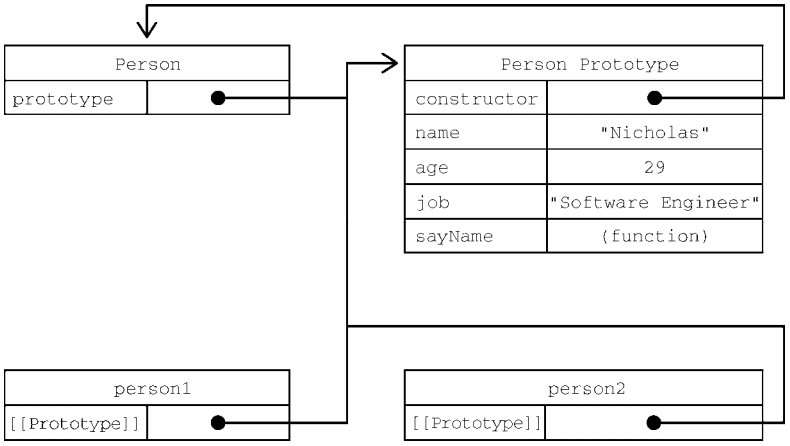
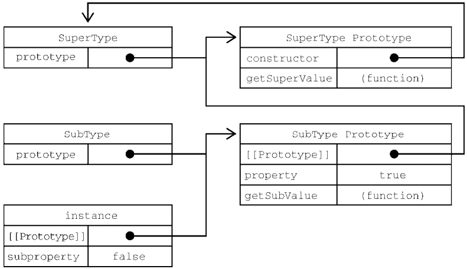
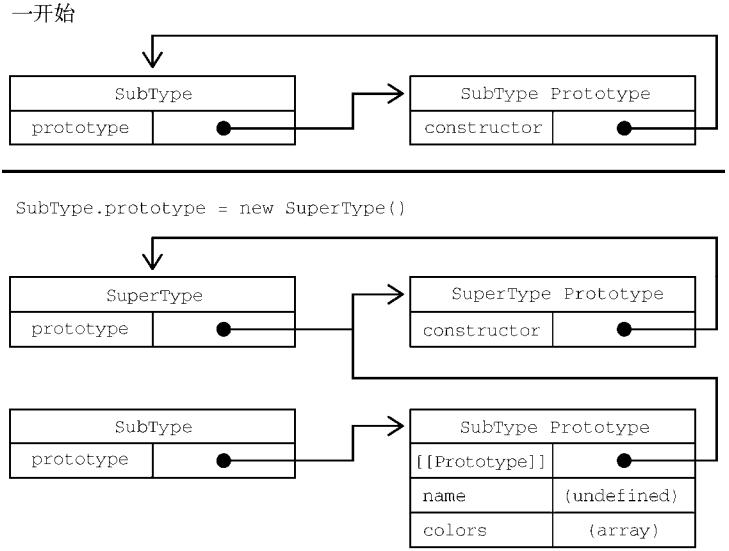
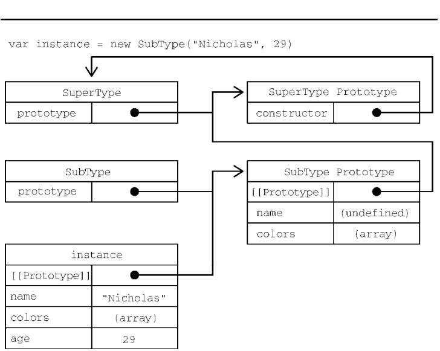

# 面向对象

## 对象

​		`ECMA-262` 将对象定义为一组属性的无序集合。严格来说，这意味着对象就是一组没有特定顺序的值。对象的每个属性或方法都由一个名称来标识，这个名称映射到一个值。正因为如此（以及其他还未讨论的原因），可以把 `ECMAScript` 的对象想象成一张散列表，其中的内容就是一组名值对，值可以是数据或者函数。

​		`Object` 类型表示 `JavaScript` 的一种数据类型。它用于存储各种键值集合和更复杂的实体。对象可以使用 `Object()` 构造函数、`Object.create()` 或对象初始化器（字面量语法）创建。


### 描述

​		`JavaScript`中几乎所有的对象都是`Object` 的实例；典型的对象从 `Object.prototype` 上继承属性和方法，尽管这些属性和方法可能被遮蔽（即：重写）。然而，一个 `Object` 可以被故意创建为不符合此条件的对象（例如通过 `Object.create(null)`），或者改动它使其不再符合此条件（例如使用`Object. setPrototypeOf`）。

​		通过原型链，所有对象都可以看到对 `Object` 原型对象的修改，除非受这些更改影响的属性和方法在原型链的后面被重写。这提供了一种非常强大的机制来覆盖或扩展对象行为，尽管这种机制存在潜在的危险。

`Object` 构造函数的行为取决于输入的类型：

- 如果值为 `null` 或 `undefined`，它将创建并返回一个空对象。
- 如果该值已经是一个对象，它将返回该值。
- 否则，它将返回一个对应于给定值类型的对象。如：传入字符串，返回字符串型对象。

当在非构造函数上下文中调用 `Object` 时，其行为与 `new Object()` 完全相同。

`Object` 本身没有任何方法来删除它自己的属性（例如：`Map.prototype.delete()`）。为此，必须使用 `delete` 操作符。

<hr>

### 创建对象

​		创建自定义对象的通常方式是创建 `Object` 的一个新实例，然后再给它添加属性和方法。早期 `JavaScript` 开发者频繁使用这种方式创建新对象。几年后，对象字面量（对象初始化）变成了更加流行的方式。无论是哪一种方式，它们的本质都是一样的，都是通过调用 `create` 方法来创建的 ？

<hr>

### 属性类型

`Object` 的属性都有自己的特征，而这些特征决定了它们在 `JavaScript` 中的行为。

`ECMA-262` 使用一些内部特性来描述属性的特征。这些特性是由实现 `JavaScript` 引擎的规范定义的。因此，开发者不能在 `JavaScript` 中直接访问这些特性。为了将某个特性标识为内部特性，规范会用双中括号把特性的名称括起来，比如`[[Enumerable]]`。

属性分为两种：数据属性和访问器属性。


##### 数据属性

数据属性包含一个保存数据值的位置。读写属性的值发生在这个位置上。数据属性有 4 个特性描述它们的行为：

- `[[Configurable]]`：表示该属性是否可配置，例如：是否可以通过 `delete` 操作符删除并重新定义，是否可以修改它的其他特性，以及是否可以把它改为访问器属性。默认情况下，所有直接定义在对象上的属性的这个特性都是 `true` 。
- `[[Enumerable]]`：表示该属性是否可以通过 `for-in` 循环被枚举，默认的，所有直接定义在对象上的属性的这个特性都是 `true` 。
- `[[Writable]]`：表示该属性的值是否可以被修改，默认情况下，所有直接定义在对象上的属性的这个特性都是 `true` 。
- `[[Value]]`：映射到该数据属性的实际值，它就是读写属性值的位置，这个特性的默认值为 `undefined`。

将属性显式地添加到对象之后，这些属性的特性会发生如下变化：`[[Configurable]]`、`[[Enumerable]]` 和 `[[Writable]]` 特性都会被设置为 `true`，而 `[[Value]]` 特性会被设置为指定的值。

```js
// 显示地添加属性，包括：对象初始化、后续添加属性等。
let obj = {
    name: "wanzi"
}
obj.age = 18;
```

​		**可以使用 `Object.defineProperty()` 方法，来修改某条属性的默认特性**。这个方法接收 3 个参数：指定对象、指定属性以及一个配置对象（描述符对象）。配置对象上包含 4 个属性：`configurable`、`enumerable`、`writable` 和 `value`，与相关特性的名称一一对应。可以根据需要，同时配置其中的一个或多个属性。

​		**在调用 `Object.defineProperty()` 时，如果不指定 `configurable`、`enumerable` 和 `writable` 的值，则都默认为 `false`。**

```js
let person = {}; 

// 设置person对象name属性：值为"wanzi"，且不可修改【只读属性】
Object.defineProperty(person, "name", { 
 	writable: false, 
 	value: "wanzi" 
});

// 在非严格模式下尝试给这个属性重新赋值会被忽略。在严格模式下，尝试修改只读属性的值会抛出错误。
person.name; 			// "wanzi" 
person.name = "Greg";   // 尝试修改name的值
person.name; 			// "wanzi"

// 设置属性不可配置（该属性不可删除）
let person = {};

Object.defineProperty(person, "name", { 
 	configurable: false, 
 	value: "Nicholas" 
}); 

// 非严格模式下对这个属性调用delete没有效果，严格模式下会抛出错误。
delete person.name; // 尝试删除该属性
person.name; 		// "Nicholas"
```

​		此外，**属性一旦被定义为不可配置之后，就不能再变回可配置的了**。并且再次调用 `Object.defineProperty()` 修改任何特性都将会导致错误：

```js
let person = {}; 

// 设置属性不可配置
Object.defineProperty(person, "name", { 
 	configurable: false, 
 	value: "wanzi" 
}); 

// 尝试恢复可配置
Object.defineProperty(person, "name", { 
 	configurable: true
});
// Uncaught TypeError: Cannot redefine property: name at Function.defineProperty【不能重新定义name属性】

// 尝试修改任何特性，都将报出如上错误（将布尔特性设为false不会报错，但这实际上是很不必要的，因为这本来就是默认的行为）
Object.defineProperty(person, "name", { 
 	value: "wanzi" 
});
Object.defineProperty(person, "name", { 
 	writeable: true
});
Object.defineProperty(person, "name", { 
 	enumerable: true
});
```


##### 访问器属性

​		访问器属性不包含数据值。相反，它们包含一个获取（`getter`）函数和一个设置（`setter`）函数，不过这两个函数不是必需的。在读取访问器属性时，会调用获取函数，这个函数的责任就是返回一个有效的值。在写入访问器属性时，会调用设置函数并传入新值，这个函数用于决定对数据做出什么修改。访问器属性有 4 个特性描述它们的行为。

- `[[Configurable]]`：表示该属性是否可配置，即：是否可以通过 `delete` 删除并重新定义，是否可以修改它的特性，以及是否可以把它改为数据属性。默认情况下，所有直接定义在对象上的属性的这个特性都是 `true`。
- `[[Enumerable]]`：表示该属性是否可以通过 `for-in` 循环被枚举，默认的，所有直接定义在对象上的属性的这个特性都是 `true`。
- `[[Get]]`：获取函数，在读取属性时调用。默认值为 `undefined`。
- `[[Set]]`：设置函数，在写入属性时调用。默认值为 `undefined`。

访问器属性是不能直接定义的，必须使用 `Object.defineProperty()`。

```js
// 创建一个关于书籍的信息对象
let book = {
    _year: 2022, // 书籍年份（带下划线，表示它是一个伪私有成员，不希望被外部访问到）
    edition: 1   // 书籍版本（公共成员）
};

// 添加一个名为year的访问器属性
Object.defineProperty(book, "year", {
    get() {
        return this._year;
    },
    set(newValue) {
        if (newValue > 2022) {
            this._year = newValue; // 禁止在setter内修改本属性的值，会因为重复触发修改而导致死循环。
            this.edition += newValue - 2022;
        }
    }
});

book.year = 2023;
book.edition; // 2
```

​		获取函数和设置函数不一定都要定义。**只定义获取函数意味着属性是只读的**，尝试修改属性会被忽略。在严格模式下，尝试写入只定义了获取函数的属性会抛出错误。类似地，**只有一个设置函数的属性是不能读取的**，非严格模式下读取会返回 `undefined`，严格模式下会抛出错误。

​		另外，在不支持 `Object.defineProperty()` 的浏览器中没有办法修改 `[[Configurable]]` 或 `[[Enumerable]]`。

​		注意，在 `ES5` 以前，开发者会使用两个非标准的访问创建访问器属性：`__defineGetter__() `和 `__defineSetter__()`。这两个方法最早是 `Firefox` 引入的，后来 `Safari`、`Chrome` 和 `Opera` 也实现了。不过，现在它们已经被删除了。

<hr>

### 属性特性

##### 配置多个特性

使用 `Object.defineProperty()` 方法，一次只能配置一个属性的特性。

当需要同时配置多个属性时，可使用 `Object.defineProperties()` 方法。它接收两个参数：

- 指定对象
- 配置对象，该配置对象中可以包含多个描述对象，每个描述对象作为值配置其属性。

```js
let book = {};

Object.defineProperties(book, {
    _year: {
        value: 2022
    },
    edition: {
        value: 1
    },
    year: {
        get () {
            return this._year;
        },
        set (newValue) {
            if(newValue > 2022) {
                this._year = newValue;
                this.edition += newValue - 2022;
            }
        }
    }
});
```

​		这段代码在 `book` 对象上定义了两个数据属性 `_year` 和 `edition`，以及一个访问器属性 `year`。最终的对象与访问器属性示例中的一样。唯一的区别是所有属性都是同时定义的，并且数据属性的 `configurable`、`enumerable` 和 `writable` 特性值都是 `false`。


##### 读取单个特性

使用 `Object.getOwnPropertyDescriptor()` 方法可以取得指定属性的描述符对象。

这个方法接收两个参数：指定对象和属性名。返回属性对应的描述符对象。

```js
let book = {};

Object.defineProperties(book, {
    _year: {
        value: 2022
    },
    edition: {
        value: 1
    },
    year: {
        get() {
            return this._year;
        },
        set(newValue) {
            if (newValue > 2022) {
                this._year = newValue;
                this.edition += newValue - 2022;
            }
        }
    }
});

// 数据属性
let descriptor = Object.getOwnPropertyDescriptor(book, "_year");
descriptor; // {value: 2022, writable: false, enumerable: false, configurable: false}

// 访问器属性
descriptor = Object.getOwnPropertyDescriptor(book, "year");
descriptor; // {enumerable: false, configurable: false, get: f, set: f}
```


##### 读取多个特性

​		`ES8` 新增了 `Object.getOwnPropertyDescriptors()` 静态方法，它只接受一个参数，即：指定的对象。该方法会对指定对象中的每个自由属性都调用 `Object.getOwnPropertyDescriptor()` 方法，并在一个新对象中返回对应的描述符对象。

```js
// 读取指定对象中所有自有属性的特性
let book = {};

Object.defineProperties(book, {
    _year: {
        value: 2022
    },
    edition: {
        value: 1
    },
    year: {
        get() {
            return this._year;
        },
        set(newValue) {
            if (newValue > 2022) {
                this._year = newValue;
                this.edition += newValue - 2022;
            }
        }
    }
});

let descriptors = Object.getOwnPropertyDescriptors(book);
descriptors; // 结果如下：
{
    _year: {
        value: 2022,
        writable: false,
        enumerable: false,
        configurable: false
    },
    edition: {
        value: 1,
        writable: false,
        enumerable: false,
        configurable: false
    },
    year: {
        enumerable: false,
        configurable: false,
        get: f,
        set: f
    }
}
```

<hr>

### 合并对象

​		`JavaScript` 开发者经常觉得“合并”（`merge`）两个对象非常有用。具体地说，就是把源对象所有的本地属性一起复制到目标对象上。有时候这种操作也被称为“混入”（`mixin`），因为混入源对象的属性，使目标对象得到了增强。

​		`ES6` 专门为合并对象提供了 `Object.assign()` 方法，这个方法接收一个目标对象以及一个或多个源对象作为参数。它将各源对象中所有可枚举的（使 `Object.propertyIsEnumerable()` 返回 `true` 的属性）自有属性（使 `Object.hasOwnProperty()` 返回 `true` 的属性）复制到目标对象中。以字符串和符号属性都会被复制。对每个符合条件的属性，这个方法会使用源对象上的 `[[Get]] ` 取得属性的值，然后使用目标对象上的 `[[Set]]` 设置属性的值。

​		`Object. assign()` 方法**只将可枚举的自有属性从源对象复制到目标对象**。它调用源对象上的 `[[Get]]`，调用目标对象上的 `[[Set]]`，所以它会调用 `getter` 和 `setter`。正因此，它分配属性，而不仅仅是复制或定义新属性。如果合并来源中包含 `getter`，这可能使它不适合将新属性合并到目标中。（关于 `getter` 与 `setter` 的详细使用，请参考：[`getter`](https://developer.mozilla.org/en-US/docs/Web/JavaScript/Reference/Functions/get) ）

​		要将属性的特性复制到目标中，请使用 `Object.getOwnPropertyDescriptor()` 和 `Object.defineProperty()` 来代替。如果复制期间出现错误，例如属性不可写，则会引发 `TypeError`，如果在错误引发之前添加了任何属性，则仍然会更新目标对象。

​		`Object.assign()` 没有“回滚”之前赋值的概念，因此它是一个尽力而为、可能只会完成部分复制的方法。

```js
// 复制属性的特性
let dest = {},
    src = {};

Object.defineProperty(src, "a", {
    value: "aValue"
})

Object.assign(dest, {a: Object.getOwnPropertyDescriptor(src, "a")});
// {a: {configurable: false, enumerable: fale, writable: false, value: "aValue"}}

// 复制中断，保留已完成的修改
let dest = {},
   	src = {
    	a: "foo",
        get b() {
            throw new Error(); // 当获取b属性值时，抛出一个错误
        },
        c: "bar"
	};

// 调试错误
try {
    Object.assign(dest, src);
} catch(e) {}

// Object.assign()没办法回滚已经完成的修改，因此在抛出错误之前，目标对象上已经完成的修改会得到保留：
dest; // {a: "foo"}
```

​		`Object.assign()` 不会在源对象为 `null` 或 `undefined` 时，抛出错误。

​		`Object.assign()` 实际上对每个源对象执行的是浅复制。如果多个源对象都有相同的属性，则后来者会覆盖前者，并且可以通过目标对象上的设置函数观察到覆盖的过程。此外，从源对象访问器属性取得的值，比如获取函数，会作为一个静态值赋给目标对象。换句话说，不能在两个对象间转移获取函数和设置函数。

```js
let dest, src, result;

dest = {};

function Src(src) {
    this.src = src; // 可枚举的自有属性
}

Src.prototype.a = "a"; // 可枚举的原型属性（Src.prototype.propertyIsEnumerable("a") === true）

src = new Src("www.baidu.com");

Object.defineProperty(src, "id", {
    enumerable: false, // 不可枚举的自有属性
	value: "src"    
})

// 只复制了可枚举的自有属性。
result = Object.assign(dest, src); // {src: 'www.baidu.com'}
// 返回修改后的目标对象
dest === result; // true

// 同时合并多个源对象
Object.assign({}, {a: "foo"}, {b: "bar"}); // {a: "foo", b: "bar"}
------------------------------------------------------------------------------------------------------------

dest = { 
 	set a(val) { 
 		console.log(`调用dest的set方法，并传入参数：${val}`); 
        this.b = val; // 切记不可在此设置a的值，否则进入死循环。
 	} 
};

src = { 
 	get a() { 
 		console.log('调用src的get方法'); 
 		return 'foo'; 
 	} 
}; 

Object.assign(dest, src);
// 调用src的get方法
// 调用dest的set方法，并传入参数：foo
// {b: 'foo', set a: f a(val)}

// 只转移a的静态值，不会转移a的获取函数。
src; 
// {a: "foo", get a: f a()}
// 调用src的get方法
```

<hr>

### 相等判定

​		针对全等运算符的一些失误性判断，例如：`NaN !== NaN`、`+0 === -0`、`-0 === 0` 等。`ES6` 新增了 `Object.is()` 方法，它判断两个参数是否相同，使用 `SameValueZero` 算法。例如：它认为 `NaN` 与 `NaN` 相同、+0 与 0 相同，而与 -0 不同。

```js
// 全等运算符：认为NaN不等于NaN，却认为 +0、-0 与 0 三者相等。
NaN === NaN; 	// false
+0 === -0; 		// true
+0 === 0; 		// true
-0 === 0; 		// true

// 使用Object.is()方法，来判断它们的相同性。
Object.is(NaN, NaN); 	// true
Object.is(+0, -0); 		// false
Object.is(+0, 0); 		// true
Object.is(-0, 0); 		// false

// 连续地检查多个值的相同性，有任何一个不同都返回false
function recursivelyCheckEqual(x, ...rest) {
    // 检查1、2是否相同，再检查2、3是否相同，依次类推。
 	return Object.is(x, rest[0]) && (rest.length < 2 || recursivelyCheckEqual(...rest)); 
}
```

<hr>

### 增强语法

​		`ECMAScript 6` 为定义和操作对象新增了很多极其有用的语法糖特性。这些特性都没有改变现有引擎的行为，但极大地提升了处理对象的方便程度。所有对象的增强语法同样适用于 `ECMAScript 6` 的类。


##### 简写属性名

​		当使用变量作为对象的添加属性时，常常会出现属性名与变量名相同的情况。为此，简写属性名的语法出现了，它允许直接在对象中插入变量，随后变量名会被识别为键名，其变量值会被作为相应键的值。如果没有找到同名变量，则会抛出 `ReferenceError`。

```js
let name = "wanzi";

// 旧语法
let person = {
    name: name
}

// 简写语法（与上面完全等效，简写属性名只是一种语法糖形式）
let person = {
    name
}

// 代码在编译器中会被尽可能地压缩，但代码压缩程序会在不同的作用域中保留属性名，以防止找不到引用。
function makePerson(name) { 
 	return { 
 		name 
 	}; 
}
// 该函数中的代码被压缩后（一般是参数与变量名），最终的代码可能如下：
function makePerson(a) { 
 	return { 
 		name: a // 为了还能够找到name属性，压缩后的代码会保持属性名不变。
 	}; 
}
```


##### 可计算属性

​		对象字面量语法还支持计算属性名。这允许您将表达式放在中括号`[]`中，该表达式的计算结果将被用作属性名。因为被当作 `JS` 表达式求值，所以可计算属性本身可以是复杂的表达式，在实例化时再求值。**可计算属性表达式中抛出任何错误都会导致对象创建失败**。如果计算属性的表达式有副作用，那就要小心了，因为如果表达式抛出错误，那么之前完成的计算是不能回滚的。

```js
// Computed property names
let i = 0;
const a = {
  	[`foo${++i}`]: i,
  	[`foo${++i}`]: i,
  	[`foo${++i}`]: i,
};

a; // {foo1: 1, foo2: 2, foo3: 3}

// 使用既有变量
const items = ["A", "B", "C"];
const obj = {
  	[items]: "Hello",
};

obj; // {A,B,C: "Hello"}
obj["A,B,C"]; // "Hello"

// 属性名拼接处理
const param = 'size';
const config = {
  	[param]: 12,
  	[`mobile${param.charAt(0).toUpperCase()}${param.slice(1)}`]: param.length,
};

config; // {size: 12, mobileSize: 4}
```


##### 简写方法名

​		在给对象定义方法时，通常都要写一个方法名、冒号，然后再引用一个匿名的函数。新的简写语法省略了冒号和`function`关键字。

```js
// 旧语法
let person = {
    name: "wanzi",
    sayName: function () {
        console.log(this.name);
    }
}

// 简写语法
let person = {
    name: "wanzi",
    sayName() {
        console.log(this.name);
    }
}

// 简写方法名对获取函数和设置函数也是适用的：
let person = {
    _name: "",
    get name() {
        return this._name;
    },
    set name(newValue) {
        this._name = newValue;
    },
    sayName() {
        console.log(this._name);
    }
}
person.name = "wanzi";
person; 
// {_name: "wanzi", name: "wanzi", sayName: f sayName(), get name: f name(), set name: f name(newValue)}

// 此外，简写方法名还可以与计算属性名相互兼容
const sayName_key = "sayName";

let person = {
    [sayName_key](name) {
        console.log(name);
    }
}

person.sayName("wanzi"); // "wanzi"
```

<hr>

### 对象解构

​		`ECMAScript 6` 新增了对象解构语法，可以在一条语句中使用嵌套数据实现一个或多个赋值操作。简单地说，对象解构就是使用与对象匹配的结构来实现对象属性赋值（即：取得指定属性的值）。

```js
let person = {
    name: "wanzi",
    age: 18
}
// 旧语法（取出指定层次中指定属性的值）
let personName = person.name,
    personAge = person.age;

// 解构语法（与上面是等效的）
let {name: personName, age: personAge} = person; // personName === "wanzi", personAge === 18;

// 如果想让变量直接使用属性的名称，可以使用简写语法。
let {name, age} = person; // name === "wanzi", age === 18;

// 解构赋值不一定与对象的属性匹配。赋值的时候可以只引用需要的属性，而如果引用的属性不存在，则该变量的值就是undefined
let { name, job } = person; // name === "wanzi", job === undefined;

// 不过，可以在解构赋值时，为可能不存在的属性定义一个默认值（这意味着，如果对象中存在该属性，则使用对象中的属性值）。
let {name, job = "Software engineer"} = person; // name === "wanzi", job === "Software engineer";
// 当为存在的属性重命名时，为防止取得无意义的值，也可以设置一个默认值。
let {name: personName = "cheery"} = person; // personName === "wanzi"; 因为在对象中该属性的值是有意义的
```

更多参考：[解构赋值运算](https://developer.mozilla.org/zh-CN/docs/Web/JavaScript/Reference/Operators/Destructuring_assignment)

​		解构运算在内部使用 `ToObject()` 方法（该方法不能直接访问）把源数据结构转换为对象。这意味着在对象解构的上下文中，原始值会被包装成对象来解构。不过，根据 `ToObject()` 的定义，`null` 和 `undefined` 不能被解构，否则会抛出错误。

```js
// 解构原始值（首先被包装类，然后从包装类中解构出存在的属性）
let {length} = "foobar"; // length === 6;

let {constructor: c} = 4; // c === Number;

let {_} = null; // TypeError: Cannot destructure property '_' of 'null' as it is null.
```

​		以上的解构方式属于声明式解构赋值，即：在解构赋值时声明了相应的变量。而如果是给已存在的变量解构赋值，可以采取无声明式解构赋值，但必须将解构赋值表达式包裹在小括号中，以免引起纠纷。

```js
let a, b;

// 使用小括号，将解构赋值表达式与外界隔离开，避免纠纷
({a, b} = {a: 1, b: 2}); // a === 1, b === 2;
```

另外，通过使用扩展运算符也可以实现对对象的解构，这样的解构更像是一次浅克隆。

```js
let obj = {
    a: 1,
    b: {
        c: 2,
        d: {
            e: 3
        }
    }
};

// 浅克隆
let copy = {...obj};

copy === obj; // false
copy.d === copy.d; // true
```


##### 嵌套解构

解构对于引用嵌套的属性或赋值目标没有限制。为此，可以通过解构来复制对象属性：

```js
let person = {
    name: "wanzi",
    age: 18,
    job: {
        title: "teacher"
    }
};

let personCopy = {};

// 复制对象属性：从person对象中取出指定的属性，然后将它们添加到personCopy对象中并取同名。
({
    name: personCopy.name,
    age: personCopy.age,
    job: personCopy.job
} = person);

personCopy; // {name: "wanzi", age: 18, job: {title: "teacher"}};
```

解构赋值可以使用嵌套结构，以匹配嵌套的属性：

```js
let person = {
    name: "wanzi",
    age: 18,
    job: {
        title: "teacher"
    }
};

// 声明title变量，并将person.job.title的值赋给它。
let {job: {title}} = person;
title; // "teacher"
```

在外层属性还没有定义的情况下，不能使用解构赋值（即：**不能跨级解构**），否则会抛出 `TypeError`，无论是源对象还是目标对象。

```js
let person = {
    job: {
        title: "teacher"
    }
},
    personCopy = {};

// 尝试在源对象上解构尚未定义的foo属性。
({
    foo: {
        bar: personCopy.bar
    }
} = person); // Uncaught TypeError: Cannot read properties of undefined (reading 'bar')

// 尝试在目标对象上给尚未定义的job属性添加title属性
({
    job: {
        title: personCopy.job.title
    }
} = person); // VM1840:4 Uncaught TypeError: Cannot set properties of undefined (setting 'title')
```


##### 部分解构

涉及多个属性的解构赋值是一个与输出无关的顺序化操作。如果在解构赋值的过程中出错，则会被中断，但保留已解构的结果。

```js
let person = {
    name: "wanzi",
    age: 18
};

let personName, personBar, personAge;

// 解构是一个尽力而为的操作，但已解构的值会得到保留。
try {
    // 由于源对象中并未定义foo属性，因此在解构第二段时，会报错。
    ({name: personName, foo: {bar: personBar}, age: personAge} = person);
} catch(e) {}

// 报错前已解构的值被保留，报错后，解构赋值被中断。
personName; // "wanzi"
personBar; 	// undefined
personAge; 	// undefined
```


##### 参数解构

在函数参数列表中也可以进行解构赋值。对参数的解构赋值不会影响 `arguments` 对象，解构变量作为局部形参使用。

```js
let person = {
    name: "wanzi",
    age: 18
};

// 使用属性名作为形参变量名。
function printPerson1({name, age}) {
    console.log(name, age);
}

// 使用属性名作为形参变量名，并设置默认值
function printPerson2({name = 'wz', age = 16} = {}) {
    console.log(name, age);
}

// 重命名形参变量，并可选择性地设置默认值
function printPerson3({name: personName = "wz", age: personAge}) {
    console.log(personName, personAge);
}

printPerson1(person); // "wanzi" 18
printPerson2(); 	  // "wz" 16
printPerson2(person); // "wanzi" 18
printPerson3(person); // "wanzi" 18
```

<hr>

### 原型属性

##### 实例原型【`__proto__`】

​		目前 `Object` 原型上只有`constructor` 这一个属性，原 `__proto__` 属性（指向构造器的原型）已被废弃和不再推荐使用。为了获得更好的支持，请使用`Object.getPrototypeOf()` 和 `Object.setPrototypeOf()` 来代替。

```js
function Person(name) {
    this.name = name;
}

let person = new Person("wanzi");

// 获取实例原型
// 旧语法
person.__proto__ === Person.prototype; // true
// 新语法
Object.getPrototypeOf(person) === person.__proto__; // true

// 设置实例原型
// 旧语法
person.__proto__.lastName = "Baobe";
// 新语法
Object.setPrototypeOf(person, {lastName: "Baobe"}); // 它会将原型完全替代为指定的对象。
// 若想要达到旧语法的效果，应该直接在构造器原型上定义。
Person.prototype.lastName = "Baobe";
// 或者：Object.getPrototypeOf(person).lastName = 'Baobe';
```


##### 构造器属性【`constructor`】

​		`constructor` 属性返回对创建实例对象的 `Object` 构造函数的引用。注意，此属性的值是对函数本身的引用，而不是包含函数名的字符串。原始值（如：1、`true` 和 `"test"`）是只读的。

​		任何对象（使用 `Object.create(null)` 创建的对象除外）都会在它的 `[[Prototype]]` 上有一个 `constructor` 属性。没有显式使用构造函数创建的对象（例如对象字面量和数组字面量）将具有一个指向该对象的基础对象构造函数类型的 `constructor` 属性。

```js
let o = {};  	// 无法在对象字面量上，直接调用属性。（大致原因是，它可能被程序认为是一个块级作用域）
o.constructor === Object; 				// true
new Object().constructor === Object; 	// true

[].constructor === Array; 				// true
new Array().constructor === Array; 		// true

new Number(1).constructor === Number;   // true
```

​		可以给对象增加 `constructor` 属性，在通过对象调用`constructor` 属性时会先访问到这个自定义的属性，但它并不会影响其他操作符对该对象的真实构造器的判断，因为对象真正的构造器在它们的原型上（可通过 `Object.getPrototypeOf(obj).constructor` 查看），并不为某个对象所私有。

​		即使 `Object.getPrototypeOf(obj).constructor` 被重新指定了，它也不会影响该对象的其他行为。例如：`instanceof` 的行为是受 `Symbol.hasInstance` 控制的，而不是 `constructor` 属性。

​		没有任何措施可以保护 `constructor` 属性不被重新赋值或遮蔽（即：重写），因此通常应该避免使用它来检测变量的类型，而应该使用诸如针对对象的 `instanceof` 和 `Symbol.toStringTag` ，以及针对原始值的 `typeof` 等不那么脆弱的方式。

```js
// 为对象添加constructor属性（不建议这么做，因为它没有任何用，还容易给人带来误解）
const arr = [];
arr.constructor = String;

// 当直接通过对象访问constructor时，会得到自定义的结果。
arr.constructor; // String

// 但这并不影响instanceof等对其真实构造器正常判断的行为。
arr instanceof String; // false
arr instanceof Array;  // true
```

​		更改构造函数原型上的 `constructor` 属性：每个构造函数的原型上都有一个 `constructor` 属性，该属性保留着对自身构造函数的引用。当对构造函数调用 `new` 操作符后，实例原型上的 `constructor` 属性会被修改为指向它。

​		每个构造函数都有一个 `prototype` 属性，当通过 `new` 操作符调用该构造函数时，这个属性将成为实例的 `[[prototype]]`。因此，`ConstructorFunction.prototype.constructor` 将成为实例的 `[[Prototype]]` 上的一个属性，如前所述。

```js
// 构造函数
function Person () {}

// 查看构造函数原型上的构造器属性
Person.prototype.constructor === Person; // true

// 实例[[Prototype]]上的constructor被修改为指向它
new Person().constructor === Person; // true
```

​		然而，如果构造函数的原型被重写了，这个 `constructor` 属性就会丢失，需要将其重新指回自己的构造函数。

```js
function Parent() {}
Parent.prototype.parentMethod = function parentMethod() {}

function Child() {
  	Parent.call(this); // 确保一切都正常初始化
}

// 当您使用constructor从实例访问原始的构造器时，确保Child.prototype.constructor始终指向Child自身是至关重要的。

// 将Child的[[Prototype]]指向Parent的prototype，且保持原始的构造器属性。
// 相当于执行了以下两句：
    // 1、Object.setPrototypeOf(Child.prototype, Parent.prototype);
    // 2、Child.prototype.constructor = Child;
```

再看一个例子

```js
function Parent() {}

// 定义构造器属性和方法
Parent.position = {x: 0, y: 0};
Parent.getPosition = function () {
    return this.position;
}

// 定义实例属性
function Child(x, y) {
    this.position = {x, y};
}

Object.setPrototypeOf(Child.prototype, Parent.prototype);

Child.prototype.getOffset = function () {
    const position = this.position;
    // 使用this.constructor，希望getPosition作为静态方法存在
    const startPosition = this.constructor.getPosition();
    return {
        offsetX: startPosition.x - position.x,
        offsetY: startPosition.y - position.y
    };
};

new Child(1, 1).getOffset(); // 由于constructor是Child，而它没有getPosition静态方法，因此报错。

// 为解决这个问题，可以在更改原型之前，先将Parent的内容合并到Child中。
...
Object.assign(Child, Parent);
Object.setPrototypeOf(Child.prototype, Parent.prototype);
...

// 但更好的是，我们可以让构造函数本身彼此扩展，就像类的extend所做的那样。
...
Object.setPrototypeOf(Child.prototype, Parent.prototype);
Object.setPrototypeOf(Child, Parent);
...
```

​		手动更新或设置 `constructor` 可能会导致不同的、有时甚至令人困惑的结果。为了防止这种情况，只需在每个特定的情况下定义`constructor` 的角色。在大多数情况下，不会使用 `constructor`，也不需要重新分配它。

更多参考：[构造器属性](https://developer.mozilla.org/en-US/docs/Web/JavaScript/Reference/Global_Objects/Object/constructor)

<hr>

### 原型方法

##### 废弃方法

​		在 `Object.prototype` 上有 4 个方法已废除，分别是：`__defineGetter__`、`__defineSetter__`、`__lookupGetter__` 和 `__lookupSetter__` 。


##### 自有属性【`hasOwnProperty`】

`hasOwnProperty()` 方法返回一个布尔值，表示指定属性是否是对象的自有属性（而不是从原型上继承来的）。

注意：在支持 `Object.hasOwn()` 的浏览器中，建议使用 `Object.hasOwn()` 代替 `hasOwnProperty()` 。

参数：属性名（非符号型一律使用其字符串形式，符号型直接使用即可）

​		如果指定的属性是对象的自有属性，`hasOwnProperty()` 方法返回 `true`，即使其值为 `null` 或 `undefined`。如果属性是继承来的，或者根本没有声明，则返回 `false`。不像 `in` 操作符那样：该方法不检查对象原型链中的任何属性（而 `in` 可以）。

```js
let key1 = 1,
    key2 = Symbol('foo');

function Person(name) {
    this.name = name;
}

let person = new Person("wanzi");

// 不能在初始化时（也不能使用点语法）直接将变量作为键来映射值，ES6的简写语法除外。
person[key1] = 1;
person[key2] = "foo";
person.__proto__.lastName = "Baobe"; // 在Person构造器的原型上添加lastName属性。
person.__proto__ === Person.prototype; // true

// 判断是否是对象的自有属性。
person.hasOwnProperty("1"); 		// true
person.hasOwnProperty(key2); 		// true
person.hasOwnProperty("name"); 		// true
person.hasOwnProperty("lastname"); 	// false
```

​		该方法可以在大多数 `JavaScript` 对象上调用，因为大多数对象都是从 `Object` 派生的，因此继承了 `Object` 的方法。例如 `Array`是一个 `Object`，所以你可以使用 `hasOwnProperty()` 方法来检查指定的索引是否存在。

```js
let arr = ["a", "b"];

// 判断是否具有指定的索引
arr.hasOwnProperty(1); // true
arr.hasOwnProperty(2); // false

// 数组的这个行为对于字符串来说，同样适用。
let str = "ab";
str.hasOwnProperty(1); // true
str.hasOwnProperty(2); // false
```

由于 `in` 操作符，会检查实例原型上的属性，因此在只想要知道哪些是自有属性时，还需要使用 `hasOwnProperty()` 方法来筛选。

注意：`for…in` 循环只迭代可枚举项，无论是自有的，还是继承的。而 `hasOwnProperty()` 只迭代自有的可枚举项。

```js
// for...in循环会检查原型上的属性，如果只想要操作自有属性，可使用hasOwnProperty()方法来过滤。
const obj = {
    foo: "stack"
}

for(const key in obj) {
    if (obj.hasOwnProperty(key)) {
        console.log(key);
    }
}
```

`JavaScript` 并未保护 `hasOwnProperty` 这个属性名。当对象上自定义了同名的 `hasOwnProperty` 属性或方法时，将会影响判断结果。

解决这个问题的推荐方法是使用 `Object.hasOwn()`（在支持它的浏览器中）。其他替代方案包括借用外来的 `hasOwnProperty` 方法：

```js
const obj = Object.create({foo: "foo"}, {
    bar: {
        value: "bar"
    }
});

// 使用Object.hasOwn()，在支持的情况下。
Object.hasOwn(obj, "foo"); // false
Object.hasOwn(obj, "bar"); // true

// 当不支持hasOwn方法时
// 1、借用Object原型上的hasOwnProperty方法
Object.prototype.hasOwnProperty.call(obj, "foo"); // false
Object.prototype.hasOwnProperty.call(obj, "bar"); // true

// 2、借用其他对象上的hasOwnProperty方法，通常是空对象。但这种方法创建了多余的对象，一般不推荐使用。
({}).hasOwnProperty.call(obj, "foo"); // false
({}).hasOwnProperty.call(obj, "bar"); // true
```

使用 `Object.create(null)` 创建的对象，并非继承自 `Object.prototype` ，这种对象没有任何属性和方法，是真正意义上的空对象。

因此，它们没有 `hasOwnProperty()` 方法，这种情况下，可使用上述的 `Object.hasOwn()` 方法或替代方案。

```js
let obj = Object.create(null); // 原型是null
obj.foo = 1;

Object.hasOwn(obj, "foo"); // true
```


##### 判断原型【`isPrototypeOf`】

`isPrototypeOf()` 方法，用于检查调用对象（一般为原型对象）是否存在于参数对象的原型链中。

参数：`object` 【检查该 `object` 的原型链上，是否存在调用者】

返回值：一个布尔值，指示调用对象是否位于指定对象的原型链中。

​		`isPrototypeOf()` 不同于 `instanceof` 操作符。在 `object instanceof AFunction` 表达式中，针对 `function.prototype` 检查 `object` 的原型链。而不是针对 `AFunction` 本身。

```js
function Person() {}

let person = new Person();

// 使用instanceof操作符
person instanceof Person; // true

// 使用isPrototypeOf方法（检查person的原型链上是否存在Person.prototype对象）
Person.prototype.isPrototypeOf(person); // true
```

​		`isPrototypeOf()` 方法以及 `instanceof` 操作符——如果你的代码只能对来自特定原型链的对象起作用，那么使用它们会特别方便；例如，能保证某些方法或属性必然会出现在那个对象上。

```js
// 例如，执行一些只有当baz对象的原型链中具有Foo.prototype时才能安全运行的代码
if (Foo.prototype.isPrototypeOf(baz)) {
    // 执行相关安全代码，例如调用Foo原型上的某些属性或方法。
}
```


##### 合并属性【`propertyIsEnumerable`】

`propertyIsEnumerable()` 方法返回一个布尔值，指示指定的属性是否是可枚举的自有属性，即：**是否是可 `assign` 的属性**。

注意：一般的，可枚举属性是指可以在 `for...in` 循环中被迭代的属性，而通常不包括符号属性（符号属性有自己的迭代方法）。

```js
function Car() {
    this.name = "BMW";
}

let car = new Car;

let s = Symbol('foo');

car[s] = "foo"; // 即使enumerable为true，它也不可被for-in迭代。

for (const key in car) {
    console.log(key); // "name"
}

// 常规属性
car.propertyIsEnumerable("name"); 			// true
// 符号属性
car.propertyIsEnumerable(s); 				// true
// 原型属性
car.propertyIsEnumerable("constructor"); 	// fasle

// 合并对象
Object.assign({}, car); // {name: 'BMW', Symbol('foo'): 'foo'}
```

不过，该方法确实将可枚举的符号属性也归为可枚举属性的一类。光从可枚举属性的概念上来看，也确实应该如此。


##### 对象的原始值【`valueOf`】

`valueOf()` 方法返回指定对象的原语值。

​		`JavaScript` 调用 `valueOf` 方法将对象转换为原语值。你很少需要自己调用 `valueOf` 方法；当遇到一个需要原始值的对象时，`JavaScript`会自动调用它。

​		默认情况下，`valueOf` 方法由每个继承自 `Object` 的派生对象继承。每个内置核心对象都会重写此方法以返回适当的值。如果对象没有原始值，`valueOf` 将返回对象本身。

​		您可以在自己的代码中使用 `valueOf` 将内置对象转换为原始值。当您创建一个自定义对象时，您可以重写 `Object .prototype. valueOf()` 来调用一个自定义方法，而不是默认的 `Object` 方法。

**重写 `valueOf` 方法**：

您可以创建一个方法来代替默认的 `valueOf` 方法。您创建的这个方法必须不带任何参数。

假设您有一个对象类型，并且您想为它创建一个 `valueOf` 方法。下面的代码将一个用户定义的函数赋给对象的 `valueOf` 方法：

```js
function MyNumberType(value) {
    this.value = value;
}

MyNumberType.prototype.valueOf = function () {
    return this.value || this;
}

const myNumberType = new MyNumberType(1);
myNumberType.valueOf(); // 1

// 每当MyNumberType类型的对象在一个上下文中被表示为原始值时，JavaScript就会自动调用前面代码中定义的函数。
+myNumberType; // 1
```

​		字符串上下文中的对象通过 `toString()` 方法转换，这与使用 `valueOf` 转换为原始字符串的 `String` 对象不同。所有对象都可以被转为一个字符串原始值，但可能只能转换成 “`[object Type]`” 这种格式。另外，很多对象不能转换为数字，布尔值或函数。		

注释：`String()` 优先调用 `toString()` 方法获取原始值，若没有该方法，则尝试调用 `valueOf()` 方法。一元加号亦是如此。

```js
+ []; // 0，实际上：[].toString() ==> '' ==> + '' ==> 0

+ {}; // NaN，实际上：({}).toString() ==> '[object Object]' ==> + '[object Object]' ==> NaN
```


##### 字符串化【`toString`】

`toString()` 方法返回对象的字符串表示。

​		默认情况下，`toString()` 不接受参数。然而，继承自 `Object` 的对象可能会用它们自己的实现覆盖该方法，而这些实现能够接收参数。例如，`Number.prototype.toString()` 和 `BigInt.prototype.toString()` 方法接受一个可选的基数参数。

对象的 `toString()` 方法通常在对象经历以下情况时被调用：

- 显式类型转换为字符串（例如，`String(myObject)`）
- 隐式类型强制转换为字符串（例如，`myObject + "hello world"`）

**注意：**这假设对象没有 `Symbol.toPrimitive` 的自定义实现。如果有，该方法将获得优先权并被调用，以取代 `toString()`。

虽然不常见，但你可以直接调用该方法（例如，`myObject.toString()`）。

​		该方法由 `Object` 的每个后代对象继承，但可以被后代对象重写（例如，`Number.prototype.toString()`）。想要在一个已经重写了该方法的对象上使用基本的 `Object.prototype. tostring()`（或者在 `null` 或 `undefined` 上调用它），你需要在它上面调用 `Function.prototype.call()` 或 `Function.prototype.apply()`，并将你想要检查的对象作为第一个参数传递（称为 `thisArg`）。

```js
const arr = [1, 2, 3];

// 直接在对象上调用，优先调用重写的方法。
arr.toString(); // '1,2,3'

// 调用基本的toString方法
Object.prototype.toString.call(arr); // '[object Array]'

// 还可以直接在toString上调用call和apply方法
toString.call(arr); // '[object Array]' 
```

​		`Object.prototype.toString()` 返回 `"[object Type]"`，其中 `Type` 是对象类型。如果对象有一个 `Symbol.toStringTag` 属性且其值为字符串，该值将被用作 `Type`。许多内置对象，包括 `Map` 和 `Symbol`，都有 `Symbol.toStringTag`。`ES6` 之前的一些对象没有`Symbol.toStringTag`，但仍然有一个特殊的标签。它们包括如下对象（标签与下面给出的类型名称相同）：

- `Array`
- `Function` （使 `typeof` 返回 `"function"` 的任何东西）
- `Error`
- `Boolean`
- `Number`
- `String`
- `Date`
- `RegExp`

​		`arguments` 对象返回 `"[object Arguments]"`。除上述部分，其余一切（包括用户自定义的类）都将返回 `"[object Object]"`。

**备注：** 如 `ECMAScript 5` 和随后的 `Errata` 中所定义，从 `JavaScript 1.8.5` 开始，`toString()` 在 `null` 上调用返回 `"[object Null]"`，在 `undefined` 上调用返回 `"[object Undefined]"`。

```js
(function () {
    console.log(arguments.toString()); // "[object Arguments]"
})();

// 由于toString.call是借助Function.prototype.call方法，因此它可以转换任何值。
toString.call(null); // '[object Null]'
toString.call(); 	 // '[object Undefined]'
```

**重写 `toString` 方法**：

​		您可以重写默认的 `toString()` 方法。重写的 `toString()` 函数必须返回一个原始值。如果它返回一个对象，且该方法被隐式地调用（即：在类型转换或强制转换期间），那么它的结果将被忽略，并使用相关方法 `valueOf()` 的值来代替。然而，当这些方法都没有返回原始值时，就抛出 `TypeError`。

**检测对象类**：

`toString()` 可以用于每个对象，并且（默认情况下）允许您获取它的类。

```js
const toString = Object.prototype.toString;

toString.call(new Date);    // [object Date]
toString.call(new String);  // [object String]
// Math具有自己的Symbol.toStringTag属性
toString.call(Math);        // [object Math]

toString.call(undefined);   // [object Undefined]
toString.call(null);        // [object Null]
```

以这种方式使用 `toString()` 是不可靠的，因为对象可以通过 `Symbol.toStringTag` 属性去改变 `Object.prototype.toString()` 的行为，从而导致意想不到的结果。如下：

```js
const myDate = new Date();
Object.prototype.toString.call(myDate);     // '[object Date]'

// 修改Symbol.toStringTag属性的值
myDate[Symbol.toStringTag] = 'myDate';
Object.prototype.toString.call(myDate);     // '[object myDate]'

Date.prototype[Symbol.toStringTag] = 'prototype polluted';
Object.prototype.toString.call(new Date()); // '[object prototype polluted]'
```


##### 区域字符串化【`toLocaleString`】

`toLocaleString()` 方法返回对象特定于地区的字符串表示。为了特定于地区设置的目的，该方法将被派生对象覆盖。

这个函数为对象提供了一个通用的 `toLocaleString` 方法，尽管不是所有的对象都可以使用它。可使用的对象如下：

重写了 `toLocaleString` 的对象：

- [`Array`](https://developer.mozilla.org/en-US/docs/Web/JavaScript/Reference/Global_Objects/Array): [`Array.prototype.toLocaleString()`](https://developer.mozilla.org/en-US/docs/Web/JavaScript/Reference/Global_Objects/Array/toLocaleString) 
- [`Number`](https://developer.mozilla.org/en-US/docs/Web/JavaScript/Reference/Global_Objects/Number): [`Number.prototype.toLocaleString()`](https://developer.mozilla.org/en-US/docs/Web/JavaScript/Reference/Global_Objects/Number/toLocaleString) 
- [`Date`](https://developer.mozilla.org/en-US/docs/Web/JavaScript/Reference/Global_Objects/Date): [`Date.prototype.toLocaleString()`](https://developer.mozilla.org/en-US/docs/Web/JavaScript/Reference/Global_Objects/Date/toLocaleString) 
- [`TypedArray`](https://developer.mozilla.org/en-US/docs/Web/JavaScript/Reference/Global_Objects/TypedArray): [`TypedArray.prototype.toLocaleString()`](https://developer.mozilla.org/en-US/docs/Web/JavaScript/Reference/Global_Objects/TypedArray/toLocaleString) 
- [`BigInt`](https://developer.mozilla.org/en-US/docs/Web/JavaScript/Reference/Global_Objects/BigInt): [`BigInt.prototype.toLocaleString()`](https://developer.mozilla.org/en-US/docs/Web/JavaScript/Reference/Global_Objects/BigInt/toLocaleString) 

注释：`toLocaleString()` 方法，默认特定于当前地区的格式（取决于机器的内部实现）。

在`Array`对象上，`toLocaleString()` 可用于将数组值打印成一个字符串，并可选地在其后面附加特定于地区的标识符（如货币符号）

```js
const testArray = [4, 7, 10];

const euroPrices = testArray.toLocaleString('fr', {
  	style: 'currency',
  	currency: 'EUR',
});
euroPrices; // "4,00 €,7,00 €,10,00 €"

const rmb = testArray.toLocaleString('zh', {style: 'currency', currency: 'cny'});
rmb; // '¥4.00,¥7.00,¥10.00'
```

在`Date`对象上，`toLocaleString()` 用于打印更适合特定地区的日期显示：

```js
const testDate = new Date(Date.now());
// 'Sat Sep 17 2022 18:42:33 GMT+0800 (中国标准时间)'

const deDate = testDate.toLocaleString('de');
// '17.9.2022, 18:42:33'

const frDate = testDate.toLocaleString('fr');
// '17/09/2022 18:42:33'
```

在`Number`对象上，`toLocaleString()` 用于打印出更适合特定地区的数字显示，例如使用正确的分隔符：

```js
const testNumber = 2901234564;
// "2901234564"

const localeNumber = testNumber.toLocaleString();
// '2,901,234,564'

const deNumber = testNumber.toLocaleString('de');
// "2.901.234.564"

const frNumber = testNumber.toLocaleString('fr');
// "2 901 234 564"
```


### 静态方法

#### 创建合并

##### 合并对象【`assign`】

`Object.assign()` 方法将一个或多个源对象中所有可枚举的自有属性复制到目标对象。它返回修改后的目标对象且直接修改目标对象。

参数：`(target, ...source)`

​		如果目标对象中的属性具有相同的键，则它们将被源中的属性覆盖。后期源的属性会覆盖早期源的属性。

​		`Object. assign()` 方法**只将可枚举的自有属性从源对象复制到目标对象**。它调用源对象上的 `[[Get]]`，调用目标对象上的 `[[Set]]`，所以它会调用 `getter` 和 `setter`。正因此，它分配属性，而不仅仅是复制或定义新属性。如果合并来源中包含 `getter`，这可能使它不适合将新属性合并到原型中。（关于 `getter` 与 `setter` 的详细使用，请参考：[`getter`](https://developer.mozilla.org/en-US/docs/Web/JavaScript/Reference/Functions/get) ）

​		`Object. assign()` 方法是对源对象的浅克隆，想要深克隆，应使用替代方案。

```js
const obj = {
    a: {
        value: 1
    }
};

// 浅克隆指定对象
const shadowClone = Object.assign({}, obj);

// 深克隆指定对象（只能处理JSON格式的数据，非JSON格式数据，如函数等会被忽略）
const deepClone = JSON.parse(JSON.stringify(obj));
```

原型链上的属性以及自身不可枚举的属性都不能被复制。

```js
const obj = Object.create({ foo: 1 }, { // foo is on obj's prototype chain.
  	bar: {
    	value: 2  // bar is a non-enumerable property.
  	},
  	baz: {
    	value: 3,
    	enumerable: true  // baz is an own enumerable property.
  	}
});

const copy = Object.assign({}, obj);
copy; // { baz: 3 }
```

原始值中，只有字符串拥有自己可列举的属性。因此，只有它才会拆解属性并被复制到目标对象中。

```js
const v1 = 'abc';
const v2 = true;
const v3 = 10;
const v4 = Symbol('foo');

const obj = Object.assign({}, v1, null, v2, undefined, v3, v4);

// 字符串的自有可列举属性就是它的每个字符。
obj; // {0: "a", 1: "b", 2: "c"}
```

异常将中断正在进行的复制任务，但保留已完成的复制进度。**表面上是将源对象复制到目标对象中，但实际上目标对象也是被复制对象**。

```js
const target = Object.defineProperty({}, 'foo', {
  	value: 1,
  	writable: false
}); // target.foo is a read-only property

// 依次将所有参数对象的属性复制到一个新对象中，然后将目标对象指向这个新对象。
Object.assign(target, { bar: 2 }, { foo2: 3, foo: 3, foo3: 3 }, { baz: 4 });
// TypeError: "foo" is read-only
// The Exception is thrown when assigning target.foo.【Exception：异常】

target; // {bar: 2, foo2: 3, foo: 1}
```

默认地，访问器属性是不可被复制的，以下是复制访问器属性的方法：

```js
const obj = {
  	foo: 1,
  	get bar() {
    	return 2; // bar没有设置器，意味着更改bar的值是徒劳的。
  	}
};

// 默认的，访问器属性是不可被复制的，只能获得其返回值。
Object.assign({}, obj); // {foo: 1, bar: 2}

// 定义一个assign方法的完全体（它不再复制target的自有属性）
function completeAssign(target, ...sources) {
    // 首先取出每一个source对象
  	sources.forEach((source) => {
        // 将总描述符对象的可枚举属性整合到一个数组中，通过执行回调归并该数组，归并的起点是{}。
    	const descriptors = Object.keys(source).reduce((descriptors, key) => {
            // 将source自有属性的描述符对象植入总描述对象中。
      		descriptors[key] = Object.getOwnPropertyDescriptor(source, key);
     		return descriptors; // 返回总描述符对象，进行下一次归并。
    	}, {});

        // 默认情况下，Object.assign()也复制可列举的符号属性。
        // 遍历source对象的自有符号属性。
        Object.getOwnPropertySymbols(source).forEach((sym) => {
            // 获取符号属性的描述符对象。
          	const descriptor = Object.getOwnPropertyDescriptor(source, sym);
            // 将可列举符号属性的描述符对象也植入总描述符对象中。
          	if (descriptor.enumerable) {
            	descriptors[sym] = descriptor;
          	}
        });
        Object.defineProperties(target, descriptors); // 将总描述符对象整合到目标对象上，使它们都成为目标对象的属性。
	});
    return target;
}

// 合并源对象的数据属性和访问器属性
copy = completeAssign({}, obj);
copy; // {foo: 1, bar: 2, get bar: f bar()}
```


##### 创建对象【`create`】

`Object.create()` 方法创建一个新对象，使用一个现有对象作为新创建对象的原型，或者说以指定对象为原型创建其一个实例。

参数：(原型对象，属性对象)

- 原型对象：该对象作为新创建对象的原型。
- 属性对象：所有预设属性的描述符对象集。

返回值：具有指定原型对象和属性的新对象。

​		原型对象只能是 `null` 或一个非原始包装类的对象（**原始值的包装类不能作为原型使用**），否则抛出 `TypeError`。

​		**注意**：`create` 方法会在新对象的内部添加一个 `[[Prototype]]` 特性，它指向提供的首参（即：原型对象）。这个特性也是`getPrototypeOf` 和 `setPrototypeOf` 方法以及 `instanceof` 操作符的主要工作对象。

```js
function Person() {
    this.name = 'wanzi';
}

// 以Person.prototype为原型，创建其一个实例。这个实例与通过new创建的实例唯一不同之处在于：它没有任何实例属性。
const createInstance = Object.create(Person.prototype);
/* 
Person {
	[[Prototype]]: Object { // 这个对象正是Person.prototype对象
		constructor: f Person()
	}
} */

const newInstance = new Person();
/*
Person {
	name: 'wanzi',
	[[Prototype]]: Object {
		constructor: f Person()
	}
}
*/

// 获取指定实例的[[Prototype]]特性。
Object.getPrototypeOf(createInstance) === Person.prototype; // true
```

​		一个原型为 `null` 的新对象可能会表现出意想不到的行为，因为它没有从 `Object.prototype`上 继承任何对象方法。特别是在调试时，因为常见的对象属性的转换/检测工具可能会产生错误或丢失信息（尤其是当使用忽略错误的静默模式【错误陷阱】时）。

因为，原型为 `null` 的对象上没有任何属性和方法，这会使得调试异常艰难。不过，可以给他们添加相应的自有属性和方法。

```js
const nullObject = Object.create(null);

// 为原型为null的对象添加自有方法，因为它“没有原型”。
nullObject.toString = Object.prototype.toString;
```

在实践中，原型为 `null` 的对象通常用作映射的廉价替代品。因为 `Object` 原型上的属性可能会导致一些`bug`：

```js
// 原型属性的存在，可能会使一些判断出现失误
const ages = { alice: 18, bob: 27 };

function hasPerson(name) {
  	return name in ages;
}

function getAge(name) {
  	return ages[name];
}

hasPerson("hasOwnProperty"); // true
getAge("toString"); 		// [Function: toString]
```

而使用 `null` 原型的对象可以消除这种危险，它不会给 `hasPerson` 和 `getAge` 函数引入太多的复杂性：

```js
const ages = Object.create(null, {
  	alice: { value: 18, enumerable: true },
  	bob: { value: 27, enumerable: true },
});

hasPerson("hasOwnProperty"); // false
getAge("toString");			// undefined

// 在这种情况下，应该谨慎地添加任何方法，因为它们可能会与作为数据存储的其他键-值对混淆。
```

​		使对象不继承 `Object.prototype` 还可以防止**原型污染攻击**。如果恶意脚本向 `Object.prototype` 添加了一个属性，这个属性将能够被程序中的每一个对象所访问，除了原型为 `null` 的对象。

```js
const user = {};

// 一个恶意的脚本（A malicious script）
Object.prototype.authenticated = true;

// 意外地允许了未经验证的用户通过
if (user.authenticated) {
  // 访问机密数据
}
```

下面的例子演示了如何使用 `Object.create()` 来实现经典继承。这是一个所有版本 `JavaScript` 都支持的单一继承。

```js
// Shape - superclass
function Shape() {
  	this.x = 0;
  	this.y = 0;
}

// superclass method
Shape.prototype.move = function(x, y) {
  	this.x += x;
  	this.y += y;
  	console.info('Shape moved.');
};

// Rectangle - subclass
function Rectangle() {
  	Shape.call(this); // call super constructor.
}

// subclass extends superclass
Rectangle.prototype = Object.create(Shape.prototype);

// set the prototype.constructor to Rectangle (child).
Rectangle.prototype.constructor = Rectangle;

const rect = new Rectangle();

console.log('Is rect an instance of Rectangle?', rect instanceof Rectangle); // true
console.log('Is rect an instance of Shape?', rect instanceof Shape); // true
rect.move(1, 1); // 'Shape moved.'
```

另外，**创建一个空对象，等同于执行了 `Object.create(Object.prototype)` 代码**。

​		如果指定了属性对象且不为 `undefined`，则该对象的所有自有属性将为新创建的对象添加特定的属性描述符，并使用相应的属性名称。这些属性对应于 `Object.defineProperties()` 的第二个参数。

```js
// 第二参数，是一个集合了所有预设属性描述符的对象。
let o = Object.create(Object.prototype, { // 该对象的所有自有属性都将作为新创建对象的预设属性。
    foo: {
        configurable: true,
        enumberable: false, // 不可枚举的属性，也可被添加进新对象。
        writable: true,
        value: 'foo'
    },
    bar: {
        configurable: true,
        enumerable: true,
        get() {
            return 'bar';
        }
    }
});

o; // {foo: 'foo', bar: 'bar', get bar: f get(value)}
```

属性描述符的对象集（即：第二参数），不一定严格按照 `Object.defineProperties` 的形式定义，还可以将特性定义为函数形式：

```js
const myObj = Object.create(null, {
    // 未提及的布尔特性一律默认为false。
	getBar: {
        value() {return 1}
    },
    getFoo: {
        configurable() {return true},
		value() { return this.foo; }
	},
    qux: {
        get() {return 3}
    }
});

myObj.getBar(); // 1

myObj.foo = 2;
myObj.getFoo(); // 2

myObj.qux; // 3

Object.getOwnPropertyDescriptors(myObj);
/*
{
	getBar: {writable: false, enumerable: false, configurable: false, value: ƒ},
	getFoo: {writable: false, enumerable: false, configurable: true, value: ƒ},
	qux: {set: undefined, enumerable: false, configurable: false, get: ƒ}
}
*/
```


#### 属性特性

##### 自有属性【`hasOwn`】

如果指定属性是指定对象的自有属性，则 `Object.hasOwn()` 静态方法返回 `true`。如果属性是继承来的或不存在，则返回`false`。

**注意**：`Object.hasOwn()` 是用来替换 `Object.hasOwnProperty()` 的。

参数：`(obj, prop)`

- 要检测的对象实例
- 要测试的字符串键或符号键

​		`Object.hasOwn()` 方法测试的是对象的属性，与值无关，只要属性是自有属性均返回 `true`，即使属性值为 `null` 或 `undefined`。与 `in` 操作符不同，该方法不检查对象原型链中的任何属性。

​		推荐使用它替代 `Object.hasOwnProperty()` 方法，因为它适用于使用 `Object.create(null)` 创建的对象，以及在继承时重写了 `hasOwnProperty()` 方法的对象。虽然可以通过在外部对象上调用 `Object.prototype.hasOwnProperty()` 来解决这些问题，但`Object.hasOwn()` 更直观。

```js
const example = {};
Object.hasOwn(example, 'prop'); // false

example.prop = 'exists';
Object.hasOwn(example, 'prop'); // true

// in与hasOwn
'prop' in example; // true
'toString' in example; // true
Object.hasOwn('toString'); // false
```

遍历对象自有的可枚举属性

```js
const example = {foo: true, bar: 2};

// 使用Object.keys方法
for(const key of Object.keys(example)) {
    // ...
}

// 使用Object.hasOwn方法
for(const key in example) {
    if (Object.hasOwn(example, key)) {
        // ...
    }
}
```

数组的元素被定义为直接属性，所以你可以使用 `hasOwn()` 方法来检查特定的索引是否存在：

```js
const fruits = ['Apple', 'Banana', 'Watermelon', 'Orange'];

Object.hasOwn(fruits, 3); // true
Object.hasOwn(fruits, 4); // false
```

`hasOwnProperty` 的问题

```js
// 重写了hasOwnProperty方法的对象
const foo = {
    hasOwnProperty() {
        return false;
    },
    bar: 1
};
// 干扰判断结果的正确性
foo.hasOwnProperty('bar'); // false
Object.hasOwn(foo, 'bar'); // true

// 原型为null的对象，没有hasOwnProperty方法
const obj = Object.create(null);
obj.prop = 'exists';
// 借用顶层的hasOwnProperty方法
Object.prototype.hasOwnProperty.call(obj, 'prop'); // true
Object.hasOwn(obj, 'prop'); // true
```


##### 配置属性【`defineProperty`】

静态方法 `Object.defineProperty()` 可以直接在对象上定义新属性，或者修改对象上的现有属性，并返回该对象。

语法：`Object.defineProperty(obj, prop, descriptor)`

- 一：在其上定义属性的对象。
- 二：要定义或修改的属性的名称或符号【必须是字符型或符号型】
- 三：被定义或修改的属性的描述符。

返回值：传递给函数的对象，即：第一个参数。

```js
let person = {
    name: 'wanzi',
    age: 18
}

// 定义新属性【定义新属性时，若没有指定额外的布尔值属性，则它们默认为false】
Object.defineProperty(person, 'sex', {
    value: '女' // 其余三个属性均为false
});

// 修改旧属性【修改自有属性时，若没有指定额外的布尔值属性，则默认使用原来的】
Object.defineProperty(person, 'age', {
    value: 16 // 其余三个属性均为true
});

person; // {name: 'wanzi', age: 16, sex: '女'}
```

​		该方法允许精确地添加或修改对象的属性。通过赋值操作添加的普通属性是可枚举的（用于 `for…in` 循环或 `Object.keys` 方法），在属性的枚举期间，其值可能被更改，属性也可能被删除。这个方法允许从它们的默认值中更改这些额外的细节。默认情况下，使用`Object.defineProperty()` 添加的属性是不可写、不可枚举和不可配置的；而通过赋值直接添加的属性，是三者皆可的。

​		对象中的属性描述符主要有两种类型：数据描述符和访问器描述符。数据描述符是一个具有可写或不可写值的属性。访问器描述符是由一对 `getter-setter` 函数所描述的属性。描述符必须是这两种类型中的一种；不可能两者兼得。

**数据和访问器描述符都是对象。它们共享以下可选键**（这里的默认值是指在使用 `Object.defineProperty()` 定义属性时的默认值）：

- `configurable`：当值为 `false` 时，此属性的类型不能在数据属性和访问器属性之间更改，该属性不能被删除，其描述符的其他属性不能被更改（但是，如果它是一个带有 `writable: true` 的数据描述符，则其值可以更改，且 `writable` 可以更改为 `false`）。

- `enumerable`：值为 `true` 时，该属性可以被枚举。

​		在 `configurable` 为 `true` 时，所有特性都是可配置的。而一旦它为 `false` 后，公共特性会变得不可配置，其余特性也应不可配置。然而，若 `writable` 为 `true` ，则 `value` 还可以被更改，而一旦 `writable` 也为 `false` 后，则所有特性将变得完全不可配置。

```js
let person = {};

person.name = 'wanzi'; // 默认，布尔特性均为true

// 修改旧的自有属性时，未提及的特性保留原状态。
Object.defineProperty(person, 'name', {
    configurable: false, // 未提及的布尔特性仍为true
    value: 'cheery' 
});

// 新增自有属性，默认布尔特性均为false
Object.defineProperty(person, 'age', {
    // configurable为true时，所有特性均可配置；一旦为false，configurable和enumerable首先变得不可配置。
    // 若writable为true，则writable和value仍可配置；而writable一旦为false，则writable和value也会变得不可配置。
    configurable: false, 	// 不可配置（即：再次调用Object.defineProperty修改此特性，会抛出错误）
    enumerable: true, 		// 不可配置
    writable: true, 		// 允许配置writable和value，也可以直接重新赋值。
    value: 18
});

// 修改新增自有属性age的特性
Object.defineProperty(person, 'age', {
    // 由于，configurable已为false，因此configurable和enumerable均保持原状态且不可配置。
    writable: false, // 此后，writable和value保持该状态，且不可再配置。
    value: 20
});
```

**数据描述符还有以下可选键**：

- `writable`：为 `true` 时，与属性关联的值 `value` 可以被赋值运算符修改。
- `value`：与属性关联的值，可以是任何有效的 `JavaScript` 值（数字、对象、函数等），默认值 `undefined`。

```js
// 当configurable为true时，即使writable为false，value也可以被Object.defineProperty更改。
person.sex = '女';

Object.defineProperty(person, 'sex', {
    writable: false
});

person.sex = '男'; // 此时，通过赋值操作改变value是无效的。

Object.defineProperty(person, 'sex', {
    value: "男" // 修改成功
});
```

**访问器描述符还有以下可选键**：

- `get`：作为属性的 `getter` 函数，如果没有 `getter` 则为 `undefined`。当访问该属性时，会调用此函数且不带任何参数，并将`this` 设置为该被访问属性的对象（由于继承关系，`this` 并不一定是定义该属性的对象）。`get` 的返回值会被用作对应属性的值。
- `set`：作为属性的 `setter` 函数，如果没有 `setter` 则为 `undefined`。当赋值该属性时，会调用此函数并带有一个参数（即：赋予该属性的新值），并将 `this` 设置为该被赋值属性的对象。

**描述符默认值汇总**：

- 当调用 `Object.defineProperty()` 后，布尔特性的默认值均为 `false`；
- 属性值和函数的键 `value`、`get` 和 `set` 字段的默认值均为 `undefined`。

​		如果一个描述符不具有 `value`、`writable`、`get` 和 `set` 中的任意一个键，那么它将被认为是一个数据描述符。如果一个描述符同时拥有 `value` 或 `writable` 和 `get` 或 `set` 键，则会抛出异常。

​		请记住，**描述符中的配置属性并不一定是描述符所自有的，也可能是继承来的属性**。为了确保保留这些配置项的默认值，在设置之前，可以先冻结描述符对象原型链上的顶层对象，并明确指定所有配置项，或者使用 `Object.create(null)` 将其指向 `null`。

```js
const obj = {};

// 1、使用原型为null的对象：没有任何的继承属性
const descriptor = Object.create(null);
descriptor.value = 'static';

// 默认情况下，该属性不可配置、不可枚举、不可写入。
Object.defineProperty(obj, 'key1', descriptor);

// 2、通过使用一个带有所有属性的一次性对象字面量来明确【推荐的常用方式】
Object.defineProperty(obj, 'key2', {
    configurable: false,
    enumerable: false,
    writable: false,
    value: 'static';
});

// 3、回收利用相同的描述符
function withValue(value) {
    const d = withValue.d || (withValue.d = {
        configurable: false,
        enumerable: false,
        writable: false,
        value
    });
    
    // 避免重复赋值
    if(d.value !== value) d.value = value;
    
    return d;
}

Object.defineProperty(obj, 'key3', withValue('static'));

// 4、如果冻结可用，则阻止在对象原型上添加或删除这些相关属性（value、get、set、enumerable、writable、configurable）。
(Object.freeze || Object)(Object.prototype);
```

​		当属性已经存在时，`Object.defineProperty()` 会尝试根据描述符中的值和属性的当前配置修改该属性。

​		如果旧描述符将其 `configurable` 特性设置为 `false`，则认为该属性是不可配置的。不可配置的访问器属性的任何特性都将不可更改，也不能在数据和访问器属性类型之间切换。对于带有 `writable: true` 的数据属性，可以修改其值并可将 `writable` 属性从 `true` 更改为 `false`。当试图更改不可配置的属性的特性（`value` 和 `writable` 除外，当 `writable` 为 `true` 时）时，将抛出 `TypeError`，除非定义与数据属性上的原始值相同的值。

​		当当前属性是可配置的时，将某特性定义为 `undefined` 可以有效地删除它。例如，如果 `o.k` 是一个访问器属性，`Object.defineProperty(o, "k", {set: undefined})` 将删除 `setter`，使 `k` 只有一个 `getter`，从而变成只读。如果新描述符中缺少一个特性，则保留旧描述符中的对应特性（它不会被隐式地重新定义为 `undefined`）。通过提供不同“风格”的描述符，可以在数据和访问器属性之间进行切换。例如，如果新的描述符是一个数据描述符（有 `value` 或 `writable`），那么原始描述符的 `get` 和 `set` 特性都将被删除。

​		当指定的属性在对象中不存在时，`Object.defineProperty()` 会根据描述创建出这个属性。当在描述符中省略某些字段时，这些字段将被设为默认值。

```js
const o = {};

// 一个描述符中，不能同时出现数据特性和存取特性。
Object.defineProperty(o, 'conflict', {
    value: 'warning',
    get() {
        return 'error';
    }
});

// 而如果是在新旧描述符中，则会被视为属性切换，并且旧描述符的相关特性会被清除。
Object.defineProperty(o, 'key', {
    configurable: true,
    value: 1
});

Object.defineProperty(o, 'key', {
    get() {
        return 2;
    }
});
```

**修改属性**：

在修改现有属性时，当前属性的配置将确定该操作是否成功、什么也不做或抛出 `TypeError`。

`writable` 特性：当 `writable` 状态为 `false` 时，该属性被称为“不可写”。这意味着它不能被重新赋值。

```js
// 尝试写入不可写属性不会改变它，但也不会抛出错误。严格模式下一定会报错，即使写入相同的值。
const o = {};

Object.defineProperty(o, 'a', {
  value: 37,
  writable: false
});

o.a = 25; // 修改无效，但不报错。

// 严格模式
(() => {
    'use strict';
    const o = {};
    Object.defineProperty(o, 'b', {
        value: 2,
        writable: false,
    });
    o.b = 3; // TypeError: "b" is read-only...
    return o.b; // 当没有上一行时，返回 2。
})();
```

`enumerable` 特性：这个特性定义了其属性是否可以被 `Object.assign()` 和扩展运算符获取。对于非符号属性，它还定义了其属性是否是否可以被 `for...in` 循环和 `Object.keys()` 枚举。

```js
const o = {};

// 常规属性
Object.defineProperty(o, 'a', {
  	value: 1,
  	enumerable: true
});

Object.defineProperty(o, 'b', {
  	value: 2,
  	enumerable: false
});

Object.defineProperty(o, 'c', {
  	value: 3 // enumerable defaults to false
});

o.d = 4; // enumerable defaults to true when creating a property by setting it

// 符号属性
Object.defineProperty(o, Symbol.for('e'), {
  	value: 5,
  	enumerable: true
});

Object.defineProperty(o, Symbol.for('f'), {
  	value: 6,
  	enumerable: false
});

// for...in循环
for (const i in o) {
  console.log(i); // 'a', 'd'
}

// 可枚举的自有键数组
Object.keys(o); // ['a', 'd']

o.propertyIsEnumerable('a'); // true
o.propertyIsEnumerable('b'); // false
o.propertyIsEnumerable('c'); // false
o.propertyIsEnumerable('d'); // true
o.propertyIsEnumerable(Symbol.for('e')); // true
o.propertyIsEnumerable(Symbol.for('f')); // false

// 扩展运算符
const p = { ...o }; // {a: 1, d: 4, Symbol(e): 5}
p.a // 1
p.b // undefined
p.c // undefined
p.d // 4
p[Symbol.for('e')] // 5
p[Symbol.for('f')] // undefined
```

`configurable` 特性：该特性同时控制是否可以从对象中删除该属性，以及是否可以更改所有特性（除了 `value` 和 `writable` ）。当它为 `false`，但 `writable` 为 `true` 时，`value` 仍然可以更改，且 `writable` 仍然可以从 `true` 切换到 `false`；而当它为 `true`，但 `writable` 为 `false` 时，`value` 仍然可以被 `defineProperty` 替换（但不能使用赋值操作符重新赋值），且 `writable` 可以被切换。

```js
// configurable与writable的小总结：
// 1、当configurable为true时，即使writable为false，仍然可以修改value，但不能直接通过属性重新赋值。
// 2、而当configurable为false时，若writable为true，则仍可以修改value，且可以直接通过属性重新赋值。

const o = {};

// configurable属性的状态一旦为false，就不能再恢复回true了。
Object.defineProperty(o, 'a', {
    configurable: false,
    get() {
        return 1;
    }
});
```

`value` 特性：使用点表示法来赋值和使用 `Object.defineProperty()` 之间通常有很大的区别。

```js
const o = {};

// 通过点语法添加属性
o.a = 1;
// 等价于：
Object.defineProperty(o, 'a', {
    configurable: true,
    enumerable: true,
    writable: true,
    value: 1
});

// 通过defineProperty添加属性
Object.defineProperty(o, 'b', {value: 1});
// 等价于：
Object.defineProperty(o, 'b', {
    configurable: false,
    enumerable: false,
    writable: false,
    value: 1
});
```

自定义 `getter` 和 `setter`：

```js
// 设计一个收集温度条目的实例。
function Archiver() {
  	let temperature = null;
  	const archive = [];

  	Object.defineProperty(this, 'temperature', {
    	get() {
      		return temperature;
    	},
    	set(value) {
      		temperature = value;
      		archive.push({ val: temperature });
    	}
  	});

  	this.getArchive = () => archive;
}

const arc = new Archiver();
arc.temperature = 11;
arc.temperature = 13;
arc.getArchive(); // [{ val: 11 }, { val: 13 }]

// 设计一个总是返回相同值的getter
const pattern = {
  	get() {
    	return 'I always return this string, whatever you have assigned';
  	},
  	set() {
    	this.myname = 'this is my name string';
      },
};

function TestDefineSetAndGet() {
 	 Object.defineProperty(this, 'myproperty', pattern);
}

const instance = new TestDefineSetAndGet();
instance.myproperty = 'test';

instance.myproperty; // I always return this string, whatever you have assigned

instance.myname; // this is my name string
```

继承的属性：如果继承了一个访问器属性，当在后代对象上访问和修改该属性时，将调用它的 `get` 和 `set` 方法。如果这些方法使用一个变量来存储值，那么该值将由所有对象共享。

```js
function MyClass() {}

let value;

Object.defineProperty(MyClass.prototype, "x", {
  	get() {
    	return value;
  	},
  	set(x) {
    	value = x;
    }
});

const a = new MyClass();
const b = new MyClass();

a.x = 1;
b.x; // 1
```

这可以通过将值存储在另一个属性中来解决。在 `get` 和 `set` 方法中，`this` 指向被访问或修改属性的对象。

```js
function MyClass() {}

// 使用一个中间属性来存取值。
Object.defineProperty(MyClass.prototype, "x", {
  	get() {
    	return this.storedX;
  	},
  	set(x) {
    	this.storedX = x;
  	}
});

const a = new MyClass();
const b = new MyClass();
a.x = 1;
b.x; // undefined
```

与访问器属性不同的是，数据属性总是在对象本身上设置，而不是在原型上设置。然而，如果继承了一个不可写的数据属性，那么它将被当作对象的自有属性，从而阻止添加或修改对象上的同名自有属性。

```js
function MyClass() {}

// 原型上的可写数据属性
MyClass.prototype.x = 1;

// 原型上的不可写数据属性
Object.defineProperty(MyClass.prototype, "y", {
  	writable: false,
  	value: 1
});

const a = new MyClass();

// 继承来的可写数据属性，不会妨碍对象添加同名的自有属性。
a.x = 2;
a.x; // 2
MyClass.prototype.x; // 1

// 继承来的不可写的数据属性，会被误认为是自有属性，从而妨碍了对象添加同名的自有属性。
a.y = 2; // 被忽略，严格模式下将报错。
a.y; // 1
MyClass.prototype.y; // 1

// 不过，可以通过Object.defineProperty()来打破这种僵局。
Object.defineProperty(a, 'y', {
    configurable: true,
    enumerable: true,
    writable: true,
    value: 2
});
a; // {x: 2, y: 2}
```


##### 批量配置【`defineProperties`】

`Object.defineProperties()` 与 `Object.defineProperty()` 方法一样。区别是：前者可以批量定义，而后者只能同时定义一个。

语法：`Object.defineProperties(obj, props)`

- `obj`：指定对象
- `props`：总描述符对象（以属性为键，以描述符为值）

返回值：传入的对象（即：第一个参数）

```js
const obj = {};

// 在对象上同时定义多个属性。
Object.defineProperties(obj, {
  	'property1': {
    	value: true,
    	writable: true
  	},
  	'property2': {
    	value: 'Hello',
    	writable: false
  	}
});
```


##### 获取特性【`getOwnPropertyDescriptor`】

`Object.getOwnPropertyDescriptor()` 方法返回一个对象，该对象描述给定对象上特定自有属性的配置。返回的对象是可变的，但是改变它不会影响原先属性的配置。

语法：`Object.getOwnPropertyDescriptor(obj, prop)`

- `obj`：要在其中查找属性的对象。
- `prop`：要检索其描述的属性的名称或符号。

返回值：如果给定属性直接存在于对象上，则为该属性的属性描述符，否则 `undefined`。

​		这个方法允许检查属性的精确描述。`JavaScript` 中的属性由一个字符串值的名称或 `Symbol` 与一个属性描述符组成。关于属性描述符类型及其特性的更多信息可以参阅 `Object.defineProperty()` 方法。

```js
let o = {};

o = {get foo() {return 17}};
Object.getOwnPropertyDescriptor(o, 'foo');
// {configurable: true, enumerable: true, get: f foo(), set: undefined}

o = {bar: 42};
Object.getOwnPropertyDescriptor(o, 'bar');
// {configurable: true, enumerable: true, writable: true, value: 42}

o = {[Symbol.for('foo')]: 1};
Object.getOwnPropertyDescriptor(o, Symbol.for('foo'));
// {configurable: true, enumerable: true, writable: true, value: 1}

Object.defineProperty(o, 'baz', {
    configurable: true,
    value: 2
});
Object.getOwnPropertyDescriptor(o, 'baz');
// {configurable: true, enumerable: false, writable: false, vaule: 2}
```

​		在 `ES5` 中，如果这个方法的第一个参数不是一个对象，而是一个原始值，那么它将导致 `TypeError`。在 `ES6` 中，非对象第一个参数首先会被强制转换为对象。

```js
// 字符串：可以查看其数字属性。
Object.getOwnPropertyDescriptor('foo', 0); 
// {configurable: false, enumerable: true, writable: false, value: 'f'}
// 由此可知，字符串数字属性的值只能枚举和只读，不可配置，不可重写。
let str = 'foo';
str[0] = 'a';
str; // 'foo'

// 其他原始值没有属性，一律返回undefined。
```


##### 所有特性【`getOwnPropertyDescriptors`】

`Object.getOwnPropertyDescriptors()` 方法返回给定对象的所有属性描述符（一个总描述符对象）。

参数：指定对象（获取其所有属性描述符）

返回值：一个包含指定对象的所有属性描述符的对象。如果指定的对象没有属性，则返回空对象。

```js
const obj = {a: 1};
Object.defineProperties(obj, {
    b: {
        configurable: true,
        get() {
            return 2
        }
    },
    [Symbol.for('foo')]: {
    	configurable: true,
        value: 'bar'
	}
});

Object.getOwnPropertyDescriptors(obj);
/* 
{
	a: {configurable: true, enumerable: true, writable: true, value: 1},
	b: {configurable: true, enumerable: false, get: f get(), set: undefined},
	Symbol(foo): {configurable: true, enumerable: false, writable: false, value: "bar"}
} */
```

浅拷贝：`Object.assign()` 方法只会将可枚举的自有属性从源对象复制到目标对象，你可以使用这个方法和 `Object.create()` 在两个未知对象之间进行浅复制：

```js
Object.create(
  	Object.getPrototypeOf(obj), // 共享原型
  	Object.getOwnPropertyDescriptors(obj) // 拷贝所有属性的特性
);
```

创建子类：创建子类的典型方法是定义子类，将其原型设置为超类的一个实例，然后在该实例上定义属性。这可能会难以处理，特别是对于 `getter` 和 `setter` 来说。相反，你可以使用下面的代码来设置原型：

```js
function superclass() {}

superclass.prototype = {
  	// Define the superclass constructor, methods, and properties here
};

function subclass() {}

subclass.prototype = Object.create(
  	superclass.prototype,
  	{
    	// Define the subclass constructor, methods, and properties here
  	}
);
```


#### 键值数组

##### 键数组【`keys`】

`Object.keys()` 方法返回给定对象上自有的可枚举属性名的数组，按与正常循环相同的顺序进行迭代。

参数：指定对象（获取其自有的可枚举的字符串属性，不包括符号属性）

返回值：一个给定对象的所有自有可枚举属性的字符串数组。

​		`Object.keys()` 返回一个数组，其元素是与可以直接在 `object` 上找到的可枚举属性对应的字符串。属性的顺序与手动遍历对象的属性所给出的顺序相同。

```js
// 只获取自有的可迭代的字符串键
const obj = {a: 1};
Object.defineProperties(obj, {
    b: {
        enumerable: false,
        value: 2
    },
    c: {
        get() {
            return 3;
        }
    },
    [Symbol.for('foo')]: {
        enumerable: true,
        value: 4
    }
});
Object.keys(obj); // ['a']

// 随机顺序的类数组
const obj = {100: 'a', 2: 'b', 7: 'c'};

Object.keys(obj); // ['2', '7', '100']
```

注释：如果需要所有属性，包括非枚举属性，请参阅 `Object.getOwnPropertyNames()`。

在 `ES5` 中，如果这个方法的参数不是一个对象（而是一个原始值），那么它将导致 `TypeError`。从 `ES6` 开始，非对象参数将被强制转换为对象，其中字符串可以像数组一样被转换，其他值均转为空对象。

```js
Object.keys('foo'); // ['0', '1', '2']

Object.keys(0); // []
```


##### 字符串键【`getOwnPropertyNames`】

`Object.getOwnPropertyNames()` 方法返回一个包含给定对象所有自有字符串键属性名的数组。

参数：指定对象（获取其自有的字符串键属性，不包括符号属性）

返回值：一个包含指定对象全部自有字符串键属性名的数组。

​		`Object.getOwnPropertyNames()` 返回一个数组，其元素是字符串，对应于可以直接在给定对象 `obj` 中找到的可枚举和不可枚举的属性。数组中可枚举属性的顺序与 `for…in` 在对象的属性上循环（或通过 `Object.keys()`）的顺序一致。对象的非负整数键（可枚举和不可枚举）首先按升序添加到数组中，然后按插入顺序添加字符串键。

```js
const obj = Object.create({}, {
    a: {
        enumerable: true,
        value: 1
    },
    b: {
        value: 2
    },
    c: {
        get() {
            return 3;
        }
    },
    [Symbol.for('foo')]: {
        enumerale: true,
        value: 4
    }
});

Object.getOwnPropertyNames(obj); // ['a', 'b', 'c']
```

​		在 `ES5` 中，如果这个方法的参数不是一个对象（而是一个原始值），那么它将导致 `TypeError`。在 `ES6` 中，非对象参数将被强制转换为对象。

```js
Object.getOwnPropertyNames('foo'); // ['0', '1', '2', 'length']

Object.getOwnPropertyNames(0); // []
```

注释：如果你只想要可枚举的属性，请参阅 `Object.keys()` 或使用 `for...in` 循环（`for...in` 还会枚举对象原型链中的可枚举属性，因此，需要使用 `hasOwn()` 来过滤）。

```js
const obj = Object.create({
    fn() {},
    a0: { // 普通对象
        value: 1
    }
}, {
    a1: { // 描述符对象
        value: 2
    },
    b: {
        enumerable: true,
        value: 3
    }
});

// 自有的可枚举属性
Object.keys(obj); // ['b']

// 所有可枚举属性
for(const key in obj) {
    console.log(key); // 'b', 'fn', 'a0'
}

// 删除自有的不可枚举的键
const ownProps = Object.getOwnPropertyNames(obj); 	// 获取自有属性
const enumProp = new Set(Object.keys(obj)); 		// 获取自有可枚举属性
const nonenums = ownProps.filter((key) => !enumProp.has(key)); // 过滤自有的不可枚举键
```


##### 符号属性【`getOwnPropertySymbols`】

`Object.getOwnPropertySymbols()` 方法返回一个包含给定对象上所有的自有符号属性的数组。

参数：指定对象（返回其自有的符号属性）

返回值：一个数组，包含指定对象的所有自有的符号属性。

​		与 `Object.getOwnPropertyNames()` 类似，您可以以符号数组的形式获取给定对象的所有符号属性。注意 `Object.getOwnPropertyNames()` 返回值不包含对象的符号属性，只包含字符串属性。由于所有对象最初都没有自己的符号属性，所以`Object.getOwnPropertySymbols()` 返回一个空数组，除非您在对象上设置了符号属性。

```js
const obj = {},
	  a = Symbol('a'), // 本地作用域中的符号
      b = Symbol.for('b'); // 全局注册表中的符号

obj[a] = 'localSymbol';
obj[b] = 'globalSymbol';

Object.getOwnPropertySymbols(obj); // [Symbol('a'), Symbol('b')]
```


##### 值数组【`values`】

​		`Object.values()` 方法返回给定对象自身可枚举属性值的数组，其顺序与 `for…in` 循环提供的相同（唯一的区别是 `for…in` 循环也会枚举原型链中的属性）。

参数：指定对象

返回值：一个数组，包含给定对象全部自有可枚举属性的值。

`Object.values()` 返回一个数组，其元素是对象上自有可枚举属性的值。属性的顺序与手动遍历对象的属性值所给出的顺序相同。

```js
const obj = Object.create({foo: 'bar'}, {
    a: {
        enumerable: true,
        value: 1
    },
    b: {
        value: 2
    },
    c: {
        enumerable: true,
        get() {
            return 3;
        }
    }
});

Object.values(obj); // [1, 3]

// 具有随机键排序的类数组对象（当使用数字键时，按键的数字顺序返回值）
const obj = {100: 'a', 2: 'b', 7: 'c'};

Object.values(obj); // ['b', 'c', 'a']
```


##### 条目数组【`entries`】

​		`Object.entries()` 方法返回给定对象自有的可枚举字符串键控属性 `[key, value]` 对的数组。这与使用 `for…in` 迭代是一样的，除了 `for…in` 循环也会枚举原型链中的属性之外。

​		`Object.entries()` 返回的数组顺序与 `for…in` 循环提供的相同。如果需要一个不同的顺序，那么可以首先对数组进行排序，比如：`Object.entries(obj).sort((a, b) => a[0].localecompare(b[0]));`。

参数：一个对象（返回其自有可枚举的字符串键属性 `[key, value]` 对）

返回值：给定对象自身的可枚举字符串键控属性 `[key, value]` 对的数组，**不包括符号属性的键值对，以及继承属性的键值对**。

​		`Object. entries()` 返回一个数组，其元素是 `object` 上自有的可枚举字符串键控属性 `[key, value]` 对对应的数组。属性的顺序与手动遍历对象的属性值所给出的顺序相同。

```js
// 普通对象
const obj = {foo: 'bar', baz: 42};
// 查看键值对数组：每个元素都是一个键值对（指定对象上自有的可枚举属性与其值构成的数组）
Object.entries(obj); // [['foo', 'bar'], ['baz', 42]]

// 类数组
const obj = {0: 'a', 1: 'b', 2: 'c'};
Object.entries(obj); // [['0', 'a'], ['1', 'b'], ['2', 'c']]

// 具有随机键排序的数组类对象
const obj = {100: 'a', 2: 'b', 7: 'c'};
Object.entries(obj); // [['2', 'b'], ['7', 'c'], ['100', 'a']]

// getFoo是一个不可枚举的属性
const obj = Object.create({}, {
    foo: {
        configurable: true,
        writable: true,
        value: 'bar'
    }
});
obj.baz = 1;
Object.entries(obj); // [['baz', 1]]

// 原始值将被强制转换为对象（除字符串外，其余都转为空数组）
Object.entries('foo'); // [['0', 'f'], ['1', 'o'], ['2', 'o']]
Object.entries(100); // []

// 优雅地遍历键值对
const obj = {a: 5, b: 7, c: 9};
for(const [key, value] of Object.entries(obj)) {
    console.log(`${key}${value}`); // 'a5', 'b7', 'c9'
};
// 或者使用数组附加功能
Object.entries(obj).forEach(([key, value]) => {
    console.log(`${key}${value}`); // 'a5', 'b7', 'c9'
});
```

将对象转为映射：`Map()` 构造函数接受一个包含条目的可迭代对象。使用 `Object.entries()`，你可以轻松地将对象转成映射：

```js
const obj = {foo: 'bar', baz: 42};
const map = new Map(Object.entries(obj));

map; // Map(2) {"foo" => "bar", "baz" => 42}
```

迭代一个对象：使用数组解构，您可以轻松地遍历对象的键及其值。

```js
const obj = { foo: 'bar', baz: 42 };

Object.entries(obj).forEach(([key, value]) => console.log(`${key}: ${value}`)); // "foo: bar", "baz: 42"
```


##### 条目对象【`fromEntries`】

`Object.fromentries()` 方法，用于将键值对列表转换为对象。

参数：可迭代对象（如 `Array` 、`Map` 或其他实现可迭代协议的对象）

返回值：一个新对象，其属性及值由可迭代对象的条目给出。

​		`Object.fromEntries()` 方法接受一个键值对列表并将其转为对象后返回，其属性由这些条目给出。`iterable` 参数应该是一个实现了 `@@iterator` 方法的对象，该方法返回一个迭代器对象，该迭代器对象生成一个有两个元素的类数组对象，其第一个元素是一个将用作属性键的值，第二个元素是与该属性键相关联的值。

​		**`Object.fromEntries()` 是 `Object.entries()` 的逆操作**。

将映射转为对象：使用 `Object.fromEntries`，你可以将 `Map` 转换为 `Object`。

```js
const entries = [['foo', 'bar'], ['baz', 42]];
Object.fromEntries(entries); // {foo: 'bar', baz: 42}

const map = new Map(entries);
Object.fromEntries(map); 	// {foo: 'bar', baz: 42}
```

对象变换：通过 `Object.fromEntries`、它的反向方法 `Object.entries()` 和数组操作方法的配套使用，你可以像这样转换对象：

```js
const obj1 = {a: 1, b: 2, c: 3};

const obj2 = Object.fromEntries(Object.entries(obj1).map(([key, value]) => [key, value * 2]));

obj2; // {a: 2, b: 4, c: 6}
```


#### 对象原型

##### 获取原型【`getPrototypeOf`】

`Object.getPrototypeOf()` 方法返回指定对象的原型（即内部 `[[prototype]]` 属性的值）。

参数：指定对象（返回其原型）

返回值：指定对象的原型或 `null`（即：其 `[[prototype]]` 属性的值）

```js
const proto = {a: 1};

const obj = Object.create(proto);

Object.getPrototypeOf(obj) === proto; // true

// getPrototypeOf(obj) === Obj.__proto__;【该方法用于替代__proto__访问器】
```

在 `ES5` 中，如果 `obj` 参数不是对象，它将抛出 `TypeError` 异常。在 `ES2015` 中，参数将被强制转换为一个对象。

```js
// 原始值会被包装类
Object.getPrototypeOf('foo'); // String {}
Object.getPrototypeOf(100); // Number {}

// null和undefined没有原型，因此会抛出异常。
Object.getPrototypeOf(null); // TypeError
Object.getPrototypeOf(undefined); // TypeError

// null是对象原型链的顶端
Object.getPrototypeOf(Object.prototype); // null
```


##### 设置原型【`setPrototypeOf`】

`Object.setPrototypeOf()` 方法将指定对象的原型（即内部的 `[[prototype]]` 属性）设置为另一个对象或 `null`。

**警告**：根据现代 `JavaScript` 引擎优化属性访问的本质，更改对象的 `[[Prototype]]` 目前在每个浏览器和 `JavaScript` 引擎中都是非常缓慢的操作。此外，改变继承的影响是微妙而深远的，并不局限于在 `Object.setPrototypeOf(…)` 语句中所花费的时间，而且可能扩展到任何可以访问到 `[[Prototype]]` 被更改的任何对象的代码中。你可以阅读更多的 [`JavaScript` 引擎基础：优化原型](https://mathiasbynens.be/notes/prototypes)。

因为这个特性是语言的一部分，所以在性能上（理想地）实现这个特性仍是引擎开发人员的责任。在引擎开发者解决这个问题之前，如果你关心性能，你应该避免设置对象的 `[[Prototype]]`。而是使用 `object.create()` 创建一个带有所需的 `[[Prototype]]` 的新对象。

参数：`(obj, prototype)`

- 指定对象（更改其原型）
- 新的原型对象或 `null`

返回值：传入的指定对象 `obj`

```js
const obj = {a: 0};

Object.setPrototypeOf(obj, {a: 1});

obj; // {a: 0}
Object.getPrototypeOf(obj); // {a: 1}
```

当遇到以下的任一情况时，会抛出 `TypeError`：

- 这个 `obj` 参数是不可扩展的，或者它是一个原型不可更改的独特对象，例如：`Object.prototype` 或 `window`。
- `prototype` 参数不是对象或 `null`。

​		`Object.setPrototypeOf()` 通常被认为是设置对象原型的正确方法。你应该总是使用它来替换被弃用的 `Object.prototype.__proto__`访问器。

​		如果 `obj` 参数不是对象（例如 `number`、`string` 等），则此方法不执行任何操作。

​		出于安全考虑，有些内置对象被设计为具有不可变的原型。这可以防止原型污染攻击，特别是与代理相关的攻击。在核心语言中只指定 `Object.prototype` 是一个原型不可修改的独特对象，它的原型总是 `null`。而在浏览器中，`window` 和 `location` 是另外两个非常常见的例子（他们的原型被设计为不可更改）。

```js
// Object.prototype是可扩展的，可以添加任何属性
Object.isExtensible(Object.prototype); // true

// 但它是原型不可修改的独特对象
Object.setPrototypeOf(Object.prototype, {}); 
// TypeError: Immutable prototype object '#<Object>' cannot have their prototype set
```

使用 `Object.setPrototypeOf()` 实现伪类继承

```js
// 在JS中，使用class实现类继承
class Human {}
class SuperHero extends Human {}

const superMan = new SuperHero;

// 然而，如果我们想实现子类而不使用class，我们可以做以下操作：伪类继承
function Human(name) {
    this.name = name;
}

function SuperHero(name) {
    Human.call(this, name);
}

Object.setPrototypeOf(SuperHero.prototype, Human.prototype);

const superMan = new SuperHero('Black');
```

上面所做的经典继承（带有类）和伪类继承（带有构造函数的原型属性）之间的相似性在继承链中有所提及。

由于函数构造器的原型属性是可写的，您可以将其重新指向一个使用 `Object.create()` 创建的新对象，以实现相同的继承链。在使用`create()` 时需要注意一些事项，例如记得重新添加 `constructor` 属性。

在下面的例子中也使用了类，但通过使用 `setPrototypeOf()` 来代替 `extends`，让 `SuperHero` 继承自 `Human` 。

警告：由于性能和可读性的原因，不建议使用 `setPrototypeOf()` 去代替 `extends`。

```js
class Human {}
class SuperHero {}

// 让SuperHero.prototype的[[prototype]]指向Human.prototype（设置实例属性）
Object.setPrototypeOf(SuperHero.prototype, Human.prototype);
Object.getPrototypeOf(SuperHero.prototype) === Human.prototype; // true

// 让SuperHero的[[prototype]]指向Human（连接静态属性）
Object.setPrototypeOf(SuperHero, Human);
Object.getPrototypeOf(SuperHero) === Human; // true

const superMan = new SuperHero;
```


#### 对象安全

##### 对象冻结【`freeze`】

​		`Object.freeze()` 方法用于冻结一个对象。冻结后会阻止对象扩展，并使其现有属性不可写和不可配置。冻结的对象不能再被更改：不能添加新属性，不能删除现有属性，不能更改它们的可枚举性、可配置性、可写性或值，也不能重新分配对象的原型。`Freeze()`返回传入的对象。冻结对象是 `JavaScript` 提供的最高完整性（安全性）级别。

参数：要被冻结的对象

返回值：传入的对象

​		冻结一个对象相当于阻止扩展，然后将所有现有属性的 `configurable` 更改为 `false`，对于数据属性，`writable` 也要改为 `false`。不能向冻结对象的属性集添加或删除任何内容。任何这样做的尝试都将失败，要么静默地执行，要么抛出 `TypeError` 异常（在严格模式下最常见，但不是惟一的）。 

​		对于冻结对象的数据属性，它们的值不能更改，因为 `writable` 和 `configurable` 属性被设置为 `false`。访问器属性（`getter` 和 `setter`）的工作原理同样如此：`getter` 返回的属性值仍然可能改变，在设置属性时仍然可以调用 `setter` 而不会抛出错误。注意，对象型值仍然可以修改，除非它们也被冻结。数组作为一种对象可以被冻结；在这样做之后，它的元素不能被修改，也不能从数组中添加或删除任何元素。

​		`freeze()` 返回传入函数的那个对象。它不会创建冻结副本。

​		带有元素的 `TypedArray` 或 `DataView` 会导致 `TypeError`，因为它们是内存上的视图，肯定会导致其他可能的问题：

```js
Object.freeze(new Uint8Array(0)) // No elements
// Uint8Array []

Object.freeze(new Uint8Array(1)) // Has elements
// TypeError: Cannot freeze array buffer views with elements

Object.freeze(new DataView(new ArrayBuffer(32))) // No elements
// DataView(32) {}

Object.freeze(new Float64Array(new ArrayBuffer(64), 32, 0)) // No elements
// Float64Array []

Object.freeze(new Float64Array(new ArrayBuffer(64), 32, 2)) // Has elements
// TypeError: Cannot freeze array buffer views with elements
```

注意，作为标准的三个属性（`buf.byteLength`， `byteOffset` 和 `buf.buffer`）都是只读的（就像 `ArrayBuffer` 或 `SharedArrayBuffer` 一样），没有理由试图冻结这些属性。

与 `Object.seal()` 不同，使用 `Object.freeze()` 冻结的对象中的现有属性是不可改变的，数据属性也是不能重新分配的。

```js
const obj = {
    fn() {}, 
    foo: 'bar'
};

// 在冻结之前，可以在对象上添加新属性，改变或删除已有属性。
obj.foo = 'baz';
obj.boo = 'boz';
delete obj.fn;

// 冻结
Object.freeze(obj) === obj; // true

// 对象已被冻结
Object.isFrozen(obj); // true

// 不能再对对象作任何更改，静默无效。
obj.foo = 'quue';
obj.a = 1;

// 严格模式下，还会抛出：TypeError
function fail() {
    'use strict';
    obj.foo = 'sparky'; // TypeError
    delete obj.foo; // TypeError
}
fail();

// 通过Object.defineProperty修改冻结对象也会报错。
Object.defineProperty(obj, 'foo', {value: 'eit'}); // TypeError

// 修改原型也会报错
Object.setPrototypeOf(obj, {x: 20});
obj.__proto__ = {x: 20};

// 但非冻结的对象上添加属性是可以的
obj.__proto__.name = 'wanzi';
```

冻结数组

```js
const arr = [0, 1, 2];

Object.freeze(arr);

arr[0] = 1; // 无效

arr.push(3); // TypeError
```

被冻结的对象是不可变的。然而，它不一定是恒定的。冻结的对象不是常量（因为冻结是浅层次的）。

```js
const obj = {
    internal: {}
};

Object.freeze(obj);
obj.internal.a = 'aValue';

obj.internal.a; // 'aValue'
```

​		要成为常量对象，整个引用图（对其他对象的直接和间接引用）必须只引用不可变的冻结对象。被冻结的对象被称为不可变的，因为整个对象中的全部对象的状态（值和对其他对象的引用）都是固定的。注意，字符串、数字和布尔值总是不可变的，函数和数组是对象。

​		调用 `Object.freeze(object)` 的结果只适用于对象本身的直接属性，并将防止仅对对象进行未来的属性添加、删除或值重赋操作。如果这些属性的值是对象本身，则这些对象不会被冻结，可能是属性添加、删除或值重新分配操作的目标。

```js
const employee = {
    name: 'Kpon',
    designation: 'Developer',
    address: {
        city: 'Roma'
    }
};

Object.freeze(employee);

employee.name = "Denny"; // 无效
employee.address.street = "DG"; // 有效
```

​		要使对象不可变，需要递归冻结每个对象类型的属性（深度冻结）。当您确定对象在引用图中不存在循环引用时，可以根据您的设计逐个应用该模式，否则将触发一个无尽的循环。对 `deepFreeze()` 的增强是使用一个内部函数来接收路径（例如 `Array`）参数，这样当对象处于不可变过程中时，就可以抑制递归地调用 `deepFreeze()`。仍然存在冻结了不应该冻结的对象的风险，例如 `[window]`。

```js
function deepFreeze(obj) {
    const propNames = Object.getOwnPropertyNames(obj);
    
    for(const name of propNames) {
        const value = obj[name];
        if(value && typeof value === 'object') {
            deepFreeze(value);
        }
    }
    
    return Object.freeze(obj);
}

const obj = {
    internal: {
        a: null
    }
};
deepFreeze(obj);

Object.isFrozen(obj); // true
Object.isFrozen(obj.internal); // true
```


##### 对象密封【`seal`】

​		`Object.seal()` 方法的作用是：密封一个对象。密封对象会阻止扩展，并使现有属性不可配置。密封对象有一组固定的属性：不能添加新属性，不能删除现有属性，不能更改其可枚举性和可配置性，不能重新分配其原型。现有属性的值仍然可以更改，只要它们是可写的。`seal()` 返回传入的对象。

参数：`obj`（要密封的对象）

​		密封一个对象相当于阻止扩展，然后将所有现有属性的描述符更改为 `configurable: false`。这样可以固定对象上的属性集。使所有属性不可配置同时阻止它们从数据属性转换为访问器属性，反之亦然，但并不阻止更改数据属性的值。试图删除或添加属性到密封对象，或在数据属性和访问器属性之间进行转换，都将失败，要么静默不执行，要么抛出 `TypeError` （在严格模式下，虽然不是唯一的，但是最常见的情况）。

​		原型链依然完好无损。然而，由于阻止扩展的影响，不能重新分配 `[[Prototype]]`。

​		与 `Object.freeze()` 不同，用 `Object.seal()` 密封的对象可以更改其现有属性，只要它们是可写的。

```js
const obj = {
    prop() {},
	foo: 1
};

Object.seal(obj) === obj;
Object.isSealed(obj); // true

// 仍然可以修改对象的值
obj.foo = 2;

// 但不能切换属性的类型
Object.defineProperty(obj, 'foo', {
    get() {
        return 3;
    }
}); // TypeError

// 除了修改属性值的任何操作都会失败
```

在 `ES5` 中，如果这个方法的参数不是一个对象（而是一个原始值），那么它将导致 `TypeError`。在 `ES6` 中，一个非对象参数将被原样返回，没有任何错误，因为根据定义，原始值已经是不可变的。

```js
Object.seal('foo'); // 'foo'
```


##### 阻止扩展【`preventExtensions`】

`Object.preventExtensions()` 方法阻止将新属性添加到对象中（即防止将来对对象进行扩展）。它还阻止了对象的原型被重新分配。

参数：对象（要被阻止扩展的对象）

返回值：传入的对象，但已不可扩展。

​		如果可以向对象添加新属性，则该对象是可扩展的。`Object.preventExtensions()` 将对象标记为不再可扩展，这样它就不能再添加属性了。注意，一般来说，不可扩展对象的属性仍然可以被删除。尝试向不可扩展对象添加新属性才会失败，在严格模式下还会抛出`TypeError`。

​		与 `Object.seal()` 和 `Object.freeze()` 不同，`Object.preventExtensions()` 调用一个内在的 `JavaScript` 行为，不能使用其他几个操作的组合来替代。它还有对应的 `Reflect` （仅用于内部操作），`Reflect.preventextensions()`。

​		`Object.preventExtensions()` 只阻止为自己添加属性。并不妨碍在对象原型中添加属性。

​		该方法还会使目标的 `[[Prototype]]` 不可变；任何对 `[[Prototype]]` 的重新赋值都将抛出 `TypeError`。此行为特定于内部 `[[Prototype]]` 属性；目标对象的其他属性仍保持可变。

​		**一旦将对象变为不可扩展的，就没有办法再将其变为可扩展的**。

```js
const obj = Object.create({a: 0});

Object.preventExtensions(obj) === obj; 	// true
Object.isExtensible(obj); 				// false

// 其原型是可扩展的，但不能被重新赋值。
obj.__proto__.a = 1;
obj.__proto__ = {}; // TypeError
Object.setPrototypeOf(obj, {}); // TypeError
```

​		在`ES5`中，如果这个方法的参数不是一个对象（而是一个原始值），那么它将导致 `TypeError`。在 `ES6` 中，一个非对象参数将被原样返回，没有任何错误，因为根据定义，原始值已经是不可变的。

```js
Object.preventExtensions('foo'); // 'foo'
```

总结：

- 阻止扩展：仅仅不能添加自有属性
- 密封对象：仅仅不能添加、删除、配置自有属性
- 冻结对象：仅仅不能添加、删除、配置、修改自有属性

```js
const obj = {};
obj.a = 1;

Object.preventExtensions(obj);
Object.getOwnPropertyDescriptor(obj, 'a');
// {value: 1, writable: true, enumerable: true, configurable: true}

Object.seal(obj);
Object.getOwnPropertyDescriptor(obj, 'a');
// {value: 1, writable: true, enumerable: true, configurable: false}

Object.freeze(obj);
Object.getOwnPropertyDescriptor(obj, 'a');
// {value: 1, writable: false, enumerable: true, configurable: false}
```


##### 可扩展性【`isExtensible`】

`Object.isExtensible()` 方法用于确定对象是否可扩展（是否可以向其添加新的自有属性）。

参数：对象（检查是否可扩展）

返回值：一个布尔值，指示给定对象是否可以扩展。

​		对象在默认情况下是可扩展的：它们可以添加新的属性，它们的 `[[Prototype]]` 也可以重新分配。可以使用 `Object.preventExtensions()`、`Object.seal()`、`Object.freeze()` 或 `Reflect.preventExtensions()` 中的任一方法将对象标记为不可扩展。

```js
const obj = {};

Object.isExtensible(obj); // true

Object.seal(obj); // 密封对象
Object.isExtensible(obj); // false
```

​		在 `ES5` 中，如果这个方法的参数不是一个对象（而是一个原语），那么它将导致 `TypeError`。在 `ES6` 中，如果传入非对象参数，它将返回 `false` 而不会出现任何错误，因为根据定义，原始值是不可变的。

```js
Object.isExtensible('foo'); // false
```


##### 是否密封【`isSealed`】

`Object.isSealed()` 方法用于确定对象是否密封。

参数：对象（检查是否被密封）

返回值：一个布尔值，指示给定对象是否被密封

​		如果对象是密封的，则返回 `true`，否则返回 `false`。如果对象不可扩展，且其所有属性不可配置，因此不可删除（但不一定不可写），则该对象处于密封状态。

```js
// 不可扩展的空对象，将处于特殊的真空密封状态
const empty = {};
Object.preventExtensions(empty); // 阻止扩展
Object.isSealed(empty); // true

// 不可扩展的非空对象，其属性仍然可配置和可写入，因此不会被密封。
const obj = {a: 1};
Object.preventExtensions(obj); // 阻止扩展
Object.isSealed(obj); // false

// 如果将其所有的自有属性变为不可配置，那么它将进入密封状态。
Object.defineProperty(obj, 'a', {
    configurable: false
});
Object.isSealed(obj); // true

// 如果再将其所有自有属性变为不可写入，那么它将进入冻结状态。
Object.defineProperty(obj, 'a', {
    writable: false
});
Object.isFrozen(obj); // true
```

​		在 `ES5` 中，如果这个方法的参数不是一个对象（而是一个原始值），那么它将导致 `TypeError`。在 `ES6` 中，如果传入非对象参数，它将返回 `true` 而不会出现任何错误，因为根据定义，原始值是不可变的。

```js
Object.isSealed('foo'); // true
```


##### 是否冻结【`isFrozen`】

`Object.isFrozen()` 函数用于确定对象是否被冻结。

参数：对象（检查是否被冻结）

返回值：一个布尔值，指示给定对象是否被冻结

​		当且仅当对象不可扩展、其所有属性不可配置、且其所有数据属性（即不是带有 `getter` 或 `setter` 组件的访问器属性的属性）不可写时，对象被认为处于冻结状态。

```js
// 不可扩展的空对象，将处于特殊的真空冻结状态。
const empty = {};
Object.preventExtensions(empty); // 阻止扩展
Object.isFrozen(empty); // true

// 而不可扩展的非空对象，其属性仍然可配置和可写入，因此不会被冻结。
const obj = {a: 1};
Object.preventExtensions(obj); // 阻止扩展
Object.isFrozen(obj); 	// false

// 如果将其属性删除，使其成为空对象，那么它将进入真空冻结状态。
delete obj.a;
Object.isFrozen(obj); 	// true
------------------------------------------------------------------------------------------------------------

// 手动冻结对象：所有自有属性必须不可配置和不可写入，且对象必须不可扩展。
const obj = Object.create(null, {
    a: {
        value: 1
    }
});

obj.b = 2;
Object.defineProperty(obj, 'b', {
    configurable: false,
    writable: false
});

Object.preventExtensions(obj);

Object.isFrozen(obj); // true
```

​		在 `ES5` 中，如果这个方法的参数不是一个对象（而是一个原始值），那么它将导致 `TypeError`。在 `ES6` 中，如果传入非对象参数，它将返回 `true` 而不会出现任何错误，因为根据定义，原始值是不可变的。

```js
Object.isFrozen('foo'); // true
```


#### 值相同性【`is`】

`Object.is()` 方法用于确定两个值是否相同。

参数：`(value1, value2)`

返回值：一个布尔值，指示两个值是否相同。

`Object.is()` 确定两个值是否相同。如果满足以下条件之一，则两个值相同：

- 两个 `undefined`
- 两个 `null`
- 两个 `true` 或两个 `false`
- 两个长度相同，字符顺序相同的字符串
- 两个相同的对象（意味着两个值都引用内存中的相同对象）
- 两个具有相同数值的 `BigInts`
- 两个引用相同符号值的符号
- 两个数值相等的数字（+0 与 0 相同，但与 -0 不同）、两个 +0、两个 -0、两个 `NaN`

​		`Object.is()` 很多时候与 `===` 操作符的行为相同，但不等同于 `===` 操作符。唯一区别是它们对有符号 0 和 `NaN` 值的处理。全等运算符（也包括 `==` 运算符）将数字值 -0 和 +0 视为相等，但将 `NaN` 视为彼此不相等。

```js
// 与全等运算符相同的结果
Object.is(25, 25); 					// true
Object.is("foo", "foo"); 			// true
Object.is("foo", "bar"); 			// false
Object.is(null, null); 				// true
Object.is(undefined, undefined); 	// true
Object.is(window, window); 			// true
Object.is([], []); 					// false

const foo = { a: 1 };
const bar = { a: 1 };
const sameFoo = foo;
Object.is(foo, foo); 			// true
Object.is(foo, bar); 			// false
Object.is(foo, sameFoo); 		// true

// 有符号的0
Object.is(0, +0); 	// true
Object.is(0, -0); 	// false
Object.is(+0, -0); 	// false
Object.is(-0, -0); 	// true

// NaN
Object.is(NaN, 0 / 0); 		// true
Object.is(NaN, Number.NaN); // true
```


#### 代码文本【`toString`】

​		前面提到过，在 `Object.prototype` 上也具有一个 `toString` 方法，它用于返回一个对象的字符串表示。而 `Object.toString` 静态方法用于返回一个函数对象的代码文本。

```js
function sum(a, b) {
    return a + b;
}

// 不接受任何参数
Object.prototype.toString(); 	// '[object Object]'
Object.toString(); 				// 'function Object() { [native code] }'

// 使用sum调用它们
Object.prototype.toString.call(sum); 	// '[object Function]'
Object.toString.call(sum); 				// 'function sum(a, b) {\n    return a + b;\n}'
```

​		特别需要注意的是，`Object.toString` 方法主要是用来被 `Function.toString` 方法继承并改写的。而且，`Function` 原型上也具有一个同名的 `toString` 方法，它与静态的 `toString` 方法是同一个引用。

```js
function sum(a, b) {
    return a + b;
}

Function.toString(); // 'function Function() { [native code] }'

Function.toString.call(sum); // 'function sum(a, b) {\n    return a + b;\n}'

Function.toString === Function.prototype.toString(); // true

// 因此，在Function实例上调用toString方法，返回的是函数的代码文本，而不是字符串表示。
sum.toString(); // 'function sum(a, b) {\n    return a + b;\n}'
```

<hr>

### 批量创建

​		虽然使用 `Object` 构造函数或对象字面量可以方便地创建对象，但这些方式也有明显不足：创建具有同样接口的多个对象需要重复编写很多代码，不利于批量创建。

​		综观 `ECMAScript` 规范的历次发布，每个版本的特性似乎都出人意料。`ECMAScript 5.1` 并没有正式支持面向对象的结构，比如类或继承。但是，巧妙地运用原型式继承可以成功地模拟同样的行为。`ECMAScript 6` 开始正式支持类和继承。`ES6` 的类旨在完全涵盖之前规范设计的基于原型的继承模式。不过，无论从哪方面看，`ES6` 的类都仅仅是封装了 `ES5.1` 构造函数加原型继承的语法糖而已。

**注意**：不要误会，采用面向对象编程模式的 `JavaScript` 代码还是应该使用 `ECMAScript 6` 的类。但不管怎么说，理解 `ES6` 类出现之前的惯例总是有益无害的。特别是 `ES6` 的类定义本身就相当于对原有结构的封装。因此，在介绍 `ES6` 的类之前，本书会循序渐进地介绍被类取代的那些底层概念。


#### 工厂模式

工厂模式是一种众所周知的设计模式，广泛应用于软件工程领域，用于抽象创建特定对象的过程。

下面的例子展示了一种按照特定接口创建对象的方式：

```js
function createPerson(name, age, job) {
    let o = {name, age, job};
    o.sayName = function () {
        console.log(this.name);
    };
    return o;
}

let person1 = createPerson('wanzi', 18, 'Engineer');
let person2 = createPerson('cheery', 19, 'Teacher');
```

​		这里，函数 `createPerson()` 接收 3 个参数，根据这几个参数构建了一个包含 `Person` 信息的对象。可以用不同的参数多次调用这个函数，每次都会返回包含 3 个属性和 1 个方法的对象。这种工厂模式虽然可以解决创建多个类似对象的问题，但没有解决对象标识问题（即：新创建的对象是什么类型）。


#### 构造函数模式

​		`ECMAScript` 中的构造函数是用于创建特定类型对象的。像 `Object` 和 `Array` 这样的原生构造函数，运行时可以直接在执行环境中使用。当然也可以自定义构造函数，以函数的形式为自己的对象类型定义属性和方法。

​		上一个例子可以这样改写：

```js
function Person(name, age, job) {
    this.name = name;
    this.age = age;
    this.job = job;
    this.sayName = function () {
        console.log(this.name);
    }
}

let person1 = new Person('wanzi', 18, 'Engineer');
let person2 = new Person('cheery', 19, 'Teacher');
```

​		在这个例子中，`Person()` 构造函数代替了 `createPerson()` 工厂函数。实际上，`Person()` 内部的代码跟 `createPerson()` 基本是一样的，只是有如下区别：

- 没有显示地创建对象
- 属性和方法直接赋值给了 `this`
- 自动隐式地 `return`

​		另外，要注意函数名 `Person` 的首字母大写了。按照惯例，构造函数名称的首字母都是要大写的，非构造函数则以小写字母开头。这是从面向对象编程语言那里借鉴的，有助于在 `ECMAScript` 中区分构造函数和普通函数。毕竟 `ECMAScript` 的构造函数就是普通函数。

​		要创建 `Person` 的实例，应使用 `new` 操作符。以这种方式调用构造函数会执行如下操作：

- 在内存中创建一个新对象
- 这个新对象内部的 `[[Prototype]]` 特性被赋值为构造函数的 `prototype` 属性。
-  构造函数内部的 `this` 被赋值为这个新对象（即 `this` 指向新对象）。
- 执行构造函数内部的代码（给新对象添加属性）。
-  如果构造函数返回对象，则返回该对象；否则，返回刚创建的新对象。

```js
function Person(name) {
    this.name = name;
    return {a: 1};
}

let person = new Person('wanzi'); // {a: 1}

Object.getPrototypeOf(person) === Person.prototype; // true

person.constructor === Person; // true
```

​		`constructor` 本来是用于标识对象类型的。不过，一般认为 `instanceof` 操作符是确定对象类型更可靠的方式。前面例子中的每个对象都是 `Object` 的实例，同时也是 `Person` 的实例，如下面调用 `instanceof` 操作符的结果所示：

```js
person instanceof Person; // true
person instanceof Object; // true
```

​		定义自定义构造函数可以确保实例被标识为特定类型，相比于工厂模式，这是一个很大的好处。在这个例子中，`person1` 和 `person2` 之所以也被认为是 `Object` 的实例，是因为所有自定义对象都继承自 `Object` 。

​		在实例化时，如果不想传参数，那么构造函数后面的括号可加可不加。只要有 `new` 操作符，就可以调用相应的构造函数。


##### 构造函数

​		构造函数与普通函数唯一的区别就是调用方式不同。除此之外，构造函数也是函数。并没有把某个函数定义为构造函数的特殊语法。任何函数只要使用 `new` 操作符调用就是构造函数，而不使用 `new` 操作符调用的函数就是普通函数。

```js
function Person(name, age, job) {
    // 实例属性
    this.name = name;
    this.age = age;
    this.job = job;
}

// 作为构造函数使用
let person = new Person('wanzi', 18, 'Engineer');

// 作为普通函数使用
Person('cheery', 19, 'Teacher'); // 由于普通函数内部this默认指向window，因此它们会被添加进window对象。
window.name; // 'cheery'

// 在另一个对象的作用域中使用
let o = {};
Person.call(o, 'wanzi', 18, 'Teacher');
o; // {name: 'wanzi', age: 18, job: 'Teacher'}
```

​		这个例子一开始展示了典型的构造函数调用方式，即使用 `new` 操作符创建一个新对象。然后是普通函数的调用方式，这时候没有使用 `new` 操作符调用 `Person()`，结果会将属性和方法添加到 `window` 对象。这里要记住，在调用一个函数而没有明确设置 `this` 值的情况下（即没有作为对象的方法调用，或者没有使用 `call()/apply()` 调用），`this` 始终指向 `Global` 对象（在浏览器中就是 `window` 对象）。因此在上面的调用之后，`window` 对象上就具有了相应的属性和方法。最后展示的调用方式是通过 `call()`（或 `apply()`）调用函数，同时将特定对象指定为作用域。这里的调用将对象 `o` 指定为 `Person()` 内部的 `this` 值，因此执行完函数代码后，所有属性和 方法都会添加到对象 `o` 上面。


##### 构造函数的问题

​		构造函数虽然有用，但也不是没有问题。构造函数的主要问题在于，其定义的方法会在每个实例上都创建一遍。因此对前面的例子而言，`person1` 和 `person2` 都有名为 `sayName()` 的方法，但这两个方法不是同一个 `Function` 实例。我们知道，`ECMAScript` 中的函数是对象，因此每次定义函数时，都会初始化一个对象。以这种方式创建函数会带来不同的作用域链和标识符解析。但创建新 `Function` 实例的机制是一样的。因此不同实例上的函数虽然同名却不相等。

​		因为都是做一样的事，所以没必要定义两个不同的 `Function` 实例。况且，`this` 对象可以把函数与对象的绑定推迟到运行时。要解决这个问题，可以把函数定义转移到构造函数外部：

```js
function Person(name, age, job) {
    this.name = name;
    this.age = age;
    this.job = job;
    this.sayName = sayName;
}

function sayName() {
    console.log(this.name);
}

let person1 = new Person('wanzi', 18, 'Engineer'),
    person2 = new Person('cheery', 19, 'Teacher');

person1.sayName(); // 'wanzi'
person2.sayName(); // 'cheery'
```

​		在这里，`sayName()` 被定义在了构造函数外部。在构造函数内部，`sayName` 属性等于全局 `sayName()` 函数。因为这一次 `sayName` 属性中包含的只是一个指向外部函数的指针，所以 `person1` 和 `person2` 共享了定义在全局作用域上的 `sayName()` 函数。这样虽然解决了相同逻辑的函数重复定义的问题，但全局作用域也因此被搞乱了，因为那个函数实际上只能在一个对象上调用。如果这个对象需要多个方法，那么就要在全局作用域中定义多个函数。这会导致自定义类型引用的代码不能很好地聚集一起。这个新问题可以通过原型模式来解决。


#### 原型模式

​		每个函数都会创建一个 `prototype` 属性，这个属性是一个对象，包含应该由特定引用类型的实例共享的属性和方法。实际上，这个对象就是通过调用构造函数创建的对象的原型。使用原型对象的好处是，在它上面定义的属性和方法可以被对象实例共享。原来在构造函数中直接赋给对象实例的值，可以直接赋值给它们的原型，如下所示：

```js
function Person() {}

// 将重复的、需要共用的数据和方法存到原型中。
Person.prototype.name = 'wanzi';
Person.prototype.age = 18;
Person.prototype.job = 'Engineer';
Person.prototype.sayName = function () {
    console.log(this.name);
}

let person1 = new Person();
let person2 = new Person();
```

​		这里，所有属性和 `sayName()` 方法都直接添加到了 `Person` 的 `prototype` 属性上，构造函数体中什么也没有。但这样定义之后，调用构造函数创建的新对象仍然拥有相应的属性和方法。与构造函数模式不同，使用这种原型模式定义的属性和方法是由所有实例共享的。因此 `person1` 和 `person2` 访问的都是相同的属性和相同的 `sayName()` 函数。要理解这个过程，就必须理解 `ECMAScript` 中原型的本质。


##### 原型

​		无论何时，只要创建一个函数，就会按照特定的规则为这个函数创建一个 `prototype` 属性（指向原型对象）。默认情况下，所有原型对象自动获得一个名为 `constructor` 的属性，指回与之关联的构造函数。对前面的例子而言，`Person.prototype.constructor` 指向 `Person`。然后，因构造函数而异，可能会给原型对象添加其他属性和方法。

​		在自定义构造函数时，原型对象默认只会获得 `constructor` 属性，其他的所有方法都继承自 `Object`。每次调用构造函数创建一个新实例，这个实例的内部 `[[Prototype]]` 指针就会被赋值为构造函数的原型对象。脚本中没有访问这个 `[[Prototype]]` 特性的标准方式，但 `Firefox`、`Safari` 和 `Chrome` 会在每个对象上暴露 `__proto__` 属性，通过这个属性可以访问对象的原型。在其他实现中，这个特性完全被隐藏了。关键在于理解这一点：**实例与构造函数原型之间有直接的联系，但实例与构造函数之间没有**。

​		这种关系不好可视化，但可以通过下面的代码来理解原型的行为：

```js
function Person() {}

// 函数声明后，就会具有一个prototype属性并指向原型对象。
// 构造函数有一个prototype属性引用其原型对象，而这个原型对象也有一个constructor 属性，引用这个构造函数，两者循环引用。
Person.prototype.constructor === Person;

// 正常的原型链会终止于Object的原型对象。
Person.prototype.__proto__ === Object.prototype;

// 实例通过__proto__链接到原型对象，它实际指向隐藏特性[[prototype]]
// 构造函数通过prototype链接到原型对象
// 实例与构造函数没有直接联系，与原型对象有直接联系。
let person = new Person();
person.__proto__ === Person.prototype;
person.__proto__.constructor === Person;

// instanceof检查实例的原型链中是否包含指定构造函数的原型。
person instanceof Person;
```

对于同一个构造函数创建的多个实例，具有如下的关系：

​                                

​		上图展示了 `Person` 构造函数、`Person` 的原型对象和 `Person` 现有两个实例之间的关系。注意，`Person.prototype` 指向原型对象，而 `Person.prototype.contructor` 指回 `Person` 构造函数。原型对象包含 `constructor` 属性和其他后来添加的属性。`Person` 的两个实例 `person1` 和 `person2` 都只有一个内部属性指回 `Person.prototype`，而且两者都与构造函数没有直接联系。另外要注意，虽然这两个实例都没有属性和方法，但 `person1.sayName()` 可以正常调用。这是由于对象属性查找机制的原因。

​		虽然不是所有实现都对外暴露了 `[[Prototype]]`，但可以使用 `isPrototypeOf()` 方法确定两个对象之间的这种关系。本质上，`isPrototypeOf()` 会在传入参数的 `[[Prototype]]` 指向调用它的对象时返回 `true`，如下所示：

```js
// 检查person的[[Prototype]]是否指向Person.prototype
Person.prototype.isPrototypeOf(person); // true
```

​		`ECMAScript` 的 `Object` 类型有一个方法叫 `Object.getPrototypeOf()`，返回参数的内部特性 `[[Prototype]]` 的值。

```js
Object.getPrototypeOf(person) === Person.prototype;
Object.getPrototypeOf(person).name = 'wanzi';
```

​		`Object` 类型还有一个 `setPrototypeOf()` 方法，可以向实例的私有特性 `[[Prototype]]` 写入一个新值。这样就可以重写一个对象的原型继承关系。

```js
let proto = {a: 1},
    obj = {b: 2};

// 将obj的[[Prototype]]设为proto
Object.setPrototypeOf(obj, proto);
```

为避免使用 `Object.setPrototypeOf()` 可能造成的性能下降，可以通过 `Object.create()` 来创建一个新对象，同时为其指定原型

```js
const obj = Object.create(proto);
```


##### 原型层级

​		在通过对象访问属性时，会按照这个属性的名称开始搜索。搜索开始于对象实例本身。搜索会沿着指针进入原型对象，然后在找到属性后，再返回对应的值。因此，在调用 `person1.sayName()` 时，会发生两步搜索。首先，`JavaScript` 引擎会问：“`person1` 实例有 `sayName` 属性吗？”答案是没有。然后，继续搜索并问：“`person1` 的原型有 `sayName` 属性吗？”答案是有。于是就返回了保存在原型上的这个函数。在调用  `person2.sayName()` 时，会发生同样的搜索过程，而且也会返回相同的结果。这就是原型用于在多个对象实例间共享属性和方法的原理。

**注意**：前面提到的 `constructor` 属性只存在于原型对象，因此通过实例对象也是可以访问到的。

​		虽然可以通过实例读取原型对象上的值，但不可能通过实例重写这些值。如果在实例上添加了一个与原型对象中同名的属性，那就会在实例上创建这个属性，这个属性会遮住原型对象上的属性。

```js
function Person() {} 

Person.prototype.name = "Nicholas"; 
Person.prototype.age = 29; 
Person.prototype.job = "Software Engineer"; 
Person.prototype.sayName = function() { 
 	console.log(this.name); 
}; 

let person1 = new Person(); 
let person2 = new Person(); 

person1.name = "Greg"; 
person1.name; // "Greg"，来自实例
person2.name; // "Nicholas"，来自原型

// 删除后，可以恢复访问原型（去掉遮罩）
delete person1.name;
person1.name; // "Nicholas"，来自原型
```

​		只要给对象实例添加一个属性，这个属性就会遮蔽（`shadow`）原型对象上的同名属性，也就是虽然不会修改它，但会屏蔽对它的访问。即使在实例上把这个属性设置为 `null`，也不会恢复它和原型的联系。不过，使用 `delete` 操作符可以完全删除实例上的这个属性，从而让标识符解析过程能够继续搜索原型对象。

​		`hasOwnProperty()` 方法用于确定某个属性是在实例上还是在原型对象上。这个方法是继承自 `Object` 的，会在属性存在于调用它的对象实例上时返回 `true` 。

​		`ECMAScript` 的 `Object.getOwnPropertyDescriptor()` 方法只对实例属性有效。要取得原型属性的描述符，可在原型上调用它。


##### `in` 操作符

​		有两种方式使用 `in` 操作符：单独使用和在 `for-in` 循环中使用。在单独使用时，`in` 操作符会在可以通过对象访问指定属性时返回 `true`，无论该属性是在实例上还是在原型上。

如果要确定某个属性是否存在于原型上，则可以像下面这样同时使用 `hasOwnProperty()` 和 `in` 操作符：

```js
// 只存在于指定对象的原型上
Object.hasProtoProperty = function (obj, name) {
    // 非自有且存在的属性
    return !Object.hasOwn(obj, name) && (name in obj);
}
```

​		在 `for-in` 循环中使用 `in` 操作符时，可以通过对象访问且可以被枚举的属性都会返回，包括实例属性和原型属性。遮蔽原型中不可枚举（`[[Enumerable]]` 特性被设置为 `false`）属性的实例属性也会在 `for-in` 循环中返回，因为默认情况下开发者定义的属性都是可枚举的。

​		要获得对象上所有可枚举的实例属性，可以使用 `Object.keys()` 方法。这个方法接收一个对象作为参数，返回包含该对象所有可枚举属性名称的字符串数组。

​		`Object.keys()` 和 `Object.getOwnPropertyNames()` 在适当的时候都可用来代替 `for-in` 循环。

​		如果想列出所有实例属性，无论是否可以枚举，可以使用 `Object.getOwnPropertyNames()`。在 `ECMAScript 6` 新增符号类型之后，相应地出现了增加一个 `Object.getOwnPropertyNames()` 的兄弟方法的需求，因为以符号为键的属性没有名称的概念。因此，`Object.getOwnPropertySymbols()` 方法就出现了，这个方法与 `Object.getOwnPropertyNames()`类似，只是针对符号而已。


##### 属性枚举顺序

​		`Object.getOwnPropertyNames()`、`Object.getOwnPropertySymbols()` 和 `Object.assign()` 的枚举顺序是确定性的。先以升序枚举数值键，然后以插入顺序枚举字符串和符号键。在对象字面量中定义的键以它们逗号分隔的顺序插入。

```js
let sk1 = Symbol('k1'),
    sk2 = Symbol('k2');

let o = {
    1: 1,
    first: 'first',
    [sk1]: 'sym2',
    second: 'second',
    0: 0
};

o[sk2] = 'sym2';
o[3] = 3;
o.third = 'third';
o[2] = 2;

Object.getOwnPropertyNames(o); // ['0', '1', '2', '3', 'first', 'second', 'third']

for(const key in o) {
    console.log(key); // '0', '1', '2', '3', 'first', 'second', 'third'
}
```


#### 对象迭代

​		`JavaScript` 有史以来的大部分时间内，迭代对象属性都是一个难题。`ECMAScript 2017` 新增了两个静态方法，用于将对象内容转换为序列化的——更重要的是可迭代的——格式。这两个静态方法 `Object.values()` 和 `Object.entries()` 接收一个对象，返回它们内容的数组。`Object.values()` 返回对象值的数组，`Object.entries()` 返回键/值对的数组


##### 封装原型功能

​		为了减少代码冗余，也为了从视觉上更好地封装原型功能，直接通过一个包含所有属性和方法的对象字面量来重写原型成为了一种常见的做法。

```js
function Person() {}

Person.prototype = {
    name: 'wanzi',
    age: 18
};
```

​		不过，这样写之后会有一个问题：`Person.prototype` 的 `constructor` 属性就不指向 `Person` 了。在创建函数时，也会创建它的 `prototype` 对象，同时会自动给这个原型的 `constructor` 属性赋值。而上面的写法完全重写了默认的 `prototype` 对象，因此其`constructor` 属性也指向了完全不同的新对象（`Object` 构造函数），不再指向原来的构造函数。虽然 `instanceof` 操作符还能可靠地返回值，但我们不能再依靠 `constructor` 属性来识别类型了。

```js
let person = new Person();

// Person.prototype上没有constructor属性，因此，继续向上访问。
person.constructor; // ƒ Object() { [native code] }

// 但这并不影响instanceof操作符的检查。
person instanceof Person; // true
person instanceof Object; // true
```

​		如果 `constructor` 的值很重要，则可以在重写原型对象时专门设置一下它的值。但要注意，以这种方式恢复 `constructor` 属性会创建一个 `[[Enumerable]]` 为 `true` 的属性。而原生 `constructor` 属性默认是不可枚举的。因此，如果你使用的是兼容 `ECMAScript` 的 `JavaScript` 引擎，那可能会改为使用 `Object.defineProperty()` 方法来定义 `constructor` 属性。

```js
function Person() {}

Person.prototype = {
    // ...
};

// 恢复constructor属性
Object.defineProperty(Person.prototype, 'constructor', {
    configurable: true,
    enumerable: false,
    writable: true,
    value: Person
});
```


##### 原型的动态性

因为从原型上搜索值的过程是动态的，所以即使实例在修改原型之前已经存在，任何时候对原型对象所做的修改也会在实例上反映出来。

​		虽然随时能给原型添加属性和方法，并能够立即反映在所有对象实例上，但这跟重写整个原型是两回事。**实例的 `[[Prototype]]` 指针是在调用构造函数时自动赋值的，这个指针即使把原型修改为不同的对象也不会变**。重写整个原型会切断最初原型与构造函数的联系，但实例引用的仍然是最初的原型。请记住，**实例只有指向原型的指针，没有指向构造函数的指针**。

```js
// 实例的[[Prototype]]指针指向它被构造时的原型对象，一旦构造完成，便不会再更改。
function Person() {} 

// 重写原型前创建的对象（指针指向旧原型--当前原型）
let person1 = new Person(); 

// 重写原型
Person.prototype = { 
 	constructor: Person, 
 	name: "Nicholas",
 	sayName() { 
 		console.log(this.name); 
 	} 
};

// 重写原型后创建的对象（指针指向新原型--当前原型）
let person2 = new Person();

Object.getPrototypeOf(person1); // {constructor: Person}
Object.getPrototypeOf(person2); // {name: 'Nicholas', constructor: Person, sayName: ƒ}
```

即：重写构造函数的原型之后再创建的实例才会引用新的原型，而在此之前创建的实例仍然会引用最初的原型。


##### 原生对象原型

​		原型模式之所以重要，不仅体现在自定义类型上，而且还因为它也是实现所有原生引用类型的模式。所有原生引用类型的构造函数（包括 `Object`、`Array`、`String` 等）都在原型上定义了实例方法。比如，数组实例的 `sort()` 方法就是 `Array.prototype` 上定义的，而字符串包装对象的 `substring()` 方法也是在 `String.prototype` 上定义的。

​		通过原生对象的原型可以取得所有默认方法的引用，也可以给原生类型的实例定义新的方法。可以像修改自定义对象原型一样修改原生对象原型，因此随时可以添加或重写方法。比如，下面的代码就给 `String` 原始值包装类型的实例添加了一个 `startsWith()`方法

```js
String.prototype.startsWith = function (text) { 
 	return this.indexOf(text) === 0; 
}; 

let msg = "Hello world!"; 
msg.startsWith("Hello"); // true
```

​		如果给定字符串的开头出现了调用 `startsWith()` 方法的文本，那么该方法会返回 `true`。因为这个方法是被定义在 `String.prototype` 上，所以当前环境下所有的字符串都可以使用这个方法。`msg` 是个字符串，在读取它的属性时，后台会自动创建 `String` 的包装实例，从而找到并调用 `startsWith()` 方法。

**注意**：尽管可以这么做，但并不推荐在产品环境中修改原生对象原型。这样做很可能造成误会，而且可能引发命名冲突（比如一个名称在某个浏览器实现中不存在，在另一个实现中却存在）。另外还有可能意外重写原生的方法。推荐的做法是：创建一个自定义的类，继承原生类型。


##### 原型的问题

​		原型模式也不是没有问题。首先，它弱化了向构造函数传递初始化参数的能力，会导致所有实例默认都取得相同的属性值。虽然这会带来不便，但还不是原型的最大问题。原型的最主要问题源自它的共享特性。我们知道，原型上的所有属性是在实例间共享的，这对函数来说比较合适。另外包含原始值的属性也还好，因为可以通过在实例上添加同名属性来简单地遮蔽原型上的属性。真正的问题来自包含引用值的属性。

```js
function Person() {}

Person.prototype = {
    constructor: Person,
    name: 'Wanzi',
    friends: ['Cheery', 'Iyang']
};

// person1和person2共享原型
let person1 = new Person(),
	person2 = new Person();

// 对原始值的原型属性来说，可以被实例属性遮蔽。
person1.name = 'Xiao';
person1.name; // 'Xiao'，来自实例
person2.name; // 'Wanzi'，来自原型

// 而对于引用值的原型属性来说，如果不遮蔽它，它将被一直共享，并可能造成原型污染。
person1.friends.push('Van');
person1.friends; // ['Cheery', 'Iyang', 'Van']
person2.friends; // ['Cheery', 'Iyang', 'Van']

// 对person1的修改，反映到了person2上。这是因为它们共享一个引用值。
person1.friends === person2.friends; // true
```

​		这里，`Person.prototype` 有一个名为 `friends` 的属性，它包含一个字符串数组。然后这里创建了两个 `Person` 的实例。`person1.friends` 通过 `push` 方法向数组中添加了一个字符串。由于这个`friends` 属性存在于 `Person.prototype` 而非 `person1` 上，新加的这个字符串也会在（指向同一个数组的）`person2.friends` 上反映出来。如果这是有意在多个实例间共享数组，那没什么问题。但一般来说，不同的实例应该有属于自己的属性副本。这就是为什么**在实际开发中通常不单独使用原型模式**的原因。

<hr>

### 继承

​		继承是面向对象编程中讨论最多的话题。很多面向对象语言都支持两种继承：接口继承和实现继承。前者只继承方法签名，后者继承实际的方法。接口继承在 `ECMAScript` 中是不可能的，因为函数没有签名。实现继承是 `ECMAScript` 唯一支持的继承方式，而这主要是通过原型链实现的。


#### 原型链

​		`ECMA-262` 把原型链定义为 `ECMAScript` 的主要继承方式。其基本思想就是通过原型继承多个引用类型的属性和方法。重温一下构造函数、原型和实例的关系：每个构造函数都有一个原型对象，原型有一个属性指回构造函数，而实例有一个内部指针指向原型。如果原型是另一个类型的实例呢？那就意味着这个原型本身有一个内部指针指向另一个原型，相应地另一个原型也有一个指针指向另一个构造函数。这样就在实例和原型之间构造了一条原型链。这就是原型链的基本构想。

```js
function SuperType() {
    this.property = true; // 实例属性
}

SuperType.prototype.getSuperValue = function () { // 原型方法
    return this.property;
};

function SubType() {
    this.subProperty = false;
}

// 继承SuperType，它为实例设置的属性也会被继承。
SubType.prototype = new SuperType();

SubType.prototype.getSubValue = function () {
   	return this.subProperty;
};

let instance = new SubType();
instance.getSuperValue; // true
```

​                                  

​		`SubType` 通过创建 `SuperType` 的实例并将其赋值给自己的原型 `SubTtype.prototype` 实现了对 `SuperType` 的继承。这意味着 `SuperType` 实例可以访问的所有属性和方法也会存在于 `SubType.prototype` 中。而如果不在 `SuperType` 内执行打印等输出类语句的话，实际上就得到了一个最精简的圣杯继承模式。

```js
// 如果在SuperType内部具有语句的话，在通过new构造时，会执行这些语句。使用Object.create方法则不会执行内部语句，而是直接继承。
function SuperType() {
    this.property = true;
    console.log(this.property);
}

new SuperType(); // 打印：true，输出：SuperType {property: true}
Object.create(SuperType.prototype); // SuperType {}，没有任何实例的属性和方法，直接享用原型。
```

如果想要使 `SubType.prototype` 直接享用 `SuperType` 的原型，而没有任何额外的干扰（比如：实例属性）的话，可以像下面这样做。

```js
function SuperType() {
    this.property = true; // 实例属性
}

SuperType.prototype.getSuperValue = function () { // 原型方法
    return this.property;
};

function SubType() {
    this.subProperty = false;
}

// 直接享用SuperType的原型（直接访问SuperType.prototype对象，而舍弃SuperType为实例设置的属性，因为它们会遮蔽对原型的访问）
SubType.prototype = Object.create(SuperType.prototype);
// 此时，SubType就得到了一个纯净的原型，而它的[[Prototype]]指针又指向了SuperType的原型。
SubType.prototype; // SuperType {[[Prototype]]: {getSuperValue: f(), constructor: SuperType}}

// 如果还需要constructor，可以在享用原型时就顺带将其恢复。
SubType.prototype = Object.create(SuperType.prototype, {
    constructor: {
        configurable: true,
        enumerable: false,
        writable: true,
        value: SubType
    }
});

// 可以在SubType原型上定义专属的属性和方法。它继承自SuperType的原型，而又不会影响到SuperType的原型。
SubType.prototype.getSubValue = function () {
   	return this.subProperty;
};

let instance = new SubType();
instance; 
/* 结果如下：
SubType {
	subProperty: false, 
	[[Prototype]]: SuperType {
		getSubValue: f(),
        constructor: SubType,
        [[Prototype]]: Object {
        	getSuperValue: f(),
        	constructor: SuperType
        }
    }
}
*/

// 注解：构造函数构造的实例，都会带有构造标志，如：SubType {}。且每个实例内部都有一个[[Prototype]]指针，该指针的前身是__proto__，它具有两层基本含义：1、构造函数的prototype属性指向其实例的[[Prototype]]对象，2、派生类的prototype对象同时又是其父类构造的实例。但派生类的prototype只继承了父类的原型属性，并不拥有父类的实例属性，这是因为派生类的prototype对象其实是通过Object.create('父类原型')方法创建的，而不是new父类构造器，这一点从上面的打印结果便可知，详解如下。

// 派生类原型 = Object.create(父类原型); ==> 派生类原型的[[Prototype]]指向父类原型。这一点可以使用getPrototypeOf方法来验证。因此，也可以使用setPrototypeOf方法来描述这种关系：Object.setPrototypeOf(派生类原型, 父类原型);
```

  

##### 默认原型

​		实际上，原型链中还有一环。默认情况下，所有引用类型都继承自 `Object`，这也是通过原型链实现的。

​		**任何函数的默认原型都是一个 `Object` 的实例**，这意味着这个实例有一个内部指针指向 `Object.prototype`。这也是为什么自定义类型能够继承包括 `toString()`、`valueOf()` 在内的所有默认方法的原因。


##### 原型与继承关系

​		原型与实例的关系可以通过两种方式来确定：第一种方式是使用 `instanceof` 操作符，如果一个实例的原型链中出现过相应的构造函数，则 `instanceof` 返回 `true`，虽然 `constructor` 属性最初是被设计用来标识对象类型的，但 `instanceof` 的对原型链检查与它无关。第二种方式使用 `isPrototypeOf()` 方法，原型链中的每个原型都可以调用这个方法，只要原型链中包含这个原型，这个方法就返回 `true`。


##### 重写原型方法

​		子类有时候需要覆盖父类的方法，或者增加父类没有的方法。为此，这些方法必须在原型赋值之后再添加到原型上。

```js
function SuperType() { 
 	this.property = true; 
} 

SuperType.prototype.getSuperValue = function() { 
 	return this.property; 
}; 

function SubType() { 
 	this.subproperty = false; 
} 

// 继承SuperType，确定在原型链中的关系。
SubType.prototype = new SuperType(); 

// 应该在原型链的关系确定并形成之后，再增设自己的方法。
// 新方法
SubType.prototype.getSubValue = function () { 
 	return this.subproperty; 
}; 

// 覆盖已有的方法
SubType.prototype.getSuperValue = function () { 
 	return false; 
}; 

let instance = new SubType(); 
instance.getSuperValue(); // false
```


##### 原型链的问题

​		原型链虽然是实现继承的强大工具，但它也有问题。主要问题出现在原型中包含引用值的时候。前面在谈到原型的问题时也提到过，原型中包含的引用值会在所有实例间共享，这也是为什么**属性通常会在构造函数中定义而不会定义在原型上**的原因。在使用原型实现继承时，原型实际上变成了另一个类型的实例。这意味着原先的实例属性摇身一变成为了原型属性。

```js
// 第一个问题：父类构造器中的实例属性成为了子类的原型属性。
function SuperType() { 
 	this.colors = ["red", "blue", "green"]; // SuperType的实例属性
} 

function SubType() {} 

// 因为是直接将SuperType的实例作为SubType的原型使用，所以SuperType中的实例属性自然也就成为了SubType的原型属性。
SubType.prototype = new SuperType(); 

let instance1 = new SubType(); 
instance1.colors.push("black");
instance1.colors; // ["red", "blue", "green", "black"]

let instance2 = new SubType(); 
instance2.colors; // ["red", "blue", "green", "black"]
```

​		原型链的第二个问题是：子类型在实例化时不能给父类型的构造函数传参。事实上，我们无法在不影响所有对象实例的情况下把参数传进父类的构造函数。再加上之前提到的原型中包含引用值的问题，就导致原型链基本不会被单独使用。


#### 盗用构造函数

​		为了解决原型包含引用值导致的继承问题，一种叫作 “盗用构造函数”（`constructor stealing`）的技术在开发社区流行起来（这种技术有时也称作 “对象伪装” 或 “经典继承”）。基本思路很简单：在子类构造函数中调用父类构造函数。因为毕竟函数就是在特定上下文中执行代码的简单对象，所以可以使用 `apply()` 和 `call()` 方法以新创建的对象为上下文执行构造函数。

```js
// 构造函数本身就是一个普通的函数，它们当然可以像普通函数一样被调用。
function SuperType(name, age) {
    this.name = name;
    this.age = age;
}

function SubType(name, age) {
    // 调用SuperType方法并传入本this，将父类的构造数据添加到本this上，从而为自己的内部提供数据。
    SuperType.call(this, name, age); // 将SuperType函数内部的this指向本函数内部的this，从而实现了“代码借用”的效果。
}
```

​		盗用构造函数的主要缺点，也是使用构造函数模式自定义类型的问题：在构造函数中定义的方法不能重用虽然它们功能相同，因此造成很多不必要的浪费。此外，**盗用构造函数（仅仅是普通函数的调用过程）并没有在父子类之间建立原型链上的继承关系**，所以子类无法访问父类原型上定义的方法。由于存在这些问题，盗用构造函数基本上也不能单独使用。


#### 组合继承

​		组合继承（有时候也叫伪经典继承）综合了原型链和盗用构造函数，将两者的优点集中了起来。基本的思路是：使用原型链继承原型上的属性和方法，而通过盗用构造函数生产实例属性。这样既可以把方法定义在原型上以实现重用，又可以让每个实例拥有自己的属性。

```js
function SuperType(name) {
    this.name = name;
    this.colors = ['red', 'green', 'blue'];
}

SuperType.prototype.sayName = function() {
    console.log(this.name);
};

function SubType(name, age) {
    // 借用构造函数，生产实例属性。
    SuperType.call(this, name);
    this.age = age;
}

SubType.prototype = new SuperType();

SubType.prototype.sayAge = function() {
    console.log(this.age);
};
```

​		组合继承弥补了原型链和盗用构造函数的不足，是 `JavaScript` 中使用最多的继承模式。而且组合继承也保留了 `instanceof` 操作符和 `isPrototypeOf()` 方法识别合成对象的能力。


#### 原型式继承

​		2006 年，`Douglas Crockford` 写了一篇文章：《`JavaScript` 中的原型式继承》。这篇文章介绍了一种不涉及严格意义上构造函数的继承方法。他的出发点是即使不自定义类型也可以通过原型实现对象之间的信息共享。文章最终给出了一个函数：

```js
function object(o) {
    function F() {}
    F.prototype = o;
    return new F();
} 
```

​		这个 `object()` 函数会创建一个临时构造函数，将传入的对象赋值给这个构造函数的原型，然后返回这个临时类型的一个实例。不过，本质上，`object()` 是对传入的对象执行了一次浅复制。

​		`Crockford` 推荐的原型式继承适用于：当想要在已有对象的基础上再创建一个新对象时，只需要把这个对象传给 `object()` 即可。

```js
let person = {
    name: 'Crockford',
    friends: ['Court', 'Van']
};

let person1 = object(person);
person1.name = 'wanzi';
person1.friends.push('cheery');

let person2 = object(person);
person2.name = 'cheery';
person2.friends.push('iyang');

person.friends; // ['Court', 'Van', 'cheery', 'iyang']
```

​		`ECMAScript 5` 通过增加 `Object.create()` 方法将原型式继承的概念规范化了。这个方法接收两个参数：作为新对象的原型对象，以及给新对象定义额外属性的对象（第二个可选）。在只有一个参数时，`Object.create()` 与这里的 `object()` 方法效果相同。

​		`Object.create()` 的第二个参数与 `Object.defineProperties()` 的第二个参数一样：每个新增属性都通过各自的描述符来描述。以这种方式添加的属性会遮蔽原型对象上的同名属性。

​		原型式继承非常适合不需要单独创建构造函数，但仍然需要在对象间共享信息的场合。不过要记住，属性中包含的引用值始终会在相关对象间共享，跟使用原型模式是一样的。


#### 寄生式继承

​		与原型式继承比较接近的一种继承方式是寄生式继承（`parasitic inheritance`），也是 `Crockford` 首倡的一种模式。寄生式继承背后的思路类似于寄生构造函数和工厂模式：创建一个实现继承的函数，以某种方式增强对象，然后返回这个对象。

```js
function createAnother(origin) {
    let clone = Object.create(origin); // 创建对象
    clone.sayHi = function() { // 增强对象
        console.log('hi');
    };
    return clone; // 返回对象
}

let person = {
    name: 'wanzi',
    friends: ['cheery', 'iyang']
};

let anotherPerson = createAnother(person);
anotherPerson.sayHi(); // 'hi'
```

​		寄生式继承同样适合于主要关注对象，而不在乎类型和构造函数的场景。当然，通过寄生式继承给对象添加方法也会导致这些方法难以重用，与构造函数模式类似。


#### 寄生式组合继承

​		组合继承其实也存在效率问题。最主要的效率问题就是父类构造函数始终会被调用两次：一次在是创建子类原型时调用，另一次是在子类构造函数中调用。本质上，子类原型最终是要包含超类对象的所有实例属性，子类构造函数只要在执行时重写自己的原型就行了。

```js
function SuperType(name) {
    this.name = name;
    this.colors = ['red', 'green', 'blue'];
}

SuperType.prototype.sayName = function() {
    console.log(this.name);
};

function SubType(name, age) {
    SuperType.call(this, name); // 第二次调用SuperType()
    this.age = age;
}

SubType.prototype = new SuperType(); // 第一次调用SuperType()

SubType.prototype.constructor = SubType;
SubType.prototype.sayAge = function() {
    console.log(this.age);
};

let instance = new SubType('wanzi', 18);
```

​                                                                

​                                            

​		如图所示，有两组 `name` 和 `colors` 属性：一组在实例上，另一组在 `SubType` 的原型上。这是调用两次 `SuperType` 构造函数的结果。好在有办法解决这个问题。

​		寄生式组合继承通过盗用构造函数继承属性，但使用混合式原型链继承方法。基本思路是不通过调用父类构造函数给子类原型赋值，而是取得父类原型的一个副本。说到底就是使用寄生式继承来继承父类原型，然后将返回的新对象赋值给子类原型。

```js
// 寄生式组合继承的基本模式：
function inheritPrototype(subType, superType) { 
 	let prototype = Object.create(superType.prototype); // 创建对象
 	prototype.constructor = subType; // 增强对象 
 	subType.prototype = prototype; // 赋值对象
}
```

​		这个 `inheritPrototype()` 函数实现了寄生式组合继承的核心逻辑。这个函数接收两个参数：子类构造函数和父类构造函数。在这个函数内部，第一步是创建父类原型的一个副本。然后，给返回的 `prototype` 对象设置 `constructor` 属性，解决由于重写原型导致默认 `constructor` 丢失的问题。最后将新创建的对象赋值给子类型的原型。

```js
// 调用inheritPrototype()就可以实现前面例子中的子类型原型赋值：
function SuperType(name) {
    this.name = name;
    this.colors = ['red', 'green', 'blue'];
}

SuperType.prototype.sayName = function() {
    console.log(this.name);
};

function SubType(name, age) {
    SuperType.call(this, name); // 仅调用一次
    this.age = age;
}

inheritPrototype(SubType, SuperType);

SubType.prototype.sayAge = function() {
    console.log(this.age);
};
```

​		这里只调用了一次 `SuperType` 构造函数，避免了 `SubType.prototype` 上不必要也用不到的属性，因此可以说这个例子的效率更高。而且，原型链仍然保持不变，因此 `instanceof` 操作符和 `isPrototypeOf()` 方法正常有效。寄生式组合继承可以算是引用类型继承的最佳模式。

```js
// inheritPrototype实际上可以缩写成如下的一句简单代码：
function inheritParasiticComposite(SubType, SuperType) {
    SubType.prototype = Object.create(SuperType.prototype, {
        constructor: {
            configurable: true,
            enumerable: false,
            writable: true,
            value: SubType
        }
    });
}
```

<hr>

## 类

​		前面已深入了解了如何只使用 `ECMAScript 5` 的特性来模拟类似于类（`class-like`）的行为。不难看出，各种策略都有自己的问题，也有相应的妥协。正因为如此，实现继承的代码也显得非常冗长和混乱。为解决这些问题，`ECMAScript 6` 新引入的 `class` 关键字具有正式定义类的能力。类（`class`）是`ECMAScript` 中新的基础性语法糖结构，因此刚开始接触时可能会不太习惯。虽然 `ES6` 类表面上看起来可以支持正式的面向对象编程，但实际上它背后使用的仍然是原型和构造函数的概念。


#### 类的定义

​		同一个类只能被定义一次，否则会抛出语法错误。

​		与函数类型相似，定义类也有两种主要方式：类声明和类表达式。这两种方式都使用 `class` 关键字加大括号：

```js
// 类声明
class Person {}

// 类表达式
// 匿名：类名称为变量名，但constructor的标识仅为class。
const Animal = class {};
// 具名：类名称为class后的字符串，constructor的标识为class 类名。
const Vehicle = class VN {};

// 类名可以通过name静态属性访问到：
Person.name; 	// 'Person'
Animal.name; 	// 'Animal'
Vehicle.name; 	// 'VN'

// 注意：类的名称通常会作为其实例与原型方法constructor的标识
new Person(); 	// Person {}, constructor: class Person
new Animal(); 	// Animal {}, constructor: class 
new Vehicle(); 	// VN {}, constructor: class VN
```

​		与函数表达式类似，类表达式在它们被求值前也不能引用。不过，与函数定义不同的是，虽然**函数声明可以提升，但类声明不能**：

```js
FunctionDeclaration; // f FunctionDeclaration() {}
function FunctionDeclaration() {} // 函数声明提升

ClassDeclaration; // ReferenceError: ClassDeclaration is not defined
class ClassDeclaration {} // 类声明没有提升
```

​		另一个跟函数声明不同的地方是，**函数受函数作用域限制，而类受块作用域限制**：

```js
{
    function FunctionDeclaration() {}
    class ClassDeclaration {}
}

FunctionDeclaration; 	// ƒ FunctionDeclaration() {}
ClassDeclaration; 		// ReferenceError: ClassDeclaration is not defined
```


#### 严格模式

​		类的主体以严格模式执行，也就是说，为了提高性能，这里编写的代码遵循更严格的语法，否则会抛出一些静默错误，同时明确了为 `ECMAScript` 的未来版本保留的关键字。


#### 静态初始化块

​		类静态初始化块是类的一个特殊特性，它支持比使用每个 `static` 字段初始化更灵活的静态属性初始化。	

​		静态块允许在初始化期间计算语句，它允许初始化（例如）包括 `try…catch` 以及从单个值设置多个字段。

​		初始化是在当前类声明的上下文中执行的，具有对私有状态的特权访问。这意味着静态块还可以用于在具有实例私有字段的类和在同一作用域中声明的其他类或函数之间共享信息（类似于 `c++` 中的 **“友类”**）。

​		类的静态初始化块允许灵活地初始化类静态属性，包括在初始化期间对语句的求值，以及授予对私有作用域的访问权。

​		可以声明多个静态块，这些静态块可以与静态属性和方法的声明交织在一起（所有静态项都按声明顺序计算）。

```js
class Animal {
    static name; 	// 定义属性
    static age = 10; // 初始化属性
    
    // 使用静态初始化块（多个块，后者覆盖前者）
    static {
        // 通过this授予static块对私有作用域的访问权，this指向该类。
        console.log(this); // class Animal {}，不能直接在类定义内部执行常规语句，但在static {}中可以。
        
        this.name = 'Dog'; // 给name赋值
        this.color = 'white'; // 继续添加color静态属性
    }
	static {
        this.age = 12;
        this.id = 1;
    }
}

Animal.name; 	// 'Dog'
Animal.age; 	// 12
Animal.color; 	// 'white'
Animal.id; 		// 1
```


##### 局部声明

​		类主体中可以有任意数量的 `static {}` 初始化块。它们连同任何交错的静态字段初始化器，按照它们的声明顺序进行计算。父类的任何静态初始化都是在子类初始化之前首先执行的。

​		静态块内部声明的任何变量的作用域对于该块来说都是本地的。由于在 `static {}` 初始化块中声明的 `var`、`function`、`const` 或 `let` 都是该块的局部变量，所以块中的任何 `var` 声明都不会被被外部访问到。

```js
var y = 'Outer y';

// 虽然类主体在严格模式下执行，但在局部中并不是严格执行的。
class A {
    static {
        console.log(y); // undefined，【变量声明提升】
        
        y = 'Inter y';
        
        console.log(y); // 'Inter y'
        
        var y; // 虽然var变量不受块级作用域限制，但在static {}块中则是局部变量。
        
        fn(); // 'done'，【函数声明提升】
        
        function fn() {
            console.log('done');
        }
    }
}

y; // 'Outer y'
```

​		静态块中的 `this` 引用类的构造函数对象（即：类自身）。`super.<property>` 可用于访问超类的静态属性。但是请注意，在类静态初始化块中调用 `super()` 或者试图访问类构造函数中的参数是一种语法错误。


##### 交织融合

​		静态块的作用域嵌套在类主体的词法作用域内，并且可以访问类的私有实例变量。静态初始化块可能没有装饰器（类本身可以）。

```js
// 多个静态块
// 下面的代码演示了一个带有静态初始化块和交错静态字段初始化器的类。输出显示按执行顺序计算块和字段。
class A {
    // 定义一个静态字段值为undefined，并设置提示语。
    static field1 = console.log('field1 declared');
    static {
        this.field1 = 'filed1'; // 修改静态字段的值。
    }

	static field2 = console.log('field2 declared');
	static {
        this.field2 = 'field2';
    }
}

/*
> "field1 declared"
> "field2 declared"
*/

A.field1; // 'field1'
A.field2; // 'field2'
```

注意，超类的任何静态初始化都是首先执行的，然后才是它的子类。

​		在 `ES13` 之前，更复杂的静态初始化可能需要通过使用一个静态方法来实现，该方法在其他属性之后被调用来执行静态初始化，或者拥有一个在类外部执行初始化任务的方法。

​		在这两种情况下，方法都不那么优雅，并且不授予对类中的私有字段的访问权。

更多参考：[类静态初始化块 `MDN`](https://developer.mozilla.org/en-US/docs/Web/JavaScript/Reference/Classes/Class_static_initialization_blocks) 


#### 公共字段

​		公共字段，包括：公共静态字段和公共实例字段，没有任何特定的前缀。

​		自定义的公共字段会像自有属性一样存在于类或实例上，并且可以在类的外部被读写。

​		内置的公共字段只能在类的内部写入，在外部只能访问，尝试写入是无效的行为。

```js
// 未修改内置字段的值
class D {
    id = 'd';
}

Object.getOwnPropertyDescriptors(D);
/*
{
	length: {value: 0, writable: false, enumerable: false, configurable: true},
	name: {value: 'D', writable: false, enumerable: false, configurable: true},
	prototype: {value: {…}, writable: false, enumerable: false, configurable: false}
}
*/

Object.getOwnPropertyDescriptors(new D());
// {id: {value: 'd', writable: true, enumerable: true, configurable: true}}

------------------------------------------------------------------------------------------------------------

// 重写内置字段的值，它们会变得可写和可枚举。只可重写length或name，prototype不可配置。
class D {
    static name = 'DName';
    static length = 1;
    id = 'd';
}

Object.getOwnPropertyDescriptors(D);
/*
{
	length: {value: 1, writable: true, enumerable: true, configurable: true},
	name: {value: 'DName', writable: true, enumerable: true, configurable: true},
	prototype: {value: {…}, writable: false, enumerable: false, configurable: false}
}
*/
```


##### 静态字段

​		静态字段使用 `static` 关键字来声明，它们会直接存在于类身上。

​		静态块中的 `this` 引用类自身，可以通过 `this` 访问公共静态字段。`super.<property>` 可以在静态块内部使用，以引用超类的静态字段，如：`prototype` 和 `__proto__`。

```js
class A {
    static name = 'class A';
    static id = 'A';
}

class B extends A {
    static id = 'B';
    
    static {
        console.log(this.id === B.id); 		// true
        console.log(super.id === A.id); 	// true
        
        console.log(super.prototype === A.prototype); 		// true，【原型链】
        console.log(super.__proto__ === this.__proto__); 	// true，【继承链】
    }
}

// 类外部读写公共静态字段
A.id += 'Id'; 	// 自定义的公共字段可在外部读写
A.name += 'Id'; // 内置的公共字段在外部只可读，写入无效。

A.id; 	// 'AId'
A.name; // 'class A'
```


##### 实例字段

​		声明实例字段不需要任何关键字，如同隐式声明全局变量一样，实例字段会像自有属性一样存在于实例上。

​		通过预先声明字段，类定义将变得更加自明（自文档化），并且字段会一直存在。

```js
class Rectangle {
    // 定义或初始化共有的实例字段
  	height = 0;
  	width;
    
  	constructor(height, width) {
    	this.height = height;
    	this.width = width;
  	}
}

let rectangle = new Rectangle(10, 15);
rectangle; // Rectangle {height: 10, width: 15}

rectangle.height; // 10
rectangle.width; // 15
```

更多参考：[类的公共字段](https://developer.mozilla.org/en-US/docs/Web/JavaScript/Reference/Classes/Public_class_fields) 


#### 私有字段

​		私有字段，包括：私有静态字段和私有实例字段，以 `#` 号为前缀。

​		私有字段会也像自有属性一样存在于类或实例上，但它们在类的外部是不可读写，尝试读写都会报错。

```js
class D {
    static #name = 'D';
    #id = 'd';
}

const d = new D();

d; // {#id: 'd'}

D.#name; 	// SyntaxError: Private field '#name' must be declared in an enclosing class
d.#id; 		// SyntaxError: Private field '#id' must be declared in an enclosing class
```


##### 静态字段

​		私有静态字段，使用 `static` 关键字声明并以 `#` 开头。它不会显示地出现在类上，但可以在类的内部被读写。

```js
class D {
    static #name;
    static {
        this.#name = 'D';
        console.log(this.#name); // 'D'
    }
}
```


##### 实例字段

​		私有实例字段，以 `#` 号开头，虽然被直接定义在实例上，但它们只能在一个封闭的类中被访问，否则抛出语法错误。

​		私有字段不能像普通属性那样在以后通过赋值来创建，私有字段只能在字段声明中预先声明。

```js
class D {
    #id;
    constructor(id) {
        this.#id = id;
        console.log(this.#id); // 'D'
    }
}

let d = new D('D');
d; // {#id: 'D'}
```

​		因为类的静态初始化块总是嵌套在类内部，所以它可以访问该类的私有字段。

下面的示例展示了如何对类外部的对象授予类内部的私有成员的访问权限（示例来自 `v8.dev` 博客）：

```js
let getDPrivateField; // 获取D的私有字段。

class D {
    #privateField; // D的私有字段。
    
    constructor(value) {
        this.#privateField = value;
    }
    
    static {
        // 为外部的getDPrivateField变量赋值一个方法，由于该方法定义在封闭类中，因此拥有访问该类私有字段的权限。
        getDPrivateField = (d) => d.#privateField; // 私有字段在类实例上，且只能在类内部被访问。
    }
}

let d = new D('private');
d; // {#privateField: 'private'}

d.#privateField; // SyntaxError: Private field '#privateField' must be declared in an enclosing class

getDPrivateField(d); // 'private'
```

更多参考：[类的私有字段](https://developer.mozilla.org/en-US/docs/Web/JavaScript/Reference/Classes/Private_class_fields) 


#### 类的构成

​		类可以包含构造函数方法、实例方法、获取函数、设置函数和静态类方法，但这些都不是必需的。空的类定义照样有效。默认情况下，类定义中的代码都在严格模式下执行。

```js
// 空类
class Foo {}

// 有构造函数的类
class Bar {
    constructor() {}
}

// 有获取函数的类
class Baz {
    get myBaz() {}
}

// 有静态方法的类
class Qux {
    static myQux() {}
}
```

​		与函数表达式一样，类表达式的名称是可选的。在把类表达式赋值给变量后，可以通过 `name` 属性取得类表达式的名称字符串。但不能在类表达式作用域外部访问这个标识符，因为它仅仅是该类上的一个字符串数据，真正标识该类的名称是接收它的变量名。

```js
// 在类表达式中，变量名会取代类名称成为引用该类的标识符，但name属性仍然保留原类名。
let Person = class PersonName {
    identify() {
        console.log(Person.name, PersonName.name);
    }
};

let person = new Person();

person.identify(); // 'PersonName', 'PersonName'

Person; // class PersonName {}
PersonName; // ReferenceError: PersonName is not defined
```


#### 类构造器

​		`constructor` 方法是类的一种特殊方法，用于创建和初始化该类的对象实例。`constructor` 使您能够提供任何自定义初始化，这些初始化必须在对实例化的对象调用任何其他方法之前完成。

​		如果您没有提供自己的 `constructor`，那么将为您提供一个默认 `constructor`。如果你的类是基类，默认 `constructor` 是空的。如果你的类是派生类，默认 `constructor` 会通过执行 `super(...args)` 调用父 `constructor`，并传递提供的任何参数。

```js
// 基类的默认constructor，内容为空。
constructor() {} // 实例上没有任何自定义的内容

// 派生类的默认constructor，会盗用父构造函数。
constructor(...args) {
    super(...args); // 实例上只有从父构造器中取来的数据。
}

// 注意：默认constructor实际上不会通过参数扩展调用数组迭代器。
```

​		正是有了这种默认 `constructor` 的机制，才使得这样的代码能够工作：

```js
// 从Error中扩展出一个校验类型的错误。
class ValidationError extends Error {
  	printCustomerMessage() {
    	return `Validation failed :-( (details: ${this.message})`;
  	}
}

// 调试错误：如果try中throw错误，则执行catch且错误对象被自动传给首形参。如果try不抛出错误，则不执行catch，即：无视该错误。
try {
  	throw new ValidationError("Not a valid phone number");
} catch (error) {
    console.log(error); // error接收throw抛出的值
  	if (error instanceof ValidationError) {
    	console.log(error.name); // 这是Error而不是ValidationError！因为ValidationError的原型和实例上都没有name属性
    	console.log(error.printCustomerMessage()); 
  	} else {
    	console.log("Unknown error", error); // 如果不是该校验类型的错误而是其他错误，则直接抛出为未知错误。
    	throw error;
  	}
}

/*
> Error: Not a valid phone number
> Error
> Validation failed :-( (details: Not a valid phone number)
*/
```

​		`ValidationError` 类不需要显式的 `constructor`，因为它不需要进行任何自定义初始化。然后，默认 `constructor` 负责根据给定的参数初始化父 `Error`。

​		但是，如果您提供了自己的构造函数，并且您的类派生自某个父类，那么您必须使用 `super()` 显式调用父类构造函数。

```js
class ValidationError extends Error {
  	constructor(message) {
    	super(message); // 调用父类的constructor
    	this.name = "ValidationError";
    	this.code = "42";
  	}
  	printCustomerMessage() {
    	return `Validation failed :-( (details: ${this.message}, code: ${this.code})`;
  	}
}

try {
  	throw new ValidationError("Not a valid phone number");
} catch (error) {
  	if (error instanceof ValidationError) {
    	console.log(error.name); // Now this is ValidationError!
    	console.log(error.printCustomerMessage());
  	} else {
    	console.log("Unknown error", error);
    	throw error;
  	}
}

/*
> ValidationError
> Validation failed :-( (details: Not a valid phone number)
*/
```

​		`constructor` 关键字用于在类定义块内部创建类的构造函数。方法名 `constructor` 会告诉解释器在使用 `new` 操作符创建类的新实例时，应该调用这个函数。但构造函数的定义不是必需的，因为它会自动存在原型中，不定义构造函数相当于将构造函数定义为空函数。

```js
class Person {}
new Person; // Person {[[Prototype]]: Object {constructor: class Person}}
```


##### 实例化

在派生类上使用 `new` 之后，其 `constructor` 会按如下的步骤先后被求值：

- （如果它是一个派生类）在 `super()` 调用之前的构造函数的主体首先被求值。此时不应该访问 `this`，因为它还没有被初始化。
- （如果它是一个派生类）`super()` 调用被求值，它通过相同的过程初始化父类。
- 将父类 `constructor` 返回的对象作为派生类 `constructor` 中的 `this` 使用【这个设计功能强大且影响深远】
- 当前类的字段被初始化。
- 调用 `super()` 之后的构造函数的主体被求值（如果是基类，则计算整个主体）。
- 总结：以 `super()` 调用为界，从前往后依次对`constructor`的主体求值，即：之前 --> 自身 --> 之后。

​		在 `constructor` 主体中，您可以通过 `this` 访问正在被创建的对象，并可以通过 `new.target` 访问使用 `new` 调用的类。注意，在执行 `constructor` 之前，方法（包括静态和原型）和原型链已经在 `this` 的基础上被初始化了，因此您甚至可以从超类 `constructor`中访问子类的方法。但是，如果这些方法使用了 `this`，而此时 `this` 还没有完全初始化。这意味着在此时读取派生类的公共字段的结果为 `undefined`，而读取私有字段将导致 `TypeError`。

```js
// 使用一种新的继承结构：混入
// 外部只能访问到S，而不能访问F，F只能在内部被访问。
class S extends class F {
    // 这里是F的区域
} {
    // 这里是S的区域
}
```

```js
// 扩展并立即实例化一个类（注意：这里使用了两个class，分别声明了类B和类C）
new (class C extends class B {
  	constructor() {
        // 父类的constructor，通过子类的super()开启运行
    	console.log(this.foo()); // 父类中调用子类方法
  	}
} {
	#a = 1;
  	foo() {
    	return this.#a; 
        // TypeError: Cannot read private member #a from an object whose class did not declare it
    	
        // 并不是真的因为这个类没有声明，而是因为当超类constructor运行时，私有字段还没有被初始化。
        // 若return this;，则打印：C {#a: 1}
  	}
})();

// 在外部无法访问父类
B; // ReferenceError: B is not defined
```

​		使用 `new` 操作符实例化 `Person` 类的操作等于使用 `new` 调用其构造函数。唯一可感知的不同之处就是，`JavaScript` 解释器知道对一个类使用 `new` 操作符意味着应该使用该类的 `constructor` 函数进行实例化。

使用 `new` 调用类的构造函数会执行如下操作：

- 在内存中创建一个新对象。
- 这个新对象内部的 `[[Prototype]]` 指针被赋值为构造函数的 `prototype` 属性。
- 构造函数内部的 `this` 被赋值为这个新对象（即 `this` 指向新对象）。
- 执行构造函数内部的代码（给新对象添加属性）。
- 如果构造函数返回对象，则返回该对象；否则，返回刚创建的新对象。

```js
class Person {
    constructor(name) {
        this.name = name;
    }
}

class Empty {
    constructor() {
        return {};
    }
}

new Person('wanzi'); // Person {name: 'wanzi'}

new Empty(); // {}，注意，这是一个普通对象，类型为：Object。
```

​		类实例化时传入的参数会用作构造函数的参数。如果不需要参数的话，则类名后面的括号也是可省的。

​		默认情况下，类构造函数会在执行之后返回 `this` 对象。构造函数返回的对象会被用作该类的实例对象，如果这个新创建的 `this` 对象（即：实例）在返回后没有得到保存，那么它会被销毁。不过，如果返回的不是 `this` 对象，而是其他对象，那么这个实例会失去与类的关联，也会导致 `instanceof` 操作符和 `isPrototypeOf` 方法等对原型的判断无效。

```js
class Person {
    constructor(override) {
        this.foo = 'foo';
        if(override) {
            return {
                bar: 'bar'
            };
        }
    }
}

let p1 = new Person, // this对象
    p2 = new Person(true); // 普通对象

p1; // Person {foo: 'foo'}
p2; // {bar: 'bar'}

p1 instanceof Person; // true
p2 instanceof Person; // false
```

​		如果父类构造函数返回一个对象，则该对象将用作定义派生类原型方法、实例字段中的 `this` 值。这个技巧被称为**“返回重写”**，它允许派生类的字段（包括私有字段）在不相关的对象上定义。

```js
class Parent {
    constructor(obj) {
        return obj; // 作为派生类constructor中的this使用。
    }
}

class Son extends Parent {
    // 父类constructor返回的对象，将作为派生类的this使用。
    // 导致在派生类中，所有原本应该被添加到实例上的内容，被合法地转移到了这个无关对象上。
    #stamp = 1;
    id = 's';
}

const obj = {};
new Son(obj); // 这种情况下，Son的实例与Son不再有关联。

obj; // {id: 's', #stamp: 1}
```

​		类构造函数与构造函数的主要区别是：**调用类构造函数必须使用 `new` 操作符**。而普通构造函数如果不使用 `new` 调用，那么就会以全局的 `this`（通常是 `window`）作为内部对象。而调用类构造函数时如果忘了使用 `new` 则会抛出错误：

​		一个类中只能有一个名为 `constructor` 的特殊方法。在一个类中出现多个 `constructor` 方法将抛出 `SyntaxError` 错误。有一个名为 `constructor` 的 `getter` 或 `setter` 也会导致 `SyntaxError`。

​		类 `constructor` 遵循正常的方法语法，因此参数默认值、剩余参数等都可以使用。

```js
class Person {
    // 参数默认值
  	constructor(name = "Anonymous") {
    	this.name = name;
  	}
  	introduce() {
    	console.log(`Hello, my name is ${this.name}`);
  	}
}

const person = new Person();
person.introduce(); // Hello, my name is Anonymous
```

​		类 `constructor` 只能是一个字面量名称，同名的计算属性不能成为 `constructor`。

```js
class Foo {
    // 这是一个计算属性，它不会被选取作为constructor来使用。
    ['constructor']() {
        console.log('called');
        this.a = 1;
    }
}

const foo = new Foo(); // 无打印内容
foo; // Foo {}

foo.constructor(); // 'called'
foo; // Foo {a: 1}

// 另外，正常的constructor会被标识为：class Foo。
foo.__proto__; // {constructor: ƒ ['constructor']()}
```

​		类构造函数没有什么特殊之处，在实例化之后，它就会成为普通的实例方法（但作为类构造函数，仍然要使用 `new` 调用）。因此，实例化之后可以在实例上引用它。

```js
class Person {} 

// 使用类创建一个新实例
let p1 = new Person(); 

p1.constructor(); 
// TypeError: Class constructor Person cannot be invoked without 'new' 

// 使用对类构造函数的引用创建一个新实例
let p2 = new p1.constructor();
```

在不同原型的 `constructor` 中调用 `super()`：【刨析 `super()` 的实质】

在这里，`Square` 类的原型被更改了，但是当创建一个 `Square` 的新实例时，它的基类 `Polygon` 的构造函数仍然被调用。

```js
class Polygon {
    constructor() {
        this.name = 'Polygon';
    }
}

class Square extends Polygon {
    constructor() {
        super(); // 实际上：Polygon.call(this);【而此时类自身的继承链还没有被改变，因此出现了如下现象】
        console.log(super.constructor); // class Rectangle {}，类的原型链已经被重置了。
        
        // 由此可知，super()并非真正等同于：super.constructor.call(this)，而实质上应是：Superclass.call(this);
    }
}

class Rectangle {}

// 将Square.prototype的原型修改为Rectangle.prototype，从而使：Square extends Rectangle【重置原型链】
Object.setPrototypeOf(Square.prototype, Rectangle.prototype);

// Square.prototype的原型链中已经没有Polygon了。
Square.prototype instanceof Polygon; 	// false
Square.prototype instanceof Rectangle; 	// true

// 但是，类自身的继承链仍未改变。而super()实际上是盗用父类的过程。
Object.getPrototypeOf(Square) === Polygon; 		// true
Object.getPrototypeOf(Square) === Rectangle; 	// false

// 因此，当实例化Square时，仍然调用了Polygon的constructor方法。
const square = new Square();
square; // Square {name: 'Polygon'}
```

```js
// 因为super()实际上是采用了盗用类的技术，所以当类自身的继承链没被重置时，调用super()仍然执行原父类的constructor。
class Polygon {
    constructor() {
        this.name = 'Polygon';
    }
}

class Square extends Polygon {
    constructor() {
        super(); // 实际上：Rectangle.call(this);【类自身的继承链也被重置，因此super完全指向新的父类】
        console.log(super.constructor); // class Rectangle {}，类的原型链已经被重置了。
    }
}

class Rectangle {}

// 重置原型链
Object.setPrototypeOf(Square.prototype, Rectangle.prototype);

// 重置继承链
Object.setPrototypeOf(Square, Rectangle);

// Square.prototype的原型链中已经没有Polygon了。
Square.prototype instanceof Polygon; 	// false
Square.prototype instanceof Rectangle; 	// true

// 此时，类自身的继承链也被改变了，super的引用将完全指向新的父类。
Object.getPrototypeOf(Square) === Polygon; // false
Square.prototype instanceof Rectangle; 	// true

// 因此，当实例化Square时，调用了Rectangle的constructor方法。
const square = new Square();
square; // Square {}
```

**总结**：由此可知，`super()` 并非真正等同于：`super.constructor.call(this);`，而实质上应是：`Superclass.call(this);`。

更多参考：[`super` 引用](https://developer.mozilla.org/en-US/docs/Web/JavaScript/Reference/Operators/super#methods_that_read_super.prop_do_not_behave_differently_when_bound_to_other_objects) 


##### 类是特殊函数

​		`ECMAScript` 中没有正式的类这个类型。从各方面来看，`ECMAScript` 类就是一种特殊函数。声明一个类之后，通过 `typeof` 操作符检测类标识符，表明它是一个函数。不过，它很特殊：不允许在内部使用关键字定义变量，只允许直接定义静态和原型。

```js
function fn() {
    return 1;
}

class Person {
    // 类是一种特殊的函数，只允许执行static语句，以及定义各种原型方法。
    // 不可以使用关键字声明变量，但可以省略关键字以定义公共字段。
    let name = 'wanzi'; 	// SyntaxError: Unexpected identifier 'name'

	// 不可以单独执行任何非static语句，尤其是点语法和括号语法，这意味着无法调用内置API。
	Person.age = 18; 		// SyntaxError: Unexpected token '.'
	Person['age'] = 18; 	// SyntaxError: Unexpected token '['
	Object.create(null); 	// SyntaxError: Unexpected token '.'
	fn(); 					// SyntaxError: Unexpected token ';'
	console.log(111); 		// SyntaxError: Unexpected token '.'
}

// 不过，只要使用static关键字，就可以使用它们了。
class Person {
    static result = fn();
    static newRes = this.result + 1; // this指向类自身
    static copyResult = Person.result;
    static obj = Object.create(null);
}

Person.result; // 1
Person.newRes; // 2
```

​		类标识符上有 `prototype` 属性，而这个原型也有一个 `constructor` 属性指向类自身。与普通构造函数一样，可以使用 `instanceof` 操作符检查类构造函数的原型是否存在于实例的原型链中，即：`person `的原型链中是否存在 `Person.prototype` 对象。

```js
class Person {}

Person.prototype; // {constructor: class Person}

Person === Person.prototype.constructor; // true

let person = new Person();

// 检查Person实例的原型链中是否存在Person.prototype对象
person instanceof Person; // true
Person.prototype.isPrototypeOf(person); // true
Object.getPrototypeOf(person) === Person.prototype; // true
```

​		类本身具有与普通构造函数一样的行为。在类的上下文中，类本身在使用 `new` 调用时就会被当成构造函数。

```js
class Person {}

let person1 = new Person();

person1.constructor === Person; // true
person1 instanceof Person; // true
person1 instanceof Person.prototype.constructor; // true

let person2 = new person1.constructor(); // 直接调用constructor属性也是可以的。
person2 instanceof Person; // true
person2 instanceof Person.prototype.constructor; // true
```

​		类是 `JavaScript` 的一等公民，因此也可以像其他对象或函数引用一样把类作为参数传递。

```js
// 类可以像函数一样在任何地方定义，比如在数组中
let classList = [
    class {
        constructor(id) {
            this._id = id;
            console.log(`instance ${this._id}`);
        }
    }
];

function createInstance(classDefinition, id) {
    return new classDefinition(id);
}

let foo = createInstance(classList[0], 1314); // "instance 1314"
foo; // classList {_id: 1314}，如果没指定类名，则使用变量名。
```

与立即调用函数表达式相似，类也可以立即实例化：

```js
let foo = new class Foo {
    constructor(x) {
        this.x = x;
    }
}(1);

foo; // Foo {x: 1}

// 创建匿名类的实例
new class {}(); // {}
```


#### 类的成员

类的语法可以非常方便地定义应该存在于**实例上的成员**、应该存在于**原型上的成员**，以及应该存在于**类本身的成员（静态成员）**。


##### 实例成员

​		每次通过 `new` 调用类标识符时，都会执行类的 `constructor` 方法。在这个函数内部，所有添加在 `this` 对象的成员都是实例的自有属性，因为每个实例就是 `this` 的对象副本。

```js
class Person {
    constructor() {
        this.name = 'Jack';
        this.sayName = () => console.log(this.name); // 如果要定义实例方法（建议定义在原型上），应使用箭头函数。
        this.nicknames = ['Jake', 'J-Dog'];
    }
}

let person1 = new Person,
    person2 = new Person;

person1.sayName(); // 'Jack'
person2.sayName(); // 'Jack'

person1.nicknames === person2.nicknames; // false
```


##### 原型成员

为了在实例间共享方法，类定义语法把在类块中定义的方法作为原型方法，`constructor` 就是最典型的原型方法。

```js
// 不过要注意的是，类是一个块级作用域，不能使用逗号来分隔各原型方法，否则会报错，虽然它酷似一个对象。
class Person {
    // 虽然直接定义在类中的内容，都会被添加到该类的原型之中。
 	// 但因为类是一个块级作用域，所以原型上不能直接定义属性。
    constructor() {} // 如果要使用，可以使用分号结束，但这是很没必要的。
    sayName() {}
}

let person = new Person;
Object.getPrototypeOf(person); // {constructor: class Person, sayName: f sayName}
```

```js
class Rectangle {
  	constructor(height, width) {
    	this.height = height;
    	this.width = width;
  	}
  	// Getter
  	get area() {
    	return this.calcArea();
  	}
  	// Method
  	calcArea() {
    	return this.height * this.width;
  	}
}

const square = new Rectangle(10, 10);
square; // {width: 10, height: 10, area: 100}
```

虽然不能在类块中给原型添加数据属性，但类方法等同于对象属性，因此可以使用字符串、符号或计算的值作为键。

```js
const symbolKey = Symbol('sk');

class Person {
    stringKey() {
        return 'str';
    }
    [symbolKey]() {
        return 'sym';
    }
    ['computed' + 'Key']() {
        return 'cmk';
    }
}

let person = new Person;

Object.getPrototypeOf(person); // {constructor: ƒ, stringKey: ƒ, computedKey: ƒ, Symbol(sk): ƒ}

person.stringKey(); // 'str'
person[symbolKey](); // 'sym'
person.computedKey(); // 'cmk'
```

由于类定义也支持获取和设置访问器，使用它们会像数据属性，语法与行为跟普通对象一样。

```js
class Person {
    // getter和setter只存在原型上，但其属性（如：此处的name）不仅存在原型上，还会存在实例上。
    get name() {
        return this._name; // 特别注意：内部this指向实例，而非构造原型。因此，_name属性会存在于实例上，但不会在原型中。
    }
    set name(newValue) {
        this._name = newValue; // 为了避免因修改值而进入死循环，最好使用实例私有变量来中转。
    }
}

let person = new Person;

// 不过以这种方式设置getter和setter，实例上也会存在name属性，且与原型中的name时刻保持一致。
person; 
// {name: undefined, [[Prototype]]: {constructor: class Person, name: undefined, get name: f, set name: f}}

// 先设置后获取
person.name = 'Jake'; // 不仅设置了实例上的name，还会触发原型上的setter函数，然后在实例上增加_name并修改原型的name属性。
person; 
// {_name: 'Jake', name: 'Jake', [[Prototype]]: {constructor: ..., name: 'Jake', get name: f, set name: f}}

person.name; // 'Jake'

// 值得注意的是：由于getter和setter的作用，实例上的_name，name属性与原型上的name属性三者时刻保持一致。
```


##### 静态成员

​		`static` 关键字为类定义静态方法或属性。静态成员（属性和方法）可以在不实例化它们的类的情况下调用，并且不能通过类实例调用。静态方法通常用于为应用程序创建实用工具函数，而静态属性则用于缓存、固定配置或任何其他不需要跨实例复制的数据。

```js
class Point {
    constructor(x, y) {
        this.x = x;
        this.y = y;
    }
    
    static distance(a, b) {
        const dx = a.x - b.x,
              dy = a.y - b.y;
        
        return Math.hypot(dx, dy); // 计算√￣(a² + b² + ...)的值
    }
}

const p1 = new Point(5, 5),
      p2 = new Point(10, 10);

Point.distance(p1, p2); // 7.0710678118654755
```

​		可以在类上定义静态方法。这些方法通常用于执行不特定于实例的操作，也不要求存在类的实例。与原型成员类似，静态成员每个类上只能有一个。静态类成员在类定义中使用 `static` 关键字作为前缀。在静态成员中，`this` 引用类自身。其他所有约定跟原型成员一样

```js
class Person {
    constructor() {
        // 实例上的方法
        this.locate = () => this;
    }
    locate() {
        // 原型上的方法
        return this;
    }
    get This() {
        // 原型上的方法
        return this; // 但其this却指向实例
    }
    static locate() {
        // 静态方法
        return this;
    }
}

let person = new Person;

// this指向调用者
person.locate() === person; // true【实例方法中的this指向实例】
Person.prototype.locate() === Person.prototype; // true【this指向类原型】
person.This === person; // true【getter中的this也指向实例】
Person.locate() === Person; // true【静态中的this指向类自身】
```

静态类方法非常适合作为实例工厂

```js
class Person {
    constructor(age) {
        this._age = age;
    }
    sayAge() {
        console.log(this._age);
    }
    static create() {
        // 使用随机年龄创建并返回一个Person实例
        return new this(Math.floor(Math.random() * 100));
    }
}

Person.create(); // Person {_age: ...}
```


##### 用原型和静态方法绑定 `this` 

​		当调用静态方法或原型方法却没有指定 `this` 值时，例如：将方法赋值给变量然后再调用它，则 `this` 值在该方法内部将会是 `undefined` 的。即使没有 `"use strict"` 指令，同样存在这种行为，因为类主体语法边界内的代码总是以严格模式执行的。

```js
class Animal {
    // 原型方法
  	speak() {
    	return this;
  	}
    // 静态方法
  	static eat() {
    	return this;
  	}
}

const obj = new Animal();
obj.speak(); // Animal {}

// 将方法赋值给变量（仅仅是复制了方法的引用，而没有为它指定this，因此它只是一个普通的方法）
const speak = obj.speak;
speak(); // undefined，没有对象能调用该方法，也就无人提供this值，只能通过call等方法修改this了。
speak.call({id: 1}); // {id: 1}

Animal.eat() // class Animal
const eat = Animal.eat;
eat(); // undefined
```

​		如果我们在非严格模式下使用传统的基于函数的语法重写上面的内容，那么这个方法调用将自动绑定到初始 `this` 值，默认情况下这个值是全局对象。在严格模式下，自动绑定不会发生，`this` 的值仍是 `undefined`。

```js
// 非严格模式下
function Animal() {}

Animal.prototype.speak = function() {
    return this;
};

Animal.eat = function() {
    return this;
};

const animal = new Animal(),
      speak = animal.speak,
      eat = Animal.eat;

animal.speak(); // Animal {}
speak(); // Window {}
eat(); // Window {}

// 严格模式下
function Animal() {}

Animal.prototype.speak = function() {
    'use strict';
    return this;
};

Animal.eat = function() {
    'use strict';
    return this;
};

const animal = new Animal(),
      speak = animal.speak,
      eat = Animal.eat;

animal.speak(); // Animal {}
speak(); // undefined
eat(); // undefined
```


##### 数据成员

类定义并不支持在内部添加原型数据属性，但可以类的 `prototype` 添加。不过，支持使用 `static` 关键字定义静态数据属性并初始化。

```js
class Person {
    // 不能在内部添加原型数据属性，但可以定义静态数据属性。
    static name = 'wanzi'; // 一个static只能定义一条数据。定义静态属性时，建议使用分号结尾。
    
    static changeName(newName) {
        this.name = newName;
    }
}

// 在外部则可以直接在类和原型上添加任何属性。
// 静态属性
Person.lastName = 'Yang'; // 只能通过类访问，只与构造函数有关，而与实例无关。

// 原型属性
Person.prototype.name = 'mi'; // 可以通过实例访问
```

**注意**：类定义中之所以没有显式支持添加数据成员，是因为在共享目标（原型和类）上添加可变（可修改）数据成员是一种反模式。一般来说，对象实例应该独自拥有通过 `this` 添加的数据。


##### 迭代器和生成器

类定义语法支持在原型和类本身上定义生成器方法

```js
class Person {
    // 在原型上定义生成器方法
    *createNicknameIterator() {
        yield 'Jack';
        yield 'Jake';
        yield 'J-Dog';
    }
    // 在类上定义生成器方法
    static *createJobIterator() {
        yield 'Butcher';
        yield 'Baker';
        yield 'Candlestick maker';
    }
}

let jobIter = Person.createJobIterator();
jobIter.next().value; // 'Butcher'
jobIter.next().value; // 'Baker'
jobIter.next().value; // 'Candlestick maker'

let person = new Person();
for(const name of person.createNicknameIterator()) {
    console.log(name); // 'Jack', 'Jake', 'J-Dog'
}
```

```js
class Polygon {
  constructor(...sides) {
    this.sides = sides;
  }
  // 调用该方法，返回一个迭代器。
  *getSides() {
    for (const side of this.sides) {
      yield side; // 每次从数组中迭代一个值
    }
  }
}

const pentagon = new Polygon(1,2,3,4,5);

[...pentagon.getSides()]; // [1,2,3,4,5]


// 还可以使用yield*来改写：
class Polygon {
    constructor(...sides) {
        this.sides = sides;
    }
    *getSides() {
        yield* this.sides;
    }
}

const pentagon = new Polygon(1,2,3,4,5);

[...pentagon.getSides()]; // [1,2,3,4,5]
```

因为支持生成器方法，所以可以通过添加一个默认的迭代器，把类实例变成可迭代对象

```js
class Person {
    constructor() {
        this.nicknames = ['Jack', 'Jake', 'J-Dog'];
    }
    *[Symbol.iterator]() {
        yield *this.nicknames.entries();
    }
}

let person = new Person();
for(const [index, value] of person) {
    console.log(value); // 'Jack', 'Jake', 'J-Dog'
}
```

也可以只返回迭代器实例

```js
class Person {
    constructor() {
        this.nicknames = ['Jack', 'Jake', 'J-Dog'];
    }
    [Symbol.iterator]() {
        return this.nicknames.entries();
    }
}

let person = new Person();

for(const [index, value] of person) {
    console.log(value); // 'Jack', 'Jake', 'J-Dog'
}
```


#### 类的继承

​		本章前面花了大量篇幅讨论如何使用 `ES5` 的机制实现继承。**`ECMAScript 6` 新增特性中最出色的一个就是原生支持了类继承机制**。虽然类继承使用的是新语法，但背后依旧使用的是原型链。

```js
// 不仅类实例具有原型链，类本身也具有一条继承链。
class Father {}
class Son extends Father {}

Object.getPrototypeOf(Son) === Father; // true，【Son.__proto__ === Father】

// 而这在普通构造函数上是没有的。
function Person() {}
function Son() {}

function inheritParasiticComposite(SubType, SuperType) {
    SubType.prototype = Object.create(SuperType.prototype, {
        constructor: {
            configurable: true,
            enumerable: false,
            writable: true,
            value: SubType
        }
    });
}

inheritParasiticComposite(Son, Father); // 寄生式组合继承

Object.getPrototypeOf(Son) === Father; // false，【Son.__proto__是一个内置函数，但不是Father，也不是Son】
```


##### `extends`

​		`extends` 关键字用于类声明或类表达式，以从既有类中创建（更具体地说：应该是扩展）出一个子类【`extends`：扩展、继承】

​		`extends` 关键字可以用来子类化自定义的类以及内置对象。

​		任何可以用 `new` 调用的构造函数（这意味着它必须具有 `prototype` 属性）都可以作为父类的候选人（见下文），且父类的原型必须是 `Object` 或 `null`，否则会抛出 `TypeError`。

​		在实践中，您很少会担心这一点，因为一个非对象原型无论如何都不会像它 “应该的那样” 表现（它会被 `new` 操作符忽略）。

```js
function ParentClass() {}

// 虽然原型被设计为原始值，但它并不会按照这样表现。
ParentClass.prototype = 3;

// 并没有按照它被设计的那样 “如愿表现” 。
Object.getPrototypeOf(new ParentClass()); // [Object: null prototype] {constructor: ƒ}
```

​		`extends` 关键字会为派生类自身及派生类的原型设置 `[[Prototype]]` 特性，它们分别指向父类和父类的原型。

```js
class ParentClass {}
class ChildClass extends ParentClass {}

// 产生一条类之间的继承链：允许继承静态数据
// 相当于执行了：Object.setPrototypeOf(ChildClass, ParentClass);
Object.getPrototypeOf(ChildClass) === ParentClass; // true

// 产生一条类原型之间的继承链：允许继承实例属性
// 相当于执行了：Object.setPrototypeOf(ChildClass.prototype, ParentClass.prototype);
Object.getPrototypeOf(ChildClass.prototype) === ParentClass.prototype; // true

------------------------------------------------------------------------------------------------------------

// 不过，正是由于extends关键字为类带来了这两条继承链，所以当想为派生类更换新的父类时，必须要将这两条继承链分别连接上新父类。
```

​		`extends` 的右边不一定是标识符，可以使用求值结果为 `constructor` 的任何表达式，如：`(clsss {})`。

```js
// 这种结构在创建mixins时非常有用。
class SubClass extends class {
    // 父类区域
    // 可以通过在子类中调用父类方法并修改this指向的方式来间接访问子类区域的内容
    static subclass() {
        console.log(this.id);
    }
} {
    // 子类区域
    // 可以通过super或this（因为继承链的存在，不过可能被遮蔽）直接访问父类区域的内容
    static {
        this.id = 'sub';
        super.subclass.call(this); // 调用父类方法并传入this。
        // 这里使用：this.subclass.call(this);也是一样的。
    }
}
// 'sub'
```

​		`extends` 关键字会将父类中的实例字段直接添加到子类实例上，而不会出现在原型链中。

```js
class S extends class F {
    fna = 1;
    #fid = 2;
} {
    sna = 3;
    #sid = 4;
}

new S(); // S {fna: 1, sna: 3, #fid: 2, #sid: 4}
```

​		在派生类中通过 `super` 调用父类的方法时，`super` 关键字会将父类中的方法的 `this` 指向该派生类或其实例。当在 `super`上调用方法时，`super` 总是会将被调方法中的 `this` 修改为此处的 `this`，例：`super.setId() ==> super.setId.call(this)`。

```js
// 以公共方法为例，私有方法亦如此。
class Father {
    // 静态方法
    static staticMethodThis() {
        return this; // 通过super调用时，修改this为派生类。
    }
    // 原型方法
    protoMethodThis(id) {
        return this; // 通过super调用时，修改this为派生类实例。
        // 这正是父类constructor返回的对象会被作为子类constructor中的this的原因。
    }
}

class Son extends Father {
    static {
        // super仍然是父类的化身，但调用方法时，会修改其this。
        console.log(super.staticMethodThis() === this); // true
    }
	constructor() {
        // super仍然是父类实例的化身，但调用方法时，会修改其this。
        super();
        console.log(super.protoMethodThis() === this); // true
    }
}

const son = new Son();
```


##### 继承基础

​		`ES6` 类支持单继承。使用 `extends` 关键字，就可以继承任何拥有 `constructor` 和 `prototype` 的对象。很大程度上，这意味着不仅可以继承一个类，也可以继承普通的构造函数（保持向后兼容）：

​		`extends` 关键字用在类声明或类表达式中，以创建一个类作为另一个类的子类，从既有类或构造函数中扩展出新的类。父类构造器允许返回除 `undefined` 外的原始值（它们会被忽略，并返回一个普通的空对象），派生类构造器只允许返回对象和 `undefined`，否则会报错。

```js
class Vehicle {}

// 继承类
class Bus extends Vehicle {}

let bus = new Bus();
bus instanceof Bus; 	// true
bus instanceof Vehicle; // true

function Person() {}

// 继承普通构造函数
class Engineer extends Person {}

let engineer = new Engineer();
engineer instanceof Engineer; 	// true
engineer instanceof Person; 	// true
```

派生类能够通过原型链访问到父类及其原型上的内容，且 `this` 的值会实际反映调用相应方法的实例或者类。

```js
class Vehicle {
    thisPrototype() {
        return this; // 尽管它被继承，this也会随着实例的变化而变化。
    }
    static thisClass() {
        return this; // 尽管它被继承，this也会随着类的变化而变化。
    }
}

class Bus extends Vehicle {}

let v = new Vehicle(),
    b = new Bus();

b.thisPrototype() === b; // true
v.thisPrototype() === v; // true

Bus.thisClass() === Bus; // true
Vehicle.thisClass() === Vehicle; // true
```

**注意**：`extends` 关键字还可以在类表达式中使用，因此 `let Bar = class extends Foo {}` 是有效的语法。

另外，类不能扩展常规（`non-constructible`）对象。如果你想从常规对象继承，你可以使用 `Object.setprototypeOf()`：

```js
const Animal = {
    speak() {
        console.log(`${this.name} makes a noise`);
    }
}

class Dog {
    constructor(name) {
        this.name = name;
    }
}

Object.setPrototypeOf(Dog.prototype, Animal);
Dog.prototype.__proto__ === Animal; // true

const dog = new Dog('Miko');

dog.speak(); // 'Miko makes a noise'
```


##### `super()`

​		`super` 关键字用于访问对象字面量或类的 `[[Prototype]]` 上的属性，或调用超类的构造函数。

​		`super.prop` 和 `super[expr]` 表达式在类和对象字面量的任何方法定义中都是有效的。`super(…args)` 表达式在类构造函数中是有效的。

​		`super` 关键字可以以两种方式使用：作为“函数调用”（`super(…args)`），或作为“属性查找”（`super.prop` 和 `super[expr]`）。

​		注释：`super` 是一个关键字，这些是特殊的语法概念。`super` 不是一个指向原型对象的变量。试图读取 `super` 自身是一个`SyntaxError`。

​		在派生类（带有 `extends`）的 `constructor` 主体中，`super` 关键字可能以“函数调用”（`super(…args)`）的形式出现，且必须在使用 `this` 关键字和构造函数返回对象之前调用它。它调用父类的 `constructor` 并绑定父类的公共字段，然后派生类的 `constructor` 可以进一步访问和修改 `this`。

​		“属性查找”形式可用于访问对象字面量或类的 `[[Prototype]]` 中的方法和属性。在类的主体中，`super` 的引用要么是超类的构造函数自身，要么是构造函数的原型，这取决于执行上下文是实例创建还是类初始化。有关更多细节，请参阅示例部分。

​		注意，`super` 的引用是由声明 `super` 的类或对象字面量决定的，而不是调用方法的对象。因此，解绑定或重绑定一个方法并不会改变 `super` 在其中的引用（尽管会改变 `this` 的引用）。可以将 `super` 视为类或对象字面量作用域中的一个变量，方法在此作用域中创建闭包。（但也要注意，它实际上并不是一个变量，如上所述）

​		当通过 `super` 设置属性时，属性反而会被设置在 `this` 上。

​		这里调用 `super()` 是为了避免重复 `Rectangle` 和 `Square` 之间常见的构造函数部分，即：避免重复相同的代码。

```js
class Rectangle {
  	constructor(height, width) {
    	this.name = 'Rectangle';
    	this.height = height;
    	this.width = width;
  	}
  	sayName() {
    	console.log(`Hi, I am a ${this.name}.`);
  	}
  	get area() {
    	return this.height * this.width;
  	}
  	set area(value) {
    	this._area = value;
  	}
}

class Square extends Rectangle {
  	constructor(length) {
    	this.height; // ReferenceError, super needs to be called first!

    	// 这里它调用父类的constructor，使用length为Rectengle提供width和height
    	super(length, length);

    	// 在派生类中，使用this之前必须先调用super()，否则会报错。
    	this.name = 'Square';
  	}
}
```

注意，实例字段是在实例而不是构造函数的原型上设置的，因此不能使用 `super` 访问超类的实例字段。

```js
class Base {
    baseField = 10;
}

class Derived extends Base {
    // super指向父类原型，而实例字段设置在父类实例上，并非父类原型上。
    derivedField = super.baseField; // undefined
}

/*
   这里，extendedField是undefined而不是10，因为baseField被定义为Base实例上的一个自有属性，而不是Base.prototype。在这个上下文中，super只查找Base.prototype上的属性，因为它是Derived.prototype的[[prototype]]。
*/
```

​		不能使用 `delete` 操作符删除 `super` 上的属性，否则它将抛出 `ReferenceError`。

​		还可以在对象初始化器（字面量表示法）中使用 `super`。在本例中，两个对象定义一个方法。在第二个对象中，`super` 调用第一个对象的方法。这是在 `Object.setPrototypeOf()` 的帮助下实现的。使用 `Object.setPrototypeOf()`，我们可以将 `obj2` 的原型设置为 `obj1`，这样 `super` 就可以在 `obj1` 上找到 `method1`。

```js
const obj1 = {
    method1() {
        console.log('method1');
    }
};

const obj2 = {
    method2() {
        super.method1(); // super指向obj1，因为它是obj2的[[Prototype]]
    }
};

Object.setPrototypeOf(obj2, obj1);

obj2.method1(); // 'method1'
```

​		访问 `super.x` 的行为类似于 `Reflect.get(Object.getPrototypeOf(objectLiteral), "x", this)`，这意味着该属性总是在对象字面量 / 类声明的原型上被寻找，并且解绑定和重绑定方法不会改变 `super` 的引用。

```js
class Base {
    baseGetX() {
        return 1;
    }
}

class Derived extends Base {
    getX() {
        return super.baseGetX();
    }
}

const derived = new Derived();

drived.getX(); // 1

const { getX } = derived; // 即使方法被赋给了一个变量，super的引用也不会改变，这一点与this不同。

getX(); // 1
```

同样的情况也发生在对象字面量中

```js
const parent1 = {prop: 1},
      parent2 = {prop: 2};

const child = {
    parentProp() {
        console.log(super.prop);
    }
};

Object.setPrototypeOf(child, parent1);
child.parentProp(); 		// 1

const parentProp = child.parentProp;
parentProp(); 				// 1

const anotherChild = {__proto__: parent2, parentProp};
anotherChild.parentProp(); 	// 1
```

只有重置整个继承链才会改变 `super` 的引用。注意 `extends` 为类带来了两条继承链（类和类原型），两个继承链都必须被重置。

```js
class Base {
    baseGetX() {return 1;}
    static staticBaseGetX() {return 3;}
}

class AnoterBase {
    baseGetX() {return 2;}
    static staticBaseGetX() {return 4;}
}

class Extended extends Base {
    getX() {retrn super.baseGetX();}
    static staticGetX() {return super.staticBaseGetX();}
}
// extends创建的两条继承链：
// 1、Extended的[[Prototype]]指向Base；
// 2、Extended.prototype的[[Prototype]]指向Base.prototype。

const extended = new Extended();

// 重置实例继承链（即：类原型继承链）
Object.setPrototypeOf(Extended.prototype, AnotherBase.prototype);
extended.getX(); // 打印2而不是1，因为原型链已被更改
Extended.staticGetX(); // 仍打印3，因为静态链还被更改

// 重置静态继承链（即：类自身继承链）
Object.setPrototypeOf(Extended, AnotherBase);
Extended.staticGetX(); // 现在打印4
```

设置 `super.prop` 反而会将属性设置到 `this` 上：

​		设置 `super` 的属性，如 `super.x = 1`，其行为类似于 `Reflect.set(Object.getPrototypeOf(objectLiteral), "x", 1, this)`。这是将 `super` 简单理解为 “原型对象的引用” （在理解上）的不足之处之一，因为它实际上反而是在 `this` 设置了属性。

```js
class B extends class A {} {
    setX() {
        super.x = 1; // 实际上，在this上设置了x属性
    }
}

const b = new B();
b.setX();

b; // B {x: 1}
Object.hasOwn(b, 'x'); // true
```

​		`super.x = 1` 将在 `A.prototype` 上查找 `x` 的属性描述符（并调用那里定义的 `setter`），但 `this` 值将被设置为 `this` 上下文是 `b` 的那个 `this`。当 `target` 和 `receiver` 不同时，你可以阅读 `Reflect.set` 以了解本示例中的更多细节。

​		这意味着在 `this` 上下文中获取 `super.prop` 的方法通常不会受到影响，而那些设置 `super.prop` 的方法会受此影响。

```js
const b2 = new B();

b2.setX.call(null); // TypeError: Cannot assign to read only property 'x' of object 'null' at setX
```

​		然而，`super.x = 1` 仍然查询原型对象的属性描述符，这意味着您不能重写不可写的属性，并且将调用 `setter`。

```js
class X {
  	constructor() {
    	// Create a non-writable property
   		Object.defineProperty(this, 'prop', {
      		configurable: true,
      		writable: false,
      		value: 1,
    	});
  	}
}

class Y extends X {
  	constructor() {
    	super(); // 将prop添加到this上。
  	}
  	foo() {
        // super指向this
    	super.prop = 2;   // Cannot overwrite the value.
  	}
}

const y = new Y();
y; // Y {prop: 1}

y.foo(); // TypeError: Cannot assign to read only property 'prop' of object '#<Y>' at Y.foo
console.log(y.prop); // 1
```

​		派生类的方法可以通过 `super` 关键字引用它们的原型（超类）。这个关键字只能在派生类中使用，而且仅限于类构造函数、实例方法和静态方法内部。`super` 意为 “超类”，它要么指向超类（在静态方法中），要么指向超类原型（在实例方法中）。

​		**在派生类中，当访问 `super` 上的内容时，`super` 指向父类或父类的原型；而当在 `super` 上修改或增加内容时，`super` 指向本类或本类的实例。** 现象如下：

- 在派生类的 `constructor` 中，
  - 当访问 `super` 的内容时，`super` 指向父类实例的 `[[prototype]]`（即：父类的 `prototype`） 。【`super.__proto__`除外】
  - 当修改 `super` 的内容时，`super` 指向本类 `constructor` 中的 `this`（即：本类实例）。
- 在派生类的静态方法中，
  - 当访问 `super` 的内容时，`super` 指向父类静态方法中的 `this`（即：父类）。【`super.__proto__`除外】
  - 当修改 `super` 的内容时，`super` 指向本类静态方法中的 `this`（即：本类）。
- 在派生类的实例方法中，
  - 当访问 `super` 的内容时，`super` 指向父类实例的 `[[prototype]]`（即：父类的 `prototype`） 。【`super.__proto__`除外】
  - 当修改 `super` 的内容时，`super` 指向本类实例方法中的 `this`（即：本类实例）。

- 因此，只允许通过 `super` 访问父类或父类原型上的内容，而不允许通过 `super` 修改它们。

​		在派生类的 `constructor` 中，`super` 和 `this` 的主要的区别是：`super.constructor` 是父类构造器，而 `this.constructor` 是本类构造器。**由于 `super.constructor.call(this)` 经常被使用，因此它被直接简写成了 `super()`** ，所以 `super` 可以被当作方法执行，而 `this` 不可以。

```js
class Father {
    constructor() {
        this.hasName = true;
    }
}

Father.prototype.name = 'Deng';

class Son extends Father {
    constructor() {
        // 当调用super()时，super会被当作父类构造函数来使用，即：super() <===> super.constructor.call(this);
        // 而且，执行super()必须在使用this和super之前，否则会抛出ReferenceError。
        // 因此，在此访问super，会抛出错误，如：super.name。
        
        super(); // 实际上执行了super.constructor.call(this) ==> Father.call(this); 盗用父类构造函数。
        
        // 访问super内容，实际访问的是父类的原型。
        console.log(super.hasName); // undefined
        console.log(super.name); // 'Deng'
        console.log(super.constructor === Father); 	// true
        console.log(this.constructor === Son); 		// true
        
        super.is = false; // 在super上添加属性和方法，实际上都会被添加到this上。
        
        // 由于访问super内容时，它指向父类原型，因此在this上添加的属性，并不能在super上访问到。
        this.id = 's';
        console.log(super.id); // undefined
        
        // 不过，super.__proto__却是一个例外，它指向this.__proto__。
        console.log(super.__proto__ === this.__proto__); // true
    }
}

new Son(); // {id: 's', is: false, hasName = true}
```

在静态方法中可以通过 `super` 访问父类上定义的静态方法，在派生类的静态方法中：

- 当访问 `super` 上的属性和方法时，`super` 指向父类构造函数。如：`super <===> Father`。
- 当修改或添加 `super` 上的内容时，`super` 指向本类构造函数。如：`super <===> Son`。
- 因此，只允许通过 `super` 访问父类上的静态内容，而不允许通过 `super` 修改它们。

```js
class Father {
    static name = 'Yang';
    static sayName() {
        console.log(this.name);
    }
}

// 实例具有原型链，构造函数具有一条继承链。
class Son extends Father {
    static name = 'mi';
    static sayName() {
        // 访问属性和方法时，super指向Father，super.__proto__仍然是一个例外。
        console.log(super.prototype === Father.prototype); // true
        console.log(super.__proto__ === this.__proto__); // true
        super.sayName(); // 'mi'
        console.log(super.name); // 'Yang'
        
        // 如果给super添加属性，它们将被添加到Son上，却不是Father。【添加属性和方法时，super又指向this】
        super.sayName = 1; // Son.sayName === 1; Father.sayName不变。这实际上是在给super添加属性。
        super.name = 'Deng'; // Son.name === 'Deng'; Father.name === 'Yang';
        
        super.age = 18; // Son.age === 18; Father.age === undefined;
        
        console.log(super.age); // undefined【访问Father.age】
        console.log(this.age); // 18【访问Son.age】
    }
}

Son.sayName();
```

**注意**：`ES6` 给类构造函数和静态方法添加了内部特性 `[[HomeObject]]`，这个特性是一个指针，指向定义该方法的对象。这个指针是自动赋值的，而且只能在 `JavaScript` 引擎内部访问。`super` 始终会被定义为 `[[HomeObject]]` 的 `[[Prototype]]`。

总结：`[[HomeObject]]` 特性指向定义该方法的对象，而 `super` 指向该对象的原型【这里的 `home` 取意：发源地，产地】

​		这就能够合理地解释上述的访问现象了，即：在派生类的原型方法（如：`constructor`）中访问 `super` 时，`super` 指向父类的原型（因为这些原型方法定义在派生类的原型上，而派生类原型的 `[[Prototype]]` 指向父类的原型，因此 `super` 指向了父类原型）；在派生类的静态方法中访问 `super` 时，`super` 指向父类（因为这些静态方法定义在派生类上，而派生类的 `[[Prototype]]` 指向父类，因此 `super` 指向了父类）；在派生类的实例方法中访问 `super` 时，`super` 指向父类原型（这些方法定义在派生类的实例上，虽然派生类的实例没有 `[[HomeObject]]` 特性，但沿着 `[[Prototype]]` 向上查找到派生类的原型具有该特性，因此 `super` 指向了派生类原型的`[[Prototype]]`，也就是父类的原型）。

```js
// 使用对象模拟类【它实际上是一个函数】
const Base = { // 静态属性和方法
    name: 'Base',

    show() {
        console.log(`Hello ${this.name}!`);
    }
};

const Sub = { // 静态属性和方法
    __proto__: Base,
    name: 'Sub',

    show() {
        super.show(); // 相当于：Sub.__proto__.show.call(this) <===> Base.show.call(this);
    }
};

const Other = { // 静态属性和方法
    __proto__: Sub,
    name: 'Other',

    show() {
        super.show(); // 相当于：Other.__proto__.show.call(Other) <===> Sub.show.call(this);
    }
};

Other.show(); // Hello Other!

// 相当于：
const Sub = {
    __proto__: Base,
    name: 'Sub',

    show() { // Sub.show.[[HomeObject]] = Sub，【这里的home取发源地、产地之意，而super就是产地的原型】
        Sub.__proto__.show.call(Other);
    }
};

const Other = {
    __proto__: Sub,
    name: 'Other',

    show() { // Other.show.[[HomeObject]] = Other
        Other.__proto__.show.call(Other);
    }
};
```

​		在派生类的实例方法中，通过 `super` 访问父类的 `prototype` 。但对 `super` 的内容修改，只会反映到本类的实例上。

```js
class Father {
    // Father上的内容
    static name = 'Yang';

    // Father.prototype上的内容
    constructor() {
        this.name = 'f1';
        this.age = 20;
        this.sayName = () => {
            console.log('this', this.name);
        }
    }
    sayName() {
        console.log('__proto__', this.name);
    }
}

Father.prototype.name = 'fp1';
Father.prototype.age = 111;

// 实例具有原型链，构造函数具有一条继承链。
class Son extends Father {
    constructor() {
        super();
        this.name = 'wanzi';
        
        this.sayName = () => {
            // 访问属性和方法时，super指向父类的prototype，但super.__proto__仍是一个例外。
            console.log(super.__proto__ === this.__proto__); // true
            
            super.sayName(); // '__proto__ wanzi'，实际上：Father.prototype.sayName.call(this);
            
            // 修改super的内容时，super指向实例本身。
            super.__proto__.name = 'sp1'; // 添加到本类的prototype上。
            super.name = 'sn1'; // 添加到this上。
            
            console.log(super.name); // 'fp1'，访问：Father.prototype.name;

            // 如果给super添加属性，它们将被添加到this上，而不是Father.prototype中。
            super.age = 18; // 添加到this上。

            console.log(super.age); // 111，访问：Father.prototype.age;
            console.log(this.age); // 18，访问：this.age;
        }
    }
}

let son = new Son();

son.sayName();
```

​		在派生类的原型方法中，通过 `super` 可以访问父类原型的内容，而对 `super` 内容的修改将被反映到本类实例上。

```js
class Father {
    constructor() {
        this.lastName = 'Deng';
        this.name = 'Daming';
    }
    sayName() {
        console.log(this.name);
    }
}

Father.prototype.clan = 'DENG';

class Son extends Father {
    constructor() {
        super();
        this.name = 'Xiaoming';
    }
    sayName() {
        // 访问super时，super指向Father.prototype。
        console.log(super.name); // undefined
        console.log(super.clan); // 'DENG'
        
        super.sayName(); // 'Xiaoming'，执行：Father.prototype.sayName.call(this);
        
        // 修改super的内容，将被放映到本类实例上。
        super.id = 'super'; // 添加到this上。
    }
}

Son.prototype.name = 'xm';

let son = new Son();

son.sayName();
```

​		如果派生类没有定义类构造函数，在实例化派生类时会调用 `super()`，而且会传入所有传给派生类的参数。

```js
class Father {
    constructor(name) {
        this.name = name;
    }
}

class Son extends Father {}

new Son('Xiaoming'); // Son {name: 'Xiaoming'}
```

​		如果在派生类中显式定义了构造函数，那么必须在其中调用 `super()` 或者返回一个对象。

```js
class Vehicle {
    constructor(name) {
        this.name = name;
    }
}

class Car extends Vehicle {}

class Bus extends Vehicle {
    constructor(name) {
        // super()可以传递参数，它们将被传入父类的constructor中。
        super(name); // super()的执行必须在引用super和this之前。
    }
}

class Van extends Vehicle {
    constructor(name) {
        return {};
    }
}

new Car(); // Car {}
new Bus(); // Bus {}
new Van(); // {}
```

更多参考：[`super` 操作符 `MDN`](https://developer.mozilla.org/en-US/docs/Web/JavaScript/Reference/Operators/super) 


##### 抽象基类

​		有时候可能需要定义这样一个类，它可供其他类继承，但本身不会被实例化。虽然 `ECMAScript` 没有专门支持这种类的语法 ，但通过 `new.target` 也很容易实现。`new.target` 保存被 `new` 关键字调用的类或函数。通过在实例化时检测 `new.target` 是不是抽象基类，可以阻止对抽象基类的实例化：

```js
// 抽象基类
class Vehicle {
    constructor() {
        console.log(new.target);
        if(new.target === Vehicle) {
            throw new Error('Vehicle cannot be directly instantiated');
        }
    }
}

// 派生类
class Bus extends Vehicle {}

new Bus(); 		// class Bus {}
new Vehicle(); 	// class Vehicle {}, Error: Vehicle cannot be directly instantiated at new Vehicle
```

​		另外，通过在抽象基类构造函数中进行检查，可以要求派生类必须定义某个方法。因为原型方法在调用类构造函数之前就已经存在了，所以可以通过 `this` 关键字来检查相应的方法：

```js
// 抽象基类
class Vehicle {
    constructor() {
        if(new.target === Vehicle) {
            throw new Error('Vehicle cannot be directly instantiated');
        }
        
        if(!this.foo) {
            throw new Error('Inheriting class must define foo()');
        }
        
        console.log('success!');
    }
}

// 派生类
class Bus extends Vehicle {
    foo() {}
}

class Van extends Vehicle {}

new Bus(); // success!, Bus {}
new Van(); // Error: Inheriting class must define foo()
```


##### 继承内置类型

`ES6` 类为继承内置引用类型提供了顺畅的机制，开发者可以方便地扩展内置类型：

```js
// 扩展Array
class SuperArray extends Array { 
	shuffle() { 
        // 洗牌算法
        for (let i = this.length - 1; i > 0; i--) {
            // 分别从取前n张牌中任取一张，n从总牌数依次减小。
            const j = Math.floor(Math.random() * (i + 1));
            // 将取出的牌与前n张牌中的最后一张交换位置。
            [this[i], this[j]] = [this[j], this[i]]; 
        } 
    } 
}

let superArray = new SuperArray(1, 2, 3, 4, 5);

superArray instanceof Array; 		// true
superArray instanceof SuperArray; 	// true

superArray; 			// [1, 2, 3, 4, 5]
superArray.shuffle(); 	// 洗牌
superArray; 			// [4, 2, 5, 3, 1]
```

有些内置类型的方法会返回新实例。默认情况下，返回实例的类型与原始实例的类型是一致的：

```js
class SuperArray extends Array {}

let sa1 = new SuperArray(1, 2, 3, 4, 5);

// 调用内置方法返回的实例与调用者实例的类型一样
let sa2 = sa1.filter(x => x % 2);

// sa2虽然不是通过SuperArray创建的，但它是通过sa1调用内置方法返回的，于是与sa1类型相同。
sa1; // SuperArray(5) [1, 2, 3, 4, 5]
sa2; // SuperArray(3) [1, 3, 5]

sa1 instanceof SuperArray; // true
sa2 instanceof SuperArray; // true
```

如果想覆盖这个默认行为，则可以覆盖 `Symbol.species` 访问器，这个访问器决定在创建返回的实例时使用的类：

​		当您希望在派生的数组类 `MyArray` 中返回 `Array` 对象时，物种模式允许你覆盖默认返回的构造函数。例如，当使用`map`、`filter` 等返回默认构造函数的方法时，您希望这些方法返回一个父 `Array` 对象，而不是 `MyArray` 对象。`Symbol.species` 允许你这样做：

```js
class SuperArray extends Array {
    // 重写Symbol.species的获取访问器
    static get [Symbol.species]() {
        return Array; // 返回普通数组
    }
}

let sa1 = new SuperArray(1, 2, 3, 4, 5);

let sa2 = sa1.filter(x => x % 2);

sa1; // SuperArray(5) [1, 2, 3, 4, 5]
sa2; // [1, 3, 5]

sa1 instanceof SuperArray; // true
sa2 instanceof SuperArray; // false
```


##### 类混入

​		抽象基类或 `mix-ins` 是类的模板。`ECMAScript` 的类只能有一个超类，因此不可能从工具类进行多重继承。该功能必须由超类提供。用超类作为输入，用扩展超类的子类作为输出的函数可以在 `ECMAScript` 中实现 `mix-ins`：

```js
// calculatorMixin函数，输入超类，输出从该超类扩展出来的子类。
const calculatorMixin = (Base) => class extends Base {
  	calc() {}
};

// 抽象基类
class Foo {}

// 继承链：Bar ==> Foo的一个匿名子类 ==> Foo
class Bar extends calculatorMixin(Foo) {}
```

​		把不同类的行为集中到一个类是一种常见的 `JavaScript` 模式。虽然 `ES6` 没有显式支持多类继承，但通过现有特性可以轻松地模拟这种行为。

​		为了更方便地实现类混入，出现了一种新的语法结构。

```js
// 使用一种新的继承结构：混入
// 外部只能访问到S，而不能访问F，F只能在内部被访问。
class S extends class F {
    // 这里是F的区域
} {
    // 这里是S的区域
}
```

**注意**：`Object.assign()` 方法是为了混入对象行为而设计的。只有在需要混入类的行为时才有必要自己实现混入表达式。如果只是需要混入多个对象的属性，那么使用 `Object.assign()` 就可以了。

​		在下面的代码片段中，`extends` 关键字后面是一个 `JavaScript` 表达式。任何可以解析为一个类或一个构造函数的表达式都是有效的。这个表达式会在求值类定义时被求值：

```js
class Vehicle {} 

function getParentClass() { 
 	console.log('evaluated expression'); 
 	return Vehicle; // 返回Vehicle类
} 

// extends后面可以是任何一个可求值的表达式，只要能返回一个类或构造函数即可。
class Bus extends getParentClass() {} 
```

​		混入模式可以通过在一个表达式中连缀多个混入元素来实现，这个表达式最终会解析为一个可以被继承的类。如果 `Person` 类需要组合 A、B、C，则需要某种机制实现 B 继承 A，C 继承 B，而 `Person` 再继承 C，从而把 A、B、C 组合到这个超类中。实现这种模式有不同的策略。

​		一个策略是定义一组“可嵌套”的函数，每个函数分别接收一个超类作为参数，而将混入类定义为这个参数的子类，并返回这个类。这些组合函数可以连缀调用，最终组合成超类表达式：

```js
// 抽象基类
class Vehicle {}

let FooMixin = (Superclass) => class extends Superclass {
    foo() {
        console.log('foo');
    }
};

let BarMixin = (Superclass) => class extends Superclass {
    bar() {
        console.log('bar');
    }
};

let BazMixin = (Superclass) => class extends Superclass {
    baz() {
        console.log('baz');
    }
};

// 实现Baz继承Vehicle，Bar继承Baz，Foo继承Bar，Bus继承Foo。
// 继承关系，自下而上：Bus ==> Foo ==> Bar ==> Baz ==> Vehicle;
// 由此，Bus依次组合了Foo、Bar、Baz类以及抽象基类Vehicle的行为。
class Bus extends FooMixin(BarMixin(BazMixin(Vehicle))) {}

let bus = new Bus();
bus.foo(); // 'foo'
bus.bar(); // 'bar'
bus.baz(); // 'baz'
```

通过写一个辅助函数，可以把嵌套调用展开：

```js
// 抽象基类
class Vehicle {} 

// 混入类
let FooMixin = (Superclass) => class extends Superclass { 
 	foo() { 
 		console.log('foo'); 
 	} 
}; 

let BarMixin = (Superclass) => class extends Superclass { 
 	bar() { 
 		console.log('bar'); 
 	} 
}; 

let BazMixin = (Superclass) => class extends Superclass { 
 	baz() { 
 		console.log('baz'); 
 	} 
}; 

// 辅助方法：第一参数是抽象基类，其余参数依次是自下而上的继承类。
function mix(BaseClass, ...Mixins) { 
 	return Mixins.reduceRight((accumulator, current) => current(accumulator), BaseClass); 
} 

// 继承关系，自下而上：Bus ==> Foo ==> Bar ==> Baz ==> Vehicle;
class Bus extends mix(Vehicle, FooMixin, BarMixin, BazMixin) {} 

let b = new Bus(); 
b.foo(); // 'foo'
b.bar(); // 'bar' 
b.baz(); // 'baz'
```

**注意**：很多 `JavaScript` 框架（特别是 `React`）已经抛弃混入模式，转向了组合模式（把方法提取到独立的类和辅助对象中，然后把它们组合起来，但不使用继承）。这反映了那个众所周知的软件设计原则：“组合胜过继承（`composition over inheritance`）”。这个设计原则被很多人遵循，在代码设计中能提供极大的灵活性。

参考：[组合设计模式](https://blog.csdn.net/weixin_41192489/article/details/116131865) 


#### 公共特性

​		静态和实例的公共字段都是可写、可枚举和可配置的属性。因此，与相应的私有特性不同的是，他们参与原型继承。公共特性即公开特性，它们不仅可以在派生类上被访问，也可以在类外部被访问，当然它们也会显示地出现在相应的类或类实例身上。

​		另外，公共静态特性可以在静态块中使用 `this` 声明，而私有的特性不可以，它们只能通过 `static` 关键字逐条声明。

注释：使用 `Object.getOwnPropertyDescriptors()` 方法即可查看类身上的所有显式的静态特性，不包含私有静态特性。

```js
class Base {
    static {
        this.id = 1; // 声明静态公共特性
    }
}
```


##### 公共字段

**公共静态字段**：

​		当您希望某个字段只在每个类中存在一次，而不是在创建的每个类实例中都存在时，公共静态字段就显得非常有用。它对于缓存数据、固定配置数据或任何其他不需要跨实例复制（即：所有实例都复制一份）的数据很有用。

​		使用 `static` 关键字声明公共静态字段。当进行类求值时，使用 `Object.defineProperty()` 方法将它们添加到类身上。声明之后在类身上可以再次访问它们。在非静态方法中，则必须使用类名或 `constructor` 属性来引用静态字段。

```js
class ClassWithStaticField {
    static staticField = 'static field';
    
    constructor() {
        // 引用静态字段
        // 1、使用类名：ClassWithStaticField.staticField
        // 2、使用实例：this.constructor.staticField（当this.constructor等于ClassWithStaticField时）
    }
}

ClassWithStaticField.staticField; // 'static field'
```

公共静态字段不会在子类上重新初始化，但可以通过原型链被访问。

```js
class ClassWithStaticField {
  	static baseStaticField = 'base field';
}

class SubClassWithStaticField extends ClassWithStaticField {
  	static subStaticField = 'sub class field';
}

Object.getOwnPropertyDescriptors(SubClassWithStaticField);
/*
{
	length: {value: 0, writable: false, enumerable: false, configurable: true},
	name: {value: 'SubClassWithStaticField', writable: false, enumerable: false, configurable: true},
	prototype: {value: ClassWithStaticField, writable: false, enumerable: false, configurable: false},
	subStaticFiled: {value: 'sub class field', writable: true, enumerable: true, configurable: true}
}
*/

SubClassWithStaticField.subStaticField; // 'sub class field'

Object.getOwnPropertyDescriptors(ClassWithStaticField);
/*
{
	length: {value: 0, writable: false, enumerable: false, configurable: true},
	name: {value: 'SubClassWithStaticField', writable: false, enumerable: false, configurable: true},
	prototype: {value: ClassWithStaticField, writable: false, enumerable: false, configurable: false},
	baseStaticField: {value: 'base field', writable: true, enumerable: true, configurable: true}
}
*/

SubClassWithStaticField.baseStaticField; // 'base field'
```

在初始化字段时，`this` 指向类自身。你也可以通过类名称引用它，同时可使用 `super` 引用超类（如果存在的话）。

```js
class ClassWithStaticField {
  	static baseStaticField = 'base static field';
    // 通过this引用类自身，或直接通过名称引用它。
  	static anotherBaseStaticField = this.baseStaticField;

  	static baseStaticMethod() { return 'base static method output'; }
}

class SubClassWithStaticField extends ClassWithStaticField {
  	static subStaticField = super.baseStaticMethod();
}

ClassWithStaticField.anotherBaseStaticField; // "base static field"

SubClassWithStaticField.subStaticField; // "base static method output"
```

**公共实例字段**：

​		公共实例字段存在于每个已创建的类实例中。通过声明一个公共字段，可以使类定义更具有自文档性，并且这些字段会一直存在。

​		在基类的构造时（构造函数主体运行之前）或在子类中 `super()` 结束之后，使用 `Object.defineProperty()` 添加公共实例字段。

```js
class Base {
    // 实例字段在constructor运行之前（构造过程中），已被Object.defineProperty()添加。
    baseInstanceField = 'base instance field';
}

class Sub extends Base {
    subInstanceField = 'sub instance field';
    
    constructor() {
        super(); // 实例字段在super()结束后，被Object.defineProperty()添加。
    }
}
```

```js
class ClassWithInstanceField {
  	instanceField = 'instance field';
    
    // 与属性一样，实例字段名可以被计算。
    ['new' + 'Name'] = 'new name';
}

const instance = new ClassWithInstanceField();
instance; // ClassWithInstanceField {instanceField: 'instance field', newName: 'new name'}

instance.instanceField; // "instance field"
```

当初始化字段时，`this` 引用正在构建的类实例。就像在公共实例方法中一样，如果你在子类中，你可以使用 `super` 访问超类原型。

```js
class ClassWithInstanceField {
    // 公共实例字段
  	baseInstanceField = 'base field';
  	anotherBaseInstanceField = this.baseInstanceField;
    
    // 类原型方法
  	baseInstanceMethod() { return 'base method output'; }
}

class SubClassWithInstanceField extends ClassWithInstanceField {
  	subInstanceField = super.baseInstanceMethod();
}

const base = new ClassWithInstanceField();
const sub = new SubClassWithInstanceField();

base.anotherBaseInstanceField; // "base field"

sub.subInstanceField; // "base method output"
```

因为类的实例字段是在各自的 `constructor` 主体运行之前添加的，所以您可以在 `constructor` 中访问这些字段的值。

```js
class ClassWithInstanceField {
  	instanceField = 'instance field';

  	constructor() {
    	console.log(this.instanceField);
    	this.instanceField = 'new value';
  	}
}

const instance = new ClassWithInstanceField(); // "instance field"

instance.instanceField; // "new value"
```

但是，因为派生类的实例字段是在 `super()` 结束之后定义的，所以基类的 `constructor` 不能访问派生类的实例字段。

```js
class Base {
    constructor() {
        console.log('Base constructor', this.field);
    }
}

class Derived extends Base {
    field = 1;
    
    constructor() {
        super(); // 调用父类构造器时，本类的实例字段还未初始化。
        console.log('Derived constructor', this.field);
    }
}

new Derived();
/*
> // Base constructor undefined
> // Derived constructor 1
*/
```

​		因为类字段是使用 `[[Define]]` 语义（本质上是 `Object.defineProperty()`）添加的，所以派生类中的（无论是静态或实例）字段声明默认不会触发基类中相应的 `setter`。但对于实例字段而言，此行为与在 `constructor` 中使用 `this.field = ***` 不同。

```js
class Base {
    // Base.prototype上的方法，子类实例可以通过原型链访问到。
    set field(val) {
        console.log(val);
    }
}

class DerivedWithField extends Base {
    field = 1; // 但派生类中的实例字段声明，不会触发父类原型中相应的setter函数。静态字段同样如此。
    // 实例字段会被添加到各自的实例上，修改实例字段应触发本类原型中的setter函数，而不该是从父类原型中继承来的。
    // 因此，默认地字段声明是不会触发父类原型链中相应的setter的，
    // 但显式地通过this修改实例字段时可能会触发任何位置可以访问到的setter，静态字段则不会有这样的行为。
}

const derivedWithField = new DerivedWithField(); // 没有触发基类的setter。

class DerivedWithConstructor extends Base {
    constructor() {
        super();
        this.field = 2; // 由于实例可以访问到setter，因此当修改field值时触发了setter，尽管它在原型链中。
    }
}

const derivedWithConstructor = new DerivedWithConstructor(); // 2
```

备注：在类字段规范最终确定使用 `[[Define]]` 语义之前，包括 [`Babel`](https://babeljs.io/) 和 [`tsc`](https://www.typescriptlang.org/) 在内的大多数转译器都将类字段转换为 `DerivedWithConstructor` 的形式，这在类字段标准化之后产生了一些 `bug`。


##### 公共方法

**公共静态方法**：

​		`static` 关键字定义了类的静态方法。静态方法不会在类的实例上调用。相反，它们是在类本身调用的。这些通常是实用的工具函数，例如用于创建或克隆对象的函数。

```js
class ClassWithStaticMethod {
  	static staticMethod() {
    	return 'static method has been called.';
  	}
}

ClassWithStaticMethod.staticMethod(); // "static method has been called."
```

静态方法在类求值时使用 `Object.defineProperty()` 添加到类身上。这些方法是可写的、不可枚举的和可配置的。

**公共实例方法**：

顾名思义，公共实例方法是在类实例上可用的方法。

```js
class ClassWithPublicInstanceMethod {
  	publicMethod() {
    	return 'hello world';
  	}
}

const instance = new ClassWithPublicInstanceMethod();
console.log(instance.publicMethod()); // 'hello world'
```

在类求值时使用 `Object.defineProperty()` 时，将公共实例方法添加到类原型中。它们是可写的、不可枚举的和可配置的。

您还可以使用 `generator`、`async` 和 `async generator` 函数。

```js
class ClassWithFancyMethods {
  	*generatorMethod() {} // 生成器方法
  	async asyncMethod() {} // 异步方法
  	async *asyncGeneratorMethod() {} // 异步生成器方法
}
```

在实例方法内部，`this` 引用实例本身。在子类中，`super` 允许您访问超类原型，允许您从超类中调用方法。

```js
class BaseClass {
  	msg = 'hello Base';
  	basePublicMethod() {
    	return this.msg; // this指向实例
  	}
}

class SubClass extends BaseClass {
    msg = 'hello Sub';
  	subPublicMethod() {
    	return super.basePublicMethod(); // 通过super可以调用超类的方法，并修改this为本方法中的this。
  	}
}

const instance = new SubClass();

instance.subPublicMethod(); // 'hello Sub'
```

​		`getter` 和 `setter` 是绑定到类属性（包括静态属性和实例属性）的特殊方法，在访问或设置相应属性时会自动地触发它们。使用 `get` 和 `set` 语法来声明公共实例 `getter` 或`setter`。构造函数无法将 `gette` 和 `setter` 添加到实例上，因此它们通常出现在原型之中，这也就是当实例的原型链中具有相应的 `getter` 和 `setter` 时，修改同名的实例属性会触发它们的原因。

```js
// 以下展示了使用getter和setter绑定实例私有属性的用法，其他属性同样如此。
class ClassWithGetSet {
    #msg = 'hello world'; // 一般地，绑定实例私有属性是getter和setter的最佳选择。
    
    get msg() {
        return this.#msg;
    }
    set msg(val) {
        this.#msg = `hello ${val}`;
    }
}

const instance = new ClassWithGetSet();

// 私有实例属性#msg会出现在实例上，getter、setter和msg虽然都在类原型上，但它们也会将msg添加到实例上。
instance; // {#msg: 'hello world', msg: 'hello world'}

// 触发实例原型链中的getter
instance.msg; // 'hello world'

// 触发实例原型链中的setter
instance.msg = 'cake';
instance.msg; // 'hello cake'
```

关于公共特性和私有特性，可参考 `V8.dev` 网站上的 [Public and private class fields](https://v8.dev/features/class-fields) 文章。


#### 私有特性

​		类字段在默认情况下是公共的，但可以通过使用一个哈希 `#` 前缀来创建私有类字段。私有类字段不参与原型的继承，因此，派生类无法访问基类的私有特性。这些类特性的隐私封装是由 `JavaScript` 本身执行的。在此语法存在之前，私有成员不是该语言的原生成员。在原型继承中，它的行为可以用 `WeakMap` 对象或闭包来模拟，但它们在人体工程学方面无法与 `#` 语法相比。

注释：私有静态特性不能在静态块中使用 `this` 现声明，它们必须使用 `static` 关键字在静态块外事先声明，在其他地方只能访问。

```js
// 以私有静态属性为例，私有静态方法亦如此。
class Base {
    static #staticId;
    
    static {
        // 静态块只有私有特性的使用权，而没有声明权。
        this.#staticId = 1;
        
        // 声明私有静态特性，会抛出语法错误。
        this.#name = 'Base'; // SyntaxError: Private field '#name' must be declared in an enclosing class
    }
}
```

注意：**公共特性可以不事先声明，但私有特性必须在类主体（类的最外围）中预先声明，否则会抛出语法错误**。


##### 描述

大多数类特性都有它们的私有对应特性，私有特性只能在类主体中预先声明，其他地方只有使用权，如下：

- 私有字段
- 私有方法
- 私有静态字段
- 私有静态方法
- 私有 `getter`
- 私有 `setter`
- 私有静态 `getter`
- 私有静态 `setter`

这些特性统称为私有属性。然而，`constructor` 在 `JavaScript` 中不能是私有的。若为了防止在类外部实例化类，必须使用私有标志。

​		私有属性是用 `# names`（发音为 `"hash names"`）声明的，它们是带有 `#` 前缀的标识符。`hash` 前缀是属性名的固有部分——您可以使用旧的下划线前缀约定 `_privateField` 来绘制关系——但它不是普通的字符串属性，因此不能使用括号语法动态地访问它。

​		类私有属性只能在类内部访问，在类外部引用私有属性是一种语法错误。它们也只能在类主体中预先声明，即使在类内部，引用类主体中没有声明的私有属性，或试图用 `delete` 删除已经声明的属性，都是一种语法错误。

```js
class ClassWithPrivateField {
    // 私有属性只能在封闭的类主体中声明。
    
    #privateField; // 私有的实例字段
    
    constructor() {
        this.#privateField = 42; 		// 为既有实例私有属性赋值。
        delete this.#privateField; 		// 尝试删除私有属性，抛出：SyntaxError
        this.#undeclaredField = 444; 	// 引用未声明的实例私有属性，抛出：SyntaxError
    }
}

const instance = new ClassWithPrivateField();

// 访问私有属性，触发语法错误。
instance.#privateField;
```

`JavaScript` 是一种动态语言，由于特殊的哈希标识符语法，它能够执行这个编译时检查，这使得它在语法级别上不同于普通的属性。

如果从不具有该属性的对象上访问私有属性，则抛出 `TypeError`，而不是像普通属性那样返回未定义。

```js
class C {
    #x = 1;
    static getX(obj) {
        return obj.#x;
    }
}

C.getX(new C); // 1
C.getX({}); // TypeError: Cannot read private member #x from an object whose class did not declare it
```

可以使用 `in` 操作符检查可能丢失的私有字段（或私有方法）。如果私有字段或方法存在，则返回 `true`，否则返回 `false`。

​		注意**私有名称总是预先声明且不可删除的**：如果您发现一个对象拥有当前类的一个私有属性（要么从 `try…catch` 中检查到，要么从 `in` 中检查到），那么它一定拥有所有其他私有属性。一个拥有类私有属性的对象通常意味着它是由该类构造的（尽管并不总是如此）。

​		**私有属性不是原型继承模型的一部分，因为它们只能在当前类的主体中被访问，不能被子类继承**。在不同的类中具有相同名称的私有属性是完全不同的，并且彼此之间不进行互操作。可以将它们视为附加到每个实例上的外部元数据，由类进行管理。


##### 私有字段

​		私有字段包括私有实例字段和私有静态字段。在类构造函数上，可以从类声明本身内部访问私有字段。它们用于声明字段名以及访问字段值。

**私有实例字段**：

​		私有实例字段会被添加到实例上像自有属性一样存在，在实例上可以看到到它们，但没有引用权。

```js
class PrivateField {
    #privateField;
 	constructor() {
        this.#privateField = 1;
    }
}

new PrivateField(); // {#privateField: 1}
```

​		与公共字段一样，私有字段在基类中运行构造函数之前添加，或者在子类中调用 `super()` 之后立即添加。私有实例字段会被添加到实例上像自有属性一样存在，因此可以在类内部任何可以访问实例的 `this` 上访问它们。

```js
class Base {
    #privateField;
    
    constructor() {
        this.#privateField = 42;
    }
}

class Sub extends Base {
    #name;
    constructor() {
        super(); // super()并不会将父类私有字段添加到派生类的任何this上，因为它们是私有的、不共享的。
        console.log(this.#privateFiled); // 因此，实例无法访问该字段。然后尝试在此添加时触发了错误。
        
        this.#name = 'Deng'; // 只有在本类中声明的字段，才可以被访问到。
    }
}

new Sub();
```

注意：基类中的私有字段对派生类来说，是私有的、不共享的、不被继承的。因此，派生类无法访问基类的私有字段。

**私有静态字段**：

​		私有静态字段在该类被求值时便添加到类构造函数（即：类自身）上，但不会显式地出现在类上。与公共静态字段一样，私有静态字段只能在类本身或静态方法的`this` 上下文中访问，而不能在实例方法的 `this` 上下文中访问。

```js
class ClassWithPrivateStaticField {
    // 不能在静态初始化块中定义私有静态字段。
    static {
        this.#id = 1;
    }

	// 只能通过static逐条定义。
	static #id = 1;

	static getId() {
        return this.#id;
    }
}

ClassWithPrivateStaticField.getId(); // 1
```

​		私有静态字段有一个限制：只有定义私有静态字段的类才能访问该字段。这可能导致在使用 `this` 时出现意外行为。在下面的例子中，因为基类的公共静态方法是与派生类共享的，所以 `this` 引用的是 `SubClass` 类（而不是 `BaseClassWithPrivateStaticField` 类），当我们尝试调用`SubClass.basePublicStaticMethod()` 时，因此导致了一个 `TypeError`。

```js
class BaseClassWithPrivateStaticField {
    static #PRIVATE_STATIC_FIELD;
    
    // 公共静态方法
    static getPrivateStaticField() {
        // 给静态私有字段赋值，并返回该值。
        return this.#PRIVATE_STATIC_FIELD = 923;
    }
}

class SubClass extends BaseClassWithPrivateStaticField {}

BaseClassWithPrivateStaticField.getPrivateStaticField(); // 923

try {
    SubClass.getPrivateStaticField(); // 调用父类静态方法，并修改this。
} catch(e) {
    console.log(e); // TypeError: Cannot write private member #PRIVATE_STATIC_FIELD to an object whose class did not declare it
}
```


##### 私有方法

**私有实例方法**：

私有实例方法是类实例上可用的方法，其访问受到与私有实例字段相同的限制。

```js
class ClassWithPrivateMethod {
    #privateMethod() {
        return 'hello world';
    }
    
    getPrivateMessage() {
        return this.#privateMethod();
    }
}

const instance = new ClassWithPrivateMethod();
instance; // ClassWithPrivateMethod {#privateMethod: f}

instance.getPrivateMessage(); // 'hello world'
```

​		私有实例方法可以是生成器、异步或异步生成器函数。也可以是私有的 `getter` 和 `setter` 方法，它们遵循与其对应的公共 `getter` 和 `setter` 方法相同的语法要求。

```js
class ClassWithPrivateAccessor {
    #message;
    
    get #decoratedMessage() {
        return `🎬${this.#message}🛑`;
    }
    set #decoratedMessage(msg) {
        this.#message = msg;
    }
    
    constructor() {
        this.#decoratedMessage = 'hello world'; // 触发setter
        console.log(this.#decoratedMessage); 	// 触发getter
    }
}

new ClassWithPrivateAccessor(); 
/*
> 🎬hello world🛑
> ClassWithPrivateAccessor {#message: 'hello world', #decorateMessage: '🎬hello world🛑', get: f, set: f}
*/
```

**私有静态方法**：

与它们的公共等效方法一样，私有静态方法是在类本身上调用的，而不是类的实例。与私有静态字段一样，它们只能从类声明内部访问。

```js
class ClassWithPrivateStaticMethod {
    static #privateMethod() {
        return 42;
    }
    static publicStaticMethod() {
        return this.#privateMethod();
    }
}

ClassWithPrivateStaticMethod.publicStaticMethod(); // 42
```

私有静态方法可以是 `generator`、`async` 和 `async generator` 函数。

​		前面提到的私有静态字段的相同限制也适用于私有静态方法，并且在使用 `this` 时也可能导致意外行为。在下面的例子中，当我们尝试调用 `Derived.publicstaticmethod2()` 时，它引用的是 `Derived` 类（而不是基类），因此会导致 `TypeError`。

```js
class Base {
    static #staticPrivateMethod() {
        return 42;
    }
    static publicPrivateMethod1() {
        return Base.#staticPrivateMethod();
    }
    static publicPrivateMethod2() {
        return this.#staticPrivateMethod();
    }
}

class Derived extends Base {}

Derived.publicPrivateMethod1(); // 42
Derived.publicPrivateMethod2(); // TypeError: Receiver must be class Base at Derived.publicPrivateMethod2
```


##### 返回重写

​		类的构造函数可以返回一个不同的对象，该对象将用作派生类构造函数的新 `this`。派生类然后可以在返回的对象上定义私有字段，这意味着可以将私有字段印到不相关的对象上。

```js
class Stamper extends class {
    // 基类，其构造函数返回给定的对象
    constructor(obj) {
        return obj;
    }
} {
    // 这个声明将私有字段印到基类构造器返回的对象上。
    #stamp = 42;
    
    static getStamp(obj) {
        return obj.#stamp; // 尝试从给定对象上访问该私有字段。
    }
}

const obj = {};
new Stamper(obj);

obj; // {#stamp: 42}
Stamper.getStamp(obj); 	// 42
obj instanceof Stamper; // false
```

警告：这个功能很强大，但也可能会让人很困惑。通常建议避免从 `constructor` 返回任何内容——特别是与 `this` 无关的内容。


##### 私有构造器

​		许多其他语言都拥有将构造函数标记为私有的功能，这将防止类在类本身之外被实例化——您只能使用创建实例的静态工厂方法，或者根本不能创建实例。`JavaScript` 没有一种原生的方法来做到这一点，但可以通过使用私有静态标志来实现。

```js
class PrivateConstructor {
    // 设置一个私有静态标识，其状态决定了内部的constructor是否能被调用。
    static #isInternalConstructing = false;
	
	// 暴露一个公共的静态工厂方法
	static create() {
        this.#isInternalConstructing = true; 	// 打开状态
        const instance = new this();		 	// 构造实例
        this.#isInternalConstructing = false; 	// 关闭状态
        return instance;	 					// 返回实例
    }

	constructor() {
        if(!PrivateConstructor.#isInternalConstructing) {
            throw new TypeError('PrivateConstructor is not constructable');
        }
    }
}

new PrivateConstructor(); // TypeError: PrivateConstructor is not constructable

PrivateConstructor.create(); // PrivateConstructor {}
```

更多参考：[类私有特性](https://developer.mozilla.org/en-US/docs/Web/JavaScript/Reference/Classes/Private_class_fields) 


#### 小结

​		对象在代码执行过程中的任何时候都可以被创建和增强，具有极大的动态性，并不是严格定义的实体。下面的模式适用于创建对象：

- 工厂模式就是一个简单的函数，这个函数可以创建对象，为它添加属性和方法，然后返回这个对象。这个模式在构造函数模式出现后就很少用了。
- 使用构造函数模式可以自定义引用类型，可以使用 `new` 关键字像创建内置类型实例一样创建自定义类型的实例。不过，构造函数模式也有不足，主要是其成员会出现在每个实例上导致无法重用，包括函数。考虑到函数本身是松散的、弱类型的，没有理由让函数不能在多个对象实例间共享。
- 原型模式解决了成员共享的问题，只要是添加到构造函数 `prototype` 上的属性和方法就可以共享。
- 组合构造函数和原型模式通过构造函数定义实例属性，通过原型定义共享的属性和方法。

​		`JavaScript` 的继承主要通过原型链来实现。原型链涉及把构造函数的原型赋值为另一个类型的实例。这样一来，子类就可以访问父类的所有属性和方法，就像基于类的继承那样。原型链的问题是所有继承的属性和方法都会在对象实例间共享，无法做到实例私有。盗用构造函数模式通过在子类构造函数中调用父类构造函数，可以避免这个问题。这样可以让每个实例继承的属性都是私有的，但要求类型只能通过构造函数模式来定义（因为子类不能访问父类原型上的方法）。目前最流行的继承模式是组合继承，即通过原型链继承共享的属性和方法，通过盗用构造函数继承实例属性。

​		除上述模式之外，还有以下几种继承模式。

- 原型式继承可以无须明确定义构造函数而实现继承，本质上是对给定对象执行浅复制。这种操作的结果之后还可以再进一步增强。
- 与原型式继承紧密相关的是寄生式继承，即先基于一个对象创建一个新对象，然后再增强这个新对象，最后返回新对象。这个模式也被用在组合继承中，用于避免重复调用父类构造函数导致的浪费。
- 寄生组合继承被认为是实现基于类型继承的最有效方式。

​		`ECMAScript 6` 新增的类很大程度上是基于既有原型机制的语法糖。类的语法让开发者可以优雅地定义向后兼容的类，既可以继承内置类型，也可以继承自定义类型。类有效地跨越了对象实例、对象原型和对象类之间的鸿沟，将三者在一个代码块中统一了起来。

<hr>

## 面向对象


