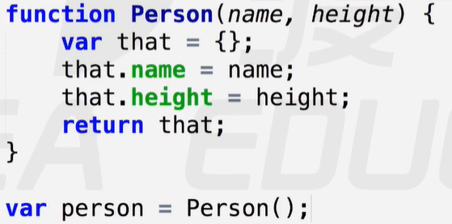

# 对象

### 对象的增删改查

- 查：对象.属性名（即：obj.property）或者 对象["属性名"]（即：obj.["property"]）。
- 增，改：通过对象.属性赋值的形式。
- 删：通过 delete 关键字，彻底删除属性及值。

注意：访问对象中不存在的属性时，不会报错而是返回undefined。

### 创建对象

1. 字面量
   - let obj = {}	plainObject	对象字面量 / 对象直接量
2. 构造函数【像工厂生产产品一样，所有的产品一摸一样，但相互独立】
   - 内置构造函数：Object
   - 自定义构造函数：构造函数本质上与普通函数是一样的，为了区分，命名大驼峰式。

##### 构造函数内部原理

构造函数本质上与普通函数无异，通过new关键字，便可创建一个对象。

使用关键字new的隐式三部曲：

- 在构造函数的顶部，隐式声明：var this = { };【理论上是一个空对象，实际指向window】
- 将绑定在this上的属性整合到this对象中
- 最后在构造函数中，隐式返回：return this；【将this指向实例对象】

模拟构造函数：【不使用关键字new】

-   
- 隐式的返回 return this 可以被显示定义返回{ }，但不能返回原始值（系统自动忽略该return，而返回this）。
  -  

### 包装类 / 包装为对象

原始值作为独立存在的一类简单值，本身没有任何方法和属性。【被包装成类后，则可以使用一些对象上的方法】

常见的包装类：【通过关键字new 执行内置构造函数】

- 数字型：包装成数字对象：var num = new Number（123）;
  -   
  - <del>在参与一次运算后，被自动转换为原始值，不再具有类的特性。</del>
- 字符型：new String（）【同上】
- 布尔型：new Boolean（）【同上】

隐式包装类：数字型，字符串型【添加的所有属性或方法都无法访问，均被置为undefined】

- 数字型 
- 字符串型 【现象：字符串不可以使用length来截断。本质：包装类】

### 综合练习

- 练习1： 

- 练习2： 

- 练习3： 

- 练习4： 

- 练习5： 【parseInt基模式：以第二参数为基底转换为十进制】

- 练习6： 

- 练习7：  

- 练习8： 

  
