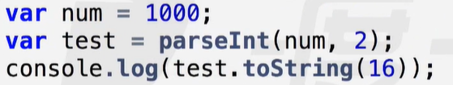

## 类型转换

#### 编程形式

- 面向过程：一步接一步，实现某个功能【分析本质，逻辑性强】
- 面向对象：整合小功能、基本功能完成复杂功能

#### 判断数据类型【typeof】

- 返回值：number，string、boolean、undefined、function、object。
- 特点：
  - 返回值是一串字符串。
  - 将function单独视为一种数据类型。
  - 将null视为object类型数据。
  - 未定义的变量，未定义值的变量均返回：“undefined”

#### 类型转换

- 显示类型转换：Number、String、Boolean
  - 转换为数字型【Number( )】
    - 默认转换为0的特殊值：空串‘ ’，空格串“  ”，false，null，空数组[ ]
    - 默认转换为1的特殊值：true
    - 默认转换为NaN的特殊值：undefined、非数字字符串、空对象{ }、其他无法转换为数字的值
    - 纯数字形式的字符串都能转换成数字型
  - 截取数字parse【必须是以数字形式开头的字符串】
    - 截取整数部分并转换为数字型：parseInt
      - 只取整数部分
        - 以小数点开头：一律转换为0
        - 以0开头：优先解析为八进制数，然后转换为十进制数
        - 以0x开头：优先解析为十六进制数，然后转换为十进制数
      - 两个参数：第二个参数，以指定参数为基底转换为十进制数，称为基模式。
      - 所有不是以数字形式开头的字符串均被转换为NaN，包括布尔值。
    - 截取数字并转换为数字型：parseFloat
      - 截取小数部分【以第一个小数点为基准】
      - 没有基模式，一律转换为十进制数。
  - 转换为字符串型【String( )】
    - 直接将参数以引号包裹，转换为字符串型。
    - toString（）包装类
      - 两个不能被包装的特殊值：null，undefined。【原型上没有toString方法】
      - radix参数：将数字型数据以十进制为基准，转换为指定进制数（字符串型值）【radix：基底】
      - 二进制 -- 十进制 -- 十六进制：
  - 转换为布尔型【Boolean( )】
    - 默认转换为false的特殊值：空串‘ ’，0，null，undefined，NaN。
    - 其他值均转为true：空格串，非空串，函数，对象，非零数字等。
- 隐式类型转换
- 原理：内部调用显示类型转换的方法
  - 运算操作符
    - ++，--，+（正），-（负），-（减），*，/，%
      - 先调用Number转换，再使用转换值参与运算。
    - +加号
      - 加号两边有一个字符串时，调用String转换为字符串，执行拼接。
    - 与或非
      - 与或：将运算结果调用Boolean转换，再返回运算结果，而不是布尔值。
      - 非：调用Boolean转换，再取反。
    - 比较>，<，>=，<=，==，===，!=，!==【比较运算的最终结果为布尔值】
      - 比较运算符有一边为数字型，另一半则调用Number转换，再比较。
      - 如果两边都是字符串，则按照字典查询法比较在ASCII码中的序号。
      - 几个特殊值：
        - true转为1，false转为0。
          - false < true = true
          - 2 > 3 > 1 = false【从左往右，2 > 3 = false = 0，0 > 1 = false】
          - 2 < 3 > 1 = false【从左往右，2 < 3 = true = 1，1 > 1 = false】
          - 2 < 3 > false = true【从左往右，2 < 3 = true = 1，1 > false = true】
          - 连续比较，从左往右，用上一次比较结果【布尔值】，转换后进行下一次比较。
        - null和undefined：
          - null被视为0：但null == 0 = false，即：null !== 0。
          - undefined被视为NaN：但undefined == null = true。【un派生自null】
  - isNaN（）【判断该数是否是NaN】
    - 先调用Number（）显示转换，再判断转换值是否是NaN。
      - isNaN（NaN）= true【NaN !== NaN】
      - isNaN（undefined）= true
- toFixed（）【保留几位小数】
  - 没有隐式类型转换，只能用于数字型。
