# 继承

​                                 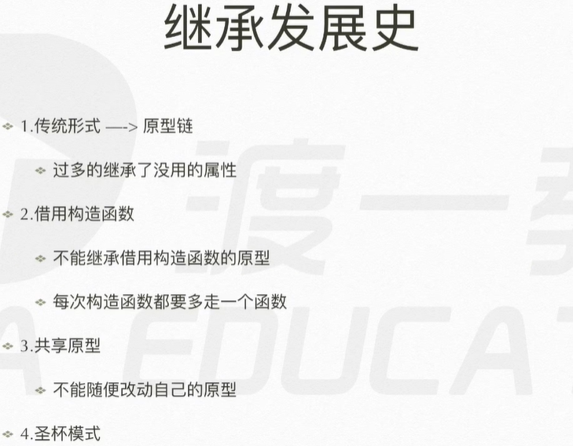 

- 原型链继承，将所有东西都继承过来，没有选择。
- 借用方式，每一次call / apply 都要多执行一遍借用的函数，浪费效率。
- 共享原型，将一个原型对象绑定到多个构造函数上，使它们的实例共享一个原型。
  - 核心：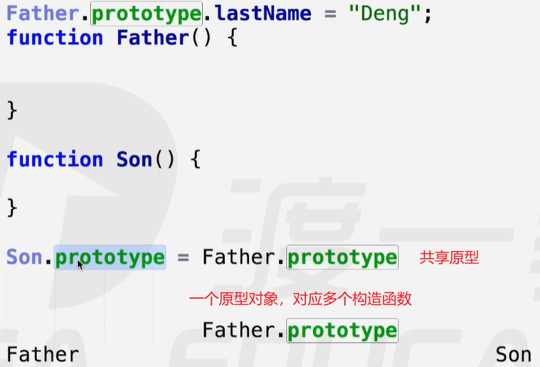 
  - 封装：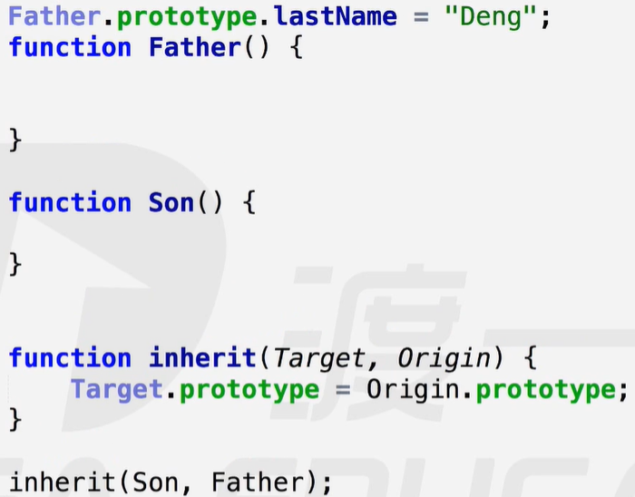 
  - 缺点：共享原型，一改全改。
- 圣杯模式：断开直接联系，找一个中间层传递【共享原型的升级版】
  - 核心： 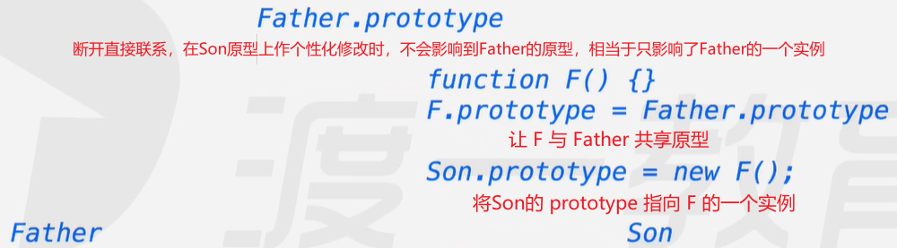
  - 核心封装：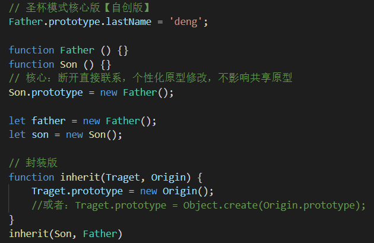  
  - 最终封装版：constructor 和 超类 问题
    - constructor是构造函数prototype上的内置属性，实例对象上没有这个属性。
      - 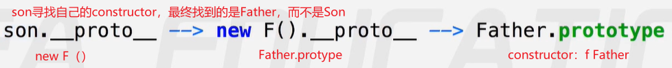 
    - 超类：超级父级，方便实例对象可以找到自己究竟（实际）继承自哪个原型。
    - 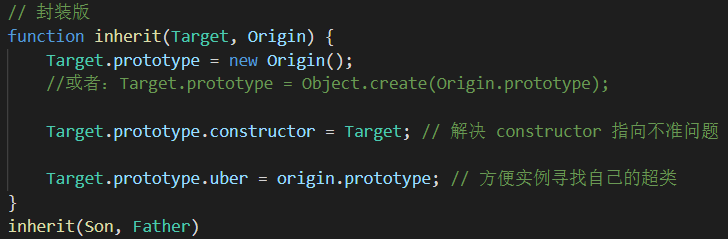 

深度学习：通过大量的数据对比，总结出规律，在应用规律解决问题中，验证并拓展规律。

### 命名空间

管理变量，防止污染全局，适用于模块化开发。【避免命名冲突】

解决：

- 第一种：在对象上命名，由对象提供接口
  - 将一系列命名定义到各自对象里，总和到一个对象中，通过该对象提供唯一的编程接口。
  - 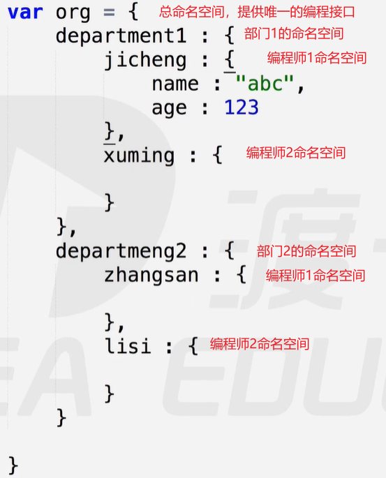 
  - 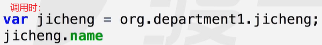 
- 第二种：在立即执行函数中命名，return留出接口。
  - 在一个立即执行函数中，进行命名执行，最后返回核心逻辑。【init：入口，初始化】
  - 将核心逻辑放到一个函数中被返回，当启用init时，会执行这些核心代码。
  - 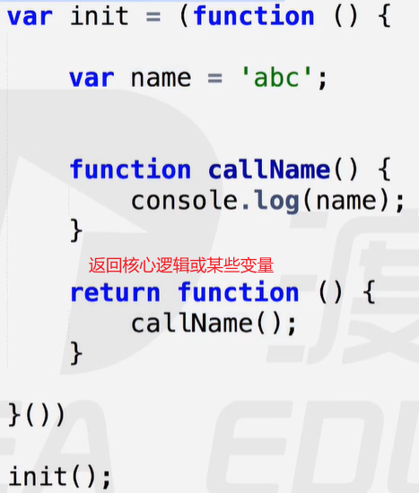 

### 模拟JQuery链式调用

链式调用如下：

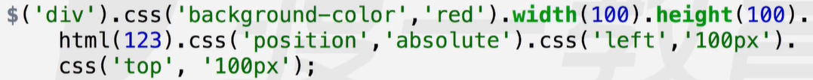 

模拟代码如下：【同一对象上方法的连续调用】

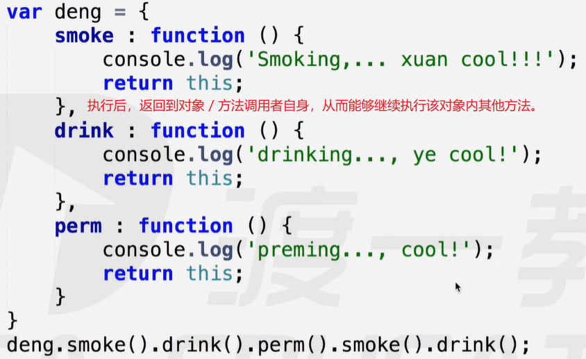 

### 深入对象

##### 对象的键值对

对象上的键实质上是字符串类型的变量。

定义对象属性的两种方式：

- 常用形式：字符串变量 --- { name ：“ 丸子 ” }
- 底层逻辑：字符串键 --- { “ name ” ：“ 丸子 ” }【类似 JSON 格式】
  - 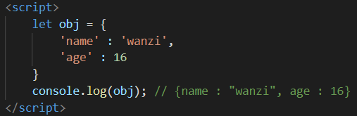 

##### 对象的属性访问

访问对象属性的常用方法是通过对象点属性的方式，而底层实现是通过对象["属性"]的方式来完成的。

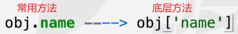 常用方法是通过隐式调用底层方法来实现的。

案例：底层方法的便捷之处

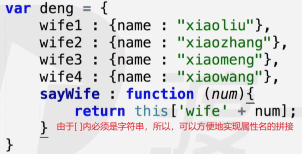 

##### 对象的枚举 / 遍历

1. for in【枚举】
   -  
   - 该循环将 obj 中的键一个一个地存放到 prop 中。
   - 注意：区分 obj.prop 与 obj[prop] 的不同
     - 错误：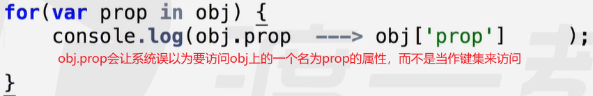 
     - 正确：在枚举时，只能通过obj[prop]访问。【在枚举时：obj.prop 相当于 obj["prop"]】
   - 案例：让对象中每一个属性的值加 1 
     - 错误：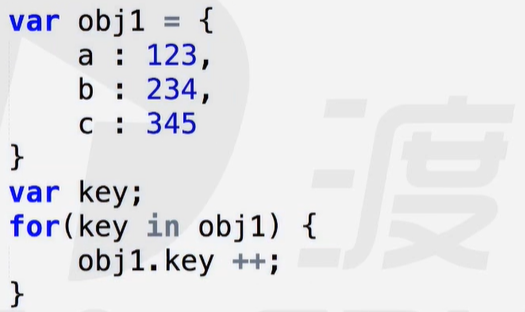  返回3个NaN，key 被当作 obj1 的一个属性来访问，结果undefined。
     - 正确：obj[key] ++；
   - for in 会将对象上所有的属性都遍历出来，包括继承自原型的属性。
     - 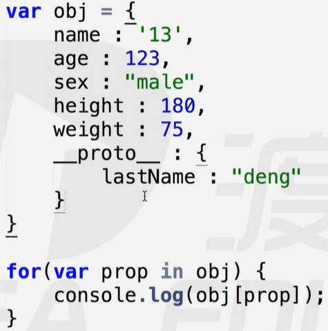  
2. hasOwnProperty【自有属性】
   - 判断该属性是不是对象自身有的，而不是继承来的，返回一个布尔值。【不是继承的true，是继承的false】
     - true的情况：直接定义在对象上的属性和方法【非继承的】
     - false的情况：通过继承得来的属性和方法【继承的】
   - 作用：过滤掉继承来的属性，只要自身有的。
   - 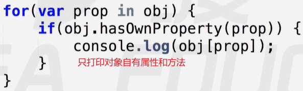 
3. in操作符【存在属性】
   - 判断该对象上有没有该属性（能不能访问到），包括继承来的，返回一个布尔值。【存在true，不存在false】
   - 使用：‘属性名’ in 对象；【属性名必须是字符串形式，否则报错‘not defined’】
   - 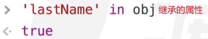 
4. instanceof操作符【属于实例】
   - 判断 左边 是不是 右边构造出来的一个实例。【instance：实例】
   - 作用：用来区分数据是什么类型
     - 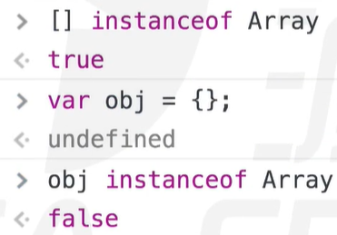 

##### 区分数组和对象的三种常用方法

- 通过构造器constructor判断
- 通过instanceof判断
- 通过toString判断
  - 系统内置的构造函数都重写了toString方法，可以借此区分类型
  - 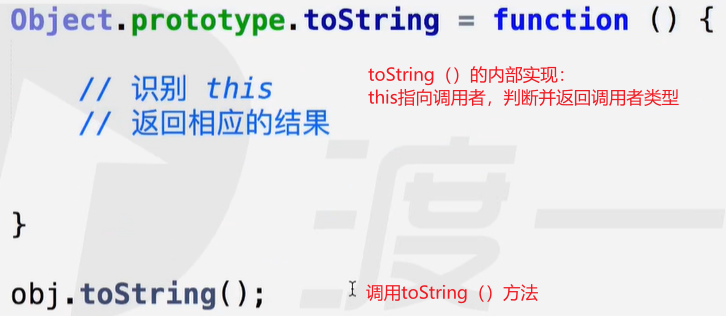 
  - 使用call改变this指向：
    - 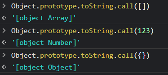 

