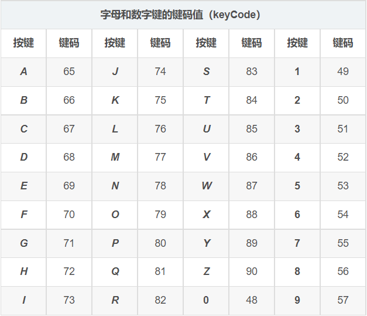
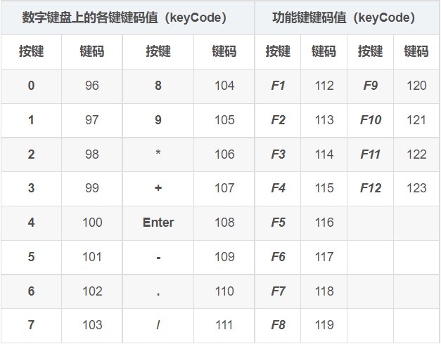
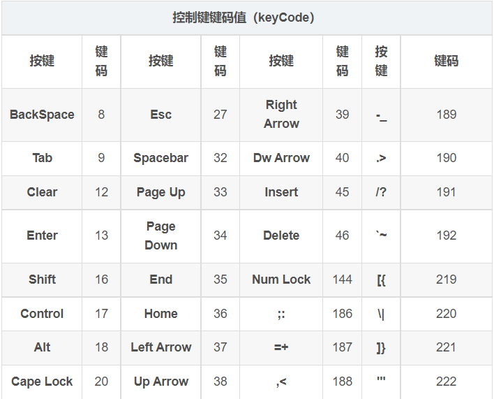
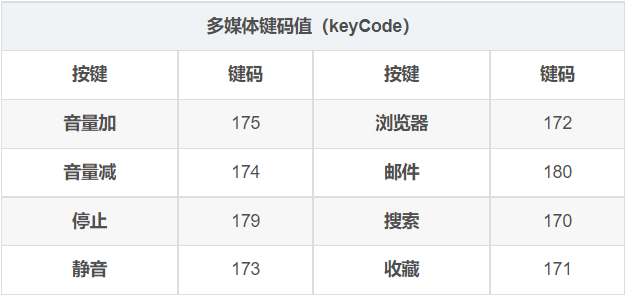
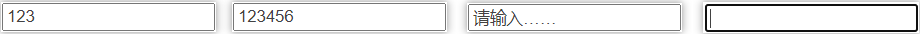

# 事件分类

### 鼠标事件

##### 鼠标移动【`mousemove`】

鼠标移动时，触发事件处理程序。

##### 鼠标移入

鼠标移入时，触发事件处理程序。旧语法：`mouseover` ；新语法：`mouseenter`

##### 鼠标移出

鼠标移出时，触发事件处理程序。旧语法：`mouseout` ；新语法：`mouseleave`

##### 鼠标按下【`mousedown`】

鼠标按下并未抬起时，触发事件处理程序。

##### 鼠标抬起【`mouseup`】

鼠标抬起时，触发事件处理程序。

##### 点击事件【`click`】

鼠标点击时，触发事件处理程序。`click = mousedown + mouseup`

##### 右键菜单【`contextmenu`】

右键出菜单时，触发事件处理程序。

##### 判断鼠标键

事件对象上的`button`属性，记录着当前事件鼠标点击的键位【0：左键；1：中键；2：右键】

`DOM3`规定：`click`事件只能监听左键，只能通过`mousedown`和`mouseup`来判断鼠标键。

##### 案例

1、设计鼠标拖拽功能：按下时拖动物体，松开后停止拖动。

```js
let disX = 0,
    disY = 0;
div.onmousedown = function (e) {
    disX = e.pageX - parseInt(div.style.left); // 获取初始按下时，鼠标在物体内的位置
    disY = e.pageY - parseInt(div.style.top); // 鼠标在物体中的位置 = 鼠标到的边界距离 - 物体到边界的距离
    document.onmousemove = function (e) { // 鼠标按下时，绑定全屏的鼠标移动事件，解决鼠标移动过快滑出物体的问题。
        // 鼠标在全屏内移动，无论速度多快，都能被精准捕捉到位置信息，只需将该位置传递给移动物体即可。
        let event = e || window.event;
        div.style.left = event.pageX - disX + 'px'; // 动态修改物体到视口边界的距离
        div.style.top = event.pageY - disY + 'px';
    }
    document.onmouseup = function (e) { // 设置鼠标抬起时，将该全屏移动事件取消。
        div.onmousemove = null;
    }
}
// 封装兼容版
function drag (ele) {
    let disX = 0,
        disY = 0;
    addEvent(ele, 'mousedown', function (e) { // 使用兼容版方法添加事件
        let event = e || window.event;
        disX = event.clientX - parseInt(getStyle(ele, 'left'));
        disY = event.clientY - parseInt(getStyle(ele, 'top'));
        addEvent(document, 'mousemove', mouseMove); // 使用兼容版方法添加事件
        addEvent(document, 'mouseup', mouseUp); // 使用兼容版方法添加事件
        stopBubble(event); // 使用兼容版阻止冒泡
        cancelHandler(event); // 使用兼容版阻止默认行为
    });
    function mouseMove (e) { // 封装mousemove处理程序
        let event = e || window.event;
        ele.style.left = event.clientX - disX + 'px';
        ele.style.top = event.clientY - disY + 'px';
    }
    function mouseUp (e) { // 封装mouseup处理程序
        let event = e || window.event;
        removeEvent(document, 'mousemove', mouseMove); // 解除mousemove处理程序
        removeEvent(document, 'mouseup', mouseUp); // 解除mouseup处理程序
    }
}
// 外部提供的兼容性方法
// 添加元素
function addEvent (elem, type, handle) {
    if (elem.addEventListener) { // 优先使用addEventListener
        elem.addEventListener(type, handle, false);
    }else if (elem.attachEvent) { // 其次使用IE的attachEvent
        elem.attachEvent('on' + type, function () {
            handle.call(elem); // 修改this指向elem当前元素自身
        })
    }else { // 最后使用原始事件注册
        elem['on' + type] = handle;
    }
}
// 获取样式
function getStyle (elem, prop) {
    if (window.getComputedStyle) {
        return window.getComputedStyle(elem, null)[prop];
    }else {
        return elem.currentStyle[prop];
    }
}
// 阻止冒泡
function stopBubble (event) {
    if (event.stopPropagation) {
        event.stopPropagation();
    }else {
        event.cancelBubble = true;
    }
}
// 阻止默认行为
function cancelHandler (event) {
    if (event.preventDefault) {
        event.preventDefault();
    }else {
        event.returnValue = false;
    }
}
// 解绑事件
function removeEvent (ele, type, fn) {
    if (ele.removeEventListener) {
        ele.removeEventListener(type, fn, false);
    }else if (ele.detachEvent) {
        ele.detachEvent('on' + type, fn);
    }else {
        ele['on' + type] = null;
    }
}
```

2、设计当鼠标按下时，触发拖拽功能；当鼠标点击时，触发跳转功能。

```js
let firstTime = 0,
    lastTime = 0,
    key = false;
document.onmousedown = function () {
    firstTime = new Date().getTime();
    document.onmousemove = function () {}; // 鼠标按下时，添加拖拽功能
}
document.onmouseup = function () {
	lastTime = new Date().getTime();
    if (lastTime - firstTime < 300) { // 利用时间差来判断，小于300ms算点击事件，否则算拖拽事件。
        key = true;
    }
}
document.onclick = function () {
    if (key) {
        key = false;
        // 跳转
    }
}
```

##### 移动端

鼠标按下：`touchstart`；鼠标移动：`touchmove`；鼠标抬起：`touchend`

### 键盘事件

##### 键盘按下【`keydown`】

当键盘按键按下并未松开时，触发事件处理程序。与`mousedown`类似。

`keydown`可以响应任何键盘按键，但无法使用`charCode`码区分。`event`上的`which`是键位码，不区分大小写。

`keyCode`键位码：是按照按键在键盘中的位置，来进行编码的一套标准，不区分大小写。

  

  

##### 键盘按压【`keypress`】

与`keydown`类似，当按压键盘时，触发处理程序。在`keydown`后立即执行。

`keypress`可以使用`charCode`码区分，但只响应字符类键盘按键。没有方向键和控制键 / 修饰键。

`keypress`返回`ASCII`码，可以使用`String.fromCharCode()`方法转换为相应字符，区分大小写。

区别：

- `keydown`可以监听方向键和控制键等键盘事件，按`keyCode`码，对于字符类按键不区分大小写。
- `keypress`可以精准地监听字符类按键事件，按照`ASCII`码区分大小写。

使用：

- 操作类按键，只能用`keydown`。如：游戏中的操作键一般都使用`keydown`监听。
- 字符类按键区分大小写，只能用`keypress`

##### 键盘抬起【`keyup`】

当键盘按键抬起时，触发事件处理程序。执行顺序：`keydown > keypress > keyup`

### 文本操作事件

文本操作事件主要用于监听表单类控件，有：`input`，`change`，`focus`，`blur`四个监听事件。

##### 监听输入【`input`】

当在表单控件中，执行输入内容的操作时触发【发生在失去焦点前】

##### 监听内容【`change`】

当控件中前后两次状态的内容发生变化时触发【发生在失去焦点后】

##### 获得焦点【`focus`】

当控件获得焦点时，触发事件处理程序。

##### 失去焦点【`blur`】

当控件失去焦点时，触发事件处理程序。

案例：设计一个输入提示框，失去焦点后，显示输入的内容。

```html
<!--获得焦点时，清除提示；失去焦点时，若内容为空，显示提示-->
<input type = "text" value = "请输入……" style = "color:#999" onfocus = "if(this.value == '请输入……'){this.value = ''; this.style.color = '#424242';}" onblur = "if(this.value == ''){this.value = '请输入……'; this.style.color = '#999';}">
<!--bug：当输入提示内容时，失去焦点后，该内容会被作为提示内容，继续输入时该内容会消失-->
```

正常情况下，可以在上次的输入上继续输入。但如果上次输入的是提示文本，下次输入则会自动清空内容。

 

### 窗口操作事件

`window`上定义了两个窗口操作的事件：`scroll`和`load`。

##### 滚动距离【scroll】

`scroll`事件，滚动条滚动时触发。监听滚动条滚动了多少距离，用来获取滚动条的当前位置。

`scroll`事件主要监听`window`的`pageXOffset`和`pageYOffset`这两个属性。

利用`scroll`事件可以模拟实现`fixed`定位功能：`fixed`定位距离 = `absolute`定位距离 + 滚动距离。

##### 延迟加载【load】

浏览器解析`HTML`页面时，会先生成`domTree`和`cssTree`，将它们拼接为一个`renderTree`，根据`renderTree`渲染页面。

生成`domTree`：浏览器先解析所有节点，将这些节点整理到树上。遇到`src`等资源请求，会另开线程去异步请求。

`load`事件：等待`renderTree`构建完成，所有资源请求完毕后，才加载该区块代码。监听页面加载状态，加载完成后执行。

应用：`load`事件中一般放置一些等待页面加载完成后，去另外加载一些辅助性的或无关紧要的内容，如：广告，工具等。

