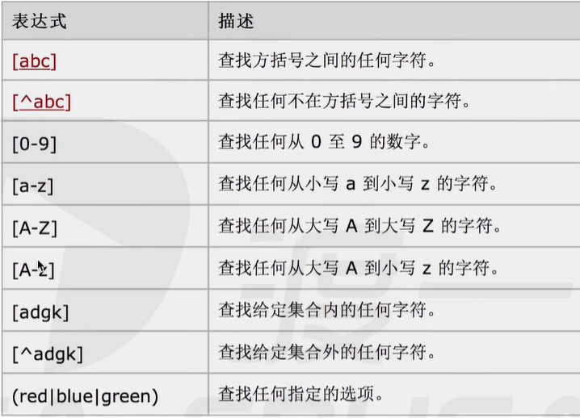

# 正则表达式`RegExp`

作用：匹配特殊字符或有特殊搭配原则的字符的最佳选择，通常用来匹配或校验特定的字段。

### 创建`RegExp`

##### 字面量

正则表达式字面量：`//`，规则写在两个斜杠之间，如：`let reg = /abc/ // 匹配含有abc片段的字符串;`

##### 创建实例

通过`new`创建正则实例，第一个参数表示规则，第二个参数表示属性。如：`let reg = new RegExp("abc", "i");`

注意：使用`RegExp`构造函数时，若第一个参数放入已知的规则，使用`new`创建两个独立的表达式，不使用`new`则表示同一个。

##### 修饰符

- i：执行时，忽视大小写。
- g：执行全局匹配，在字符串中查找所有匹配的片段，而不是在找到第一个匹配项后停止。
- m：执行多行匹配。例如：使用转义字符`\n`将字符串换行后，可执行多行的匹配。

值得注意的是：修饰符可以连用，以满足复杂的匹配需求。

```js
let reg = /^a/gm, // 全局多行匹配：查找以a开头的字段
    str = "aetgd\nagjaei";
str.match(reg); // ["a", "a"]
// 在正则表达式中匹配特殊字符，如空格，\，?等在正则中有特殊意义的字符
let reg = / /g; // 表示匹配空格，正则表达式中没有无用的内容
reg = /\\/g; //表示匹配反斜杠：\
reg = /\?/g; // 表示匹配问号：?
reg = /\+/g; // 表示匹配加号：+
```

##### 执行匹配

执行字符串匹配的方法有两种：`reg.test(str) // 是否具有特定片段`和`str.match(reg) 匹配出特定片段`

### 方括号

方括号用于查找某个范围内的字符，内部写匹配规则的表达式，一个方括号只能匹配一位字符。

```js
// 使用[abc]
let reg = /[0123456789][0123456789][0123456789]/g,
    str = "12309wfsdf78656ewf";
str.match(reg); // ["123", "786"]
let reg = /[ab][cd][d]/g, // 三个必须紧密相连且满足：第一位是a或b，第二位是c或d，第三位是d的片段。
    str = "abcd";
str.match(reg); // "bcd"
```

​                                           

```js
// 在一个方括号中，也可以连用表达式
let reg = /[0-9A-z][cd][d]/g,
    str = "ab1cd";
str.match(reg); // "1cd"
// ^在方括号中表示非，在外面表示以……开头。
let reg = /[^a][^b]/g,
    str = "ab1cd";
str.match(reg); // ["b1", "cd"]
// 使用(|)，表示或，匹配到其中任一项/片段都可以
let reg = /(abc|bcd)[0-9]/g,
    str = "abcd2";
str.match(reg); // ["bcd2"]
```

### 元字符

元字符（`Metacharacter`）是拥有特殊意义的字符：【一个字符仅匹配一位】

- 查找单词字符：`\w === [0-9A-z_]; // w是world的缩写，代表：0-9、A-z、下划线_的集合`
  - 查找非单词字符：`\W === [^\w]; // 表示\w的补集`
- 查找数字字符：`\d === [0-9];`
  - 查找非数字字符：`\D === [^\d]`
- 查找空白字符：`\s === [\t\v\r\n\f ] // 代表：\t、\v、\r、\n、\f以及空格的集合`
  - 查找非空白字符：`\S === [^\s]`
- 查找单词边界：`\b`，单词边界指：分隔单词字符片段字符的前后空字符，包括所有非单词字符以及`str`的首尾。
  - 查找非单词边界：`\B`
- 查找`NUL`字符：`\0`
- 查找换行符：`\n`【换行不代表行结束】
- 查找换页符：`\f`
- 查找回车符：`\r`【回车才代表行结束】
- 查找水平制表符：`\t`
- 查找垂直制表符：`\v`
- 查找以十六进制规定的`Unicode`字符：`\u010000-\u10ffff // 前两位代表层数，后四位代表层中字符`
- 查找单个字符（除了换行和行结束符）：`. === [^\n\r]`
- 查找任意字符：`[\s\S] // 自身 + 补集`

```js
// 单词边界：包括所有非单词字符首尾的空字符，以及str自身首尾的空字符。
let str = "abc bde\efg",
    reg = /\b/g;
str.match(reg); // ['', '', '', '', '', '']，即：每一个单词的边界
reg = /\bbde/g;
str.match(reg); // ['bde']
```

### 量词

量词表示在每次匹配的片段中，该字符可以出现的个数。即：匹配可以包含多少个该字符的片段。

- `n+`：`n`代表某个字符，`n+`表示它在每次匹配的片段中可以出现`[1, +∞)`次。即：出现至少一次。
- `n*`：`n*`表示该字符可以出现`[0, +∞)`次。即：出现零次或多次。
- `n?`：`n?`表示该字符可以出现`[0, 1]`次。即：出现零次或一次。
- `n{X}`：`n{X}`指定该字符可以出现的次数，即：匹配包含`X`个`n`的序列片段。
- `n{X, Y}`：`n{X, Y}`指定该字符可以出现次数的区间，即：匹配包含`X`至`Y`个`n`的序列片段。
- `n{X, }`：`n{X, }`指定该字符应至少出现的次数，即：匹配包含至少`X`个`n`的序列片段。
- `^n`：`^n`指定匹配以该字符开头的序列片段。
- `n$`：`n$`指定匹配以该字符结尾的序列片段。`^abc$`表示：匹配以`a`开头，`c`结尾的`abc`片段。
- `?=n`：正向预查 / 正向断言，n为前面字符的修饰条件，不作为最终的匹配结果。如：`/a(?=b)/g`
- `?!n`：反向预查 / 反向断言，匹配其后没有紧跟着指定片段n的任何片段。如：`/a(?!b)/g`

```js
// 使用n+
let str = "abc",
    reg = /\w+/g; // 该字符可以出现无数次
str.match(reg); // ["abc"]，\w字符连续出现三次，则可以拼接成一个片段
// 正则表达式的贪婪匹配原则：能匹配长串的，不匹配短的。尽量匹配出长串的符合要求的片段。
// 使用n*
reg = /\w*/g;
str.match(reg); // ["abc", ""]，在匹配完abc后\w* == 3，再匹配一个包含零个该字符的片段\w* == 0。
reg = /\d*/g;
str.match(reg); // ["", "", "", ""]，匹配到四个包含零个该字符的片段\d* == 0，分别在a，b，c的前后
// 使用n?
str = "aaaa";
reg = /\w?/g;
str.match(reg); // ["a", "a", "a", "a", ""]，匹配到四个包含一个该字符的片段，以及一个不包含该字符的片段
// 使用?=n
str = "abaaa";
reg = /a(?=b)/g; // 匹配a后面紧跟着b的a，即：匹配其后紧跟着指定片段n的片段
str.match(reg); // ["a"]
// 使用?!n
reg = /a(?!b)/g; // 匹配a后面没有紧跟着b的a
str.match(reg); // ["a", "a", "a"]
```

##### 非贪婪匹配

可以在任何量词后面追加一个`?`号来打断贪婪匹配，使其匹配尽量短的片段，如：`/a??/g; 尽量匹配出含0个a的最短片段`

```js
// 非贪婪匹配
let str = "abc",
    reg = /a??/g;
str.match(reg); // ["", "", "", ""]
```

案例：检验一个字符串首尾是否含有数字，意思是"首或尾有就行"

```js
let reg = /^\d|\d$/g, // 正则表达式中的或为：|
    str = "12age";
str.match(reg); // ["1"]
// 检验一个字符串首尾是否都含有数字
reg = /^\d[\s\S]*\d$/g; // 使用[\s\S]表示任意字符，再加上量词*。表示中间可以包含0个或多个任意字符。
str = "123age123";
str.match(reg); // ["123age123"]
```

### 对象方法

`RegExp`的每个实例对象上，都具有三个方法。

##### 检测方法【test】

检查字符串中是否含有指定的片段，返回`true`或`false`。

##### 执行方法【exec】

检索字符串中指定的`reg`片段，确定其`index`位置并返回这个值。`index`可通过`lastIndex`对象属性手动修改。

```js
let str = "ababab",
    reg = /ab/g;
reg.exec(str); // 返回一个类数组：[0 : "ab", index : 0, input : "ababab", length : 1]
// index表示该片段是在字符串中的哪个位置上找到的，index会自动修改为对象上lastIndex属性的值。
```

##### 编译方法【compile】

编译正则表达式。

### 对象属性

`RegExp`的每个实例对象上，都具有五个属性。

##### 全局匹配属性【`global`】

该实例对象上是否具有标识`g`，即：是否为全局匹配模式。

##### 忽视大小写属性【`ignoreCase`】

该实例对象上是否具有标识`i`，即：是否忽视大小写匹配。

##### 多行匹配属性【`multiline`】

该实例对象上是否具有标识`m`，即：是否为多行匹配模式。

##### 源文本属性【`source`】

显示该实例对象的源文本，即：正则字面量的字符串形式。

##### 下一次匹配位置【`lastIndex`】

一个整数，标示开始下一次匹配的字符位置。作为`exec`方法执行时的`index`游标。

### 反向引用

在正则表达式中，小括号具有另一层含义：表示子表达式，它会记录里面匹配到的字符片段，并挂载到`exec`的类数组上。

##### 反向引用【\数字】

在正则表达式中，使用\数字，表示反向引用第几个子表达式内的匹配结果。如：`/(\w)\1/ 引用第1个子表达式的结果`

应用：反向引用在匹配`xxxx`型的片段时，非常有用。如：`"aaaabbbbcccc"`，返回每一个匹配到的片段。

```js
// 匹配xxxx型片段
let str = "aaaabbbb",
    reg = /(\w)\1\1\1/g; // 连续三次引用第一个子表达式的结果，则可以匹配xxxx型的片段
str.match(reg); // ["aaaa", "bbbb"]
// 匹配xxyy型片段
let str = "aabb",
    reg = /(\w)\1(\w)\2/g; 
str.match(reg); // ["aabb"]
```

### 可使用正则表达式的字符串方法

##### 检索【search】

检索与正则表达式相匹配的值。匹配到返回匹配到值时的位置，匹配不到则返回`-1`。

##### 匹配【match】

找到一个或多个正则表达式的匹配。非全局匹配返回与`exec`一样的类数组；全局匹配则返回所有片段。

##### 替换【replace】

替换与正则表达式匹配的子串。使用正则可以全局匹配，而将指定片段全部替换为正则的结果。

当`replace`用于字符串之间的替换时，只能替换第一个匹配到字符片段。如：`str = "aa"; str.replace('a', 'b'); // 'ba'`

案例：【字符串可以使用`$`反向引用每个子表达式匹配的结果】

```js
// 将XXYY型替换为YYXX型
let str = "aabb",
    reg = /(\w)\1(\w)\2/g;
str.replace(reg, "$2$2$1$1"); // 'bbaa' 在字符串中可以使用$来反向引用每个子表达式的匹配结果。
```

函数处理：

- 在`replace`中第二个参数，可以是一个回调处理函数，来处理更加复杂的替换。
- 函数的参数：（全局匹配的结果，第一个子表达式匹配的结果，第二个子表达式匹配的结果）

```js
// 使用高级处理
let str = "aabb",
    reg = /(\w)\1(\w)\2/g;
str.replace(reg, function ($, $1, $2) { // 系统自动传参
    // 对匹配结果先进行一系列处理，最后用return返回替换结果。
    return $2 + $2 + $1 + $1;
})
// 将the-first-name转换为小驼峰式的theFirstName
let str = "the-first-name",
    reg = /-(\w)/g; 	// 匹配出所有"-小写字母"的组合/片段
str.replace(reg, function ($, $1) { // 这个函数执行的次数取决于使用reg匹配了多少次。
    // 将匹配到的所有"-小写字母"片段以它的大写形式替换。
    return $1.toUpperCase();
})
// 字符串去重
let str = "aaaaabbcccccc",
    reg = /(\w)\1*(\w)\2*(\w)\3*/g;
str.replace(reg, "$1$2$3"); // "abc"
// 简写表达式：
reg = /(\w)\1*/g;  // 反向引用0次或多次，即：匹配连串的相同字符
str.replace(reg, "$1"); // "abc" // 将每一次匹配到的片段使用$1来替换，然后拼接到一起。
// 标准化一串数字：将"100000000"标准化为："100.000.000"
// 从前往后分段
let str = "1000",
    reg = /(\d{3})\B/g;
str.replace(reg, "$1."); // "100.0"
// 从后往前分段
reg = /(?=(\B)(\d{3})$)/g; // 从后往前匹配空串后面紧跟着非单词边界且有三个连续的数字
str.match(reg, "."); // "1.000"
```

##### 分割【split】

把字符串以正则匹配的片段为分隔符，分割成字符串数组。

