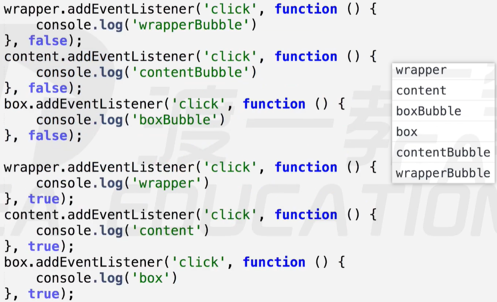

# 事件

### 注册事件

##### 原始事件【`onclick`，`onmouseover`……】

使用：`ele.onclick = function () {} // 在元素的click事件上绑定一个处理程序`

注意：

- 以`on`开头的事件是最原始的事件定义，兼容性很好，但一次只能绑定一个处理程序。
- `onclick`事件，基本等同于写在`HTML`行间上，如：`<div onclick = "JS表达式"></div> // 不需要function关键字`

##### 添加事件监听【`addEventListener`】

使用：`ele.addEventListener(事件类型，回调处理函数，false) // IE9以下不兼容`

注意：该方法可以同时为一个事件绑定多个处理函数，但同一个回调处理函数在同一事件上只能绑定一次。

IE独有方法：`ele.attachEvent(原始事件，处理函数)`

注意：该IE独有方法，与`addEventListener`方法类似，但它允许同一个回调在同一事件上绑定多次。

```js
let div = document.getElementsByTagName("div")[0];
function test () {
	consloe.log("a");
}
// 第一种
div.addEventListener("click", test, false); // 对于同一个回调只绑定一次
div.addEventListener("click", test, false);
// 结果：只打印一个a
// 第二种
div.addEventListener("click", function () { // 第一个回调函数
    console.log("a");
}, false);
div.addEventListener("click", function () { // 第二个回调函数
    console.log("a");
}, false);
// 结果：打印两次a，a
// 第三种：IE独有的attachEvent方法，可以多次绑定同一个回调函数。
div.attachEvent('onclick', test); // 绑定一次
div.attachEvent('onclick', test); // 绑定两次
// 结果：打印a，a
```

##### this指向

以`on`开头的原始事件以及`addEventListener`事件监听，其内部的`this`都指向`DOM`元素本身。

而`IE8`及以下浏览器独有的`attachEvent`绑定事件，其内部的`this`却指向`window`

封装一个兼容性的`addEvent`方法

```js
// elem：元素，type：事件类型，handle：回调处理
function addEvent (elem, type, handle) {
    if (elem.addEventListener) { // 优先使用addEventListener
        elem.addEventListener(type, handle, false);
    }else if (elem.attachEvent) { // 其次使用IE的attachEvent
        elem.attachEvent('on' + type, function () {
            handle.call(elem); // 修改this指向elem当前元素自身
        })
    }else { // 最后使用原始事件注册
        elem['on' + type] = handle;
    }
}
// 使用：为div添加click事件
addEvent(div, 'click', function () {});
```

### 解除事件

解除事件的核心是：清除事件回调处理程序的引用。

要注意的是：解除必须写到注册的内部，保证至少触发一次，通常用作一次性事件。

##### 解除原始事件【`null`】

解除原始事件，直接在事件处理内部最后将该元素事件设值为`null`即可。

例如：`div.onclick = function () {……; this.onclick = null;}`

##### 解除事件监听【`removeEventListener`】

解除事件监听，需要注意的是，要清除处理程序的引用。因此，注册时使用具名函数。

使用：`ele.removeEventListener(type, fn, false);`

例如：`div.addEventListener('click', test, false); ==> div.removeEventListener('click', test, false);`

##### 解除IE独有的事件【`detachEvent`】

与使用`removeEventListener()`类似，清除回调处理的引用。

使用：`ele.detachEvent('on' + type, fn) // fn必须是具名函数，否则无法清除`

封装`removeEvent`

```js
function removeEvent (ele, type, fn) {
    if (ele.removeEventListener) {
        ele.removeEventListener(type, fn, false);
    }else if (ele.detachEvent) {
        ele.detachEvent('on' + type, fn);
    }else {
        ele['on' + type] = null;
    }
}
```

### 事件处理模型

事件处理模型包括两个部分：事件冒泡和事件捕获。

事件冒泡与事件捕获的主要区别在于：事件执行顺序的不同【冒泡：自底向上，捕获：自顶向下】

注意：同一个元素对象上的同一个事件，只能存在一种事件处理模型。

开启捕获模式：注册事件时，将第三个参数设置为`true`，表示开启事件捕获模式。

##### 事件冒泡

概念：结构上嵌套关系的元素，会存在事件冒泡的功能，即同一事件，自子元素冒泡向父元素【自底向上】

开启冒泡模式：`ele.addEventListener(type, fn, false);`

注意：`focus`、`blur`、`change`、`submit`、`reset`、`select`等事件不冒泡。

##### 事件捕获

概念：结构上嵌套关系的元素，会存在事件捕获的功能，即同一事件，自父元素捕获至子元素(事件源元素)【自顶向下】

开启捕获模式：`ele.addEventListener(type, fn, true);`

注意：

- 点击最里层元素时，最外层先捕获。到最里层时，没有元素可捕获，则按编写顺序执行事件。
- `IE`没有实现这种事件捕获的处理模型，但`IE`设计了独有的事件捕获功能。
  - `IE`的事件捕获指：捕获页面中发生的所有事件，将这些事件暂时绑定到指定元素上，供它使用。
  - 主要用于解决鼠标拖拽过快，容易跑出元素的问题。鼠标移动的帧频超过系统监听事件的帧频。
  - 开启捕获：`ele.setCapture();`释放捕获：`ele.releaseCapture(); // 避免其他事件长期失效`

##### 触发顺序

当为同一元素绑定多个同类型事件，且事件处理模型不一致时，触发顺序为：先捕获，后冒泡。

案例：

 

解析：

- 点击最里层`box`时，先由`body`捕获最外层的`wrapper`，再由`wrapper`捕获`content`，`content`捕获`box`
- 捕获到`box`执行事件时，无元素可捕获，然后按照程序的编写顺序执行。先打印`'boxBubble'`，后`'box'`
- 等到`box`的所有事件处理完成后，由`box`开始向上冒泡。先冒泡到`content`，再冒泡到`wrapper`

##### 取消冒泡

事件冒泡是常用的处理模型，可以用来实现事件委托等。但事件冒泡也带来许多问题。

事件对象提供了取消冒泡的方法：

- 标准方法：`e.stopPropagation() // IE9以下不兼容`
- IE独有：`e.cancelBubble = true;`

封装兼容的取消冒泡方法：

```js
function stopBubble (event) {
    if (event.stopPropagation) {
        event.stopPropagation();
    }else {
        event.cancelBubble = true;
    }
}
div.onclick = function (e) {
    stopBubble(e); // 调用封装方法，并传入当前事件对象。
}
```

##### 阻止默认事件

默认事件：表单提交，`<a>`链接跳转，右键菜单等。

阻止方法：

- 以对象属性的方式注册的事件：`return false // 原始方法，兼容性好`
- 标准方法：`event.preventDefault() // IE9以下不兼容`
- `IE`旧方法：`event.returnValue = false;`

封装阻止默认事件的方法：`cancelHandle()`

```js
// 封装方法，主要用于addEventListener和attachEvent注册的事件
function cancelHandler (event) {
    if (event.preventDefault) {
        event.preventDefault();
    }else {
        event.returnValue = false;
    }
}
// 注：原始方法注册的事件，直接在其内部通过return false语句来阻止，无法封装。

// 使用封装方法：阻止右键菜单行为
document.oncontextmenu = function (e) {
    cancelHandel(e); // 使用封装方法，传入当前事件对象
    // return false; 也可以通过
}

// 阻止a标签跳转
a.onclick = function () {
    return false;
}
// 或者直接在标签中写JS代码：<a href = "javascript : viod(false)">点击</a> // void()相当于return
```

##### 事件对象

每一个事件都具有自己的事件对象，该对象包括了当前事件的所有信息。而`IE`使用独有的事件对象。

事件对象的表示：非`IE` --- 使用`event`；`IE` --- 使用`window.event`。

兼容处理：`function (e) {let event = e || window.event;}`

##### 事件源对象

事件对象上有两个属性都记录了触发该事件的源对象，该对象是自身或子元素节点【`target`：火狐；`srcElement`：`IE`】

兼容处理：`let target = event.target || event.srcElement // 这两个属性chrome都有`

##### 事件委托

在父元素上添加可冒泡事件，利用事件冒泡和事件源对象的机制实现最终由自身触发。即：将事件委托给父级，由自身来触发。

优点：

- 性能好：不需要使用循环，去给每一个子元素添加相同事件。
- 可扩充：当有新的子元素时，不需要重新循环绑定事件。

案例：点击`li`元素，打印其中内容

```html
<ul>
    <li>1</li>
    <li>2</li>
    <li>3</li>
</ul>
<script>
    // 原始写法，循环绑定
	let li = document.getElementsByTagName('li'),
        len = li.length;
    for (let i = 0; i < len; i++) { // 遍历每一个li元素
        li[i].onclick = function () { // 为每个li元素添加点击事件
            console.log(this.innerText); // 打印当前li的文本内容
        }
    }
    // 利用事件委托机制，灵活处理
    let ul = document.getElementsByTagName('ul')[0];
    ul.onclick = function (e) { // 先将子元素的事件委托给父元素
        let event = e || window.event, // 获取兼容的事件对象
            target = event.target || event.srcElement; // 获取兼容的事件源对象
        console.log(target.innerText); // 打印当前事件源的文本内容
    }
</script>
```

