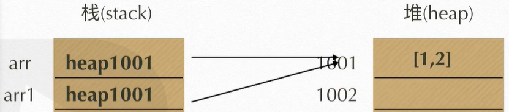
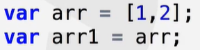

### 五大主流浏览器及其内核

条件：1、市场占有份额不少于3%；2、有独立研发的内核

- Chrome	---	webkit / blink
- IE			   ---	trident / webkit
- Safari		---	webkit
- Firefox	  ---	Gecko
- Opera		---	presto

#### 文件后缀名

- windows 98 奠定了程序的基础，但它只允许文件后缀名最多为3位。

#### 编程语言

- HTML 和 CSS 不是编程语言，但同属于计算机语言。
- 成为编程语言的基础是，必须有变量（variable）的概念。

### ECMA Script 语法

1. 变量

   - 变量声明与赋值
     - 变量声明：关键字 变量名；
       - 向系统申请了一块内存空间并命名。
     - 变量赋值：变量名 = 值；
       - 通过变量名找到内存空间，并存放数据。
       - 操作变量的实质是通过变量名找到内存空间，获取并设置里面的数据。
     - 变量初始化：声明变量并赋值 -- > var a = 1;
     - 集体声明：变量名以逗号隔开
       - var a,b, c = 1; 
       - 减少向系统申请次数，提升整体性能。
       - 开发规范：将多个变量名再换行隔开。
     - 命名规范：
       - 变量名只能以英文字母、下划线 _ 、美元符 $ 开头。
       - 不能与关键字、保留字等冲突。

2. 数据类型

   - 简单值（原始值）--- 基本数据类型
     - 五大原始值：Number、String、Boolean、Undefined、Null
       - 数字型：Number（）
         - 字面量：1，-1，0.1，NaN，Infinity……（纯数字形式）
       - 字符串型：String（）
         - 字面量：”李白“，’杜甫‘，\`白居易\`，’123‘……（一对引号包裹的字符序列）
       - 布尔型：Boolean（）
         - 字面量：true、false
       - 未定义型：Undefined
         - 表示一类暂未定义值的类型
       - 空值：Null
         - 表示一类空值的类型，通常用于占位。
   - 引用值 --- 复杂数据类型
     - 数组（Array）、函数（Function）、对象（Object）、正则表达式（RegExp）、日期（Date）……。
   - 不同的数据类型，存储的方式不同，对应着不同的操作。
     - 不同数据类型的存储方式：栈内存（stack）、堆内存（heap）
       - 原始值：
         - 数据（原始值）直接存储在栈（stack）内存中。
         - 原始值的操作，都是在栈内存之间的相互赋值或拷贝操作。
         - b = a：表示将变量 a 在栈中的值直接拷贝一份存到 b 的栈空间中。
       - 引用值：
         - 将数据（引用值）存储在堆（heap）内存中。
         - 把数据在堆内存中的引用（地址）存储到栈（stack）内存中。
         - 引用值的操作：在栈中操作地址，在堆中操作数据。
         - 
           - arr 在栈中存的是其值 [1,2] 在堆中的地址。
           - arr1 在栈中直接拷贝了一份 arr 存在栈中的地址。
       - 不可改变的原始值
         - var num = 100；num = 200；
           - 先将值200存到栈中，然后将num指针指向200的地址（如内存地址：1010）。
           - 抹去原先100的指针，恢复为原内存地址，但100并未彻底删除。
   - 变量类型
     - 由值决定变量的类型（值是什么类型，变量就是什么类型）。

3. JS错误

   - 错误分类：低级错误、逻辑错误
     - 低级错误：语法解析错误（如非法字符）
       - 在JS代码执行之前，JS引擎会先通篇扫描一遍，寻找语法错误。
       - 发现语法错误，则不会执行任何一条JS代码。
     - 逻辑错误：标准错误
   - JS语法错误会终止后续代码的执行，但不会影响其他<script>代码块中代码的执行。

4. 运算操作符

   - 四则运算符+、-、*、/
     - 加性操作符：数字型数值相加、字符型字符相连。
     - 减性操作符：数字型数值相减。
     - 乘除操作符：数字型数值乘除。
       - 0 / 0：NaN（计算机无法表示的数字型，一律表示为NaN【Not a Number】）。
       - 1 / 0：Infinity，无穷大。
   - 取余 % ：取余数
     - 1 % 3 = 1；不超过被除数的数，直接返回该数。
     - 3 % 2 = 1；超过被除数的数，取余下的数。
     - -1 % 2 = -1；2 % -1 = 0；2 % -3 = 2；
     - 1 % 0 = NaN；任何数模0都为NaN。
     - 999 % Infinity = 999；-999 % -Infinity = -999；任何数模无穷都等于自身。
   - 自增、自减 ++ 、--
     - 前置自增：++ a 表示变量a先自增加1，再参与后续运算。
     - 后置自增：a ++ 表示变量a先参与运算，运算完再自增加1。
     - 等同于：a = a + 1；
     - 例：var a = 10；var b = ++a -1 + a++；则 a = 12，b = 21。
   - 简写：+=、-=、*=、/=、%=
     - a += 10；表示：a = a + 10；
     - a += 10 + 1；等同于：a = a + （10 + 1）；或者：a = a + 11；【连续赋值的运算顺序：从右往左】。
     - a *= 10 + 1；等同于：a = a * 11；
     - 1 %= 3 = 1；3 %= 2 = 1；
   - 逗号操作符
     - 计算每段被逗号分隔的表达式，返回最后一段表达式的结果。
     - 例：（1，2，3 + 4）= 7
   - 交换两个数的值
     - let c = a；a = b；b = c；中间量传递。
     - a = a + b；b = a - b；a = a - b；
   - 任何一个表达式，都有一个运算结果。
   - 运算符的隐式转换
     - 运算操作符在执行运算之前，会将两边的数据，先调用显示类型转换，再执行运算。
     - 字符串 与 任何数据类型的值相加 结果都为新字符串。
       - 先将两边的类型显示转换为字符串型，再拼接。
       - 1 + ’a‘ + 1 + 1 = ‘1a11’；1 + 1 + ‘a’+ 1 = ’2a1‘；
   - 比较运算符>、<、==、===、>=、<=、!=、!==
     - 比较运算表达式的运算结果为布尔值。
     - 相等比较符==、===、!=、!==
       - == 和 !=：先将两边的值隐式转换（统一类型），再比较两值是否相等【不判断数据类型】。
         - undefined == null；true
       - === 和 !==：直接比较两边值的类型及内容是否相等【判断数据类型】。
         - NaN !== NaN； true 【NaN不等于任何一个数】
     - 两个数值型比较：
       - 比较数值的大小。
       - 1 < 2 = true；1 > 2 = false;
     - 两个字符串型比较：
       - 根据字典查询法，依次比较字符在ASCII码中的序号。 
       - 'a' > 'b' = false; 【A：65，a：97】。
       - 十六进制【0 - 9 ，A - F】
         - ’1‘ > '8' = false; 	'10' > '8' = false;	'23' > '32'
     - 字符串型与数字型比较：
       - 先显示转换为数字型，再比较值大小。
       - 默认被转换为0的五个值：
         - 空串、空格字符串、false、null、空数组（空对象转换为`NaN`）
   - 逻辑运算符&&、||、!
     - 逻辑运算表达式的运算结果为其中某一子表达式的值。
     - 与运算符：&&
       - 先计算左边表达式的值，将其值转换为布尔值。
         - 若为真，则计算右边表达式的值并将其值作为结果返回给该逻辑表达式。
         - 若为假，则直接返回该值作为逻辑表达式的结果。
       - 1 && 2 = 2；0 && 1 = 0；
       - 真则通，假则结束并返回。【一步一步，上一步通接着下一步】
       - a && console.log（a）；a 存在则操作a，不存在则略过。
     - 或运算符：||
       - 先计算左边表达式的值，将其值转换为布尔值。
         - 若为假，则计算右边表达式的值并将其值作为结果返回给该逻辑表达式。
         - 若为真，则直接返回该值作为逻辑表达式的结果。
         - 1 || 2 = 1；0 ||1 = 1；
         - 假则走另一条，真则结束并返回。【多个选项，一个不行，则另一个】常用于兼容。
         - let b = a || 0；a存在则赋值给b，不存在则默认为0。 
     - 非运算符：!
       - 将表达式的值转换为布尔值，并取反。
       - 六个含有false的特殊值，被取反为true。
       - 其余值，统统被取反为false。
         - ! ''（空串）= true；	! ’ ‘（空格串）= false；
       - 双重否定：将某值转换为布尔值。
   - 被认定为`false`的五个特殊值
     - undefined、null、NaN、0、” “（空字符串）、false。【空字符串不是空格字符串】

### 流程控制

- break：可用于循环结构与switch结构
  - 结束当前层循环结构。
  - 结束当前switch结构。
- continue：只能用于循环结构，结束本次循环，继续下一次循环。

