### 预编译

JS运行三部曲：

- 语法分析：通篇扫描，查看低级错误。
-  预编译：变量预编译，函数预编译
  - 变量的声明提升。【变量声明：var a；】
    - 全局变量，全局对象window
    - 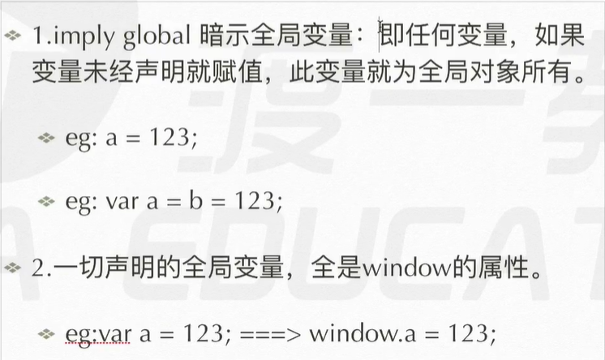 
  - 函数声明整体提升。
- 解释执行：解释一行，执行一行。

##### 预编译

预编译发生在函数开始执行的前一刻。【解决函数执行顺序的问题】

四部曲：

- 创建执行期上下文【AO对象：Activation Object】。
- 找形参和var变量声明，将变量和形参名作为AO属性名，值为undefined。
- 将形参和实参相统一。
- 在函数体内找函数声明（关键字直接声明的函数，不包括函数表达式等），值为自身函数体。

函数执行时，首先从自身AO中获取数据。

- 案例1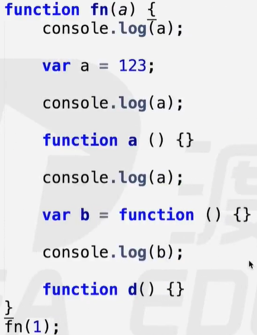 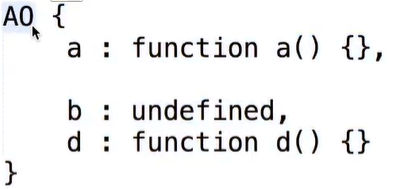 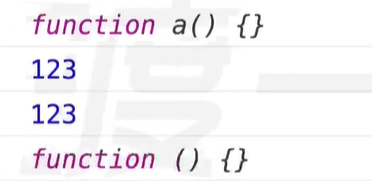 
- 案例2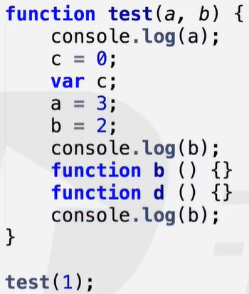 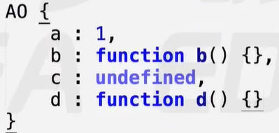 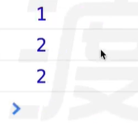 
- 案例3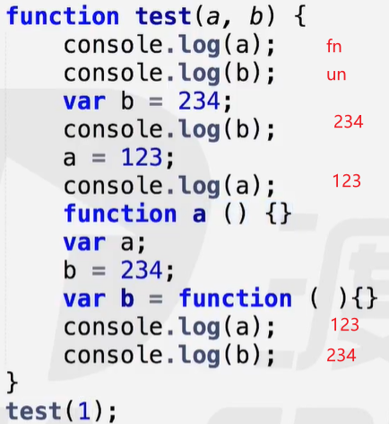 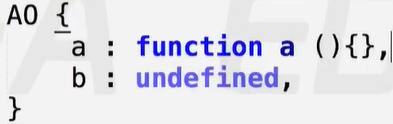 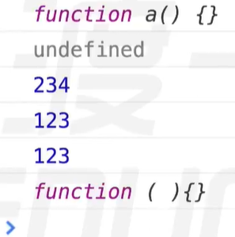 

全局执行上下文【GO对象：Global Object】

- 三部曲：创建GO对象 --- 找变量声明 --- 函数声明
- window对象 === GO对象【全局对象、全局作用域】
- 首先创建GO，遇到函数执行再创建AO。函数执行时先从自身AO，从下往上寻找。
- 案例1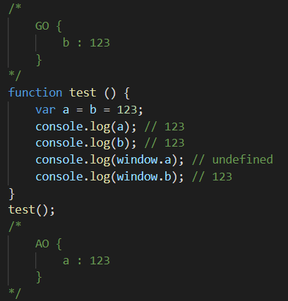 
- 案例2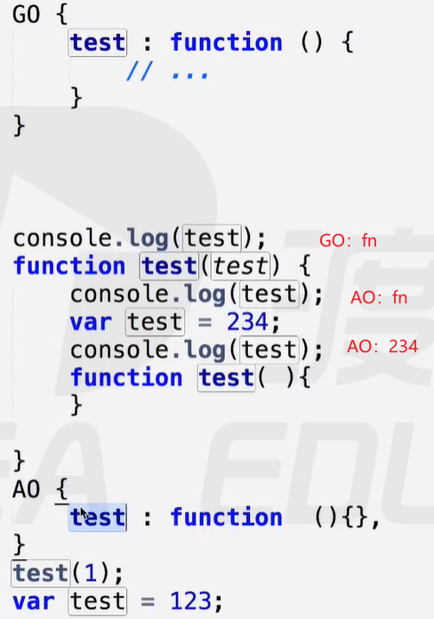 案例3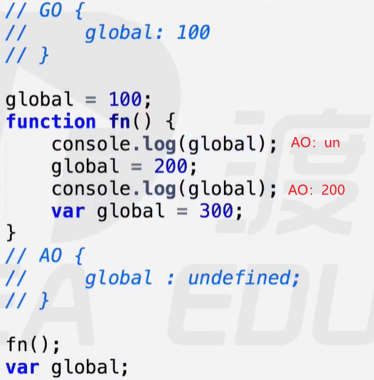 
- 案例4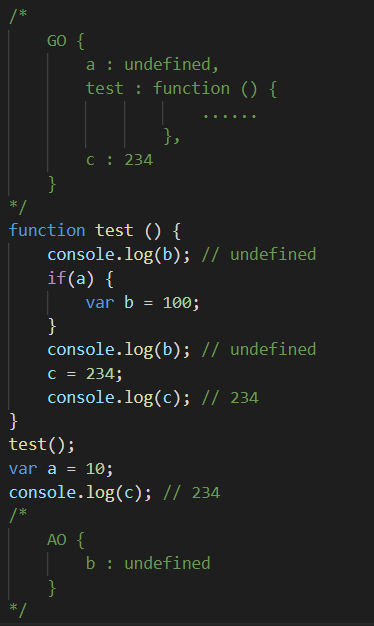 案例5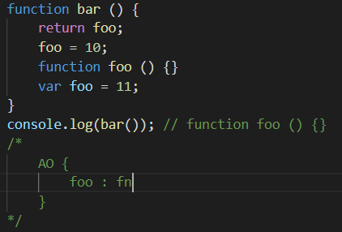 
- 案例6 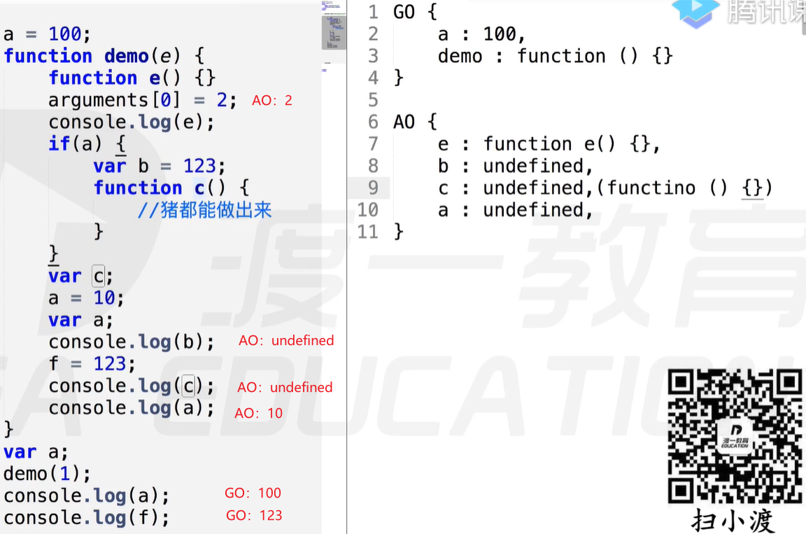 
  - 【注意】if 语句中的函数声明在预编译时不再被识别并提升。如：案例6和案例8【块级作用域】

案例7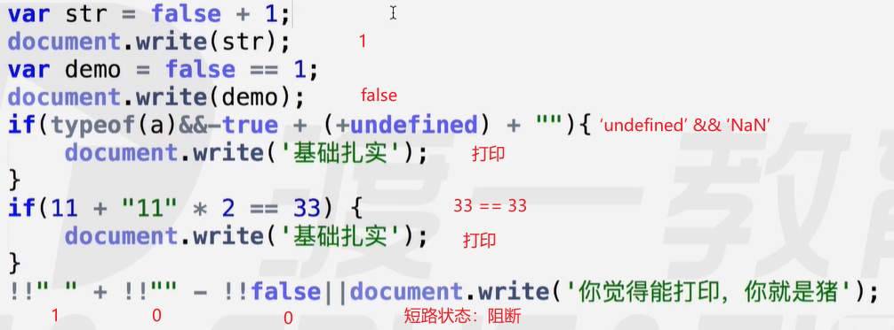 案例8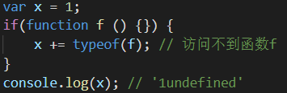 

