# 原型

原型是构造函数实例化对象的公有祖先或者模型，模板等，它是一个对象。

所有生产出来的实例化对象都可以继承该原型上的属性和方法，因此，原型主要用来做公共资源的共享管理。

### 概念：**https://www.jianshu.com/p/72156bc03ac1**

##### 原型（对象属性）

1. Javascript 规定，每一个函数都有一个prototype对象属性，指向另一个对象（原型链上面的）。prototype(对象属性)的所有属性和方法，都会被构造函数的实例继承。这意味着，我们可以把那些不变(公用)的属性和方法，直接定义在prototype对象属性上。
2. prototype 就是调用构造函数所创建的那个实例对象的原型（**proto**）。
3. prototype 可以让所有对象实例共享它所包含的属性和方法。也就是说，不必在构造函数中定义对象信息，而是可以直接将这些信息添加到原型中。

##### 原型链 （JS原型与原型链继承）

1. 实例对象与原型之间的连接，叫做原型链。**proto**( 隐式连接 )
2. JS在创建对象的时候，都有一个叫做**proto**的内置属性，用于指向创建它的函数对象的原型对象prototype。
3. 内部原型 (**proto**) 和构造器的原型（prototype）
   - 每个对象都有一个**proto**属性,原型链上的对象正是依靠这个属性连结在一起。
   - 作为一个对象，当你访问其中的一个属性或方法的时候，如果这个对象中没有这个方法或属性，那么Javascript引擎将会访问这个对象的**proto**属性所指向上一个对 象，并在那个对象中查找指定的方法或属性，如果不能找到，那就会继续通过那个对象的**proto**属性指向的对象进行向上查找，直到这个链表结束。

​                                                      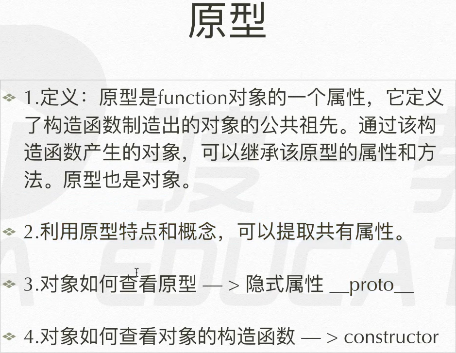 

### 原型的使用

原型作为一个函数的内置属性，在函数声明时诞生。

原型主要用来，让其所有对象实例可以共享资源，从中继承某些属性和方法。

##### 原则：自己有用自己的，自己没有用继承的。

意义：将固有属性和方法写在构造函数内部，每次实例化对象时，都要执行一遍这些固定的代码，造成大量资源浪费。而事先将这些固有属性定义到构造函数的原型上，则只需要执行一次性的赋值操作，此后每一个实例对象通过原型链，就能继承这些方法。

案例：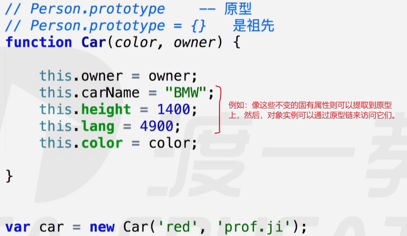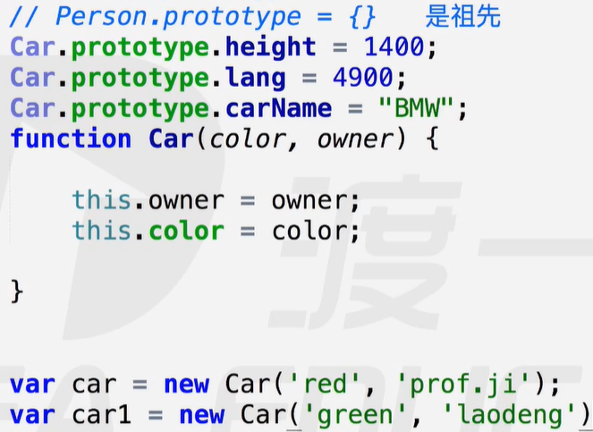  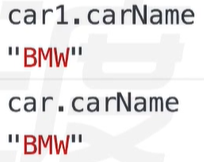 

##### 原型的增删改查：

- 无法通过对象实例去改变原型上的属性和方法，只是给自己增加了一个同名属性。【安全性】
  - 实例通过调用修改原型上的属性和方法：【障眼法】
    - 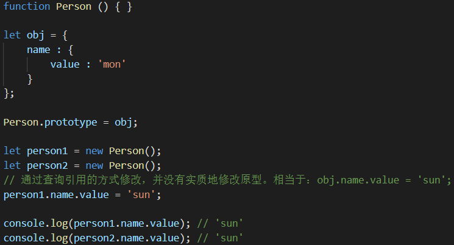 

- 只能通过 Person.proptype 这个原型对象来增改原型。【修改权限】
- 对原型对象的引用修改（以对象赋值的形式），必须在实例化 new 之前，否则修改无效。
  - 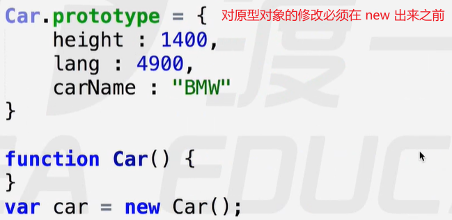 
  - 相当于如下的引用交换。
    - 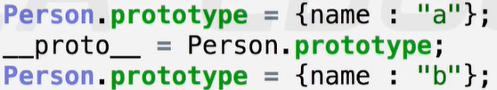 

- 对原型上属性的修改，并没有改变原型对象的引用，因此不必在 new 之前。
  - 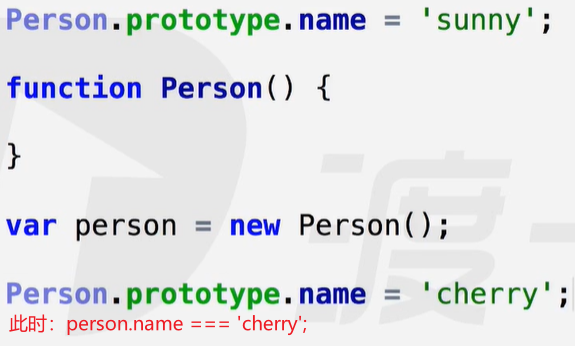 
- 原型上的内置属性：constructor【构造器】，—__proto__—【原型链，原型指针】
  - 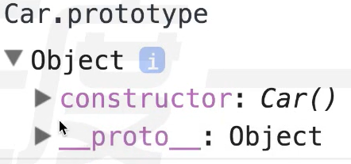 
  - constructor：默认指向该构造函数，可以被修改。
    -  意义：方便对象实例寻找自己的构造函数。【溯源】
  - —proto—：指向原型链的最顶端Object。
    - 意义：所有的数据类型都是对象类型的子类，这些子类在继承Object属性时，做了各自的删改。
    - 关键字new深究：第一步，隐式声明的 this 对象并非全空，而是内置有一个proto属性。
      - 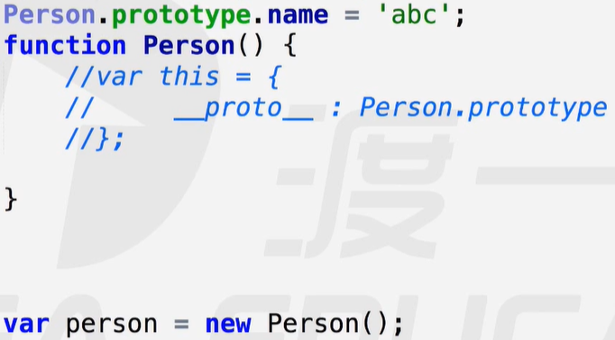 
      - 更换实例原型：通过修改某对象实例上的—proto—指向，可以更换该实例的原型。【仅限于自身】
        - 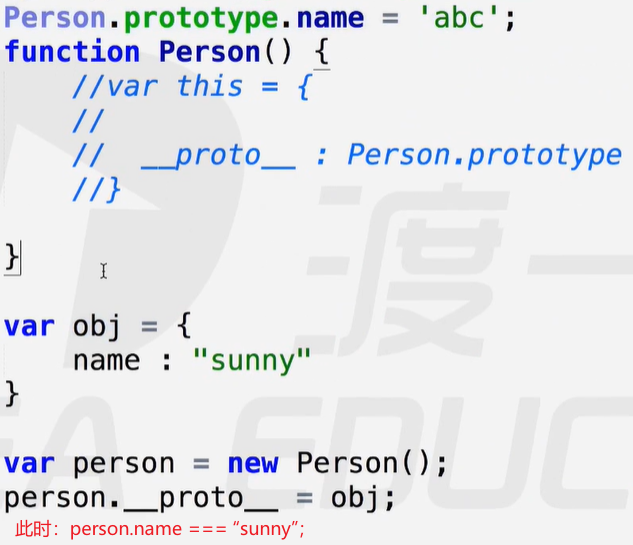  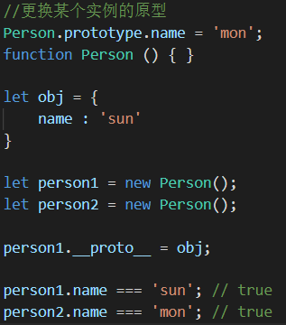 

### 原型链

原型链的连接结点是—proto—，实例原型与构造函数原型，都是通过该结点，将原型对象连成链。

原型链查找方式：从实例对象到Object.prototype，自下而上。

实例原型：person.—proto—  = Person.prototype；

构造函数原型：Person.prototype.—proto— = Object.prototype；

原型链的顶端：Object.prototype；	Object.prototype.—proto— = null；

修改原型链：【注意与修改某实例原型的区别】

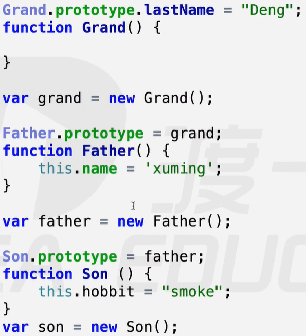  

注意：修改构造函数的prototype关系，将影响到所有实例对象。

### 综合练习

练习1：属性私有化。

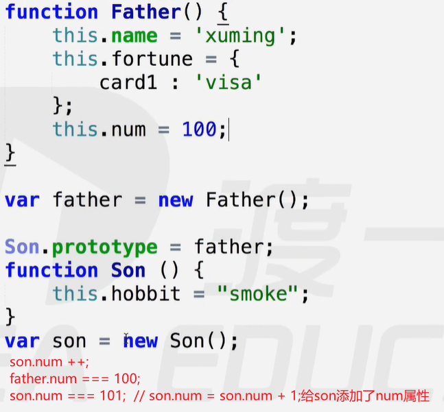 

练习2：this 指向、原型链查找方式

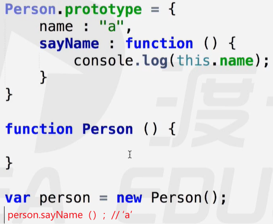 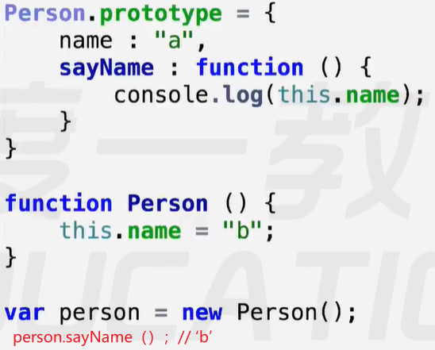 

在对象中，this 默认指向该对象；在函数中，this 默认指向该方法调用者；new 将 this 指向实例对象。

### Object.create方法

Object.create（）方法，也可用来创建一个空对象。

参数：参数一般是一个原型对象，用来指定实例对象的原型。

- 特例：该参数是必需的，没有参数会报错，参数除了Object，还可以是null。
  - Object.create（null）；创建出来的对象没有原型，是一个彻底的空对象。
  - 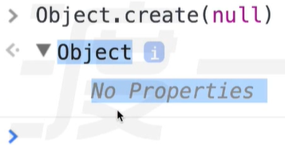 【没有任何属性或方法】
  - 因此，并不是全部对象最终都会继承自Object.prototype。

### 重写toString

Number，String，Boolean，Array，Function等在继承Object.prototype.toString时，重写了toString方法。

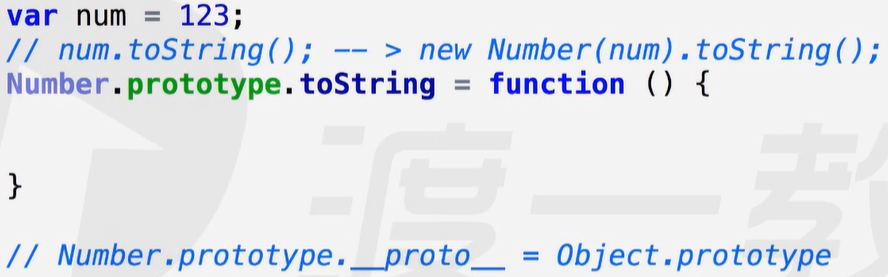 

案例：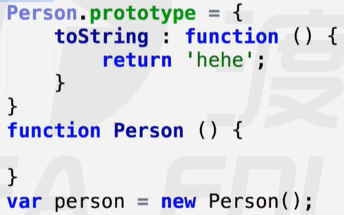 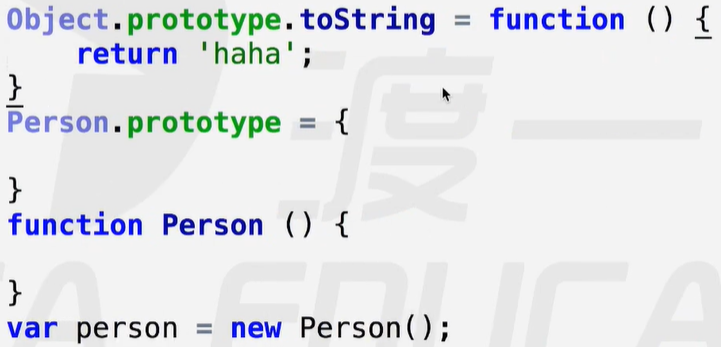 

【实质：在原型链上的截断重写】

系统重写的toString：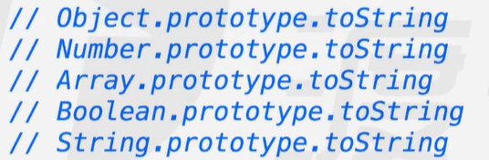 

注意：document.write方法内部调用了toString方法，最终展示在页面的是参数调用toString后的字符串结果。

 

### call / apply 改变this指向

##### call方法：

- 函数执行的实质：
  - 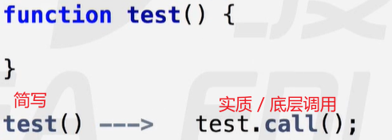 
- 参数
  - 第一个参数应是一个对象，以便将方法调用者所有预设的 this 都指向这个参数所指定的对象。
  - 第二个及后面的参数，作为实参传递。
- 案例1：【借用别人的方法实现自己的功能】
  - 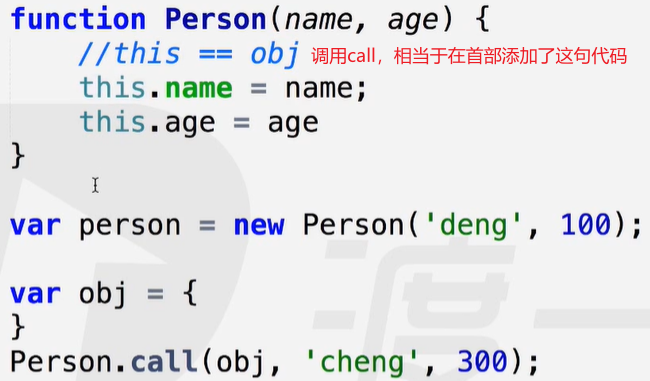 
  - 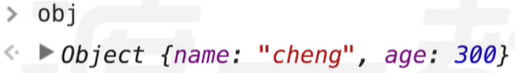 

- 案例2：借用已经定义好的函数，实现自己的功能，减少代码冗余。
  - 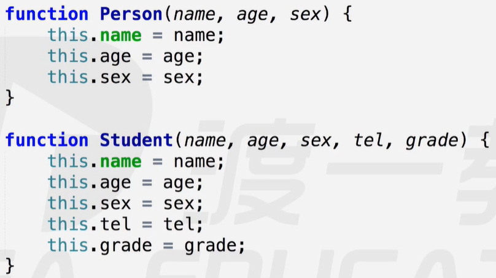 
  - 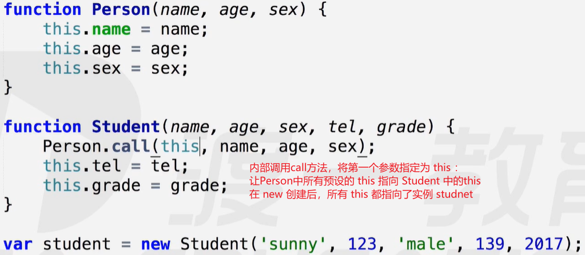 
  - 相当于在构造函数 Student 首部定义了： 
- 案例3：制造汽车的过程
  - 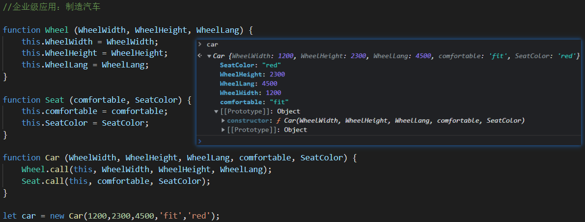 

##### apply方法：

apply与call方法及其相似，区别在于实参传递形式：

- call：实参只能一个一个的传递。
- apply：将实参整合到一个数组中，将这个数组传递过去。

案例：

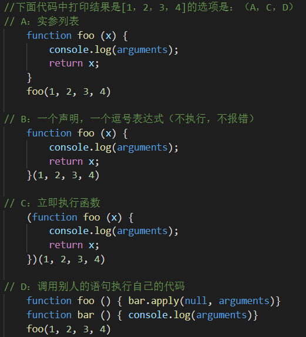 

