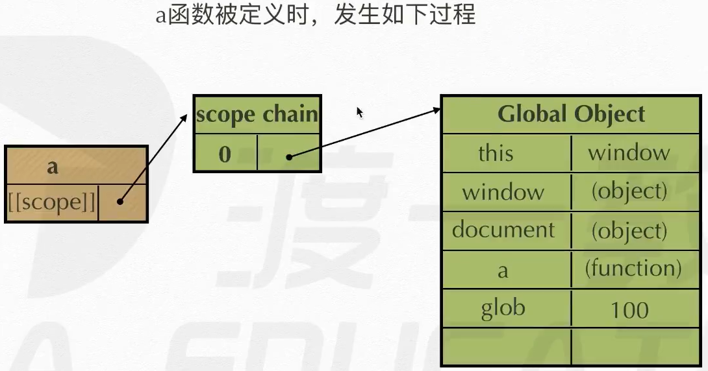
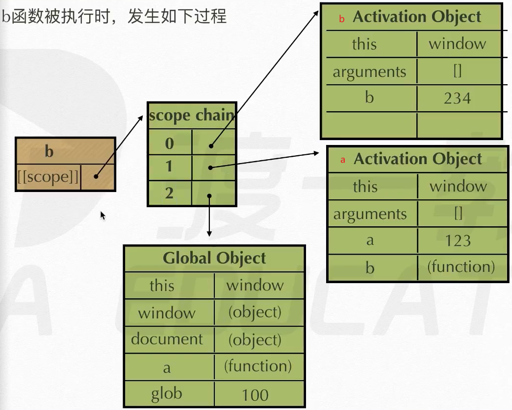

# 作用域精解【scope】

每个函数都有一个独有的作用域，可打印fn.[[scope]]查看。

作用域及作用域链： 

执行期上下文： 

案例1： 

- 函数function a 被定义时：作用域链顶端存着GO
- 当一个函数被定义时，它的[[scope]]中存的是当前所在环境的执行期上下文（GO或父函数作用域链）。
  -  
- 当 函数 a（）执行时，产生自己的AO放在链顶端，GO放在第二位。
  -  
- 当子函数function b 被定义时，继承了父函数 a 的作用域链。
  -  
  - 子函数 b 继承父函数 a 的AO，使用的是它的引用。
- 当子函数 b（）执行时，创建自己的AO放在链顶端，
  -  

- 函数执行完后，立即销毁自己的AO，回归到最初被定义的状态。【销毁：断绝指向关系】
  - 函数 a 执行完，销毁自身AO，连同子函数 b 一起被销毁，回到 a 定义状态，等待被执行。

案例2 

因此，在函数外无法访问函数内的变量。

案例3：

函数 a（）执行时

 

函数 a 执行完，销毁自身AO，并返回子函数 function b，将其赋予变量demo。

函数 demo（）执行时，生成 b 的 AO放到链顶端，继承的 a 的AO排在后面。【形成闭包】

由于a（）执行完已销毁 aAO，但子函数 b 被返回出来，其继承的 aAO仍然可用，而未被彻底销毁，因此形成了闭包。

### 闭包

闭包：本该被及时销毁的AO，由于某种原因，被保留下来且仍可使用，造成未能完全销毁的现象，被称为闭包。

形成闭包的常见情况：

- 内部函数被保存到了外部，并在外部来执行。
- onclick等处于一直监听中的驱动事件。

闭包的应用：

- 函数计数器： 【可以重复使用继承过来的aAO】
- 闭包的作用：
  - 实现公有变量，如函数累加器。
  - 可以做缓存（存储结构），如eater。
    -  
      - 使用num做暂存空间，实现缓存。
    -  
      - 使用food做缓存空间。
  - 可以实现封装，属性私有化。如Person（）。【变量私有化：别人看不见，自己能使用】
    -  
  - 模块化开发，防止污染全局变量。
- 闭包的危害：当内部函数被保存到外部时，将会生成闭包。闭包会导致原有作用域链不释放，造成内存泄漏。
  - 内存泄漏：比喻内存像沙子一样流失，剩余的部分越来越少。

##### 立即执行函数

定义：

被定义好的函数，处于待执行状态，而不被销毁，一直占用系统空间。

而根据实际需求，有些函数只会被执行一次，为了释放内存，用完及时销毁，从而设计出了立即执行函数。

形式：（function （）{ …… }）（）；【用完即销毁，一次性使用】

常用场景：初始化功能

注意：

- 只有表达式才能被执行符号执行，包括算术表达式，函数表达式等。
  - 非表达式无法被执行，如函数声明等。
  - 错误示范： 
  - 正确示范：  
- 能被执行符号执行的表达式，其名称会被自动忽略，重置为undefined。
  -    
- 立即执行函数的特殊形式【本质是将函数声明转换为表达式】
  -  常用符号：正，负，与，或，非，等号，小括号。
  - W3C推荐形式： 
  - 错误示范：
    - 系统会拆分理解为一个函数声明function test，与一个逗号表达式（1，2，3，4）。
    - 不报错但也不会被执行。
- 案例1
  -  【缺陷：打印结果为10个10，而不是0-9】
  -   【改进：利用立即执行函数生成闭包，产生各自独特的AO，被子函数保留】
  -   【最新解决方案】

- 案例2： 

##### 闭包案例

- 案例1：函数计数器【实现公共变量：多对一】

  -  

- 案例2：立即执行函数的闭包【实现属性私有化：一对一】

  -  

- 案例3：onclick等驱动事件

  -  

    

