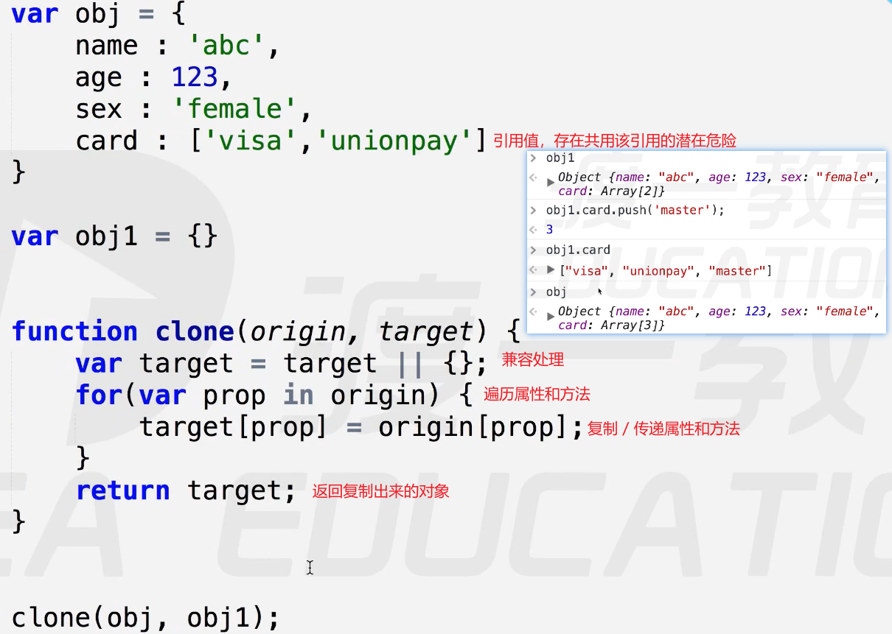
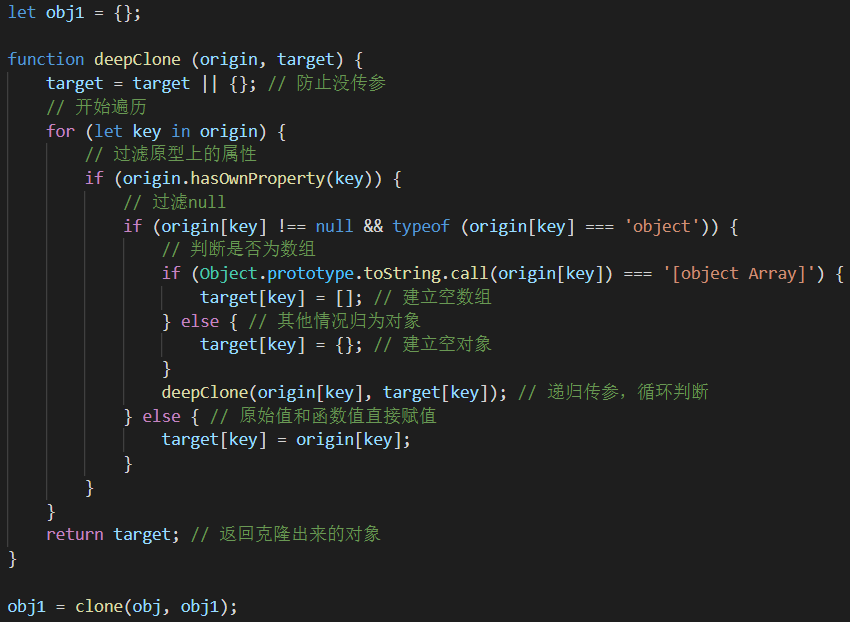

# 克隆

根据一个对象复刻出一个一摸一样的新对象，分为浅克隆和深克隆。

原则：克隆出来的对象不得影响源对象，两者形似但相互独立。

- 浅克隆：仅对原始值的克隆。
- 深克隆：专对引用值的克隆。

浅克隆

- 本质：实质是对栈内存简单的赋值操作，引用值则赋值其地址。
- 缺点：由于实质是对栈数据的简单赋值，克隆引用值时，只是复制了其引用，造成共用引用的影响。

- 案例
  -   
  - obj与obj1共用了card的引用，形成多对一的局面。

深克隆

-  主要考虑对象和数组的复制
-  分析值类型：原始值，数组或对象，创建对应值。
-  三部曲：【遍历每一个值】
   -  判断是简单值还是引用值
   -  简单值直接赋值，引用值判断是数组还是对象
   -  创建对应的空数组或空对象，再次遍历判断，如此循环。【递归：原始值拷贝，引用值遍历】

-  实现：
   -  遍历使用for in循环，既可遍历对象，也可遍历数组。【对象：键；数组：下标】
   -  判断是数组还是对象，推荐使用toString，没有父子域跨域的问题。
   -   
   -  缺点：容易导致内存爆满：`Uncaught RangeError: Maximum call stack size exceeded`

##### 三目运算符

三目运算符是`if……else`分支控制语句的简写式子，也可以连续判断代替`if……else if …… else`。
