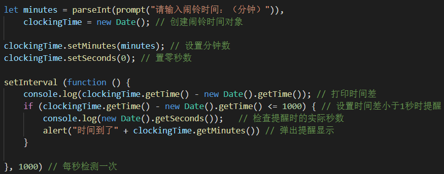
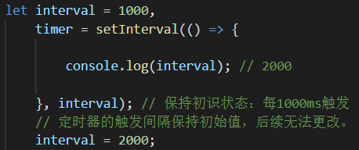

# Date日期构造器

##### 实例化一个日期对象

通过`new Date()`创建一个日期对象，该对象包含了所在地当前的标准时间等信息。

例如：`new Date() ==> Mon Apr 11 2022 09:51:25 GMT+0800 (中国标准时间)`

直接执行`Date()`构造函数，也可以返回如上的时间信息。

### 日期对象上的方法

##### 获取时间【get】

- 返回当前是第几天 / 号数：`getDate()`【1 ~ 31】
- 返回当前是星期几 / 周几：`getDay()`【周日：0，周一：1，……，周六：6】
- 返回当前是第几月 / 月份：`getMonth()`【1月：0，2月：1，……，12月：11】
- 返回当前是哪一年 / 年份：`getFullYear()`
- 返回当前距1900年多少年：`getYear()`【千年虫事件，已弃用：(2022 - 2000) + (1970 - 1900)】
- 返回当前的小时数：`getHours()`【0 ~ 23】
- 返回当前的分钟数：`getMinutes()`【0 ~ 59】
- 返回当前的秒数：`getSeconds()`【0 ~ 59】
- 返回1970年1月1日至今的毫秒数：`getTime() // 被称为"时间戳"`【常用来计算两个日期对象的时间间隔】

注意：

​		以上方法返回的日期信息均来自与日期对象，每一个日期对象记录的信息均定格在被实例化的那一刻。

​		即：`date`中记录的信息是过去被创建的时间，以时间戳`getTime()`方法为准。

​		计算机纪元时间：1970年1月1日 00 : 00 : 00 

时间戳作为日期对象的唯一标识，常用来计算前后两个日期对象的时间差。如：测试程序运行的时间。

##### 设置时间【set】

与获取方法相配套的，还有设置时间的方法。例如：设置号数，周几，月份，小时等。

使用方法：`setDate()`方法设置`date`对象的号数为指定的号数，其他方法类似。

应用场景：`set`系列的方法可以配合定时器来设置各种闹铃程序【接近指定的时间时开始执行】

  


### 定时器

定时器：每隔多少毫秒触发一次，每一次都执行一遍里面所有的代码。

定时器分两种：Interval -- 间隔器（循环执行）； Timeout -- 超时器（执行一次）

##### 设置间隔定时器【`setInterval()`】

参数：（回调，触发间隔）

- 回调：定时器的主要处理程序，不考虑this一般使用箭头函数。
- 触发间隔：触发间隔以毫秒为单位，一旦确定后续无法更改。
  -  

注意：定时器并不准，每一次触发的间隔并不总是理想的，有时快，有时慢。

```js
// 检测每一次触发的间隔
let firstTime = new Date().getTime(); // 开始时间
setInterval(() => {
    let lastTime = new Date().getTime(); // 触发时间
    consloe.log(lastTime - firstTime); // 实际时间间隔
    firstTime = lastTime; // 更新每一次的开始时间
}, 1000)
```

##### 定时器标识

每一个定时器都有一个返回值，这个值是一个数字，作为该定时器的唯一标识。

##### 清除间隔定时器【`clearInterval()`】

使用`clearInterval()`方法，通过定时器的唯一标识，清除指定的定时器。

参数：（定时器标识）

```js
    let interval = 1000,
        timer = setInterval(() => {

            console.log(interval); // 2000
            // 通过定时器标识关闭定时器
            clearInterval(3); // timer == 3
        }, interval);
```

`clearInterval()`方法必须写到定时器内部，才能正常使用定时器。写到外部（立即关闭）是没有意义的。

##### 设置超时定时器【`setTimeout()`】

超时定时器按照延迟时间倒计时，时间到了才开始执行，且只执行一次（自动暂停）【一次性定时器】

参数：（回调，延迟时间）

例如：`setTimeout(() => {}, 1000); // 在1000ms后，开启定时器`

##### 清除超时定时器【`clearTimeout()`】

与间隔定时器一样，超时定时器具有自己的标识，且与间隔定时器依次排号。

注意：由于定时器是定义在`window`上的方法，其回调函数的`this`默认指向`window`

```js
 let timer = setInterval(() => {
     console.log(this); // 箭头函数的this指向外部环境的this，而定时器的this默认指向window
     					// 因此，无论以哪种函数作定时器的回调，其this都默认指向window
 }, 1000);
```

##### 特殊形式

定时器的第一个参数通常是回调处理程序，但是也可以直接写一段字符串形式的简单代码来代替，定时器正常执行。

```js
setInterval("console.log("a");", 1000); // 每隔一秒执行一次回调语句（打印"a"）
```

推荐书籍：《你不知道的JavaScript》

### 作业

设置一个计时器，到三分钟时停止

```html
<style>
        div input {
            width: 30px;
            height: 20px;
            border-radius: 5px;
            outline: 1px solid rgba(0, 0, 0, .8);
            font-size: 18px;
            font-weight: bold;
            text-align: right;
        }
</style>
<div>
        minutes：<input type="text" name="" value="0">
        seconds：<input type="text" name="" value="0">
</div>
<script>
    let minutesNode = document.getElementsByTagName("input")[0],
        secondsNode = document.getElementsByTagName("input")[1],
        minutes = 0,
        seconds = 0;

    let timer = setInterval(() => {
        seconds++;
        if (seconds === 60) {
            seconds = 0; // 秒数清零
            minutes++; // 分钟增一
        }
        minutesNode.value = minutes; // 对于内置属性可以直接通过DOM元素来读写
        secondsNode.value = seconds; // 自定义属性使用get和setAttribute方法
        if (minutes === 3) {
            clearInterval(timer);
        }
    }, 1000); // 理论上：每秒执行一次，实际并不总是准确。
</script>
```

