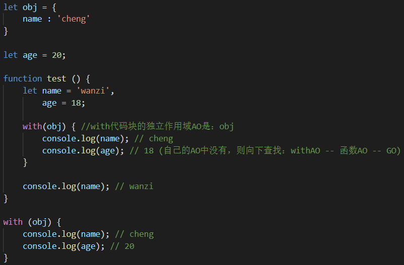

# 复习

### delete删除对象属性

`delete`无法删除不可配置的属性，如：使用关键字声明的属性。

`delete`只能删除直接定义在对象上的属性，在全局使用`var`声明的变量归`window`所有，但它们不可配置。

 

### Object.create创建对象

`Object.create`方法，第一个参数为原型，第二个参数为配置对象：可读，可写，可枚举等。

### 引用值的类型转换

引用值的类型转换，一般不用考虑，其实质是调用`String（）`转换。

 

### undefined和null

`undefined`和`null`作为两类独立类型的原始值，不能和数字型进行比较大小。

由于`undefined`派生自`null`，因此：`null == undefined`，但`null !== undefined`。

### arguments

`arguments`等类数组本质上还是对象，因此：`typeof arguments === “object”`

### 函数表达式

函数表达式中，函数声明时的函数名被自动销毁：`undefined`

 

### 简化代码

 

### try … catch

当与后端交互时，后端传送过来的数据不一定真实有效，便会导致报错。

而当不确定代码是否会报错时，为避免报错停止程序，可使用`try … catch`来捕获错误。

使用：

- 将可能出错的代码放到`try`中尝试执行，遇到错误立即停止代码块调试，去执行`catch`中的代码。

- `catch`用来捕获错误，系统将错误信息对象`error`传递给`catch`，通过`catch`来打印出错误信息。

  - error的两个属性：name（名称头），message（主要信息）。如：`ReferenceError a is not defined`

- 控制台报错信息中的`Uncaught`表示：未捕获到的信息，即不是使用catch捕获到的信息 / 自动报错。

- 在`catch`中抛出错误，先执行抛出；若不抛出错误，则继续执行程序中的其他代码。

  -  

  -  

- `finally`表示最后应执行的代码。有`finally`执行`finally`，再执行后面的其他代码。

### 六大错误类型

 

常见的错误有：引用错误`ReferenceError`和语法解析错误`SyntaxError`

- 引用错误一般是，未经声明就使用（非法引用）的情况，如：使用未声明变量，函数等。
- 语法解析错误发生在语义分析时，报出低级错误。`Invalid or unexpected token`

### 严格模式【"use strict"】

`ES5`的严格模式，主要用来解决`ES`语法升级后，与`ES3`冲突的语法问题。

默认执行`ES3 + ES5新增`语法，当开启严格模式后，完全使用`ES5`的语法。

开启严格模式，必须将严格模式代码作为作用域的第一句可执行代码。

根据作用域的不同，分为：全局严格模式和局部严格模式，推荐使用局部严格模式。

注意：

- 开启严格模式后，部分`ES3`语法无法使用，如：`caller`，`callee`，`arguments，with，eval`【TypeError】
- 不兼容`ES3`冲突语法的严格模式代码以字符串形式表现，本身是为了兼容`ES3`的语法。
- 严格模式下，局部的`this`必须被赋值，赋的值是什么，`this`就是什么【局部默认为`undefined`，全局是window】
- 禁止未经声明就使用，重复声明变量，拒绝重复的属性和参数。

### with：改变作用域链顶端

`with`是`ES3`的语法，在严格模式下不允许使用，它产生自己独立的作用域`AO`，主要用来简化代码。

`with`的参数是一个对象，它可以将`with`代码块的作用域链顶端指向该对象而独立存在。

`with`的作用域链顶端是自己的独立作用域`AO`，后面依次是环境的执行期上下文，满足链式查找。

 

应用1：命名空间

 

应用2：直接使用对象上的方法

 

缺点：作用域链的生成是很复杂的事情，with改变作用域链顶端，系统要消耗大量资源去重新生成作用域链，导致执行缓慢。

### eval

`eval`可以将字符串当作`JS`代码来执行，如：`eval("console.log(a)")`。

`eval`功能十分强大，它也能改变作用域。"因强大而被禁用"

`ES`语法虽然在实际开发中很少用到，但却在面试的知识中占`70% - 80%`

