# 数组

创建数组的实质是：`new Array()`，即：数组的所有方法继承自`Array.prototype`

数组是基于对象设计出来的，可以通过`[]`或`.`的方式访问其成员。

字面量：

- 稀松数组：
  - `[ , ,] === [undefined, undefined]`
  - `[1, , 1] === [1, undefined, 1]`
- 构造数组：
  - `new Array(1, 3, 4) === [1, 3, 4]`
  - `new Array(3) === [un , un, un]`【有且只有一个参数时，该参数被当作长度】

数组的常用方法：

- 改变原数组
  - `push`：在尾部添加，可以同时添加多个，返回长度。
    - 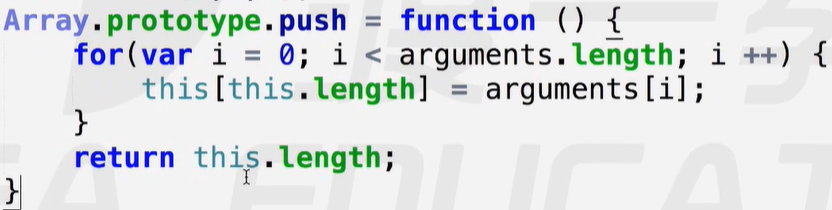 
  - `pop`：截取最后一位，无参，一次只能截取一个，返回删除值。
  - `unshift`：在首部添加，可添加多个，返回长度。
    - 将原数组通过遍历`push`进`arguments`中，形成一个新数组返回。
  - `shift`：在首部删除，返回删除值。
  - `reverse`：翻转数组，返回翻转数组。
    - 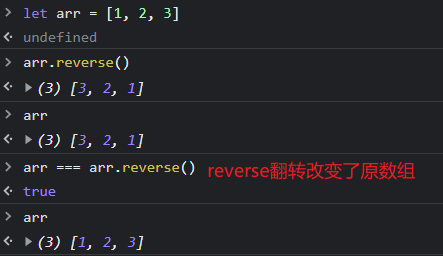 
  - `splice`：切片，常用来添加数据。
    - 参数：`(位置，长度，添加值)`
      - 位置：从哪个位置 / 下标 开始；【数组中负数表示反方向，倒数第几位】
      - 长度：切除多少位 / 长度；【0表示空切，切出口子，用来占位】
      - 添加值：第三个及以后的参数是要从切口处新添加的值。
    - 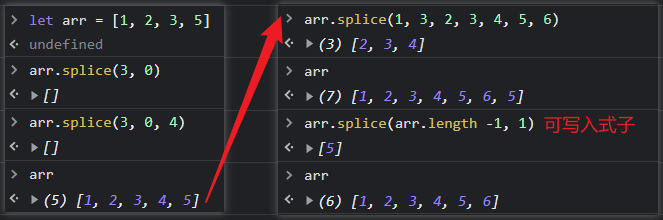 
    - 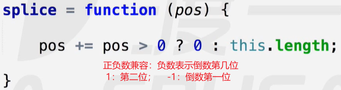 
  - `sort`：排序，将无序数组排列成有序数组，默认升序。
    - 降序：`arr.sort().reverse()`
    - 规则：按字典查询法比较`ASCII`码排列。`[1, 10, 100, 2, 3]`
    - 任意排序：`sort`留下一个编程接口，让编程者设置排序规则。
      - 设计一个方法作为`sort`的形参，方法中设有两个形参。
      - 冒泡规则，`sort`调用该方法传参比较大小，通过返回值，决定如何排序。
        - 传递两个位置上的值，进行比较 / 作差。
        - 正数：交换位置； 负数 / 0：保持不变。
      - 通过设置比较规则及返回值，控制升序或者降序。
      - 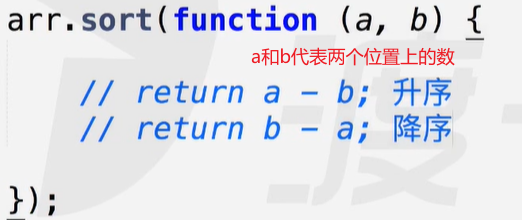 
    - 将一个有序数组乱序：
      - 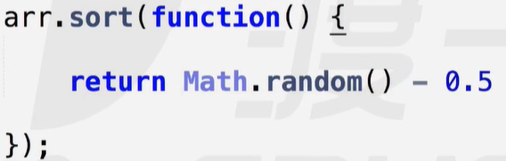 
    - 翻转数组：`arr.sort(() => { return -1; })`

- 不该变原数组，其余所有的内置方法都不改变原数组。
  - `concat`：连接两个数组，返回值新数组。
  - `toString`：将数组转换为字符串，返回值字符串：`[1, 2, 3] => "1, 2, 3"`
  - `slice`：截取数组，返回值截取的数组。
    - 参数：`（开始位置，结束位置）`
      - 两个参数，从开始位置截取，到结束位置为止(不包括)。
      - 一个参数，表示从该位开始截取，一直到最后。
      - 不填参数，表示截取整个 / 复制数组。【可用于将类数组转换为数组】
    -  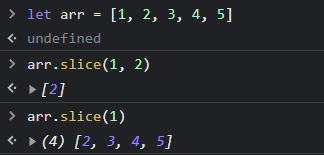 
  - `join`：以指定符连接数组中每一个值，并转换为字符串，返回值字符串。
    - 参数：原始值均可，系统推荐：字符串。
    - 将数组中的值转换为字符串：
      - 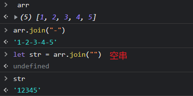 
    - 连接多个字符串：
      - 字符串存在栈内存中，先进后出，每一次拼接都要来回存取，浪费效率。
      - 可以先将所有字符串存入一个数组中，通过`join`转换为字符串。
      - 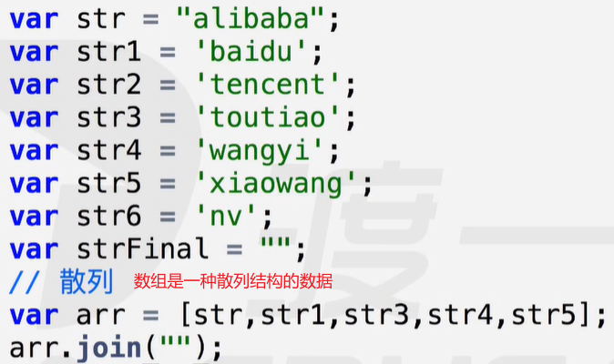 
  - `split`：`split`是字符串的方法，可以将字符串以指定符拆分组装成数组。
    - `join`是数组的方法：将数组转换为字符串。
    - 将字符串转换为数组：
      - 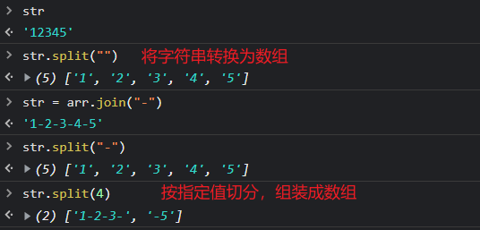 

### 类数组

类数组是一种类似于数组的数据结构，如：`arguments，HTML Collection`，它们可以像数组一样使用。

##### 创建一个类数组：

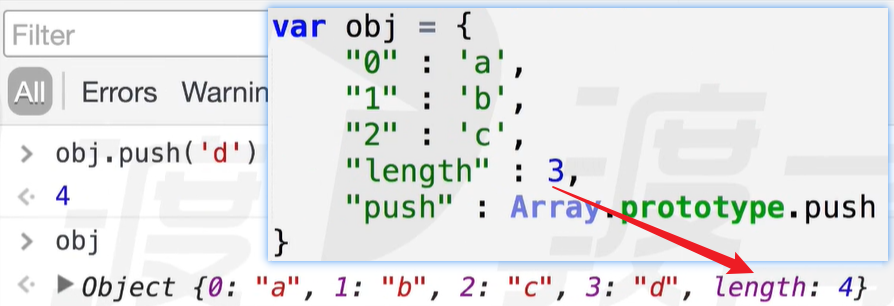 

必要条件：

- 属性要设置为索引 / 数字形式 属性：`[0, 1, 2, 3]`
- 必须有`length`属性【关键】，最好加上`push`属性
- 一旦给一个对象添加数组原型的`splice`方法后，这个对象就会变成数组形式。

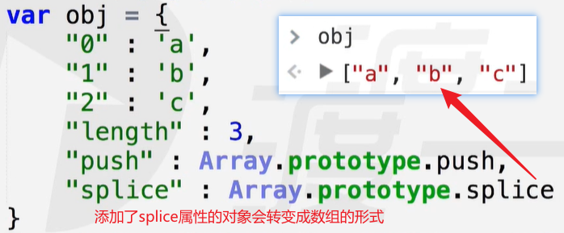 

这个转变而来的"数组"仍然是对象，但它可以像数组一样使用，被称为"类数组"。

使用`push`方法：

- 模拟内部原理：
  - 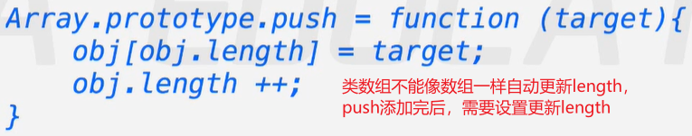 
- 案例1：修改值
  - 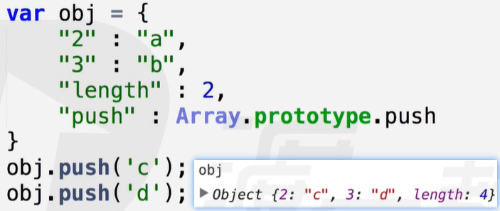 
- 案例2：空的位置上为`"empty"`，如：`{empty, 1 : "a", 2 : "c", 3 : "d", length : 3}`
  - 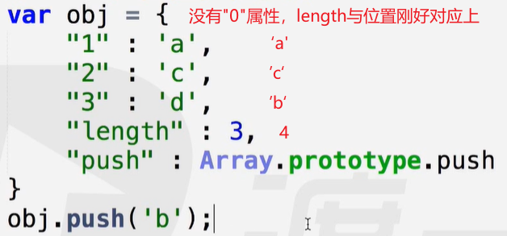 

优点：结合了数组与对象的两方面特点，能存储更丰富的数据。【因此，DOM中的数组全是类数组】

### 作业

作业1：封装`type`方法

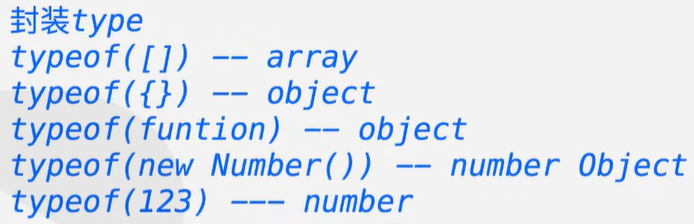 

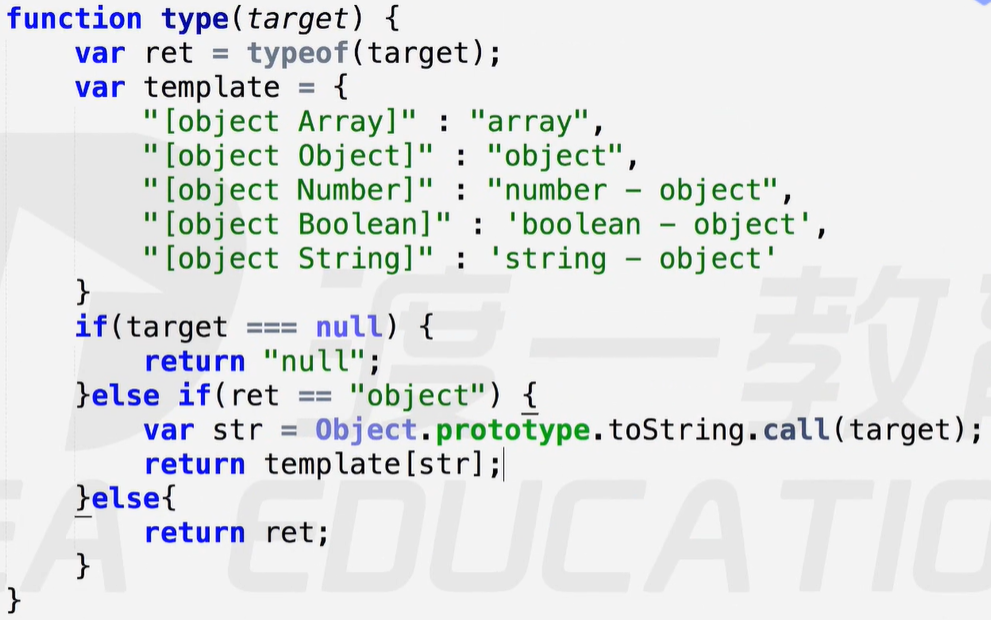 

作业2：数组去重

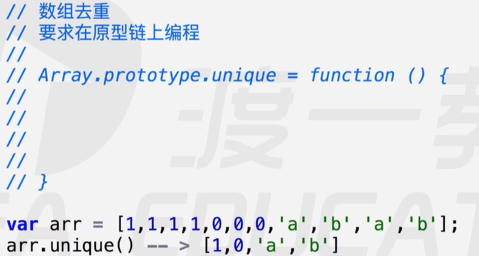 

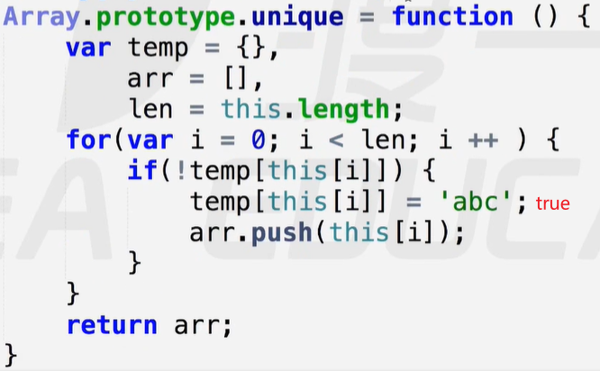 

