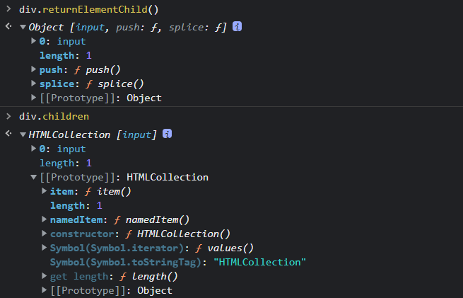

# DOM操作

`<html>`标签是文档的根标签，而`document`才真正代表了整个文档，相当于`<html>`的父标签。

​              

`document`通过生成一个`DOM`树，操作树上的各个节点，来控制`document`文档结构。

### 查看元素节点：

##### 通过id获取节点元素

获取唯一性的节点元素，不区分大小写，最终转换为小写来处理。`IE8`以下浏览器，也可以匹配`name`指定的元素。

##### 通过标签名获取

`getElementsByTagName()`方法将获取到的元素放入一个`HTML Collection`（类数组）中，通过索引取出元素。

##### 通过name属性获取

`getElementsByName()`方法可以通过标签的`name`值来获取元素，返回一个类数组。

##### 通过类名获取

`id`通常作为模块总称来使用，后端通过`id`来获取使用模块后，一般会更改为后端想要的`id`。

因此在实际开发中，经常使用的是通过类名和标签来获取元素，`id`选择器通常只用到一两次。

##### 按`CSS`选择器获取

`querySelector()`和`querySelectorAll()`方法，都可以直接使用`CSS`选择器来获取元素。

区别在于：`querySelector()`只选择一个指定元素，而`querySelectorAll()`选择一组符合条件的（类数组）。

缺点：

- `querySelector()`和`querySelectorAll()`是静态方法，获取元素的方式不是实时的【`get`方法是实时的】
- 实际开发中，删除元素或者添加元素之后，需要实时更新页面结构，更新节点的获取结果。
- 而`querySelector()`和`querySelectorAll()`获取到的是一个节点副本，永远保持初始的获取结果。
- 由于这两个获取方法，不能根据页面结构变化实时更新获取，因此，在实际开发中也很少使用。

##### 基于一个元素获取周边 / 根据DOM树获取 / 遍历节点树

可以通过一个元素节点，来获取它周边的节点。

实质：每一个节点元素都具有一系列方法，如：获取父节点，获取子节点，获取兄弟节点等。

在`DOM`树中，最顶层的节点是`document`，即`<html>`元素的父节点。【`document`是单独的节点，不是元素节点】

获取节点方法：

- 获取父节点：`parentNode`
- 获取子节点：`childNodes`【节点包括：元素节点1，属性节点2，文本节点3，注释节点8等】
- 获取第一个子节点：`firstChild`
- 获取最后一个子节点：`lastChild`
- 获取兄弟节点：前一个`previousSibling`；后一个：`nextSibling`【sibling：兄弟，同级】

##### 基于元素节点树的遍历

由于节点的类型有很多，遍历节点树会获取大量无关的节点（文本节点，注释节点等）。

而当开发者只想要通过节点元素来获取周边的元素节点时，则要使用基于元素节点树的遍历方法。

获取元素节点方法：

- 获取父元素节点：`parentElement // IE9不兼容`【由于`document`不是元素节点，获取结果为`null`】
- 获取子元素节点：`children`【其他方法`IE9`都不兼容，该方法是最常使用的】
- 第一个子元素节点：`firstElementChild`；最后一个：`lastElementChild`
- 获取子元素节点个数：`childElementCount === children.length`
- 获取兄弟元素节点：`previousElementSibling`；后一个：`nextElementSibling`

##### 节点的四个属性

- 节点名：`nodeName`【只读属性】
  - 获取当前节点的名称
  - 元素：标签名（大写），文本：`#tex`t，`document`：`#document`，注释：`#comment`等等
- 节点内容：`nodeValue`【可读写】
  - 获取当前节点的文本内容
  - 该属性仅用于`Text`文本节点和`Comment`注释节点，方便修改文本内容及注释内容。
- 节点类型：`nodeType`【只读】
  - 获取当前节点的类型，最常使用的属性
  - 元素节点：1；属性节点：2；文本节点：3；注释节点：8；`document`：9；等等
- 属性节点集：`attributes`
  - 获取当前元素节点的属性集合，将该元素节点的属性节点放入一个类数组中。
  -  
  - 属性节点上有两个重要属性：`name`属性名【只读】和`value`属性值【可读写】。

##### 判断节点是否有子节点【`hasChildNodes（）`】

通过`hasChildNodes（）`方法，可以判断当前节点是否具有子节点。

##### 模拟`childre`实现

封装

  

模拟

 

 

