# DOM操作

### DOM树

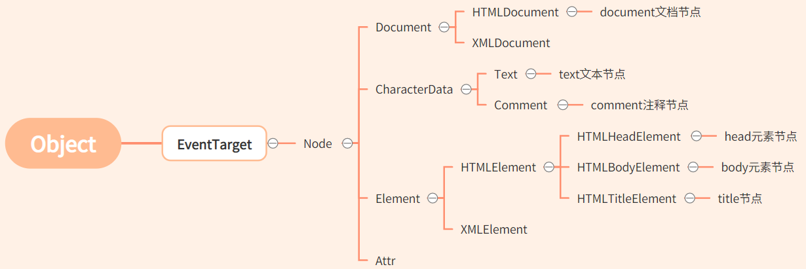 

##### DOM树继承

- `getElementById`定义在`Document.prototype`上，即`Element`的节点不可以使用。
- `getElementsByName`定义在`HTMLDocument.prototype`上
- `getElementsByTagName`定义同时在`Document.prptotype`和`Element.prototype`上
  - 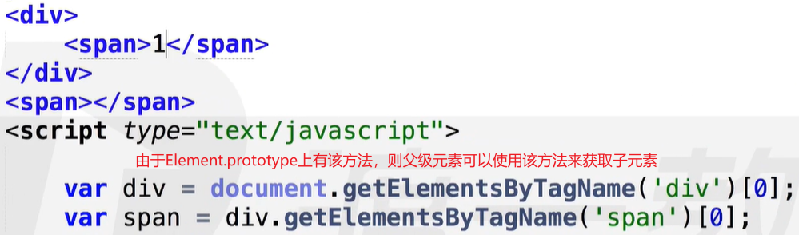 
- `HTMLDocument.prototype`上还定义了两个重要属性：`head`和`body`，分别代指`<head>`和`<body>`两个标签。
  - 即：`document.head ==> <head>`	;	`document.body ==> <body>`【直接使用，无需获取】
- `Document.prototype`上定义了`documentElement`属性，指代文档的根元素【`HTML`中指`<html>`元素】
  - 即：`document.documentElement ==> <html>`【根元素是`html`，根节点是`document // getRootNode()`】
- `getElementsByClassName`，`querySelector`和`querySelectorAll`同时定义在`Document`和`Element`的原型上
  - 即：`document`可以使用这些方法获取内部元素节点，元素节点同样可以使用。
- `children`同时定义在`Document`和`Element`的原型上
- `childNodes，lastChild，firstChild，removeChild，appendChild，replaceChild`和`hasChildNodes`均定义在`Node`原型上
- `Node`原型节点上的方法：
  - 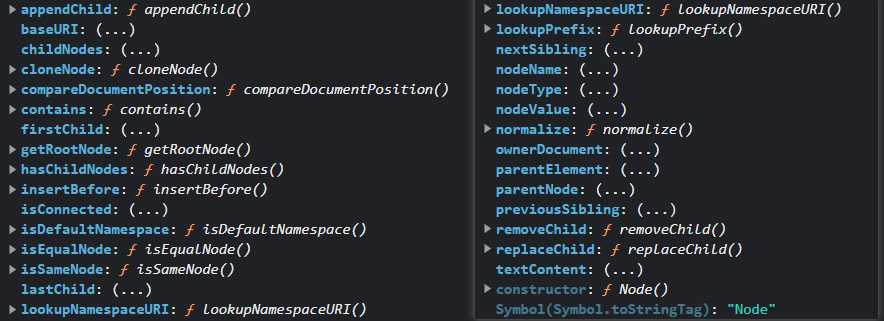 

### 案例

案例1：【递归的本质是循环，有时结构循环简单，有时递归简单】

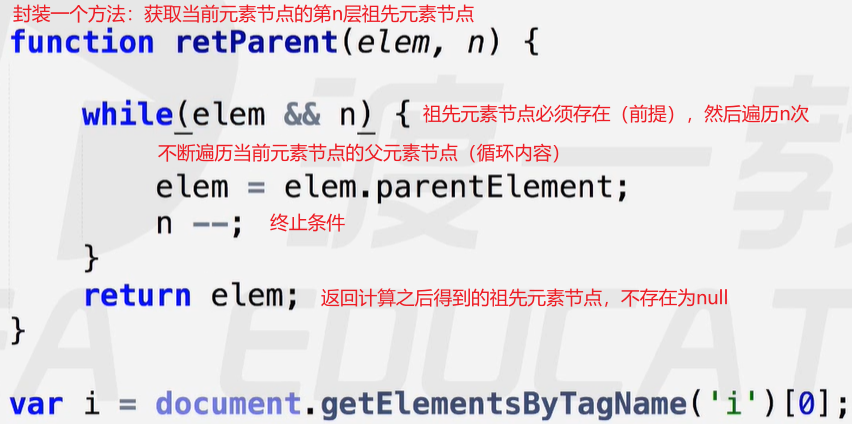 

案例2：

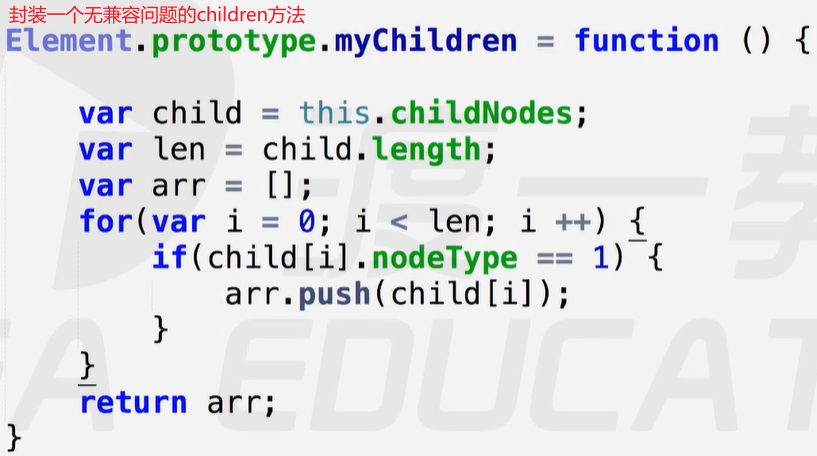 

案例3：

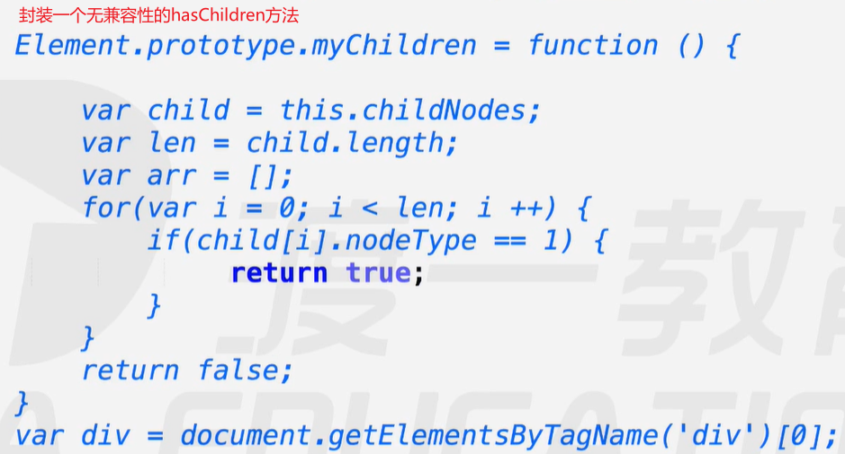 

案例4：获取第n个兄弟元素节点【正：后第n个；负：前第n个；0：自己】

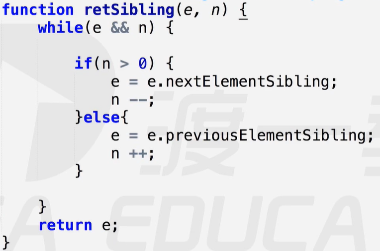 

【注意：在`while`循环中判断相比在判断后循环`while`往往更精简灵活】

案例5：封装无兼容性的案例4

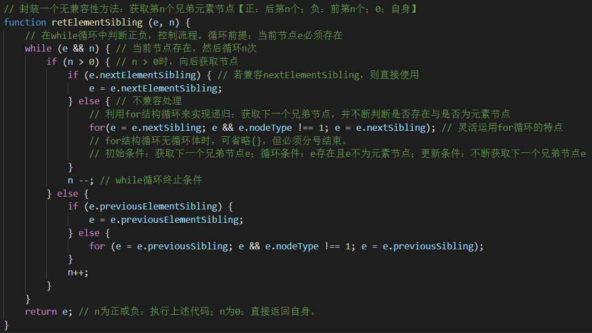 

### DOM操作

##### 增加 / 创建节点【create 均继承自Document】

- 创建元素节点：`document.creatElement()`【一次只能创建一个元素节点】
- 创建文本节点：`document.createTextNode()`
- 创建注释节点：`document.createComment()`
- 创建文档碎片节点：`document.createDocumentFragment()`

##### 删除【remove继承自Element，removeChild继承自Node】

- 删除子节点：`parent.removeChild() // 通过父节点删除指定节点 -- "他杀"`，返回值：删除节点。
- 删除自身节点：`remove() // "自杀"`，返回值：undefined【彻底销毁】

##### 插入 / 剪切子节点【appendChild与insertBefore均继承自Node】

- 节点被创建出来之后，必须插入到页面中才能被显示出来。
- 插入子节点：`appendChild()`【任何一个节点都可以使用该方法，来插入一个指定的子节点】
- 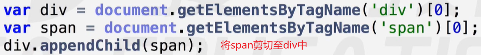 
- 在指定节点之前插入一个节点：`ParentNode.insertBefore(a, b) // 通过父节点在子节点b的前面插入节点a`
- 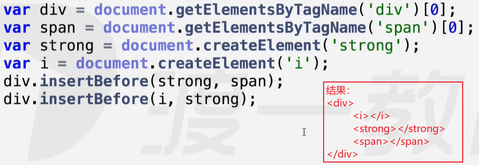 
- 将页面中已经存在的节点，插入指定父节点时，都会变成剪切与粘贴的操作。

##### 替换子节点【replaceChild继承自Node】

- 替换子节点：`parentNode.replaceChild(a, b) // 通过父节点将子节点b替换为节点a,即：a替换b`
- 返回值：被替换的子节点

##### Element节点的属性和方法

在`Element`节点的原型上定义了一些常用的属性和方法，如：`innerHTML`，`setAttribute`等。

常用属性：

- `innerHTML`：重置为`HTML`语法解析的内容，可以根据`HTML`语法解析添加内容。
- `innerText`：重置为纯文本内容，一律转换为字符串文本添加，不能解析内容。
- 注意：这两个属性是直接完全覆盖内部的内容，要想添加，应使用`+=`操作符。
- `innerText`在老版本的火狐浏览器中是没有的，同样功能的是`textContent`。

常用方法：

- 获取节点属性：`getAttribute("属性名")`
- 设置节点属性：`setAttribute("属性名", "属性值")`
- 这两个属性通常用于获取或设置元素节点的行间属性，支持设置自定义属性。
- 操作元素节点的`class`类名，可以直接使用`className`属性来读写。

### 案例

案例1：封装一个`insertAfter`，类似于`insertBefore`

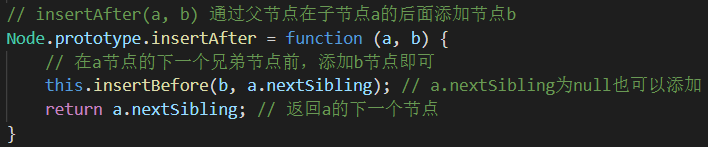 

【注意：`insertBefore(a, null)`表示通过父节点将子节点`a`排到最后，因为`null`是隐式的最后一个子节点】

### 作业

将目标节点内部的节点逆序

例如：`
<em></em><b></b>
 ==> 
<b></b><em></em>
`

