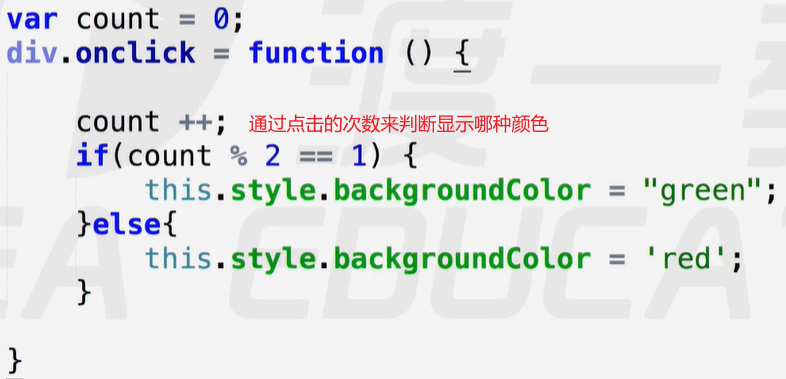
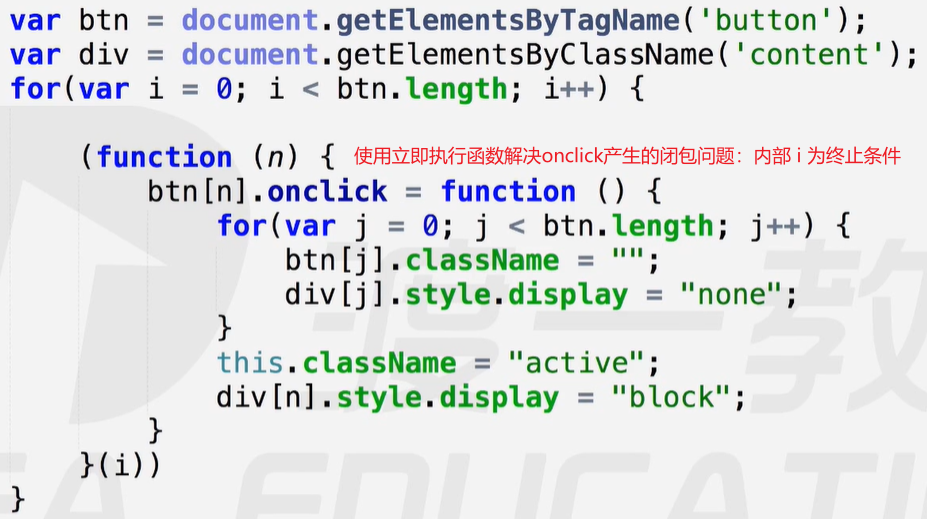
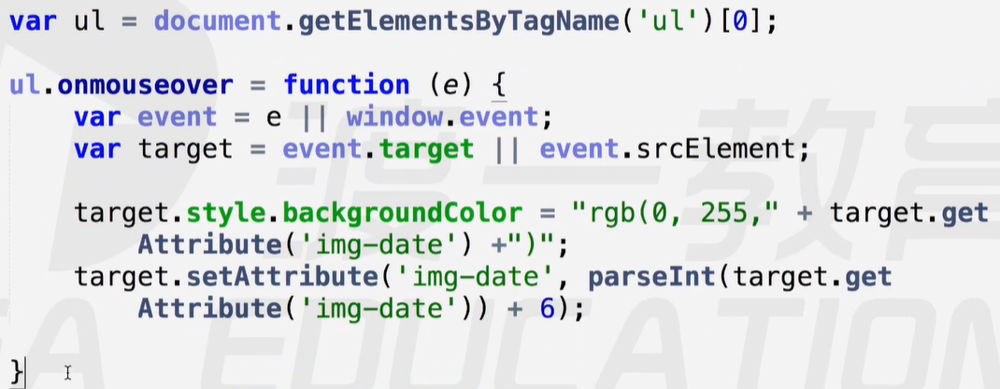

# DOM初识

`DOM`只能操作`HTML`和`XML`的页面结构，目前任何应用接口都操作不了`CSS`样式表。【`JS`代码操作的是行间样式】

`XML`可以自定义标签，可以存储数据，曾用来作为一种数据传输的格式，后被`JSON`取代而销声匿迹。

### DOM对象

使用`DOM`选择器选择出来的元素，是一个`DOM`对象。

案例1：点击循环变色 `[第1次：绿色，第2次：红色，第3次：……] => [绿，红，……，绿，红……]`

 

编程思想1：实现状态的变化，通常使用计数器或者true / false 来记录状态。【状态变量】

案例2：选项卡

 

编程思想2：实现类似选项卡功能，需要先清空所有项的状态，再单独为某一项添加状态。

### 定时器【setInterval】

定时器，每隔一段时间执行一次回调函数。

参数：

- 第一个：要执行的回调函数
- 第二个：时间间隔，单位`ms`

应用：

定时器可以让物体运动起来，那么通过控制其速度，就可以设计出复杂多样的运动方式 / 动态效果。

##### 关闭定时器【clearInterval】

可以通过赋值的方式，给定时器命名。然后使用该名关闭指定的定时器。

参数：

- 第一个：定时器名（要关闭哪个定时器）

### 事件对象【Event】

事件对象用于描述所产生的事件。调用事件处理程序时，`JS`会把事件对象作为参数传给事件处理程序。事件对象提供了有关事件的详细信息，因而可以在事件处理程序中通过事件对象获取有关事件的相关信息，例如获取事件源的名称、键盘按键的状态、鼠标光标的位置、鼠标按钮的状态等信息。

需要注意的是，事件对象在不同浏览器中存在兼容问题：在 `IE/Chrome`，事件对象为 `event` 对象，为一个内置全局对象，而 `event` 对象在 `Firefox` 不存在这个对象，对 `Firefox` 需要使用一个局部变量来接收有关事件的相关信息。可见，在获取事件对象时需要进行兼容处理，具体做法，如下：

`document.onmousemove = function(ev){`

​           `var ev = ev || event;//获取事件对象的兼容处理`

所有标准浏览器（包括 `IE9、IE10、IE11、Chrome 和 Firefox`），事件对象都是使用事件函数的第一个参数表示，有关事件的所有详细信息都将传入这个参数。由前面的描述可知，事件对象必须在一个事件调用的函数里面使用才有事件的相关信息。

事件对象包含的有关事件的所有信息以及事件具有的一些特性都是通过该对象的属性和方法来体现的，下表列出了事件对象的一些常用属性和方法。

| 属性/方法     | 说明                                                         |
| ------------- | ------------------------------------------------------------ |
| altKey        | 用于判断键盘事件发生时“Alt”键是否被按下                      |
| button        | 用于判断鼠标事件发生时哪个鼠标键被点击了。在遵循 W3C 标准的浏览器中，鼠标左、中、右键分別用 0、1 和 2 表示；不遵循 W3C 标准的IE浏览器中，鼠标左、中、右键分别用 1、4 和 2 表示 |
| clientX       | 用于获取鼠标事件发生时相对于可视窗口左上角的鼠标光标的水平坐标 |
| clientY       | 用于获取鼠标事件发生时相对于可视窗口左上角的鼠标光标的垂直坐标 |
| ctrlKey       | 用于判断键盘事件发生时“Ctrl”键是否被按下                     |
| keyCode       | 返回被按下的键盘按键对应的键码值                             |
| relatedTarget | 用于获取鼠标事件发生时与事件源相关的节点                     |
| screenX       | 用于获取鼠标事件发生时相对于文档窗口的鼠标光标的水平坐标     |
| screenY       | 用于获取鼠标事件发生时相对于文档窗口的鼠标光标的垂直坐标     |
| shiftKey      | 用于判断键盘事件发生时“Shift”键是否被按下                    |
| offsetX       | 用于获取鼠标事件发生时相对于事件源的左上角的水平偏移，在 Chrome. Opera 和 Safari 浏览器中，左 上角为外边框的位置；在 Firefox 和 IE 浏览器中，左上角为内边框的位置 |
| offsetY       | 用于获取鼠标事件发生时相对于事件源的左上角的垂直偏移，浏览器的情况与 offsetX 同 |
| srcElement    | 用于在 IE8 及以下版本的IE浏览器中，获取事件源                |
| target        | 在 W3C 标准浏览器中获取事件源                                |
| type          | 获取事件类型                                                 |
| returnValue   | 取值为 true 或 falseo 用于在 IE8 及以下版本的IE浏览器中决定是否不执行与事件关联的默认动作。当值为 false 时，不执行默认动作 |

常用的`keyCode`：`左 -- 37，上 -- 38，右 -- 39，下 -- 40` 【在`onkeydown`事件中，使用`e.which`访问`keyCode`】

案例：绘色板（重复绘制颜色清淡）

 

