# this

##### 模拟isNaN实现

isNaN方法用于判断一个值被转换为数字后是否是NaN【是NaN返回true】

 

### this在不同场景中的指向

1. 函数预编译过程：this ---> window

   - ##### new关键字原理

   - 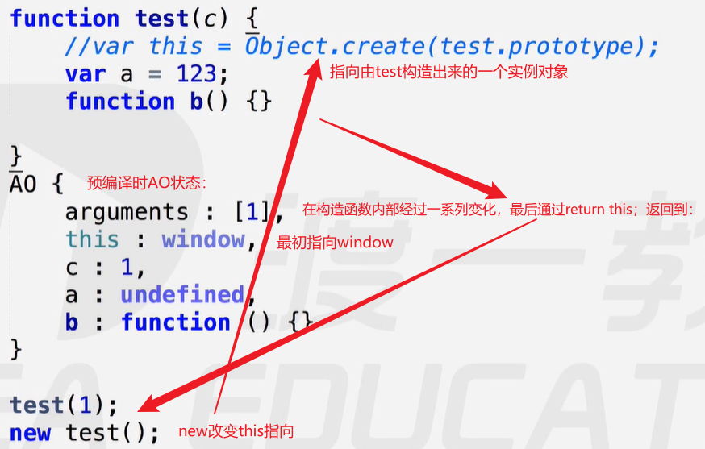 

2. 全局作用域：this ---> window / GO

   - 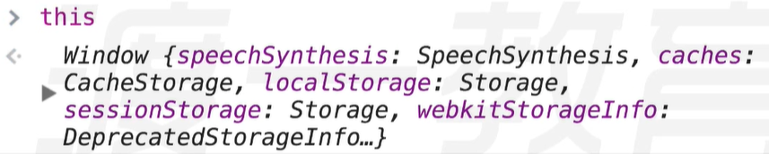 

3. call / apply 改变函数运行时this指向：this ---> 第一个参数

4. 调用对象中的方法：this ---> 调用者 / 对象

案例1：

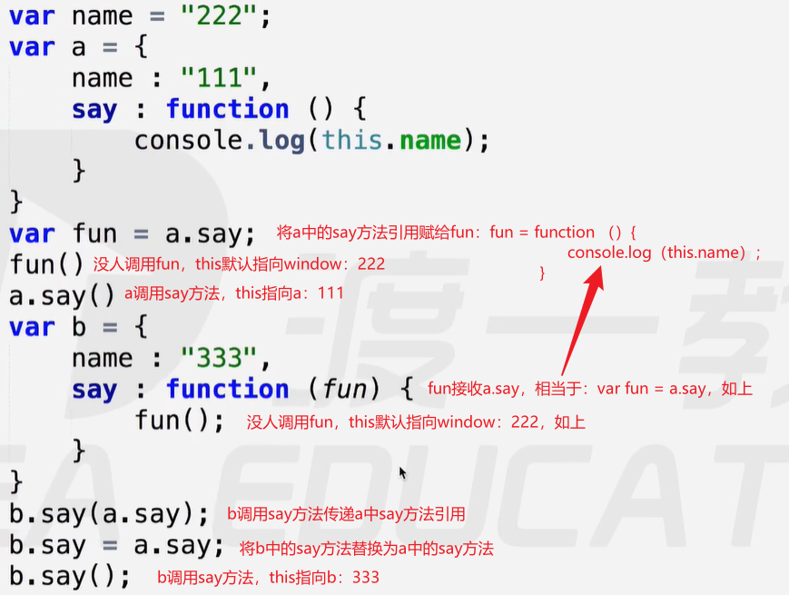  

案例2：

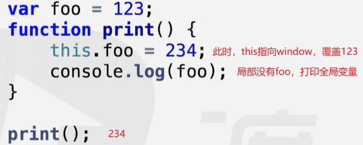 

 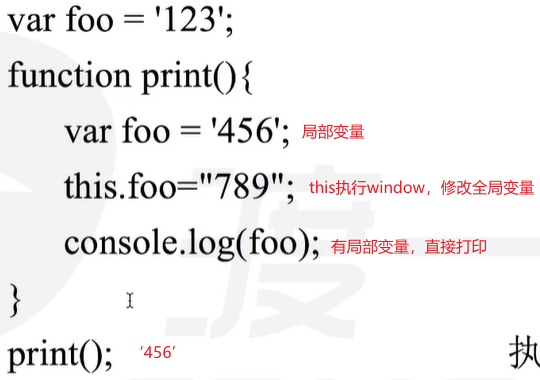 

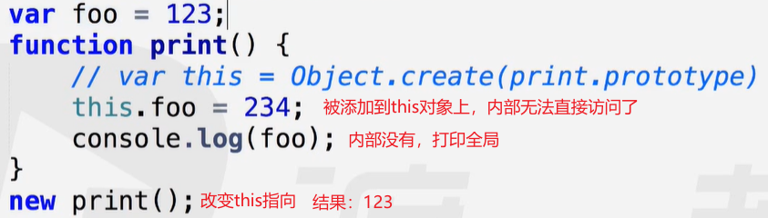 

案例3：

 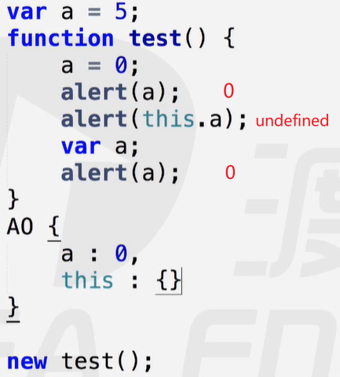 

案例4：

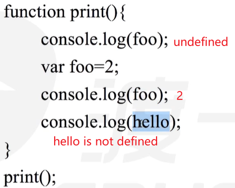 

案例5：

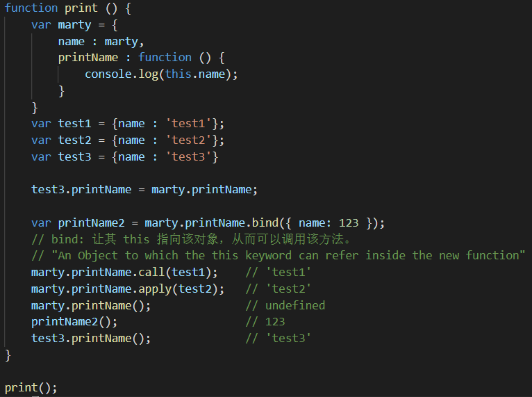 

案例6：

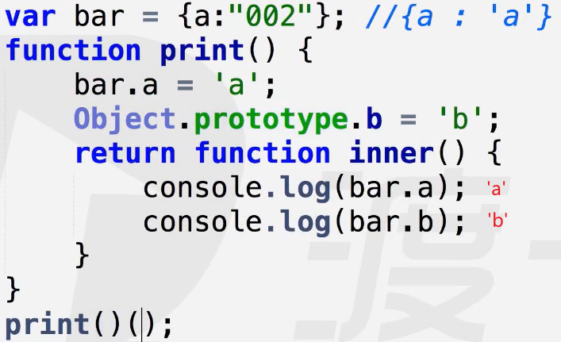 

### callee和caller

callee：arguments.callee指向当前函数在内存中的引用，即：等于函数名。

- 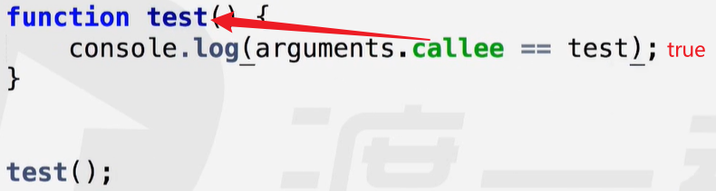 
- 案例：立即执行函数利用递归实现阶乘
  - 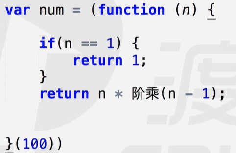 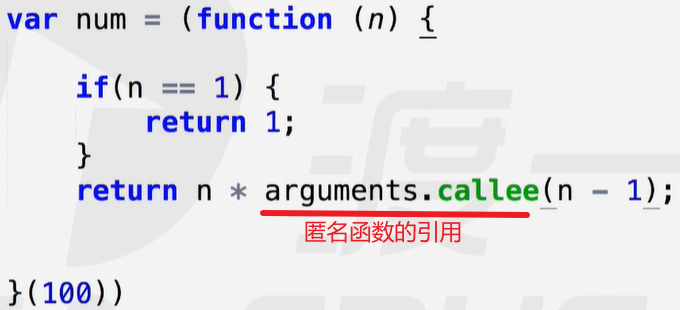 

caller：fn.caller指向fn函数执行时的环境

- 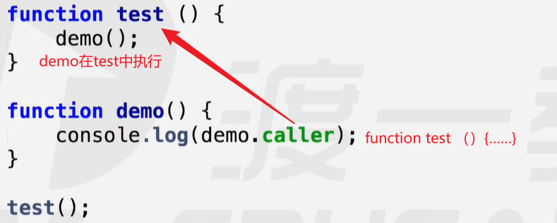 

注意：在ES5严格模式下，arguments 和 caller 不允许使用。

