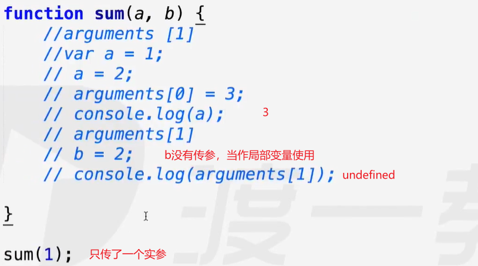
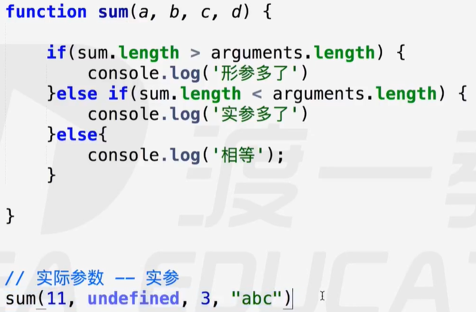
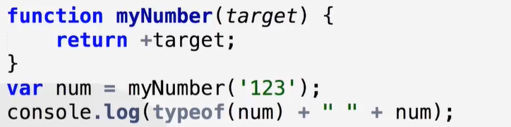
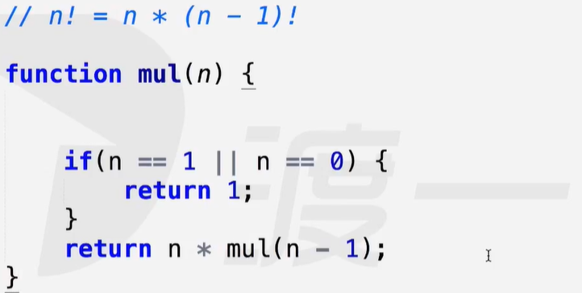
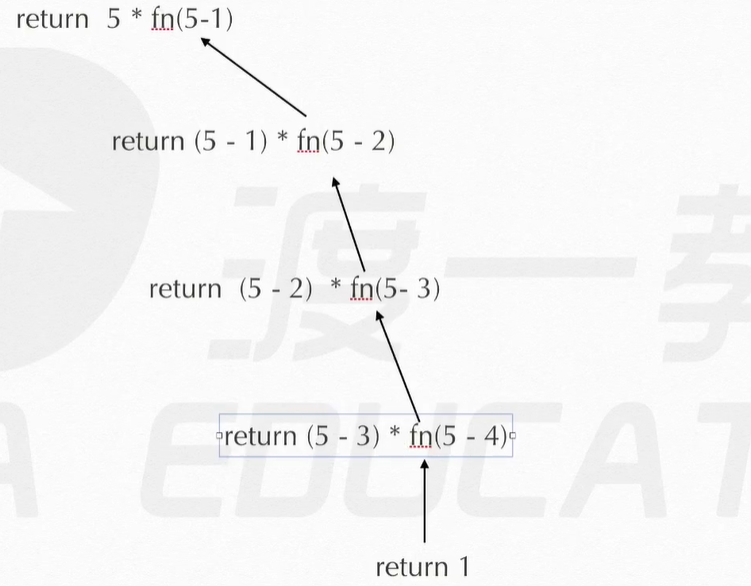
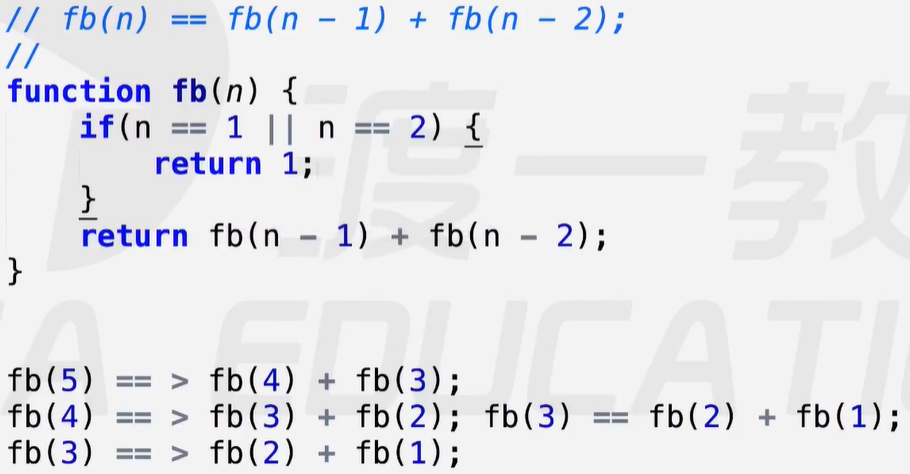

# 函数

函数最初用于解决代码重用，将重复【耦合：低效率】的代码，高度提炼出核心逻辑，并封装起来成为一类功能。【抽象通式】

编程的原则：高内聚，弱耦合。【性能好，效率高】

### 定义

- 关键字声明【function】
  - 具名函数
  - 匿名函数
- 函数表达式
  - 函数表达式忽略关键字后面的函数名，将函数体直接存储到声明的变量中。
  - 因此，函数表达式一般采用匿名函数赋值形式赋给声明变量。
- 函数名【fn.name】
  - fn.name中存着函数的名称
  - 具名函数则是关键字后的函数名。
  - 函数表达式
    - 具名函数表达式，存储的函数名是关键字后的名字。
    - 匿名函数表达式，存储的则是变量名。
- 参数
  - 形参：函数声明中的是形参【形式参数：局部变量】
    - 形参长度：fn.length【函数名上的length方法】
    - 形参作为函数的局部变量使用，相当于在函数首部隐式做了变量声明。
  - 实参：函数调用时传递的是实参【实际参数】
    - arguments：实参列表，存储着所有传递过来的实参【伪数组】
      - arguments实参列表与形参一一映射【映射关系：一个变，另一个跟着变】
      - 传递几个实参就能映射几个形参，多余的形参不够成这种映射关系【当作变量使用】。
        -  
    - 实参长度：arguments.length
      -  
  - 不定参【传递任意个实参】
    - 空形参，内部使用arguments
- 结束并返回值【return】
  - 函数内部只能有一个return语句，且只执行第一个return语句。
  - return返回的值，直接返回给函数调用处。
  - return结束函数，后面的语句不会执行。
  - 封装一个Number显示转换的功能：

### 递归

构造递归的核心：抽象规律【设计循环】，寻找出口【终止循环】

实现递归的核心：利用return语句，反复执行该函数。【return处执行该函数】

优点：代码简洁，简单程序执行快。

缺点：反复调用并执行自身，导致效率低下、占用内存，执行复杂程序时容易卡顿。

- 递归实现阶乘案例： 
  - 图示： 
- 递归实现斐波那契数列： 
- 适用场景：有明显规律的功能，如：数学、物理公式等。
- 特点：先执行的最后执行完，等到最底层的执行完，再一层一层往上返回。

### 作用域【scope】

- 全局作用域：windows对象（所有<script>标签叠加的总和）【全局可见性】
- 局部作用域：函数内部
- 特点：
  - 函数可以访问内部以及全局的变量，但全局不能访问局部中的变量。【局部不可见性】
  - 函数里面的能访问外面的，但外面的不能访问函数里面的（包括函数嵌套）。
  - 每个函数都有一个局部作用域，局部作用域彼此独立。【不可互相访问变量】