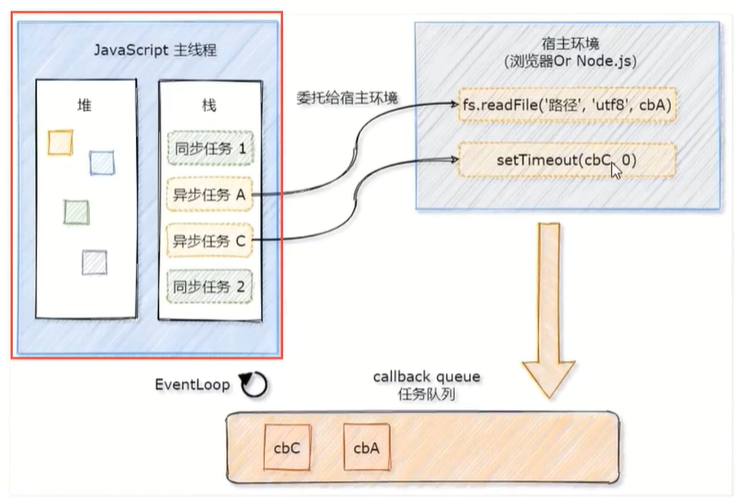

# `node`初识

**Ryan Dahl** 将 `v8` 引擎 搬到了服务端上，使得 `js` 也成为了一门后端语言，如：`node.js`。

`node.js` 是一个基于 `Chrome V8` 引擎的 `JavaScript` 运行时环境。【最低要求`win8`系统】

### 安装环境

前往`node`官网，下载`node`的环境，建议选择长期维护版。

安装时，建议不要修改任何设置，一直点`next`。安装完成后，在`power shell`里面输入`node -v`命令，检查当前版本号。

### 基础操作

##### 切换目录

输入`cd` 命令 + 文件夹路径，切换到指定目录。【`cd`：只能切换到文件夹路径、目录路径】

##### 清空历史

输入`clear` 命令，简写：`cls`。

##### 运行文件

在路径后输入 `node` 命令 + 指定文件。 【建议包括文件名及扩展名】

##### 缩放界面

按住`CTRL` + 滚轮滚动。

### 事件循环

`JS`是一门单线程语言，同一时间只能做一件事。

如果有一个很耗时的任务，程序就会卡顿。为了防止此类情况，将待执行任务分为：同步任务，异步任务。

同步任务：做非耗时任务，立即执行；异步任务：做耗时任务，过会执行。

##### 主线程：单线程

- 在执行栈中（主线程），遇到同步任务立即执行；遇到异步任务，委托给宿主环境，经过处理，放到任务队列中待执行（回调）。
- 等待执行栈中（主线程）所有同步任务执行完毕。再从任务队列中，将延迟执行的异步任务，调回主线程中去执行。
- 主线程不断地从任务队列中获取异步任务的回调函数来执行的过程，就叫做：**事件循环**。
- 特点：异步任务总是在同步任务执行完后再执行，换句话说：**总是最后执行**。

### 包管理器

`node package manage` 简称 ：`npm` ，用来下载及管理第三方插件（功能、包）。

以往引入插件的方式，使用`script`标签的`src`属性，写入第三方插件地址。

##### 修改执行策略

出于安全考虑，系统会自动阻止下载第三方包，此时需要修改执行策略。

##### `npm`下载

输入`npm install + 包名称` 指令，`npm`下载命令访问国外网站`npm`，下载速度慢。

##### 全局安装`cnpm`

输入`npm install cnpm -g` 指令，使用`cnpm`来访问国内的源（淘宝提供）【`-g`：全局安装】

##### 安装`express`包

输入`cnpm i express` 指令，从国内源下载`express`包。【`i：install`】

#### 包文件

##### 组件文件夹

`node_modules`：组件文件夹 【`modules`：模块、组件】

- 存放着下载的第三方包及其扩展包。

##### 包记录文件

`package.json`：包记录文件
- 存放着该项目对第三方包的下载、引用记录。【`dependencies`：依赖性、相关性】
- 使用别人项目时，通过该文件的记录，方便下载所需的包。
  - 输入`npm install` 命令，系统会调用包记录文件，根据记录自动下载所需的包。

