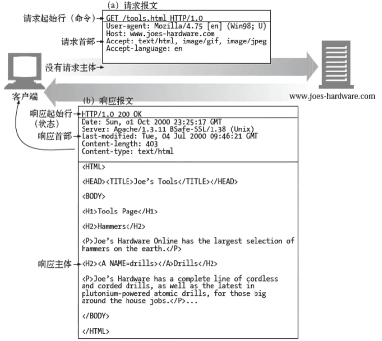

# HTTP原理

`http`协议：为了解决客户端与服务端的沟通问题，将问题标准化，减少沟通成本。【通信标准协议】

概念：超文本传输协议（`Hyper Text Transfer Protocol`，`HTTP`）是一个简单的请求 - 响应协议，它通常运行在`TCP`之上。它指定了客户端可能发送给服务器什么样的消息以及得到什么样的响应。请求和响应消息的头以`ASCII`形式给出；而消息内容则具有一个类似`MIME`的格式。这个简单模型是早期`Web`成功的有功之臣，因为它使开发和部署非常地直截了当。


### `nodemon`插件

输入 `npm i nodemon` 指令，安装`nodemon`热更新插件。通过 `nodemon service` 指令开启。


### `token`【登录暗号】

`token`是一种类似用于识别身份的暗号，它不是本地的一种缓存。【`token`：类似于验证码，身份令牌】

含义：https://www.jianshu.com/p/24825a2683e6

1. 引入：`Token`是在客户端频繁向服务端请求数据，服务端频繁地去数据库查询用户名和密码进行对比，判断用户名和密码正确与否，并作出相应提示，这样的背景下诞生的。
2. 定义：`Token`是服务端生成的一串加密的字符串，以作客户端进行请求的一个令牌。当第一次登录后，服务器生成一个`Token`便将此`Token`返回给客户端，以后客户端只需带上这个`Token`前来请求数据即可，无需再次带上用户名和密码。
3. 目的：`Token`的目的是为了减轻服务器的压力，减少频繁地查询数据库，使服务器更加健壮。


### 传输协议

`http`的请求与响应的传输，主要是进行报文之间的交流传输。

 


### 跨域【`cross-domain`】

同源策略：协议，域名，端口三者都相同，即为同源。任一不同都是不同的域。

注释：

- 如果服务端指定了具体的域名而非`"*"`，那么响应首部中的 `Vary` 字段的值必须包含 `"Origin"`。
- 这将告诉客户端：服务器对不同的源站返回不同的内容。

案例：使用`axios`发起`get`请求，并在后端设置允许跨域。

```html
<h1>前端页面</h1>

<script src="https://unpkg.com/axios/dist/axios.min.js"></script> <!-- 引入axios -->
<script>
	axios.get("http://localhost:8000/")
    .then((res) => {
        console.log(res);
    })
    .catch((err) => {
        console.log(err);
    })
</script>
```

```js
// node后端
const http = require("http");

http.createServer((req, res) => {
    // 在响应头中，设置允许跨域。
    res.writeHead(200, {
        // "Access-Control-Allow-Origin": "*" // 允许所有的域访问该服务
        "Access-Control-Allow-Origin": "http://www.xxx.com:0000", // 设置仅指定源可访问
        "Vary": "Origin",
        "Origin": "http://www.xxx.com:0000" // 该字段不是必须的
    })
    
    // 写入主体内容
    res.write("响应的内容");
    
    // 发送响应内容
    res.end();
}).listen(8000, "localhost");
```

因此，解决跨域主要由后端来解决。前端只能想办法绕开浏览器的监控。

更多参考：https://developer.mozilla.org/zh-CN/docs/Web/HTTP/CORS


### `IP`地址与域名

域名通过`DNS`（`Domain Name Server`：域名服务器）解析为`IP`地址，从而访问`IP`指向的服务器。

##### 查看服务器`IP`【`ping`指令】

在命令行工具中，输入 `ping 域名` 指令，可查看该域名所指向的`IP`地址。

 

协议默认端口：`http` -- 8080（简写：80） ；`https` -- 443。


### `TCP`连接【通信桥梁】

当前端通过`url`向后端发起请求时，通常要经历以下七个步骤：

 

在发送请求报文之前，需要先建立`TCP`连接；在响应完内容后，需要关闭`TCP`连接。

三次握手：发生在建立`TCP`连接时，双方确认彼此能够正常收发消息。

四次挥手：发生在关闭连接时，双方确认关闭连接。


##### 三次握手

三次握手详解：【建立连接的过程】

所谓三次握手（`Three-Way Handshake`）即建立`TCP`连接，就是指建立一个`TCP`连接时，需要客户端和服务端总共发送3个包以确认连接的建立。在`socket`编程中，这一过程由客户端执行`connect`来触发，整个流程：

               

```
（1）第一次握手：
Client将标志位SYN置为1，随机产生一个值seq=J，并将该数据包发送给Server，Client进入SYN_SENT状态，等待Server确认。
```

```
（2）第二次握手：
Server收到数据包后由标志位SYN=1知道Client请求建立连接，Server将标志位SYN和ACK都置为1，ack=J+1，随机产生一个值seq=K，并将该数据包发送给Client以确认连接请求，Server进入SYN_RCVD状态。
```

```
（3）第三次握手：
Client收到确认后，检查ack是否为J+1，syn是否为1，如果正确则将标志位ACK置为1，ack=k+1，并将该数据包发送给Server，Server检查ack是否为K+1，ACK是否为1，如果正确则连接建立成功，Client和Server进入ESTABLISHED状态，完成三次握手，随后Client与Server之间可以开始传输数据了。
```

 

##### 四次挥手

四次挥手详解：【关闭连接的过程】

所谓四次挥手（`Four-Way Wavehand`）即终止`TCP`连接，就是指断开一个`TCP`连接时，需要客户端和服务端总共发送4个包以确认连接的断开。在`socket`编程中，这一过程由客户端或服务端任一方执行`close`来触发，整个流程：

一方主动关闭，另一方被动关闭：	

                  

```
由于TCP连接是全双工的，因此，每个方向都必须要单独进行关闭，这一原则是当一方完成数据发送任务后，发送一个FIN来终止这一方向的连接，
收到一个FIN只是意味着这一方向上没有数据流动了，即不会再收到数据了，但是在这个TCP连接上仍然能够发送数据，直到这一方向也发送了FIN。
首先进行关闭的一方将执行主动关闭，而另一方则执行被动关闭，上图描述的即是如此。
```

```
第一次挥手：
Client发送一个FIN，用来关闭Client到Server的数据传送，Client进入FIN_WAIT_1状态。
第二次挥手：
Server收到FIN后，发送一个ACK给Client，确认序号为收到序号+1（与SYN相同，一个FIN占用一个序号），Server进入CLOSE_WAIT状态。
第三次挥手：
Server发送一个FIN，用来关闭Server到Client的数据传送，Server进入LAST_ACK状态。
第四次挥手：
Client收到FIN后，Client进入TIME_WAIT_2状态，接着发送一个ACK给Server，确认序号为收到序号+1，Server进入CLOSED状态，完成四次挥手。
```

同时关闭：

 

为什么建立连接是三次握手，而关闭连接却是四次挥手呢？

```
这是因为服务端在LISTEN状态下，收到建立连接请求的SYN报文后，可以把ACK和SYN放在一个报文里发送给客户端。
而关闭连接时，当收到对方的FIN报文时，仅仅表示对方不再发送数据了但是还能接收数据，己方也未必全部数据都发送给对方了，所以己方可以立即close，也可以发送一些数据给对方后，再发送FIN报文给对方来表示同意现在关闭连接，因此，己方ACK和FIN一般都会分开发送。
```

