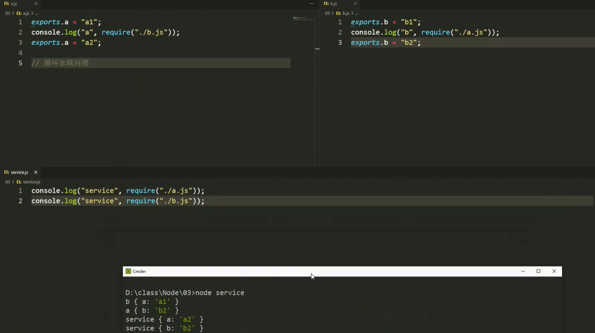
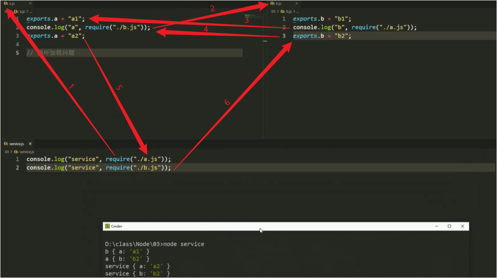
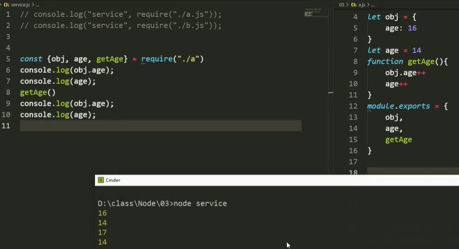
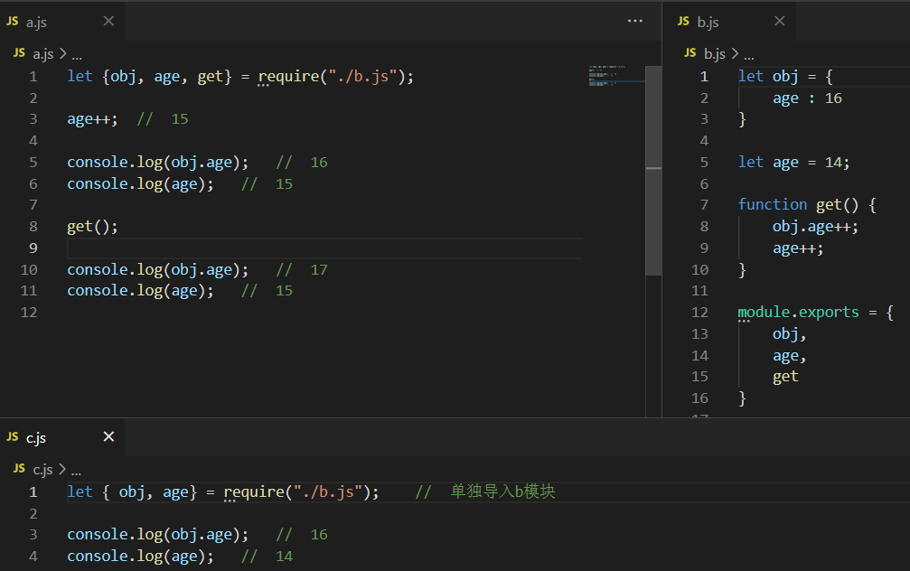
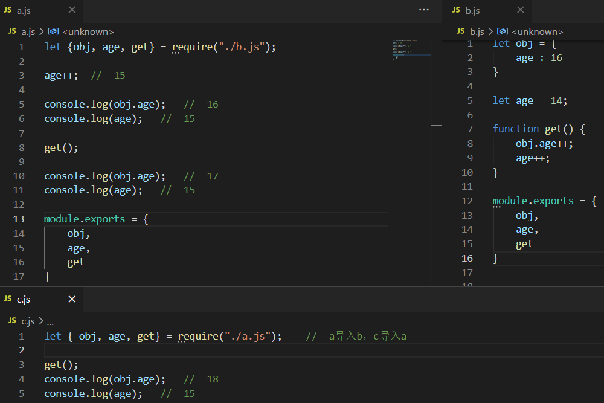
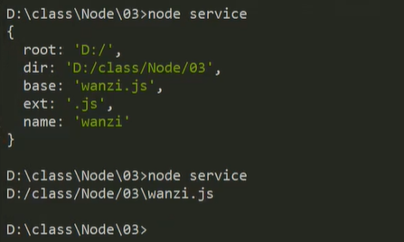
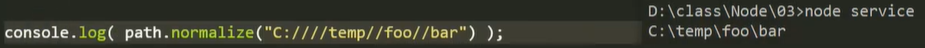
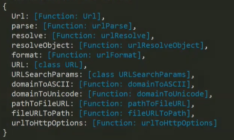
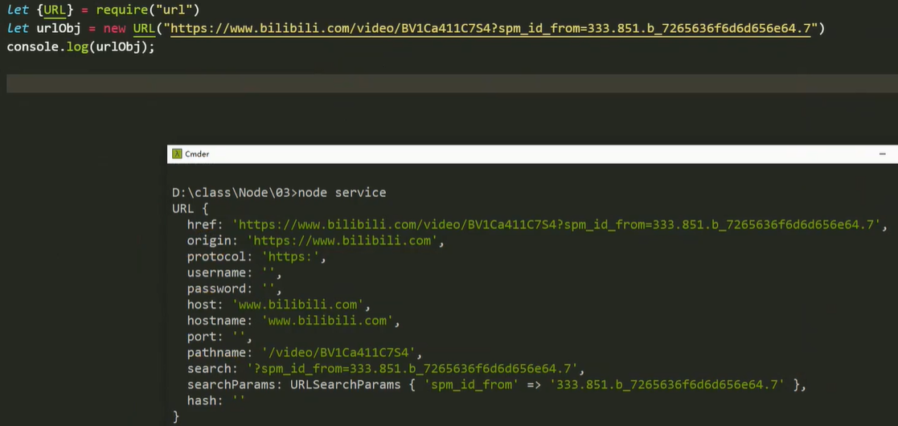

# 核心模块1

学`node`，了解后端逻辑，更好地与后端交接。

<hr>

### 循环加载



1. 根据 `node service` 指令，先执行`service.js`文件。

2. 执行第一条打印语句：【先计算结果，再打印结果】

   ​	2.1执行到`require（“./a.js”）`语句，导入并执行 `a` 模块代码。

   ​			2.1.1 `a` 模块执行导出语句；执行打印语句；

   ​				2.1.1.1 `a` 模块执行到`require`语句，导入并执行`b`模块代码。

   ​					2.1.1.1.1 `b` 模块执行导出语句，执行打印语句；

   ​							2.1.1.1.1.1 `b` 模块通过`require`语句再次导入 `a` 模块，

   ​											【由于 `a` 模块此前已被导入并执行了一次，此时直接使用 `a` 模块保存在系统中的记录结果】。

   ​							2.1.1.1.1.2 获得记录结果，于是执行`console.log（“b”，require（“./a.js”））；`打印结果：`b {a：“a1”}`。

   ​					2.1.1.1.2 `b` 模块执行完打印语句，执行导出语句，覆盖原先 `b` 的导出值，使导出`{b：“b2”}`。

   ​				2.1.1.2 `require`导入`b`语句被执行完，打印语句获得结果，执行打印：`a {b：“b2”}`。

   ​			2.1.2 `a` 模块打印语句执行完，执行导出语句，覆盖原先 `a` 的导出值，使导出`{a：“a2”}`。

   ​	2.2 `require` 导入 `a` 模块执行完，获得结果，打印结果：`service {a：“a2”}`。

3. 执行第二条打印语句

   1. 由于`b`模块已被导入并执行了一次，此时直接使用`b`模块执行后的记录`{b：“b2”}`。
   2. `require`获得结果，执行打印：`service {b：“b2”}`。

 


##### 避免循环加载

- 不要双向导入。
- 不要在中间夹杂导出和导入。
  - 将导入代码整理到文件首部，导出放到尾部，中间放其他执行代码。

<hr>

### 浅克隆



- 导出的结果是存放在栈内存中的数据：原始值 --- 真实数据；引用值 --- 地址。【浅拷贝】
- 单独导入模块时，函数声明在哪个模块，执行时操作的就是哪个模块的数据。【`AO，GO`在函数声明的地方】
  - 函数声明与执行不在一个模块，当函数执行时，其在执行模块的内部数据【引用值改变，原始值不变】。
  -  
  - 因此，在开发中，常使用浅拷贝导出引用值，很少用深拷贝或导出原始值。
- 直线导入模块时，`get（）`操作导出过来的数据。
  -  


# 原生模块

`path`模块用来快速处理文件路径。

### 文件路径【`path`模块】

与文件路径相关的两个全局变量：

##### `__dirname`【文件所在目录】

- `__dirname`：获取当前文件所在的目录【绝对路径】【`directory`：目录，文件夹】

##### `__filename`【文件所在地址】

- `__filename`：获取当前文件的所在地址【完整的绝对路径】

```js
// 在D:\class\Node\03\service.js文件中
// 打印当前文件的工作目录
console.log(__dirname); // "D:\class\Node\03"
// 打印当前文件的所在位置
console.log(__filename); // "D:\class\Node\03\service.js"
```


##### 路径拼接【`join`方法】

- 将后面参数依次拼接在前面参数的后面，并使用当前系统的文件分隔符来进行分隔。

- 【`path.join`】拼接方法对首段路径字符串的解析各不相同。【建议首路径不要写相对路径，`join`可能会直接拼接】

```js
// 在D:\class\Node\03\service.js文件中
const path = require("path");

// 多段参数的连续拼接，相对路径在第二参数及其后，可以被识别。
let pa = path.join("wanzi", "wanzi.js"); // "wanzi\wanzi.js"
pa = path.join("wanzi", "wanzi.js", "."); // "wanzi\wanzi.js"，当前文件位置
pa = path.join("wanzi", "wanzi.js", ".."); // "wanzi"，返回上一层目录

// 使用全局变量获取当前文件的目录路径（字符串）
let dir = path.join(__dirname, "wanzi.js");
console.log(dir); // "D:\class\Node\03\wanzi.js"

// 不会解析首路径是否为文件，而是当作目录来处理。
let file = path.join(__filename, "wanzi.js");
console.log(file); // "D:\class\Node\03\service.js\wanzi.js"

// 对首路径字符串的解析，当相对路径作为第一个参数时：
let test = path.join(".", "wanzi", "wanzi.js"); // 识别为当前工作目录，（忽略首参）直接返回后面参数的拼接结果。
console.log(test); 	// "wanzi\wanzi.js"
test = path.join("..", "wanzi.js"); // 不会识别该路径，直接在其后拼接所有参数。
console.log("test"); // "..\wanzi.js"
```


##### 路径解析【`resolve`方法】

- 先对首路径进行解析：转换为绝对路径后，再与后面的执行拼接。
- 生成的路径被规范化，删除尾部的斜杠 \（除非路径解析为根目录）。
- `resolve`与`join`的主要区别在于：`resolve`可以解析第一参数是相对路径的情况，并且`resolve`会解析绝对路径。

```js
// 在D:\class\Node\03\service.js文件中

// 解析首参数为相对路径的情况
let test = path.resolve("."); // "D:\class\Node\03"，解析为当前工作目录
test = path.resolve(".."); // "D:\class\Node"
test = path.resolve(".", "wanzi.js"); // "D:\class\Node\03\wanzi.js"
test = path.resolve("..", "wanzi.js"); // "D:\class\Node\wanzi.js"

// 解析每段路径参数：若为绝对路径则选择该片段作为开始；若为其他则与前面的拼接。
let tr = path.resolve("/foo/bar", "/baz"); // "D:\baz"
tr = path.resolve("/wanzi/wanzi.js", "/foo/bar", "baz", "./baz.js/"); // "D:\foo\bar\baz\baz.js"
tr = path.resovle("/wanzi/wanzi.js", "C:/", "wanzi"); // "C:\wanzi"
// join并不会解析绝对路径，而是采取直接拼接。
let tj = path.join("/foo/bar", "/baz"); // "\foo\bar\baz"
tj = path.join("/wanzi/wanzi.js", "C:/", "wanzi"); // "\wanzi\wanzi.js\C:\wanzi"

// 不会解析首路径是否为文件，而是当作目录来处理。
let file = path.resolve(__filename, "wanzi.js");
console.log(file); // "D:\class\Node\03\service.js\wanzi.js"
```


##### 相对解析【`relative`方法】

使用`path`上的`relative`方法，可以获取从`from`绝对位置到`to`绝对位置的相对路径。

注释：`"C:\\orandea\\test\\aaa"` 表示：当前位置处于 `aaa` 目录中。

```js
// 获取从一个绝对路径到目标绝对路径的相对路径。
let rel = path.relative("C:\\orandea\\test\\aaa", "C:\\orandea\\impl\\bbb");
console.log(rel); // "..\..\impl\bbb"

// 相同的路径，返回一个空字符串
rel = path.relative("C:\\orandea\\test\\aaa", "C:\\orandea\\test\\aaa"); // ""

// 在C:\Users\MR\Desktop\text\test.js文件中
// 当from或to为空串时，表示使用当前工作目录（C:\Users\MR\Desktop\text）。
rel = path.relative("", "C:\\orandea\\impl\\bbb"); // "..\..\..\..\orandea\impl\bbb"
rel = path.relative("C:\\orandea\\test\\aaa", ""); // "..\..\..\Users\MR\Desktop\text"
rel = path.relative("", ""); // ""
```


##### 路径转换【`parse`方法】

该方法返回一个对象，该对象包括了对参数路径的分析。【路径字符串转换为路径对象】

```js
let dir = path.parse("D:/class/Node/03/wanzi.js");
console.log(dir);
// 打印结果：
{
    root: 'D:/',
    dir: 'D:/class/Node/03',
    base: 'wanzi.js',
    ext: '.js',
    name: 'wanzi'
}
```


##### 返回基名【`basename`方法】

该方法返回路径字符串中的基址名 / 最后一段（结尾是分隔符则删去后返回）。【以分隔符分段】

```js
// 在C:\Users\MR\Desktop\text\test.js文件中

// 返回路径字符串中的最后一段
let basename1 = path.basename(__dirname),
    basename2 = path.basename(__filename);
console.log(__dirname, "	", basename1); // C:\Users\MR\Desktop\text		text
console.log(__filename, "	", basename2); // C:\Users\MR\Desktop\text\test.js		test.js

// 指定一个扩展名，匹配成功将忽略该扩展名
path.win32.basename('C:\\foo.html', '.html'); // 'foo'
path.win32.basename('C:\\foo.HTML', '.html'); // 'foo.HTML'
```


##### 返回目录【`dirname`方法】

返回当前文件或文件夹所在的目录。

```js
// 在C:\Users\MR\Desktop\text\test.js文件中

// 返回当前文件或文件夹的上一级
let dir1 = path.dirname(__dirname), //  C:\Users\MR\Desktop
    dir2 = path.dirname(__filename); // C:\Users\MR\Desktop\text

let dir = path.join("wanzi/wanzi.js", "baz"); // // wanzi\wanzi.js\baz
dir = path.dirname(dir); // wanzi\wanzi.js
```


##### 返回扩展名【`extname`方法】

返回当前文件的扩展名，文件夹或无文件名则返回空串。

```js
// 返回当前文件的拓展名，采用最后一个.的片段
path.extname("index.html"); // ".html"
path.extname("index.coffee.md"); // ".md"

path.extname("index."); // "."
path.extname(".index.md"); // ".md"

// 为文件夹或无文件名时，返回空串
path.extname("index"); // ""
path.extname(".md"); // ""
```


##### 格式化路径【`format`方法】

将路径对象整合为一段（非标准的）路径字符串。【路径对象转换为路径字符串】

注意：设计路径对象的属性时，在某些组合中，一个属性优于另一个属性。

- 当提供`dir`后，`root`将被忽略。
- 当`base`存在时，`name`和`ext`将被忽略。

 

```js
// 将路径对象转换为路径字符串
let obj = {
    dir: "C:\\path\\dir",
    base: "file.txt"
}
path.format(obj); // C:\path\dir\file.txt

// 非标准字符串
obj = {
    dir: "c:/path/dir",
    base: "file.txt"
}
path.format(obj); // C:/path/dir\file.txt
```


##### 标准化路径【`normalize`方法】

将路径字符串标准化（归一化），但会保留尾部的分隔符。

 

```js
// 标准化路径字符串，将重复的分隔符归一化
path.normalize("C:\\temp\\\\foo\\bar\\..\\"); // C:\temp\foo\

path.normalize("C:////temp\\\\/\\/\\/foo/bar"); // C:\temp\foo\bar
```


##### 路径分隔符【`delimiter`属性】

`path`上的`delimiter`属性保存着特定于系统的路径分隔符：`Windows`是分号，`POSIX`是冒号。

```js
// 在Windows系统上
console.log(path.delimiter); // ';'
console.log(process.env.PATH); // 'C:\Windows\system32;C:\Windows;C:\Windows\System32\Wbem;'

// 在POSIX平台上
console.log(path.delimiter); // ':'
```


##### 文件分隔符【`sep`属性】

`path`上的`sep`属性保存着特定于系统的文件分隔符：`Windows`通常是反斜杠，`POSIX`是正斜杠。

注释：在 `Windows` 上，正斜杠 ( `/`) 和反斜杠 ( `\`) 都被接受为文件分隔符；但是，`path`上的属性和方法均采用反斜杠 ( `\`)。

```js
// 在Windows系统上
console.log(path.sep); // '\'

// 在POSIX平台上
console.log(path.sep); // '/'
```


##### 判断绝对路径【`isAbsolute`方法】

使用`path`的`isAbsolute`方法，可以判断一个路径是否是绝对路径。

```js
path.isAbsolute('//server');    // true
path.isAbsolute('\\\\server');  // true
path.isAbsolute('C:/foo/..');   // true
path.isAbsolute('C:\\foo\\..'); // true
path.isAbsolute('bar\\baz');    // false
path.isAbsolute('bar/baz');     // false
path.isAbsolute('.');           // false
path.isAbsolute("../a")；       // false
```


##### 命名空间前缀【`toNamespacedPath`方法】

使用`path`的`toNamespacedPath`方法，可以返回一个与指定路径等效的命名空间前缀路径。

```js
// 仅Windows系统可用，前缀可能为：\\?
path.toNamespacedPath("/wanzi/wanzi.js"); // \\?\C:\wanzi\wanzi.js
```

<hr>

### 网络地址【`url`模块】

`url` 模块用来处理网址。【`url`：统一资源定位器】

`url`包括：协议，主机，路径，参数，片段。

##### `url`对象

   

两个属性：`Url`：旧的（构造函数）；`URL`：新的（类）

```js
// 使用新的URL类及其方法
const { URL } = require("url");
```


##### 创建地址对象

创建地址对象：对参数进行解析

 


##### URL实例基础属性

- `href`：完整地址（原地址）
- `origin`：源路径 = 协议`protocol` + 主机`host`
- `protocol`：协议
- `host`：主机 = 域名`hostname` + 端口号`port`
- `hostname`：主域名，主机名
- `port`：端口号
- `pathname`：路由
- `search`：查询携带的参数片段
- `searchParams`：查询参数【`map`形式的数据结果】
- `hash`：哈希片段【哈希路由模式】


