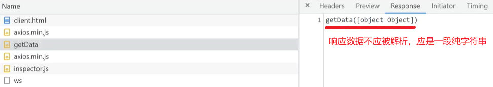

# 捕获页面数据

### 模拟`JSONP`实现

由于标签的`src`属性不受同源策略限制，因此可以使用`script`标签的`src`发起一个可跨域的请求。

基本逻辑：前端通过`script`的`src`发起了一个可跨域的请求，后端监听到之后返回对一个方法的执行并传参。该方法是在前端事先定义好的，通过请求`url`的`path`传递给后端执行。由于后端返回的数据是对前端方法的调用执行并传递了参数，因此实现了后端传参。

```html
<script>
	// 定义一个接收后端参数的方法
    function getData(data) {
        console.log(data);
    }
</script>

<!-- 将该方法通过url的path传递给后端，后端接收到之后会返回一段对该方法进行传参执行的字符串代码 -->
<script src="http://localhost:8080/getData"></script>
<!-- 由于该字符串代码是通过外部引入的，它会被script当作js代码来执行。 -->
```

```js
const http = require("http");
const path = require("path");

http.createServer((req, res) => {
    const {url} = req;
    res.writeHead(200, {
        "Content-Type": "text/plain"
    })
    // 响应数据：一段调用前端方法的字符串代码，并在调用时传递后端参数。
    res.write(`${path.basename(url.split("?")[0])}(${JSON.stringify({name: "wanzi", age: 16})})`);
    res.end();
}).listen(8080, "127.0.0.1");

// 实际返回给前端的数据，一段执行前端方法的字符串代码：
"getData({name: 'wanzi', age: 16})"
```

注意事项：
-  
- 解决办法：`JSON.stringify`（响应数据），将响应数据字符串化，防止传输时被错误解析。
- `script`标签会将响应数据当作`JS`代码执行，因此，不需要手动添加字符串对象化：`JSON.parse（data）`。

- 应用场景：搜索时的联想词。


### 获取数据

基本逻辑：分析页面结构，找到对应的`url`，通过这些 `url` 向后端发起请求。

免费开放的网站：直接给爷爬！	 收费的网站：伪装身份，接着爬！

**五步走：

1. 发起请求：常用`axios`方法
2. 获得页面数据
3. 分析页面结构，取出相关资源的`url`地址
4. 向这些`url`地址发起请求，请求相关资源【嵌套型，可再次向深层的`url`发起请求】
5. 将获取到的资源保存到本地


案例1：壁纸湖`bizihu.com`

- `node`初始化：输入`npm init -y`指令【`-y`：跳过所有步骤】
  - 在安装包之前，先进行初始化。自动分析项目结构，生成包记录文件。

- 使用`axios`
  - 下载`axios`模块，向网址发起`get`请求【得到的数据放到`then`里面，`catch`捕获错误】
    - 使用`then`监听，得到的响应数据 / 报文 存放在第一个参数里面：`response`。
    - `response`里存着响应报文，实际数据在`response.data`里面。
    - 将首页数据写入本地，进行结构分析。
- 分析页面结构
  - 找出规律，确定所需的有效 `url` 及选择器。【`src`不一定准确】
  - 解析`html`页面结构的工具：`jsdom`，`cheerio`【`npm`网站了解详情】
    - 使用`cherrio`
      - 将需要分析结构的数据放到`cheerio.load()`中，如：`const $ = cheerio.load(response.data);`
      - 使用选择器筛选数据：`$('选择器')`
      - 遍历筛选的数据：`$('选择器').each((下标, 元素对象) => {});`类似于`forEach`遍历方法。
      - 根据元素中包含有效 `url` 的属性，取出 `url` 地址：`$(元素对象).attr(包含url的属性)`
- 向图片 `url` 发起请求：
  - `axios.get(图片url)`，请求到的数据在`then`里面。
  - 注意：这里应该发起同步请求，因为异步方式的请求，会在瞬间发起大量请求，服务器会拒绝此类“攻击”行为【`DOS`攻击】
  - 解决：使用`async…await`
    - 等到 `await` 处请求完成之后，再执行 `async` 处的下一次遍历。
- 保存资源
  - 发起请求时设置配置对象，指定资源以流的形式传递：`responseType：'stream';`
  - 将数据以流的形式写入本地文件中，注意设置动态图片名，避免资源写入同一张图片中而不断被覆盖。
- 注意事项：
  - 对图片名称的校验，避免出现非法字符。如：`/，\，:，*，?，"，<，>，|`。
  - 动态的后缀名，根据数据的后缀名（`extname`或切割`pathname`，`url`等后缀）来指定保存时的后缀。
  - 使用`axios`，返回的是一个`promise`对象，下载时应无视错误，继续下载，抛出错误会阻塞执行。
  - 高级点的网站不会一开始就暴露 `url` ，可能是在加载过程中，一点点加载出来。【此时应再次发起请求】
  - 嵌套型的页面，一般通过分析`<a>`标签来获取每个页面的 `url`。【如：分页器】
  - 一般对于获取到的 `url` 链接再次发起请求，就可以获取到内页数据。

```js
const axios = require("axios"),
      fs = require("fs"),
      cheerio = require("cheerio");

// 发起get请求，获取页面数据
axios.get("http://bizihu.com/")
	 .then(res => {
    	// 可将获取的页面数据写入本地文件中，以方便分析页面结构
		fs.writeFile("./index.html", res.data, err => {
            if(err) throw err;
            console.log("写入成功");
        })
    
    	// 使用cheerio工具分析页面结构及数据
    	const $ = cheerio.load(res.data);
    	// 通过选择器，获取所有符合要求的img元素
    	$(".box img.lazyload");
    	
    	// 遍历img元素，同步遍历，等待await处完成后再开始下一次的遍历
    	$(".box img.lazyload").each(async (i, ele) => { // ele：当前元素对象
            // 获取指定的属性值，取出有效的url地址
            let imgUrl = $(ele).attr("data-original");
            
            // 通过图片的url向后端发起请求，要求数据以流的形式返回。
            await axios.get(imgUrl, {responseType: "stream"}).then(res => {
                // 获取扩展名
                let ext = path.extname(res.data.responseUrl.split("?")[0]);
                // 将数据以流的形式存储至本地，避免命名冲突。
                res.data.pipe(fs.createWriteStream(`./images/${i}${ext}`));
            })
        })
})

/* 分析结果：
	（1）图片资源存在".box img.lazyload"的img元素中
	（2）有效的url地址存在该元素的"data-original"属性中
*/
```


案例2：霹雳小说网

- 每一个页面在编写文章时，可能使用不同的编码规范。【并不一定是`utf-8`】
- 而`node`支持的文本编码格式有限，一般是`utf-8`。
- 通过`node`传输，会以默认格式解析转码，从而导致响应出去的数据乱码。
- 解决：
  - 在发起请求时，在配置对象中设置，数据直接以二进制形式传递，不要解析。
  - 使用`node`解析指定编码格式的工具，如：解析`gbk`格式的 `'iconv-lite'` 包
    - 使用`iconv-lite`【`const iconv = require("iconv-lite")`】
      - 指定数据的解码格式：`iconv.decode(二进制数据, 'gbk')`。

```js
// 导入解码插件
const iconv = require("iconv-lite"),
      fs = require("fs");

// 要求以二进制buffer形式的数据传递
axios.get("https://www.pilibook.com/", {responseType: "arraybuffer"})
	 .then(res => {
    	// 指定数据的解码格式
    	let data = iconv.decode(res.data, "gbk");
    	
    	// 将页面数据写入本地的index2.html文件中，进一步分析
    	fs.writeFile("./index2.html", data, err => {
            if(err) throw err;
            console.log("写入成功");
        })
})
```

