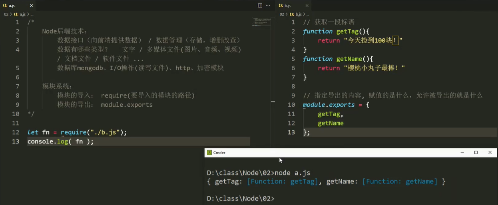
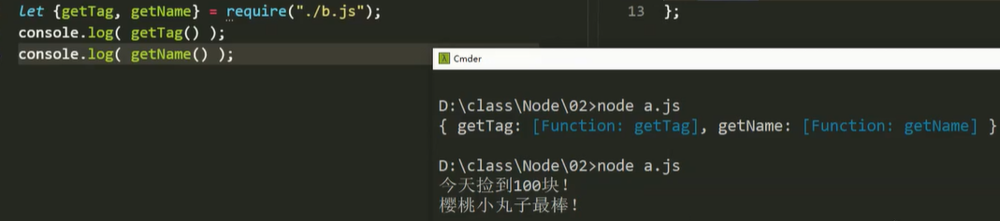
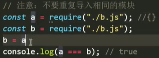
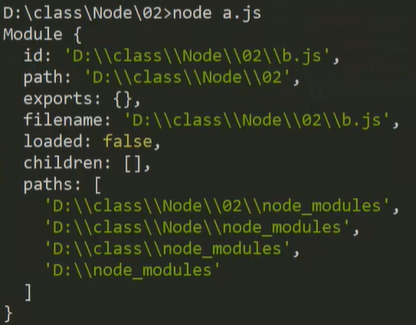
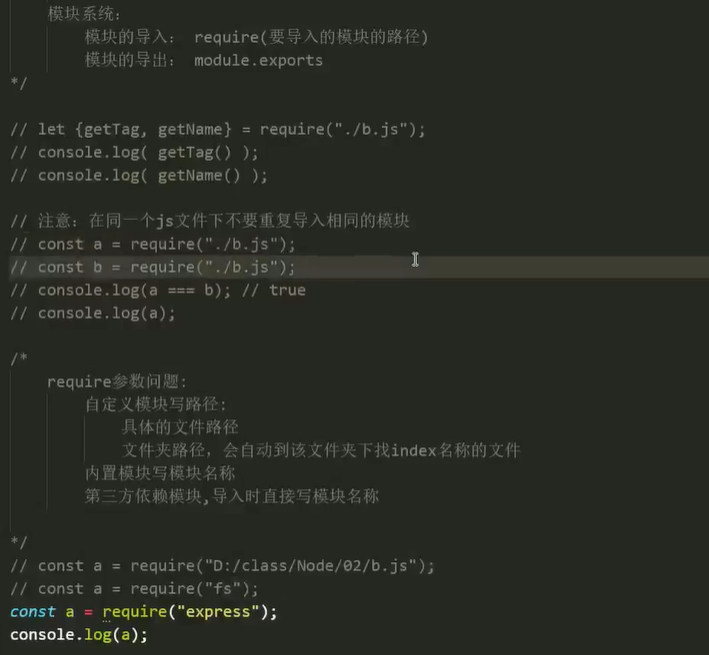

# 模块系统

### Node后端技术

后端技术主要包括：数据接口（向前端提供数据）、数据管理（存储，增删改查）。

##### 数据管理

- 数据有哪些类型？
- 后端进行管理的数据类型主要有：文字、多媒体（音视频）、文档文件、软件程序……
- 数据存在服务端，前端通过链接获取文件数据。【链接的作用：向服务器发起一个请求】
- 数据库：`MongoDB`（最适合前端）、`MySQL`（中小型项目）
- `I\O`操作：读写文件

##### 数据接口

- 模块：监听前端是否向后端发起请求的（`http、express、koa`）模块，加密模块。
- 模块，又称[构件](https://baike.baidu.com/item/构件)，是能够单独命名并独立地完成一定功能的程序语句的集合（即程序代码和数据结构的集合体）。
- 将代码按功能拆分并封装成各个模块，以方便直接调用。

<hr>

### 模块系统

每个模块可以决定要导出的内容（即允许被其他模块导入的内容）。


##### 模块导入

模块的导入：`require`（导入模块路径）

- 当导入模块不允许（未设置）导出内容时，默认返回一个空对象`{}`。
- `require()`执行后的结果是被导入模块设置的可导出的内容。
- 使用 `import` 也能导入指定模块，但`require`提供的功能更多。


##### 模块导出

模块的导出：`module.exports = 可导出内容；`【`module`是模块对象】

- 在每个模块使用 `module.exports` 属性，通过赋值的形式，决定要导出的内容。
- 可导出内容被作为结果返回给该模块调用者，即作为`require（）`的结果。

```js
// 通过module对象上的exports属性定义要导出的内容。
module.exports = 100; // 仅导出一条数据
module.exports = function test () {}; // 导出一个方法
module.exports = { // 导出一个对象
    name,
    changeName
}
```

 

  

注意事项：不要重复导入同一个的模块：

- 第一次导入执行模块代码后，得到结果。
- 第二次导入，直接获取第一次的结果。
-  
- 相当于执行`b = a；`，只执行一次模块代码，后续导入不执行，直接赋值其结果。


##### `module`对象

​      

模块对象：`module`不是全局对象，而是每个模块文件独有的对象。

- 通过`node`指令执行一个项目时，所有相关的文件都会首先添加一个`module`对象。
- 每个`js`文件都独有一个`module`对象。

快捷方式：使用内置`exports`对象定义导出
- `exports === module.exports；true`
- 只能通过`exports.属性名`的方式导出内容。如：`exports.a = a;`，详解看实质。
- 只需导出一个数据时，使用方便。重新赋值 `exports` 变量，将使其失去作用。
- 其实质还是调用`module.exports`对象来执行导出。【相当于在模块首`let exports = module.exports;`】

优先级：
- `exports`变量初始指向`module.exports`属性。【`let exports = module.exports;`】
- 当导出内容冲突时，`module.exports` 优先于`exports`。
  - 若`module.exports`导出的是一个对象，则`exports`仍指向旧的对象。
- 真正具有导出功能的，是`module.exports`。【`require`方法是对`module.exports`属性的引用】
- 多次调用`module.exports` 导出内容会被覆盖。

```js
// 相当于首先在模块首，隐式声明exports变量：let exports = module.exports;

const name = "wanzi",
      age = 16;

// 错误用法：module.exports被修改指向新的对象，而exports仍是对旧对象的引用。
module.exports = {
    name
};
exports.age = age; // 该数据被添加在旧的对象上，导出失效。

// 正确用法：建议只使用一种方式来定义导出。
module.exports.name = name;
exports.age = 18;
// 在module.exports对象上添加两个属性。【module.exports的引用没改变】
```


##### `require（参数）`

- 自定义模块写路径（相对或绝对）；内置模块和第三方包直接写模块名称。
  - 搜索第三方包：当前文件--`node_modules\package.json`文件--指定包目录--指定包的`index.js`文件【自动寻找该文件】。
  - `index`文件：通常作为入口文件、首页来使用。【默认被索引的文件】
- 如果`require（）`的参数是文件夹，则自动寻找其下的`index`文件。【`index`文件：作为默认打开项】
- 一个文件目录下只能存在一个`index`文件。

```js
let a = require("./a/index.js");
// 省略index.js，自动寻找
let a = require("./a");
```


##### 建议

- 一个文件夹代表一个功能，子功能放在子文件夹下，其下应有一个`index.js`文件。

<hr>

### 课堂笔记

 

