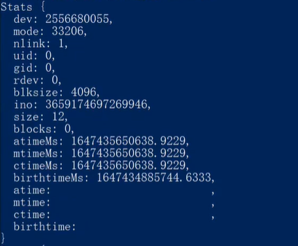
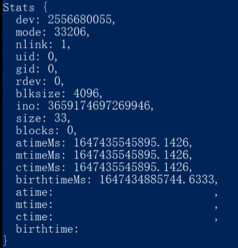
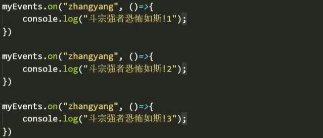

# 核心模块3

##### 删除文件【`unlink`方法】

使用`unlink`方法，删除指定位置的文件。

参数：`（路径，回调）`
- 回调：`（err）`

注意：

- 路径指向的文件必须存在，不存在则报错。
- `fs.unlink()`对空目录或其他目录不起作用。要删除目录，请使用`fs.rmdir()`。

适用场景：垃圾清理、更换文件。

```js
// 删除指定文件，文件必须存在。
fs.unlink("./wanzi.txt", err => {
    console.log(err); // 删除成功返回null
})
```


##### 删除目录【`rmdir`方法】

参数：`（路径，可选配置项，回调err）`【删除目录要谨慎！！！】

- 配置项：`maxRetries、recursive、retryDelay`
  - `maxRetries`：重试次数，默认值0。如果遇到`EBUSY、EMFILE、ENFILE、ENOTEMPTY`或`EPERM`错误，`Node.js`会重试该操作，每次重试的回退等待时间会比`retryDelay`多几毫秒。
  - `recursive`：递归模式，只有当递归模式为`true`时，才能使用其他两项。【递归模式已废除】
  - `retryDelay`：重试延时，两次重试之间等待的时间(以毫秒为单位)，默认值100。

```js
fs.rmdir("./wanzi", err => {
    console.log(err); // 删除成功返回null
})
```


##### 重命名文件/移动文件【`rename`方法】

参数`（要修改文件的路径，修改后的路径，回调err）`
- 同一目录下：重命名文件
- 不同目录下：移动文件，并重命名【移动文件要慎用】

注意：路径中的目录必须存在，该方法不会创建新文件夹。【创建文件夹需要系统权限】

```js
// 同一目录下，重命名文件
fs.rename("./wanzi.txt", "./cherry.txt", err => {
	console.log(err); // 重命名成功，返回null
})

// 不同目录下，移动并重命名文件
fs.rename("../04/cherry.txt", "./wanzi.txt", err => {
    console.log(err); // 操作成功，返回null
})
```


##### 监听文件【`watchFile`方法】

当被监听文件的内容发生变化时，触发该方法。【文件被保存一次，就触发一次】

参数：`（路径，可选配置项，回调）`

- 配置项：`bigint、persistent、interval`
  - `bigint`：是否要将回调的`stat`对象中的数值指定为`bigint`，默认值`false`。
  - `persistent`：用于指示在监视文件期间，进程是否应该继续运行，默认值`true`。【`persistent`：持续的】
  - `interval`：指示以毫秒为单位轮询目标的频率，默认值5007。【`interval`：间隔】

- 回调：`（改变后的状态，改变前的状态）`【记录着文件的状态】
-  

```js
fs.watchFile("./wanzi.txt", (c, p) => {
    console.log("文件内容已更改"); // 可实现热更新文档的功能
})
```

注释：

- 当一个`fs.watchFile`操作导致`ENOENT`错误时，它将重新调用侦听器一次，所有字段为零(或者，对于日期，`Unix Epoch`)。
- 如果稍后创建了该文件，则将使用最新的`stat`对象再次调用侦听器。

注意：使用`fs.watch`比使用`fs.watchFile`和`fs.unwatchFile`更有效。


##### 解除监听【`unwatchFile`方法】

使用`unwatchFile`方法，可以解除`watchFile`对指定文件开启的监听。

- 该方法一般写在`watchFile`的回调函数中，意味着执行一次回调后解除监听。即：只监听一次。
- 写在`watchFile`方法后面，则直接解除，意味着一次都不会监听。

参数：`（文件路径，监听器）`

- 当指定了监听器之后，只删除特定的监听器。否则，对该`path`文件的所有`watchFile`监听器都将被删除。 

```js
// 监听器，指的是watchFile的回调函数。
let path = "./wanzi.txt",
	test = (c, p) => {
    	console.log("文件内容发生变化");
    	fs.unwatchFile(path, test); // 只解除该watchFile监听器
	};

fs.watchFile(path, test);

fs.watchFile(path, (c, p) => {
    console.log("内容变了");
    fs.unwatchFile(path); // 解除对该path文件的所有watchFile监听。
})
```


##### 监听文件或目录【`watch`方法】

使用`fs.watch`方法，可以监听文件或目录的变化。该方法返回一个`<fs.FSWatcher>`对象。

参数：`path、options、listener`

- 一：要监听的路径，可以指向文件或者目录。
- 二：可选的配置项。当它是字符串时，用于指定编码格式；否则，应该是一个对象。
  - `persistent`：用于指示正在监视文件时，进程是否应继续运行。默认值`true`。
  - `recursive`：指示是监视所有子目录，还是只监视当前目录。当指定了目录时才适用，并且受限于平台的支持。默认值`false`。
  - `encoding`：指定传递给侦听器的文件名所使用的字符编码，默认值`"utf8"`。
  - `signal`：允许使用一个`AbortSignal`（中止信号）来关闭该侦听器。
- 三：回调侦听器。
  - `eventType`：事件类型，值要么是`"rename"`或者`"change"`。
    - 在大多数平台上，每当文件名在目录中出现或消失时，就会触发`'rename'`重命名事件。
    - 监听器回调被附加到`<fs.FSWatcher>`触发的`'change'`事件，但它与`eventType`的`“change”`值不一样。
  - `filename`：触发事件的文件名，受平台限制，并且不保证一定能返回文件名，可能会返回`null`。

注意事项：

- `fs.watch` 方法在不同平台上不是100%一致的，在某些情况下是不可用的。
- `recursive`递归选项仅在`macOS`和`Windows`上支持。当在不支持该选项的平台上使用该选项时，将会抛出`ERR_FEATURE_UNAVAILABLE_ON_PLATFORM`异常。
- 在`Windows`上，如果被监视的目录被移动或重命名，则不会触发任何事件。当被监视的目录被删除时，会报出`EPERM`错误。

```js
import { watch } from 'fs';

watch('somedir', (eventType, filename) => {
	console.log(`event type is: ${eventType}`);
	if (filename) {
    	console.log(`filename provided: ${filename}`);
	} else {
    	console.log('filename not provided');
	}
});
```

可用性：该特性依赖于底层操作系统提供一种通知文件系统更改的方式。

- 在`Windows`系统上，此特性依赖于`ReadDirectoryChangesW`。
- 如果由于某种原因底层功能不可用，则`fs.watch()`将无法运行，并可能引发异常。例如，当使用虚拟化软件(如`Vagrant`或`Docker`)时，在网络文件系统(`NFS、SMB`等)或主机文件系统上监视文件或目录可能是不可靠的，在某些情况下是不可能的。
- 但是仍然可以使用`fs.watchFile()`，它使用统计轮询。虽然这种方法比较慢，也不太可靠。

索引节点：`inode`

- 在`Linux`和`macOS`系统上，`fs.watch()`将路径解析为一个`inode`并监视该`inode`。
- 如果被监视的路径被删除并重新创建，它将被分配一个新的`inode`。
- 监视将发出一个删除事件，但将继续监视原始的索引节点。不会触发新`inode`的事件。这是预期的行为。
- `AIX`文件在文件的生命周期内保持相同的`inode`。
- 在`AIX`上保存和关闭监视文件将产生两个通知（一个用于添加新内容，另一个用于截断）。【截断：即覆盖】


#### 流【数据的传输过程】

小文件`（kb，Mb）`适合用`readFile`和`writeFile`方法来读写文件，大文件读写慢，则要用流的方式来读写。

- `readFile`和`writeFile`方法缺点：必须一次性读取或写入完整个文件，把文件放到缓存中后，再执行下一步。
- 流：一点一点的传输，读多少存多少。【大文件的读写采用数据流的方式传输】


##### 流读取【`createReadStream`方法】

创建可读流，以流的方式读取文件数据。

参数：`（文件路径，可选配置项）`

- 配置项：`flags、encoding、fd、mode、autoClose、emitClose、start、end、highWaterMark、fs`
  - `flags`：文件系统标志，默认值`"r"`
  - `encoding`：编码格式，默认值`null`。可以是`<Buffer>`所接受的任何编码。
  - `fd`：默认值`null`。如果指定了`fd`并省略或未定义`start`，则`fs.createReadStream()`将从当前文件的位置去顺序读取数据。
  - `mode`：默认值`0o666`，设置文件模式（权限和`sticky`位），但仅在创建文件时有效。
  - `autoClose`：默认值`true`
  - `emitClose`：默认值`true`。默认情况下，流被销毁后会触发一个`'close'`事件。将该选项设置为`false`可以更改此行为。
  - `start`：`start`和`end`用于从文件中读取一定范围的字节，而不是整个文件。
  - `end`：默认值`Infinity`。范围包含`start`和`end`并且从0开始计数，在[0, `Number.MAX_SAFE_INTEGER`]之间。
  - `highWaterMark`：高水位（每一次读取流不能超过的水位），默认值`64 * 1024`。
  - `fs`：默认值`null`

返回值：一个读取流对象`ReadStream{}`

监听读取：【`data`事件】【通过`on`方法调用内置事件】
- 监听读取过程中，数据的变化情况。
- 每一次读一点（读多少不确定），读一次触发一次`data`事件。【每一次，默认最多不超过`64kb`】
- 参数：`（data，回调）`【回调参数：保存着每一次读取到的一段内容】 

读取完成：【`end`事件】
- 监听到数据读取完毕后，触发`end`事件。
- 参数：`（end，回调）`【该回调没有参数】

```js
const rs = fs.createReadStream("./wanzi.txt"); // 对路径指向的文件创建一个可读流

// 通过on调用内置的data事件
rs.on("data", rsData => {
    console.log(rsData); // 查看每次读取到的数据，默认不超过64kb
    console.log("-------------本次读取到的数据-------------");
})

// 监听到数据读取完毕后，触发end事件。
rs.on("end", () => {
    console.log("读取完成");
})
```

 


##### 流写入【`createWriteStream`方法】

创建可写流，将文件一点一点写入到指定文件。存在则直接写入，不存在创建再写入。

参数：`（写入文件路径，可选配置项）`【文字写入配置：`{encoding：“utf8”}`】

- 配置项：`flags、encoding、fd、mode、autoClose、emitClose、start、fs`
  - `flags`：文件系统标志，默认值`"w"`
  - `encoding`：编码格式，默认值`"utf8"`。可以是`<Buffer>`所接受的任何编码。
  - `mode`：默认值`0o666`，设置文件模式（权限和`sticky`位），但仅在创建文件时有效。
  - `start`：从文件的指定位置开始写入数据，范围在[0, `Number.MAX_SAFE_INTEGER`]之间。【注意配置`flags`】

返回值：返回一个`WriteStream`对象，通过对象上的`write`和`end`方法来写入数据和关闭写入。

```js
const ws = fs.createWriteStream("./wanzi.txt", {
    flags: "r+", // 打开文件进行读写。
	encoding: "utf8",
    start: 10 // 从10 bytes的位置开始截断式写入。
});
```


##### 读写同步：

- 在监听读取过程中，写入数据。【需要手动关闭写入操作】

```js
// 创建可读流和可写流
const rs = fs.createReadStream("./wanzi.txt", {highWaterMark: 100 * 1024});
const ws = fs.createWriteStream("./cherry.txt", {encoding: "utf8"});

// 监听读取中，data的变化
rs.on("data", rsData => {
    // 调用write方法，写入数据
    ws.write(rsData); // 读多少就存多少，读写速度基本同步。
})

// 监听是否读取完毕
rs.on("end", () => {
    ws.end(); // 调用end方法，关闭写入操作
    console.log("数据读取完毕，并且写入完毕");
})
```

- 数据桥：直接连接读写操作【边读边写，方便快捷】【`pipe`管道输送方法】

```js
// 在读和写之间搭建管道，使读到的A数据直接流入B。不需要在意文件类型以及编码格式等。
fs.createReadStream("./video.mp4").pipe(fs.createWriteStream("./copyVideo.mp4"));

// 简单封装
function transferFile(ori, tar) {
    fs.createReadStream(ori).pipe(fs.createWriteStream(tar)); // 读写完成，自动关闭。
    console.log("读写完毕");
}
// 调用
transferFile("./video.mp4", "./copyVideo.mp4");

// 最终封装
function transferFile(rs, ws) {
    rs.pipe(ws);
    console.log("读写完毕");
}
const rs = fs.createReadStream("./wanzi.txt", {highWaterMark: 100 * 1024});
const ws = fs.createWriteStream("./cherry.txt", {encoding: "utf8"});
// 传入读写流对象
transferFile(rs, ws);
```


##### 流响应

将数据以流的方式读取，直接以流的形式响应出去，前端也以流的方式接收存储响应流。

```js
app.get("/", (req, res) => {
    res.pipe("读取流"); // 将读取流的数据通过管道直接响应出去。
})
```

<hr>

### 事件模块【events】

由于`node`没有浏览器与界面，所以没有`DOM`及`BOM`事件。

导入事件模块并实例化对象：

```js
const Events = require("events"); // 导入事件模块，返回一个事件构造器。
const events = new Events(); // 创建一个事件实例。
```

事件构造器：

```js
[Function: EventEmitter] {
  once: [AsyncFunction: once],
  on: [Function: on],
  getEventListeners: [Function: getEventListeners],
  EventEmitter: [Circular *1],
  usingDomains: false,
  captureRejectionSymbol: Symbol(nodejs.rejection),
  captureRejections: [Getter/Setter],
  EventEmitterAsyncResource: [Getter],
  errorMonitor: Symbol(events.errorMonitor),
  defaultMaxListeners: [Getter/Setter],
  setMaxListeners: [Function (anonymous)],
  init: [Function (anonymous)],
  listenerCount: [Function (anonymous)]
}
```

事件实例：

```js
EventEmitter {
  _events: [Object: null prototype] {},
  _eventsCount: 0,
  _maxListeners: undefined,
  [Symbol(kCapture)]: false
}
```


##### 注册事件【on】

调用实例上的`on`方法注册一个自定义事件。

参数：`（自定义事件名，回调函数）`【回调函数：事件核心逻辑】

一个事件可绑定多个回调处理程序：最多不超过10个，多个处理程序触发时，依次执行。

 

```js
const Events = require("events"); // 导入事件模块，返回一个事件构造器。
const events = new Events(); // 创建一个事件实例。

// 注册事件
events.on("wanzi", () => {
    console.log("斗宗强者，恐怖如斯！1");
})

// 给同一事件绑定多个回调处理程序。
events.on("wanzi", () => {
    console.log("斗宗强者，恐怖如斯！2");
})

events.on("wanzi", () => {
    console.log("斗宗强者，恐怖如斯！3");
})
```


##### 触发事件【emit】

调用实例上的`emit`方法，通过自定义的事件名，来执行对应的事件。

参数：`（指定事件名，实参……）`【通过事件名，触发指定事件】

- `node`的事件，一般默认同步执行。

```js
// 注册事件
events.on("wanzi", () => {
    console.log("斗宗强者，恐怖如斯！1");
})
// 执行事件
events.emit("wanzi");

// 使用参数
events.on("wanzi", (a) => {
    console.log("斗宗强者，恐怖如斯！1", a);
})
events.emit("wanzi", "天哪！");
```


##### 解绑事件【`removeListener`】

解绑事件的核心是：解绑该事件的回调函数。

参数：`（事件名，其回调函数）`。

- 一般注册事件时，推荐使用具名函数作回调，方便后期解绑。【不解绑可匿名】
- `removeListener`一次只能解绑单个事件的一个处理程序。

```js
// 定义回调
let handle = () => {
    console.log("斗宗强者，恐怖如斯！");
}

// 注册事件
events.on("wanzi", handle);

// 执行事件
events.emit("wanzi");

// 解绑回调
events.removeListener("wanzi", handle);
```


##### 事件回调数组【`listeners`】

通过事件实例上的`listeners`方法，可以得到一个数组，它包含绑定在指定事件上的所有回调处理函数的引用。

参数：事件名称。

```js
// 注册事件，并绑定多个回调处理程序。
events.on("wanzi", () => {
    console.log("斗宗强者，恐怖如斯！1");
})

events.on("wanzi", () => {
    console.log("斗宗强者，恐怖如斯！2");
})

events.on("wanzi", () => {
    console.log("斗宗强者，恐怖如斯！3");
})

// 获取三个回调函数的引用
events.listeners("wanzi"); // [[Function (anonymous)], [Function (anonymous)], [Function (anonymous)]]

// 解绑该事件上的所有回调
let hArr = events.listeners("wanzi");

for (const h of hArr) {
    events.removeListener("wanzi", h);
}
```


##### 解绑所有事件【`removeAllListener`】

调用事件实例上的`removeAllListener`方法，可以清空指定事件上的所有回调处理，也可以清空事件实例对象上的所有事件处理程序。

```js
// 不传参时，清空所有
events.removeAllListener(); // 清空在事件实例上注册的所有事件及其回调。

// 传递参数，清空指定事件上的所有回调。
events.removeAllListener("wanzi");
```


##### 一次性事件【`once`】

调用事件实例上的`once`方法，可以注册一次性事件。

触发：只触发一次【在第一次触发后，自动解绑】
```js
// 注册一次性事件
events.once("wanzi", (name, age) => {
    console.log(name, age);
})

// 第一次执行后，自动解绑。
events.emit("wanzi", "丸子", 16);
```

