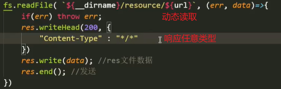

# 前后端交互

前端发起请求的底层逻辑是`Ajax`实现的，因此，前后端交互的唯一方式是`Ajax`实现。【局部刷新】

表单也可以发起请求，但利用表单发起请求会刷新页面。


### 传输文件

##### 前端发起请求

- 借用浏览器，向后端发起请求，如：链接，地址栏等。

##### 后端响应请求

- 搭建本地服务器，监听响应
- 读取文件，写动态路径
- 编写响应头，规定`MIME`类型
- 写入响应数据，发送响应
  -   

```js
// 导入模块
const http = require("http");
const fs = require("fs");
// 搭建服务
http.createServer((req, res) => {
    // 获取请求的路径
    const {url} = req;
    // 判断需求文件
    if (url === "/") {
        // 获取首页文件，写动态的文件路径。
        fs.readFile(`${__dirname}/resource/page/index.html`, (err, data) => {
            if(err) throw err;
            // 写响应头
            res.writeHead(200, {
                "Content-Type": "text/html"
            })
            // 写入响应数据
            res.write(data);
            // 发送响应
            res.end();
        })
    }
}).listen(8080, "127.0.0.1");
```


##### 案例

请求`HTML`文件，加载`CSS`文件和图片

- `HTML`中所有写了网络地址的属性，会自动发起一个能跨域的`get`请求，如：`src，href`。
-   
- 此处没有状态码，说明正在请求，需要后端接收请求并响应。
-   


##### 封装简化：访问静态资源文件

- 利用前端发起请求的 `url` 拼接到读取文件的路径中，动态读取文件。【动态读取】
  -  
  - 将`resource`作为静态资源文件夹，统一到该文件夹中来获取文件。
  - 缺点：设置响应任意类型，虽然能响应返回`CSS`文件，但这些样式无法渲染到页面中。
- 优化
  - 通过前端发起请求的 `url` 后缀名，来动态设置响应的`MIME`类型【动态类型】

```js
// 导入模块
const http = require("http");
const fs = require("fs");
const path = require("path");

// 搭建服务
http.createServer((req, res) => {
    // 获取请求的路径
    const {url} = req;
    // 判断需求文件
    if (url === "/") {
        // 获取首页文件，写动态的文件路径。
        fs.readFile(`${__dirname}/resource/index.html`, (err, data) => {
            if(err) throw err;
            // 写响应头
            res.writeHead(200, {
                "Content-Type": "text/html"
            })
            // 写入响应数据
            res.write(data);
            // 发送响应
            res.end();
        })
    } else {
        // 通过url动态获取静态文件，静态资源的路径与url必须保持一致。
        fs.readFile(`${__dirname}/resource/${url}`, (err, data) => {
            if(err) throw err;
            res.writeHead(200, {
                "Content-Type": getMIMEType(path.extname(url)) // 从url中获取扩展名
            })
            res.write(data);
            res.end();
        })
    }
}).listen(8080, "127.0.0.1");

// 通过扩展名，获取MIME类型
function getMIMEType (extname) {
    switch(extname) {
        case ".css":
            return "text/css";
        case ".png":
            return "image/png";
        case ".ico":
            return "image/x-icon";
        default:
            return "";
    }
}
```


##### 静态资源服务器

- 设置静态资源文件夹，统一资源调配，所有的静态资源请求都会到该文件夹中来请求文件。
-  

```js
// 安装并导入express框架
const express = require("express"),
      app = express();

// 配置静态资源服务器（静态资源文件夹）
app.use(express.static("./resource"));

app.listen(8080);
```


### `Ajax`前后端交互

前端页面发送`ajax`请求，通常需要以下五步：

```js
// （1）创建异步请求对象：new XMLHttpRequest()
let xhr = new XMLHttpRequest();

// （2）设置请求参数，包括请求的方法和请求的url。【open方法】
xhr.open("get", "http://www.xxx.com:0000/a/b");
xhr.setRequestHeader("Accept": "application/json"); // 请求头

// （3）发送请求，通过send方法
xhr.send();

// （4）监听响应状态，通过onreadystatechange事件，状态改变自动触发。
xhr.onreadystatechange = function () {
    // 判断响应状态以及状态码，确保返回的数据是完整的。
    if (xhr.readyState === 4 && xhr.status === 200) {
        
        // （5）解析返回内容，并渲染到页面。【response属性】
        let data = JSON.parse(xhr.response);
        console.log(data);
    }
}
```

案例：点击按钮发起请求，修改`span`里的内容。

- 前端
  - 绑定点击事件
  - 发起`Ajax`请求：向指定路径（必须携带协议）/ 网址，发起一个`get`请求，并设置监听响应。
  - 监听到响应，将`Ajax`请求对象获取到的响应数据对象化，并将数据渲染到页面。
  -  
- 后端
  - 根据请求的 `url` 判断需求，返回二进制数据【存放到`Ajax`请求对象的`response`属性中，最终以`JSON`的字符串形式呈现】

```json
// 准备一个json文件
[
    {
        name: "丸子",
        age: 16,
        sex: "女"
    },
    {
        name: "萧俊轩",
        age: 14,
        sex: "男"
    }
]
```

```js
const http = require("http"),
      fs = require("fs");

http.createServer((req, res) => {
    const {url} = req;
    if (url = "/api/userData") {
        // 读取json文件
        fs.readFile(`${__dirname}/userData.json`, (err, data) => {
            if(err) throw err;
            res.writeHead(200, {
                "Content-Type": "text/json",
                "Access-Control-Allow-Origin": "http://127.0.0.1:5501",
                "Vary": "Origin"
            })
            res.write(data);
            res.end();
        })
    }
}).listen(8080, "127.0.0.1");
```

阻止跨域：人为地调用接口去发起请求，会被同源策略限制，阻止跨域。【操作`XMLHttpRequest`对象】

因此，在地址栏，点击链接等访问请求，并不会被阻止跨域。

