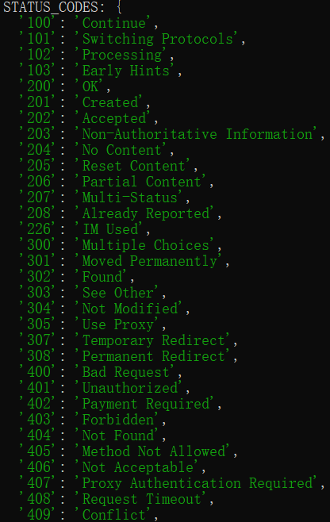
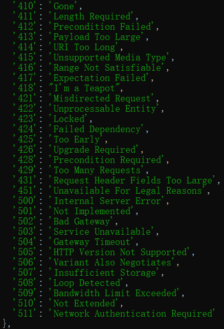
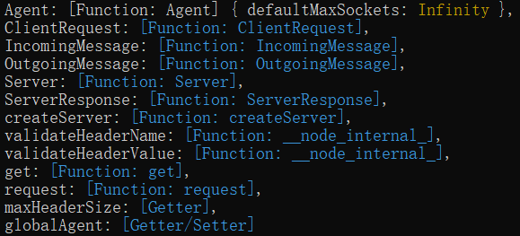
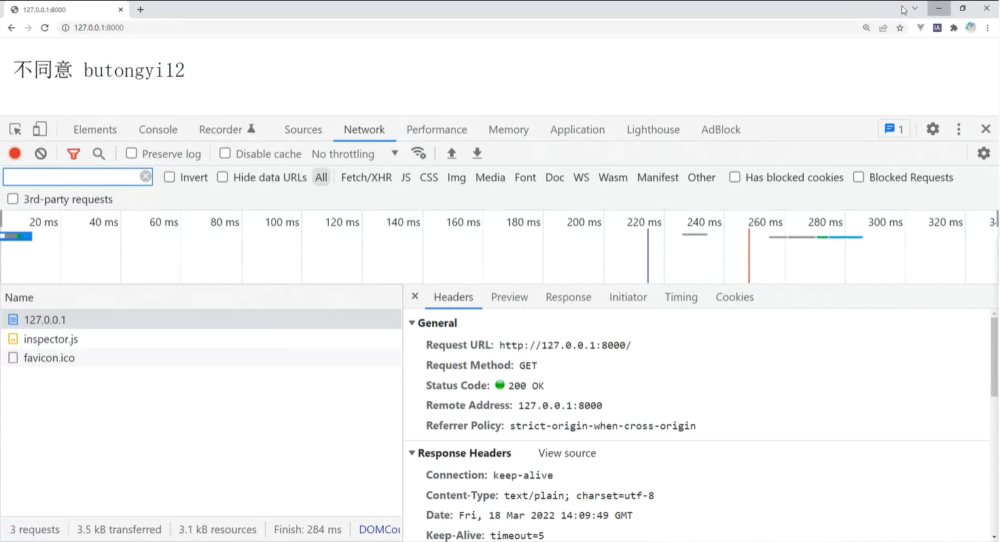
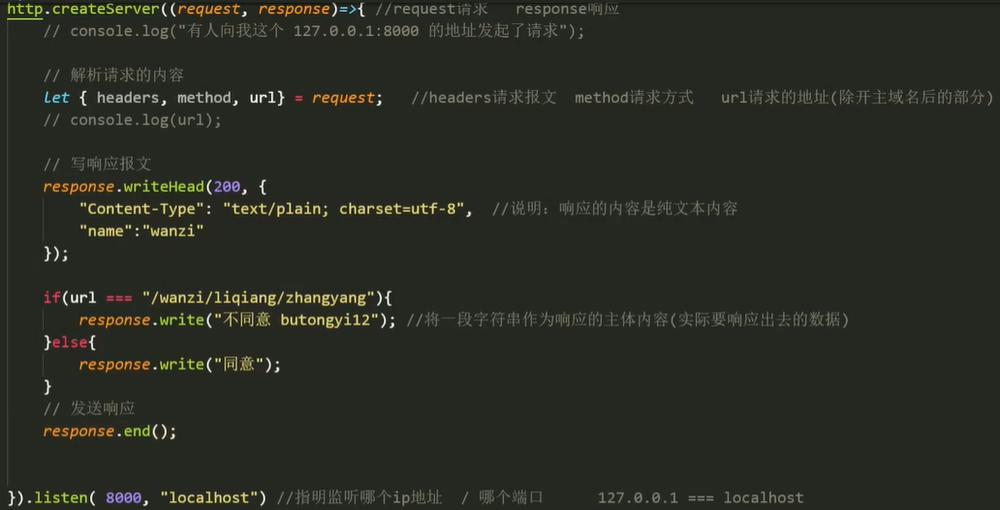
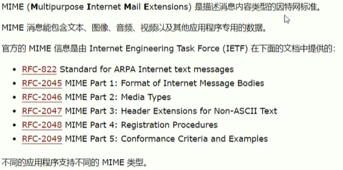

# 核心模块4

### HTTP模块

客户端：用户用于上网的平台（电脑，`APP`程序等），也称为前端。

服务器：相当于一台电脑，里面可以安装一个数据库，存储客户端所需的所有数据，也称为后端，还可以运行后端代码。

过程：前端向后端发起请求，后端响应请求，返回所需内容。【前后端通过网络连接，形成互联网】

`HTTP`：超文本传输协议；	`HTTPS`：安全超文本传输协议。

客户端通过网址向该网址所指向的服务器发起请求，服务端监听到请求后，向发起请求的客户端返回内容。

- 请求：前端向后端发起请求，获取所需数据。
- 响应：后端响应前端的请求，返回所需数据。


#### 搭建本地服务器

##### HTTP对象

```js
// 获取一个http对象
const http = require("http");
```

请求方法：

  

状态码：反映本次沟通（通信）后的结果（状态）。【200 - 308正常】

   

HTTP方法：

  

域名：最终被解析成唯一性的`IP`地址【`IP`地址：每一台上网设备的标识码（编号）】【每台服务器对应一个`IP`】


##### 创建服务【`createServer`】

使用`createServer`方法创建一个服务，用来监听请求以及发送响应。

参数：`可选配置项，回调`

- 配置对象：
  - `IncomingMessage`：指定要使用的`IncomingMessage`类，对于扩展原始的`IncomingMessage`类非常有用。
  - `ServerResponse`：指定要使用的`ServerResponse`类，对于扩展原始的`ServerResponse`类很有用。
  - `insecureHTTPParser`：是否使用不安全的`HTTP`解析器，为`true`时接受无效的`HTTP`报头。应该避免使用不安全的解析器。
  - `maxHeaderSize`：请求头的最大长度，以字节为单位。默认值：16384 (`16kb`)。
  - `noDelay`：如果设置为`true`，它将在接收到新的传入连接后立即禁用`Nagle`算法。
  - `keepAlive`：如果设置为`true`，它将在接收到新的传入连接后立即在`socket`上启用`keep-alive`功能。【`socket`：套接字】
  - `keepAliveInitialDelay`：在空闲的`socket`上发送第一个`keepalive`探测之前，设置一个初始的延迟。【正数，默认0】

- 回调：`（request，response）`，该回调`(requestListener)`是一个自动添加到`'request'`事件的函数。

  - `request`：请求信息对象，是`IncomingMessage`类的一个实例。

  - `response`：响应信息对象，是`ServerResponse`类的一个实例。


返回值：返回一个`http.Server`的实例。

```js
const http = require("http");
// 创建一个服务
http.createServer((req, res) => {
    console.log(req);
})

// 分开写法：
const server = http.createServer();
server.on("request", (req, res) => { // 监听请求事件
    console.log(req);
})
```


##### 监听请求【`listen`】

指明监听哪个`IP`地址以及端口号，用来监听向该`IP`及端口发起的任一请求。

参数：（端口号，`IP`地址）
- 端口：每个服务器上的接口
  - 小程序、默认程序等系统程序会占用一些小的端口。
  - 服务器默认端口为：8080，简称：80端口。
  - 自己使用端口时，尽量选择中间靠后的端口，4000 - 8000。
  - 同一台服务器上，不能同时占用一个端口。
- `IP`地址：本地`IP`地址，网络`IP`地址
  - 本地`IP`：`127.0.0.1` 或者 `localhost`。

```js
const http = require("http");
// 创建一个服务
http.createServer((req, res) => {
    console.log(req);
}).listen(8000, "127.0.0.1"); // 监听向"127.0.0.1"上8000端口发起的所有请求。

// 分开写法
const server = http.createServer();

server.on('request', (request, res) => {
	res.writeHead(200, { 'Content-Type': 'application/json' });
    
	res.end(JSON.stringify({
    	data: 'Hello World!'
	}));
});

server.listen(8000); // 默认监听本地服务器
```

发起请求：借助浏览器，在地址栏输入`IP`及端口来发起一次`get`请求。


##### 请求响应

通过`request`对象，解析请求的内容。

- `request`参数中保存着本次请求的所有信息。【`request`对象】
- 解析请求的内容：
  - 常用`request`对象上的三个属性：`headers，method，url`
    - 请求报文：`headers`，描述本次请求的内容信息【要什么】
    - 请求方法：`method`，本次请求所采用的方法。
    - 请求地址：`url`，本次请求携带的路由（端口后的路径）默认为：/ 根地址。

```js
const http = require("http");

http.createServer((req, res) => {
    // 解析请求
    // headers：报文对象，method：请求方法，url：请求路由
    const {headers, method, url} = req;
    
    // 准备响应
}).listen(8000);
```

通过`response`对象，发送响应内容。

报文的三个重要部分：起始行，首部，主体。

- 起始行：请求的方式、路由和协议等；响应的协议和状态码等。
- 首部：描述信息【用于明确内容，减少沟通成本】
- 主体：实际要提交或者响应出去的数据。【`get`请求的报文没有主体】

 


#### 准备响应【`response`对象】

##### 写入报文【`writeHead`】

增强对主体内容的描述，告诉接收方应如何解析内容，避免乱码。

参数：`（状态码，配置对象）`
- 状态码：返回一个状态码，告知发起者：“您发起的请求，是否已响应成功”。
- 配置对象：对主体内容（实际发送数据）的描述信息
  - `“Content-Type”`：说明响应内容的`MIME`类型
    - 纯文本类型：输入`"Content-Type": "text/plain; charset = utf-8"`，指定编码格式。
    -  
  - 自定义报文：前后端约定好的字段【名值对格式】

```js
http.createServer((req, res) => {
    const {headers, method, url} = req;
    
    // 写响应报文
    res.writeHead(200, {
        "Content-Type": "text/plain; charset=utf-8", // 响应纯文本内容
        "name": "wanzi" // 约定的自定义字段
    });
}).listen(8000);
```


##### 写入主体内容【`write`】

- 参数：`（主体数据）`
- 可以通过`url`路由的判断，来发送不同的内容。

```js
http.createServer((req, res) => {
    const {headers, method, url} = req;
    
    // 写响应报文
    res.writeHead(200, {
        "Content-Type": "text/plain; charset=utf-8", // 响应纯文本内容
        "name": "wanzi" // 约定的自定义字段
    });
    
    // 根据url，响应内容
    if (url === "/wanzi/txt") {
        res.write("不同意");
    } else {
        res.write("同意");
    }
}).listen(8000);
```


##### 发送/结束响应【end】

 


##### 报文的重要意义

- 明确消息（请求或响应）的内容，减少沟通成本。


##### `MIME`类型

-  

- 早期的报文是基于`MIME`类型标准来制定的。

-  

更多参考：https://www.runoob.com/http/mime-types.html

