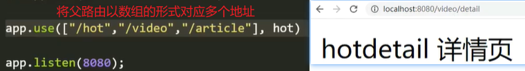
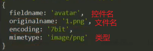
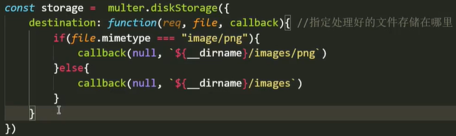
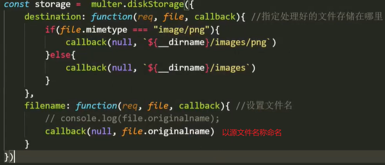
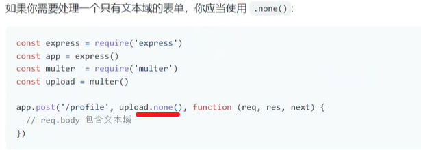

# 路由挂载

传统的监听路由方式：有多少个路由，写多少个监听。

这种方式相当繁琐，而且不灵活，例如：当要对子业务的父路由修改时，其下的所有子路由都要对应修改。

```js
// 传统挂载方式：单独监听每一段路由
const express = require("express"),
      app = express();

// 监听hot模块
app.get("/hot", (req, res) => {
    res.send("hot");
})
app.get("/hot/list", (req, res) => {
    res.send("热门列表页");
})
app.get("/hot/detail", (req, res) => {
    res.send("热门详情页");
})

// 修改hot模块及其相关路由
app.get("/wanzi", (req, res) => {
    res.send("wanzi");
})
app.get("/wanzi/list", (req, res) => {
    res.send("列表页");
})
app.get("/wanzi/detail", (req, res) => {
    res.send("详情页");
})
```

如上：改`hot`模块，所有与`hot`相关的路由都要作修改。


### 路由挂载方式

路由挂载的方式：新建一个`express`服务，将单个子业务的路由专门挂载到这个服务上，再以中间件的形式挂载到主服务上。

优点：统一管理，方便快捷，符合模块化开发规范。

```js
// 传统挂载方式：单独监听每一段路由
const express = require("express"),
      app = express();

// 监听hot模块
app.get("/hot", (req, res) => {
    res.send("hot");
})
app.get("/hot/list", (req, res) => {
    res.send("热门列表页");
})
app.get("/hot/detail", (req, res) => {
    res.send("热门详情页");
})


// 路由挂载方式：子应用监听路由
const express = require("express"),
      app = express(), // 主应用服务
      hot = express(); // 子应用服务

// 使用hot应用监听路由
hot.get("/list", (req, res) => {
    res.send("热门列表页");
});
hot.get("/detail", (req, res) => {
    res.send("热门详情页");
});

// 将hot应用挂载到主应用上
app.use("/hot", hot); // 将"/hot"作为hot应用的根路由，当路由匹配时，触发hot应用服务。
```

- 创建一个新服务，专门管理该子业务的路由【分路由】
- 将该业务所有相关的路由监听挂载到这个服务上。
- 主服务通过使用中间件的方式，将该服务挂载到该应用上。
  - 第一个参数：指定一个路径为该服务所有挂载路由的父路由。【服务中挂载的子路由将拼接在其后】
  - 第二个参数：将该服务以中间件的方式挂载到主服务上。【建立服务联系】
- 当需要修改业务的父路由时，只需修改第一个参数即可。【父路由也可以是动态路由】


##### 模块化

- 将单个业务的各种路由处理写到一个`JS`文件中，最后导出服务。
- 在入口文件中导入服务，并挂载到主服务上。

```js
// 在hot.js文件中
const express = require("express"),
      hot = express();

// 对各种子路由的业务处理
hot.get("/list", (req, res) => {
    res.send("hotlist 列表页");
})

hot.get("/detail", (req, res) => {
    res.send("hotdetail 详情页");
})

// 导出应用
module.exports = hot;


// 在主应用文件中
const express = require("express"),
      hot = require("./router/hot.js"),
      app = express();

// 挂载到主服务上
app.use("/hot", hot);

app.listen(8080);
```


##### 多个地址服务

多个地址只对应一个服务，路由拼接后就会导致一个页面对应多个地址，点击其中任一地址都只会跳回同一个页面。

 

注释：无论以哪个地址作为父路由，最终都进入同一个服务：`hot`应用服务。

```js
// 将use的path参数以数组的形式给出，使多个根路由对应同一个服务。
app.use(["/hot", "/article", "/video"], hot);
```


# 上传文件

- 前端：发起请求，提交文件（数据）。

- 后端：监听请求，解析文件，保存到指定位置。

提交文件主要有两种方式：`form`表单【旧】，`Ajax`带发【新】。

- 以发送表单的方式提交数据，每一次提交都要刷新页面。【可跨域】
- `Ajax`发送局部数据，则不需要刷新。【不可跨域】
- 无论以哪种方式，`multer`只允许接收表单格式的数据。即：`Ajax`传输的数据需要表单化。


### 表单上传

表单的三个重要属性：`action，method，enctype`。

- `action`：提交的地址【完整的地址，不受同源限制】
- `method`：提交的方式，如：`post`。
- `enctype`：数据传输的格式，如：以表单的格式传输 --- `"multipart/form-data"`。

前端页面

```html
<form action="http://localhost:8080/api/postData" method="pose" enctype="multipart/form-data">
    <input type="text" name="username">
    <input type="file" name="avatar"> 	 <!-- name属性：数据提交时的数据名 -->
    <input type="submit" value="提交">   <!-- value属性：数据提交时的数据值（通常） -->
</form>
```

后端处理

```js
const express = require("express"),
      app = express();

app.post("/api/postData", (req, res) => {
    res.send("接收到了你提交的表单数据");
})

app.listen(8080);
```

注释：表单数据比较复杂，可能包含文件，文本，密码等。后端处理提交的表单数据，在`node`中常用`multer`插件。


### 使用`multer` 

更多参考：https://www.npmjs.com/package/multer


##### 配置文件上传

设置配置对象，决定如何处理上传文件，例如：将文件保存到哪个位置。

- 配置对象：`upload【const upload = multer({})】`
- 属性：
  - `dest`：指定文件存储的目录，不存在则创建。【`destination`：目的地】
  - `storage`：将处理文件存储方式的配置对象挂载到此处。【挂载后`dest`将失效】
- 作用：配置对象通常当作中间件来使用，在监听时对文件先进行处理，再在回调中返回结果。
- 配置`array`：
  - `array`方法中的两个参数，指定只接收由指定`name`控件传输过来的文件以及最大数量。
    - 第一个：与前端上传控件的`name`名相对应，指定该监听只接收由该控件上传的文件。
    - 第二个：设置最大的接收数量。
  - 文件以临时文件的形式存储，`MD5`的随机名称，且无扩展名。

```js
const express = require("express"),
      multer = require("multer"),
      app = express();

// 配置multer插件，将其返回值当作中间件去使用
const upload = multer({
    dest: `${__dirname}/images` // 指定上传文件的存储目录
})

// 对提交路径进行监听，先经过upload中间件的处理。
app.post("/api/postData", upload.array("avatar", 12), (req, res) => {
    res.send("已接收到表单数据");
})

app.listen(8080);
```


##### 磁盘存储引擎

磁盘存储引擎可以让你完全控制文件的存储。【`DiskStorage`：磁盘存储引擎】

配置对象：`storage`【`const storage = multer.diskStorage({})`】

属性：
- `destination`：该方法用来指定将处理好的文件保存到哪个位置。【比`dest`更详细】
  - 参数：
    - `req`：监听到的请求对象，
    - `file`：监听到的文件对象，如下：
      -  
    - `callback`：回调执行程序。
      - 必须使用`callback`才能执行保存。
      - 参数：`（null，存储地址）`【存储地址必须存在，否则报错】
      -  
- `filename`：设置文件名相关
  - 参数：`（null，文件名）`
  -  
  - 注意：一般不推荐使用上传文件自身的名称作为保存时的文件名，同名容易冲突。【添加`MD5`值】

注释：

- 传递一个`null`作为`callback`的首参，是一种调用回调的约定。【更多参考：`node.js`的错误处理】
- `filename`用于确定文件的保存名称。如果没有给出文件名，则每个文件将被给出一个不包括任何文件扩展名的随机名称。
- `Multer`不会为你追加任何文件扩展名，你的`filename`函数应该给出一个带有文件扩展名的完整文件名。

最后，挂载到插件上使用，即：配置到`upload`对象上。注意：配置了`storage`，不必再配置`dest`。

```js
const express = require("express"),
      multer = require("multer"),
      path = require("path"),
      app = express();

// 配置一个磁盘存储引擎对象
const storage = multer.diskStorage({
    destination: function (req, file, callback) {
        // 将png单独存储，其他文件统一存到外面
        if (file.mimetype === "image/png") {
            callback(null, `${__dirname}/images/png`);
        } else {
            callback(null, `${__dirname}/images`);
        }
    },
    filename: function (req, file, callback) {
        // 获取一个随机的数，作为文件的前缀名称。
        const uniqueSuffix = Date.now() + "-" + Math.round(Math.random() * 1E9);
        callback(null, `${uniqueSuffix}_${file.fieldname}${path.extname(file.originalname)}`);
    }
})

// 配置一个multer插件对象
const upload = multer({
    storage // 将磁盘存储引擎挂载到插件上使用
})

// 监听对该路由的提交请求，首先经过multer插件的处理。
app.post("/api/postData", upload.array("avatar", 10), (req, res) => {
    res.send("已收到");
})

app.listen(8080);
```


##### 文本数据【`req.body`】

`multer`插件在监听时的`req`上添加了一个`body`属性，里面保存着上传表单中的文本数据。

`req.body`对象：

- 文本数据以对象的形式存储，控件名`name`为属性，输入值`value`为值。
- `req.body`可能没有完全填满，这取决于客户端向服务器传输字段和文件的顺序。

```js
// 原生的req上没有body，是经过multer插件的处理后添加上去的。
app.post("/api/postData", upload.array("avatar", 5), (req, res) => {
    console.log(req.body); // 表单中提交的文本数据
})
```


##### 多个控件上传【`fields`】

使用`upload.array`只能处理单个控件的文件上传，而使用`upload.fields`中间件，可以处理多个控件的上传文件。

参数：是一个数组，数组内以对象的形式存放着对多个控件上传信息的单独处理。

```js
// 处理单个控件的文件上传
app.post("/api/postData", upload.array("avatar", 5), (req, res) => {});

// 处理多个控件的文件上传
app.post("/api/postData", upload.fields([
        {
            name: "avatar1", // 控件1
            maxCount: 2
        },
        {
            name: "avatar2", // 控件2
            maxCount: 5
        }
	]),
	(req, res) => {
    	console.log(req.body);
    	res.send("接收到了");
	}
);

app.listen(8080);
```

<hr>

### `Ajax`发送

当使用控件提交数据时，不希望刷新页面，则可以使用`Ajax`来发送数据。【注意跨域问题】

前端：

- 引入`axios`请求：`<script src="https://unpkg.com/axios/dist/axios.min.js"></script>`
- 给按钮添加点击事件，点击按钮获取并提交数据。
- `axios`提交：`axios.post(url，{data，……}).then(res)`
- 由于后端使用`multer`插件，该插件只接收`form`表单格式的数据，因此前端传输数据的格式需要表单化。
- 创建一个表单数据实例，将数据以名值对的形式存入该实例中，发送给后端。

```html
<body>
    <form>
        <input type="text" name="username" class="username">
        <input type="file" name="avatar" class="avatar">
        <input type="button" value="提交" class="submit">
    </form>
</body>
<script>
	let username = document.querySelector(".username"),
        avatar = document.querySelector(".avatar"),
        submit = document.querySelector(".submit");

    // 创建一个表单对象，将表单数据以名值对的形式填入表单对象。
    let formData = new FormData();
    
	submit.onclick = function () {
		axios.post("http://localhost:8080/api/postData", {
			data: {
				formData // 将填充好的表单对象发送到后端
            }
        }).then(res => {
            console.log(res);
        })
	}
</script>
```


##### 获取控件中的数据

- 文本框：`value`
- 文件：`files[0]`
  -  


##### 数据填充给表单实例

通过`append()`将获取到的数据填充到表单实例中。`formData.append(数据名，值);`

通过名值对的形式存入表单对象，一般以控件名为数据名。

注意：填入表单对象后，并不能直接查看到数据，只能通过`get`方法查看。

发送表单对象：由于提交表单一般是作为一个单独的请求发送，所以直接将表单对象作为`data`的值传递即可。

```js
let username = document.querySelector(".username"),
        avatar = document.querySelector(".avatar"),
        submit = document.querySelector(".submit");

    // 创建一个表单对象，将表单数据以名值对的形式填入表单对象。
    let formData = new FormData();
    
	submit.onclick = function () {
        // 将表单数据以名值对的形式填入表单对象。
        formData.append(username.name, username.value);
        formData.append(avatar.name, avatar.files[0]);
        
		axios.post("http://localhost:8080/api/postData", {
			data: formData
        }).then(res => {
            console.log(res);
        })
	}
```


后端：

- 设置允许跨域，在回调中使用`res.header`或`res.set`方法。
  - `header`方法：`res.header("Access-Control-Allow-Origin" , '*');`【适用于`get`】
  - `set`方法：`res.set({"Access-Control-Allow-Origin" : '*'});`【适用于`get`】
  - 使用`cors`中间件，自动设置允许跨域。下载并导入`app.ues(cors());`【适用于所有】
- 由于`multer`只接收表单类数据，因此，使用`axios`提交的非表单类数据的文本数据不会被放到`res.body`中。
- 此时，需要前端通过使用`FormData()`，将数据整理为表单格式后再提交。 
- 通过将数据格式表单化之后，后端接收的文本数据被存放在`res.body`中。
- 当处理一个只有文本数据的表单时，可以使用`none`方法作为中间件处理监听。
  -  

```js
const express = require("express"),
      multer = require("multer"),
      cors = require("cors"),
      app = express();

// 允许跨域
app.use(cors());

// 配置一个磁盘存储引擎对象
const storage = multer.diskStorage({
    destination: function (req, file, callback) {
        // 将png单独存储，其他文件统一存到外面
        if (file.mimetype === "image/png") {
            callback(null, `${__dirname}/images/png`);
        } else {
            callback(null, `${__dirname}/images`);
        }
    },
    filename: function (req, file, callback) {
        // 获取一个随机的数，作为文件的前缀名称。
        const uniqueSuffix = Date.now() + "-" + Math.round(Math.random() * 1E9);
        callback(null, `${uniqueSuffix}_${file.fieldname}${path.extname(file.originalname)}`);
    }
})

// 配置一个multer插件对象
const upload = multer({
    storage // 将磁盘存储引擎挂载到插件上使用
})

// 监听对该路由的提交请求，首先经过multer插件的处理。
app.post("/api/postData", upload.array("avatar", 10), (req, res) => {
    res.send("已收到");
})

app.listen(8080);
```

