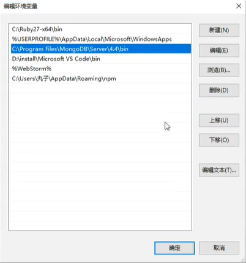
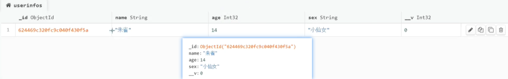

# 数据库

一般地，能满足实现对数据的增删改查功能的程序都可以被称为数据库。如：广义上的`Excel`表格、文件柜等。

概念：

- 数据库是**“按照数据结构来组织、存储和管理数据的仓库”**。

- 是一个长期存储在计算机内的、有组织的、可共享的、统一管理的大量数据的集合，被称为**“电子化的文件柜”**。

数据库可分为：关联型和非关联型。

- 关联型：每张表之间具有一定的关联，一般通过`ID`关联起来。特点：复杂难管理，数据量较大。
- 非关联型：表与表之间没有任何关联。特点：简单易操作，数据量较少。

前端常用数据库：`MongoDB`【中小型项目】

<hr>

### 安装数据库【`MongoDB`】

可以将数据库与可视化工具（`MongoDB Compass`）分开安装，数据库默认配置不要改，可视化工具可以安装在其他地方。

安装：https://www.mongodb.com/try/download/community【4.4.13版】


##### 检查安装

输入`mongo`指令，检查数据库是否安装成功。出现版本号且没报错即为成功。

安装不成功时，检查环境变量：

- 查看高级系统设置 -- 环境变量 -- 用户变量`Path` -- 编辑 -- 新建`C:\Program Files\MongoDB\Server\bin` -- 确定
-  

如果提示系统无权限：

- 首先下载`zip`免安装版的`MongoDB`数据库。
- 然后在系统盘的`Program Files`目录中新建一个`MongoDB`目录，将下载好的`zip`文件解压到该目录中。
- 最后手动添加环境变量，如上。

注释：通过这种方式安装的数据库，需要输入 `mongod.exe --nojournal --dbpath .`  手动开启数据库，另开一个窗口运行`node`。


##### 安装可视化界面【`Compass`】

数据库没有可视化界面，只能通过指令修改数据。可以借助可视化工具，将数据展示出来。

优点：可视化工具可以安装到其他地方，只要关联到数据库即可。

地址：https://www.mongodb.com/try/download/compass【`stable`：稳定版】

注意：下载的`compass`工具是一个`zip`的压缩包，将其解压到指定目录即可【无需安装，解压可用】

<hr>

### 使用数据库

- 连接数据库的地址：`mongodb://127.0.0.1:27017`
- 使用`mongoose`操作数据库【原生的数据库操作很艰难，建议使用`mongoose`插件提供的语法】
  - 连接 / 创建一个`mongo`数据库
  - 在数据库中创建一张表
  - 在表中增加、删除、修改、查找数据。

`mongoose`文档：http://www.mongoosejs.net/docs/index.html


##### 连接数据库【`connect`】

数据库中的数据以表的形式呈现，`connect`方法既可连接数据库，又可以创建库。

参数：

- 第一个：数据库地址，连接地址`mongodb://127.0.0.1:27017 + /数据库名称` 【存在则连接，不存在则创建】
- 第二个：配置对象，配置基本信息：`{useNewUrlParser : true，useUnifiedTopology : true}`

返回值：使用`connect`方法，返回一个`promise`对象，两种状态。成功的放入`then`，失败的放入`catch`。

```js
// 使用mongoose提供的语法
const mongoose = require("mongoose");

// 连接库名为wanzi的数据库（不存在则会先创建）
mongoose.connect("mongodb://127.0.0.1:27017/wanzi", {
    // 固定配置
    useNewUrlParser: true,
    useUnifiedTopology: true
}).then(() => {
    console.log("数据库连接成功");
}).catch(() => {
    console.log("数据库连接失败");
})
```


##### 创建表【`model`】

空白的数据库在`compass`中不会被显示，至少要添加一张表。

参数：

- 第一个：表名称。【存在则连接，不存在则创建后连接】
- 第二个：表规则对象，限定字段（表头）的数据类型（限定该字段下的数据值必须是指定的数据类型）。

返回值：使用`model`方法，返回一个表对象，以方便操作该表中的数据。

```js
// 创建/连接一张名为userInfo的表，通过表规则预设字段名及其值的类型
const userTable = mongoose.model("userInfo", userSchema);
```


##### 设置表规则【`Schema`】

设置表规则，以限定每个字段的值类型，方便校验和管理。

设置表规则的`Schema`是一个构造函数，通过`new`执行时，在配置对象中设置每一个字段的规则。

注释：

- 配置对象中，以字段名为属性，值类型为属性值。`{name : String, age : Number}`

- 最后，将该表规则实例对象作为`model`的第二个参数使用。


`compass`在展示数据表时，会自动在表名最后添加一个字母`"s"`。

```js
// 获取表规则的构造器
const Schema = mongoose.Schema;

// 创建一个表规则对象：规定表中有哪些字段，值的类型验证等
const userSchema = new Schema({
    // 只有规定在此处的字段才能在表中作为表头显示
    name: String, // 字段名name，值必须是string类型
    age: Number,
    sex: String
})

// 创建/连接一张名为userInfo的表，通过表规则预设字段名及其值的类型
const userTable = mongoose.model("userInfo", userSchema);
```


##### 增加数据【`create`】

使用`model`方法获得了一个操作表对象，然后通过该对象来操作表数据。最后返回一个`promise`对象。

参数：

- 数据对象，以`字段名：值`的名值对形式添加。

注意：添加的数据不符合表规则时，会尽量进行转换，转换后仍不符合的将导致添加失败。

```js
// 返回一个可操作该表的对象
const userTable = mongoose.model("userInfo", userSchema);

// 通过操作表对象，添加一条数据
userTable.create({
    name: "朱雀",
    age: 14,
    sex: "小仙女"
}).then(() => {
    console.log("新增一条数据");
}).catch(() => {
    console.log("新增数据失败");
})
```

 

`_id`：是每一条数据的唯一标识值；		`_v`：记录对该条数据的修改次数 / 版本号。

注释：`ObjectId`是`MongoDB`特有的数据类型，用于创建唯一的`id`值。

