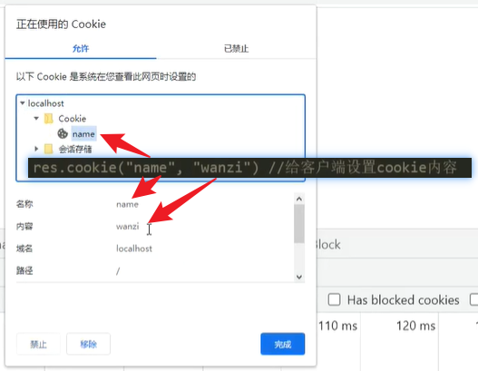
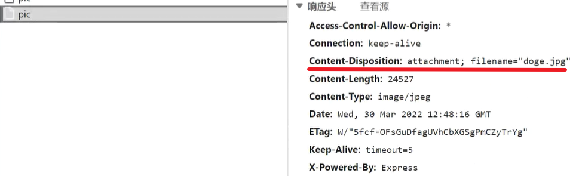

# `express`框架

### 携带参数

使用`get`和`post`发起请求，携带参数的方式：


##### `get`传参

少量参数：直接在路由后面通过问号拼接，参数以名值对的形式传递，`&`分割，`=`连接。如：`?name=wz&age = 18`

大量参数：`get`请求的第二个参数是一个配置对象，在里面配置`params`属性，值以对象形式传递。
- `axios.get(url, {params : {name : 'wanzi', age : 16}});`

- 而后端接收的参数对象，存在请求报文的`query`属性中。


```js
// 前端
let btn = document.querySelector(".button");

btn.onclick = function () {
    // 通过get请求携带参数
    axios.get("http://localhost:8080/api/v1", {params: {name: "丸子", age: 14}}).then(res => {
        console.log(res);
    })
}

// 后端
const express = require("express"),
      app = express();

app.get("/api/v1", (req, res) => {
    // 允许get请求跨域
    res.header("Access-Control-Allow-Origin", "*");
    // 获取get携带的参数对象
    console.log(req.query);
    res.send("已收到");
})

app.listen(8080);
```


##### `post`传参

- `get`请求报文没有主体，参数只能携带传递；`post`的参数则是存到报文主体`data`中传递。
- 后端接收到的参数对象，一般存在报文的`body`中。【不能明文显示，需使用以下中间件解析】
  - 解析`JSON`格式的数据：`app.use(express.json())`
  - 解析该请求所携带的文本数据：`app.use(express.urlencoded({extended : false}))`

注意：获取本次请求的完整路由，可以通过`req.path`来访问。

```js
// 前端
btn.onclick = function () {
    // 当只想传递数据时，可以直接将第二参数当作data使用
    axios.post("http://localhost:8080/api/v2", {name: "丸子", age: 16}).then(res => {
        console.log(res);
    })
}

// 后端
const express = require("express"),
      cors = require("cors"),
      app = express();

app.use(cors());

// 解析非get请求携带的文本数据
app.use(express.json());
app.use(express.urlencoded({extended: false}));

app.post("/api/v2", (req, res) => {
    // 获取post携带的参数
    console.log(req.body);
    res.send("收到post请求");
})

app.listen(8080);
```


##### 动态路由

在请求路径中的某一段上设置一个变量，来动态地设计出各种路由，常用在分页器中。

基本思路：将一段路径中需要动态设置的地方，以冒号分隔，紧跟上一个变量。然后，该分段中动态的路由字段将存在该变量中。

路由变量：请求路由中从`:`到结尾或下一个分隔符（`:`或`/`）之间的部分，都将作为动态的路由片段被该变量接收。

可以通过`req.params`属性，访问动态路由对象：它们以**“路由变量为名，动态字段为值”**的名值对形式，存于`params`对象中。

```js
const express = require("express"),
      cors = require("cors"),
      app = express();

app.use(cors());

// 动态路由：在被监听的路由中置入一个变量
app.get("/page:num", (req, res) => {
    // 访问动态的路由片段
    console.log(req.params.num);
    res.send("收到get请求");
})

app.listen(8080);
```

案例：根据动态字段返回对应页面数据

```js
const express = require("express"),
      cors = require("cors"),
      app = express();

app.use(cors());

app.get("/page:num", (req, res) => {
    res.send(`第${req.params.num}页的数据`);
    // 例如，当访问"/page2"时，返回：第2页的数据
})

app.listen(8080);
```

<hr>

### 请求与响应对象

为了更好地使用`express`框架，`express`对请求和响应对象做了适当的增改。


##### 请求对象

`req`上常见的属性：

- `body`：`post`提交的数据
- `query`：`get`携带的参数
- `path`：发起请求的路由（不含参数）
-  `params`：动态路由对象（保存着每一个动态的路由片段）
- `method`：发起请求的方法
- `hostname`：请求的主机名（不含端口）
- `cookie`：请求携带的`cookie`


##### 响应对象

`res`上常见的属性及方法：

- `headersSent`属性：检查是否已发送响应头。
- `set`方法：设置响应头，参数是一个配置对象。可以设置跨域等，也可以自定义字段。
- `sendFile`方法：读取文件并响应出去，请求路由不必带文件扩展名。参数：（要响应文件的地址）
  - `app.get("/pic", (req, res) => {res.sendFile(``${__dirname}/images/5.jpg``)})`
  - 局限：一次只能响应出去一个文件，不能批量发送。【批量一般配置静态资源】
- `status`方法：设置响应报文的状态码，但手动设置并不影响`send()`是否或如何响应数据。
  -  
  - 前端通过状态码判断响应状态时，数据不会进入到`then`里面，而是流到`catch`中。
- `send`方法：响应出数据。
- `cookie`方法：给客户端设置`cookie`内容。参数：（名，值）【`JSON`格式，名值对以逗号连接】
  - `cookie`是一种前端的本地缓存，数据主要由后端来写入。
  - 前端每一次发起请求，`cookie`都会被跟着带到后端。经过后端处理后，要返回给前端，并写入客户端本地。
  -  
- `redirect`方法：设置重定向地址，重新跳转到指定页面或路由。
  - 重定向：类似于转接，`A`本应去到`B`，但被`B`转向到了`C`，导致`A`跳转到了`C`。
  - 参数：`(可选的状态码, url)`
    - 状态码：可选，默认为`302 Found`
    - `url`：重定向地址。
  - 设置了重定向，就不必再调用`send()`响应。
  - 一般用于在不方便展示的时候跳转，购买前先登录等场景。
  - 跳至目标页面：参数为一个页面的完整`url`时，会跳转到该页面
  - 跳至目标路由：参数为一个路由时，会重新向该路由发起`get`请求
- `attachment`方法：给前端提供下载功能，并设置下载时文件的名称。
  - 前端下载功能：当前端不对响应数据作接收、渲染的处理时，默认以下载的方式处理，以路由为文件名且无扩展名。
  - `attachment`：附件，它会在响应报文中添加一个字段，来告诉前端这是一个需要被下载的附件并给出**建议保存名**。
  - 参数：（文件名），如：`res.attachment("doge.jpg");`
  -  
- `download`方法：告诉客户端这是一个需要被下载的文件。
  - 参数：
    - 第一个：文件路径
    - 第二个：下载时的文件名
    - 回调：`(err)`【处理错误】
  - `download`相当于`attachment`的升级，它在内部通过`res.sendFile()`读取文件并响应。

```js
// 发送attachment附件，原生的读取与发送
app.get("/pic", (req, res) => {
    fs.readFile(`${__dirname}/images/1.jpg`, (err, data) => {
        res.attachment("doge.jpg");
        res.send(data);
    })
})

// 使用download通知下载文件
app.get("/pic", (req, res) => {
    res.download(`${__dirname}/images/1.jpg`, "wanzi.jpg", (err) => {
        if (err) {
            // 响应可能已部分发送，因此，要检查res.headersSent。
        } else {
            console.log("文件传输完成");
        }
    })
})
```

<hr>

### 全局安装与局部安装

全局安装一般安装到电脑上，所有的项目文件都可以使用。局部安装一般只安装在指定的项目文件中，只能在该项目文件中使用。

安装在全局还是局部，取决于执行在发布（生产）环境还是在开发环境。


##### 开发环境（`development`）

开发环境是程序员们专门用于开发的服务器，配置可以比较随意， 为了开发调试方便，一般打开全部错误报告。

(程序员接到需求后，开始写代码，开发，运行程序，看看程序有没有达到预期的功能)

开发环境中使用的包，仅仅是开发者线下开发时为了方便开发或者调试的个人选择【丢失后，并不影响项目的运行】


##### 测试环境（`testing`）

一般是克隆一份生产环境的配置，一个程序在测试环境工作不正常，那么肯定不能把它发布到生产机上。

(程序员开发完成后，交给测试部门全面的测试，看看所实现的功能有没有`bug`，测试人员会模拟各种操作情况)


##### 生产环境（`production`）

生产环境是指正式提供对外服务的，一般会关掉错误报告，打开错误日志。

(就是线上环境，发布到对外环境上，正式提供给客户使用的环境)

生产环境中使用的包，是项目运行的基本依赖，缺失一个都无法运行项目。

注释：

- 三个环境也可以说是系统开发的三个阶段：开发 -> 测试 -> 上线，其中生产环境也就是通常说的真实环境。

- 一般地，一些自己用于调试开发的工具包安装在开发环境，只将项目中必须使用的包上传到生产环境。


##### 项目初始化

在开始一个项目、安装一个包之前，先初始化一下。生成记录文件，方便项目管理。

```json
{
    "dependencies": { // 发布（生产）环境所依赖的包
    	"express": "^4.17.3",
        "cors": "^2.8.5"
    },
    "name": "13",
    "version": "1.0.0",
    "main": "app.js",
    "devDependencies": {}, // 开发环境所依赖的包
}
```

安装到开发环境：`-D`；		安装到发布环境：`-S`【默认】

删包：从`node_modules`中删除包，从`package.json`中删除记录。【删包指令：`uninstall`】

