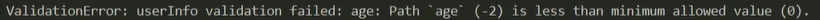

# 联表查询

将两张表通过一个唯一性的字段关联起来，以便查询时精准高效。

<hr>

### 创建关联表

在关联表的表规则中，自定义一个标识性的字段，用来与其他表进行关联。【关联字段】


##### 设置标识字段

设置表规则：在表规则中，将自定义字段的`type`值设为`ObjectID`类型：`Schema.Types.ObjectId`；再通过`ref`与指定表关联。

```js
// 定义成绩表的表规则
const scoreSchema = new Schema({
    name: String, // 姓名
    subject: String, // 学科
    score: Number, // 成绩
    num: { // 关联字段
        type: Schema.Types.ObjectId, // 规定字段的值为ObjectId类型
        ref: "userInfo" // 通过该表的num字段关联到userInfo表
    }
})

// 创建成绩表对象
const scoreTable = mongoose.model("scoreInfo", scoreSchema);
```

关联数据：可以在增加基础表数据时，在它的`then`回调中，增加关联表数据。并且将关联字段的值设为`res._id`值，使数据关联起来。

```js
// 增加一条数据
userTable.create({ // 增加基础表（被关联表）数据
    name: "丸子",
    age: 12,
    sex: "女",
}).then(res => {
    scoreTable.create({ // 增加成绩表（关联表）数据
        name: "丸子",
        subject: "物理",
        score: 95,
        num: res._id // 将关联表中的关联字段值同步为被关联表的_id字段值【数据同步关联】
    }).then(res => console.log("数据写入成功"));
})

// 增加多条数据
userTable.create({ // 增加基础表（被关联表）数据
    name: "丸子",
    age: 12,
    sex: "女",
},
{
    name: "樱桃",
    age: 14,
    sex: "女",
}).then(res => {
    scoreTable.create({ // 增加成绩表（关联表）数据
        name: "丸子",
        subject: "物理",
        score: 95,
        num: res[0]._id // 【数据同步关联】
    },
    {
        name: "樱桃",
        subject: "数学",
        score: 99,
        num: res[1]._id // 【数据同步关联】
    }).then(res => console.log("数据写入成功"));
})
```

 

<hr>

### 联表查询【`populate`】

使用`populate`可以关联到目标表，进行联合 / 跨表查询。

配置属性：`path，model`

- `path`：与目标表关联的字段。【标识字段】
- `model`：目标表的操作对象。

```js
// 联表查询
scoreTable.find({
    name: "丸子"
}).populate({
    path: "num", // 关联字段
    model: userTable // 目标表操作对象
}).exec((err, res) => {
    if(err) throw err;
    console.log(res);
})
```


##### 监听结果

使用`exec`监听联表查询的结果，参数：回调`（err，result）`，查询结果存在`result`中，联表数据在关联字段中。

 

原生的数据库操作语句是，`SQL`语法的语句。

<hr>

### 表规则配置

配置属性：

- `type`：设置字段及值的数据类型，值：`String，Number，Array，Schema.Types.ObjectId`等
- `required`：设置为必填字段，值：`true，false。`
- `min`：设置该字段允许的最小值，值：`数字 / 数组`
- `max`：设置该字段允许的最大值，值：`数字 / 数组`
  - 越界报错： 
  - 可以将`min`或`max`的值设置为一个数组：`[数字，越界后的提示信息]`【`validation`：校验】
  -  
- `enum`：预设字段值（限定该字段的值只能是所列出的值之一），值：数组
  -  
- `maxlength`：设置字段的最大字符长度。
- `minlength`：设置字段的最小字符长度。
- `validate`：自定义校验规则【对象】
  - 属性：`validator()，message`
    - `validator()`：设置校验方法
      - 参数：该字段的值
      - 通过`return true or false`，来决定是否通过校验。
    - `message`：校验提示信息
  -  
  - 更多参考：https://mongoosejs.com/docs/4.x/docs/validation.html

