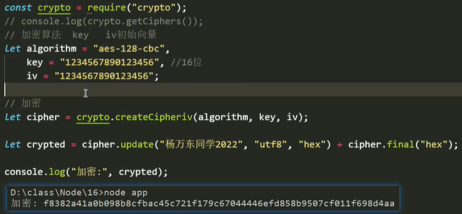

# 补充模块

### `pm2`【进程管理器】

服务器可以开启多进程同时运行多个项目程序，当想要查看或管理各项目运行的进程时，可使用`pm2`插件。【建议全局安装】

概念：`PM2`（`Process Manager 2` ）是具有内置[负载均衡](https://so.csdn.net/so/search?q=负载均衡&spm=1001.2101.3001.7020)器的`Node.js`应用程序的生产运行时和进程管理器。 它允许您永久保持应用程序活跃，无需停机即可重新加载它们，并促进常见的`Devops`任务。


#### 常用指令：

##### 启动服务【`start`】

```
pm2 start app.js                // 启动app.js应用
pm2 start app.js --name demo    // 启动应用并设置name
pm2 start app.sh                // 脚本启动
pm2 start [ID]					// 通过id来启动
```


##### 停止服务【`stop`】

```
pm2 stop all              // 停止所有应用
pm2 stop [AppName]        // 根据应用名停止指定应用
pm2 stop [ID]             // 根据应用id停止指定应用
```


##### 多个进程

可以使用`cd`命令切换工作目录，去`start`开启其他目录下的程序。

 

`id`：第一个开启的服务`id`为`0`，第二个为`1`，依次排序。

`status`：反映每一个程序的当前状态（在线`online`，停机`stopped`，错误`errord`）

**注意**：指令可以结合`id`值来精准地控制各个进程的状态。


##### 查看启动列表【`list`】

```
pm2 list 	// 查看当前通过pm2开启了多少个程序及其状态
```

通过`pm2`打开并管理多个进程，不需要来回切换启动 / 终止程序，而可以通过`list`表中的`id`来控制程序。


##### 删除应用【`delete`】

```
pm2 delete all               // 关闭并删除应用
pm2 delete [AppName]         // 根据应用名关闭并删除应用
pm2 delete [ID]              // 根据应用ID关闭并删除应用
```


##### 创建开机自启动【`startup`】

```
pm2 startup
```


##### 更新`PM2`【`update`】

```
pm2 updatePM2
pm2 update
```


##### 监听模式【`--watch`】

```
pm2 start app.js --watch    // 当文件发生变化，自动重启
```


##### 静态服务器【`serve`】

```
pm2 serve ./dist 9090        // 将目录dist作为静态服务器根目录，端口为9090
```


##### 启用群集模式（自动负载均衡）

```
// max表示PM2将自动检测可用CPU的数量并运行尽可能多的进程
// max可以自定义，如果是4核CPU，设置为2者占用2个
pm2 start app.js -i max
```


##### 重新启动【`restart`】

```
pm2 restart app.js        // 同时杀死并重启所有进程。短时间内服务不可用。生成环境推荐使用reload
```


##### 0秒停机重新加载

```
pm2 reload app.js        // 重新启动所有进程，始终保持至少一个进程在运行
pm2 gracefulReload all   // 优雅地以群集模式重新加载所有应用程序
```


##### 查看每个应用程序占用情况【`monit`】

```
pm2 monit
```


##### 显示应用程序所有信息【`show`】 

```
pm2 show [Name]      // 根据name查看
pm2 show [ID]        // 根据id查看
```


##### 日志查看【`logs`】

```
pm2 logs            // 查看所有应用日志
pm2 logs [Name]     // 根据指定应用名查看应用日志
pm2 logs [ID]       // 根据指定应用ID查看应用日志
```


##### 保存当前应用列表【`save`】

```
pm2 save
```


##### 重启保存的应用列表【`resurrect`】

```
pm2 resurrect
```


##### 清除保存的应用列表【`cleardump`】

```
pm2 cleardump
```


##### 保存并恢复`PM2`进程【`update`】

```
pm2 update
```

<hr>

### 压缩模块【`zlib`】

压缩模块提供了多种算法，可以压缩较大的文件为小文件，以方便传输。【`rar`，`zip`有自己的专利算法】

开发人员可以使用`node`内置支持的算法，避免侵权问题。

作用：后端将较大文件压缩处理后，传输给前端，由客户端解析后渲染。【浏览器没有解析`rar`，`zip`等的版权】


##### 压缩对象

```js
const zlib = require("zlib");
console.log(zlib);
```

 

压缩算法与解压算法成对出现，配套使用。

一般使用浏览器支持的算法，浏览器可以根据响应说明解压支持的格式，常用`Gzip`和`Deflate`。


##### 压缩过程

压缩文件的一般过程：读取文件流 ==> 压缩算法转换流 ==> 写入文件流【解压过程基本一致】


##### 创建`Gzip`转换流

- 压缩算法：`Zlib.createGzip() // 压缩文件后缀：.gz`
- 解压算法：`Zlib.createGunzip()`

解压缩：`读取流.pipe(转换流).pipe(写入流) // 像自来水经过过滤器被转换为饮用水一样，流对象都可以使用pipe接通`

```js
const zlib = require("zlib"),
      fs = require("fs"),
      gzipTransformStream = zlib.createGzip(), // 创建一个Gzip的压缩转换流
      gunzipTransformStream = zlib.createGunzip(); // 创建一个Gunzip的解压转换流
      
// 压缩文件
const readStream = fs.createReadStream("./t.txt"),
      writeStream = fs.createWriteStream("./r.gz"); // 使用Gzip算法压缩后，文件后缀为.gz

readStream.pipe(gzipTransformStream).pipe(writeStream); // 压缩流

// 解压文件
const readStream = fs.createReadStream("./r.gz"), // 读取.gz的压缩文件
      writeStream = fs.createWriteStream("./wanzi.txt");

readStream.pipe(gunzipTransformStream).pipe(writeStream); // 解压流
```


##### 监听错误

在数据的每段流动过程中，都可添加`error`监听事件，来检测哪段流通过程出现了错误，错误信息存在回调参数`err`中。

```js
// 监听读取流到转换流的过程
readStream.pipe(gzipTransformStream).on("error", (err) => {
    console.log("数据传向转换流的过程中", err);
})
```

若压缩后的文件为空`(0kb)`，可能是多次存写导致的，删除文件重新压缩即可。


##### 标记说明

在请求和响应的报文中，应按优先使用顺序标明可解析格式和压缩格式。

请求头：`Accept-Encoding : gzip, deflate // 标明客户端可 接受/解析 的压缩编码格式`

响应头：`Content-Encoding : gzip // 标明服务端响应文件的压缩编码格式`


##### 流响应

将数据以流的方式读取，直接以流的形式响应出去，前端也以流的方式接收存储响应流。

```js
app.get("/", (req, res) => {
    res.pipe(任何形式的数据流，通常是读取流); // 将数据流直接相应出去
})
```

<hr>

### 加密模块【`crypto`】

`node`内置的`crypto`加密模块只能做文本数据上的加密，不能用于加密文件。

例如：

- 在注册登录中，为提高安全性，密码不会明文存储，而是加密后将密文发送给服务端。

- 服务端可选择解密后存储或不解密存储，但传输时以一段密文来进行传递。


常用算法：`hash`（哈希算法）


##### 查看`hash`算法【`getHashes()`】

通过`getHashes()`方法，可以查看`crypto`模块支持的所有哈希算法，如：`md5, sha1`。

使用时只需要输入指定的算法名称，就可以使用该算法来进行处理。

```js
const crypto = require("crypto");
crypto.getHashes();
```


##### 创建哈希算法【`createHash()`】

通过`createHash()`可以创建一个哈希加密算法，通过参数来获取其支持的指定算法工具。

参数：`(算法工具名)`

返回值：返回获取到的指定算法工具【该工具被创建后只能使用一次】

```js
// 获取MD5的加密算法工具
const md5 = crypto.createHash("md5");
```


##### 上传加密内容【`update()`】

通过加密工具的`update()`方法，上传要加密的内容。

参数：`(加密内容)`

返回值：返回一个`hash`对象，密文存储在该对象中。【不明文展示】

```js
const md5Result = md5.update("hello world");
console.log(md5Result);
```

 


##### 获取密文【`digest()`】

通过密文对象上的`digest`方法，可以获取加密后的密文。【`Buffer`型的二进制数据】

参数：

- 指定以什么编码格式展示，一般设置为`'hex'`以十六进制形式展示。【常用的还有`"Base64"`，以双等号结尾】
-   

```js
// 以十六进制形式的数据输出【cryptograph：密文】
const cryptograph = md5Result.digest("hex");
```

案例：

```js
const crypto = require("crypto"); // 导入加密模块

// 加密："hello world"
const md5 = crypto.createHash("md5"), // 获取MD5算法工具
	  md5Result = md5.update("hello world"), // 上传明文
	  cryptograph = md5Result.digest("hex"); // 获取密文

// createHash创建出来的算法工具只能被使用一次，要再次使用可重新创建。
const cryptograph1 = crypto.createHash("md5").update("yunzhu-admin").digest("hex");
```


#### 提高安全性

##### 重复加密

对于加密难度不高的算法，可以将密文多次加密，通过增加解码难度，而提高密码安全性。常用的还有加盐处理等方式。

例如：`md5.update(md5Result.digest("hex")) // 将密文再次加密`

```js
const crypto = require("crypto"); // 导入加密模块

let cryptograph = crypto.createHash("md5").update("wanzi 16").digest("hex"); // 首次加密
cryptograph = crypto.createHash("md5").update(cryptograph).digest("hex"); // 二次加密
```


##### 加盐处理

通过使用一个密钥，通常将密码与密钥混合后加密或加密后混合再加密，来提高安全性。

这个密钥由客户端和服务端共同保管，可以是随机动态的，让前后端始终保持匹配即可。


##### 混合加密工具【`createHmac`】

通过`crypto`的`createHmac`方法，创建并配置好一个可使用密钥的混合加密工具。

参数：`(加密工具名，密钥)`

- 第一个：指定加密的工具名，获取该工具来处理加密。常用的有：`sha1，sha256，md5`。
- 第二个：指定要使用的密钥。

返回值：返回一个配置好的加密算法工具。

案例：加盐处理

```js
const crypto = require("crypto");

const cryptograph = crypto.createHmac("sha1", "wzKey").update("wanzi").digest("hex");
```


#### 解密

解密过程往往复杂于加密过程，“系绳子容易解绳子难”。

加密算法加密内容的过程可分为：对称加密，不对称加密。

对称加密：加密时借助了辅助内容(如：密钥)，解密时可使用相同的算法和辅助内容来解码的加密方式【可反向解码】

不对称加密：与对称加密类似，但密钥分为私钥和公钥，两者一锁一匙。私钥用于加密，公钥用于解密【高级算法】


#### 对称加密

##### 查看对称加密算法【`getCiphers()`】

查看`crypto`支持的对称加密算法，可使用`getCiphers()`来查看工具数组。

```js
const crypto = require("crypto");
crypto.getCiphers();
```

 

部分展示如上图，常用的对称加密算法是：`aes`开头的算法，如：`"aes-128-cbc"`。


##### 三个重要参数

对称加密算法有三个重要的固定参数：加密算法工具名，`key`密钥，`iv`初始向量。

注释：

- 密钥必须是16位二进制字符串或者是`buffer`类型的数据字段。
- 初始向量是与密钥类似功能的提升加密内容安全性的辅助字段。

```js
let algorithm = "aes-128-cbc", // 加密算法
    key = "0123456789012345", // 密钥
    iv = "0123456789012345"; // 初始向量
```


##### 配置对称加密工具【`createCipheriv`】

通过`crypto`的`createCipheriv`方法，填入上述的三个重要参数，可以配置一个对称加密工具。

参数：`(加密算法，key，iv)`

```js
const crypto = require("crypto");

let algorithm = "aes-128-cbc", // 加密算法
    key = "0123456789012345", // 密钥
    iv = "0123456789012345"; // 初始向量

const cipher = crypto.createCipheriv(algorithm, key, iv); // 配置并获取加密工具
```


##### 上传加密内容【`update`】

配置好加密工具后，类似地，使用`update`来上传要加密的内容，并指定字符编码和转码格式。

参数：`(加密内容，字符编码，转码格式)`

- 第一个：填入要加密的内容
- 第二个：指定加密内容的字符编码，保证内容被正确地识别 / 转换。一般为：`"utf8"`
- 第三个：将内容按照指定的编码格式加密。一般为：`"hex" // 加密为16进制的字符串`

```js
const cipher = crypto.createCipheriv(algorithm, key, iv); // 配置并获取加密工具

cipher.update("丸子2022", "utf8", "hex");
```


##### 添加加密填充【`final`】

在`update`上传完加密内容后，需要继续拼接上一个填充，一个同样基于加密工具的`final`方法。

参数：`(与update一致的编码格式)`

在上传和填充拼接执行后，返回根据指定编码格式，转换加密之后的密文。

```js
let ciphertext = cipher.update("丸子2022", "uft8", "hex") + cipher.final("hex"); // 获取密文
```

案例：

 


##### 配置对称解密工具【`createDecipheriv`】

使用`crypto`的`createDecipheriv`方法，可以将对称加密的密文，解密显示出明文。

参数：`（加密算法，密钥，初始向量）`

返回值：解密工具。

```js
let algorithm = "aes-128-cbc", // 加密算法
    key = "0123456789012345", // 密钥
    iv = "0123456789012345"; // 初始向量

const decipher = crypto.createDecipheriv(algorithm, key, iv); // 配置并获取解密工具
```


##### 上传解码密文【`update`】

在解密工具上使用`update`上传要解码的密文，同时指定密文的编码格式以及要解析的字符编码。

参数：`(要解码的密文，密文编码格式，明文字符编码)`

- 第一个：指定要解码的密文。
- 第二个：密文加密时的编码格式。
- 第三个：将密文解码后按照指定字符编码解析显出明文。

```js
const decipher = crypto.createDecipheriv(algorithm, key, iv);

let plaintext = decipher.update(ciphertext, "hex", "utf8");
```


##### 添加解密填充【`final`】

与加密时类似，在`update`后拼接上一个解密工具上的`final`填充方法。

参数：`(与update一致的字符编码)`

类似地，在上传和填充拼接执行后，返回根据指定字符编码，转换解码之后的明文。

```js
let plaintext = decipher.update(ciphertext, "hex", "utf8") + decipher.final("utf8"); // 获取明文
```

案例：

 

注意：

- 在日常使用中，一般通过密文比对来进行验证，很少直接使用明文来比对，不安全。
- 因此，一般也很少用到解密算法，了解即可，无需掌握。
- 一般加密的数据不是文件数据，而是一些纯文本的数据。
