# 操作表数据

使用`model`方法获得了一个可操作该表的对象，然后通过该对象来操作表中数据。

每次操作后，返回一个`promise`对象。成功执行`then`回调，失败执行`catch`回调。

<hr>

### 增【`create`】

每条数据都是以单个对象的形式被存储于数据库中的，对象中的属性是表头字段，值各不同。

增加数据时，若有一个字段没填，`compass`会将其值显示为：`No field`。【`field`：字段】

```js
// 添加多条数据
userTable.create(
    {
        name: "cherry",
        age: 16,
        sex: "女"
    },
    {
        name: "朱雀",
        // age: 14, age字段未添加值，compass将其值显示为：No field
        sex: "女"
    },
    {
        name: "丸子",
        age: 16,
        sex: "女",
        tag: "御姐" // tag字段未在表规则中，无法被添加进该表格，但不影响该条数据的添加。
    }
).then(() => {
    console.log("新增数据成功");
}).catch(() => {
    console.log("新增数据失败");
})
```

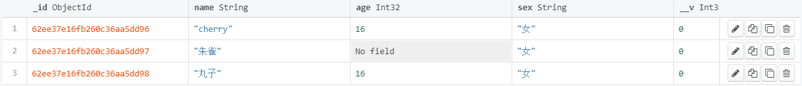 


##### 设置必填字段【`required`】

在表规则`Schema`的配置对象中，为某一字段的配置对象添加`required`属性，设置值为`true`即可。

```js
const userSchema = new Schema({
    name: String,
    age: {
        type: Number,
        required: true // 该字段是必填项，没填写的整条数据都不会被添加到表中
    },
    sex: String
})
```

添加数据时，系统会根据表规则对数据进行校验，不合格的数据，不会被添加进数据库。

<hr>

### 查【`find`】

通过表对象查询数据的方法有：`find、findOne、findById`。

通过条件来筛选数据，并将整条数据以对象的形式作为结果返回。


##### `findOne`【第一条符合的】

`findOne`可以根据设置的多个条件，查询出第一条符合条件的数据。没查到返回：`null`。

```js
userTable.findOne({
    // 筛选条件：一个或多个
    age: 16
}).then(res => {
    console.log("查询的结果： ", res);
})
```

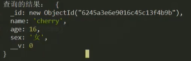 


##### `find`【所有符合的】

`find`根据条件，查询出所有符合条件的数据。查询数据对象被放置在一个数组中，没查到返回：`[]`。

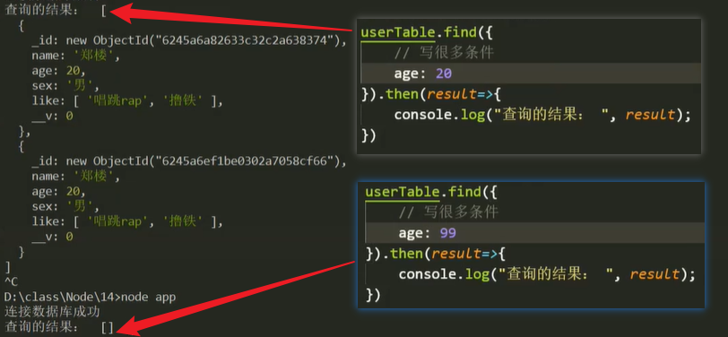 


##### `findById`【`id`查询】

`findById`通过指定的 `id` ，查询出唯一性的数据。

参数：`id`值【使用数据库中的`id`值】

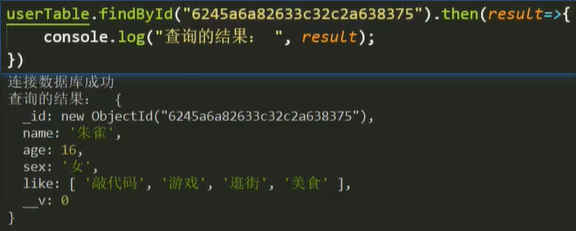 

生成一个`id`：`mongoose.Types.ObjectId()` 【`MongDB`中的 `id` 是特有的`ObjectId`类型的数据，并非字符串】

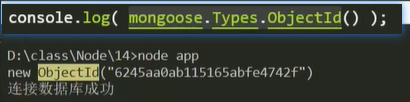 


#### 查询操作符

通过查询操作符，可以编写查询条件，查找复杂多样的数据。

通过某一字段查询数据时，可以设置配置对象限定查询范围。


##### 限定数字范围

- 大于：`$gt` 		大于等于：`$gte`
- 小于：`$lt`         小于等于：`$lte`
- 等于：`$eq`         不等于：`$ne`

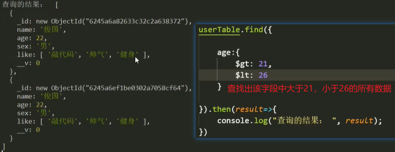 

```js
// 查询age=22的所有数据
userTable.find({
    age: {
        $eq: 22
    }
}).then(res => {
    console.log("查询的结果： ", res);
})

// 与$eq等效的写法
userTable.find({
    age: 22
}).then(res => {
    console.log("查询的结果： ", res);
})
```


##### 逻辑查询

- 与：`$and`【同时满足】
  - 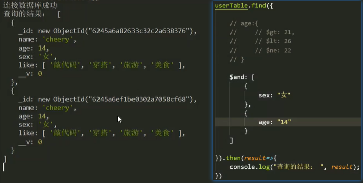 
- 或：`$or`【任一满足】
  - 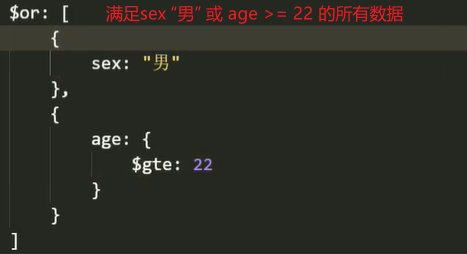 
- 非：`$nor`  查询不符合所列条件的所有数据【都不满足】
  - 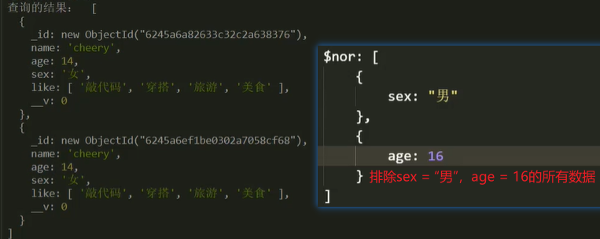 

```js
// 查询sex="女"且age=14的所有数据
userTable.find({
    $and: [
        {sex: "女"},
        {age: 14}
    ]
}).then(res => {
    console.log("查询的结果： ", res);
})

// 与$and等效的写法
userTable.find({
    sex: "女",
    age: 14
}).then(res => {
    console.log("查询的结果： ", res);
})
```


#### 判断指定数组

##### 存在该值【`$in`】

主要用于判断指定数组中是否存在指定的值，将存在该值的数据对象返回。

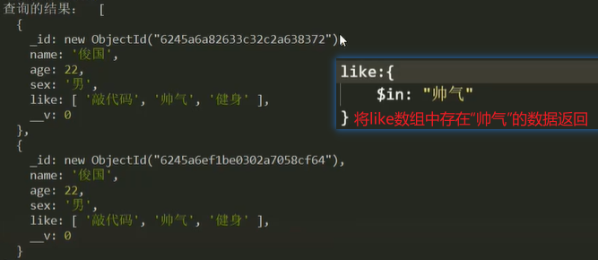 


##### 不存在该值【`$nin`】

判断指定数组中是否不存在指定的值，将不存在该值的数据对象返回【排除该值】

可以将多个值放入一个数组中，来实现更精准的查询。

```js
userTable.find({
    like: {
        $nin: ["敲代码", "女"]
    }
})
```


##### 数组长度【`$size`】

判断数组的长度是否为指定长度，将满足指定数组长度的数据对象返回。

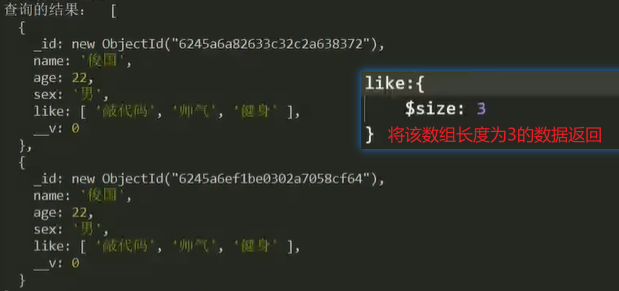 


##### 存在该值【`$all`】

与 `$in`相似，将存在该值的数据返回，但不限于判断数组类型，可用于其他类型字段的判断。

```js
// $in只能用于数组类型
like: {
    $in: "帅气"
}

// $all可用于任意类型
like: {
    $all: "帅气"
}

sex: {
    $all: "女"
}
```


##### 复杂条件查询【`$where`】

当使用查询操作符无法构造出想要的条件时，可以使用`$where`方法的返回值来设计筛选条件，进行复杂的条件查询。

属性`$where`的值是一个函数，通过该函数的返回值，可以进行复杂的查询。【函数内部`this`指向当前的数据对象】

注意：该方法会遍历当前的数据表，将每一条数据都拿出来进行判断，符合条件的被返回。因此，会消耗一些性能。

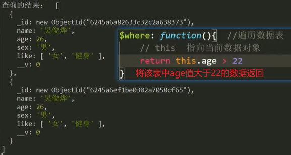 


#### 重识`find`

参数：`(查询条件, 过滤字段, 筛选处理)`

- 第一个：查询条件 --- 通过条件查询出所有满足条件的数据
- 第二个：过滤字段 --- 通过设置字段值的`true / false`，决定保留哪些字段。
  - 保留该字段：`true`；舍弃该字段：`false` 【`_id`属性会自动保留，舍弃可手动设值为`false`】
  - 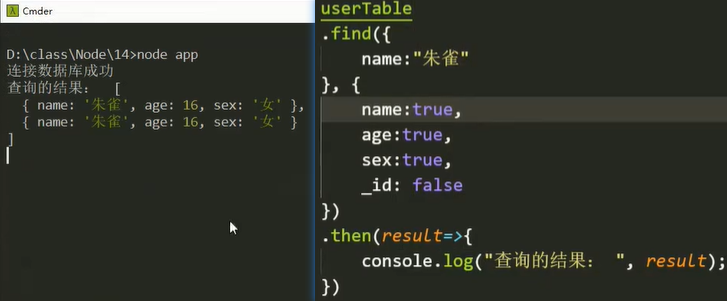 
  - 只有`true`值：表示仅保留这些字段以及`_id`字段。【仅保留】
  - 只有`false`值：表示舍弃这些字段后，其余未提及的都保留。【仅舍弃】
  - 两个都有：表示仅保留为`true`的字段，仅舍弃为`false`的字段。【`_id`自动保留】
- 第三个：对筛选后的结果进行进一步的处理，如：排序等
  - 排序【`sort`】：仅用于数字型字段，将指定字段的值按值规则进行排序。【正升序，负降序】
    - 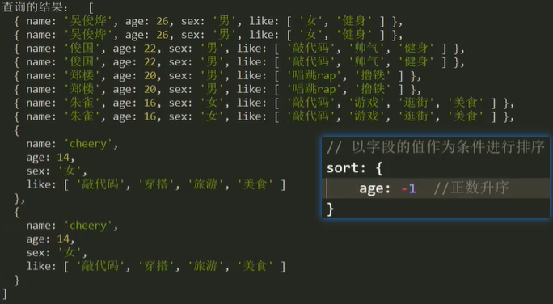 
  - 跳至【`skip`】：跳至指定位置，保留指定位置及其后的数据。
    - 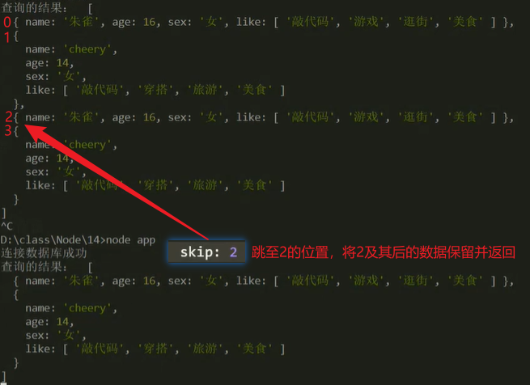 
  - 限制【`limit`】：限制范围，从前往后保留指定数量的数据。
    - 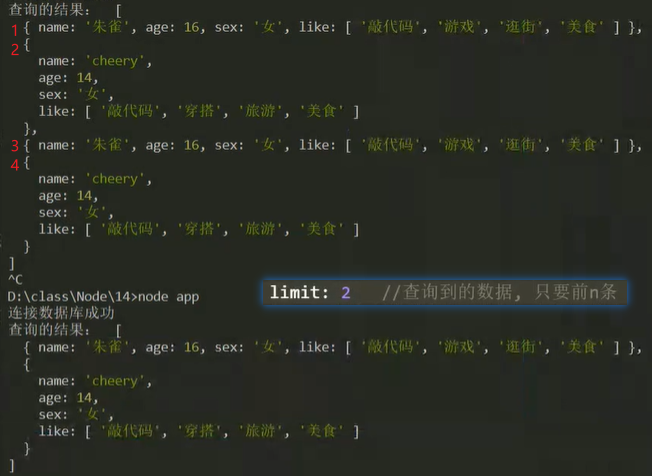  
  - 案例：分页器`[1：1-10，2：11-20，……]`
    - 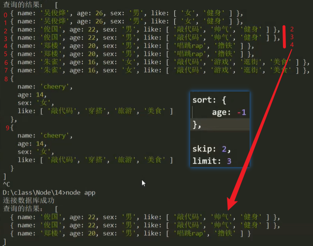 

```js
userTable.find(
{ // 查询条件
    name: "丸子"
},
{ // 过滤字段
    _id: false
    __v: false
},
{ // 结果处理
    sort: {age: 1}, // 将数据按照age的值升序排列
    skip: 2, // 跳至索引为2的数据，默认0
    limit: 3 // 从skip处往后截取3条数据
})
```

<hr>

### 删【`delete`】

删除数据库中的数据时，首先应确保查询到的是该删除的数据，防止误删。

删除数据的方式有两种：`deleteOne，deleteMany`。

##### `deleteOne`【删除第一条符合的】

参数：查询条件的配置对象

删除的结果存在`then`的回调参数中。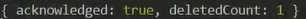 【告知，数量】

```js
userTable.deleteOne({
    age: 14
}).then(res => {
    console.log(res);
})
```

##### `deleteMany`【删除所有符合的】

参数、结果，同上。

<hr>

### 改【`update`】

`updateOne`：修改一条（第一条符合的）；	`updateMany`：修改多条。

参数：

- 第一个：查询条件的配置对象
- 第二个：修改内容的配置对象

案例：

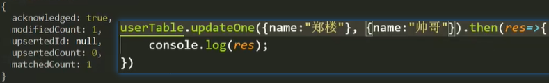 


#### 修改操作符

数据表中的字段值尽量不要填空。可以设置一些默认值填入，便于后期修改。


##### 设置修改内容【`$set`】

使用`$set`可以设置修改多条字段的值。【直接在配置对象中写多条字段修改也是一样的】

```js
// 修改多个字段的值
userTable.updateMany(
{
    age: 14
},
{
    $set: {
        sex: "帅哥",
        age: 10
    }
}).then(res => {
    console.log(res);
})

// 等效写法
userTable.updateMany(
{
    age: 14
},
{
    sex: "帅哥",
    age: 10
}).then(res => {
    console.log(res);
})
```


##### 修改数组内容【`$set`】

一般只是往数组中添加或修改指定位置的内容，而不是完全修改 / 覆盖整个数组。

- 通过下标修改指定位置上的值
  - 以 `"数组.索引"` 的字符串形式作属性，修改内容为值。【先查找，再修改】
    - 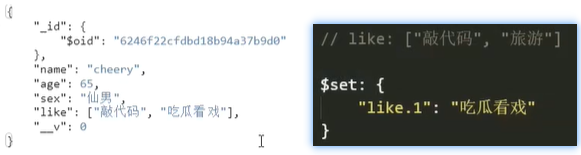 
  - 而这种以手动指定下标来修改值的方式，下标必须正确，否则容易误改或越界（中间值为`null`）。
    - 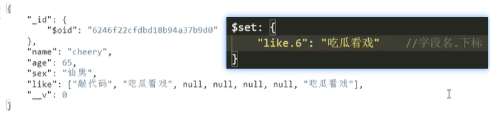 
- 通过指定值修改【`$elemMatch…$in……$set`】
  - 先在查询配置对象中，使用数组的元素匹配操作符，通过匹配指定值来获取其下标，并存在联动的`$`符中。
    - 元素匹配操作符【`$elemMatch`】：在数组中使用该操作符，来匹配存在的项。
    - 在`$elemMatch`的配置对象中，使用`$in`判断指定值是否存在。【存在则匹配其下标到联动的`$`符中】 
  - 在修改配置对象中，使用`$set`通过下标的方式修改，此时下标存在`$`符中。
    - 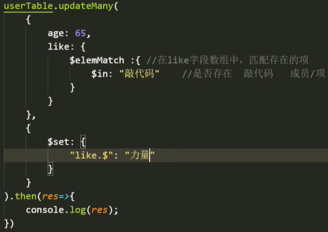 
    - 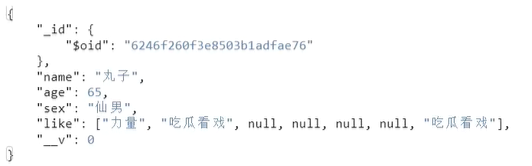 

注意：以上两种方法，只匹配到第一个存在的值，并修改第一个匹配到的值。


##### 追加数组内容【`$addToSet/$push`】

- 不重复追加【`$addToSet`】
  - 先判断该值在数组中是否已存在，不存在则添加，存在则忽略。
  - 追加一条：像这样赋值的形式，将该值直接追加到数组中。
    - 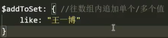 
  - 追加多条【`$each`】：多条数据一般存放在数组中，通过遍历的方式逐个追加。
    - 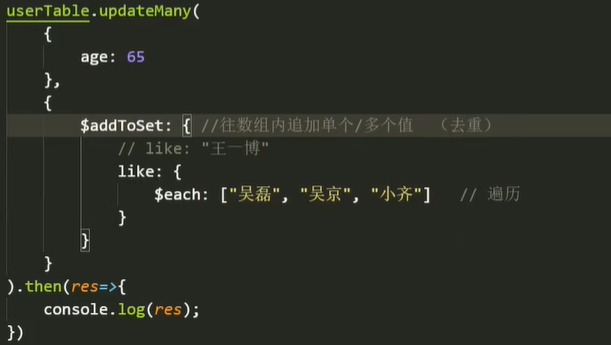 
- 重复追加【`$push`】：使用方法同上。


##### 删除数组内容【$pop / $pull】

- 按序删除【`$pop`】

  - 在配置对象中，以对象为属性，通过设置数值来决定如何删除。【正：从后往前删；负：从前往后删】

  - 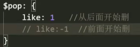 
  - 注意：`$pop`一次只能删除一项。

- 删除指定项【`$pull`】
  - 判断该值是否存在，存在则删除所有的指定值。
  - 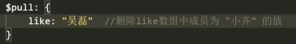 
- 删除多个项【`$pull…$in`】
  - 使用`$in`操作符，可以将多个值放在一个数组中，进行逐个 / 遍历判断。【存在则删除】
  - 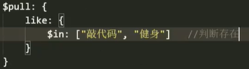 

<hr>

### 字段值自增【`$inc`】

使用`$inc`可以将指定字段的值，按规定值自增。常用于版本号`__v`属性的自增。

```js
// 字段值自增1
$inc: {
    __v: 1 // 指定该字段每次自增的值
}
```

<hr>

### 删除字段【`$unset`】

使用`$unset`可以将该条数据中的指定字段删除，值设置为`true`。【`compass`显示为：`No field`】

```js
// 删除该数据的指定字段（很少用）
$unset: {
    like: true // 当字段被删除后，其值显示为：No field（没有该字段）
}
```

