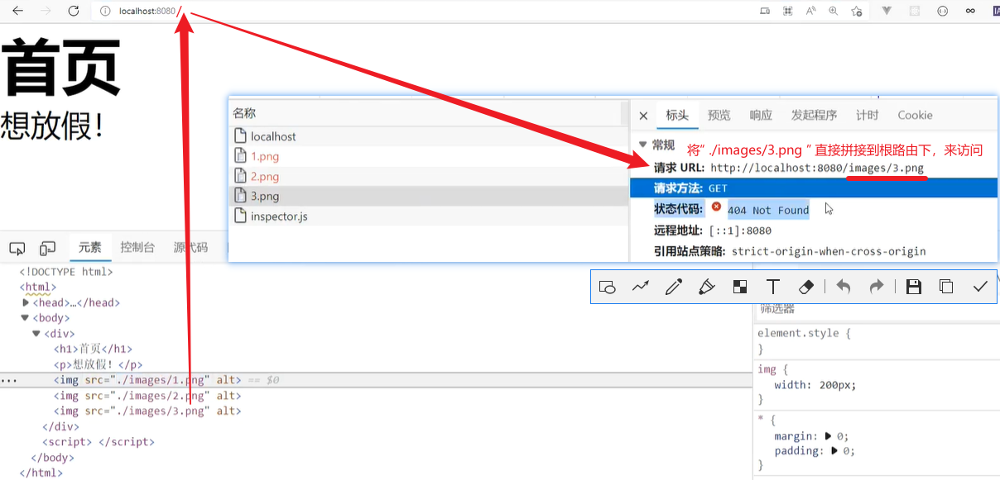

# express框架

`node`主流的监听请求的两大模块：`express`，`koa`【两者用法相似】

`express`属于较轻量级的框架

- 简化了：分析客户端的请求以及后端响应的操作。
- 开放了部分`API`接口，方便使用第三方的插件。
- 框架：提供框架的基础功能，最重要的是，允许往里面拓展功能、嵌入插件使用。
- 插件（库/工具/包）：是单一的功能，或者提供某一类的功能。如：原生的`URL、path、fs`等模块。
-  


##### 创建`express`应用 / 实例

```js
const express = require("express"),
      app = express(); // 创建一个express的应用（实例）
```

`app`拥有`express`所提供的基本`API`，相当于继承了`express`上的属性和方法。


##### 启动监听服务【`listen`】

使用`app.listen`启动监听，监听语句一般放在最后。

参数：

- 第一个：端口【数字型】
- 第二个：地址（可省略，默认打开本地服务器）

```js
const express = require("expess"),
      app = express();


// 启动服务，监听指定的服务器及其端口。
app.listen(8080, "127.0.0.1");
```


##### 监听`get`请求【`get`】

使用`app.get`来监听使用`get`方式向指定路由（不包括参数）发起的请求。

参数：`（监听的路由，回调）`

- 回调：`（request，response）`对原生的`request`和`response`增加了少量的功能。
- 路由：可以是一段路径字符串、一个路由正则、一个正则表达式以及一个任意混合以上三者的数组。

更多参见：https://www.expressjs.com.cn/4x/api.html#path-examples

```js
const express = require("expess"),
      app = express();

// 监听get方式的请求
app.get("/", (req, res) => {
    console.log("监听到使用get方式，向根路由发起的请求");
})

app.listen(8080, "127.0.0.1");
```

扩展：`get`方法还可以用来获取应用程序设置表中某一字段的值（使用`set`设置的字段及值）。

```js
// 设置字段名及其值
app.set("title", "my title");
// 获取指定字段的值
app.get("title"); // "my title"
```


##### 发送数据【`send`】

使用`res.send`发送要响应的数据。

参数：（响应数据），可以是文件，二进制数据，数据流等。

```js
const express = require("express"),
      fs = require("fs"),
      app = express();
      
app.get("/", (req, res) => {
    // 发送文件，最好规定一下编码格式。
    fs.readFile(`${__dirname}/public/index.html`, "utf8", (err, data) => {
        if(err) throw err;
        res.send(data);
    })
})

app.listen(8080);
```


##### 配置静态资源文件【`express.static`】

当响应文件是`html`文件时，文档中与`url`相关的属性会自动发起可跨域的`get`请求，将相对地址直接拼接到根路由下。

此时应统一资源配置，指定一个静态文件夹的地址为根路由，让所有的资源请求都到该文件夹中来获取文件。

 

```js
// 配置public文件夹为静态资源文件夹，所有的请求路由都会以此目录为根目录。
app.use(express.static("./public"));

// 例如： 的请求会到public下寻找images目录，然后搜索1.jpg文件。
```

注意：

- 当配置了静态资源服务后，访问根路由时，程序会在静态资源目录中自动寻找`index.html`文件并将其响应给前端渲染。
- 当找不到文件时，它不会发送`404`响应，而是调用`next()`转移到下一个中间件，从而允许堆叠和回退。

```js
app.use(express.static("./public"));

// 相当于执行了如下操作：
app.get("/", (req, res) => {
    fs.readFile(`${__dirname}/public/.../index.html`, "utf8", (err, data) => {
        if(err) throw err;
        res.send(data);
    })
})

// 多个静态资源的服务，优先级从上到下依次降低。【某个响应后，其余的失效】
app.use(express.static(path.join(__dirname, 'public')));
app.use(express.static(path.join(__dirname, 'files')));
app.use(express.static(path.join(__dirname, 'uploads')));
```


##### 使用中间件【`use`】

使用`app.use`方法，可以将第三方的功能嵌入到框架中使用。

参数：`(可选的路由, 回调)`

- 路由：
  - 可选的，用于指定请求路由的基（根路由）。当请求路由以该路由为根时，执行该中间件的回调。
  - 因为`path`默认为`"/"`，所以挂载没有路径的中间件会被应用程序的每个请求执行。
- 回调：
  - 可以是：逗号分隔的一个或多个中间件函数以及中间件函数数组等。【中间件函数：也可以是路由器以及`express`应用】
  - 可以使用数组对中间件进行逻辑分组。
  - 当回调具有四个参数时，表示这是一个处理错误的中间件。第一参数是`err`，其余参数相同。

注释：

- 在指定的路径上挂载指定的中间件函数：当请求路径的基与指定的路由匹配时，中间件函数将被执行。
- 中间件功能是按顺序执行的，因此中间件包含的顺序很重要。【当本次请求被某个中间件响应之后，它将中止于此】

```js
// 不指定路由时，默认使用"/"。所有的请求都会被该中间件拦截处理。
app.use((req, res, next) => {
    res.send("Hello World");
    // 响应数据后，所有的请求将终止于此。
})
// 请求永远不会到达该路由
app.get('/', function (req, res) {
  res.send('Welcome');
})

// 指定路由时，只有以该路由为根的请求路由才会被该中间件拦截处理。【以指定路由开头】
app.use("/hot", (req, res, next) => {
    // 常用于路由挂载，当请求路由是"/hot/xxx/..."时，才能执行该中间件。
})
```

```js
// 使用普通函数作为中间件函数
app.use((req, res, next) => {})

// 使用路由器作为中间件函数
let router = express.Router();
router.get("/", (req, res, next) => {});
app.use(router);

// 使用express应用作为中间函数
let subApp = express();
subApp.get("/", (req, res, next) => {});
app.use(subApp);

// 混合使用
app.use(router, subApp);

// 逻辑分组
app.use([router1, router2], subApp);
```

意义：所有的请求先经过中间件的处理，能处理的直接返回，不能处理的向下传递报文，每次的处理结果也向下传递【中间代理作用】

```js
// 静态资源服务器，无路由参数
app.use(express.static("./public"));

// 监听get方式的请求
app.get("/", (req, res) => {
    // 如果静态资源服务器已响应该请求，这里的监听将永远不会被执行。
})

// 静态资源服务器，有路由参数
app.use("/static", express.static("./public")); // 只有根路由为"/static"时，才提供该静态资源服务。
```

更多参见：https://www.expressjs.com.cn/4x/api.html#app.use


##### 启动多个端口

一个`express`应用只能监听一个端口，要监听多个端口可创建多个`express`应用。

```js
const express = require("express");

const app = express();
app.listen(8080);

// 新建应用，监听另一个端口
const app2 = express();
app2.listen(4040);
```

注意：不推荐在一个`JS`文件里启动多个端口，一般一个文件只监听一个。


##### 绑定多个回调程序

对同一个路由绑定多个监听处理，按照顺序依次执行，上一个执行完毕后，才执行下一个。【上一个相当于中间件】

此时需要手动设置关闭，回调中的第三个参数`next`，用来告知当前回调执行完毕，可立即开启下一个回调处理程序。

```js
const express = require("express"),
      app = express();

// 对同一个监听，绑定多个回调
app.get("./login", (req, res, next) => {
    console.log(111);
    // 当前回调执行完毕，可触发下一个回调
    next();
})

app.get("./login", (req, res, next) => {
    console.log(111);
    // 当前回调执行完毕，可触发下一个回调
    next();
})

app.listen(8080);
```

注意：

- 最后一个回调程序可省略`next()`【`next`用来触发下一个回调】
- `next()`一般写在最后，因为写在`next()`后面的代码会等到所有回调执行完毕后最后执行。
  -  
- 多个回调可以逗号隔开，同时以实参的形式进行传递。
  -  
- 在对同一个路由的监听中，只执行第一次发送响应`res.send()`
  -  响应结果：不放假
  -  响应结果：放假


##### 子应用路由挂载

当子页面业务逻辑一样，只有渲染数据不同时，可以做子路由挂载的处理。

```js
// 设计www.wanzi.com网站
/*
	业务模块分类：
		热门：/hot（父路由）
			列表页：/hot/list
			详情页：/hot/detail
		文章：/article（父路由）
			列表页：/article/list
			详情页：/article/detail
		视频：/video（父路由）
			列表页：/video/list
			详情页：/video/detail
*/
```


