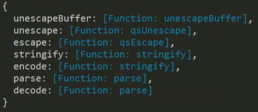
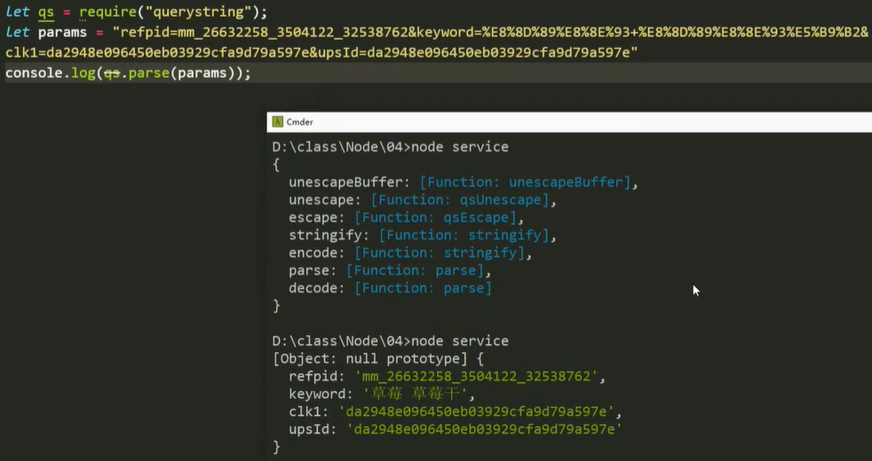
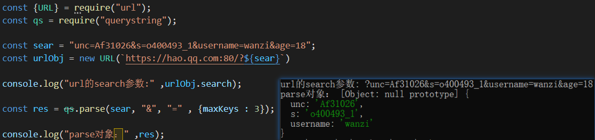
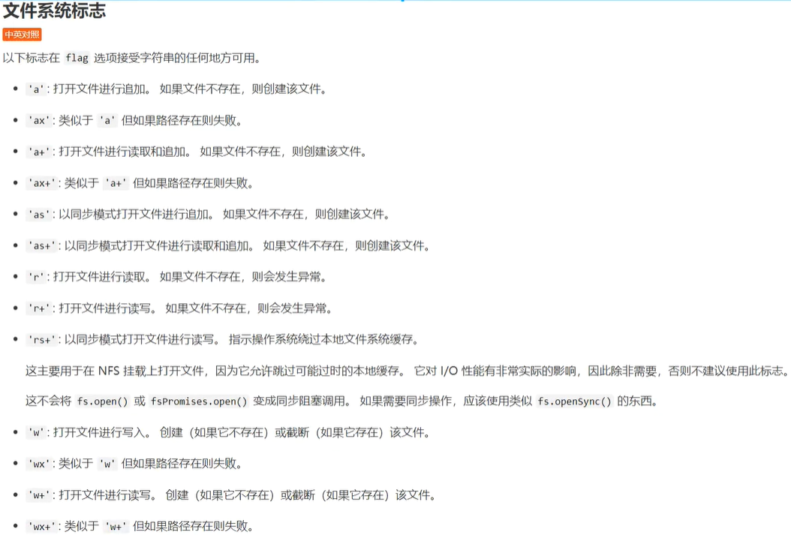

# 核心模块2

### 查询参数【`querystring`模块】

可以理解为 `path` 与 `url` 的配套，主要用来操作`url`中的`search`查询参数片段。

##### `querystring`对象

`querystring`对象：【`query`：查询】

```js
let qs = require("querystring");
console.log(qs);
```

 


##### `parse`方法

使用`parse`方法，可以将在网址中携带的查询参数片段转换为一个对象。 

`parse`的参数：`parse(params，‘&’，‘=’，{maxKeys：2})`，主要用于自定义分隔符的参数片段。

- 第一个参数：要解析的字符串参数片段，一般为`search`中`?`后面的片段；
- 第二个参数：指定切割参数片段的特定字符【默认以`&`符连接】
- 第三个参数：指定每条参数内名与值之间的分隔符【默认以`=`连接】
- 第四个参数：是一个配置对象，允许显示参数的最多个数。【`maxKeys`：参数最大范围】

 

 


##### `stringify`方法

将查询参数对象转换为一段字符串。

参数：

- 一：查询参数对象。
- 二：参数片段的分隔符，默认是`"&"`。
- 三：每条参数片段内名值对的分隔符，默认是`"="`。

意义：后端也可以发起请求【将自己作为客户端，向其他后端发起请求】

翻墙：国内客户端 -- 发起请求 -- 国外`vpn`代理 -- 访问国外网站 -- 访问数据传回`vpn` -- 传到国内客户端

```js
const qs = require("querystring");

let urlObj = {
    username: "wanzi",
    age: 18,
    password: "小仙女"
}

qs.stringify(urlObj); // "username=wanzi&age=18&password=%E5%B0%8F%E4%BB%99%E5%A5%B3"

// 自定义分隔符的参数片段
qs.stringify(urlObj, ";", ":"); // "username:wanzi;age:18;password:%E5%B0%8F%E4%BB%99%E5%A5%B3"
```

<hr>

### 文件系统【`fs`内置模块】

##### 同步异步

`fs`文件读写模块中，每个`API`都有两种方法：同步方法（以`Sync`结尾）、异步方法

读取文件是一个耗时任务，一般采用异步执行：
- 文件读写没有特定顺序的要求时，使用异步方法。
- 有顺序要求时，采用同步方法。（例如：必须在读取到文件后，才能写入）

`fs`模块内同步与异步的区别：

- 异步操作有回调，同步操作则一般直接将结果返回。
- 异步操作回调中错误先行。


#### 读取文件

##### 异步读取【`readFile`】

`readFile`异步方法`（要读取文件的路径，可选的配置对象，回调函数）`

可选配置项：`encoding，flag，signal`【如果配置项是字符串，那么它指定编码格式】

- `encoding`：编码格式，默认是`null`
- `flag`：文件系统标志，默认是`"r"`
- `signal`：允许中止正在进行的`readFile`请求

```js
// 当可选的配置项是一个字符串时，它用来指定编码格式
fs.readFile("./wanzi.txt", "utf-8", (err, buf) => {});

// 使用一个AbortSignal，可以取消正在进行的请求。
const controller = new AbortController(); // 创建一个取消控制器实例
const signal = controller.signal; // 获取实例上的signal属性
fs.readFile("./wanzi.txt", {signal}, (err, buf) => {}); // 打入一个中止标识
// 当想要取消该请求时，调用实例上的abort方法。
controller.abort(); // 立即取消被标识的请求，即：中止该readFile的进行。
```

回调参数`（err，data）`

- `err`：读取文件时，因意外导致的错误信息。【`err`错误对象：读取成功返回`null`】
- `data`：读取到文件后，得到的文件数据。【二进制`Buffer`数据】 
- 文本数据可直接使用字符串化或`"utf-8"`等方法将`data`转码显示，如：`data + ""`

```js
// 读取文本数据时
const fs = require("fs");

// 文件路径，推荐使用path拼接的绝对路径，如：path.join(__dirname, "./wanzi.txt")。
fs.readFile("./wanzi.txt", (err, data) => {
    console.log("错误：", err);
    console.log("数据：", data + ""); // 将二进制数据转换为字符串。
})
```

##### 同步读取【`readFileSync`】

`readFileSync`同步方法`（读取文件的路径，配置对象）`

- 读取成功，直接返回文件数据（二进制数据）
- 配置对象`{encoding：”utf-8“}`。【`encoding`：编码】

```js
// 同步读取，文件数据作为结果被返回
let res = fs.readFileSync(path.join(__dirname, "./wanzi.txt"));
console.log(res);

// 指定文件数据的编码格式
let res = fs.readFileSync(path.join(__dirname, "./wanzi.txt"), {encoding: "utf8"});
```


#### 写入文件

##### 异步写入【`writeFile`】

参数：
- 第一个：写入文件的路径；
- 第二个：数据源（要写入的数据）；【数据源中的转义字符会被解释执行】
- 第三个：配置对象；
  - `encoding`：编码格式，默认值`"utf8"`。如果数据是`buffer`，该项将被忽略。
  - `mode`：默认值"`0o666`"，只影响新创建的文件。
  - `signal`：允许中止正在进行的`writeFile`请求。【取消请求的是“尽力而为”型时，可能仍然会写入一些数据】
  - `flag`：文件系统标志，默认值`"w"`
    - 默认值：‘`w`’。【默认覆盖原文件的数据】
- 第四个：回调函数（`err`）【只有一个参数，保存错误信息】
  - 抛出异常：`throw err`
  - 调试异常：`try catch`

```js
const fs = require("fs");

// 异步写入
fs.writeFile("./wanzi.txt", '明天放假了！', {
    encoding: "utf-8", // 按照指定的编码格式显示文本数据，非文本数据一般不需要。
    flag: "w" // 默认值
}, (err) => {
    if(err) throw err;
    console.log("写入成功");
});

// 读取并写入图片至本地
let imgData = fs.readFileSync("./1.jpg"); // 同步读取文件
fs.writeFile("./wang.jpg", imgData, (err) => {
    if (err) throw err;
    console.log("图片已写入至指定的文件中");
})
```


#### 文件存在【`exists`方法】

判断路径指向的文件是否已存在，返回一个布尔值。

参数：（路径，回调）

- 回调只有一个参数，是判断后的布尔值。

作用：判断该文件是否已存在，避免写入时保存同名文件。

注意：该方法已废弃，请使用`stat`或`access`方法代替。

```js
fs.exists("./aaa.txt", isExists => {
	console.log(isExists); // 该文件存在返回true；不存在返回false
})
```


#### 检查权限【`access`方法】

通过`access`方法，测试用户对`path`指定的文件或目录的权限。

参数：

- 一：路径`path`
- 二：模式`mode`，一个可选整数，用于指定要执行的可访问性检查。
- 三：回调`callback`，只有一个`err`参数。

`mode`的值应该是`fs.constants`的整型值，如：

- `fs.constants.F_OK`：`find`，检查当前目录下是否存在该文件，默认值。
- `fs.constants.R_OK`：`readable`，检查该文件是否可读。
- `fs.constants.W_OK`：`writeable`，检查该文件是否可写。
- `fs.constants.X_OK`：`fs.constants.W_OK | fs.constants.R_OK`，检查该文件是否可读可写。

```js
// 获取access方法和constants属性。
const {access, constants} = require("fs");

const file = "./package.json";

// 检查path指向的文件是否已存在
access(file, constants.F_OK, (err) => {
    console.log(`${file}：${err ? "不存在" : "存在"}`);
})

// 检查文件是否可读
access(file, constants.R_OK, (err) => {
	console.log(`${file}：${err ? "不可读" : "可读"}`);
})

// 检查文件是否可写
access(file, constants.W_OK, (err) => {
	console.log(`${file}：${err ? "不可写" : "可写"}`);
})

// 检查文件是否可读可写
access(file, constants.R_OK, (err) => {
	console.log(`${file}：${err ? "不是" : "是"} 可读可写`);
})
```

注释：

- 在调用`fs.open()、fs.readFile()`或`fs.writeFile()`之前，不要使用`fs.access()`来检查文件的可访问性。

- 这样做会引入竞争条件，因为其他进程可能会在这两个调用之间更改文件的状态。
- 相反，用户代码应该直接打开/读/写文件，并在文件不可访问时处理引发的错误。

```js
// 直接打开并读取文件，并处理可能引发的错误。
import { open, close } from 'fs';

open('myfile', 'r', (err, fd) => {
	if (err) {
    	if (err.code === 'ENOENT') {
			console.error('myfile does not exist');
			return;
    	}
    	throw err;
	}

	try {
    	readMyData(fd);
	} finally {
    	close(fd, (err) => {
			if (err) throw err;
    	});
	}
});

// 直接打开并写入文件
open('myfile', 'wx', (err, fd) => {
	if (err) {
    	if (err.code === 'EEXIST') {
			console.error('myfile already exists');
			return;
		}
		throw err;
	}

	try {
    	writeMyData(fd);
	} finally {
    	close(fd, (err) => {
			if (err) throw err;
		});
	}
});
```

注释：

- 一般来说，只在文件不会被直接使用的情况下才检查文件的可访问性，例如当它的可访问性是来自另一个进程的信号时。
- 在`Windows`上，目录上的访问控制策略（`ACL`）可能会限制对文件或目录的访问。
- 但是，`fs.access()`函数不检查`ACL`，因此即使`ACL`限制用户读写路径，也可能报告该路径是可访问的。


#### 创建目录【`mkdir`方法】

在指定目录中**异步**创建文件夹【`DOS`指令`mkdir：make directory`】【`DOS`：磁盘操作系统】

参数：`（文件路径，配置项，回调）`

- 配置项：当为数字时，它指定模式的权限值。
  - `recursive`：递归，默认值`false`。
  - `mode`：模式，权限值，默认值`0o777`。

注意：

- 当路径指向的目录已经存在时，调用`fs.mkdir()`只会在递归为`false`时导致错误。
- 然而，在`Windows`上，即使使用递归，在根目录上使用`fs.mkdir()`也会导致错误。

```js
// 创建目录，权限值0777：表示当前文件夹可读可写。
fs.mkdir("./images/setting", 0777, err => {
    console.log(err); // 创建成功，返回null
})

// 配置项是一个具有模式属性和递归属性的对象时，指示是否应该创建父目录。
// 无论父级目录./images是否存在，都要创建./images/setting目录。
fs.mkdir("./images/setting", {recursive: true}, err => {
    if (err) throw err;
});

// 在Windows上创建根目录，一定会导致错误。
fs.mkdir('/', { recursive: true }, (err) => {
  // => [Error: EPERM: operation not permitted, mkdir 'C:\']
});
```


#### 读取目录【`readdir`方法】

读取指定目录下的所有子目录和子文件，不包括子孙级文件。

参数：`（路径，配置项，回调）`

- 配置项：`encoding`和`withFileType`。
  - `encoding`：默认值"`utf-8`"。
  - `withFileType`：指定文件数组中是否要包含`<fs.Dirent>`对象，默认值`false`。

- 回调参数：`（err，files）`【`files`：一个保存着子文件和子目录名称的数组】

```js
fs.readdir(__dirname, (err, files) => {
    console.log(err); // 读取成功，返回null
    console.log(files); ['1.jpg', '2.jpg', 'images', 'wanzi.txt'];
})
```


#### 鉴别文件【`stat`方法】

用于鉴别文件和文件夹类型，是文件返回`true`，是文件夹返回`false`。

参数：`（文件或目录的名称，回调）`
- 回调参数：`（err，stats）`【`stats`：文件状态对象】
  - `stats.isFile`方法：判断是否为文件，并返回一个布尔值。
  - `stats.isDirectory`方法：判断是否为目录。

注释：

- 不建议在调用`fs.open()、fs.readFile()`或`fs.writeFile()`之前使用`fs.stat()`来检查文件是否存在。
- 相反，用户代码应该直接打开/读/写文件，并在文件不可用时处理引发的错误。
- 要检查文件是否存在而不是事后对其进行操作，建议使用`fs.access()`。

```js
// 读取目录下的所有子文件及子目录，并区分出文件和目录。
fs.readdir(__dirname, (err, files) => {
    // 遍历文件数组
    files.forEach(v => {
        // 调用stat，判断每个名称。
        fs.stat(v, (err, stats) => {
            // 判断名称指向的是文件还是目录。
            if(stats.isFile()) {
                console.log(v + "是文件");
            } else {
                console.log(v + "是文件夹");
            }
        })
    })
})

// 判断数组中的元素指向的是文件还是目录
const pathsToCheck = ['./txtDir', './txtDir/file.txt'];
for (let i = 0; i < pathsToCheck.length; i++) {
	fs.stat(pathsToCheck[i], (err, stats) => {
        console.log(stats.isDirectory()); // 是否是目录
	});
}
```

