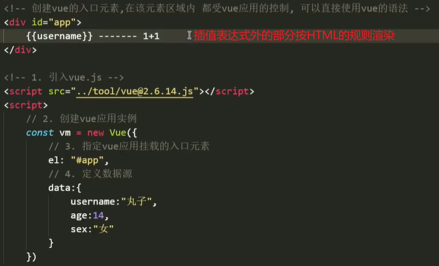

# `Vue2.0`

### 基本认识

概念：

​		`vue`是一套用于构建用户界面的渐进式框架（前端框架）。与其他大型框架不同的是， `vue`被设计为可以自底向上逐层应用。`vue`的核心库只关注视图层，不仅易于上手，还便于与第三方库或既有项目整合。另一方面，当与现代化的工具链以及各种支持类库结合使用时，`vue`也完全能够为复杂的单页应用提供驱动。

优点：

- 传统的网页开发中，操作`DOM`是很浪费资源和性能的一件事，维护也很麻烦。
- 而`Vue`内部封装好了各种方法 / 指令，大大减轻了开发人员对`DOM`的复杂操作。在框架上开发，也更利于维护。
- `Vue`让开发者从复杂的`DOM`操作中解放出来，从而将更多的精力关注到核心逻辑上。

 

特性：

- 数据驱动视图
- 双向数据绑定

### 引入

在`html`中直接引入`Vue`即可使用其语法，常用的方式有：`CDN`引入，`NPM`引入，`CLI`等。

##### `CDN`引入：``
  - 压缩版：``
- 本地引入：将在线引入的文件下载到本地，通过本地引入`vue.js`文件。

其他方式，参考：[`Installation — Vue.js (vuejs.org)`](https://v2.vuejs.org/v2/guide/installation.html)

### 开始使用

##### 创建`Vue`应用实例

`Vue`应用是单页应用，通过`new`的方式创建应用实例。在创建时，写入一个配置对象作为实参传递。

配置属性：

- `el`：`element`的缩写，意为"元素"。
  - 指定当前`Vue`应用挂载的入口元素【`HTML`元素】
  - 一般通过元素的`id`来将应用挂载到指定元素上，如：`el : "#app"`
  - 创建入口元素，如：

  - 在该元素区域内，都受该`Vue`应用的控制，可以直接使用`Vue`的语法。
- `data`：定义`Vue`应用内的数据源，一般是一些初始化的数据。如：`data : {username : "wanzi"}`

##### 获取并渲染数据

在入口元素中，可以直接使用`{{}}`来获取并渲染挂载应用`data`中的数据。如：`{{username}}`

文本插值表达式：`{{}}`，其内部是一个`JS`的执行小环境，可以写入`JS`表达式运算其结果。

 

##### 实例对象

  

定义在配置对象中的属性，都会被直接挂载到`vm`实例对象上。可以直接通过`vm`来访问它们，如：`vm.age或vm._data.age`

 

注意：

- `data`中存在的属性，如：`vm.age`与`vm._data.age`是同步变化的，类似一一映射。
- 而直接在`vm`上添加的属性，不会被添加到`data`中。

##### 插件查看

使用插件，可以直观看到`data`中的数据，通过修改数据实时渲染。

 

##### 数据驱动视图

在入口元素中使用文本插值表达式来获取并渲染`data`中的数据，当需要修改页面视图时，直接修改`data`中的数据即可。

 

特点：单向绑定

- 数据发生变化，就会驱动视图发生变化。
- 数据驱动视图是单向绑定的，修改插值表达式中文本，会改变视图，但不会影响到`data`数据源。
- 一般程序中的`data`源数据，通常作为初始化数据来使用，而双向绑定则可以修改源数据。

 

  

##### 双向数据绑定

双向数据绑定一般用于表单的数据，视图上 / 插值表达式中 的文本发生改变，`data`源数据也会变化，类似于映射关系。

 

 

##### `MVVM`模式

`Vue`原理：`Vue`采用了`MVVM`模式，将页面分为三个部分：`view`视图层`[DOM]`，`model`数据层`[data]`，`viewmodel`控制层`[vm]`。

`VM` 控制层（视图数据层）会同时监听`M`数据层与`V`视图层中的数据变化。当一方更新数据时，会及时通知另一方同步内容。

数据驱动视图原理：`M --> VM --> V`

- `M`数据层修改了某条数据的值，被`VM`层监听到后，`VM`会及时告知`V`视图层修改视图内容。
- 视图层修改文本内容时，只能在视图层渲染。`VM`不会受理视图层的修改，也不会通知数据层同步内容。

双向数据绑定原理：`M <--> VM <--> V`

- `VM`会监听受理`M`层或`V`层的数据变化，当一方更新数据时，会通知另一方及时同步内容。
- M数据层与V视图层相互影响，内容实时同步，类似于一种映射的关系。

### `Vue`指令

`vue`指令是一种模板语法，它可以辅助程序员更好地渲染页面的结构，指令一般以`"v-"`作前缀。

`vue`指令通常是以标签属性的形式存在，通过属性去控制标签内容的渲染。

注意：

- 所有使用`Vue`指令的地方，引号里面都可以被当作一个`vue/JS`的执行小环境，如：`v-text = "JS环境"`
- 在引号里面写的内容会被当作代码来执行，如：`v-text = "丸子" // 报错：丸子 is not defined`
- 因此，指令的值一般为渲染数据的变量，如：`v-text = "username"`

##### 内容渲染指令【`html/text`】

`vue`的内容渲染指令有两个：`v-html`和`v-text`，它们分别是基于`innerHTML`和`innerText`来实现的。

由于这两个内容渲染指令会直接覆盖标签内容，而很少使用。修改内容时，通常使用插值表达式`{{}}`来插入。

使用方法：在标签中，将`v-html`或`v-text`当作属性使用，内容作为值赋予属性，如：`

`

 

文本插值表达式`{{}}`：最终会先将内容转换为字符串形式，再渲染到页面中。

##### 属性绑定指令【`bind`】

`v-bind`指令可以绑定标签的某个属性，去动态修改指定属性的值，相当于`getAttribute/setAttribute`。

使用方法：在标签的属性前，加上`v-bind:`即可绑定该标签属性，如：`<a v-bind:href = "url">跳转</a>`

 

简写：由于`v-bind`指令经常被使用，因此可以直接简写为一个冒号`":"`，如：`

`

  

注意：

​		`v-bind`指令通常用于绑定`class，src，href`等属性，因此提供了一些便捷的写法。

​		`vue`在使用属性绑定指令时，不仅可以绑定属性去修改属性值，还可以绑定修改属性名称。

​		在`:`指令后使用`[]`，让`vue`来提供属性的名称，如：`

 // data : {attr : "class"}`

​		值得一提的是，`HTML`中所有的标签及属性不区分大小写，都会被转换为小写来使用。因此，`vue`中设置的`HTML`属性应全为小写。

- 修改`class`属性值：
  - 配置对象：`{类名1: true,类名2 : false}`，如：`

`
  -  
  -  
  - 还可以将类名放入一个数组中，来绑定这个数组。但这种方式不够灵活，所以很少使用。
- 修改`style`属性值：
  - 样式对象：`{属性1 : 值, 属性2 : 值}`，与`JS`语法一致，如：`styleObj : {width : "100px", height : "200px"}`
  - 在绑定`style`时，可以将多个样式对象放入一个数组中来使用，如：`

`
  -  
  - 注意：
    - 若元素中有原生的`style`行间样式，会与`vue`提供的样式融合。原生的放在最前面，冲突的被`vue`覆盖。
    - 因此，一般将原生的`CSS`作为初始化样式，后续需要动态添加 / 修改的样式使用`vue`来提供。

