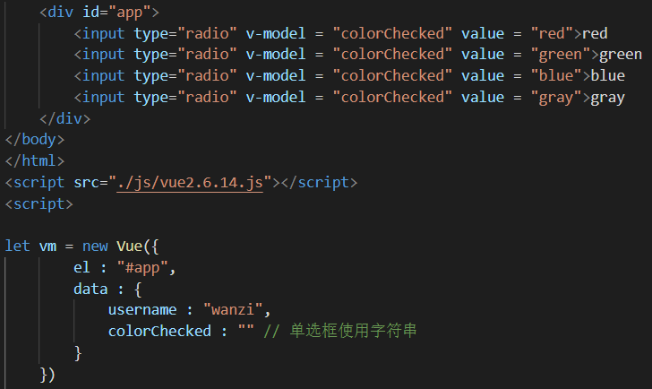
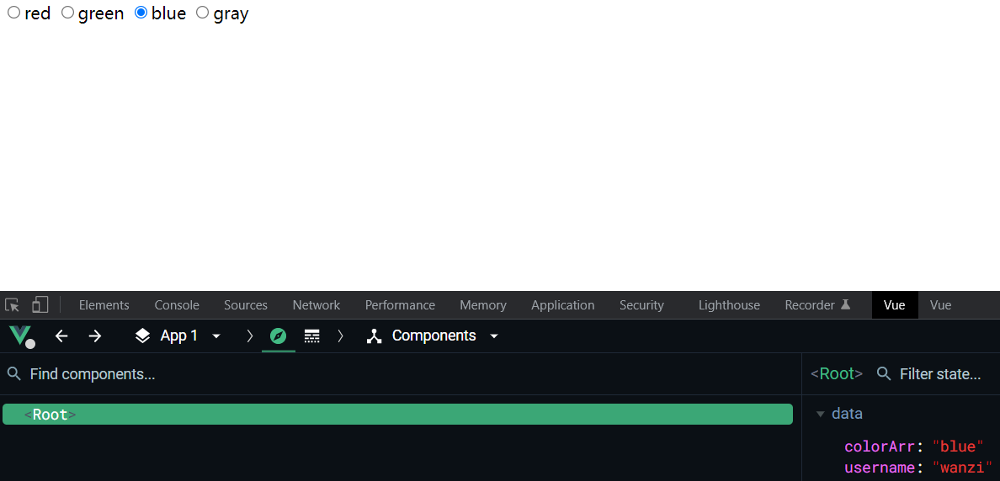
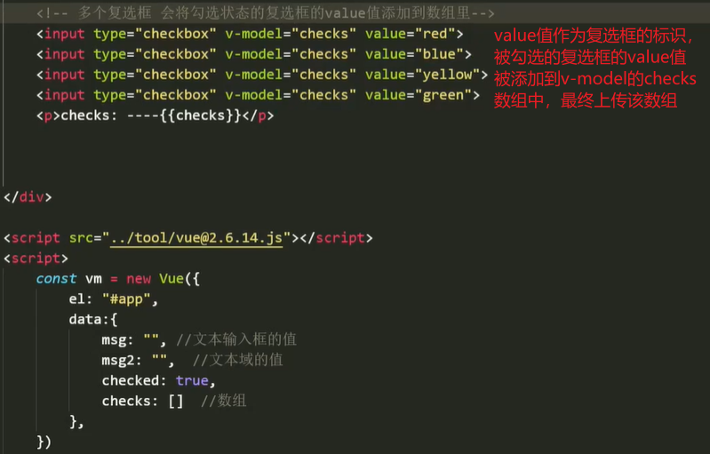
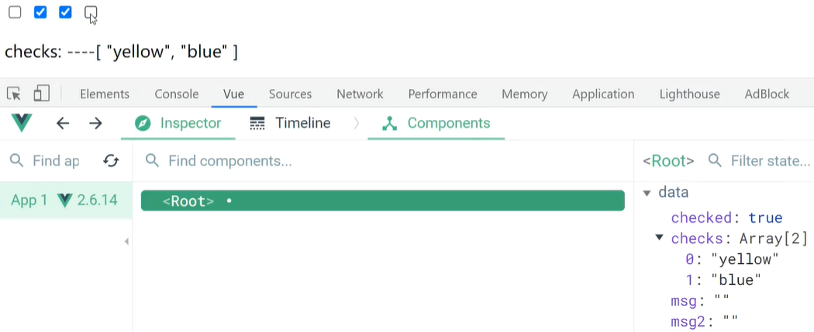
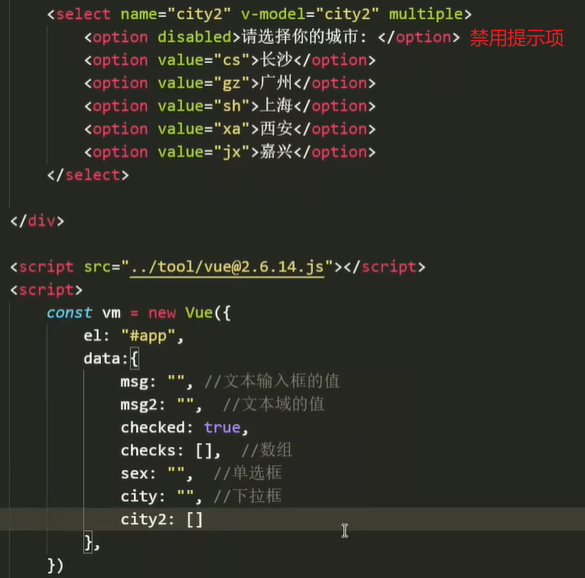
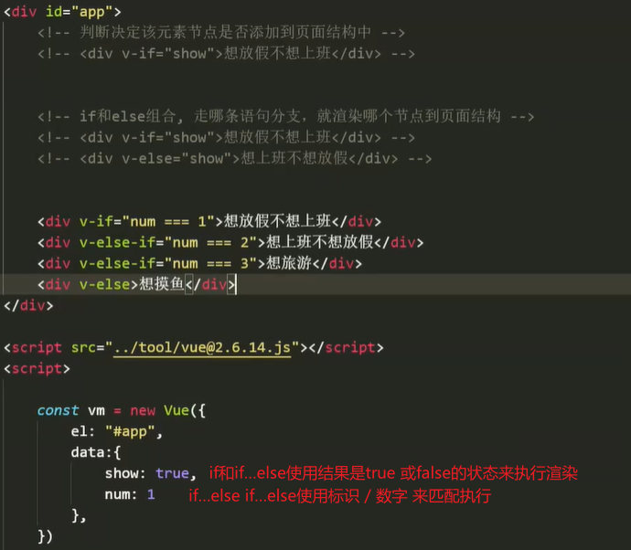
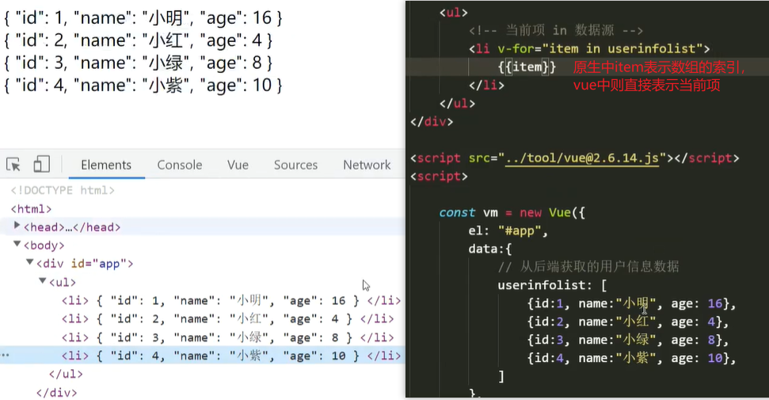
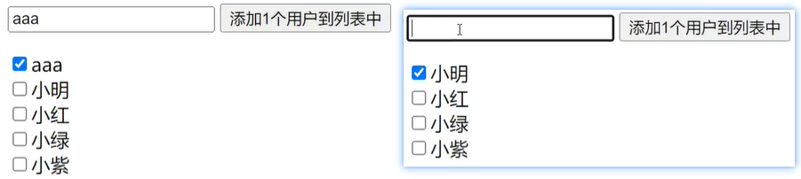
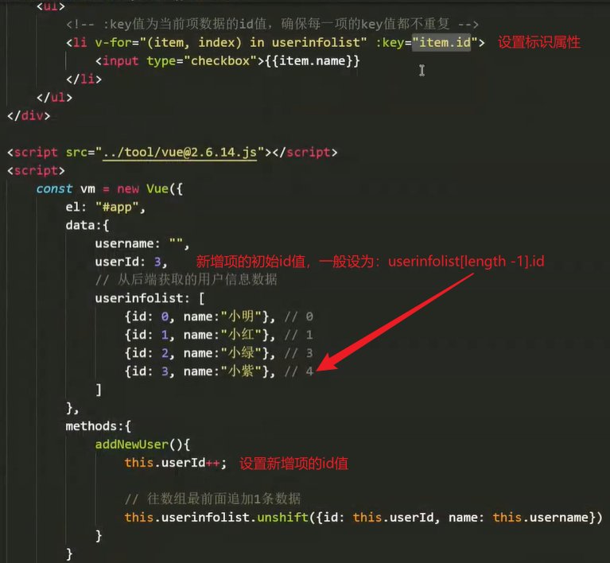
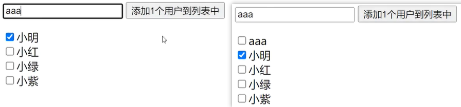

# `vue`指令

### 双向数据绑定指令【v-model】

双向数据绑定指令通常用于绑定表单控件的属性，由用户通过界面控件来输入 / 修改`data`源中的数据。

而`vue`对于不同的表单控件，触发不同的事件监听。

- 通过`input`事件监听`value`值输入的`<input>`和`<textarea>`控件；
- 通过`change`事件监听`checked`状态变化的选择按钮；
- 通过`change`事件监听`value`值变化的选择菜单`select`

使用方法：`v-model = "msg"`【直接将`msg`作为控件中被监听的属性的值】

注释：`v-model` 指令是对 `v-bind` 和 `v-on` 指令的语法封装，是一种自动绑定相应属性的语法糖形式（详见第六节）。


##### 监听value值

- `input`控件
  - 通过`v-model`去实时监听`<input>`控件中`value`属性值的变化。
  - 使用方法：`<input type = "text" v-model = "msg">`
- `textarea`控件
  - 使用方法：`<textarea name = "" v-model = "msg"></textarea>`
  - `input`控件的输入框与`textarea`文本输入域，本质上没太大区别。
  - 在文本区域插值 (`<textarea>{{text}}</textarea>`) 并不会生效，应用 `v-model` 来代替。


##### 监听checked状态

`v-model`绑定的变量值：单选用字符串，多选用数组。

- 单选框：`<input type = "radio">`
  - 使用方法：`<input type = "radio" v-model = "colorChecked" value = "">`
  - 在`HTML`中多个单选框要通过`name`属性来关联，而在`Vue`中通过`v-model`的值来关联即可。
  - 选中按钮的`value`值会被添加到`v-model`绑定的值中，因此`v-model`绑定的初始值一般为一个空字符串。
  -   
  -   
- 复选框：`<input type = "checkbox" value = "">`
  - 使用方法：`<input type = "checkbox" v-model = "checks" value = "">`
  - 多个复选框状态值的变化要通过`v-model`绑定的值关联到一个数组中。
  - 注意：
    - `v-model`绑定的值必须是一个数组，初始为空。
    - 被勾选的复选框的`value`值会被上传到该数组中，用来记录被选中的按钮。
    -  
    -  
- 选择菜单：`<select name = ""><option value = "1">1</option>……</select>`
  - 单选：`<select name = ""></select>`
    - 使用方法：`<select name = "" v-model = ""></select>`
    - `v-model`指令写在`select`组件中，将选择的选项的`value`值存入指令的值中。
  - 多选：`<select name = "" multiple></select>`
    - 使用方法：同上
    -  


#### `v-model`的修饰符

在使用`v-model`时，还可以使用配套的修饰符来使数据更规范。

使用方法：直接在指令后面使用修饰符即可，如：`v-model.trim = ""`


##### 去首尾空格【trim】

将用户输入的文本数据，去除首尾无用的空格，中间的空格无法去除。


##### 转为数字型【number】

在数字输入框中，某些浏览器会将输入的长串数字转换为默认的字符串类型，如：`chrome`。

此时可以使用`number`修饰符，来将输入的纯数字内容基于`parseFloat`方法，转换为数字型。

例如：`<input type = "number" v-model.number = "">`【仅可输入数字，不考虑进制转换】


##### 修改监听事件【lazy】

主要针对文本输入框，将默认的`oninput`监听事件修改为`onchange`事件来监听。

`oninput`监听事件：当使用键盘输入文本后，即可触发监听事件，监听输入的操作。

`onchange`监听事件：当确定输入内容 / 失去焦点后，触发监听事件，监听内容修改。

注意：

- `oninput`监听事件 ： 键盘`input`一次，就触发一次，消耗性能。
- `onchange`事件：等到用户确定好内容后才触发，更适用于日常。

应用：

- 对于要输入一些简短的字符，可以使用`oninput`事件来监听并实时校验提醒用户。
- 而对于要批量修改的大量数据，则使用`onchange`事件来监听，确定好内容后触发。

<hr>

### 条件渲染指令【if / show】

条件渲染指令，通过条件来判断，将哪个数据渲染到页面中去。比如：添加元素节点，显示元素等。

条件渲染指令不需要绑定任何属性，它自身作为属性来使用：设置渲染 / 显示该元素节点的条件。

如：`<div v-if = "true">当条件满足 / 判断为true时，将该元素节点插入到页面中</div>`

条件渲染指令分为两大类：`v-if`和`v-show`【`v-if`导致页面重绘重排，`v-show`则使页面重绘但不重排】

注意：

- `v-if`指令属于插入元素节点和删除元素节点的操作：`true`插入，`false`删除。
- `v-show`指令则是通过元素节点的行间`display`属性来控制元素的显示与隐藏。


##### `v-if`【插入 / 删除】

`v-if`指令：相当于单独的`if`结构语句，`if () {}`

`v-if…v-else`指令：相当于`if…else`结构，`if () {} else {}`

`v-if…v-else-if…v-else`指令：相当于`if() {} else if () {} else {}`结构

注意：

- `else`和`else if`都不能单独存在，必须与`if`结合使用，中间不能断开 / 插入其他语句。
- 当使用`v-else-if`多分支语句时，一般使用数字 / 标识 来作为条件匹配，类似`switch`语句。
- 而`v-else-if`指令，只用作简单处理，复杂的条件判断应封装整合到`methods`属性中。

 

`v-if`的缺点：

- `v-if`条件渲染指令，主要用来在页面结构中插入和删除元素节点。
- 而频繁地操作`DOM`结构，导致页面不断地重绘重排，相当浪费性能。
- 因此，`v-if`条件渲染指令通常只用于一些简单的轻量级的`DOM`操作。

像选项卡这样需要频繁切换局部页面，更新DOM结构的功能，使用`v-show`更合适。


##### `v-show`【显示 / 隐藏】

与`v-if`操作`DOM`结构不同的是，`v-show`指令操作的是已经存在的元素节点，通过`display`控制它们的显示与隐藏。

使用方法：`<div v-show = "true"></div>`【true：显示元素；false：隐藏元素】

优点：与`v-if`区别明显的是，`v-show`不改变`DOM`结构，在复杂的条件渲染中，性能的消耗将远小于`v-if`。

注意，`v-show` 不支持 `<template>` 元素，也不支持 `v-else`。


##### 使用`template`标签

当需要控制渲染页面中的某一区块时，则要为每一个元素都添加条件渲染指令或者外套一层`div`结构。

而这些方式浪费性能或者浪费结构。因此，`vue`自定义了一个`template`临时标签，用来解决此问题。

使用方法：

- 将需要通过条件控制渲染的元素放到`<template>`标签中集中管理，控制临时标签的渲染即可。
- 例如：`<template v-show = "true"><a></a><p></p></template>`

优点：由于`template`标签是`vue`设计的伪标签，它不仅不会被添加到`DOM`结构中，而且能被`vue`语法解析。


##### 使用`key`标识独立

`Vue` 会尽可能高效地渲染元素，通常会复用已有元素而不是从头开始渲染（即：再创建一个相同的新元素来替换旧元素）。

```html
<template v-if="loginType === 'username'">
  	<label>Username</label>
  	<input placeholder="Enter your username">
</template>
<template v-else>
  	<label>Email</label>
  	<input placeholder="Enter your email address">
</template>
```

解析：

- 切换 `loginType` 将不会清除用户已经输入的内容，原输入框的文本内容依然保留。
- 因为两个模板使用了相同的元素，`<input>` 元素不会被替换掉，而仅仅是替换了它的 `placeholder`。

当我们需要打破条件渲染的这种默认的复用规则时，只需给相同的元素添加一个`key`标识属性，表示“这些元素相互独立，无需复用”。

```html
<template v-if="loginType === 'username'">
  	<label>Username</label>
  	<input placeholder="Enter your username" key="username-input">
</template>
<template v-else>
  	<label>Email</label>
  	<input placeholder="Enter your email address" key="email-input">
</template>
```

<hr>

### 列表渲染指令【v-for】

列表渲染指令，通常用于迅速部署列表结构的布局，而不必在意重复的结构搭建。

`v-for`列表渲染指令也不绑定任何属性，自身作为属性来使用，是一个基于`for in`循环的循环指令。

使用方法：`<ul><li v-for = "item in arr"></li></ul> // 无需关键字声明；item代表遍历中的每一项`

 


##### 获取索引

在使用`v-for`指令时，也可以获取到当前项的下标，通过方法传参的形式在`in`操作符的左边传入两个参数。

例如：`<li v-for = "(item, index) in userinfolist">下标：{{index}}</li> // item当前项，index索引`


##### 遍历对象

由于对象没有严格的顺序，每一个`item`并不一定会按对象中的顺序被遍历出来。

而遍历对象可以传递三个参数：（item，key，index）【该对象是一个类数组 (DOM对象)】

例如：`<li v-for = "(item, key, index) in obj"></li> // item当前项，key属性名，index索引`


##### 设置标识属性key

实际开发中，通常在每一个`item`上应设置一个`id`标识，将该值在元素节点上使用`v-bind`绑定到自定义属性中。

例如：`<li v-for = "item in list" :key = "item.id"></li> // 将item的id值绑定到每一项的key属性中`

意义：设置标识属性`key`主要用于维护列表的状态：在动态渲染数据时，保持列表的状态。

例如：在源数组中插入新的项，导致索引重排。此时就需要一个标识来记录当前项的状态，而使用索引是不靠谱的。

```html
<div id = "app">
    <input type = "text" v-model = "username">
    <button @click = "addNewUser()">添加1个用户到列表中</button>
    <ul>
        <li v-for = "item in userinfolist"> // 没添加标识属性，默认以索引记录状态
        	<input type = "checkbox">{{item.name}} 
        </li>
    </ul>
</div>
<script>
	const vm = new Vue({
        el : "#app",
        data : {
            username : "",
            userinfolist : [
                {name : "小明"},
                {name : "小红"},
        		{name : "小绿"},
                {name : "小紫"}
            ]
        },
        methods : {
            addNewUser () {
                this.userinfolist.unshift({name : this.username});
            }
        }
    })
</script>
```

结果：由于每一项无标识属性，默认以索引记录状态。0号位置被选中后，导致选中状态永远处于0号索引，而改变了原本的状态。

 

注意：

- 设置的`id`值一般为数字型，通过自增的方法，就可以方便地为新增项添加`id`值。
- key属性的值类型一般是：数字类型和字符串类型两种。

 

结果：每一项都保持最初的状态

 

虽然静态列表数据的状态不会发生变化，但为列表每一项添加标识属性也是一种良好的开发习惯。

<hr>

### 案例

```html
<head>
    <meta charset='UTF-8'>
    <title>web</title>
    <style>
        * {
            margin: 0;
            padding: 0;
        }

        ul,
        ol {
            list-style: none;
            padding-left: 0;
        }

        body {
            user-select: none;
        }

        table {
            width: 900px;
            border: 1px solid #000;
            text-align: center;
        }

        table td {
            border: 1px solid #000;
        }

        thead td {
            width: 25%;
            line-height: 30px;
            background-color: #f09b9b;
        }

        tbody td img {
            width: 100px;
        }

        .number {
            margin: 0 16px;
        }

        .reduce,
        .add {
            padding: 4px;
            background-color: #c9c6c6;
            cursor: pointer;
        }
    </style>
</head>

<body>
    <div id="app">
        <table>
            <thead>
                <tr>
                    <td>图片</td>
                    <td>单价</td>
                    <td>数量</td>
                    <td>小计</td>
                </tr>
            </thead>
            <tbody>
                <!-- 循环生成4个tr  渲染商品信息 -->
                <tr v-for="(item, index) in goodsInfo" :key="index">
                    <td>
                        
                    </td>
                    <td>
                        <span class="price">{{item.price}}</span>
                    </td>
                    <td>
                        <!-- 为0时候，强制为0     不为0的时候，每次点击要-1 -->
                        <span class="reduce" @click="item.goodsNum -= (item.goodsNum && 1)">-</span>
                        <span class="number">{{item.goodsNum}}</span>
                        <span class="add" @click="item.goodsNum++">+</span>
                    </td>
                    <td>
                        <span class="total">{{item.price * item.goodsNum}}</span>
                    </td>
                </tr>
            </tbody>
            <tfoot>
                <tr>
                    <td>总价: {{priceTotal()}}</td>
                    <td>总数量: {{numTotal()}}</td>
                </tr>
            </tfoot>
        </table>
    </div>

    <script src="https://cdn.jsdelivr.net/npm/vue@2.6.14/dist/vue.js"></script>
    <script>

        const vm = new Vue({
            el: "#app",
            data: {
                // 假设这是从后端获取到的商品数据
                goodsInfo: [
                    {goodsImg: "./images/shop1.jpg", price: 1000, goodsNum: 0},
                    {goodsImg: "./images/shop2.jpg", price: 99, goodsNum: 0},
                    {goodsImg: "./images/shop3.jpg", price: 60, goodsNum: 0},
                    {goodsImg: "./images/shop4.jpg", price: 800, goodsNum: 0},
                ]
            },
            methods:{
                priceTotal(){
                    let tPrice = 0;
                    this.goodsInfo.forEach(item => tPrice += item.price * item.goodsNum)
                    return tPrice; //总价
                },
                numTotal(){
                    let tNum = 0;
                    this.goodsInfo.forEach(item => tNum += item.goodsNum)
                    return tNum; //总数量
                }
            }
        })
    </script>
</body>
```

 
