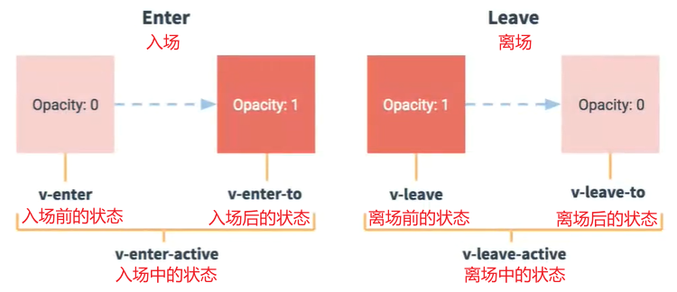

# 动画组件

`Vue`动画主要是为了提高用户体验，添加`CSS`的过渡和动画效果。炫酷的特效可参考学习`three.js`，`animation.js`等。

动画组件支持：条件渲染指令，动态组件，组件根节点。解决了部分`CSS`中无法使用过渡或动画效果的属性，如：`display`等。

`tips`：【支持过渡效果的`CSS`属性，一般都具有可持续变化的值，如数字值】

当插入或删除动画组件中的元素时，`Vue`会自动嗅探目标元素是否应用了`CSS`过渡或动画，如果有，则在恰当时机添加/删除`CSS`类名。


##### 单元素过渡组件【`transition`】

`<transition>`组件中只允许存在一个渲染元素节点，它只会渲染一个节点，因此，通常只有根节点【可以使用`v-else`卡`bug`】

`transition`组件通过添加 / 删除 `CSS`类名，来控制动画的切换。动画包括：入场动画和离场动画。

```html
<transition>
	<div v-if="show"></div> <!-- 保证最终只会渲染一个元素即可 -->
    <div v-else></div>
</transition>
```


##### 过渡的类名

在入场和离场的过渡中，共有6个阶段，即：6个`class`的切换。

1. `v-enter`：入场的开始状态，在元素被插入之前生效，在元素被插入之后的下一帧移除。
2. `v-enter-active`：入场生效时的状态，在元素插入前生效，入场过渡 / 动画结束后移除。该时间段，包含了入场的开始和结束。
3. `v-enter-to`：入场的结束状态，在元素插入之后的下一帧生效（同时移除`v-enter`），在入场动画结束后移除。
4. `v-leave`：离场的开始状态，在离场过渡被触发时立刻生效，下一帧被移除。
5. `v-leave-active`：离场生效时的状态，离场过渡被触发时立刻生效，下一帧被移除。该时间段，包含了离场的开始和结束。
6. `v-leave-to`：离场的结束状态，在离场过渡被触发之后的下一帧生效（同时移除`v-leave`），在离场动画结束后移除。

​                                      

总结：

- `v-enter`和`v-leave-to`的状态一般是一样的。`v-enter-to`与`v-leave`的状态一般也是一样的，但不必设置它们。
- `v-enter-active`和`v-leave-active`分别是入场和离场的时间段，这两个类名主要用来设置过渡/动画的`CSS`效果。

```html
<!--这些类名上的样式，会被作用到transition组件的目标元素上-->
<style>
	.v-enter,
    .v-leave-to {
        opacity : 0;
    }
    .v-enter-active,
    .v-leave-active {
        transition : opacity 5s;
    }
</style>
<div id ="app">
    <transition>
    	<h3 v-if = "show">丸子</h3><!--该元素节点在被添加/删除时，会被添加对应的进出场过渡/动画的类名-->
    </transition>
    <button @click = "show = !show">点击</button>
</div>
<script>
	const vm = new Vue({
        el : "#app",
        data : {
            show : true
        }
    })
</script>
```


##### 具名过渡组件

匿名过渡组件的过渡 / 动画默认以`v-`开头，这会导致多个过渡组件使用同一种样式，无法个性化动画。此时，应设置组件的`name`

使用：在`<transition name = "wanzi">`上设置`name`属性，然后在`CSS`类名中使用`name`值替换`v`，如：`.wanzi-enter`


##### 使用关键帧动画

关键帧动画可以通过设置`0%`和`100%`来定义进出前和进出后的两个状态。因此，应用动画时，一般只设置进出的两个时间段。

```html
<style>
    .wanzi-enter-active {
        animation : in 5s;
    }
    .wanzi-leave-active {
        animation : out 5s;
    }
    @keyframes in {
        0% {
            transform : translateX(0px);
        }
        50% {
            transform : translateX(100px);
        }
    }
    /* 100%默认会回到0%的状态 */
    @keyframes out {
        0% {
            transform : translateX(0px);
        }
        50% {
            transform : translateX(100px);
        }
    }
</style>
<div id ="app">
    <transition name = "wanzi">
    	<h3 v-if = "show">丸子</h3>
    </transition>
    <button @click = "show = !show">点击</button>
</div>
<script>
	const vm = new Vue({
        el : "#app",
        data : {
            show : true
        }
    })
</script>
```


##### 自定义过渡类名

为了避免重名，`Vue`允许在`<transition>`上通过内置属性来自定义过渡类名，直接使用替换后的类名即可。

- `enter-class`：将`v-enter`替换为指定类名，如：`enter-class = "e" ==> .e {}`
- `enter-active-class`：将`v-enter-active`替换为指定类名，如：`enter-active-class = "e-a" ==> .e-a {}`
- `leave-class`：将`v-leave`替换为指定类名，如：`leave-class = "l" ==> .l {}`
- `leave-active-class`：将`v-leave-active`替换为指定类名，如：`leave-active-class = "l-a" ==> .l-a {}`

注意：这些自定义的过渡类名优先级高于普通的`CSS`类名，不会被轻易覆盖，这有利于使用`Vue`的过渡系统以及第三方`CSS`动画库。


##### 自定义属性生效时长

在`<transition>`组件上可以通过`duration`属性，设置过渡类名生效的时长`(ms)`。而不是动画持续的时间，动画时间由`CSS`决定。


##### 单元素过渡组件

`<transition>`组件时单元素过渡组件，其内部只能同时存在一个元素（根元素），只有使用`v-else`时才可放置多个待选项。

```html
// 使用条件渲染指令
<div id = "app">
    <!-- 不使用v-else时 -->
    <transition>
    	<h3 v-if = "true">只能存在一个根元素，存在多个元素会报错</h3>
    </transition>
    <!-- 使用v-else时 -->
    <transition>
    	<h3 v-if = "true" key = "one">只能存在一个根元素，渲染时只渲染一个元素（根元素）</h3>
        <h3 v-else key = "two">此项为待选项，可视为不存在的项</h3>
    </transition>
    <!-- 使用v-else添加待选项，要注意给所有元素添加标识属性key。否则transition无法区分元素，导致没有过渡/动画效果。
	     这是由于，Vue在遇到相同且无标识的标签时，为了效率，不会去添加/删除这个标签，而是直接替换里面的内容。-->
</div>
```

注意：

- 当使用`v-else`往过渡组件中添加待选项后，切换时会出现时间重叠的现象【离场和入场同时发生】
- 此时要在组件上设置`mode`属性，值：`out-in // 上一个out完，下一个再in`【离场结束，才能入场】

```html
// 动态组件使用过渡
<div id = "app">
    <transition mode = "out-in">
    	<component :is = "viewName"></component>
    </transition>
    <button @click = "toggleViewName()">点击切换</button>
</div>
<script>
    Vue.component("child1", {
        template : `<h3>组件1</h3>`
    });
    Vue.component("child2", {
        template : `<h3>组件2</h3>`
    });
	const vm = new Vue({
        el : "#app",
        data : {
            viewName : "child1"
        },
        methods : {
            toggleViewName () {
                this.viewName = (this.viewName !== "child1" ? "child1" : "child2");
            }
        }
    })
</script>
```


##### 列表过渡组件【transition-group】

在`<transition-group>`中，必须在其子元素上使用`v-for`指令，来循环生成`DOM`结构并设置标识属性`key`，否则不会显示任何内容。

注意：`<transition-group>`组件默认会被渲染为一个`<span>`标签，可以使用`tag`属性使其渲染为指定的标签，如：`tag = "div"`

区别：`<transition-group>`与`<transition>`的主要区别在于：

- `<transition-group>`没有`mode`属性，在列表过渡组件上设置`mode = "out-in"`是没有意义的。
- `<transition-group>`必须由标识属性`key`，`key`值必须动态绑定且不得重复。
- `<transition-group>`必须使用`v-for`来循环生成`DOM`元素节点。
- `<transition-group>`默认渲染会为`span`元素，要注意使用`tag`设值使其渲染为指定的元素。

相同：相同点在于，它们的过渡 / 动画效果都是通过`CSS`类名来切换的，且类名只作用在目标元素的节点上。

```html
<div id = "app">
    <transition-group tag = "div">
    	<h3 v-for = "item in h3Arr" :key = "item">{{item}}</h3>
        <h3 v-for = "item in h3Arr" :key = "item">{{item}}</h3>
    </transition-group>
</div>
```

案例：在`li`的最后添加新的项，并触发入场过渡。

```html
<style>
	.v-enter,
    .v-leave-to {
        opacity : 0;
        transform : translateY(-20px);
    }
    .v-enter-active,
    .v-leave-active {
        transition : all 5s;
    }
</style>
<div id = "app">
    <div>
         <label>name：<input type = "text" v-model = "newName"></label>
        <button @click = "addLastLi">点击添加</button>
    </div>
    <transition-group tag = "ul">
    	<li v-for = "item in list" :key = "item.id">{{item.id}}---{{item.name}}</li>
    </transition-group>
</div>
<script>
	const vm = new Vue({
        el : "#app",
        data: {
        	list: [
            	{ id: 0, name : "丸子" },
                { id: 1, name : "樱桃" },
                { id: 2, name : "朱雀" }
            ],
            newId : NaN,
            newName : ""
      	},
        methods: {
            addLastLi() {
                this.newId = this.getNewId;
                this.newId++;
                this.list.push({ id: this.newId, name: this.newName });
            }
        },
        computed : {
            getNewId () {
                return this.list[this.list.length -1].id;
            }
        }
    })
</script>
```


##### 列表排序过渡【`v-move`】

使用列表过渡组件，在尾部插入/删除元素时的过渡/动画效果使用`v-enter-active`和`v-leave-active`来定义。

而在首部插入 / 删除元素时，依旧会有顿挫感。此时，要使用`v-move`来定义进出场的过渡/动画效果。

注意：

- `v-move`主要用来给那些因为添加 / 删除导致其布局位置受影响的兄弟元素，也添加过渡/动画的效果，使整体效果显得更加丝滑。
- 当使用过渡 / 动画效果时，`v-move`只有作用在位置 / 定位发生变化的元素上，才会被激活【但是，要离场的元素必须有定位属性】

```html
// 在任意位置添删数据
<style>
	.v-enter,
    .v-leave-to {
        opacity : 0;
        transform : translateY(-10px);
    }
    .v-enter-active,
    .v-leave-active {
        transition : all 3s;
    }
    .v-leave-active { /* 为离场元素添加定位属性，以激活v-move，使受其影响的兄弟元素具有过渡效果 */
        position : absolute;
    }
    /* 触发v-move的条件：进场元素 -- 位置变化；离场元素 -- 定位变化 */
    .v-move {
        transition : all 3s;
    }
</style>
<div id = "app">
    <div>
        <label>id：<input type = "text" v-model = "newId"></label>
        <label>name：<input type = "text" v-model = "newName"></label>
        <button @click = "addItem">添加一条</button>
    </div>
    <transition-group tag = "ul">
    	<li v-for = "(item, index) in list" :key = "item.id">
            {{item.id}}---{{item.name}}---<button @click = "delItem(index)">删除</button>
        </li>
    </transition-group>
</div>
<script>
	const vm = new Vue({
        el : "#app",
        data : {
            newId : 3,
            newName : '',
            list : [
                {id : 1, name : "丸子"},
                {id : 2, name : "樱桃"},
                {id : 3, name : "朱雀"}
            ]
        },
        methods : {
            addItem () {
                this.list.unshift({id : this.newId, name : this.newName});
                // this.list.splice(2, 0, {id : this.newId, name : this.newName});
            },
            delItem (i) {
                this.list.splice(i, 1);
            }
        }
    })
</script>
```

扩展：`Vue2`官网 --- 列表过渡动画 --- `FLIP`动画实现多维网格的过渡【随机生成网格】
